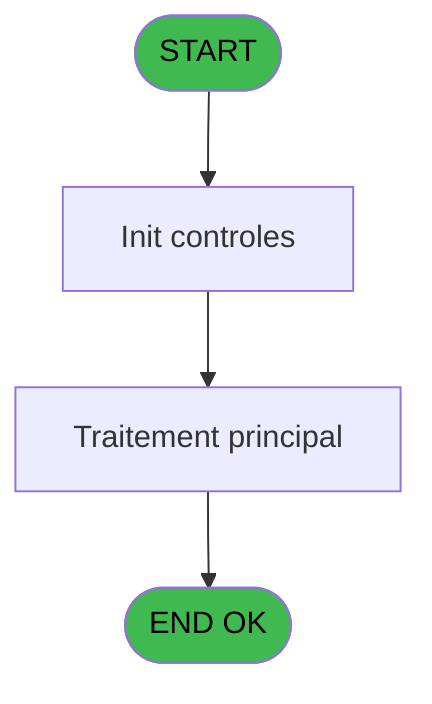

# VIL IDE 218 - Bi  Print versements/retraits

> **Analyse**: Phases 1-4 2026-02-03 21:07 -> 21:08 (18s) | Assemblage 21:08
> **Pipeline**: V7.2 Enrichi
> **Structure**: 4 onglets (Resume | Ecrans | Donnees | Connexions)

<!-- TAB:Resume -->

## 1. FICHE D'IDENTITE

| Attribut | Valeur |
|----------|--------|
| Projet | VIL |
| IDE Position | 218 |
| Nom Programme | Bi  Print versements/retraits |
| Fichier source | `Prg_218.xml` |
| Dossier IDE | Suppr |
| Taches | 1 (1 ecrans visibles) |
| Tables modifiees | 0 |
| Programmes appeles | 0 |
| :warning: Statut | **ORPHELIN_POTENTIEL** |

## 2. DESCRIPTION FONCTIONNELLE

**Bi  Print versements/retraits** assure la gestion complete de ce processus.

Le flux de traitement s'organise en **1 blocs fonctionnels** :

- **Traitement** (1 tache) : traitements metier divers

**Logique metier** : 3 regles identifiees couvrant conditions metier.

## 3. BLOCS FONCTIONNELS

### 3.1 Traitement (1 tache)

Traitements internes.

---

#### 218 - Veuillez patienter .... [[ECRAN]](#ecran-t1)

**Role** : Traitement : Veuillez patienter .....
**Ecran** : 426 x 57 DLU (MDI) | [Voir mockup](#ecran-t1)

## 5. REGLES METIER

3 regles identifiees:

### Autres (3 regles)

#### [RM-001] Si [T]='A' alors 'annul' sinon '')

| Element | Detail |
|---------|--------|
| **Condition** | `[T]='A'` |
| **Si vrai** | 'annul' |
| **Si faux** | '') |
| **Expression source** | Expression 9 : `IF ([T]='A','annul','')` |
| **Exemple** | Si [T]='A' → 'annul'. Sinon → '') |

#### [RM-002] Traitement conditionnel si [V]> est a zero

| Element | Detail |
|---------|--------|
| **Condition** | `[V]>=0` |
| **Si vrai** | [V] |
| **Si faux** | 0) |
| **Expression source** | Expression 10 : `IF ([V]>=0,[V],0)` |
| **Exemple** | Si [V]>=0 → [V]. Sinon → 0) |

#### [RM-003] Si [V]<0 alors ABS ([V]) sinon 0)

| Element | Detail |
|---------|--------|
| **Condition** | `[V]<0` |
| **Si vrai** | ABS ([V]) |
| **Si faux** | 0) |
| **Expression source** | Expression 11 : `IF ([V]<0,ABS ([V]),0)` |
| **Exemple** | Si [V]<0 → ABS ([V]). Sinon → 0) |

## 6. CONTEXTE

- **Appele par**: (aucun)
- **Appelle**: 0 programmes | **Tables**: 3 (W:0 R:1 L:2) | **Taches**: 1 | **Expressions**: 24

<!-- TAB:Ecrans -->

## 8. ECRANS

### 8.1 Forms visibles (1 / 1)

| # | Position | Tache | Nom | Type | Largeur | Hauteur | Bloc |
|---|----------|-------|-----|------|---------|---------|------|
| 1 | 218 | 218 | Veuillez patienter .... | MDI | 426 | 57 | Traitement |

### 8.2 Mockups Ecrans

---

#### 218 - Veuillez patienter ....
**Tache** : [218](#t1) | **Type** : MDI | **Dimensions** : 426 x 57 DLU
**Bloc** : Traitement | **Titre IDE** : Veuillez patienter ....

<!-- FORM-DATA:
{
    "width":  426,
    "vFactor":  8,
    "type":  "MDI",
    "hFactor":  8,
    "controls":  [
                     {
                         "x":  1,
                         "type":  "label",
                         "var":  "",
                         "y":  0,
                         "w":  423,
                         "fmt":  "",
                         "name":  "",
                         "h":  29,
                         "color":  "",
                         "text":  "",
                         "parent":  null
                     },
                     {
                         "x":  118,
                         "type":  "label",
                         "var":  "",
                         "y":  10,
                         "w":  275,
                         "fmt":  "",
                         "name":  "",
                         "h":  8,
                         "color":  "7",
                         "text":  "Impression en cours",
                         "parent":  null
                     },
                     {
                         "x":  1,
                         "type":  "label",
                         "var":  "",
                         "y":  29,
                         "w":  423,
                         "fmt":  "",
                         "name":  "",
                         "h":  27,
                         "color":  "",
                         "text":  "",
                         "parent":  null
                     },
                     {
                         "x":  73,
                         "type":  "label",
                         "var":  "",
                         "y":  39,
                         "w":  285,
                         "fmt":  "",
                         "name":  "",
                         "h":  8,
                         "color":  "",
                         "text":  "Impression  versement/retrait",
                         "parent":  null
                     },
                     {
                         "x":  2,
                         "type":  "image",
                         "var":  "",
                         "y":  2,
                         "w":  72,
                         "fmt":  "",
                         "name":  "",
                         "h":  25,
                         "color":  "",
                         "text":  "",
                         "parent":  null
                     }
                 ],
    "taskId":  "218",
    "height":  57
}
-->

## 9. NAVIGATION

Ecran unique: **Veuillez patienter ....**

### 9.3 Structure hierarchique (1 tache)

| Position | Tache | Type | Dimensions | Bloc |
|----------|-------|------|------------|------|
| **218.1** | [**Veuillez patienter ....** (218)](#t1) [mockup](#ecran-t1) | MDI | 426x57 | Traitement |

### 9.4 Algorigramme

> **Legende**: Vert = START/END OK | Rouge = END KO | Bleu = Decisions
> *Algorigramme auto-genere. Utiliser `/algorigramme` pour une synthese metier detaillee.*

<!-- TAB:Donnees -->

## 10. TABLES

### Tables utilisees (3)

| ID | Nom | Description | Type | R | W | L | Usages |
|----|-----|-------------|------|---|---|---|--------|
| 30 | gm-recherche_____gmr | Index de recherche | DB | R |   |   | 1 |
| 40 | comptable________cte |  | DB |   |   | L | 1 |
| 140 | moyen_paiement___mop |  | DB |   |   | L | 1 |

### Colonnes par table (2 / 1 tables avec colonnes identifiees)

Table 30 - gm-recherche_____gmr (R) - 1 usages

| Lettre | Variable | Acces | Type |
|--------|----------|-------|------|
| A | P0 societe | R | Alpha |
| B | P0 masque cumul | R | Alpha |
| C | P0 date comptable | R | Date |
| D | P0 top exec V/R | R | Alpha |
| E | P0 nom village | R | Alpha |
| F | W0 montant credit | R | Numeric |
| G | W0 montant debit | R | Numeric |
| H | W0 date listing | R | Date |
| I | W0 heure listing | R | Time |
| J | W0 nom village | R | Alpha |
| K | W0 config imp | R | Alpha |

## 11. VARIABLES

### 11.1 Parametres entrants (5)

Variables recues en parametre.

| Lettre | Nom | Type | Usage dans |
|--------|-----|------|-----------|
| A | P0 societe | Alpha | 1x parametre entrant |
| B | P0 masque cumul | Alpha | 1x parametre entrant |
| C | P0 date comptable | Date | 2x parametre entrant |
| D | P0 top exec V/R | Alpha | - |
| E | P0 nom village | Alpha | - |

### 11.2 Variables de travail (6)

Variables internes au programme.

| Lettre | Nom | Type | Usage dans |
|--------|-----|------|-----------|
| F | W0 montant credit | Numeric | - |
| G | W0 montant debit | Numeric | 1x calcul interne |
| H | W0 date listing | Date | 2x calcul interne |
| I | W0 heure listing | Time | - |
| J | W0 nom village | Alpha | - |
| K | W0 config imp | Alpha | - |

## 12. EXPRESSIONS

**24 / 24 expressions decodees (100%)**

### 12.1 Repartition par type

| Type | Expressions | Regles |
|------|-------------|--------|
| CALCULATION | 2 | 0 |
| CONCATENATION | 2 | 0 |
| CONDITION | 7 | 3 |
| CONSTANTE | 1 | 0 |
| DATE | 1 | 0 |
| OTHER | 11 | 0 |

### 12.2 Expressions cles par type

#### CALCULATION (2 expressions)

| Type | IDE | Expression | Regle |
|------|-----|------------|-------|
| CALCULATION | 14 | `W0 date listing [H]+[V]` | - |
| CALCULATION | 13 | `W0 montant debit [G]+[V]` | - |

#### CONCATENATION (2 expressions)

| Type | IDE | Expression | Regle |
|------|-----|------------|-------|
| CONCATENATION | 24 | `MlsTrans ('LISTING VERSEMENTS / RETRAITS DU')&' '&DStr (P0 date comptable [C],'DD/MM/YYYY')` | - |
| CONCATENATION | 22 | `'- '&Str (Page (0,1),'3P0Z0')&' -'` | - |

#### CONDITION (7 expressions)

| Type | IDE | Expression | Regle |
|------|-----|------------|-------|
| CONDITION | 11 | `IF ([V]<0,ABS ([V]),0)` | [RM-003](#rm-RM-003) |
| CONDITION | 10 | `IF ([V]>=0,[V],0)` | [RM-002](#rm-RM-002) |
| CONDITION | 9 | `IF ([T]='A','annul','')` | [RM-001](#rm-RM-001) |
| CONDITION | 21 | `[N]='S' AND [Z]='$CASH' OR [N]='V' AND ([Z]='$CASH' OR [Z]='$PAPER' OR [Z]='$CARD')` | - |
| CONDITION | 23 | `INIGet ('[MAGIC_LOGICAL_NAMES]preview')='O'` | - |
| ... | | *+2 autres* | |

#### CONSTANTE (1 expressions)

| Type | IDE | Expression | Regle |
|------|-----|------------|-------|
| CONSTANTE | 19 | `'O'` | - |

#### DATE (1 expressions)

| Type | IDE | Expression | Regle |
|------|-----|------------|-------|
| DATE | 17 | `Date ()` | - |

#### OTHER (11 expressions)

| Type | IDE | Expression | Regle |
|------|-----|------------|-------|
| OTHER | 8 | `[Q]` | - |
| OTHER | 7 | `[P]` | - |
| OTHER | 12 | `ABS (W0 date listing [H])` | - |
| OTHER | 20 | `[U]` | - |
| OTHER | 18 | `Time ()` | - |
| ... | | *+6 autres* | |

### 12.3 Toutes les expressions (24)

Voir les 24 expressions

#### CALCULATION (2)

| IDE | Expression Decodee |
|-----|-------------------|
| 13 | `W0 montant debit [G]+[V]` |
| 14 | `W0 date listing [H]+[V]` |

#### CONCATENATION (2)

| IDE | Expression Decodee |
|-----|-------------------|
| 22 | `'- '&Str (Page (0,1),'3P0Z0')&' -'` |
| 24 | `MlsTrans ('LISTING VERSEMENTS / RETRAITS DU')&' '&DStr (P0 date comptable [C],'DD/MM/YYYY')` |

#### CONDITION (7)

| IDE | Expression Decodee |
|-----|-------------------|
| 9 | `IF ([T]='A','annul','')` |
| 10 | `IF ([V]>=0,[V],0)` |
| 11 | `IF ([V]<0,ABS ([V]),0)` |
| 15 | `[V]>=0` |
| 16 | `[V]<0` |
| 21 | `[N]='S' AND [Z]='$CASH' OR [N]='V' AND ([Z]='$CASH' OR [Z]='$PAPER' OR [Z]='$CARD')` |
| 23 | `INIGet ('[MAGIC_LOGICAL_NAMES]preview')='O'` |

#### CONSTANTE (1)

| IDE | Expression Decodee |
|-----|-------------------|
| 19 | `'O'` |

#### DATE (1)

| IDE | Expression Decodee |
|-----|-------------------|
| 17 | `Date ()` |

#### OTHER (11)

| IDE | Expression Decodee |
|-----|-------------------|
| 1 | `GetParam ('DTCLOSURE')` |
| 2 | `SetCrsr (1)` |
| 3 | `SetCrsr (2)` |
| 4 | `P0 societe [A]` |
| 5 | `P0 masque cumul [B]` |
| 6 | `P0 date comptable [C]` |
| 7 | `[P]` |
| 8 | `[Q]` |
| 12 | `ABS (W0 date listing [H])` |
| 18 | `Time ()` |
| 20 | `[U]` |

<!-- TAB:Connexions -->

## 13. GRAPHE D'APPELS

### 13.1 Chaine depuis Main (Callers)

**Chemin**: (pas de callers directs)

### 13.2 Callers

| IDE | Nom Programme | Nb Appels |
|-----|---------------|-----------|
| - | (aucun) | - |

### 13.3 Callees (programmes appeles)

### 13.4 Detail Callees avec contexte

| IDE | Nom Programme | Appels | Contexte |
|-----|---------------|--------|----------|
| - | (aucun) | - | - |

## 14. RECOMMANDATIONS MIGRATION

### 14.1 Profil du programme

| Metrique | Valeur | Impact migration |
|----------|--------|-----------------|
| Lignes de logique | 53 | Programme compact |
| Expressions | 24 | Peu de logique |
| Tables WRITE | 0 | Impact faible |
| Sous-programmes | 0 | Peu de dependances |
| Ecrans visibles | 1 | Ecran unique ou traitement batch |
| Code desactive | 0% (0 / 53) | Code sain |
| Regles metier | 3 | Quelques regles a preserver |

### 14.2 Plan de migration par bloc

#### Traitement (1 tache: 1 ecran, 0 traitement)

- **Strategie** : 1 composant(s) UI (Razor/React) avec formulaires et validation.
- Decomposer les taches en services unitaires testables.

### 14.3 Dependances critiques

| Dependance | Type | Appels | Impact |
|------------|------|--------|--------|

---
*Spec DETAILED generee par Pipeline V7.2 - 2026-02-03 21:08*
