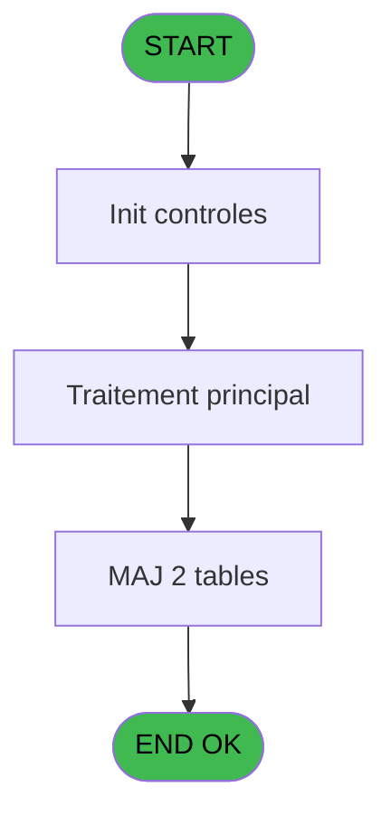
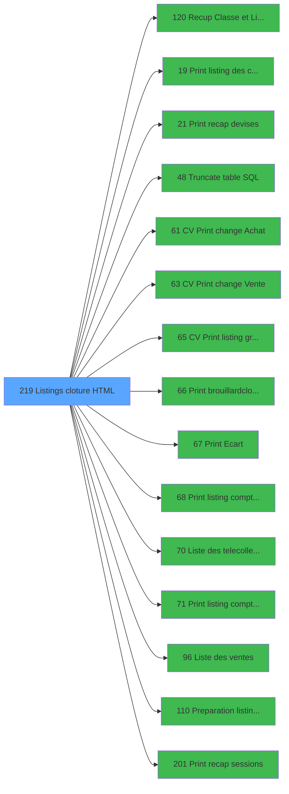

# VIL IDE 219 - Listings cloture HTML

> **Analyse**: Phases 1-4 2026-02-03 21:08 -> 21:08 (18s) | Assemblage 21:08
> **Pipeline**: V7.2 Enrichi
> **Structure**: 4 onglets (Resume | Ecrans | Donnees | Connexions)

<!-- TAB:Resume -->

## 1. FICHE D'IDENTITE

| Attribut | Valeur |
|----------|--------|
| Projet | VIL |
| IDE Position | 219 |
| Nom Programme | Listings cloture HTML |
| Fichier source | `Prg_219.xml` |
| Dossier IDE | Suppr |
| Taches | 6 (0 ecrans visibles) |
| Tables modifiees | 2 |
| Programmes appeles | 15 |
| :warning: Statut | **ORPHELIN_POTENTIEL** |

## 2. DESCRIPTION FONCTIONNELLE

**Listings cloture HTML** assure la gestion complete de ce processus.

Le flux de traitement s'organise en **1 blocs fonctionnels** :

- **Traitement** (6 taches) : traitements metier divers

**Donnees modifiees** : 2 tables en ecriture (comptage_coffre_devise, pv_customer).

Detail : phases du traitement

#### Phase 1 : Traitement (6 taches)

- **219** - CV  Menu listings complement. **[[ECRAN]](#ecran-t1)**
- **219.1** - Versements/Retraits
- **219.2** - Versements/Retraits
- **219.3** - Lecture solde veille
- **219.4** - Gen 341
- **219.5** - Gen 341

Delegue a : [Truncate table SQL (IDE 48)](VIL-IDE-48.md), [Liste des telecollectes (IDE 70)](VIL-IDE-70.md)

#### Tables impactees

| Table | Operations | Role metier |
|-------|-----------|-------------|
| pv_customer | **W** (1 usages) |  |
| comptage_coffre_devise | **W** (1 usages) | Etat du coffre |

## 3. BLOCS FONCTIONNELS

### 3.1 Traitement (6 taches)

Traitements internes.

---

#### 219 - CV  Menu listings complement. [[ECRAN]](#ecran-t1)

**Role** : Tache d'orchestration : point d'entree du programme (6 sous-taches). Coordonne l'enchainement des traitements.
**Ecran** : 342 x 17 DLU (MDI) | [Voir mockup](#ecran-t1)

5 sous-taches directes

| Tache | Nom | Bloc |
|-------|-----|------|
| [219.1](#t2) | Versements/Retraits | Traitement |
| [219.2](#t3) | Versements/Retraits | Traitement |
| [219.3](#t4) | Lecture solde veille | Traitement |
| [219.4](#t5) | Gen 341 | Traitement |
| [219.5](#t6) | Gen 341 | Traitement |

**Delegue a** : [Truncate table SQL (IDE 48)](VIL-IDE-48.md), [Liste des telecollectes (IDE 70)](VIL-IDE-70.md)

---

#### 219.1 - Versements/Retraits

**Role** : Traitement : Versements/Retraits.
**Delegue a** : [Truncate table SQL (IDE 48)](VIL-IDE-48.md), [Liste des telecollectes (IDE 70)](VIL-IDE-70.md)

---

#### 219.2 - Versements/Retraits

**Role** : Traitement : Versements/Retraits.
**Delegue a** : [Truncate table SQL (IDE 48)](VIL-IDE-48.md), [Liste des telecollectes (IDE 70)](VIL-IDE-70.md)

---

#### 219.3 - Lecture solde veille

**Role** : Consultation/chargement : Lecture solde veille.
**Variables liees** : L (W0 solde veille)
**Delegue a** : [Truncate table SQL (IDE 48)](VIL-IDE-48.md), [Liste des telecollectes (IDE 70)](VIL-IDE-70.md)

---

#### 219.4 - Gen 341

**Role** : Traitement : Gen 341.
**Delegue a** : [Truncate table SQL (IDE 48)](VIL-IDE-48.md), [Liste des telecollectes (IDE 70)](VIL-IDE-70.md)

---

#### 219.5 - Gen 341

**Role** : Traitement : Gen 341.
**Delegue a** : [Truncate table SQL (IDE 48)](VIL-IDE-48.md), [Liste des telecollectes (IDE 70)](VIL-IDE-70.md)

## 5. REGLES METIER

*(Aucune regle metier identifiee)*

## 6. CONTEXTE

- **Appele par**: (aucun)
- **Appelle**: 15 programmes | **Tables**: 7 (W:2 R:2 L:3) | **Taches**: 6 | **Expressions**: 15

<!-- TAB:Ecrans -->

## 8. ECRANS

*(Programme sans ecran visible)*

## 9. NAVIGATION

### 9.3 Structure hierarchique (6 taches)

| Position | Tache | Type | Dimensions | Bloc |
|----------|-------|------|------------|------|
| **219.1** | [**CV  Menu listings complement.** (219)](#t1) [mockup](#ecran-t1) | MDI | 342x17 | Traitement |
| 219.1.1 | [Versements/Retraits (219.1)](#t2) | MDI | - | |
| 219.1.2 | [Versements/Retraits (219.2)](#t3) | MDI | - | |
| 219.1.3 | [Lecture solde veille (219.3)](#t4) | MDI | - | |
| 219.1.4 | [Gen 341 (219.4)](#t5) | MDI | - | |
| 219.1.5 | [Gen 341 (219.5)](#t6) | MDI | - | |

### 9.4 Algorigramme

> **Legende**: Vert = START/END OK | Rouge = END KO | Bleu = Decisions
> *Algorigramme auto-genere. Utiliser `/algorigramme` pour une synthese metier detaillee.*

<!-- TAB:Donnees -->

## 10. TABLES

### Tables utilisees (7)

| ID | Nom | Description | Type | R | W | L | Usages |
|----|-----|-------------|------|---|---|---|--------|
| 17 | backup_devises_caisse | Sessions de caisse | DB |   |   | L | 1 |
| 18 | backup_histo_sessions_caisse | Sessions de caisse | DB |   |   | L | 1 |
| 40 | comptable________cte |  | DB | R |   |   | 2 |
| 55 | solde_caisse_____sks | Sessions de caisse | DB | R |   |   | 1 |
| 140 | moyen_paiement___mop |  | DB |   |   | L | 1 |
| 471 | comptage_coffre_devise | Etat du coffre | TMP |   | **W** |   | 1 |
| 508 | pv_customer |  | TMP |   | **W** |   | 1 |

### Colonnes par table (3 / 4 tables avec colonnes identifiees)

Table 40 - comptable________cte (R) - 2 usages

| Lettre | Variable | Acces | Type |
|--------|----------|-------|------|
| D | P0 date comptable | R | Date |

Table 55 - solde_caisse_____sks (R) - 1 usages

| Lettre | Variable | Acces | Type |
|--------|----------|-------|------|
| L | W0 solde veille | R | Numeric |

Table 471 - comptage_coffre_devise (**W**) - 1 usages

| Lettre | Variable | Acces | Type |
|--------|----------|-------|------|
| G | P0 Devise Locale | W | Alpha |
| H | P0 Terminal Coffre 2 | W | Numeric |
| I | P0 Hostname Coffre 2 | W | Unicode |

Table 508 - pv_customer (**W**) - 1 usages

*Table utilisee uniquement en Link ou aucune colonne Real identifiee dans le DataView.*

## 11. VARIABLES

### 11.1 Parametres entrants (9)

Variables recues en parametre.

| Lettre | Nom | Type | Usage dans |
|--------|-----|------|-----------|
| A | P0 societe | Alpha | - |
| B | P0 picture montant | Alpha | - |
| C | P0 nbre decimales | Numeric | 1x parametre entrant |
| D | P0 date comptable | Date | - |
| E | P0 nom village | Alpha | - |
| F | P0 Uni / Bi | Alpha | 2x parametre entrant |
| G | P0 Devise Locale | Alpha | - |
| H | P0 Terminal Coffre 2 | Numeric | - |
| I | P0 Hostname Coffre 2 | Unicode | - |

### 11.2 Variables de travail (10)

Variables internes au programme.

| Lettre | Nom | Type | Usage dans |
|--------|-----|------|-----------|
| K | W0 param bidon | Numeric | - |
| L | W0 solde veille | Numeric | - |
| M | W0 montant versmnt | Numeric | - |
| N | W0 montant retrait | Numeric | - |
| O | W0 pkes recettes | Numeric | - |
| P | W0 pkes depenses | Numeric | - |
| Q | W0 Versement CASH | Numeric | - |
| R | W0 Versement NON CASH | Numeric | - |
| S | W0 Retrait CASH | Numeric | - |
| T | W0 Retrait NON CASH | Numeric | - |

### 11.3 Autres (1)

Variables diverses.

| Lettre | Nom | Type | Usage dans |
|--------|-----|------|-----------|
| J | WP0 masque cumul | Alpha | - |

Toutes les 20 variables (liste complete)

| Cat | Lettre | Nom Variable | Type |
|-----|--------|--------------|------|
| P0 | **A** | P0 societe | Alpha |
| P0 | **B** | P0 picture montant | Alpha |
| P0 | **C** | P0 nbre decimales | Numeric |
| P0 | **D** | P0 date comptable | Date |
| P0 | **E** | P0 nom village | Alpha |
| P0 | **F** | P0 Uni / Bi | Alpha |
| P0 | **G** | P0 Devise Locale | Alpha |
| P0 | **H** | P0 Terminal Coffre 2 | Numeric |
| P0 | **I** | P0 Hostname Coffre 2 | Unicode |
| W0 | **K** | W0 param bidon | Numeric |
| W0 | **L** | W0 solde veille | Numeric |
| W0 | **M** | W0 montant versmnt | Numeric |
| W0 | **N** | W0 montant retrait | Numeric |
| W0 | **O** | W0 pkes recettes | Numeric |
| W0 | **P** | W0 pkes depenses | Numeric |
| W0 | **Q** | W0 Versement CASH | Numeric |
| W0 | **R** | W0 Versement NON CASH | Numeric |
| W0 | **S** | W0 Retrait CASH | Numeric |
| W0 | **T** | W0 Retrait NON CASH | Numeric |
| Autre | **J** | WP0 masque cumul | Alpha |

## 12. EXPRESSIONS

**15 / 15 expressions decodees (100%)**

### 12.1 Repartition par type

| Type | Expressions | Regles |
|------|-------------|--------|
| CONSTANTE | 6 | 0 |
| CAST_LOGIQUE | 1 | 0 |
| CONCATENATION | 1 | 0 |
| CONDITION | 2 | 0 |
| OTHER | 4 | 0 |
| REFERENCE_VG | 1 | 0 |

### 12.2 Expressions cles par type

#### CONSTANTE (6 expressions)

| Type | IDE | Expression | Regle |
|------|-----|------------|-------|
| CONSTANTE | 10 | `'2'` | - |
| CONSTANTE | 13 | `2` | - |
| CONSTANTE | 15 | `'C'` | - |
| CONSTANTE | 1 | `''` | - |
| CONSTANTE | 6 | `'O'` | - |
| ... | | *+1 autres* | |

#### CAST_LOGIQUE (1 expressions)

| Type | IDE | Expression | Regle |
|------|-----|------------|-------|
| CAST_LOGIQUE | 2 | `'TRUE'LOG` | - |

#### CONCATENATION (1 expressions)

| Type | IDE | Expression | Regle |
|------|-----|------------|-------|
| CONCATENATION | 3 | `'N'&Right (' ### ### ### ###'&Left ('.',P0 nbre decimales [C])&Left ('###',P0 nbre decimales [C]),16)&'Z'` | - |

#### CONDITION (2 expressions)

| Type | IDE | Expression | Regle |
|------|-----|------------|-------|
| CONDITION | 5 | `P0 Uni / Bi [F]='B'` | - |
| CONDITION | 4 | `P0 Uni / Bi [F]<>'B'` | - |

#### OTHER (4 expressions)

| Type | IDE | Expression | Regle |
|------|-----|------------|-------|
| OTHER | 11 | `DbDel ('{594,2}'DSOURCE,'')` | - |
| OTHER | 12 | `DbDel ('{595,2}'DSOURCE,'')` | - |
| OTHER | 8 | `DbDel ('{508,2}'DSOURCE,'')` | - |
| OTHER | 9 | `DbName ('{471,2}'DSOURCE)` | - |

#### REFERENCE_VG (1 expressions)

| Type | IDE | Expression | Regle |
|------|-----|------------|-------|
| REFERENCE_VG | 14 | `VG14` | - |

<!-- TAB:Connexions -->

## 13. GRAPHE D'APPELS

### 13.1 Chaine depuis Main (Callers)

**Chemin**: (pas de callers directs)

### 13.2 Callers

| IDE | Nom Programme | Nb Appels |
|-----|---------------|-----------|
| - | (aucun) | - |

### 13.3 Callees (programmes appeles)

### 13.4 Detail Callees avec contexte

| IDE | Nom Programme | Appels | Contexte |
|-----|---------------|--------|----------|
| [120](VIL-IDE-120.md) | Recup Classe et Lib du MOP | 2 | Recuperation donnees |
| [19](VIL-IDE-19.md) |     Print listing des comptes | 1 | Impression ticket/document |
| [21](VIL-IDE-21.md) |     Print recap devises | 1 | Impression ticket/document |
| [48](VIL-IDE-48.md) | Truncate table SQL | 1 | Sous-programme |
| [61](VIL-IDE-61.md) | CV  Print change Achat | 1 | Impression ticket/document |
| [63](VIL-IDE-63.md) | CV  Print change Vente | 1 | Impression ticket/document |
| [65](VIL-IDE-65.md) | CV  Print listing gratuites | 1 | Impression ticket/document |
| [66](VIL-IDE-66.md) | Print brouillard/cloture | 1 | Impression ticket/document |
| [67](VIL-IDE-67.md) | Print Ecart | 1 | Impression ticket/document |
| [68](VIL-IDE-68.md) | Print listing comptable | 1 | Impression ticket/document |
| [70](VIL-IDE-70.md) | Liste des telecollectes | 1 | Configuration impression |
| [71](VIL-IDE-71.md) | Print listing compte cash | 1 | Impression ticket/document |
| [96](VIL-IDE-96.md) | Liste des ventes | 1 | Configuration impression |
| [110](VIL-IDE-110.md) | Preparation listing comptable | 1 | Configuration impression |
| [201](VIL-IDE-201.md) |     Print recap sessions | 1 | Impression ticket/document |

## 14. RECOMMANDATIONS MIGRATION

### 14.1 Profil du programme

| Metrique | Valeur | Impact migration |
|----------|--------|-----------------|
| Lignes de logique | 179 | Programme compact |
| Expressions | 15 | Peu de logique |
| Tables WRITE | 2 | Impact faible |
| Sous-programmes | 15 | Forte dependance |
| Ecrans visibles | 0 | Ecran unique ou traitement batch |
| Code desactive | 0% (0 / 179) | Code sain |
| Regles metier | 0 | Pas de regle identifiee |

### 14.2 Plan de migration par bloc

#### Traitement (6 taches: 1 ecran, 5 traitements)

- **Strategie** : Orchestrateur avec 1 ecrans (Razor/React) et 5 traitements backend (services).
- Les ecrans deviennent des composants UI, les traitements invisibles deviennent des services injectables.
- 15 sous-programme(s) a migrer ou a reutiliser depuis les services existants.
- Decomposer les taches en services unitaires testables.

### 14.3 Dependances critiques

| Dependance | Type | Appels | Impact |
|------------|------|--------|--------|
| comptage_coffre_devise | Table WRITE (Temp) | 1x | Schema + repository |
| pv_customer | Table WRITE (Temp) | 1x | Schema + repository |
| [Recup Classe et Lib du MOP (IDE 120)](VIL-IDE-120.md) | Sous-programme | 2x | Haute - Recuperation donnees |
| [Liste des telecollectes (IDE 70)](VIL-IDE-70.md) | Sous-programme | 1x | Normale - Configuration impression |
| [Print listing comptable (IDE 68)](VIL-IDE-68.md) | Sous-programme | 1x | Normale - Impression ticket/document |
| [Print Ecart (IDE 67)](VIL-IDE-67.md) | Sous-programme | 1x | Normale - Impression ticket/document |
| [Print listing compte cash (IDE 71)](VIL-IDE-71.md) | Sous-programme | 1x | Normale - Impression ticket/document |
| [    Print recap sessions (IDE 201)](VIL-IDE-201.md) | Sous-programme | 1x | Normale - Impression ticket/document |
| [Preparation listing comptable (IDE 110)](VIL-IDE-110.md) | Sous-programme | 1x | Normale - Configuration impression |
| [Liste des ventes (IDE 96)](VIL-IDE-96.md) | Sous-programme | 1x | Normale - Configuration impression |
| [Truncate table SQL (IDE 48)](VIL-IDE-48.md) | Sous-programme | 1x | Normale - Sous-programme |
| [    Print recap devises (IDE 21)](VIL-IDE-21.md) | Sous-programme | 1x | Normale - Impression ticket/document |

---
*Spec DETAILED generee par Pipeline V7.2 - 2026-02-03 21:08*
