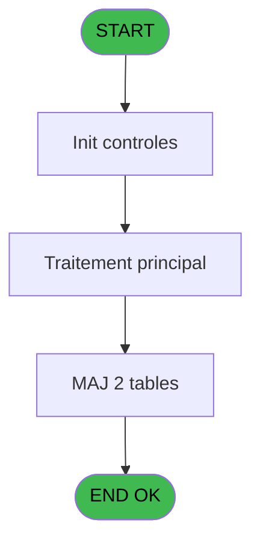
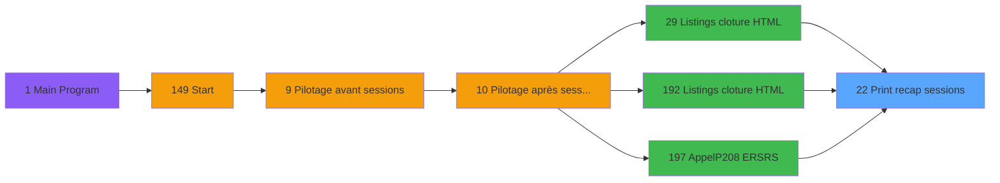

# VIL IDE 22 - Print recap sessions

> **Analyse**: Phases 1-4 2026-02-03 01:08 -> 01:09 (40s) | Assemblage 01:09
> **Pipeline**: V7.2 Enrichi
> **Structure**: 4 onglets (Resume | Ecrans | Donnees | Connexions)

<!-- TAB:Resume -->

## 1. FICHE D'IDENTITE

| Attribut | Valeur |
|----------|--------|
| Projet | VIL |
| IDE Position | 22 |
| Nom Programme | Print recap sessions |
| Fichier source | `Prg_22.xml` |
| Domaine metier | Caisse |
| Taches | 36 (0 ecrans visibles) |
| Tables modifiees | 2 |
| Programmes appeles | 0 |

## 2. DESCRIPTION FONCTIONNELLE

**Print recap sessions** assure la gestion complete de ce processus, accessible depuis [AppelP208 /ERSRS/ (IDE 197)](VIL-IDE-197.md), [    Listings cloture HTML (IDE 29)](VIL-IDE-29.md), [    Listings cloture HTML (IDE 192)](VIL-IDE-192.md).

Le flux de traitement s'organise en **4 blocs fonctionnels** :

- **Traitement** (31 taches) : traitements metier divers
- **Saisie** (2 taches) : ecrans de saisie utilisateur (formulaires, champs, donnees)
- **Impression** (2 taches) : generation de tickets et documents
- **Calcul** (1 tache) : calculs de montants, stocks ou compteurs

**Donnees modifiees** : 2 tables en ecriture (tempo_ecran_mecano, tempo_ecr_menage).

Detail : phases du traitement

#### Phase 1 : Impression (2 taches)

- **22** - Print etat recap sessions
- **22.10** - Edition

#### Phase 2 : Traitement (31 taches)

- **22.1** - Sessions caisses
- **22.1.1** - CAISSE **[[ECRAN]](#ecran-t3)**
- **22.1.2** - Sessions
- **22.1.2.1** - Appro / Remise
- **22.2** - Lecture 18
- **22.2.1** - Upd Recap Sessions
- **22.3.1** - Upd Recap Sessions
- **22.4** - Telecollectes v1
- **22.4.1** - Upd Recap Sessions Boutique
- **22.5** - Recap OD
- **22.6** - Recap Change
- **22.7** - Recap Ecarts
- **22.7.1** - Upd File
- **22.9** - PC Coffre 1
- **22.10.1** - Reception
- **22.10.1.1** - Telecollecte
- **22.10.2** - Autres Services
- **22.11** - Recap Change
- **22.12** - Telecollectes
- **22.12.1** - Upd Recap Sessions Boutique
- **22.1.3** - CAISSE **[[ECRAN]](#ecran-t37)**
- **22.13** - Lecture 18
- **22.13.1** - Upd Recap Sessions
- **22.14.1** - Upd Recap Sessions
- **22.15** - Telecollectes
- **22.15.1** - Upd Recap Sessions Boutique
- **22.16** - Telecollectes v1
- **22.16.1** - Upd Recap Sessions Boutique
- **22.10.1.2** - Sessions caisses
- **22.10.1.2.1** - CAISSE **[[ECRAN]](#ecran-t57)**
- **22.10.1.2.2** - CAISSE **[[ECRAN]](#ecran-t58)**

#### Phase 3 : Saisie (2 taches)

- **22.3** - Lecture Ventes
- **22.14** - Lecture Ventes

#### Phase 4 : Calcul (1 tache)

- **22.8** - Comptage Reception

#### Tables impactees

| Table | Operations | Role metier |
|-------|-----------|-------------|
| tempo_ecran_mecano | R/**W**/L (19 usages) | Table temporaire ecran |
| tempo_ecr_menage | **W**/L (6 usages) | Table temporaire ecran |

## 3. BLOCS FONCTIONNELS

### 3.1 Impression (2 taches)

Generation des documents et tickets.

---

#### 22 - Print etat recap sessions

**Role** : Generation du document : Print etat recap sessions.
**Variables liees** : F (v.nb sessions reception)

---

#### 22.10 - Edition

**Role** : Generation du document : Edition.

### 3.2 Traitement (31 taches)

Traitements internes.

---

#### 22.1 - Sessions caisses

**Role** : Traitement : Sessions caisses.
**Variables liees** : F (v.nb sessions reception)

---

#### 22.1.1 - CAISSE [[ECRAN]](#ecran-t3)

**Role** : Traitement : CAISSE.
**Ecran** : 205 x 89 DLU (MDI) | [Voir mockup](#ecran-t3)

---

#### 22.1.2 - Sessions

**Role** : Traitement : Sessions.
**Variables liees** : F (v.nb sessions reception)

---

#### 22.1.2.1 - Appro / Remise

**Role** : Calcul fidelite/avantage : Appro / Remise.
**Variables liees** : I (v.Appro Coffre 1), J (v.Remise Coffre 1)

---

#### 22.2 - Lecture 18

**Role** : Traitement : Lecture 18.

---

#### 22.2.1 - Upd Recap Sessions

**Role** : Traitement : Upd Recap Sessions.
**Variables liees** : F (v.nb sessions reception)

---

#### 22.3.1 - Upd Recap Sessions

**Role** : Traitement : Upd Recap Sessions.
**Variables liees** : F (v.nb sessions reception)

---

#### 22.4 - Telecollectes v1

**Role** : Traitement : Telecollectes v1.

---

#### 22.4.1 - Upd Recap Sessions Boutique

**Role** : Traitement : Upd Recap Sessions Boutique.
**Variables liees** : F (v.nb sessions reception)

---

#### 22.5 - Recap OD

**Role** : Traitement : Recap OD.

---

#### 22.6 - Recap Change

**Role** : Traitement : Recap Change.

---

#### 22.7 - Recap Ecarts

**Role** : Traitement : Recap Ecarts.

---

#### 22.7.1 - Upd File

**Role** : Traitement : Upd File.

---

#### 22.9 - PC Coffre 1

**Role** : Traitement : PC Coffre 1.
**Variables liees** : B (p.Terminal Coffre 2), C (p.Hostname Coffre 2), G (v.user coffre 2), H (v.PC Coffre 1), I (v.Appro Coffre 1)

---

#### 22.10.1 - Reception

**Role** : Traitement : Reception.
**Variables liees** : F (v.nb sessions reception), S (v.Ecart de ligne RECEPTION ?), W (v.Ecart F.D.R. RECEPTION ?)

---

#### 22.10.1.1 - Telecollecte

**Role** : Traitement : Telecollecte.

---

#### 22.10.2 - Autres Services

**Role** : Traitement : Autres Services.

---

#### 22.11 - Recap Change

**Role** : Traitement : Recap Change.

---

#### 22.12 - Telecollectes

**Role** : Traitement : Telecollectes.

---

#### 22.12.1 - Upd Recap Sessions Boutique

**Role** : Traitement : Upd Recap Sessions Boutique.
**Variables liees** : F (v.nb sessions reception)

---

#### 22.1.3 - CAISSE [[ECRAN]](#ecran-t37)

**Role** : Traitement : CAISSE.
**Ecran** : 205 x 89 DLU (MDI) | [Voir mockup](#ecran-t37)

---

#### 22.13 - Lecture 18

**Role** : Traitement : Lecture 18.

---

#### 22.13.1 - Upd Recap Sessions

**Role** : Traitement : Upd Recap Sessions.
**Variables liees** : F (v.nb sessions reception)

---

#### 22.14.1 - Upd Recap Sessions

**Role** : Traitement : Upd Recap Sessions.
**Variables liees** : F (v.nb sessions reception)

---

#### 22.15 - Telecollectes

**Role** : Traitement : Telecollectes.

---

#### 22.15.1 - Upd Recap Sessions Boutique

**Role** : Traitement : Upd Recap Sessions Boutique.
**Variables liees** : F (v.nb sessions reception)

---

#### 22.16 - Telecollectes v1

**Role** : Traitement : Telecollectes v1.

---

#### 22.16.1 - Upd Recap Sessions Boutique

**Role** : Traitement : Upd Recap Sessions Boutique.
**Variables liees** : F (v.nb sessions reception)

---

#### 22.10.1.2 - Sessions caisses

**Role** : Traitement : Sessions caisses.
**Variables liees** : F (v.nb sessions reception)

---

#### 22.10.1.2.1 - CAISSE [[ECRAN]](#ecran-t57)

**Role** : Traitement : CAISSE.
**Ecran** : 205 x 89 DLU (MDI) | [Voir mockup](#ecran-t57)

---

#### 22.10.1.2.2 - CAISSE [[ECRAN]](#ecran-t58)

**Role** : Traitement : CAISSE.
**Ecran** : 205 x 89 DLU (MDI) | [Voir mockup](#ecran-t58)

### 3.3 Saisie (2 taches)

Ce bloc traite la saisie des donnees de la transaction.

---

#### 22.3 - Lecture Ventes

**Role** : Saisie des donnees : Lecture Ventes.

---

#### 22.14 - Lecture Ventes

**Role** : Saisie des donnees : Lecture Ventes.

### 3.4 Calcul (1 tache)

Calculs metier : montants, stocks, compteurs.

---

#### 22.8 - Comptage Reception

**Role** : Traitement : Comptage Reception.
**Variables liees** : F (v.nb sessions reception), S (v.Ecart de ligne RECEPTION ?), W (v.Ecart F.D.R. RECEPTION ?)

## 5. REGLES METIER

*(Aucune regle metier identifiee)*

## 6. CONTEXTE

- **Appele par**: [AppelP208 /ERSRS/ (IDE 197)](VIL-IDE-197.md), [    Listings cloture HTML (IDE 29)](VIL-IDE-29.md), [    Listings cloture HTML (IDE 192)](VIL-IDE-192.md)
- **Appelle**: 0 programmes | **Tables**: 23 (W:2 R:10 L:16) | **Taches**: 36 | **Expressions**: 9

<!-- TAB:Ecrans -->

## 8. ECRANS

*(Programme sans ecran visible)*

## 9. NAVIGATION

### 9.3 Structure hierarchique (36 taches)

| Position | Tache | Type | Dimensions | Bloc |
|----------|-------|------|------------|------|
| **22.1** | [**Print etat recap sessions** (22)](#t1) | MDI | - | Impression |
| 22.1.1 | [Edition (22.10)](#t18) | MDI | - | |
| **22.2** | [**Sessions caisses** (22.1)](#t2) | MDI | - | Traitement |
| 22.2.1 | [CAISSE (22.1.1)](#t3) [mockup](#ecran-t3) | MDI | 205x89 | |
| 22.2.2 | [Sessions (22.1.2)](#t4) | MDI | - | |
| 22.2.3 | [Appro / Remise (22.1.2.1)](#t5) | MDI | - | |
| 22.2.4 | [Lecture 18 (22.2)](#t6) | MDI | - | |
| 22.2.5 | [Upd Recap Sessions (22.2.1)](#t7) | MDI | - | |
| 22.2.6 | [Upd Recap Sessions (22.3.1)](#t9) | MDI | - | |
| 22.2.7 | [Telecollectes v1 (22.4)](#t10) | MDI | - | |
| 22.2.8 | [Upd Recap Sessions Boutique (22.4.1)](#t11) | MDI | - | |
| 22.2.9 | [Recap OD (22.5)](#t12) | MDI | - | |
| 22.2.10 | [Recap Change (22.6)](#t13) | MDI | - | |
| 22.2.11 | [Recap Ecarts (22.7)](#t14) | MDI | - | |
| 22.2.12 | [Upd File (22.7.1)](#t15) | MDI | - | |
| 22.2.13 | [PC Coffre 1 (22.9)](#t17) | MDI | - | |
| 22.2.14 | [Reception (22.10.1)](#t19) | MDI | - | |
| 22.2.15 | [Telecollecte (22.10.1.1)](#t20) | MDI | - | |
| 22.2.16 | [Autres Services (22.10.2)](#t21) | MDI | - | |
| 22.2.17 | [Recap Change (22.11)](#t30) | MDI | - | |
| 22.2.18 | [Telecollectes (22.12)](#t33) | MDI | - | |
| 22.2.19 | [Upd Recap Sessions Boutique (22.12.1)](#t34) | MDI | - | |
| 22.2.20 | [CAISSE (22.1.3)](#t37) [mockup](#ecran-t37) | MDI | 205x89 | |
| 22.2.21 | [Lecture 18 (22.13)](#t40) | MDI | - | |
| 22.2.22 | [Upd Recap Sessions (22.13.1)](#t41) | MDI | - | |
| 22.2.23 | [Upd Recap Sessions (22.14.1)](#t45) | MDI | - | |
| 22.2.24 | [Telecollectes (22.15)](#t48) | MDI | - | |
| 22.2.25 | [Upd Recap Sessions Boutique (22.15.1)](#t49) | MDI | - | |
| 22.2.26 | [Telecollectes v1 (22.16)](#t52) | MDI | - | |
| 22.2.27 | [Upd Recap Sessions Boutique (22.16.1)](#t53) | MDI | - | |
| 22.2.28 | [Sessions caisses (22.10.1.2)](#t56) | MDI | - | |
| 22.2.29 | [CAISSE (22.10.1.2.1)](#t57) [mockup](#ecran-t57) | MDI | 205x89 | |
| 22.2.30 | [CAISSE (22.10.1.2.2)](#t58) [mockup](#ecran-t58) | MDI | 205x89 | |
| **22.3** | [**Lecture Ventes** (22.3)](#t8) | MDI | - | Saisie |
| 22.3.1 | [Lecture Ventes (22.14)](#t44) | MDI | - | |
| **22.4** | [**Comptage Reception** (22.8)](#t16) | MDI | - | Calcul |

### 9.4 Algorigramme

> **Legende**: Vert = START/END OK | Rouge = END KO | Bleu = Decisions
> *Algorigramme auto-genere. Utiliser `/algorigramme` pour une synthese metier detaillee.*

<!-- TAB:Donnees -->

## 10. TABLES

### Tables utilisees (23)

| ID | Nom | Description | Type | R | W | L | Usages |
|----|-----|-------------|------|---|---|---|--------|
| 40 | comptable________cte |  | DB | R |   |   | 2 |
| 44 | change___________chg |  | DB | R |   |   | 1 |
| 50 | moyens_reglement_mor | Reglements / paiements | DB | R |   |   | 1 |
| 54 | pieces_caisse____pks | Sessions de caisse | DB | R |   |   | 1 |
| 66 | imputations______imp |  | DB |   |   | L | 1 |
| 67 | tables___________tab |  | DB | R |   | L | 9 |
| 69 | initialisation___ini |  | DB |   |   | L | 1 |
| 147 | change_vente_____chg | Donnees de ventes | DB | R |   |   | 1 |
| 228 | detail_coffre | Etat du coffre | DB |   |   | L | 1 |
| 234 | ecarts |  | DB | R |   |   | 1 |
| 239 | total_od |  | DB |   |   | L | 1 |
| 241 | pointage_appro_remise |  | DB |   |   | L | 1 |
| 246 | histo_sessions_caisse | Sessions de caisse | DB | R |   |   | 3 |
| 249 | histo_sessions_caisse_detail | Sessions de caisse | DB | R |   | L | 7 |
| 255 | suivi_pdc |  | DB |   |   | L | 1 |
| 263 | vente | Donnees de ventes | DB |   |   | L | 2 |
| 351 | sessions_ouvertes | Sessions de caisse | DB |   |   | L | 2 |
| 471 | comptage_coffre_devise | Etat du coffre | TMP |   |   | L | 6 |
| 554 | import_circuit___imc |  | TMP |   |   | L | 4 |
| 594 | tempo_ecran_mecano | Table temporaire ecran | TMP | R | **W** | L | 19 |
| 595 | tempo_ecr_menage | Table temporaire ecran | TMP |   | **W** | L | 6 |
| 734 | arc_pv_cust_packages |  | DB |   |   | L | 4 |
| 876 | log_express_co |  | DB |   |   | L | 4 |

### Colonnes par table (14 / 11 tables avec colonnes identifiees)

Table 40 - comptable________cte (R) - 2 usages

| Lettre | Variable | Acces | Type |
|--------|----------|-------|------|
| A | v.retour terminal IMS | R | Logical |
| B | v.is user reception | R | Logical |
| C | v.is user reception | R | Logical |

Table 44 - change___________chg (R) - 1 usages

| Lettre | Variable | Acces | Type |
|--------|----------|-------|------|
| H | v.total Change | R | Numeric |

Table 50 - moyens_reglement_mor (R) - 1 usages

| Lettre | Variable | Acces | Type |
|--------|----------|-------|------|
| A | p.Date Comptable | R | Date |
| B | p.Terminal Coffre 2 | R | Numeric |
| C | p.Hostname Coffre 2 | R | Unicode |
| D | p.Societe | R | Alpha |
| E | p.Masque | R | Alpha |
| F | v.nb sessions reception | R | Numeric |
| G | v.user coffre 2 | R | Alpha |
| H | v.PC Coffre 1 | R | Numeric |
| I | v.Appro Coffre 1 | R | Numeric |
| J | v.Remise Coffre 1 | R | Numeric |
| K | v.Ecart Coffre 1 | R | Numeric |
| L | V.existe mop WECH ? | R | Logical |

Table 54 - pieces_caisse____pks (R) - 1 usages

*Table utilisee uniquement en Link ou aucune colonne Real identifiee dans le DataView.*

Table 67 - tables___________tab (R/L) - 9 usages

| Lettre | Variable | Acces | Type |
|--------|----------|-------|------|
| A | v.retour terminal IMS | R | Logical |
| B | v.is user reception | R | Logical |
| C | v.is user reception | R | Logical |

Table 147 - change_vente_____chg (R) - 1 usages

| Lettre | Variable | Acces | Type |
|--------|----------|-------|------|
| F | v.total Vente Cash | R | Numeric |
| H | v.total Change | R | Numeric |

Table 234 - ecarts (R) - 1 usages

*Table utilisee uniquement en Link ou aucune colonne Real identifiee dans le DataView.*

Table 246 - histo_sessions_caisse (R) - 3 usages

| Lettre | Variable | Acces | Type |
|--------|----------|-------|------|
| F | v.nb sessions reception | R | Numeric |

Table 249 - histo_sessions_caisse_detail (R/L) - 7 usages

| Lettre | Variable | Acces | Type |
|--------|----------|-------|------|
| F | v.nb sessions reception | R | Numeric |

Table 594 - tempo_ecran_mecano (R/**W**/L) - 19 usages

| Lettre | Variable | Acces | Type |
|--------|----------|-------|------|
| A | V.Existe utiisateur coffre 2 ? | W | Logical |
| B | v.total OD | W | Numeric |
| C | v.total FDR Init | W | Numeric |
| D | v.total FDR Final | W | Numeric |
| E | v.total Vers/Ret Cash | W | Numeric |
| F | v.total Vente Cash | W | Numeric |
| G | v.total Solde Cash | W | Numeric |
| H | v.total Change | W | Numeric |
| I | v.total Appro | W | Numeric |
| J | v.total Remise | W | Numeric |
| K | v.total Ecart | W | Numeric |
| L | v.total AMEX | W | Numeric |
| M | v.total CCAU | W | Numeric |
| N | v.total Visa | W | Numeric |
| O | v.total WECH | W | Numeric |
| P | v.total UNIO | W | Numeric |
| Q | v.total CC | W | Numeric |
| R | v.Ecart de ligne COFFRE2 | W | Logical |
| S | v.Ecart de ligne RECEPTION ? | W | Logical |
| T | v.FDR fermeture de la veille | W | Numeric |
| U | v.Session de Fermeture prec exi | W | Logical |
| V | v.Ecart F.D.R. COFFRE2 | W | Logical |
| W | v.Ecart F.D.R. RECEPTION ? | W | Logical |

Table 595 - tempo_ecr_menage (**W**/L) - 6 usages

*Table utilisee uniquement en Link ou aucune colonne Real identifiee dans le DataView.*

## 11. VARIABLES

### 11.1 Parametres entrants (5)

Variables recues du programme appelant ([AppelP208 /ERSRS/ (IDE 197)](VIL-IDE-197.md)).

| Lettre | Nom | Type | Usage dans |
|--------|-----|------|-----------|
| A | p.Date Comptable | Date | 2x parametre entrant |
| B | p.Terminal Coffre 2 | Numeric | - |
| C | p.Hostname Coffre 2 | Unicode | [22.9](#t17) |
| D | p.Societe | Alpha | - |
| E | p.Masque | Alpha | - |

### 11.2 Variables de session (18)

Variables persistantes pendant toute la session.

| Lettre | Nom | Type | Usage dans |
|--------|-----|------|-----------|
| F | v.nb sessions reception | Numeric | - |
| G | v.user coffre 2 | Alpha | - |
| H | v.PC Coffre 1 | Numeric | - |
| I | v.Appro Coffre 1 | Numeric | - |
| J | v.Remise Coffre 1 | Numeric | - |
| K | v.Ecart Coffre 1 | Numeric | - |
| L | V.existe mop WECH ? | Logical | - |
| M | v.total CCAU | Numeric | - |
| N | v.total Visa | Numeric | - |
| O | v.total WECH | Numeric | - |
| P | v.total UNIO | Numeric | - |
| Q | v.total CC | Numeric | - |
| R | v.Ecart de ligne COFFRE2 | Logical | - |
| S | v.Ecart de ligne RECEPTION ? | Logical | - |
| T | v.FDR fermeture de la veille | Numeric | - |
| U | v.Session de Fermeture prec exi | Logical | - |
| V | v.Ecart F.D.R. COFFRE2 | Logical | - |
| W | v.Ecart F.D.R. RECEPTION ? | Logical | - |

Toutes les 23 variables (liste complete)

| Cat | Lettre | Nom Variable | Type |
|-----|--------|--------------|------|
| P0 | **A** | p.Date Comptable | Date |
| P0 | **B** | p.Terminal Coffre 2 | Numeric |
| P0 | **C** | p.Hostname Coffre 2 | Unicode |
| P0 | **D** | p.Societe | Alpha |
| P0 | **E** | p.Masque | Alpha |
| V. | **F** | v.nb sessions reception | Numeric |
| V. | **G** | v.user coffre 2 | Alpha |
| V. | **H** | v.PC Coffre 1 | Numeric |
| V. | **I** | v.Appro Coffre 1 | Numeric |
| V. | **J** | v.Remise Coffre 1 | Numeric |
| V. | **K** | v.Ecart Coffre 1 | Numeric |
| V. | **L** | V.existe mop WECH ? | Logical |
| V. | **M** | v.total CCAU | Numeric |
| V. | **N** | v.total Visa | Numeric |
| V. | **O** | v.total WECH | Numeric |
| V. | **P** | v.total UNIO | Numeric |
| V. | **Q** | v.total CC | Numeric |
| V. | **R** | v.Ecart de ligne COFFRE2 | Logical |
| V. | **S** | v.Ecart de ligne RECEPTION ? | Logical |
| V. | **T** | v.FDR fermeture de la veille | Numeric |
| V. | **U** | v.Session de Fermeture prec exi | Logical |
| V. | **V** | v.Ecart F.D.R. COFFRE2 | Logical |
| V. | **W** | v.Ecart F.D.R. RECEPTION ? | Logical |

## 12. EXPRESSIONS

**9 / 9 expressions decodees (100%)**

### 12.1 Repartition par type

| Type | Expressions | Regles |
|------|-------------|--------|
| CALCULATION | 1 | 0 |
| CONSTANTE | 2 | 0 |
| OTHER | 2 | 0 |
| REFERENCE_VG | 2 | 0 |
| NEGATION | 2 | 0 |

### 12.2 Expressions cles par type

#### CALCULATION (1 expressions)

| Type | IDE | Expression | Regle |
|------|-----|------------|-------|
| CALCULATION | 3 | `p.Date Comptable [A]-1` | - |

#### CONSTANTE (2 expressions)

| Type | IDE | Expression | Regle |
|------|-----|------------|-------|
| CONSTANTE | 5 | `'WECH'` | - |
| CONSTANTE | 2 | `'CHGE'` | - |

#### OTHER (2 expressions)

| Type | IDE | Expression | Regle |
|------|-----|------------|-------|
| OTHER | 4 | `p.Date Comptable [A]` | - |
| OTHER | 1 | `p.Hostname Coffre 2 [C]` | - |

#### REFERENCE_VG (2 expressions)

| Type | IDE | Expression | Regle |
|------|-----|------------|-------|
| REFERENCE_VG | 9 | `VG39` | - |
| REFERENCE_VG | 6 | `VG25` | - |

#### NEGATION (2 expressions)

| Type | IDE | Expression | Regle |
|------|-----|------------|-------|
| NEGATION | 8 | `NOT VG39` | - |
| NEGATION | 7 | `NOT VG25` | - |

<!-- TAB:Connexions -->

## 13. GRAPHE D'APPELS

### 13.1 Chaine depuis Main (Callers)

Main -> ... -> [AppelP208 /ERSRS/ (IDE 197)](VIL-IDE-197.md) -> **Print recap sessions (IDE 22)**

Main -> ... -> [    Listings cloture HTML (IDE 29)](VIL-IDE-29.md) -> **Print recap sessions (IDE 22)**

Main -> ... -> [    Listings cloture HTML (IDE 192)](VIL-IDE-192.md) -> **Print recap sessions (IDE 22)**

### 13.2 Callers

| IDE | Nom Programme | Nb Appels |
|-----|---------------|-----------|
| [197](VIL-IDE-197.md) | AppelP208 /ERSRS/ | 2 |
| [29](VIL-IDE-29.md) |     Listings cloture HTML | 1 |
| [192](VIL-IDE-192.md) |     Listings cloture HTML | 1 |

### 13.3 Callees (programmes appeles)

### 13.4 Detail Callees avec contexte

| IDE | Nom Programme | Appels | Contexte |
|-----|---------------|--------|----------|
| - | (aucun) | - | - |

## 14. RECOMMANDATIONS MIGRATION

### 14.1 Profil du programme

| Metrique | Valeur | Impact migration |
|----------|--------|-----------------|
| Lignes de logique | 938 | Programme volumineux |
| Expressions | 9 | Peu de logique |
| Tables WRITE | 2 | Impact faible |
| Sous-programmes | 0 | Peu de dependances |
| Ecrans visibles | 0 | Ecran unique ou traitement batch |
| Code desactive | 0% (0 / 938) | Code sain |
| Regles metier | 0 | Pas de regle identifiee |

### 14.2 Plan de migration par bloc

#### Impression (2 taches: 0 ecran, 2 traitements)

- **Strategie** : Templates HTML -> PDF via wkhtmltopdf ou Puppeteer.
- `PrintService` injectable avec choix imprimante

#### Traitement (31 taches: 4 ecrans, 27 traitements)

- **Strategie** : Orchestrateur avec 4 ecrans (Razor/React) et 27 traitements backend (services).
- Les ecrans deviennent des composants UI, les traitements invisibles deviennent des services injectables.
- Decomposer les taches en services unitaires testables.

#### Saisie (2 taches: 0 ecran, 2 traitements)

- **Strategie** : Formulaire React/Blazor avec validation Zod/FluentValidation.
- Validation temps reel cote client + serveur

#### Calcul (1 tache: 0 ecran, 1 traitement)

- **Strategie** : Services de calcul purs (Domain Services).
- Migrer la logique de calcul (stock, compteurs, montants)

### 14.3 Dependances critiques

| Dependance | Type | Appels | Impact |
|------------|------|--------|--------|
| tempo_ecran_mecano | Table WRITE (Temp) | 12x | Schema + repository |
| tempo_ecr_menage | Table WRITE (Temp) | 1x | Schema + repository |

---
*Spec DETAILED generee par Pipeline V7.2 - 2026-02-03 01:09*
