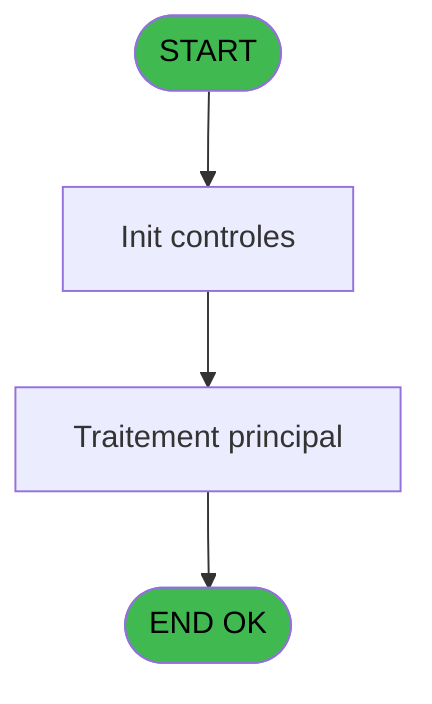

# VIL IDE 220 - Pilotage Hebdo

> **Analyse**: Phases 1-4 2026-02-03 21:08 -> 21:08 (18s) | Assemblage 21:08
> **Pipeline**: V7.2 Enrichi
> **Structure**: 4 onglets (Resume | Ecrans | Donnees | Connexions)

<!-- TAB:Resume -->

## 1. FICHE D'IDENTITE

| Attribut | Valeur |
|----------|--------|
| Projet | VIL |
| IDE Position | 220 |
| Nom Programme | Pilotage Hebdo |
| Fichier source | `Prg_220.xml` |
| Dossier IDE | Suppr |
| Taches | 14 (0 ecrans visibles) |
| Tables modifiees | 0 |
| Programmes appeles | 0 |

## 2. DESCRIPTION FONCTIONNELLE

**Pilotage Hebdo** assure la gestion complete de ce processus, accessible depuis [Lanceur (IDE 221)](VIL-IDE-221.md).

Le flux de traitement s'organise en **2 blocs fonctionnels** :

- **Traitement** (13 taches) : traitements metier divers
- **Saisie** (1 tache) : ecrans de saisie utilisateur (formulaires, champs, donnees)

Detail : phases du traitement

#### Phase 1 : Traitement (13 taches)

- **220** - Pilotage Hebdo
- **220.1** - Export
- **220.1.1** - Export JH
- **220.1.2** - Export VRL / VSL
- **220.1.3** - Export Boutique
- **220.1.4** - Export Telephone
- **220.1.4.1** - Export Boutique
- **220.1.4.2** - Export Boutique
- **220.1.6** - VSTK **[[ECRAN]](#ecran-t44)**
- **220.1.7** - CECO **[[ECRAN]](#ecran-t56)**
- **220.1.8** - CBAR **[[ECRAN]](#ecran-t62)**
- **220.1.9** - CSM **[[ECRAN]](#ecran-t65)**
- **220.1.10** - VSTKM **[[ECRAN]](#ecran-t68)**

#### Phase 2 : Saisie (1 tache)

- **220.1.5** - Export Point de Vente **[[ECRAN]](#ecran-t43)**

## 3. BLOCS FONCTIONNELS

### 3.1 Traitement (13 taches)

Traitements internes.

---

#### 220 - Pilotage Hebdo

**Role** : Tache d'orchestration : point d'entree du programme (13 sous-taches). Coordonne l'enchainement des traitements.

12 sous-taches directes

| Tache | Nom | Bloc |
|-------|-----|------|
| [220.1](#t2) | Export | Traitement |
| [220.1.1](#t3) | Export JH | Traitement |
| [220.1.2](#t4) | Export VRL / VSL | Traitement |
| [220.1.3](#t5) | Export Boutique | Traitement |
| [220.1.4](#t7) | Export Telephone | Traitement |
| [220.1.4.1](#t10) | Export Boutique | Traitement |
| [220.1.4.2](#t13) | Export Boutique | Traitement |
| [220.1.6](#t44) | VSTK **[[ECRAN]](#ecran-t44)** | Traitement |
| [220.1.7](#t56) | CECO **[[ECRAN]](#ecran-t56)** | Traitement |
| [220.1.8](#t62) | CBAR **[[ECRAN]](#ecran-t62)** | Traitement |
| [220.1.9](#t65) | CSM **[[ECRAN]](#ecran-t65)** | Traitement |
| [220.1.10](#t68) | VSTKM **[[ECRAN]](#ecran-t68)** | Traitement |

---

#### 220.1 - Export

**Role** : Traitement : Export.

---

#### 220.1.1 - Export JH

**Role** : Traitement : Export JH.

---

#### 220.1.2 - Export VRL / VSL

**Role** : Traitement : Export VRL / VSL.

---

#### 220.1.3 - Export Boutique

**Role** : Traitement : Export Boutique.

---

#### 220.1.4 - Export Telephone

**Role** : Traitement : Export Telephone.

---

#### 220.1.4.1 - Export Boutique

**Role** : Traitement : Export Boutique.

---

#### 220.1.4.2 - Export Boutique

**Role** : Traitement : Export Boutique.

---

#### 220.1.6 - VSTK [[ECRAN]](#ecran-t44)

**Role** : Traitement : VSTK.
**Ecran** : 171 x 195 DLU | [Voir mockup](#ecran-t44)

---

#### 220.1.7 - CECO [[ECRAN]](#ecran-t56)

**Role** : Traitement : CECO.
**Ecran** : 171 x 195 DLU | [Voir mockup](#ecran-t56)

---

#### 220.1.8 - CBAR [[ECRAN]](#ecran-t62)

**Role** : Traitement : CBAR.
**Ecran** : 171 x 195 DLU | [Voir mockup](#ecran-t62)

---

#### 220.1.9 - CSM [[ECRAN]](#ecran-t65)

**Role** : Traitement interne.
**Ecran** : 171 x 195 DLU | [Voir mockup](#ecran-t65)

---

#### 220.1.10 - VSTKM [[ECRAN]](#ecran-t68)

**Role** : Traitement : VSTKM.
**Ecran** : 171 x 195 DLU | [Voir mockup](#ecran-t68)

### 3.2 Saisie (1 tache)

L'operateur saisit les donnees de la transaction via 1 ecran (Export Point de Vente).

---

#### 220.1.5 - Export Point de Vente [[ECRAN]](#ecran-t43)

**Role** : Saisie des donnees : Export Point de Vente.
**Ecran** : 841 x 238 DLU | [Voir mockup](#ecran-t43)

## 5. REGLES METIER

*(Aucune regle metier identifiee)*

## 6. CONTEXTE

- **Appele par**: [Lanceur (IDE 221)](VIL-IDE-221.md)
- **Appelle**: 0 programmes | **Tables**: 12 (W:0 R:7 L:6) | **Taches**: 14 | **Expressions**: 2

<!-- TAB:Ecrans -->

## 8. ECRANS

*(Programme sans ecran visible)*

## 9. NAVIGATION

### 9.3 Structure hierarchique (14 taches)

| Position | Tache | Type | Dimensions | Bloc |
|----------|-------|------|------------|------|
| **220.1** | [**Pilotage Hebdo** (220)](#t1) | - | - | Traitement |
| 220.1.1 | [Export (220.1)](#t2) | - | - | |
| 220.1.2 | [Export JH (220.1.1)](#t3) | - | - | |
| 220.1.3 | [Export VRL / VSL (220.1.2)](#t4) | - | - | |
| 220.1.4 | [Export Boutique (220.1.3)](#t5) | - | - | |
| 220.1.5 | [Export Telephone (220.1.4)](#t7) | - | - | |
| 220.1.6 | [Export Boutique (220.1.4.1)](#t10) | - | - | |
| 220.1.7 | [Export Boutique (220.1.4.2)](#t13) | - | - | |
| 220.1.8 | [VSTK (220.1.6)](#t44) [mockup](#ecran-t44) | - | 171x195 | |
| 220.1.9 | [CECO (220.1.7)](#t56) [mockup](#ecran-t56) | - | 171x195 | |
| 220.1.10 | [CBAR (220.1.8)](#t62) [mockup](#ecran-t62) | - | 171x195 | |
| 220.1.11 | [CSM (220.1.9)](#t65) [mockup](#ecran-t65) | - | 171x195 | |
| 220.1.12 | [VSTKM (220.1.10)](#t68) [mockup](#ecran-t68) | - | 171x195 | |
| **220.2** | [**Export Point de Vente** (220.1.5)](#t43) [mockup](#ecran-t43) | - | 841x238 | Saisie |

### 9.4 Algorigramme

> **Legende**: Vert = START/END OK | Rouge = END KO | Bleu = Decisions
> *Algorigramme auto-genere. Utiliser `/algorigramme` pour une synthese metier detaillee.*

<!-- TAB:Donnees -->

## 10. TABLES

### Tables utilisees (12)

| ID | Nom | Description | Type | R | W | L | Usages |
|----|-----|-------------|------|---|---|---|--------|
| 40 | comptable________cte |  | DB | R |   |   | 1 |
| 69 | initialisation___ini |  | DB | R |   |   | 1 |
| 77 | articles_________art | Articles et stock | DB | R |   | L | 4 |
| 120 | tables_qualites__qua |  | DB | R |   |   | 1 |
| 210 | plan_comptable_central_histo | Historique / journal | DB |   |   | L | 1 |
| 240 | saisie_pdc_boutique |  | DB | R |   |   | 1 |
| 263 | vente | Donnees de ventes | DB |   |   | L | 1 |
| 400 | pv_cust_rentals |  | DB |   |   | L | 1 |
| 413 | pv_tva |  | DB | R |   |   | 1 |
| 804 | valeur_credit_bar_defaut |  | DB |   |   | L | 1 |
| 826 | wording_mention_legal |  | DB |   |   | L | 1 |
| 828 | arc_vente | Donnees de ventes | DB | R |   |   | 1 |

### Colonnes par table (1 / 7 tables avec colonnes identifiees)

Table 40 - comptable________cte (R) - 1 usages

*Table utilisee uniquement en Link ou aucune colonne Real identifiee dans le DataView.*

Table 69 - initialisation___ini (R) - 1 usages

*Table utilisee uniquement en Link ou aucune colonne Real identifiee dans le DataView.*

Table 77 - articles_________art (R/L) - 4 usages

*Table utilisee uniquement en Link ou aucune colonne Real identifiee dans le DataView.*

Table 120 - tables_qualites__qua (R) - 1 usages

| Lettre | Variable | Acces | Type |
|--------|----------|-------|------|
| A | Retour Qualités | R | Logical |
| B | Nb JHP | R | Numeric |
| C | Nb JHD | R | Numeric |

Table 240 - saisie_pdc_boutique (R) - 1 usages

*Table utilisee uniquement en Link ou aucune colonne Real identifiee dans le DataView.*

Table 413 - pv_tva (R) - 1 usages

*Table utilisee uniquement en Link ou aucune colonne Real identifiee dans le DataView.*

Table 828 - arc_vente (R) - 1 usages

*Table utilisee uniquement en Link ou aucune colonne Real identifiee dans le DataView.*

## 11. VARIABLES

### 11.1 Variables de session (2)

Variables persistantes pendant toute la session.

| Lettre | Nom | Type | Usage dans |
|--------|-----|------|-----------|
| F | V.valo bar | Numeric | - |
| H | V.Conso | Numeric | - |

### 11.2 Autres (6)

Variables diverses.

| Lettre | Nom | Type | Usage dans |
|--------|-----|------|-----------|
| A | Prm - Date Debut | Date | - |
| B | Prm - Date Fin | Date | - |
| C | Date fin de mois | Date | - |
| D | bco_stock_alcpayant | Numeric | - |
| E | bco_date_DD/MM/YYYY | Date | - |
| G | date_DD/MM/YYYY | Date | - |

## 12. EXPRESSIONS

**2 / 2 expressions decodees (100%)**

### 12.1 Repartition par type

| Type | Expressions | Regles |
|------|-------------|--------|
| CONCATENATION | 1 | 0 |
| OTHER | 1 | 0 |

### 12.2 Expressions cles par type

#### CONCATENATION (1 expressions)

| Type | IDE | Expression | Regle |
|------|-----|------------|-------|
| CONCATENATION | 1 | `'cmd /c mkdir '&Translate('%club_exportdata%')&'Pilotage'` | - |

#### OTHER (1 expressions)

| Type | IDE | Expression | Regle |
|------|-----|------------|-------|
| OTHER | 2 | `NOT(FileExist(Translate('%club_exportdata%')&'Pilotage'))` | - |

<!-- TAB:Connexions -->

## 13. GRAPHE D'APPELS

### 13.1 Chaine depuis Main (Callers)

Main -> ... -> [Lanceur (IDE 221)](VIL-IDE-221.md) -> **Pilotage Hebdo (IDE 220)**

### 13.2 Callers

| IDE | Nom Programme | Nb Appels |
|-----|---------------|-----------|
| [221](VIL-IDE-221.md) | Lanceur | 1 |

### 13.3 Callees (programmes appeles)

### 13.4 Detail Callees avec contexte

| IDE | Nom Programme | Appels | Contexte |
|-----|---------------|--------|----------|
| - | (aucun) | - | - |

## 14. RECOMMANDATIONS MIGRATION

### 14.1 Profil du programme

| Metrique | Valeur | Impact migration |
|----------|--------|-----------------|
| Lignes de logique | 247 | Taille moyenne |
| Expressions | 2 | Peu de logique |
| Tables WRITE | 0 | Impact faible |
| Sous-programmes | 0 | Peu de dependances |
| Ecrans visibles | 0 | Ecran unique ou traitement batch |
| Code desactive | 0% (0 / 247) | Code sain |
| Regles metier | 0 | Pas de regle identifiee |

### 14.2 Plan de migration par bloc

#### Traitement (13 taches: 5 ecrans, 8 traitements)

- **Strategie** : Orchestrateur avec 5 ecrans (Razor/React) et 8 traitements backend (services).
- Les ecrans deviennent des composants UI, les traitements invisibles deviennent des services injectables.
- Decomposer les taches en services unitaires testables.

#### Saisie (1 tache: 1 ecran, 0 traitement)

- **Strategie** : Formulaire React/Blazor avec validation Zod/FluentValidation.
- Reproduire 1 ecran : Export Point de Vente
- Validation temps reel cote client + serveur

### 14.3 Dependances critiques

| Dependance | Type | Appels | Impact |
|------------|------|--------|--------|

---
*Spec DETAILED generee par Pipeline V7.2 - 2026-02-03 21:08*
