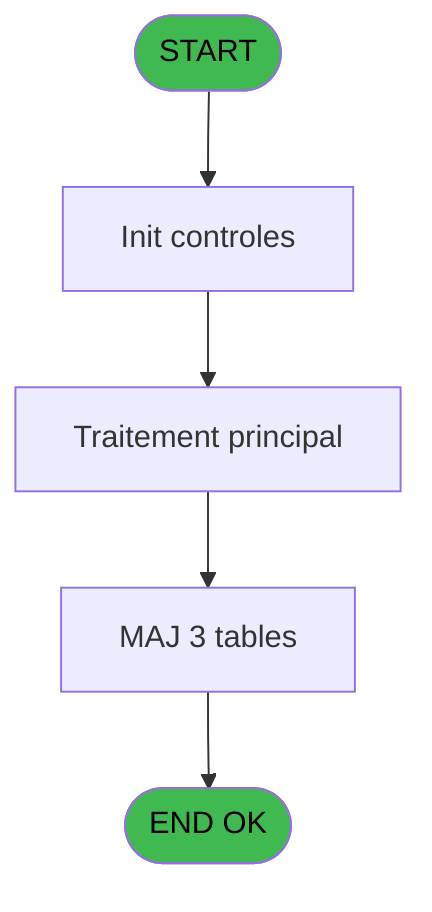
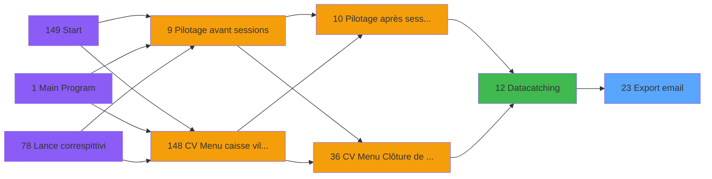

# VIL IDE 23 - Export email

> **Analyse**: Phases 1-4 2026-02-03 01:09 -> 01:10 (40s) | Assemblage 01:10
> **Pipeline**: V7.2 Enrichi
> **Structure**: 4 onglets (Resume | Ecrans | Donnees | Connexions)

<!-- TAB:Resume -->

## 1. FICHE D'IDENTITE

| Attribut | Valeur |
|----------|--------|
| Projet | VIL |
| IDE Position | 23 |
| Nom Programme | Export email |
| Fichier source | `Prg_23.xml` |
| Domaine metier | General |
| Taches | 22 (1 ecrans visibles) |
| Tables modifiees | 3 |
| Programmes appeles | 1 |

## 2. DESCRIPTION FONCTIONNELLE

**Export email** assure la gestion complete de ce processus, accessible depuis [    Datacatching (IDE 12)](VIL-IDE-12.md).

Le flux de traitement s'organise en **3 blocs fonctionnels** :

- **Traitement** (20 taches) : traitements metier divers
- **Creation** (1 tache) : insertion d'enregistrements en base (mouvements, prestations)
- **Consultation** (1 tache) : ecrans de recherche, selection et consultation

**Donnees modifiees** : 3 tables en ecriture (email, email_exports, pv_prestatemp).

Detail : phases du traitement

#### Phase 1 : Traitement (20 taches)

- **23** - Export email **[[ECRAN]](#ecran-t1)**
- **23.1** - Parametre caisse
- **23.2** - Contrôle village
- **23.3** - email existe ?
- **23.4** - Debut histo
- **23.5** - Update histo
- **23.6.1** - Recopie
- **23.7** - Exportation D
- **23.7.1** - Nbre hebergements
- **23.8** - Pointage D
- **23.9** - Fin histo
- **23.10** - Purges
- **23.10.1** - EMAIL
- **23.10.2** - EMAILEXP
- **23.10.3** - ASCII
- **23.10.3.1** - Listes
- **23.10.3.2** - Purge OUT
- **23.10.3.3** - Purge IN
- **23.10.3.4** - Purge CON
- **23.11** - Histo Sans Email

Delegue a : [Export email addresses Kiosk (IDE 24)](VIL-IDE-24.md)

#### Phase 2 : Consultation (1 tache)

- **23.6** - Selection D

#### Phase 3 : Creation (1 tache)

- **23.12** - Dir test et creation

#### Tables impactees

| Table | Operations | Role metier |
|-------|-----------|-------------|
| email_exports | **W** (5 usages) |  |
| email | R/**W**/L (5 usages) |  |
| pv_prestatemp | **W**/L (4 usages) |  |

## 3. BLOCS FONCTIONNELS

### 3.1 Traitement (20 taches)

Traitements internes.

---

#### 23 - Export email [[ECRAN]](#ecran-t1)

**Role** : Tache d'orchestration : point d'entree du programme (20 sous-taches). Coordonne l'enchainement des traitements.
**Ecran** : 458 x 65 DLU (MDI) | [Voir mockup](#ecran-t1)

19 sous-taches directes

| Tache | Nom | Bloc |
|-------|-----|------|
| [23.1](#t2) | Parametre caisse | Traitement |
| [23.2](#t3) | Contrôle village | Traitement |
| [23.3](#t4) | email existe ? | Traitement |
| [23.4](#t5) | Debut histo | Traitement |
| [23.5](#t6) | Update histo | Traitement |
| [23.6.1](#t8) | Recopie | Traitement |
| [23.7](#t11) | Exportation D | Traitement |
| [23.7.1](#t12) | Nbre hebergements | Traitement |
| [23.8](#t19) | Pointage D | Traitement |
| [23.9](#t21) | Fin histo | Traitement |
| [23.10](#t22) | Purges | Traitement |
| [23.10.1](#t23) | EMAIL | Traitement |
| [23.10.2](#t24) | EMAILEXP | Traitement |
| [23.10.3](#t25) | ASCII | Traitement |
| [23.10.3.1](#t26) | Listes | Traitement |
| [23.10.3.2](#t27) | Purge OUT | Traitement |
| [23.10.3.3](#t28) | Purge IN | Traitement |
| [23.10.3.4](#t29) | Purge CON | Traitement |
| [23.11](#t32) | Histo Sans Email | Traitement |

**Variables liees** : C (V Existe au moins 1 email), H (V Date export fixe), I (V Time export fixe), J (V Nbre exportes D), K (V Nbre exportes K)

---

#### 23.1 - Parametre caisse

**Role** : Traitement : Parametre caisse.

---

#### 23.2 - Contrôle village

**Role** : Traitement : Contrôle village.
**Variables liees** : B (V Confirmation code village), F (V Code Village)

---

#### 23.3 - email existe ?

**Role** : Traitement : email existe ?.
**Variables liees** : C (V Existe au moins 1 email), P (V RepEmail), S (V Existe D), T (V Existe K)

---

#### 23.4 - Debut histo

**Role** : Traitement : Debut histo.

---

#### 23.5 - Update histo

**Role** : Traitement : Update histo.

---

#### 23.6.1 - Recopie

**Role** : Traitement : Recopie.

---

#### 23.7 - Exportation D

**Role** : Traitement : Exportation D.

---

#### 23.7.1 - Nbre hebergements

**Role** : Traitement : Nbre hebergements.
**Variables liees** : J (V Nbre exportes D), K (V Nbre exportes K), L (V Nbre Seminaires), M (V Nbre VSL)

---

#### 23.8 - Pointage D

**Role** : Traitement : Pointage D.

---

#### 23.9 - Fin histo

**Role** : Traitement : Fin histo.

---

#### 23.10 - Purges

**Role** : Traitement : Purges.

---

#### 23.10.1 - EMAIL

**Role** : Traitement : EMAIL.
**Variables liees** : C (V Existe au moins 1 email), P (V RepEmail)

---

#### 23.10.2 - EMAILEXP

**Role** : Traitement : EMAILEXP.

---

#### 23.10.3 - ASCII

**Role** : Traitement : ASCII.

---

#### 23.10.3.1 - Listes

**Role** : Traitement : Listes.

---

#### 23.10.3.2 - Purge OUT

**Role** : Traitement : Purge OUT.

---

#### 23.10.3.3 - Purge IN

**Role** : Traitement : Purge IN.

---

#### 23.10.3.4 - Purge CON

**Role** : Traitement : Purge CON.

---

#### 23.11 - Histo Sans Email

**Role** : Traitement : Histo Sans Email.
**Variables liees** : C (V Existe au moins 1 email), P (V RepEmail)

### 3.2 Consultation (1 tache)

Ecrans de recherche et consultation.

---

#### 23.6 - Selection D

**Role** : Selection par l'operateur : Selection D.

### 3.3 Creation (1 tache)

Insertion de nouveaux enregistrements en base.

---

#### 23.12 - Dir test et creation

**Role** : Verification : Dir test et creation.

## 5. REGLES METIER

*(Aucune regle metier identifiee)*

## 6. CONTEXTE

- **Appele par**: [    Datacatching (IDE 12)](VIL-IDE-12.md)
- **Appelle**: 1 programmes | **Tables**: 12 (W:3 R:5 L:8) | **Taches**: 22 | **Expressions**: 22

<!-- TAB:Ecrans -->

## 8. ECRANS

### 8.1 Forms visibles (1 / 22)

| # | Position | Tache | Nom | Type | Largeur | Hauteur | Bloc |
|---|----------|-------|-----|------|---------|---------|------|
| 1 | 23 | 23 | Export email | MDI | 458 | 65 | Traitement |

### 8.2 Mockups Ecrans

---

#### 23 - Export email
**Tache** : [23](#t1) | **Type** : MDI | **Dimensions** : 458 x 65 DLU
**Bloc** : Traitement | **Titre IDE** : Export email

<!-- FORM-DATA:
{
    "width":  458,
    "vFactor":  8,
    "type":  "MDI",
    "hFactor":  8,
    "controls":  [
                     {
                         "x":  0,
                         "type":  "label",
                         "var":  "",
                         "y":  2,
                         "w":  458,
                         "fmt":  "",
                         "name":  "",
                         "h":  34,
                         "color":  "",
                         "text":  "",
                         "parent":  null
                     },
                     {
                         "x":  149,
                         "type":  "label",
                         "var":  "",
                         "y":  15,
                         "w":  254,
                         "fmt":  "",
                         "name":  "",
                         "h":  8,
                         "color":  "142",
                         "text":  "Traitement en cours...",
                         "parent":  null
                     },
                     {
                         "x":  1,
                         "type":  "label",
                         "var":  "",
                         "y":  38,
                         "w":  454,
                         "fmt":  "",
                         "name":  "",
                         "h":  25,
                         "color":  "6",
                         "text":  "",
                         "parent":  null
                     },
                     {
                         "x":  6,
                         "type":  "image",
                         "var":  "",
                         "y":  5,
                         "w":  73,
                         "fmt":  "",
                         "name":  "",
                         "h":  26,
                         "color":  "",
                         "text":  "",
                         "parent":  null
                     },
                     {
                         "x":  69,
                         "type":  "edit",
                         "var":  "",
                         "y":  47,
                         "w":  340,
                         "fmt":  "",
                         "name":  "",
                         "h":  10,
                         "color":  "143",
                         "text":  "",
                         "parent":  null
                     }
                 ],
    "taskId":  "23",
    "height":  65
}
-->

<strong>Champs : 1 champs</strong>

| Pos (x,y) | Nom | Variable | Type |
|-----------|-----|----------|------|
| 69,47 | (sans nom) | - | edit |

## 9. NAVIGATION

Ecran unique: **Export email**

### 9.3 Structure hierarchique (22 taches)

| Position | Tache | Type | Dimensions | Bloc |
|----------|-------|------|------------|------|
| **23.1** | [**Export email** (23)](#t1) [mockup](#ecran-t1) | MDI | 458x65 | Traitement |
| 23.1.1 | [Parametre caisse (23.1)](#t2) | MDI | - | |
| 23.1.2 | [Contrôle village (23.2)](#t3) | MDI | - | |
| 23.1.3 | [email existe ? (23.3)](#t4) | MDI | - | |
| 23.1.4 | [Debut histo (23.4)](#t5) | MDI | - | |
| 23.1.5 | [Update histo (23.5)](#t6) | MDI | - | |
| 23.1.6 | [Recopie (23.6.1)](#t8) | MDI | - | |
| 23.1.7 | [Exportation D (23.7)](#t11) | MDI | - | |
| 23.1.8 | [Nbre hebergements (23.7.1)](#t12) | MDI | - | |
| 23.1.9 | [Pointage D (23.8)](#t19) | MDI | - | |
| 23.1.10 | [Fin histo (23.9)](#t21) | MDI | - | |
| 23.1.11 | [Purges (23.10)](#t22) | MDI | - | |
| 23.1.12 | [EMAIL (23.10.1)](#t23) | MDI | - | |
| 23.1.13 | [EMAILEXP (23.10.2)](#t24) | MDI | - | |
| 23.1.14 | [ASCII (23.10.3)](#t25) | MDI | - | |
| 23.1.15 | [Listes (23.10.3.1)](#t26) | MDI | - | |
| 23.1.16 | [Purge OUT (23.10.3.2)](#t27) | MDI | - | |
| 23.1.17 | [Purge IN (23.10.3.3)](#t28) | MDI | - | |
| 23.1.18 | [Purge CON (23.10.3.4)](#t29) | MDI | - | |
| 23.1.19 | [Histo Sans Email (23.11)](#t32) | MDI | - | |
| **23.2** | [**Selection D** (23.6)](#t7) | MDI | - | Consultation |
| **23.3** | [**Dir test et creation** (23.12)](#t33) | MDI | - | Creation |

### 9.4 Algorigramme

> **Legende**: Vert = START/END OK | Rouge = END KO | Bleu = Decisions
> *Algorigramme auto-genere. Utiliser `/algorigramme` pour une synthese metier detaillee.*

<!-- TAB:Donnees -->

## 10. TABLES

### Tables utilisees (12)

| ID | Nom | Description | Type | R | W | L | Usages |
|----|-----|-------------|------|---|---|---|--------|
| 5 | codes_villages_economat |  | DB |   |   | L | 1 |
| 22 | address_data_catching |  | DB |   |   | L | 1 |
| 30 | gm-recherche_____gmr | Index de recherche | DB | R |   |   | 2 |
| 31 | gm-complet_______gmc |  | DB |   |   | L | 1 |
| 34 | hebergement______heb | Hebergement (chambres) | DB | R |   | L | 2 |
| 36 | client_gm |  | DB |   |   | L | 1 |
| 69 | initialisation___ini |  | DB | R |   |   | 1 |
| 118 | tables_imports |  | DB |   |   | L | 1 |
| 285 | email |  | DB | R | **W** | L | 5 |
| 287 | email_exports |  | DB |   | **W** |   | 5 |
| 518 | pv_prestatemp |  | TMP |   | **W** | L | 4 |
| 697 | droits_applications | Droits operateur | DB | R |   |   | 1 |

### Colonnes par table (6 / 7 tables avec colonnes identifiees)

Table 30 - gm-recherche_____gmr (R) - 2 usages

| Lettre | Variable | Acces | Type |
|--------|----------|-------|------|
| A | v.retour GM | R | Logical |
| B | V Nbre hebergements | R | Numeric |
| C | V Existe ORDI | R | Logical |

Table 34 - hebergement______heb (R/L) - 2 usages

| Lettre | Variable | Acces | Type |
|--------|----------|-------|------|
| B | V Nbre hebergements | R | Numeric |

Table 69 - initialisation___ini (R) - 1 usages

| Lettre | Variable | Acces | Type |
|--------|----------|-------|------|
| A | Trouve dans ecomat | R | Logical |
| B | v.choix confirmation | R | Numeric |

Table 285 - email (R/**W**/L) - 5 usages

| Lettre | Variable | Acces | Type |
|--------|----------|-------|------|
| A | Existe Email Datacatching | W | Logical |
| B | Existe Email Kiosque | W | Logical |

Table 287 - email_exports (**W**) - 5 usages

| Lettre | Variable | Acces | Type |
|--------|----------|-------|------|
| A | Existe Email Datacatching | W | Logical |
| B | Existe Email Kiosque | W | Logical |
| C | V Existe au moins 1 email | W | Logical |
| P | V RepEmail | W | Alpha |

Table 518 - pv_prestatemp (**W**/L) - 4 usages

*Table utilisee uniquement en Link ou aucune colonne Real identifiee dans le DataView.*

Table 697 - droits_applications (R) - 1 usages

*Table utilisee uniquement en Link ou aucune colonne Real identifiee dans le DataView.*

## 11. VARIABLES

### 11.1 Parametres entrants (1)

Variables recues du programme appelant ([    Datacatching (IDE 12)](VIL-IDE-12.md)).

| Lettre | Nom | Type | Usage dans |
|--------|-----|------|-----------|
| A | p.Cloture Auto | Logical | 1x parametre entrant |

### 11.2 Variables de session (25)

Variables persistantes pendant toute la session.

| Lettre | Nom | Type | Usage dans |
|--------|-----|------|-----------|
| B | V Confirmation code village | Logical | - |
| C | V Existe au moins 1 email | Logical | - |
| D | V Code Sejour | Alpha | - |
| E | V Message | Alpha | 1x session |
| F | V Code Village | Alpha | - |
| G | V FileName | Alpha | - |
| H | V Date export fixe | Date | - |
| I | V Time export fixe | Time | - |
| J | V Nbre exportes D | Numeric | - |
| K | V Nbre exportes K | Numeric | - |
| L | V Nbre Seminaires | Numeric | - |
| M | V Nbre VSL | Numeric | - |
| N | V resultat controle D | Alpha | - |
| O | V resultat controle K | Alpha | - |
| P | V RepEmail | Alpha | - |
| Q | V ErreurTransfert D | Logical | - |
| R | V ErreurTransfert K | Logical | - |
| S | V Existe D | Logical | [23.3](#t4) |
| T | V Existe K | Logical | [23.3](#t4) |
| U | V DoD | Alpha | - |
| V | V DoK | Alpha | - |
| W | V RepServerD | Alpha | - |
| X | V RepServerK | Alpha | - |
| Y | V ZoneGeogRecalculee | Alpha | 1x session |
| Z | V cloture automatique | Alpha | - |

Toutes les 26 variables (liste complete)

| Cat | Lettre | Nom Variable | Type |
|-----|--------|--------------|------|
| P0 | **A** | p.Cloture Auto | Logical |
| V. | **B** | V Confirmation code village | Logical |
| V. | **C** | V Existe au moins 1 email | Logical |
| V. | **D** | V Code Sejour | Alpha |
| V. | **E** | V Message | Alpha |
| V. | **F** | V Code Village | Alpha |
| V. | **G** | V FileName | Alpha |
| V. | **H** | V Date export fixe | Date |
| V. | **I** | V Time export fixe | Time |
| V. | **J** | V Nbre exportes D | Numeric |
| V. | **K** | V Nbre exportes K | Numeric |
| V. | **L** | V Nbre Seminaires | Numeric |
| V. | **M** | V Nbre VSL | Numeric |
| V. | **N** | V resultat controle D | Alpha |
| V. | **O** | V resultat controle K | Alpha |
| V. | **P** | V RepEmail | Alpha |
| V. | **Q** | V ErreurTransfert D | Logical |
| V. | **R** | V ErreurTransfert K | Logical |
| V. | **S** | V Existe D | Logical |
| V. | **T** | V Existe K | Logical |
| V. | **U** | V DoD | Alpha |
| V. | **V** | V DoK | Alpha |
| V. | **W** | V RepServerD | Alpha |
| V. | **X** | V RepServerK | Alpha |
| V. | **Y** | V ZoneGeogRecalculee | Alpha |
| V. | **Z** | V cloture automatique | Alpha |

## 12. EXPRESSIONS

**22 / 22 expressions decodees (100%)**

### 12.1 Repartition par type

| Type | Expressions | Regles |
|------|-------------|--------|
| CONSTANTE | 10 | 0 |
| CONCATENATION | 1 | 0 |
| DATE | 1 | 0 |
| OTHER | 9 | 0 |
| NEGATION | 1 | 0 |

### 12.2 Expressions cles par type

#### CONSTANTE (10 expressions)

| Type | IDE | Expression | Regle |
|------|-----|------------|-------|
| CONSTANTE | 12 | `'Export'` | - |
| CONSTANTE | 11 | `'Selection'` | - |
| CONSTANTE | 13 | `'Transfert'` | - |
| CONSTANTE | 15 | `'Fin'` | - |
| CONSTANTE | 14 | `'Pointage'` | - |
| ... | | *+5 autres* | |

#### CONCATENATION (1 expressions)

| Type | IDE | Expression | Regle |
|------|-----|------------|-------|
| CONCATENATION | 2 | `V Message [E]&'.'&DStr (Date (),'YYYYMMDD')&TStr (Time (),'HHMM')` | - |

#### DATE (1 expressions)

| Type | IDE | Expression | Regle |
|------|-----|------------|-------|
| DATE | 16 | `Date ()` | - |

#### OTHER (9 expressions)

| Type | IDE | Expression | Regle |
|------|-----|------------|-------|
| OTHER | 20 | `V Existe D [S]` | - |
| OTHER | 19 | `Delay (20)` | - |
| OTHER | 22 | `V ZoneGeogRecalculee [Y]&'\INPUT'` | - |
| OTHER | 21 | `V Existe K [T]` | - |
| OTHER | 18 | `DbDel ('{518,2}'DSOURCE,'')` | - |
| ... | | *+4 autres* | |

#### NEGATION (1 expressions)

| Type | IDE | Expression | Regle |
|------|-----|------------|-------|
| NEGATION | 5 | `NOT (V Confirmation code vi... [B])` | - |

### 12.3 Toutes les expressions (22)

Voir les 22 expressions

#### CONSTANTE (10)

| IDE | Expression Decodee |
|-----|-------------------|
| 6 | `'SEL'` |
| 7 | `'EXP'` |
| 8 | `'TRA'` |
| 9 | `'POD'` |
| 10 | `'Debut'` |
| 11 | `'Selection'` |
| 12 | `'Export'` |
| 13 | `'Transfert'` |
| 14 | `'Pointage'` |
| 15 | `'Fin'` |

#### CONCATENATION (1)

| IDE | Expression Decodee |
|-----|-------------------|
| 2 | `V Message [E]&'.'&DStr (Date (),'YYYYMMDD')&TStr (Time (),'HHMM')` |

#### DATE (1)

| IDE | Expression Decodee |
|-----|-------------------|
| 16 | `Date ()` |

#### OTHER (9)

| IDE | Expression Decodee |
|-----|-------------------|
| 1 | `SetParam ('SOCIETE','C')` |
| 3 | `p.Cloture Auto [A]` |
| 4 | `V Confirmation code vi... [B]` |
| 17 | `Time ()` |
| 18 | `DbDel ('{518,2}'DSOURCE,'')` |
| 19 | `Delay (20)` |
| 20 | `V Existe D [S]` |
| 21 | `V Existe K [T]` |
| 22 | `V ZoneGeogRecalculee [Y]&'\INPUT'` |

#### NEGATION (1)

| IDE | Expression Decodee |
|-----|-------------------|
| 5 | `NOT (V Confirmation code vi... [B])` |

<!-- TAB:Connexions -->

## 13. GRAPHE D'APPELS

### 13.1 Chaine depuis Main (Callers)

Main -> ... -> [    Datacatching (IDE 12)](VIL-IDE-12.md) -> **Export email (IDE 23)**

### 13.2 Callers

| IDE | Nom Programme | Nb Appels |
|-----|---------------|-----------|
| [12](VIL-IDE-12.md) |     Datacatching | 1 |

### 13.3 Callees (programmes appeles)

### 13.4 Detail Callees avec contexte

| IDE | Nom Programme | Appels | Contexte |
|-----|---------------|--------|----------|
| [24](VIL-IDE-24.md) | Export email addresses Kiosk | 1 | Sous-programme |

## 14. RECOMMANDATIONS MIGRATION

### 14.1 Profil du programme

| Metrique | Valeur | Impact migration |
|----------|--------|-----------------|
| Lignes de logique | 481 | Taille moyenne |
| Expressions | 22 | Peu de logique |
| Tables WRITE | 3 | Impact modere |
| Sous-programmes | 1 | Peu de dependances |
| Ecrans visibles | 1 | Ecran unique ou traitement batch |
| Code desactive | 0% (0 / 481) | Code sain |
| Regles metier | 0 | Pas de regle identifiee |

### 14.2 Plan de migration par bloc

#### Traitement (20 taches: 1 ecran, 19 traitements)

- **Strategie** : Orchestrateur avec 1 ecrans (Razor/React) et 19 traitements backend (services).
- Les ecrans deviennent des composants UI, les traitements invisibles deviennent des services injectables.
- 1 sous-programme(s) a migrer ou a reutiliser depuis les services existants.
- Decomposer les taches en services unitaires testables.

#### Consultation (1 tache: 0 ecran, 1 traitement)

- **Strategie** : Composants de recherche/selection en modales.

#### Creation (1 tache: 0 ecran, 1 traitement)

- **Strategie** : Repository pattern avec Entity Framework Core.
- Insertion via `IRepository<T>.CreateAsync()`

### 14.3 Dependances critiques

| Dependance | Type | Appels | Impact |
|------------|------|--------|--------|
| email | Table WRITE (Database) | 2x | Schema + repository |
| email_exports | Table WRITE (Database) | 5x | Schema + repository |
| pv_prestatemp | Table WRITE (Temp) | 1x | Schema + repository |
| [Export email addresses Kiosk (IDE 24)](VIL-IDE-24.md) | Sous-programme | 1x | Normale - Sous-programme |

---
*Spec DETAILED generee par Pipeline V7.2 - 2026-02-03 01:10*
