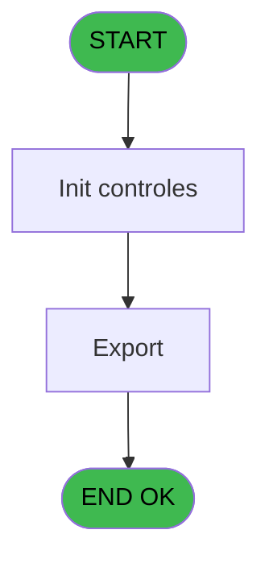
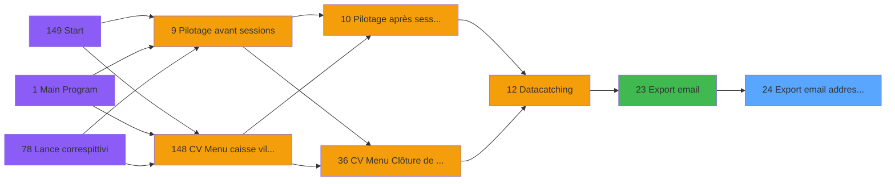

# VIL IDE 24 - Export email addresses Kiosk

> **Analyse**: Phases 1-4 2026-02-03 01:10 -> 01:11 (40s) | Assemblage 01:11
> **Pipeline**: V7.2 Enrichi
> **Structure**: 4 onglets (Resume | Ecrans | Donnees | Connexions)

<!-- TAB:Resume -->

## 1. FICHE D'IDENTITE

| Attribut | Valeur |
|----------|--------|
| Projet | VIL |
| IDE Position | 24 |
| Nom Programme | Export email addresses Kiosk |
| Fichier source | `Prg_24.xml` |
| Domaine metier | General |
| Taches | 3 (1 ecrans visibles) |
| Tables modifiees | 0 |
| Programmes appeles | 0 |

## 2. DESCRIPTION FONCTIONNELLE

**Export email addresses Kiosk** assure la gestion complete de ce processus, accessible depuis [Export email (IDE 23)](VIL-IDE-23.md).

Le flux de traitement s'organise en **1 blocs fonctionnels** :

- **Traitement** (3 taches) : traitements metier divers

## 3. BLOCS FONCTIONNELS

### 3.1 Traitement (3 taches)

Traitements internes.

---

#### 24 - Export email addresses Kiosk [[ECRAN]](#ecran-t1)

**Role** : Traitement : Export email addresses Kiosk.
**Ecran** : 364 x 46 DLU (MDI) | [Voir mockup](#ecran-t1)

---

#### 24.1 - Contrôle village

**Role** : Traitement : Contrôle village.

---

#### 24.2 - Export - address [[ECRAN]](#ecran-t3)

**Role** : Traitement : Export - address.
**Ecran** : 364 x 46 DLU (MDI) | [Voir mockup](#ecran-t3)

## 5. REGLES METIER

*(Aucune regle metier identifiee)*

## 6. CONTEXTE

- **Appele par**: [Export email (IDE 23)](VIL-IDE-23.md)
- **Appelle**: 0 programmes | **Tables**: 5 (W:0 R:2 L:3) | **Taches**: 3 | **Expressions**: 1

<!-- TAB:Ecrans -->

## 8. ECRANS

### 8.1 Forms visibles (1 / 3)

| # | Position | Tache | Nom | Type | Largeur | Hauteur | Bloc |
|---|----------|-------|-----|------|---------|---------|------|
| 1 | 24.2 | 24.2 | Export - address | MDI | 364 | 46 | Traitement |

### 8.2 Mockups Ecrans

---

#### 24.2 - Export - address
**Tache** : [24.2](#t3) | **Type** : MDI | **Dimensions** : 364 x 46 DLU
**Bloc** : Traitement | **Titre IDE** : Export - address

<!-- FORM-DATA:
{
    "width":  364,
    "vFactor":  8,
    "type":  "MDI",
    "hFactor":  4,
    "controls":  [
                     {
                         "x":  22,
                         "type":  "edit",
                         "var":  "",
                         "y":  11,
                         "w":  63,
                         "fmt":  "",
                         "name":  "",
                         "h":  10,
                         "color":  "6",
                         "text":  "",
                         "parent":  null
                     },
                     {
                         "x":  22,
                         "type":  "edit",
                         "var":  "",
                         "y":  24,
                         "w":  320,
                         "fmt":  "60",
                         "name":  "",
                         "h":  11,
                         "color":  "6",
                         "text":  "",
                         "parent":  null
                     }
                 ],
    "taskId":  "24.2",
    "height":  46
}
-->

<strong>Champs : 2 champs</strong>

| Pos (x,y) | Nom | Variable | Type |
|-----------|-----|----------|------|
| 22,11 | (sans nom) | - | edit |
| 22,24 | 60 | - | edit |

## 9. NAVIGATION

Ecran unique: **Export - address**

### 9.3 Structure hierarchique (3 taches)

| Position | Tache | Type | Dimensions | Bloc |
|----------|-------|------|------------|------|
| **24.1** | [**Export email addresses Kiosk** (24)](#t1) [mockup](#ecran-t1) | MDI | 364x46 | Traitement |
| 24.1.1 | [Contrôle village (24.1)](#t2) | MDI | - | |
| 24.1.2 | [Export - address (24.2)](#t3) [mockup](#ecran-t3) | MDI | 364x46 | |

### 9.4 Algorigramme

> **Legende**: Vert = START/END OK | Rouge = END KO | Bleu = Decisions
> *Algorigramme auto-genere. Utiliser `/algorigramme` pour une synthese metier detaillee.*

<!-- TAB:Donnees -->

## 10. TABLES

### Tables utilisees (5)

| ID | Nom | Description | Type | R | W | L | Usages |
|----|-----|-------------|------|---|---|---|--------|
| 22 | address_data_catching |  | DB |   |   | L | 1 |
| 31 | gm-complet_______gmc |  | DB | R |   |   | 1 |
| 36 | client_gm |  | DB |   |   | L | 1 |
| 69 | initialisation___ini |  | DB | R |   |   | 1 |
| 118 | tables_imports |  | DB |   |   | L | 1 |

### Colonnes par table (0 / 2 tables avec colonnes identifiees)

Table 31 - gm-complet_______gmc (R) - 1 usages

*Table utilisee uniquement en Link ou aucune colonne Real identifiee dans le DataView.*

Table 69 - initialisation___ini (R) - 1 usages

*Table utilisee uniquement en Link ou aucune colonne Real identifiee dans le DataView.*

## 11. VARIABLES

*(Programme sans variables locales mappees)*

## 12. EXPRESSIONS

**1 / 1 expressions decodees (100%)**

### 12.1 Repartition par type

| Type | Expressions | Regles |
|------|-------------|--------|
| CONCATENATION | 1 | 0 |

### 12.2 Expressions cles par type

#### CONCATENATION (1 expressions)

| Type | IDE | Expression | Regle |
|------|-----|------------|-------|
| CONCATENATION | 1 | `v.file name [A]&'.'&DStr (Date (),'YYYYMMDD')&TStr (Time (),'HHMM')` | - |

<!-- TAB:Connexions -->

## 13. GRAPHE D'APPELS

### 13.1 Chaine depuis Main (Callers)

Main -> ... -> [Export email (IDE 23)](VIL-IDE-23.md) -> **Export email addresses Kiosk (IDE 24)**

### 13.2 Callers

| IDE | Nom Programme | Nb Appels |
|-----|---------------|-----------|
| [23](VIL-IDE-23.md) | Export email | 1 |

### 13.3 Callees (programmes appeles)

### 13.4 Detail Callees avec contexte

| IDE | Nom Programme | Appels | Contexte |
|-----|---------------|--------|----------|
| - | (aucun) | - | - |

## 14. RECOMMANDATIONS MIGRATION

### 14.1 Profil du programme

| Metrique | Valeur | Impact migration |
|----------|--------|-----------------|
| Lignes de logique | 83 | Programme compact |
| Expressions | 1 | Peu de logique |
| Tables WRITE | 0 | Impact faible |
| Sous-programmes | 0 | Peu de dependances |
| Ecrans visibles | 1 | Ecran unique ou traitement batch |
| Code desactive | 0% (0 / 83) | Code sain |
| Regles metier | 0 | Pas de regle identifiee |

### 14.2 Plan de migration par bloc

#### Traitement (3 taches: 2 ecrans, 1 traitement)

- **Strategie** : Orchestrateur avec 2 ecrans (Razor/React) et 1 traitements backend (services).
- Les ecrans deviennent des composants UI, les traitements invisibles deviennent des services injectables.
- Decomposer les taches en services unitaires testables.

### 14.3 Dependances critiques

| Dependance | Type | Appels | Impact |
|------------|------|--------|--------|

---
*Spec DETAILED generee par Pipeline V7.2 - 2026-02-03 01:11*
