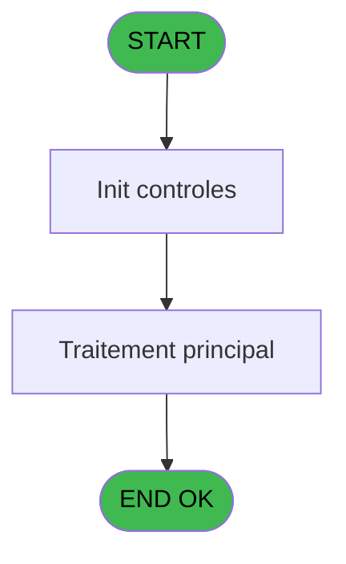
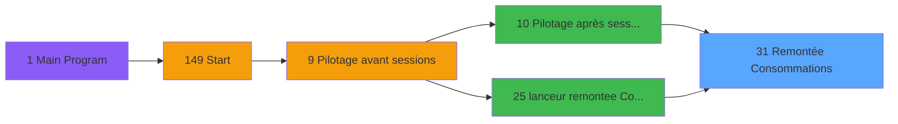

# VIL IDE 31 - Remontée Consommations

> **Analyse**: Phases 1-4 2026-02-03 01:16 -> 01:17 (35s) | Assemblage 01:17
> **Pipeline**: V7.2 Enrichi
> **Structure**: 4 onglets (Resume | Ecrans | Donnees | Connexions)

<!-- TAB:Resume -->

## 1. FICHE D'IDENTITE

| Attribut | Valeur |
|----------|--------|
| Projet | VIL |
| IDE Position | 31 |
| Nom Programme | Remontée Consommations |
| Fichier source | `Prg_31.xml` |
| Domaine metier | General |
| Taches | 5 (0 ecrans visibles) |
| Tables modifiees | 0 |
| Programmes appeles | 1 |

## 2. DESCRIPTION FONCTIONNELLE

**Remontée Consommations** assure la gestion complete de ce processus, accessible depuis [Pilotage après sessions (IDE 10)](VIL-IDE-10.md), [lanceur remontee Consos (IDE 25)](VIL-IDE-25.md).

Le flux de traitement s'organise en **2 blocs fonctionnels** :

- **Traitement** (3 taches) : traitements metier divers
- **Initialisation** (2 taches) : reinitialisation d'etats et de variables de travail

Detail : phases du traitement

#### Phase 1 : Traitement (3 taches)

- **31.1** - Remontée Consommations
- **31** - Remontée Consommations
- **31.2** - Remontée Consommations

Delegue a : [Get Service from Imputation (IDE 32)](VIL-IDE-32.md)

#### Phase 2 : Initialisation (2 taches)

- **31.3** - RAZ Gift Pass
- **31.4** - RAZ Gift Pass

## 3. BLOCS FONCTIONNELS

### 3.1 Traitement (3 taches)

Traitements internes.

---

#### 31.1 - Remontée Consommations

**Role** : Traitement : Remontée Consommations.
**Delegue a** : [Get Service from Imputation (IDE 32)](VIL-IDE-32.md)

---

#### 31 - Remontée Consommations

**Role** : Traitement : Remontée Consommations.
**Delegue a** : [Get Service from Imputation (IDE 32)](VIL-IDE-32.md)

---

#### 31.2 - Remontée Consommations

**Role** : Traitement : Remontée Consommations.
**Delegue a** : [Get Service from Imputation (IDE 32)](VIL-IDE-32.md)

### 3.2 Initialisation (2 taches)

Reinitialisation d'etats et variables de travail.

---

#### 31.3 - RAZ Gift Pass

**Role** : Reinitialisation : RAZ Gift Pass.

---

#### 31.4 - RAZ Gift Pass

**Role** : Reinitialisation : RAZ Gift Pass.

## 5. REGLES METIER

*(Aucune regle metier identifiee)*

## 6. CONTEXTE

- **Appele par**: [Pilotage après sessions (IDE 10)](VIL-IDE-10.md), [lanceur remontee Consos (IDE 25)](VIL-IDE-25.md)
- **Appelle**: 1 programmes | **Tables**: 1 (W:0 R:1 L:0) | **Taches**: 5 | **Expressions**: 7

<!-- TAB:Ecrans -->

## 8. ECRANS

*(Programme sans ecran visible)*

## 9. NAVIGATION

### 9.3 Structure hierarchique (5 taches)

| Position | Tache | Type | Dimensions | Bloc |
|----------|-------|------|------------|------|
| **31.1** | [**Remontée Consommations** (31.1)](#t1) | - | - | Traitement |
| 31.1.1 | [Remontée Consommations (31)](#t2) | - | - | |
| 31.1.2 | [Remontée Consommations (31.2)](#t5) | - | - | |
| **31.2** | [**RAZ Gift Pass** (31.3)](#t6) | - | - | Initialisation |
| 31.2.1 | [RAZ Gift Pass (31.4)](#t9) | - | - | |

### 9.4 Algorigramme

> **Legende**: Vert = START/END OK | Rouge = END KO | Bleu = Decisions
> *Algorigramme auto-genere. Utiliser `/algorigramme` pour une synthese metier detaillee.*

<!-- TAB:Donnees -->

## 10. TABLES

### Tables utilisees (1)

| ID | Nom | Description | Type | R | W | L | Usages |
|----|-----|-------------|------|---|---|---|--------|
| 30 | gm-recherche_____gmr | Index de recherche | DB | R |   |   | 1 |

### Colonnes par table (0 / 1 tables avec colonnes identifiees)

Table 30 - gm-recherche_____gmr (R) - 1 usages

*Table utilisee uniquement en Link ou aucune colonne Real identifiee dans le DataView.*

## 11. VARIABLES

### 11.1 Variables de session (1)

Variables persistantes pendant toute la session.

| Lettre | Nom | Type | Usage dans |
|--------|-----|------|-----------|
| V | v.Service | Alpha | 1x session |

### 11.2 Autres (21)

Variables diverses.

| Lettre | Nom | Type | Usage dans |
|--------|-----|------|-----------|
| A | Montant | Numeric | 3x refs |
| B | imputation | Numeric | 1x refs |
| C | sousimp | Numeric | - |
| D | paiement | Unicode | - |
| E | CPTE | Numeric | - |
| F | FIL | Numeric | 1x refs |
| G | DEB | Alpha | 1x refs |
| H | FIN | Alpha | - |
| I | gmc_nom_complet | Unicode | - |
| J | gmc_prenom_complet | Unicode | - |
| K | gmc_numero_adherent | Numeric | - |
| L | gmc_filiation_club | Numeric | - |
| M | gmc_code_inscription | Unicode | - |
| N | gmc_numero_import | Numeric | - |
| O | heb_type_hebergement | Unicode | - |
| P | heb_complement_type | Unicode | - |
| Q | export | Unicode | 1x refs |
| R | gmc_titre | Unicode | - |
| S | gmc_type_client_fondation | Unicode | - |
| T | gmc_numero_dossier | Numeric | 1x refs |
| U | cgm_date_lastoperat | Alpha | - |

Toutes les 22 variables (liste complete)

| Cat | Lettre | Nom Variable | Type |
|-----|--------|--------------|------|
| V. | **V** | v.Service | Alpha |
| Autre | **A** | Montant | Numeric |
| Autre | **B** | imputation | Numeric |
| Autre | **C** | sousimp | Numeric |
| Autre | **D** | paiement | Unicode |
| Autre | **E** | CPTE | Numeric |
| Autre | **F** | FIL | Numeric |
| Autre | **G** | DEB | Alpha |
| Autre | **H** | FIN | Alpha |
| Autre | **I** | gmc_nom_complet | Unicode |
| Autre | **J** | gmc_prenom_complet | Unicode |
| Autre | **K** | gmc_numero_adherent | Numeric |
| Autre | **L** | gmc_filiation_club | Numeric |
| Autre | **M** | gmc_code_inscription | Unicode |
| Autre | **N** | gmc_numero_import | Numeric |
| Autre | **O** | heb_type_hebergement | Unicode |
| Autre | **P** | heb_complement_type | Unicode |
| Autre | **Q** | export | Unicode |
| Autre | **R** | gmc_titre | Unicode |
| Autre | **S** | gmc_type_client_fondation | Unicode |
| Autre | **T** | gmc_numero_dossier | Numeric |
| Autre | **U** | cgm_date_lastoperat | Alpha |

## 12. EXPRESSIONS

**7 / 7 expressions decodees (100%)**

### 12.1 Repartition par type

| Type | Expressions | Regles |
|------|-------------|--------|
| CALCULATION | 1 | 0 |
| CONCATENATION | 1 | 0 |
| DATE | 3 | 0 |
| FORMAT | 2 | 0 |

### 12.2 Expressions cles par type

#### CALCULATION (1 expressions)

| Type | IDE | Expression | Regle |
|------|-----|------------|-------|
| CALCULATION | 3 | `ABS(Montant [A])*100` | - |

#### CONCATENATION (1 expressions)

| Type | IDE | Expression | Regle |
|------|-----|------------|-------|
| CONCATENATION | 1 | `Translate('%club_exportdata%consos\')&Trim(Montant [A])&DStr (Date (),'YYYYMMDD')` | - |

#### DATE (3 expressions)

| Type | IDE | Expression | Regle |
|------|-----|------------|-------|
| DATE | 5 | `DVal(DEB [G],'YYYYMMDD')` | - |
| DATE | 4 | `DVal(FIL [F],'YYYYMMDD')` | - |
| DATE | 2 | `DVal(gmc_numero_dossier [T],'YYYYMMDD')` | - |

#### FORMAT (2 expressions)

| Type | IDE | Expression | Regle |
|------|-----|------------|-------|
| FORMAT | 7 | `NOT(v.Service [V]='PLA' AND Left(Str(imputation [B],'9'),1)='5') AND Montant [A]<>0` | - |
| FORMAT | 6 | `DStr(Date()-2,'YYYYMMDD')` | - |

<!-- TAB:Connexions -->

## 13. GRAPHE D'APPELS

### 13.1 Chaine depuis Main (Callers)

Main -> ... -> [Pilotage après sessions (IDE 10)](VIL-IDE-10.md) -> **Remontée Consommations (IDE 31)**

Main -> ... -> [lanceur remontee Consos (IDE 25)](VIL-IDE-25.md) -> **Remontée Consommations (IDE 31)**

### 13.2 Callers

| IDE | Nom Programme | Nb Appels |
|-----|---------------|-----------|
| [10](VIL-IDE-10.md) | Pilotage après sessions | 1 |
| [25](VIL-IDE-25.md) | lanceur remontee Consos | 1 |

### 13.3 Callees (programmes appeles)

### 13.4 Detail Callees avec contexte

| IDE | Nom Programme | Appels | Contexte |
|-----|---------------|--------|----------|
| [32](VIL-IDE-32.md) | Get Service from Imputation | 2 | Recuperation donnees |

## 14. RECOMMANDATIONS MIGRATION

### 14.1 Profil du programme

| Metrique | Valeur | Impact migration |
|----------|--------|-----------------|
| Lignes de logique | 74 | Programme compact |
| Expressions | 7 | Peu de logique |
| Tables WRITE | 0 | Impact faible |
| Sous-programmes | 1 | Peu de dependances |
| Ecrans visibles | 0 | Ecran unique ou traitement batch |
| Code desactive | 0% (0 / 74) | Code sain |
| Regles metier | 0 | Pas de regle identifiee |

### 14.2 Plan de migration par bloc

#### Traitement (3 taches: 0 ecran, 3 traitements)

- **Strategie** : 3 service(s) backend injectable(s) (Domain Services).
- 1 sous-programme(s) a migrer ou a reutiliser depuis les services existants.
- Decomposer les taches en services unitaires testables.

#### Initialisation (2 taches: 0 ecran, 2 traitements)

- **Strategie** : Constructeur/methode `InitAsync()` dans l'orchestrateur.

### 14.3 Dependances critiques

| Dependance | Type | Appels | Impact |
|------------|------|--------|--------|
| [Get Service from Imputation (IDE 32)](VIL-IDE-32.md) | Sous-programme | 2x | Haute - Recuperation donnees |

---
*Spec DETAILED generee par Pipeline V7.2 - 2026-02-03 01:17*
