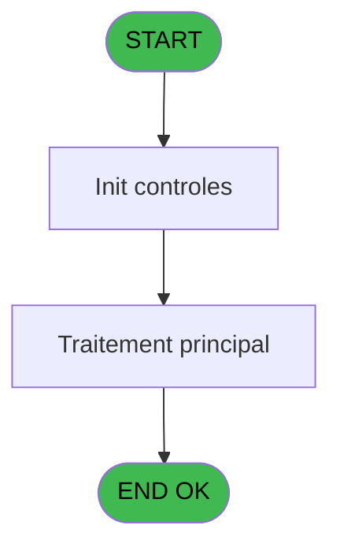
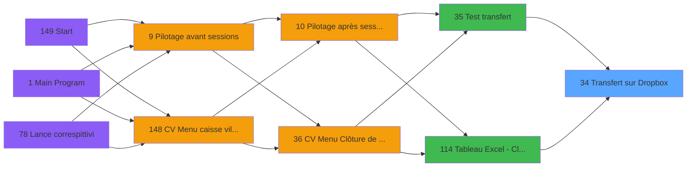

# VIL IDE 34 - Transfert sur Dropbox

> **Analyse**: Phases 1-4 2026-02-03 01:19 -> 01:20 (36s) | Assemblage 01:20
> **Pipeline**: V7.2 Enrichi
> **Structure**: 4 onglets (Resume | Ecrans | Donnees | Connexions)

<!-- TAB:Resume -->

## 1. FICHE D'IDENTITE

| Attribut | Valeur |
|----------|--------|
| Projet | VIL |
| IDE Position | 34 |
| Nom Programme | Transfert sur Dropbox |
| Fichier source | `Prg_34.xml` |
| Domaine metier | General |
| Taches | 3 (0 ecrans visibles) |
| Tables modifiees | 0 |
| Programmes appeles | 0 |

## 2. DESCRIPTION FONCTIONNELLE

**Transfert sur Dropbox** assure la gestion complete de ce processus, accessible depuis [Test transfert (IDE 35)](VIL-IDE-35.md), [Tableau Excel - Cloture Auto (IDE 114)](VIL-IDE-114.md).

Le flux de traitement s'organise en **1 blocs fonctionnels** :

- **Traitement** (3 taches) : traitements metier divers

## 3. BLOCS FONCTIONNELS

### 3.1 Traitement (3 taches)

Traitements internes.

---

#### 34 - ASCII

**Role** : Traitement : ASCII.

---

#### 34.1 - Listes

**Role** : Traitement : Listes.

---

#### 34.2 - Purge OUT

**Role** : Traitement : Purge OUT.

## 5. REGLES METIER

*(Aucune regle metier identifiee)*

## 6. CONTEXTE

- **Appele par**: [Test transfert (IDE 35)](VIL-IDE-35.md), [Tableau Excel - Cloture Auto (IDE 114)](VIL-IDE-114.md)
- **Appelle**: 0 programmes | **Tables**: 0 (W:0 R:0 L:0) | **Taches**: 3 | **Expressions**: 5

<!-- TAB:Ecrans -->

## 8. ECRANS

*(Programme sans ecran visible)*

## 9. NAVIGATION

### 9.3 Structure hierarchique (3 taches)

| Position | Tache | Type | Dimensions | Bloc |
|----------|-------|------|------------|------|
| **34.1** | [**ASCII** (34)](#t10) | MDI | - | Traitement |
| 34.1.1 | [Listes (34.1)](#t45) | MDI | - | |
| 34.1.2 | [Purge OUT (34.2)](#t46) | MDI | - | |

### 9.4 Algorigramme

> **Legende**: Vert = START/END OK | Rouge = END KO | Bleu = Decisions
> *Algorigramme auto-genere. Utiliser `/algorigramme` pour une synthese metier detaillee.*

<!-- TAB:Donnees -->

## 10. TABLES

### Tables utilisees (0)

| ID | Nom | Description | Type | R | W | L | Usages |
|----|-----|-------------|------|---|---|---|--------|

### Colonnes par table (0 / 0 tables avec colonnes identifiees)

## 11. VARIABLES

### 11.1 Parametres entrants (1)

Variables recues du programme appelant ([Test transfert (IDE 35)](VIL-IDE-35.md)).

| Lettre | Nom | Type | Usage dans |
|--------|-----|------|-----------|
| A | P.o.Traitement effectué (O,P,N) | Unicode | - |

### 11.2 Variables de session (4)

Variables persistantes pendant toute la session.

| Lettre | Nom | Type | Usage dans |
|--------|-----|------|-----------|
| B | v.Fichier contenant Liste à cop | Unicode | - |
| C | V.Chemin DropBox | Unicode | - |
| D | V.Traitement en cours (O,P,N) | Unicode | - |
| E | v.Transfert du fichier OK? | Logical | - |

## 12. EXPRESSIONS

**5 / 5 expressions decodees (100%)**

### 12.1 Repartition par type

| Type | Expressions | Regles |
|------|-------------|--------|
| CONSTANTE | 3 | 0 |
| OTHER | 2 | 0 |

### 12.2 Expressions cles par type

#### CONSTANTE (3 expressions)

| Type | IDE | Expression | Regle |
|------|-----|------------|-------|
| CONSTANTE | 5 | `'Z:\'` | - |
| CONSTANTE | 2 | `''` | - |
| CONSTANTE | 1 | `'LISTEFICHIER.TXT'` | - |

#### OTHER (2 expressions)

| Type | IDE | Expression | Regle |
|------|-----|------------|-------|
| OTHER | 4 | `Translate('%club_command%')&'disconnect_db_compta.cmd'` | - |
| OTHER | 3 | `Translate('%club_command%')&'connect_db_compta.cmd'` | - |

<!-- TAB:Connexions -->

## 13. GRAPHE D'APPELS

### 13.1 Chaine depuis Main (Callers)

Main -> ... -> [Test transfert (IDE 35)](VIL-IDE-35.md) -> **Transfert sur Dropbox (IDE 34)**

Main -> ... -> [Tableau Excel - Cloture Auto (IDE 114)](VIL-IDE-114.md) -> **Transfert sur Dropbox (IDE 34)**

### 13.2 Callers

| IDE | Nom Programme | Nb Appels |
|-----|---------------|-----------|
| [35](VIL-IDE-35.md) | Test transfert | 1 |
| [114](VIL-IDE-114.md) | Tableau Excel - Cloture Auto | 1 |

### 13.3 Callees (programmes appeles)

### 13.4 Detail Callees avec contexte

| IDE | Nom Programme | Appels | Contexte |
|-----|---------------|--------|----------|
| - | (aucun) | - | - |

## 14. RECOMMANDATIONS MIGRATION

### 14.1 Profil du programme

| Metrique | Valeur | Impact migration |
|----------|--------|-----------------|
| Lignes de logique | 44 | Programme compact |
| Expressions | 5 | Peu de logique |
| Tables WRITE | 0 | Impact faible |
| Sous-programmes | 0 | Peu de dependances |
| Ecrans visibles | 0 | Ecran unique ou traitement batch |
| Code desactive | 0% (0 / 44) | Code sain |
| Regles metier | 0 | Pas de regle identifiee |

### 14.2 Plan de migration par bloc

#### Traitement (3 taches: 0 ecran, 3 traitements)

- **Strategie** : 3 service(s) backend injectable(s) (Domain Services).
- Decomposer les taches en services unitaires testables.

### 14.3 Dependances critiques

| Dependance | Type | Appels | Impact |
|------------|------|--------|--------|

---
*Spec DETAILED generee par Pipeline V7.2 - 2026-02-03 01:20*
