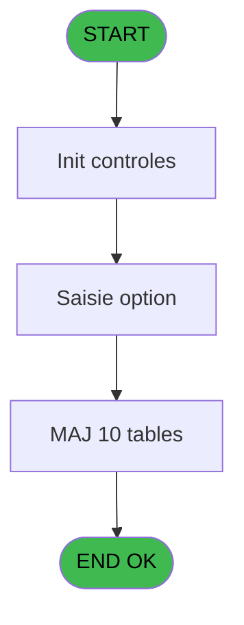
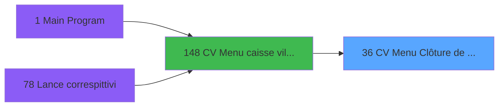
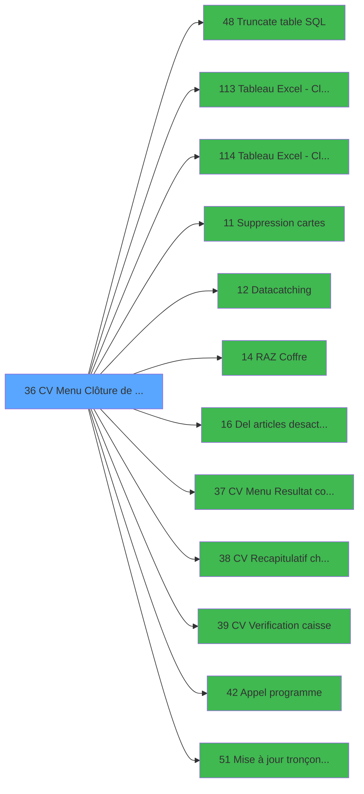

# VIL IDE 36 - CV  Menu Clôture de caisse

> **Analyse**: Phases 1-4 2026-02-03 01:21 -> 01:22 (36s) | Assemblage 01:22
> **Pipeline**: V7.2 Enrichi
> **Structure**: 4 onglets (Resume | Ecrans | Donnees | Connexions)

<!-- TAB:Resume -->

## 1. FICHE D'IDENTITE

| Attribut | Valeur |
|----------|--------|
| Projet | VIL |
| IDE Position | 36 |
| Nom Programme | CV  Menu Clôture de caisse |
| Fichier source | `Prg_36.xml` |
| Domaine metier | Caisse |
| Taches | 29 (8 ecrans visibles) |
| Tables modifiees | 10 |
| Programmes appeles | 12 |

## 2. DESCRIPTION FONCTIONNELLE

**CV  Menu Clôture de caisse** assure la gestion complete de ce processus, accessible depuis [CV  Menu caisse village (IDE 148)](VIL-IDE-148.md).

Le flux de traitement s'organise en **4 blocs fonctionnels** :

- **Traitement** (26 taches) : traitements metier divers
- **Creation** (1 tache) : insertion d'enregistrements en base (mouvements, prestations)
- **Calcul** (1 tache) : calculs de montants, stocks ou compteurs
- **Consultation** (1 tache) : ecrans de recherche, selection et consultation

**Donnees modifiees** : 10 tables en ecriture (reseau_cloture___rec, pieces_caisse____pks, devises_caisse___ddk, date_comptable___dat, compteur_erreurs, intermed__gratuititg, intermed_compta__ite, suivi_cloture, cc_comptable, heure_de_passage).

Detail : phases du traitement

#### Phase 1 : Traitement (26 taches)

- **36** - AC  Clôture de caisse **[[ECRAN]](#ecran-t1)**
- **36.2** - Blocage des traitements
- **36.2.1** - Blocage des traitements v1
- **36.2.2** - Temporisation
- **36.2.3** - Test si autres traitements v1
- **36.2.4** - Connections v1 **[[ECRAN]](#ecran-t7)**
- **36.3** - Debut operation
- **36.4** - Parametre Restructuration
- **36.5** - MàJ solde caisse
- **36.6** - Fin operation
- **36.7** - Effacement pkes-change
- **36.8** - Effacement pkes-change
- **36.9** - (sans nom) **[[ECRAN]](#ecran-t15)**
- **36.10** - Veuillez patienter... **[[ECRAN]](#ecran-t32)**
- **36.11** - Veuillez patienter... **[[ECRAN]](#ecran-t34)**
- **36.12** - Veuillez patienter... **[[ECRAN]](#ecran-t35)**
- **36.13** - Veuillez patienter... **[[ECRAN]](#ecran-t36)**
- **36.14** - Veuillez patienter... **[[ECRAN]](#ecran-t37)**
- **36.15** - Deblocage traitement v1
- **36.16** - Recup Param
- **36.17** - Tableau Excel BATCH **[[ECRAN]](#ecran-t45)**
- **36.19** - suivi cloture fin
- **36.2.5** - Blocage des traitements v1
- **36.2.6** - Test si autres traitements v1
- **36.2.7** - Connections **[[ECRAN]](#ecran-t59)**
- **36.20** - Deblocage traitement v1

Delegue a : [Truncate table SQL (IDE 48)](VIL-IDE-48.md), [Tableau Excel - Cloture Manuel (IDE 113)](VIL-IDE-113.md), [Tableau Excel - Cloture Auto (IDE 114)](VIL-IDE-114.md), [    Suppression cartes (IDE 11)](VIL-IDE-11.md), [    Datacatching (IDE 12)](VIL-IDE-12.md), [    Del articles desactives (IDE 16)](VIL-IDE-16.md), [CV  Recapitulatif change (IDE 38)](VIL-IDE-38.md), [Appel programme (IDE 42)](VIL-IDE-42.md), [Mise à jour tronçons erronés (IDE 51)](VIL-IDE-51.md)

#### Phase 2 : Consultation (1 tache)

- **36.1** - Affichage du menu **[[ECRAN]](#ecran-t2)**

#### Phase 3 : Calcul (1 tache)

- **36.17.1** - compte verRet

Delegue a : [CV Menu Resultat comptable (IDE 37)](VIL-IDE-37.md)

#### Phase 4 : Creation (1 tache)

- **36.18** - creation suivi cloture

#### Tables impactees

| Table | Operations | Role metier |
|-------|-----------|-------------|
| reseau_cloture___rec | R/**W** (8 usages) | Donnees reseau/cloture |
| pieces_caisse____pks | **W** (2 usages) | Sessions de caisse |
| suivi_cloture | **W** (2 usages) | Donnees reseau/cloture |
| date_comptable___dat | R/**W** (2 usages) |  |
| intermed_compta__ite | **W** (1 usages) |  |
| devises_caisse___ddk | **W** (1 usages) | Sessions de caisse |
| compteur_erreurs | **W** (1 usages) | Comptes GM (generaux) |
| intermed__gratuititg | **W** (1 usages) |  |
| cc_comptable | **W** (1 usages) |  |
| heure_de_passage | **W** (1 usages) |  |

## 3. BLOCS FONCTIONNELS

### 3.1 Traitement (26 taches)

Traitements internes.

---

#### 36 - AC  Clôture de caisse [[ECRAN]](#ecran-t1)

**Role** : Tache d'orchestration : point d'entree du programme (26 sous-taches). Coordonne l'enchainement des traitements.
**Ecran** : 136 x 90 DLU (MDI) | [Voir mockup](#ecran-t1)

25 sous-taches directes

| Tache | Nom | Bloc |
|-------|-----|------|
| [36.2](#t3) | Blocage des traitements | Traitement |
| [36.2.1](#t4) | Blocage des traitements v1 | Traitement |
| [36.2.2](#t5) | Temporisation | Traitement |
| [36.2.3](#t6) | Test si autres traitements v1 | Traitement |
| [36.2.4](#t7) | Connections v1 **[[ECRAN]](#ecran-t7)** | Traitement |
| [36.3](#t8) | Debut operation | Traitement |
| [36.4](#t9) | Parametre Restructuration | Traitement |
| [36.5](#t10) | MàJ solde caisse | Traitement |
| [36.6](#t11) | Fin operation | Traitement |
| [36.7](#t12) | Effacement pkes-change | Traitement |
| [36.8](#t14) | Effacement pkes-change | Traitement |
| [36.9](#t15) | (sans nom) **[[ECRAN]](#ecran-t15)** | Traitement |
| [36.10](#t32) | Veuillez patienter... **[[ECRAN]](#ecran-t32)** | Traitement |
| [36.11](#t34) | Veuillez patienter... **[[ECRAN]](#ecran-t34)** | Traitement |
| [36.12](#t35) | Veuillez patienter... **[[ECRAN]](#ecran-t35)** | Traitement |
| [36.13](#t36) | Veuillez patienter... **[[ECRAN]](#ecran-t36)** | Traitement |
| [36.14](#t37) | Veuillez patienter... **[[ECRAN]](#ecran-t37)** | Traitement |
| [36.15](#t39) | Deblocage traitement v1 | Traitement |
| [36.16](#t40) | Recup Param | Traitement |
| [36.17](#t45) | Tableau Excel BATCH **[[ECRAN]](#ecran-t45)** | Traitement |
| [36.19](#t50) | suivi cloture fin | Traitement |
| [36.2.5](#t53) | Blocage des traitements v1 | Traitement |
| [36.2.6](#t56) | Test si autres traitements v1 | Traitement |
| [36.2.7](#t59) | Connections **[[ECRAN]](#ecran-t59)** | Traitement |
| [36.20](#t62) | Deblocage traitement v1 | Traitement |

**Variables liees** : T (W0 top verif caisse), U (W0  top clôture)

---

#### 36.2 - Blocage des traitements

**Role** : Traitement : Blocage des traitements.

---

#### 36.2.1 - Blocage des traitements v1

**Role** : Traitement : Blocage des traitements v1.

---

#### 36.2.2 - Temporisation

**Role** : Traitement : Temporisation.

---

#### 36.2.3 - Test si autres traitements v1

**Role** : Verification : Test si autres traitements v1.

---

#### 36.2.4 - Connections v1 [[ECRAN]](#ecran-t7)

**Role** : Traitement : Connections v1.
**Ecran** : 741 x 192 DLU (MDI) | [Voir mockup](#ecran-t7)

---

#### 36.3 - Debut operation

**Role** : Traitement : Debut operation.

---

#### 36.4 - Parametre Restructuration

**Role** : Traitement : Parametre Restructuration.

---

#### 36.5 - MàJ solde caisse

**Role** : Consultation/chargement : MàJ solde caisse.
**Variables liees** : T (W0 top verif caisse)

---

#### 36.6 - Fin operation

**Role** : Traitement : Fin operation.

---

#### 36.7 - Effacement pkes-change

**Role** : Traitement : Effacement pkes-change.

---

#### 36.8 - Effacement pkes-change

**Role** : Traitement : Effacement pkes-change.

---

#### 36.9 - (sans nom) [[ECRAN]](#ecran-t15)

**Role** : Traitement interne.
**Ecran** : 100 x 24 DLU (MDI) | [Voir mockup](#ecran-t15)

---

#### 36.10 - Veuillez patienter... [[ECRAN]](#ecran-t32)

**Role** : Traitement : Veuillez patienter....
**Ecran** : 424 x 57 DLU (MDI) | [Voir mockup](#ecran-t32)

---

#### 36.11 - Veuillez patienter... [[ECRAN]](#ecran-t34)

**Role** : Traitement : Veuillez patienter....
**Ecran** : 422 x 56 DLU (MDI) | [Voir mockup](#ecran-t34)

---

#### 36.12 - Veuillez patienter... [[ECRAN]](#ecran-t35)

**Role** : Traitement : Veuillez patienter....
**Ecran** : 422 x 58 DLU (MDI) | [Voir mockup](#ecran-t35)

---

#### 36.13 - Veuillez patienter... [[ECRAN]](#ecran-t36)

**Role** : Traitement : Veuillez patienter....
**Ecran** : 422 x 58 DLU (MDI) | [Voir mockup](#ecran-t36)

---

#### 36.14 - Veuillez patienter... [[ECRAN]](#ecran-t37)

**Role** : Traitement : Veuillez patienter....
**Ecran** : 422 x 58 DLU (MDI) | [Voir mockup](#ecran-t37)

---

#### 36.15 - Deblocage traitement v1

**Role** : Traitement : Deblocage traitement v1.

---

#### 36.16 - Recup Param

**Role** : Consultation/chargement : Recup Param.

---

#### 36.17 - Tableau Excel BATCH [[ECRAN]](#ecran-t45)

**Role** : Traitement : Tableau Excel BATCH.
**Ecran** : 640 x 224 DLU (MDI) | [Voir mockup](#ecran-t45)
**Variables liees** : BJ (W0 validation demande excel), BO (W0 mont excel sans zero à gauch)

---

#### 36.19 - suivi cloture fin

**Role** : Traitement : suivi cloture fin.

---

#### 36.2.5 - Blocage des traitements v1

**Role** : Traitement : Blocage des traitements v1.

---

#### 36.2.6 - Test si autres traitements v1

**Role** : Verification : Test si autres traitements v1.

---

#### 36.2.7 - Connections [[ECRAN]](#ecran-t59)

**Role** : Traitement : Connections.
**Ecran** : 741 x 192 DLU (MDI) | [Voir mockup](#ecran-t59)

---

#### 36.20 - Deblocage traitement v1

**Role** : Traitement : Deblocage traitement v1.

### 3.2 Consultation (1 tache)

Ecrans de recherche et consultation.

---

#### 36.1 - Affichage du menu [[ECRAN]](#ecran-t2)

**Role** : Reinitialisation : Affichage du menu.
**Ecran** : 840 x 179 DLU (MDI) | [Voir mockup](#ecran-t2)

### 3.3 Calcul (1 tache)

Calculs metier : montants, stocks, compteurs.

---

#### 36.17.1 - compte verRet

**Role** : Traitement : compte verRet.
**Variables liees** : BP (W0 compte versement/retrait)
**Delegue a** : [CV Menu Resultat comptable (IDE 37)](VIL-IDE-37.md)

### 3.4 Creation (1 tache)

Insertion de nouveaux enregistrements en base.

---

#### 36.18 - creation suivi cloture

**Role** : Creation d'enregistrement : creation suivi cloture.

## 5. REGLES METIER

*(Aucune regle metier identifiee)*

## 6. CONTEXTE

- **Appele par**: [CV  Menu caisse village (IDE 148)](VIL-IDE-148.md)
- **Appelle**: 12 programmes | **Tables**: 20 (W:10 R:5 L:7) | **Taches**: 29 | **Expressions**: 31

<!-- TAB:Ecrans -->

## 8. ECRANS

### 8.1 Forms visibles (8 / 29)

| # | Position | Tache | Nom | Type | Largeur | Hauteur | Bloc |
|---|----------|-------|-----|------|---------|---------|------|
| 1 | 36.1 | 36.1 | Affichage du menu | MDI | 840 | 179 | Consultation |
| 2 | 36.2.6 | 36.2.4 | Connections v1 | MDI | 741 | 192 | Traitement |
| 3 | 36.10 | 36.10 | Veuillez patienter... | MDI | 424 | 57 | Traitement |
| 4 | 36.11 | 36.11 | Veuillez patienter... | MDI | 422 | 56 | Traitement |
| 5 | 36.12 | 36.12 | Veuillez patienter... | MDI | 422 | 58 | Traitement |
| 6 | 36.13 | 36.13 | Veuillez patienter... | MDI | 422 | 58 | Traitement |
| 7 | 36.14 | 36.14 | Veuillez patienter... | MDI | 422 | 58 | Traitement |
| 8 | 36.2.7 | 36.2.7 | Connections | MDI | 741 | 192 | Traitement |

### 8.2 Mockups Ecrans

---

#### 36.1 - Affichage du menu
**Tache** : [36.1](#t2) | **Type** : MDI | **Dimensions** : 840 x 179 DLU
**Bloc** : Consultation | **Titre IDE** : Affichage du menu

<!-- FORM-DATA:
{
    "width":  840,
    "vFactor":  8,
    "type":  "MDI",
    "hFactor":  8,
    "controls":  [
                     {
                         "x":  2,
                         "type":  "label",
                         "var":  "",
                         "y":  1,
                         "w":  836,
                         "fmt":  "",
                         "name":  "",
                         "h":  17,
                         "color":  "",
                         "text":  "",
                         "parent":  null
                     },
                     {
                         "x":  236,
                         "type":  "label",
                         "var":  "",
                         "y":  47,
                         "w":  570,
                         "fmt":  "",
                         "name":  "",
                         "h":  93,
                         "color":  "",
                         "text":  "",
                         "parent":  null
                     },
                     {
                         "x":  239,
                         "type":  "label",
                         "var":  "",
                         "y":  48,
                         "w":  565,
                         "fmt":  "",
                         "name":  "",
                         "h":  91,
                         "color":  "",
                         "text":  "",
                         "parent":  null
                     },
                     {
                         "x":  301,
                         "type":  "label",
                         "var":  "",
                         "y":  57,
                         "w":  464,
                         "fmt":  "",
                         "name":  "",
                         "h":  62,
                         "color":  "",
                         "text":  "",
                         "parent":  null
                     },
                     {
                         "x":  304,
                         "type":  "label",
                         "var":  "",
                         "y":  58,
                         "w":  50,
                         "fmt":  "",
                         "name":  "",
                         "h":  60,
                         "color":  "",
                         "text":  "",
                         "parent":  null
                     },
                     {
                         "x":  364,
                         "type":  "label",
                         "var":  "",
                         "y":  64,
                         "w":  280,
                         "fmt":  "",
                         "name":  "",
                         "h":  8,
                         "color":  "7",
                         "text":  "Vérification des comptes GM",
                         "parent":  null
                     },
                     {
                         "x":  362,
                         "type":  "label",
                         "var":  "",
                         "y":  78,
                         "w":  330,
                         "fmt":  "",
                         "name":  "",
                         "h":  8,
                         "color":  "7",
                         "text":  "Consolidation du change",
                         "parent":  null
                     },
                     {
                         "x":  362,
                         "type":  "label",
                         "var":  "",
                         "y":  92,
                         "w":  302,
                         "fmt":  "",
                         "name":  "",
                         "h":  8,
                         "color":  "7",
                         "text":  "Vérification de la caisse",
                         "parent":  null
                     },
                     {
                         "x":  362,
                         "type":  "label",
                         "var":  "",
                         "y":  106,
                         "w":  333,
                         "fmt":  "",
                         "name":  "",
                         "h":  8,
                         "color":  "7",
                         "text":  "Clôture de la journée comptable",
                         "parent":  null
                     },
                     {
                         "x":  421,
                         "type":  "label",
                         "var":  "",
                         "y":  125,
                         "w":  123,
                         "fmt":  "",
                         "name":  "",
                         "h":  8,
                         "color":  "",
                         "text":  "Votre choix",
                         "parent":  null
                     },
                     {
                         "x":  0,
                         "type":  "label",
                         "var":  "",
                         "y":  156,
                         "w":  840,
                         "fmt":  "",
                         "name":  "",
                         "h":  23,
                         "color":  "",
                         "text":  "",
                         "parent":  null
                     },
                     {
                         "x":  562,
                         "type":  "edit",
                         "var":  "",
                         "y":  124,
                         "w":  32,
                         "fmt":  "UA",
                         "name":  "W1 choix action",
                         "h":  10,
                         "color":  "6",
                         "text":  "",
                         "parent":  null
                     },
                     {
                         "x":  7,
                         "type":  "edit",
                         "var":  "",
                         "y":  5,
                         "w":  267,
                         "fmt":  "20",
                         "name":  "",
                         "h":  8,
                         "color":  "",
                         "text":  "",
                         "parent":  1
                     },
                     {
                         "x":  627,
                         "type":  "edit",
                         "var":  "",
                         "y":  5,
                         "w":  203,
                         "fmt":  "WWW DD MMM YYYYZ",
                         "name":  "",
                         "h":  8,
                         "color":  "",
                         "text":  "",
                         "parent":  1
                     },
                     {
                         "x":  236,
                         "type":  "edit",
                         "var":  "",
                         "y":  29,
                         "w":  570,
                         "fmt":  "50",
                         "name":  "",
                         "h":  12,
                         "color":  "7",
                         "text":  "",
                         "parent":  null
                     },
                     {
                         "x":  32,
                         "type":  "image",
                         "var":  "",
                         "y":  42,
                         "w":  160,
                         "fmt":  "",
                         "name":  "",
                         "h":  54,
                         "color":  "",
                         "text":  "",
                         "parent":  null
                     },
                     {
                         "x":  314,
                         "type":  "button",
                         "var":  "",
                         "y":  63,
                         "w":  26,
                         "fmt":  "1",
                         "name":  "1",
                         "h":  9,
                         "color":  "",
                         "text":  "",
                         "parent":  null
                     },
                     {
                         "x":  702,
                         "type":  "edit",
                         "var":  "",
                         "y":  64,
                         "w":  54,
                         "fmt":  "2",
                         "name":  "",
                         "h":  10,
                         "color":  "",
                         "text":  "",
                         "parent":  8
                     },
                     {
                         "x":  314,
                         "type":  "button",
                         "var":  "",
                         "y":  77,
                         "w":  26,
                         "fmt":  "2",
                         "name":  "2",
                         "h":  9,
                         "color":  "",
                         "text":  "",
                         "parent":  null
                     },
                     {
                         "x":  702,
                         "type":  "edit",
                         "var":  "",
                         "y":  78,
                         "w":  54,
                         "fmt":  "2",
                         "name":  "",
                         "h":  10,
                         "color":  "",
                         "text":  "",
                         "parent":  8
                     },
                     {
                         "x":  314,
                         "type":  "button",
                         "var":  "",
                         "y":  91,
                         "w":  26,
                         "fmt":  "3",
                         "name":  "3",
                         "h":  9,
                         "color":  "",
                         "text":  "",
                         "parent":  null
                     },
                     {
                         "x":  702,
                         "type":  "edit",
                         "var":  "",
                         "y":  92,
                         "w":  54,
                         "fmt":  "2",
                         "name":  "",
                         "h":  10,
                         "color":  "",
                         "text":  "",
                         "parent":  null
                     },
                     {
                         "x":  314,
                         "type":  "button",
                         "var":  "",
                         "y":  105,
                         "w":  26,
                         "fmt":  "4",
                         "name":  "4",
                         "h":  9,
                         "color":  "",
                         "text":  "",
                         "parent":  null
                     },
                     {
                         "x":  239,
                         "type":  "edit",
                         "var":  "",
                         "y":  143,
                         "w":  565,
                         "fmt":  "30",
                         "name":  "",
                         "h":  10,
                         "color":  "",
                         "text":  "",
                         "parent":  null
                     },
                     {
                         "x":  6,
                         "type":  "button",
                         "var":  "",
                         "y":  159,
                         "w":  160,
                         "fmt":  "\u0026Quitter",
                         "name":  "",
                         "h":  18,
                         "color":  "",
                         "text":  "",
                         "parent":  null
                     }
                 ],
    "taskId":  "36.1",
    "height":  179
}
-->

<strong>Champs : 8 champs</strong>

| Pos (x,y) | Nom | Variable | Type |
|-----------|-----|----------|------|
| 562,124 | W1 choix action | - | edit |
| 7,5 | 20 | - | edit |
| 627,5 | WWW DD MMM YYYYZ | - | edit |
| 236,29 | 50 | - | edit |
| 702,64 | 2 | - | edit |
| 702,78 | 2 | - | edit |
| 702,92 | 2 | - | edit |
| 239,143 | 30 | - | edit |

<strong>Boutons : 5 boutons</strong>

| Bouton | Pos (x,y) | Action |
|--------|-----------|--------|
| 1 | 314,63 | Bouton fonctionnel |
| 2 | 314,77 | Bouton fonctionnel |
| 3 | 314,91 | Bouton fonctionnel |
| 4 | 314,105 | Bouton fonctionnel |
| Quitter | 6,159 | Quitte le programme |

---

#### 36.2.6 - Connections v1
**Tache** : [36.2.4](#t7) | **Type** : MDI | **Dimensions** : 741 x 192 DLU
**Bloc** : Traitement | **Titre IDE** : Connections v1

<!-- FORM-DATA:
{
    "width":  741,
    "vFactor":  8,
    "type":  "MDI",
    "hFactor":  8,
    "controls":  [
                     {
                         "x":  10,
                         "type":  "label",
                         "var":  "",
                         "y":  4,
                         "w":  726,
                         "fmt":  "",
                         "name":  "",
                         "h":  17,
                         "color":  "",
                         "text":  "",
                         "parent":  null
                     },
                     {
                         "x":  176,
                         "type":  "table",
                         "var":  "",
                         "name":  "",
                         "titleH":  12,
                         "color":  "110",
                         "w":  535,
                         "y":  33,
                         "fmt":  "",
                         "parent":  null,
                         "text":  "",
                         "rowH":  13,
                         "h":  117,
                         "cols":  [
                                      {
                                          "title":  "Terminal",
                                          "layer":  1,
                                          "w":  143
                                      },
                                      {
                                          "title":  "Description",
                                          "layer":  2,
                                          "w":  361
                                      }
                                  ],
                         "rows":  2
                     },
                     {
                         "x":  2,
                         "type":  "label",
                         "var":  "",
                         "y":  168,
                         "w":  726,
                         "fmt":  "",
                         "name":  "",
                         "h":  23,
                         "color":  "",
                         "text":  "",
                         "parent":  null
                     },
                     {
                         "x":  182,
                         "type":  "edit",
                         "var":  "",
                         "y":  47,
                         "w":  131,
                         "fmt":  "3P0",
                         "name":  "",
                         "h":  10,
                         "color":  "110",
                         "text":  "",
                         "parent":  4
                     },
                     {
                         "x":  325,
                         "type":  "edit",
                         "var":  "",
                         "y":  47,
                         "w":  350,
                         "fmt":  "",
                         "name":  "BD",
                         "h":  10,
                         "color":  "110",
                         "text":  "",
                         "parent":  4
                     },
                     {
                         "x":  523,
                         "type":  "edit",
                         "var":  "",
                         "y":  9,
                         "w":  203,
                         "fmt":  "WWW DD MMM YYYYZ",
                         "name":  "",
                         "h":  8,
                         "color":  "",
                         "text":  "",
                         "parent":  null
                     },
                     {
                         "x":  10,
                         "type":  "image",
                         "var":  "",
                         "y":  75,
                         "w":  160,
                         "fmt":  "",
                         "name":  "",
                         "h":  42,
                         "color":  "",
                         "text":  "",
                         "parent":  null
                     },
                     {
                         "x":  8,
                         "type":  "button",
                         "var":  "",
                         "y":  171,
                         "w":  160,
                         "fmt":  "\u0026Quitter",
                         "name":  "BQ",
                         "h":  18,
                         "color":  "",
                         "text":  "",
                         "parent":  null
                     },
                     {
                         "x":  15,
                         "type":  "edit",
                         "var":  "",
                         "y":  9,
                         "w":  267,
                         "fmt":  "30",
                         "name":  "",
                         "h":  8,
                         "color":  "",
                         "text":  "",
                         "parent":  null
                     }
                 ],
    "taskId":  "36.2.6",
    "height":  192
}
-->

<strong>Champs : 4 champs</strong>

| Pos (x,y) | Nom | Variable | Type |
|-----------|-----|----------|------|
| 182,47 | 3P0 | - | edit |
| 325,47 | BD | - | edit |
| 523,9 | WWW DD MMM YYYYZ | - | edit |
| 15,9 | 30 | - | edit |

<strong>Boutons : 1 boutons</strong>

| Bouton | Pos (x,y) | Action |
|--------|-----------|--------|
| Quitter | 8,171 | Quitte le programme |

---

#### 36.10 - Veuillez patienter...
**Tache** : [36.10](#t32) | **Type** : MDI | **Dimensions** : 424 x 57 DLU
**Bloc** : Traitement | **Titre IDE** : Veuillez patienter...

<!-- FORM-DATA:
{
    "width":  424,
    "vFactor":  8,
    "type":  "MDI",
    "hFactor":  8,
    "controls":  [
                     {
                         "x":  0,
                         "type":  "label",
                         "var":  "",
                         "y":  0,
                         "w":  423,
                         "fmt":  "",
                         "name":  "",
                         "h":  29,
                         "color":  "",
                         "text":  "",
                         "parent":  null
                     },
                     {
                         "x":  85,
                         "type":  "label",
                         "var":  "",
                         "y":  10,
                         "w":  331,
                         "fmt":  "",
                         "name":  "",
                         "h":  8,
                         "color":  "7",
                         "text":  "Comptage erreurs PABX en cours...",
                         "parent":  null
                     },
                     {
                         "x":  0,
                         "type":  "label",
                         "var":  "",
                         "y":  29,
                         "w":  423,
                         "fmt":  "",
                         "name":  "",
                         "h":  27,
                         "color":  "",
                         "text":  "",
                         "parent":  null
                     },
                     {
                         "x":  157,
                         "type":  "edit",
                         "var":  "",
                         "y":  38,
                         "w":  110,
                         "fmt":  "",
                         "name":  "",
                         "h":  8,
                         "color":  "",
                         "text":  "",
                         "parent":  4
                     },
                     {
                         "x":  4,
                         "type":  "image",
                         "var":  "",
                         "y":  2,
                         "w":  72,
                         "fmt":  "",
                         "name":  "",
                         "h":  25,
                         "color":  "",
                         "text":  "",
                         "parent":  null
                     }
                 ],
    "taskId":  "36.10",
    "height":  57
}
-->

<strong>Champs : 1 champs</strong>

| Pos (x,y) | Nom | Variable | Type |
|-----------|-----|----------|------|
| 157,38 | (sans nom) | - | edit |

---

#### 36.11 - Veuillez patienter...
**Tache** : [36.11](#t34) | **Type** : MDI | **Dimensions** : 422 x 56 DLU
**Bloc** : Traitement | **Titre IDE** : Veuillez patienter...

<!-- FORM-DATA:
{
    "width":  422,
    "vFactor":  8,
    "type":  "MDI",
    "hFactor":  8,
    "controls":  [
                     {
                         "x":  0,
                         "type":  "label",
                         "var":  "",
                         "y":  0,
                         "w":  423,
                         "fmt":  "",
                         "name":  "",
                         "h":  29,
                         "color":  "",
                         "text":  "",
                         "parent":  null
                     },
                     {
                         "x":  85,
                         "type":  "label",
                         "var":  "",
                         "y":  10,
                         "w":  331,
                         "fmt":  "",
                         "name":  "",
                         "h":  8,
                         "color":  "7",
                         "text":  "Recuperation des ODs",
                         "parent":  null
                     },
                     {
                         "x":  0,
                         "type":  "label",
                         "var":  "",
                         "y":  29,
                         "w":  423,
                         "fmt":  "",
                         "name":  "",
                         "h":  27,
                         "color":  "",
                         "text":  "",
                         "parent":  null
                     },
                     {
                         "x":  157,
                         "type":  "edit",
                         "var":  "",
                         "y":  38,
                         "w":  110,
                         "fmt":  "",
                         "name":  "",
                         "h":  8,
                         "color":  "",
                         "text":  "",
                         "parent":  4
                     },
                     {
                         "x":  4,
                         "type":  "image",
                         "var":  "",
                         "y":  2,
                         "w":  72,
                         "fmt":  "",
                         "name":  "",
                         "h":  25,
                         "color":  "",
                         "text":  "",
                         "parent":  null
                     }
                 ],
    "taskId":  "36.11",
    "height":  56
}
-->

<strong>Champs : 1 champs</strong>

| Pos (x,y) | Nom | Variable | Type |
|-----------|-----|----------|------|
| 157,38 | (sans nom) | - | edit |

---

#### 36.12 - Veuillez patienter...
**Tache** : [36.12](#t35) | **Type** : MDI | **Dimensions** : 422 x 58 DLU
**Bloc** : Traitement | **Titre IDE** : Veuillez patienter...

<!-- FORM-DATA:
{
    "width":  422,
    "vFactor":  8,
    "type":  "MDI",
    "hFactor":  8,
    "controls":  [
                     {
                         "x":  0,
                         "type":  "label",
                         "var":  "",
                         "y":  0,
                         "w":  423,
                         "fmt":  "",
                         "name":  "",
                         "h":  29,
                         "color":  "",
                         "text":  "",
                         "parent":  null
                     },
                     {
                         "x":  85,
                         "type":  "label",
                         "var":  "",
                         "y":  10,
                         "w":  322,
                         "fmt":  "",
                         "name":  "",
                         "h":  8,
                         "color":  "7",
                         "text":  "Recuperation gratuites en cours...",
                         "parent":  null
                     },
                     {
                         "x":  0,
                         "type":  "label",
                         "var":  "",
                         "y":  29,
                         "w":  423,
                         "fmt":  "",
                         "name":  "",
                         "h":  27,
                         "color":  "",
                         "text":  "",
                         "parent":  null
                     },
                     {
                         "x":  175,
                         "type":  "edit",
                         "var":  "",
                         "y":  38,
                         "w":  72,
                         "fmt":  "",
                         "name":  "",
                         "h":  8,
                         "color":  "",
                         "text":  "",
                         "parent":  4
                     },
                     {
                         "x":  4,
                         "type":  "image",
                         "var":  "",
                         "y":  2,
                         "w":  72,
                         "fmt":  "",
                         "name":  "",
                         "h":  25,
                         "color":  "",
                         "text":  "",
                         "parent":  null
                     }
                 ],
    "taskId":  "36.12",
    "height":  58
}
-->

<strong>Champs : 1 champs</strong>

| Pos (x,y) | Nom | Variable | Type |
|-----------|-----|----------|------|
| 175,38 | (sans nom) | - | edit |

---

#### 36.13 - Veuillez patienter...
**Tache** : [36.13](#t36) | **Type** : MDI | **Dimensions** : 422 x 58 DLU
**Bloc** : Traitement | **Titre IDE** : Veuillez patienter...

<!-- FORM-DATA:
{
    "width":  422,
    "vFactor":  8,
    "type":  "MDI",
    "hFactor":  8,
    "controls":  [
                     {
                         "x":  0,
                         "type":  "label",
                         "var":  "",
                         "y":  0,
                         "w":  423,
                         "fmt":  "",
                         "name":  "",
                         "h":  29,
                         "color":  "",
                         "text":  "",
                         "parent":  null
                     },
                     {
                         "x":  85,
                         "type":  "label",
                         "var":  "",
                         "y":  10,
                         "w":  322,
                         "fmt":  "",
                         "name":  "",
                         "h":  8,
                         "color":  "7",
                         "text":  "Update TAIGM",
                         "parent":  null
                     },
                     {
                         "x":  0,
                         "type":  "label",
                         "var":  "",
                         "y":  29,
                         "w":  423,
                         "fmt":  "",
                         "name":  "",
                         "h":  27,
                         "color":  "",
                         "text":  "",
                         "parent":  null
                     },
                     {
                         "x":  4,
                         "type":  "image",
                         "var":  "",
                         "y":  2,
                         "w":  72,
                         "fmt":  "",
                         "name":  "",
                         "h":  25,
                         "color":  "",
                         "text":  "",
                         "parent":  null
                     }
                 ],
    "taskId":  "36.13",
    "height":  58
}
-->

---

#### 36.14 - Veuillez patienter...
**Tache** : [36.14](#t37) | **Type** : MDI | **Dimensions** : 422 x 58 DLU
**Bloc** : Traitement | **Titre IDE** : Veuillez patienter...

<!-- FORM-DATA:
{
    "width":  422,
    "vFactor":  8,
    "type":  "MDI",
    "hFactor":  8,
    "controls":  [
                     {
                         "x":  0,
                         "type":  "label",
                         "var":  "",
                         "y":  0,
                         "w":  423,
                         "fmt":  "",
                         "name":  "",
                         "h":  29,
                         "color":  "",
                         "text":  "",
                         "parent":  null
                     },
                     {
                         "x":  85,
                         "type":  "label",
                         "var":  "",
                         "y":  10,
                         "w":  322,
                         "fmt":  "",
                         "name":  "",
                         "h":  8,
                         "color":  "7",
                         "text":  "Recuperation gratuites en cours...",
                         "parent":  null
                     },
                     {
                         "x":  0,
                         "type":  "label",
                         "var":  "",
                         "y":  29,
                         "w":  423,
                         "fmt":  "",
                         "name":  "",
                         "h":  27,
                         "color":  "",
                         "text":  "",
                         "parent":  null
                     },
                     {
                         "x":  175,
                         "type":  "edit",
                         "var":  "",
                         "y":  38,
                         "w":  72,
                         "fmt":  "",
                         "name":  "",
                         "h":  8,
                         "color":  "",
                         "text":  "",
                         "parent":  4
                     },
                     {
                         "x":  4,
                         "type":  "image",
                         "var":  "",
                         "y":  2,
                         "w":  72,
                         "fmt":  "",
                         "name":  "",
                         "h":  25,
                         "color":  "",
                         "text":  "",
                         "parent":  null
                     }
                 ],
    "taskId":  "36.14",
    "height":  58
}
-->

<strong>Champs : 1 champs</strong>

| Pos (x,y) | Nom | Variable | Type |
|-----------|-----|----------|------|
| 175,38 | (sans nom) | - | edit |

---

#### 36.2.7 - Connections
**Tache** : [36.2.7](#t59) | **Type** : MDI | **Dimensions** : 741 x 192 DLU
**Bloc** : Traitement | **Titre IDE** : Connections

<!-- FORM-DATA:
{
    "width":  741,
    "vFactor":  8,
    "type":  "MDI",
    "hFactor":  8,
    "controls":  [
                     {
                         "x":  10,
                         "type":  "label",
                         "var":  "",
                         "y":  4,
                         "w":  726,
                         "fmt":  "",
                         "name":  "",
                         "h":  17,
                         "color":  "",
                         "text":  "",
                         "parent":  null
                     },
                     {
                         "x":  176,
                         "type":  "table",
                         "var":  "",
                         "name":  "",
                         "titleH":  12,
                         "color":  "110",
                         "w":  458,
                         "y":  33,
                         "fmt":  "",
                         "parent":  null,
                         "text":  "",
                         "rowH":  13,
                         "h":  117,
                         "cols":  [
                                      {
                                          "title":  "Poste",
                                          "layer":  1,
                                          "w":  418
                                      }
                                  ],
                         "rows":  1
                     },
                     {
                         "x":  2,
                         "type":  "label",
                         "var":  "",
                         "y":  168,
                         "w":  726,
                         "fmt":  "",
                         "name":  "",
                         "h":  23,
                         "color":  "",
                         "text":  "",
                         "parent":  null
                     },
                     {
                         "x":  182,
                         "type":  "edit",
                         "var":  "",
                         "y":  48,
                         "w":  400,
                         "fmt":  "",
                         "name":  "rec_hostname",
                         "h":  10,
                         "color":  "110",
                         "text":  "",
                         "parent":  4
                     },
                     {
                         "x":  523,
                         "type":  "edit",
                         "var":  "",
                         "y":  9,
                         "w":  203,
                         "fmt":  "WWW DD MMM YYYYZ",
                         "name":  "",
                         "h":  8,
                         "color":  "",
                         "text":  "",
                         "parent":  null
                     },
                     {
                         "x":  10,
                         "type":  "image",
                         "var":  "",
                         "y":  75,
                         "w":  160,
                         "fmt":  "",
                         "name":  "",
                         "h":  42,
                         "color":  "",
                         "text":  "",
                         "parent":  null
                     },
                     {
                         "x":  8,
                         "type":  "button",
                         "var":  "",
                         "y":  171,
                         "w":  160,
                         "fmt":  "\u0026Quitter",
                         "name":  "BQ",
                         "h":  18,
                         "color":  "",
                         "text":  "",
                         "parent":  null
                     },
                     {
                         "x":  15,
                         "type":  "edit",
                         "var":  "",
                         "y":  9,
                         "w":  267,
                         "fmt":  "30",
                         "name":  "",
                         "h":  8,
                         "color":  "",
                         "text":  "",
                         "parent":  null
                     }
                 ],
    "taskId":  "36.2.7",
    "height":  192
}
-->

<strong>Champs : 3 champs</strong>

| Pos (x,y) | Nom | Variable | Type |
|-----------|-----|----------|------|
| 182,48 | rec_hostname | - | edit |
| 523,9 | WWW DD MMM YYYYZ | - | edit |
| 15,9 | 30 | - | edit |

<strong>Boutons : 1 boutons</strong>

| Bouton | Pos (x,y) | Action |
|--------|-----------|--------|
| Quitter | 8,171 | Quitte le programme |

## 9. NAVIGATION

### 9.1 Enchainement des ecrans

```mermaid
flowchart TD
    START([Entree])
    style START fill:#3fb950
    VF2[36.1 Affichage du menu]
    style VF2 fill:#58a6ff
    VF7[36.2.4 Connections v1]
    style VF7 fill:#58a6ff
    VF32[36.10 Veuillez patienter...]
    style VF32 fill:#58a6ff
    VF34[36.11 Veuillez patienter...]
    style VF34 fill:#58a6ff
    VF35[36.12 Veuillez patienter...]
    style VF35 fill:#58a6ff
    VF36[36.13 Veuillez patienter...]
    style VF36 fill:#58a6ff
    VF37[36.14 Veuillez patienter...]
    style VF37 fill:#58a6ff
    VF59[36.2.7 Connections]
    style VF59 fill:#58a6ff
    EXT48[IDE 48 Truncate table SQL]
    style EXT48 fill:#3fb950
    EXT113[IDE 113 Tableau Excel ...]
    style EXT113 fill:#3fb950
    EXT114[IDE 114 Tableau Excel ...]
    style EXT114 fill:#3fb950
    EXT11[IDE 11 Suppression cartes]
    style EXT11 fill:#3fb950
    EXT12[IDE 12 Datacatching]
    style EXT12 fill:#3fb950
    EXT14[IDE 14 RAZ Coffre]
    style EXT14 fill:#3fb950
    EXT16[IDE 16 Del articles de...]
    style EXT16 fill:#3fb950
    EXT37[IDE 37 CV Menu Resulta...]
    style EXT37 fill:#3fb950
    EXT38[IDE 38 CV Recapitulati...]
    style EXT38 fill:#3fb950
    EXT39[IDE 39 CV Verification...]
    style EXT39 fill:#3fb950
    EXT42[IDE 42 Appel programme]
    style EXT42 fill:#3fb950
    EXT51[IDE 51 Mise à jour tro...]
    style EXT51 fill:#3fb950
    FIN([Sortie])
    style FIN fill:#f85149
    START --> VF2
    VF2 -->|Sous-programme| EXT48
    VF2 -->|Fermeture session| EXT113
    VF2 -->|Fermeture session| EXT114
    VF2 -->|Sous-programme| EXT11
    VF2 -->|Sous-programme| EXT12
    VF2 -->|Reinitialisation| EXT14
    VF2 -->|Sous-programme| EXT16
    VF2 -->|Navigation menu| EXT37
    EXT51 --> FIN
```

**Detail par enchainement :**

| Depuis | Action | Vers | Retour |
|--------|--------|------|--------|
| Affichage du menu | Sous-programme | [Truncate table SQL (IDE 48)](VIL-IDE-48.md) | Retour ecran |
| Affichage du menu | Fermeture session | [Tableau Excel - Cloture Manuel (IDE 113)](VIL-IDE-113.md) | Retour ecran |
| Affichage du menu | Fermeture session | [Tableau Excel - Cloture Auto (IDE 114)](VIL-IDE-114.md) | Retour ecran |
| Affichage du menu | Sous-programme | [    Suppression cartes (IDE 11)](VIL-IDE-11.md) | Retour ecran |
| Affichage du menu | Sous-programme | [    Datacatching (IDE 12)](VIL-IDE-12.md) | Retour ecran |
| Affichage du menu | Reinitialisation | [    RAZ Coffre (IDE 14)](VIL-IDE-14.md) | Retour ecran |
| Affichage du menu | Sous-programme | [    Del articles desactives (IDE 16)](VIL-IDE-16.md) | Retour ecran |
| Affichage du menu | Navigation menu | [CV Menu Resultat comptable (IDE 37)](VIL-IDE-37.md) | Retour ecran |
| Affichage du menu | Sous-programme | [CV  Recapitulatif change (IDE 38)](VIL-IDE-38.md) | Retour ecran |
| Affichage du menu | Controle/validation | [CV  Verification caisse (IDE 39)](VIL-IDE-39.md) | Retour ecran |
| Affichage du menu | Sous-programme | [Appel programme (IDE 42)](VIL-IDE-42.md) | Retour ecran |
| Affichage du menu | Mise a jour donnees | [Mise à jour tronçons erronés (IDE 51)](VIL-IDE-51.md) | Retour ecran |

### 9.3 Structure hierarchique (29 taches)

| Position | Tache | Type | Dimensions | Bloc |
|----------|-------|------|------------|------|
| **36.1** | [**AC  Clôture de caisse** (36)](#t1) [mockup](#ecran-t1) | MDI | 136x90 | Traitement |
| 36.1.1 | [Blocage des traitements (36.2)](#t3) | MDI | - | |
| 36.1.2 | [Blocage des traitements v1 (36.2.1)](#t4) | MDI | - | |
| 36.1.3 | [Temporisation (36.2.2)](#t5) | MDI | - | |
| 36.1.4 | [Test si autres traitements v1 (36.2.3)](#t6) | MDI | - | |
| 36.1.5 | [Connections v1 (36.2.4)](#t7) [mockup](#ecran-t7) | MDI | 741x192 | |
| 36.1.6 | [Debut operation (36.3)](#t8) | MDI | - | |
| 36.1.7 | [Parametre Restructuration (36.4)](#t9) | MDI | - | |
| 36.1.8 | [MàJ solde caisse (36.5)](#t10) | MDI | - | |
| 36.1.9 | [Fin operation (36.6)](#t11) | MDI | - | |
| 36.1.10 | [Effacement pkes-change (36.7)](#t12) | MDI | - | |
| 36.1.11 | [Effacement pkes-change (36.8)](#t14) | MDI | - | |
| 36.1.12 | [(sans nom) (36.9)](#t15) [mockup](#ecran-t15) | MDI | 100x24 | |
| 36.1.13 | [Veuillez patienter... (36.10)](#t32) [mockup](#ecran-t32) | MDI | 424x57 | |
| 36.1.14 | [Veuillez patienter... (36.11)](#t34) [mockup](#ecran-t34) | MDI | 422x56 | |
| 36.1.15 | [Veuillez patienter... (36.12)](#t35) [mockup](#ecran-t35) | MDI | 422x58 | |
| 36.1.16 | [Veuillez patienter... (36.13)](#t36) [mockup](#ecran-t36) | MDI | 422x58 | |
| 36.1.17 | [Veuillez patienter... (36.14)](#t37) [mockup](#ecran-t37) | MDI | 422x58 | |
| 36.1.18 | [Deblocage traitement v1 (36.15)](#t39) | MDI | - | |
| 36.1.19 | [Recup Param (36.16)](#t40) | MDI | - | |
| 36.1.20 | [Tableau Excel BATCH (36.17)](#t45) [mockup](#ecran-t45) | MDI | 640x224 | |
| 36.1.21 | [suivi cloture fin (36.19)](#t50) | MDI | - | |
| 36.1.22 | [Blocage des traitements v1 (36.2.5)](#t53) | MDI | - | |
| 36.1.23 | [Test si autres traitements v1 (36.2.6)](#t56) | MDI | - | |
| 36.1.24 | [Connections (36.2.7)](#t59) [mockup](#ecran-t59) | MDI | 741x192 | |
| 36.1.25 | [Deblocage traitement v1 (36.20)](#t62) | MDI | - | |
| **36.2** | [**Affichage du menu** (36.1)](#t2) [mockup](#ecran-t2) | MDI | 840x179 | Consultation |
| **36.3** | [**compte verRet** (36.17.1)](#t48) | MDI | - | Calcul |
| **36.4** | [**creation suivi cloture** (36.18)](#t49) | MDI | - | Creation |

### 9.4 Algorigramme

> **Legende**: Vert = START/END OK | Rouge = END KO | Bleu = Decisions
> *Algorigramme auto-genere. Utiliser `/algorigramme` pour une synthese metier detaillee.*

<!-- TAB:Donnees -->

## 10. TABLES

### Tables utilisees (20)

| ID | Nom | Description | Type | R | W | L | Usages |
|----|-----|-------------|------|---|---|---|--------|
| 23 | reseau_cloture___rec | Donnees reseau/cloture | DB | R | **W** |   | 8 |
| 24 | imprimante_______prn |  | DB |   |   | L | 1 |
| 38 | comptable_gratuite |  | DB |   |   | L | 1 |
| 40 | comptable________cte |  | DB |   |   | L | 1 |
| 47 | compte_gm________cgm | Comptes GM (generaux) | DB |   |   | L | 1 |
| 54 | pieces_caisse____pks | Sessions de caisse | DB |   | **W** |   | 2 |
| 57 | devises_caisse___ddk | Sessions de caisse | DB |   | **W** |   | 1 |
| 70 | date_comptable___dat |  | DB | R | **W** |   | 2 |
| 83 | param_restruct___pre |  | DB | R |   |   | 1 |
| 138 | fichier_taxetel |  | DB | R |   |   | 1 |
| 149 | compteur_erreurs | Comptes GM (generaux) | DB |   | **W** |   | 1 |
| 156 | erreur_pabx |  | DB |   |   | L | 1 |
| 172 | intermed__gratuititg |  | DB |   | **W** |   | 1 |
| 173 | intermed_compta__ite |  | DB |   | **W** |   | 1 |
| 213 | suivi_cloture | Donnees reseau/cloture | DB |   | **W** |   | 2 |
| 266 | cc_comptable |  | DB |   | **W** |   | 1 |
| 267 | cc_comptable_intermed |  | DB |   |   | L | 1 |
| 463 | heure_de_passage |  | DB |   | **W** |   | 1 |
| 697 | droits_applications | Droits operateur | DB | R |   |   | 1 |
| 728 | arc_cc_total |  | DB |   |   | L | 1 |

### Colonnes par table (10 / 13 tables avec colonnes identifiees)

Table 23 - reseau_cloture___rec (R/**W**) - 8 usages

*Table utilisee uniquement en Link ou aucune colonne Real identifiee dans le DataView.*

Table 54 - pieces_caisse____pks (**W**) - 2 usages

| Lettre | Variable | Acces | Type |
|--------|----------|-------|------|
| T | W0 top verif caisse | W | Alpha |

Table 57 - devises_caisse___ddk (**W**) - 1 usages

| Lettre | Variable | Acces | Type |
|--------|----------|-------|------|
| T | W0 top verif caisse | W | Alpha |

Table 70 - date_comptable___dat (R/**W**) - 2 usages

| Lettre | Variable | Acces | Type |
|--------|----------|-------|------|
| BK | W0 date comptable demandee | W | Date |
| C | P0 date comptable | W | Date |
| E | Date comptable | W | Date |

Table 83 - param_restruct___pre (R) - 1 usages

*Table utilisee uniquement en Link ou aucune colonne Real identifiee dans le DataView.*

Table 138 - fichier_taxetel (R) - 1 usages

*Table utilisee uniquement en Link ou aucune colonne Real identifiee dans le DataView.*

Table 149 - compteur_erreurs (**W**) - 1 usages

| Lettre | Variable | Acces | Type |
|--------|----------|-------|------|
| A | W1 compteur | W | Numeric |

Table 172 - intermed__gratuititg (**W**) - 1 usages

*Table utilisee uniquement en Link ou aucune colonne Real identifiee dans le DataView.*

Table 173 - intermed_compta__ite (**W**) - 1 usages

| Lettre | Variable | Acces | Type |
|--------|----------|-------|------|
| BK | W0 date comptable demandee | W | Date |
| C | P0 date comptable | W | Date |
| E | Date comptable | W | Date |
| R | W0 top resul compta | W | Alpha |

Table 213 - suivi_cloture (**W**) - 2 usages

*Table utilisee uniquement en Link ou aucune colonne Real identifiee dans le DataView.*

Table 266 - cc_comptable (**W**) - 1 usages

| Lettre | Variable | Acces | Type |
|--------|----------|-------|------|
| BK | W0 date comptable demandee | W | Date |
| C | P0 date comptable | W | Date |
| E | Date comptable | W | Date |

Table 463 - heure_de_passage (**W**) - 1 usages

*Table utilisee uniquement en Link ou aucune colonne Real identifiee dans le DataView.*

Table 697 - droits_applications (R) - 1 usages

*Table utilisee uniquement en Link ou aucune colonne Real identifiee dans le DataView.*

## 11. VARIABLES

### 11.1 Parametres entrants (16)

Variables recues du programme appelant ([CV  Menu caisse village (IDE 148)](VIL-IDE-148.md)).

| Lettre | Nom | Type | Usage dans |
|--------|-----|------|-----------|
| A | P0 societe | Alpha | - |
| B | P0 nbre decimales | Numeric | 1x parametre entrant |
| C | P0 date comptable | Date | - |
| D | P0 devise locale | Alpha | - |
| E | P0 masque montant | Alpha | - |
| F | P0 nom village | Alpha | - |
| G | P0 village CAM | Alpha | 1x parametre entrant |
| H | P0 village TEL | Alpha | 1x parametre entrant |
| I | P0 village bibop | Alpha | - |
| J | P0 village PME | Alpha | - |
| K | P0 utilis. boutique | Alpha | - |
| L | P0 statistiques ? | Alpha | - |
| M | P0 village infos tel | Alpha | - |
| N | P0 village infos pla | Alpha | - |
| O | P0 Uni/BiLateral | Alpha | - |
| P | P0 village TAI | Alpha | - |

### 11.2 Variables de travail (27)

Variables internes au programme.

| Lettre | Nom | Type | Usage dans |
|--------|-----|------|-----------|
| Q | W0 masque cumul | Alpha | - |
| R | W0 top resul compta | Alpha | - |
| S | W0 top resul change | Alpha | [36.7](#t12), [36.8](#t14) |
| T | W0 top verif caisse | Alpha | [36](#t1), [36.5](#t10) |
| U | W0  top clôture | Alpha | [36](#t1) |
| V | W0 n° pièce change | Numeric | [36.7](#t12), [36.8](#t14) |
| W | W0 n° piece frais change | Numeric | [36.7](#t12), [36.8](#t14) |
| X | W0 choix action | Alpha | 1x calcul interne |
| Y | W0 message | Alpha | 7x calcul interne |
| Z | W0 Nb Jour Restr. | Numeric | - |
| BA | W0 Dernier Restr. | Date | - |
| BB | W0 Fiscalite Grecque | Logical | - |
| BC | W0 Prix Impulsion | Numeric | - |
| BD | W0 TVA | Numeric | - |
| BE | W0 ErrNumRestruc | Numeric | - |
| BF | W0 TAI Obligatoire | Alpha | - |
| BG | W0 Export Email est Fait | Logical | - |
| BH | W0 Email existe | Logical | - |
| BI | W0 Email existe kiosque | Logical | - |
| BJ | W0 validation demande excel | Logical | - |
| BK | W0 date comptable demandee | Date | - |
| BL | W0 detail | Logical | - |
| BM | W0 global | Logical | - |
| BN | W0 format fixe ou variable | Alpha | - |
| BO | W0 mont excel sans zero à gauch | Logical | - |
| BP | W0 compte versement/retrait | Alpha | - |
| BQ | W0 masque cumul | Alpha | - |

Toutes les 43 variables (liste complete)

| Cat | Lettre | Nom Variable | Type |
|-----|--------|--------------|------|
| P0 | **A** | P0 societe | Alpha |
| P0 | **B** | P0 nbre decimales | Numeric |
| P0 | **C** | P0 date comptable | Date |
| P0 | **D** | P0 devise locale | Alpha |
| P0 | **E** | P0 masque montant | Alpha |
| P0 | **F** | P0 nom village | Alpha |
| P0 | **G** | P0 village CAM | Alpha |
| P0 | **H** | P0 village TEL | Alpha |
| P0 | **I** | P0 village bibop | Alpha |
| P0 | **J** | P0 village PME | Alpha |
| P0 | **K** | P0 utilis. boutique | Alpha |
| P0 | **L** | P0 statistiques ? | Alpha |
| P0 | **M** | P0 village infos tel | Alpha |
| P0 | **N** | P0 village infos pla | Alpha |
| P0 | **O** | P0 Uni/BiLateral | Alpha |
| P0 | **P** | P0 village TAI | Alpha |
| W0 | **Q** | W0 masque cumul | Alpha |
| W0 | **R** | W0 top resul compta | Alpha |
| W0 | **S** | W0 top resul change | Alpha |
| W0 | **T** | W0 top verif caisse | Alpha |
| W0 | **U** | W0  top clôture | Alpha |
| W0 | **V** | W0 n° pièce change | Numeric |
| W0 | **W** | W0 n° piece frais change | Numeric |
| W0 | **X** | W0 choix action | Alpha |
| W0 | **Y** | W0 message | Alpha |
| W0 | **Z** | W0 Nb Jour Restr. | Numeric |
| W0 | **BA** | W0 Dernier Restr. | Date |
| W0 | **BB** | W0 Fiscalite Grecque | Logical |
| W0 | **BC** | W0 Prix Impulsion | Numeric |
| W0 | **BD** | W0 TVA | Numeric |
| W0 | **BE** | W0 ErrNumRestruc | Numeric |
| W0 | **BF** | W0 TAI Obligatoire | Alpha |
| W0 | **BG** | W0 Export Email est Fait | Logical |
| W0 | **BH** | W0 Email existe | Logical |
| W0 | **BI** | W0 Email existe kiosque | Logical |
| W0 | **BJ** | W0 validation demande excel | Logical |
| W0 | **BK** | W0 date comptable demandee | Date |
| W0 | **BL** | W0 detail | Logical |
| W0 | **BM** | W0 global | Logical |
| W0 | **BN** | W0 format fixe ou variable | Alpha |
| W0 | **BO** | W0 mont excel sans zero à gauch | Logical |
| W0 | **BP** | W0 compte versement/retrait | Alpha |
| W0 | **BQ** | W0 masque cumul | Alpha |

## 12. EXPRESSIONS

**31 / 31 expressions decodees (100%)**

### 12.1 Repartition par type

| Type | Expressions | Regles |
|------|-------------|--------|
| CONSTANTE | 4 | 0 |
| CONCATENATION | 3 | 0 |
| CONDITION | 12 | 0 |
| OTHER | 8 | 0 |
| CAST_LOGIQUE | 1 | 0 |
| NEGATION | 2 | 0 |
| REFERENCE_VG | 1 | 0 |

### 12.2 Expressions cles par type

#### CONSTANTE (4 expressions)

| Type | IDE | Expression | Regle |
|------|-----|------------|-------|
| CONSTANTE | 26 | `'D'` | - |
| CONSTANTE | 27 | `'G'` | - |
| CONSTANTE | 13 | `'F'` | - |
| CONSTANTE | 14 | `'O'` | - |

#### CONCATENATION (3 expressions)

| Type | IDE | Expression | Regle |
|------|-----|------------|-------|
| CONCATENATION | 9 | `W0 message [Y]='4' AND W0 top resul change [S]&W0 top verif caisse [T]&W0  top clôture [U]<>'OOO'` | - |
| CONCATENATION | 2 | `'N'&Right (' ### ### ### ###'&Left ('.',P0 nbre decimales [B])&Left ('###',P0 nbre decimales [B])&'Z',17)` | - |
| CONCATENATION | 1 | `SetParam ('DTCLOSURE',MlsTrans ('Le')&' '&DStr (Date (),'DD/MM/YYYY')&' - '&TStr (Time (),'HH:MM:SS'))` | - |

#### CONDITION (12 expressions)

| Type | IDE | Expression | Regle |
|------|-----|------------|-------|
| CONDITION | 12 | `W0 n° pièce change [V]='O'` | - |
| CONDITION | 11 | `W0 n° pièce change [V]<>'O' AND W0 choix action [X]>0` | - |
| CONDITION | 10 | `W0 n° pièce change [V]<>'O' AND W0 n° piece frais change [W]>0` | - |
| CONDITION | 21 | `W0 n° pièce change [V]='O'` | - |
| CONDITION | 20 | `P0 village CAM [G]='O'` | - |
| ... | | *+7 autres* | |

#### OTHER (8 expressions)

| Type | IDE | Expression | Regle |
|------|-----|------------|-------|
| OTHER | 25 | `[AP]` | - |
| OTHER | 22 | `[AK]` | - |
| OTHER | 29 | `[AN]` | - |
| OTHER | 28 | `[AM]` | - |
| OTHER | 16 | `MlsTrans ('Executez d''abord les operations 1, 2 et 3.')` | - |
| ... | | *+3 autres* | |

#### CAST_LOGIQUE (1 expressions)

| Type | IDE | Expression | Regle |
|------|-----|------------|-------|
| CAST_LOGIQUE | 23 | `'FALSE'LOG` | - |

#### NEGATION (2 expressions)

| Type | IDE | Expression | Regle |
|------|-----|------------|-------|
| NEGATION | 30 | `NOT VG39` | - |
| NEGATION | 24 | `NOT ([AP])` | - |

#### REFERENCE_VG (1 expressions)

| Type | IDE | Expression | Regle |
|------|-----|------------|-------|
| REFERENCE_VG | 31 | `VG39` | - |

### 12.3 Toutes les expressions (31)

Voir les 31 expressions

#### CONSTANTE (4)

| IDE | Expression Decodee |
|-----|-------------------|
| 13 | `'F'` |
| 14 | `'O'` |
| 26 | `'D'` |
| 27 | `'G'` |

#### CONCATENATION (3)

| IDE | Expression Decodee |
|-----|-------------------|
| 1 | `SetParam ('DTCLOSURE',MlsTrans ('Le')&' '&DStr (Date (),'DD/MM/YYYY')&' - '&TStr (Time (),'HH:MM:SS'))` |
| 2 | `'N'&Right (' ### ### ### ###'&Left ('.',P0 nbre decimales [B])&Left ('###',P0 nbre decimales [B])&'Z',17)` |
| 9 | `W0 message [Y]='4' AND W0 top resul change [S]&W0 top verif caisse [T]&W0  top clôture [U]<>'OOO'` |

#### CONDITION (12)

| IDE | Expression Decodee |
|-----|-------------------|
| 3 | `W0 message [Y]='F'` |
| 4 | `W0 message [Y]='1' AND W0  top clôture [U]<>'O'` |
| 5 | `W0 message [Y]='2' AND W0  top clôture [U]<>'O'` |
| 6 | `W0 message [Y]='3' AND W0 top resul change [S]='O' AND W0 top verif caisse [T]='O' AND W0  top clôture [U]<>'O'` |
| 7 | `W0 message [Y]='4' AND W0 top resul change [S]='O' AND W0 top verif caisse [T]='O' AND W0  top clôture [U]='O'` |
| 8 | `W0 message [Y]='3' AND W0 top verif caisse [T]<>'O'` |
| 10 | `W0 n° pièce change [V]<>'O' AND W0 n° piece frais change [W]>0` |
| 11 | `W0 n° pièce change [V]<>'O' AND W0 choix action [X]>0` |
| 12 | `W0 n° pièce change [V]='O'` |
| 17 | `W0 n° pièce change [V]='O' AND P0 village TEL [H]='O'` |
| 20 | `P0 village CAM [G]='O'` |
| 21 | `W0 n° pièce change [V]='O'` |

#### OTHER (8)

| IDE | Expression Decodee |
|-----|-------------------|
| 15 | `MlsTrans ('Faites le change avant la caisse.')` |
| 16 | `MlsTrans ('Executez d''abord les operations 1, 2 et 3.')` |
| 18 | `DbName ('{156,2}'DSOURCE)` |
| 19 | `DbName ('{362,2}'DSOURCE)` |
| 22 | `[AK]` |
| 25 | `[AP]` |
| 28 | `[AM]` |
| 29 | `[AN]` |

#### CAST_LOGIQUE (1)

| IDE | Expression Decodee |
|-----|-------------------|
| 23 | `'FALSE'LOG` |

#### NEGATION (2)

| IDE | Expression Decodee |
|-----|-------------------|
| 24 | `NOT ([AP])` |
| 30 | `NOT VG39` |

#### REFERENCE_VG (1)

| IDE | Expression Decodee |
|-----|-------------------|
| 31 | `VG39` |

<!-- TAB:Connexions -->

## 13. GRAPHE D'APPELS

### 13.1 Chaine depuis Main (Callers)

Main -> ... -> [CV  Menu caisse village (IDE 148)](VIL-IDE-148.md) -> **CV  Menu Clôture de caisse (IDE 36)**

### 13.2 Callers

| IDE | Nom Programme | Nb Appels |
|-----|---------------|-----------|
| [148](VIL-IDE-148.md) | CV  Menu caisse village | 1 |

### 13.3 Callees (programmes appeles)

### 13.4 Detail Callees avec contexte

| IDE | Nom Programme | Appels | Contexte |
|-----|---------------|--------|----------|
| [48](VIL-IDE-48.md) | Truncate table SQL | 2 | Sous-programme |
| [113](VIL-IDE-113.md) | Tableau Excel - Cloture Manuel | 2 | Fermeture session |
| [114](VIL-IDE-114.md) | Tableau Excel - Cloture Auto | 2 | Fermeture session |
| [11](VIL-IDE-11.md) |     Suppression cartes | 1 | Sous-programme |
| [12](VIL-IDE-12.md) |     Datacatching | 1 | Sous-programme |
| [14](VIL-IDE-14.md) |     RAZ Coffre | 1 | Reinitialisation |
| [16](VIL-IDE-16.md) |     Del articles desactives | 1 | Sous-programme |
| [37](VIL-IDE-37.md) | CV Menu Resultat comptable | 1 | Navigation menu |
| [38](VIL-IDE-38.md) | CV  Recapitulatif change | 1 | Sous-programme |
| [39](VIL-IDE-39.md) | CV  Verification caisse | 1 | Controle/validation |
| [42](VIL-IDE-42.md) | Appel programme | 1 | Sous-programme |
| [51](VIL-IDE-51.md) | Mise à jour tronçons erronés | 1 | Mise a jour donnees |

## 14. RECOMMANDATIONS MIGRATION

### 14.1 Profil du programme

| Metrique | Valeur | Impact migration |
|----------|--------|-----------------|
| Lignes de logique | 463 | Taille moyenne |
| Expressions | 31 | Peu de logique |
| Tables WRITE | 10 | Fort impact donnees |
| Sous-programmes | 12 | Forte dependance |
| Ecrans visibles | 8 | Interface complexe multi-ecrans |
| Code desactive | 0% (0 / 463) | Code sain |
| Regles metier | 0 | Pas de regle identifiee |

### 14.2 Plan de migration par bloc

#### Traitement (26 taches: 10 ecrans, 16 traitements)

- **Strategie** : Orchestrateur avec 10 ecrans (Razor/React) et 16 traitements backend (services).
- Les ecrans deviennent des composants UI, les traitements invisibles deviennent des services injectables.
- 12 sous-programme(s) a migrer ou a reutiliser depuis les services existants.
- Decomposer les taches en services unitaires testables.

#### Consultation (1 tache: 1 ecran, 0 traitement)

- **Strategie** : Composants de recherche/selection en modales.
- 1 ecran : Affichage du menu

#### Calcul (1 tache: 0 ecran, 1 traitement)

- **Strategie** : Services de calcul purs (Domain Services).
- Migrer la logique de calcul (stock, compteurs, montants)

#### Creation (1 tache: 0 ecran, 1 traitement)

- **Strategie** : Repository pattern avec Entity Framework Core.
- Insertion via `IRepository<T>.CreateAsync()`

### 14.3 Dependances critiques

| Dependance | Type | Appels | Impact |
|------------|------|--------|--------|
| reseau_cloture___rec | Table WRITE (Database) | 4x | Schema + repository |
| pieces_caisse____pks | Table WRITE (Database) | 2x | Schema + repository |
| devises_caisse___ddk | Table WRITE (Database) | 1x | Schema + repository |
| date_comptable___dat | Table WRITE (Database) | 1x | Schema + repository |
| compteur_erreurs | Table WRITE (Database) | 1x | Schema + repository |
| intermed__gratuititg | Table WRITE (Database) | 1x | Schema + repository |
| intermed_compta__ite | Table WRITE (Database) | 1x | Schema + repository |
| suivi_cloture | Table WRITE (Database) | 2x | Schema + repository |
| cc_comptable | Table WRITE (Database) | 1x | Schema + repository |
| heure_de_passage | Table WRITE (Database) | 1x | Schema + repository |
| [Tableau Excel - Cloture Auto (IDE 114)](VIL-IDE-114.md) | Sous-programme | 2x | Haute - Fermeture session |
| [Tableau Excel - Cloture Manuel (IDE 113)](VIL-IDE-113.md) | Sous-programme | 2x | Haute - Fermeture session |
| [Truncate table SQL (IDE 48)](VIL-IDE-48.md) | Sous-programme | 2x | Haute - Sous-programme |
| [CV  Verification caisse (IDE 39)](VIL-IDE-39.md) | Sous-programme | 1x | Normale - Controle/validation |
| [CV  Recapitulatif change (IDE 38)](VIL-IDE-38.md) | Sous-programme | 1x | Normale - Sous-programme |
| [Mise à jour tronçons erronés (IDE 51)](VIL-IDE-51.md) | Sous-programme | 1x | Normale - Mise a jour donnees |
| [Appel programme (IDE 42)](VIL-IDE-42.md) | Sous-programme | 1x | Normale - Sous-programme |
| [CV Menu Resultat comptable (IDE 37)](VIL-IDE-37.md) | Sous-programme | 1x | Normale - Navigation menu |
| [    Datacatching (IDE 12)](VIL-IDE-12.md) | Sous-programme | 1x | Normale - Sous-programme |
| [    Suppression cartes (IDE 11)](VIL-IDE-11.md) | Sous-programme | 1x | Normale - Sous-programme |

---
*Spec DETAILED generee par Pipeline V7.2 - 2026-02-03 01:22*
