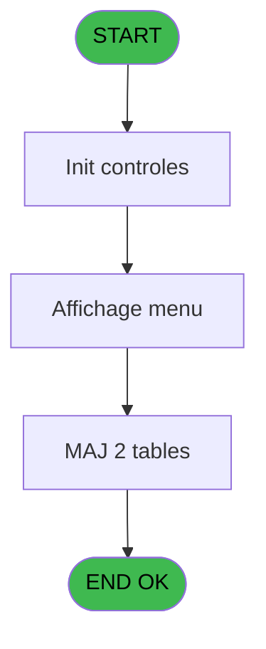
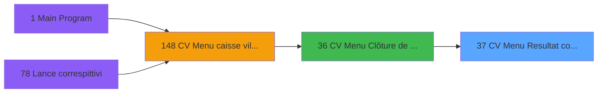
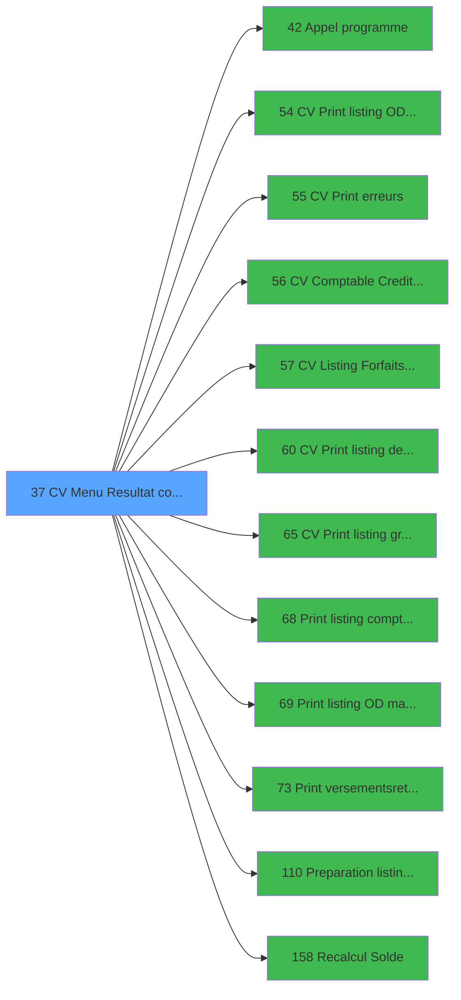

# VIL IDE 37 - CV Menu Resultat comptable

> **Analyse**: Phases 1-4 2026-02-03 01:22 -> 01:23 (36s) | Assemblage 01:23
> **Pipeline**: V7.2 Enrichi
> **Structure**: 4 onglets (Resume | Ecrans | Donnees | Connexions)

<!-- TAB:Resume -->

## 1. FICHE D'IDENTITE

| Attribut | Valeur |
|----------|--------|
| Projet | VIL |
| IDE Position | 37 |
| Nom Programme | CV Menu Resultat comptable |
| Fichier source | `Prg_37.xml` |
| Domaine metier | Navigation |
| Taches | 9 (4 ecrans visibles) |
| Tables modifiees | 2 |
| Programmes appeles | 12 |

## 2. DESCRIPTION FONCTIONNELLE

**CV Menu Resultat comptable** assure la gestion complete de ce processus, accessible depuis [CV  Menu Clôture de caisse (IDE 36)](VIL-IDE-36.md).

Le flux de traitement s'organise en **3 blocs fonctionnels** :

- **Traitement** (6 taches) : traitements metier divers
- **Consultation** (2 taches) : ecrans de recherche, selection et consultation
- **Calcul** (1 tache) : calculs de montants, stocks ou compteurs

**Donnees modifiees** : 2 tables en ecriture (cumul_od_manuels_odm, solde_caisse_____sks).

Detail : phases du traitement

#### Phase 1 : Calcul (1 tache)

- **37** - AC  Resultat comptable **[[ECRAN]](#ecran-t1)**

Delegue a : [CV Comptable Credit conso (IDE 56)](VIL-IDE-56.md), [Preparation listing comptable (IDE 110)](VIL-IDE-110.md), [Recalcul Solde (IDE 158)](VIL-IDE-158.md)

#### Phase 2 : Consultation (2 taches)

- **37.1** - Affichage menu **[[ECRAN]](#ecran-t2)**
- **37.4** - Affichage cumul des OD manuels **[[ECRAN]](#ecran-t5)**

#### Phase 3 : Traitement (6 taches)

- **37.2** - Veuillez patienter... **[[ECRAN]](#ecran-t3)**
- **37.3** - Veuillez patienter... **[[ECRAN]](#ecran-t4)**
- **37.5** - Enreg resultat du jour
- **37.6** - Lecture valeurs de la veille
- **37.7** - (sans nom) **[[ECRAN]](#ecran-t8)**
- **37.8** - Destruction fichier OD manuel

Delegue a : [Appel programme (IDE 42)](VIL-IDE-42.md), [CV Listing Forfaits TAI CASH (IDE 57)](VIL-IDE-57.md)

#### Tables impactees

| Table | Operations | Role metier |
|-------|-----------|-------------|
| cumul_od_manuels_odm | R/**W** (4 usages) |  |
| solde_caisse_____sks | R/**W** (2 usages) | Sessions de caisse |

## 3. BLOCS FONCTIONNELS

### 3.1 Calcul (1 tache)

Calculs metier : montants, stocks, compteurs.

---

#### 37 - AC  Resultat comptable [[ECRAN]](#ecran-t1)

**Role** : Traitement : AC  Resultat comptable.
**Ecran** : 960 x 199 DLU (MDI) | [Voir mockup](#ecran-t1)
**Variables liees** : C (P0 date comptable), Y (W0 resultat J), BA (W0 resultat J-1)
**Delegue a** : [CV Comptable Credit conso (IDE 56)](VIL-IDE-56.md), [Preparation listing comptable (IDE 110)](VIL-IDE-110.md), [Recalcul Solde (IDE 158)](VIL-IDE-158.md)

### 3.2 Consultation (2 taches)

Ecrans de recherche et consultation.

---

#### 37.1 - Affichage menu [[ECRAN]](#ecran-t2)

**Role** : Reinitialisation : Affichage menu.
**Ecran** : 792 x 255 DLU (MDI) | [Voir mockup](#ecran-t2)

---

#### 37.4 - Affichage cumul des OD manuels [[ECRAN]](#ecran-t5)

**Role** : Reinitialisation : Affichage cumul des OD manuels.
**Ecran** : 738 x 254 DLU (MDI) | [Voir mockup](#ecran-t5)
**Variables liees** : B (P0 masque cumul), Z (W0 cumul J), BB (W0 cumul J-1)

### 3.3 Traitement (6 taches)

Traitements internes.

---

#### 37.2 - Veuillez patienter... [[ECRAN]](#ecran-t3)

**Role** : Traitement : Veuillez patienter....
**Ecran** : 424 x 57 DLU (MDI) | [Voir mockup](#ecran-t3)
**Delegue a** : [Appel programme (IDE 42)](VIL-IDE-42.md), [CV Listing Forfaits TAI CASH (IDE 57)](VIL-IDE-57.md)

---

#### 37.3 - Veuillez patienter... [[ECRAN]](#ecran-t4)

**Role** : Traitement : Veuillez patienter....
**Ecran** : 424 x 57 DLU (MDI) | [Voir mockup](#ecran-t4)
**Delegue a** : [Appel programme (IDE 42)](VIL-IDE-42.md), [CV Listing Forfaits TAI CASH (IDE 57)](VIL-IDE-57.md)

---

#### 37.5 - Enreg resultat du jour

**Role** : Traitement : Enreg resultat du jour.
**Variables liees** : Y (W0 resultat J), BA (W0 resultat J-1)
**Delegue a** : [Appel programme (IDE 42)](VIL-IDE-42.md), [CV Listing Forfaits TAI CASH (IDE 57)](VIL-IDE-57.md)

---

#### 37.6 - Lecture valeurs de la veille

**Role** : Traitement : Lecture valeurs de la veille.
**Variables liees** : BD (W0 date veille)
**Delegue a** : [Appel programme (IDE 42)](VIL-IDE-42.md), [CV Listing Forfaits TAI CASH (IDE 57)](VIL-IDE-57.md)

---

#### 37.7 - (sans nom) [[ECRAN]](#ecran-t8)

**Role** : Traitement interne.
**Ecran** : 100 x 24 DLU (MDI) | [Voir mockup](#ecran-t8)
**Delegue a** : [Appel programme (IDE 42)](VIL-IDE-42.md), [CV Listing Forfaits TAI CASH (IDE 57)](VIL-IDE-57.md)

---

#### 37.8 - Destruction fichier OD manuel

**Role** : Traitement : Destruction fichier OD manuel.
**Delegue a** : [Appel programme (IDE 42)](VIL-IDE-42.md), [CV Listing Forfaits TAI CASH (IDE 57)](VIL-IDE-57.md)

## 5. REGLES METIER

*(Aucune regle metier identifiee)*

## 6. CONTEXTE

- **Appele par**: [CV  Menu Clôture de caisse (IDE 36)](VIL-IDE-36.md)
- **Appelle**: 12 programmes | **Tables**: 4 (W:2 R:2 L:2) | **Taches**: 9 | **Expressions**: 17

<!-- TAB:Ecrans -->

## 8. ECRANS

### 8.1 Forms visibles (4 / 9)

| # | Position | Tache | Nom | Type | Largeur | Hauteur | Bloc |
|---|----------|-------|-----|------|---------|---------|------|
| 1 | 37.1 | 37.1 | Affichage menu | MDI | 792 | 255 | Consultation |
| 2 | 37.2 | 37.2 | Veuillez patienter... | MDI | 424 | 57 | Traitement |
| 3 | 37.3 | 37.3 | Veuillez patienter... | MDI | 424 | 57 | Traitement |
| 4 | 37.4 | 37.4 | Affichage cumul des OD manuels | MDI | 738 | 254 | Consultation |

### 8.2 Mockups Ecrans

---

#### 37.1 - Affichage menu
**Tache** : [37.1](#t2) | **Type** : MDI | **Dimensions** : 792 x 255 DLU
**Bloc** : Consultation | **Titre IDE** : Affichage menu

<!-- FORM-DATA:
{
    "width":  792,
    "vFactor":  8,
    "type":  "MDI",
    "hFactor":  8,
    "controls":  [
                     {
                         "x":  0,
                         "type":  "label",
                         "var":  "",
                         "y":  0,
                         "w":  787,
                         "fmt":  "",
                         "name":  "",
                         "h":  17,
                         "color":  "",
                         "text":  "",
                         "parent":  null
                     },
                     {
                         "x":  0,
                         "type":  "label",
                         "var":  "",
                         "y":  21,
                         "w":  792,
                         "fmt":  "",
                         "name":  "",
                         "h":  208,
                         "color":  "",
                         "text":  "",
                         "parent":  null
                     },
                     {
                         "x":  39,
                         "type":  "label",
                         "var":  "",
                         "y":  37,
                         "w":  341,
                         "fmt":  "",
                         "name":  "",
                         "h":  49,
                         "color":  "",
                         "text":  "",
                         "parent":  null
                     },
                     {
                         "x":  427,
                         "type":  "label",
                         "var":  "",
                         "y":  37,
                         "w":  327,
                         "fmt":  "",
                         "name":  "",
                         "h":  49,
                         "color":  "",
                         "text":  "",
                         "parent":  null
                     },
                     {
                         "x":  41,
                         "type":  "label",
                         "var":  "",
                         "y":  38,
                         "w":  336,
                         "fmt":  "",
                         "name":  "",
                         "h":  47,
                         "color":  "",
                         "text":  "",
                         "parent":  null
                     },
                     {
                         "x":  431,
                         "type":  "label",
                         "var":  "",
                         "y":  38,
                         "w":  322,
                         "fmt":  "",
                         "name":  "",
                         "h":  47,
                         "color":  "",
                         "text":  "",
                         "parent":  null
                     },
                     {
                         "x":  54,
                         "type":  "label",
                         "var":  "",
                         "y":  44,
                         "w":  94,
                         "fmt":  "",
                         "name":  "",
                         "h":  8,
                         "color":  "7",
                         "text":  "Resultat au",
                         "parent":  null
                     },
                     {
                         "x":  440,
                         "type":  "label",
                         "var":  "",
                         "y":  44,
                         "w":  94,
                         "fmt":  "",
                         "name":  "",
                         "h":  8,
                         "color":  "7",
                         "text":  "Resultat au",
                         "parent":  null
                     },
                     {
                         "x":  54,
                         "type":  "label",
                         "var":  "",
                         "y":  56,
                         "w":  35,
                         "fmt":  "",
                         "name":  "",
                         "h":  8,
                         "color":  "7",
                         "text":  "jour",
                         "parent":  null
                     },
                     {
                         "x":  440,
                         "type":  "label",
                         "var":  "",
                         "y":  57,
                         "w":  35,
                         "fmt":  "",
                         "name":  "",
                         "h":  8,
                         "color":  "7",
                         "text":  "jour",
                         "parent":  null
                     },
                     {
                         "x":  54,
                         "type":  "label",
                         "var":  "",
                         "y":  70,
                         "w":  82,
                         "fmt":  "",
                         "name":  "",
                         "h":  8,
                         "color":  "7",
                         "text":  "cumul",
                         "parent":  null
                     },
                     {
                         "x":  440,
                         "type":  "label",
                         "var":  "",
                         "y":  71,
                         "w":  82,
                         "fmt":  "",
                         "name":  "",
                         "h":  8,
                         "color":  "7",
                         "text":  "cumul",
                         "parent":  null
                     },
                     {
                         "x":  220,
                         "type":  "label",
                         "var":  "",
                         "y":  89,
                         "w":  531,
                         "fmt":  "",
                         "name":  "",
                         "h":  124,
                         "color":  "",
                         "text":  "",
                         "parent":  null
                     },
                     {
                         "x":  223,
                         "type":  "label",
                         "var":  "",
                         "y":  90,
                         "w":  50,
                         "fmt":  "",
                         "name":  "",
                         "h":  122,
                         "color":  "",
                         "text":  "",
                         "parent":  null
                     },
                     {
                         "x":  281,
                         "type":  "label",
                         "var":  "",
                         "y":  94,
                         "w":  400,
                         "fmt":  "",
                         "name":  "",
                         "h":  8,
                         "color":  "7",
                         "text":  "Listing versements/retraits",
                         "parent":  null
                     },
                     {
                         "x":  281,
                         "type":  "label",
                         "var":  "",
                         "y":  107,
                         "w":  400,
                         "fmt":  "",
                         "name":  "",
                         "h":  8,
                         "color":  "7",
                         "text":  "Verification des OD manuels",
                         "parent":  null
                     },
                     {
                         "x":  281,
                         "type":  "label",
                         "var":  "",
                         "y":  119,
                         "w":  400,
                         "fmt":  "",
                         "name":  "",
                         "h":  8,
                         "color":  "7",
                         "text":  "Listing des erreurs",
                         "parent":  null
                     },
                     {
                         "x":  281,
                         "type":  "label",
                         "var":  "",
                         "y":  131,
                         "w":  400,
                         "fmt":  "",
                         "name":  "",
                         "h":  8,
                         "color":  "7",
                         "text":  "Listing des ODS",
                         "parent":  null
                     },
                     {
                         "x":  281,
                         "type":  "label",
                         "var":  "",
                         "y":  143,
                         "w":  400,
                         "fmt":  "",
                         "name":  "",
                         "h":  8,
                         "color":  "7",
                         "text":  "Impression du compte adherent",
                         "parent":  null
                     },
                     {
                         "x":  281,
                         "type":  "label",
                         "var":  "",
                         "y":  168,
                         "w":  400,
                         "fmt":  "",
                         "name":  "",
                         "h":  8,
                         "color":  "7",
                         "text":  "Listing des forfaits TAI CASH",
                         "parent":  null
                     },
                     {
                         "x":  281,
                         "type":  "label",
                         "var":  "",
                         "y":  181,
                         "w":  400,
                         "fmt":  "",
                         "name":  "",
                         "h":  8,
                         "color":  "7",
                         "text":  "Validation comptable du jour",
                         "parent":  null
                     },
                     {
                         "x":  351,
                         "type":  "label",
                         "var":  "",
                         "y":  217,
                         "w":  206,
                         "fmt":  "",
                         "name":  "",
                         "h":  8,
                         "color":  "",
                         "text":  "Choix de l\u0027action",
                         "parent":  null
                     },
                     {
                         "x":  0,
                         "type":  "label",
                         "var":  "",
                         "y":  232,
                         "w":  792,
                         "fmt":  "",
                         "name":  "",
                         "h":  23,
                         "color":  "",
                         "text":  "",
                         "parent":  null
                     },
                     {
                         "x":  555,
                         "type":  "edit",
                         "var":  "",
                         "y":  216,
                         "w":  32,
                         "fmt":  "UA",
                         "name":  "W1 choix action",
                         "h":  10,
                         "color":  "6",
                         "text":  "",
                         "parent":  null
                     },
                     {
                         "x":  8,
                         "type":  "edit",
                         "var":  "",
                         "y":  4,
                         "w":  267,
                         "fmt":  "20",
                         "name":  "",
                         "h":  8,
                         "color":  "",
                         "text":  "",
                         "parent":  1
                     },
                     {
                         "x":  577,
                         "type":  "edit",
                         "var":  "",
                         "y":  4,
                         "w":  203,
                         "fmt":  "WWW DD MMM YYYYZ",
                         "name":  "",
                         "h":  8,
                         "color":  "",
                         "text":  "",
                         "parent":  1
                     },
                     {
                         "x":  6,
                         "type":  "edit",
                         "var":  "",
                         "y":  23,
                         "w":  775,
                         "fmt":  "50",
                         "name":  "",
                         "h":  12,
                         "color":  "7",
                         "text":  "",
                         "parent":  null
                     },
                     {
                         "x":  229,
                         "type":  "edit",
                         "var":  "",
                         "y":  43,
                         "w":  123,
                         "fmt":  "DD/MM/YYYYZ",
                         "name":  "",
                         "h":  9,
                         "color":  "",
                         "text":  "",
                         "parent":  null
                     },
                     {
                         "x":  608,
                         "type":  "edit",
                         "var":  "",
                         "y":  43,
                         "w":  123,
                         "fmt":  "DD/MM/YYYYZ",
                         "name":  "",
                         "h":  9,
                         "color":  "",
                         "text":  "",
                         "parent":  null
                     },
                     {
                         "x":  150,
                         "type":  "edit",
                         "var":  "",
                         "y":  56,
                         "w":  202,
                         "fmt":  "17",
                         "name":  "",
                         "h":  9,
                         "color":  "",
                         "text":  "",
                         "parent":  null
                     },
                     {
                         "x":  529,
                         "type":  "edit",
                         "var":  "",
                         "y":  56,
                         "w":  202,
                         "fmt":  "17",
                         "name":  "",
                         "h":  9,
                         "color":  "",
                         "text":  "",
                         "parent":  null
                     },
                     {
                         "x":  150,
                         "type":  "edit",
                         "var":  "",
                         "y":  70,
                         "w":  202,
                         "fmt":  "17",
                         "name":  "",
                         "h":  9,
                         "color":  "",
                         "text":  "",
                         "parent":  null
                     },
                     {
                         "x":  529,
                         "type":  "edit",
                         "var":  "",
                         "y":  70,
                         "w":  202,
                         "fmt":  "17",
                         "name":  "",
                         "h":  9,
                         "color":  "",
                         "text":  "",
                         "parent":  null
                     },
                     {
                         "x":  703,
                         "type":  "edit",
                         "var":  "",
                         "y":  94,
                         "w":  37,
                         "fmt":  "2",
                         "name":  "",
                         "h":  8,
                         "color":  "",
                         "text":  "",
                         "parent":  null
                     },
                     {
                         "x":  233,
                         "type":  "button",
                         "var":  "",
                         "y":  95,
                         "w":  26,
                         "fmt":  "1",
                         "name":  "1",
                         "h":  9,
                         "color":  "",
                         "text":  "",
                         "parent":  null
                     },
                     {
                         "x":  233,
                         "type":  "button",
                         "var":  "",
                         "y":  107,
                         "w":  26,
                         "fmt":  "2",
                         "name":  "2",
                         "h":  9,
                         "color":  "",
                         "text":  "",
                         "parent":  null
                     },
                     {
                         "x":  703,
                         "type":  "edit",
                         "var":  "",
                         "y":  107,
                         "w":  37,
                         "fmt":  "2",
                         "name":  "",
                         "h":  8,
                         "color":  "",
                         "text":  "",
                         "parent":  null
                     },
                     {
                         "x":  233,
                         "type":  "button",
                         "var":  "",
                         "y":  119,
                         "w":  26,
                         "fmt":  "3",
                         "name":  "3",
                         "h":  9,
                         "color":  "",
                         "text":  "",
                         "parent":  null
                     },
                     {
                         "x":  703,
                         "type":  "edit",
                         "var":  "",
                         "y":  119,
                         "w":  37,
                         "fmt":  "2",
                         "name":  "",
                         "h":  8,
                         "color":  "",
                         "text":  "",
                         "parent":  null
                     },
                     {
                         "x":  22,
                         "type":  "image",
                         "var":  "",
                         "y":  120,
                         "w":  160,
                         "fmt":  "",
                         "name":  "",
                         "h":  53,
                         "color":  "",
                         "text":  "",
                         "parent":  null
                     },
                     {
                         "x":  233,
                         "type":  "button",
                         "var":  "",
                         "y":  131,
                         "w":  26,
                         "fmt":  "4",
                         "name":  "4",
                         "h":  9,
                         "color":  "",
                         "text":  "",
                         "parent":  null
                     },
                     {
                         "x":  703,
                         "type":  "edit",
                         "var":  "",
                         "y":  131,
                         "w":  37,
                         "fmt":  "2",
                         "name":  "",
                         "h":  8,
                         "color":  "",
                         "text":  "",
                         "parent":  null
                     },
                     {
                         "x":  233,
                         "type":  "button",
                         "var":  "",
                         "y":  143,
                         "w":  26,
                         "fmt":  "5",
                         "name":  "5",
                         "h":  9,
                         "color":  "",
                         "text":  "",
                         "parent":  null
                     },
                     {
                         "x":  703,
                         "type":  "edit",
                         "var":  "",
                         "y":  143,
                         "w":  37,
                         "fmt":  "2",
                         "name":  "",
                         "h":  8,
                         "color":  "",
                         "text":  "",
                         "parent":  null
                     },
                     {
                         "x":  233,
                         "type":  "button",
                         "var":  "",
                         "y":  155,
                         "w":  26,
                         "fmt":  "6",
                         "name":  "6",
                         "h":  9,
                         "color":  "",
                         "text":  "",
                         "parent":  null
                     },
                     {
                         "x":  281,
                         "type":  "edit",
                         "var":  "",
                         "y":  155,
                         "w":  400,
                         "fmt":  "30",
                         "name":  "",
                         "h":  10,
                         "color":  "7",
                         "text":  "",
                         "parent":  null
                     },
                     {
                         "x":  703,
                         "type":  "edit",
                         "var":  "",
                         "y":  155,
                         "w":  37,
                         "fmt":  "2",
                         "name":  "",
                         "h":  8,
                         "color":  "",
                         "text":  "",
                         "parent":  null
                     },
                     {
                         "x":  233,
                         "type":  "button",
                         "var":  "",
                         "y":  167,
                         "w":  26,
                         "fmt":  "7",
                         "name":  "7",
                         "h":  9,
                         "color":  "",
                         "text":  "",
                         "parent":  null
                     },
                     {
                         "x":  703,
                         "type":  "edit",
                         "var":  "",
                         "y":  168,
                         "w":  37,
                         "fmt":  "2",
                         "name":  "",
                         "h":  8,
                         "color":  "",
                         "text":  "",
                         "parent":  null
                     },
                     {
                         "x":  233,
                         "type":  "button",
                         "var":  "",
                         "y":  180,
                         "w":  26,
                         "fmt":  "8",
                         "name":  "8",
                         "h":  9,
                         "color":  "",
                         "text":  "",
                         "parent":  null
                     },
                     {
                         "x":  703,
                         "type":  "edit",
                         "var":  "",
                         "y":  181,
                         "w":  37,
                         "fmt":  "2",
                         "name":  "",
                         "h":  8,
                         "color":  "",
                         "text":  "",
                         "parent":  null
                     },
                     {
                         "x":  8,
                         "type":  "button",
                         "var":  "",
                         "y":  235,
                         "w":  160,
                         "fmt":  "\u0026Quitter",
                         "name":  "",
                         "h":  18,
                         "color":  "",
                         "text":  "",
                         "parent":  null
                     }
                 ],
    "taskId":  "37.1",
    "height":  255
}
-->

<strong>Champs : 19 champs</strong>

| Pos (x,y) | Nom | Variable | Type |
|-----------|-----|----------|------|
| 555,216 | W1 choix action | - | edit |
| 8,4 | 20 | - | edit |
| 577,4 | WWW DD MMM YYYYZ | - | edit |
| 6,23 | 50 | - | edit |
| 229,43 | DD/MM/YYYYZ | - | edit |
| 608,43 | DD/MM/YYYYZ | - | edit |
| 150,56 | 17 | - | edit |
| 529,56 | 17 | - | edit |
| 150,70 | 17 | - | edit |
| 529,70 | 17 | - | edit |
| 703,94 | 2 | - | edit |
| 703,107 | 2 | - | edit |
| 703,119 | 2 | - | edit |
| 703,131 | 2 | - | edit |
| 703,143 | 2 | - | edit |
| 281,155 | 30 | - | edit |
| 703,155 | 2 | - | edit |
| 703,168 | 2 | - | edit |
| 703,181 | 2 | - | edit |

<strong>Boutons : 9 boutons</strong>

| Bouton | Pos (x,y) | Action |
|--------|-----------|--------|
| 1 | 233,95 | Bouton fonctionnel |
| 2 | 233,107 | Bouton fonctionnel |
| 3 | 233,119 | Bouton fonctionnel |
| 4 | 233,131 | Bouton fonctionnel |
| 5 | 233,143 | Bouton fonctionnel |
| 6 | 233,155 | Bouton fonctionnel |
| 7 | 233,167 | Bouton fonctionnel |
| 8 | 233,180 | Bouton fonctionnel |
| Quitter | 8,235 | Quitte le programme |

---

#### 37.2 - Veuillez patienter...
**Tache** : [37.2](#t3) | **Type** : MDI | **Dimensions** : 424 x 57 DLU
**Bloc** : Traitement | **Titre IDE** : Veuillez patienter...

<!-- FORM-DATA:
{
    "width":  424,
    "vFactor":  8,
    "type":  "MDI",
    "hFactor":  8,
    "controls":  [
                     {
                         "x":  0,
                         "type":  "label",
                         "var":  "",
                         "y":  0,
                         "w":  423,
                         "fmt":  "",
                         "name":  "",
                         "h":  29,
                         "color":  "",
                         "text":  "",
                         "parent":  null
                     },
                     {
                         "x":  120,
                         "type":  "label",
                         "var":  "",
                         "y":  10,
                         "w":  221,
                         "fmt":  "",
                         "name":  "",
                         "h":  8,
                         "color":  "7",
                         "text":  "Creation en cours ...",
                         "parent":  null
                     },
                     {
                         "x":  0,
                         "type":  "label",
                         "var":  "",
                         "y":  29,
                         "w":  423,
                         "fmt":  "",
                         "name":  "",
                         "h":  27,
                         "color":  "",
                         "text":  "",
                         "parent":  null
                     },
                     {
                         "x":  72,
                         "type":  "label",
                         "var":  "",
                         "y":  38,
                         "w":  280,
                         "fmt":  "",
                         "name":  "",
                         "h":  8,
                         "color":  "",
                         "text":  "Cumul des OD manuels",
                         "parent":  null
                     },
                     {
                         "x":  4,
                         "type":  "image",
                         "var":  "",
                         "y":  2,
                         "w":  72,
                         "fmt":  "",
                         "name":  "",
                         "h":  25,
                         "color":  "",
                         "text":  "",
                         "parent":  null
                     }
                 ],
    "taskId":  "37.2",
    "height":  57
}
-->

---

#### 37.3 - Veuillez patienter...
**Tache** : [37.3](#t4) | **Type** : MDI | **Dimensions** : 424 x 57 DLU
**Bloc** : Traitement | **Titre IDE** : Veuillez patienter...

<!-- FORM-DATA:
{
    "width":  424,
    "vFactor":  8,
    "type":  "MDI",
    "hFactor":  8,
    "controls":  [
                     {
                         "x":  0,
                         "type":  "label",
                         "var":  "",
                         "y":  0,
                         "w":  423,
                         "fmt":  "",
                         "name":  "",
                         "h":  29,
                         "color":  "",
                         "text":  "",
                         "parent":  null
                     },
                     {
                         "x":  120,
                         "type":  "label",
                         "var":  "",
                         "y":  10,
                         "w":  221,
                         "fmt":  "",
                         "name":  "",
                         "h":  8,
                         "color":  "7",
                         "text":  "Creation en cours ...",
                         "parent":  null
                     },
                     {
                         "x":  0,
                         "type":  "label",
                         "var":  "",
                         "y":  29,
                         "w":  423,
                         "fmt":  "",
                         "name":  "",
                         "h":  27,
                         "color":  "",
                         "text":  "",
                         "parent":  null
                     },
                     {
                         "x":  72,
                         "type":  "label",
                         "var":  "",
                         "y":  38,
                         "w":  280,
                         "fmt":  "",
                         "name":  "",
                         "h":  8,
                         "color":  "",
                         "text":  "Cumul des OD manuels",
                         "parent":  null
                     },
                     {
                         "x":  4,
                         "type":  "image",
                         "var":  "",
                         "y":  2,
                         "w":  72,
                         "fmt":  "",
                         "name":  "",
                         "h":  25,
                         "color":  "",
                         "text":  "",
                         "parent":  null
                     }
                 ],
    "taskId":  "37.3",
    "height":  57
}
-->

---

#### 37.4 - Affichage cumul des OD manuels
**Tache** : [37.4](#t5) | **Type** : MDI | **Dimensions** : 738 x 254 DLU
**Bloc** : Consultation | **Titre IDE** : Affichage cumul des OD manuels

<!-- FORM-DATA:
{
    "width":  738,
    "vFactor":  8,
    "type":  "MDI",
    "hFactor":  8,
    "controls":  [
                     {
                         "x":  2,
                         "type":  "label",
                         "var":  "",
                         "y":  0,
                         "w":  734,
                         "fmt":  "",
                         "name":  "",
                         "h":  17,
                         "color":  "",
                         "text":  "",
                         "parent":  null
                     },
                     {
                         "x":  52,
                         "type":  "label",
                         "var":  "",
                         "y":  22,
                         "w":  633,
                         "fmt":  "",
                         "name":  "",
                         "h":  13,
                         "color":  "7",
                         "text":  "Vérification des OD manuels",
                         "parent":  null
                     },
                     {
                         "x":  52,
                         "type":  "label",
                         "var":  "",
                         "y":  35,
                         "w":  633,
                         "fmt":  "",
                         "name":  "",
                         "h":  189,
                         "color":  "",
                         "text":  "",
                         "parent":  null
                     },
                     {
                         "x":  67,
                         "type":  "table",
                         "var":  "",
                         "name":  "",
                         "titleH":  12,
                         "color":  "110",
                         "w":  603,
                         "y":  43,
                         "fmt":  "",
                         "parent":  null,
                         "text":  "",
                         "rowH":  14,
                         "h":  114,
                         "cols":  [
                                      {
                                          "title":  "Imputation",
                                          "layer":  1,
                                          "w":  135
                                      },
                                      {
                                          "title":  "Montant",
                                          "layer":  2,
                                          "w":  218
                                      },
                                      {
                                          "title":  "Gratuité",
                                          "layer":  3,
                                          "w":  218
                                      }
                                  ],
                         "rows":  3
                     },
                     {
                         "x":  295,
                         "type":  "label",
                         "var":  "",
                         "y":  164,
                         "w":  323,
                         "fmt":  "",
                         "name":  "",
                         "h":  53,
                         "color":  "",
                         "text":  "",
                         "parent":  null
                     },
                     {
                         "x":  296,
                         "type":  "label",
                         "var":  "",
                         "y":  165,
                         "w":  320,
                         "fmt":  "",
                         "name":  "",
                         "h":  51,
                         "color":  "",
                         "text":  "",
                         "parent":  null
                     },
                     {
                         "x":  337,
                         "type":  "label",
                         "var":  "",
                         "y":  173,
                         "w":  236,
                         "fmt":  "",
                         "name":  "",
                         "h":  22,
                         "color":  "",
                         "text":  "",
                         "parent":  null
                     },
                     {
                         "x":  339,
                         "type":  "label",
                         "var":  "",
                         "y":  174,
                         "w":  40,
                         "fmt":  "",
                         "name":  "",
                         "h":  20,
                         "color":  "",
                         "text":  "",
                         "parent":  null
                     },
                     {
                         "x":  403,
                         "type":  "label",
                         "var":  "",
                         "y":  180,
                         "w":  146,
                         "fmt":  "",
                         "name":  "",
                         "h":  8,
                         "color":  "7",
                         "text":  "Impression",
                         "parent":  null
                     },
                     {
                         "x":  357,
                         "type":  "label",
                         "var":  "",
                         "y":  202,
                         "w":  162,
                         "fmt":  "",
                         "name":  "",
                         "h":  8,
                         "color":  "",
                         "text":  "Choix de l\u0027action",
                         "parent":  15
                     },
                     {
                         "x":  2,
                         "type":  "label",
                         "var":  "",
                         "y":  231,
                         "w":  735,
                         "fmt":  "",
                         "name":  "",
                         "h":  23,
                         "color":  "",
                         "text":  "",
                         "parent":  null
                     },
                     {
                         "x":  73,
                         "type":  "edit",
                         "var":  "",
                         "y":  59,
                         "w":  120,
                         "fmt":  "",
                         "name":  "",
                         "h":  8,
                         "color":  "110",
                         "text":  "",
                         "parent":  6
                     },
                     {
                         "x":  214,
                         "type":  "edit",
                         "var":  "",
                         "y":  59,
                         "w":  198,
                         "fmt":  "17",
                         "name":  "",
                         "h":  8,
                         "color":  "110",
                         "text":  "",
                         "parent":  6
                     },
                     {
                         "x":  434,
                         "type":  "edit",
                         "var":  "",
                         "y":  59,
                         "w":  198,
                         "fmt":  "17",
                         "name":  "",
                         "h":  8,
                         "color":  "110",
                         "text":  "",
                         "parent":  6
                     },
                     {
                         "x":  522,
                         "type":  "edit",
                         "var":  "",
                         "y":  200,
                         "w":  26,
                         "fmt":  "",
                         "name":  "W1 impression",
                         "h":  10,
                         "color":  "6",
                         "text":  "",
                         "parent":  15
                     },
                     {
                         "x":  7,
                         "type":  "edit",
                         "var":  "",
                         "y":  5,
                         "w":  395,
                         "fmt":  "30",
                         "name":  "",
                         "h":  8,
                         "color":  "",
                         "text":  "",
                         "parent":  1
                     },
                     {
                         "x":  391,
                         "type":  "edit",
                         "var":  "",
                         "y":  5,
                         "w":  339,
                         "fmt":  "WWW DD MMM YYYYZ",
                         "name":  "",
                         "h":  8,
                         "color":  "",
                         "text":  "",
                         "parent":  1
                     },
                     {
                         "x":  93,
                         "type":  "image",
                         "var":  "",
                         "y":  162,
                         "w":  131,
                         "fmt":  "",
                         "name":  "",
                         "h":  55,
                         "color":  "",
                         "text":  "",
                         "parent":  5
                     },
                     {
                         "x":  346,
                         "type":  "button",
                         "var":  "",
                         "y":  180,
                         "w":  26,
                         "fmt":  "I",
                         "name":  "I",
                         "h":  9,
                         "color":  "",
                         "text":  "",
                         "parent":  null
                     },
                     {
                         "x":  10,
                         "type":  "button",
                         "var":  "",
                         "y":  234,
                         "w":  160,
                         "fmt":  "\u0026Quitter",
                         "name":  "",
                         "h":  18,
                         "color":  "",
                         "text":  "",
                         "parent":  null
                     }
                 ],
    "taskId":  "37.4",
    "height":  254
}
-->

<strong>Champs : 6 champs</strong>

| Pos (x,y) | Nom | Variable | Type |
|-----------|-----|----------|------|
| 73,59 | (sans nom) | - | edit |
| 214,59 | 17 | - | edit |
| 434,59 | 17 | - | edit |
| 522,200 | W1 impression | - | edit |
| 7,5 | 30 | - | edit |
| 391,5 | WWW DD MMM YYYYZ | - | edit |

<strong>Boutons : 2 boutons</strong>

| Bouton | Pos (x,y) | Action |
|--------|-----------|--------|
| I | 346,180 | Bouton fonctionnel |
| Quitter | 10,234 | Quitte le programme |

## 9. NAVIGATION

### 9.1 Enchainement des ecrans

```mermaid
flowchart TD
    START([Entree])
    style START fill:#3fb950
    VF2[37.1 Affichage menu]
    style VF2 fill:#58a6ff
    VF3[37.2 Veuillez patienter...]
    style VF3 fill:#58a6ff
    VF4[37.3 Veuillez patienter...]
    style VF4 fill:#58a6ff
    VF5[37.4 Affichage cumul des...]
    style VF5 fill:#58a6ff
    EXT42[IDE 42 Appel programme]
    style EXT42 fill:#3fb950
    EXT54[IDE 54 CV Print listin...]
    style EXT54 fill:#3fb950
    EXT55[IDE 55 CV Print erreurs]
    style EXT55 fill:#3fb950
    EXT56[IDE 56 CV Comptable Cr...]
    style EXT56 fill:#3fb950
    EXT57[IDE 57 CV Listing Forf...]
    style EXT57 fill:#3fb950
    EXT60[IDE 60 CV Print listin...]
    style EXT60 fill:#3fb950
    EXT65[IDE 65 CV Print listin...]
    style EXT65 fill:#3fb950
    EXT68[IDE 68 Print listing c...]
    style EXT68 fill:#3fb950
    EXT69[IDE 69 Print listing O...]
    style EXT69 fill:#3fb950
    EXT73[IDE 73 Print versement...]
    style EXT73 fill:#3fb950
    EXT110[IDE 110 Preparation li...]
    style EXT110 fill:#3fb950
    EXT158[IDE 158 Recalcul Solde]
    style EXT158 fill:#3fb950
    FIN([Sortie])
    style FIN fill:#f85149
    START --> VF2
    VF2 -->|Sous-programme| EXT42
    VF2 -->|Impression ticket/document| EXT54
    VF2 -->|Impression ticket/document| EXT55
    VF2 -->|Sous-programme| EXT56
    VF2 -->|Configuration impression| EXT57
    VF2 -->|Impression ticket/document| EXT60
    VF2 -->|Impression ticket/document| EXT65
    VF2 -->|Impression ticket/document| EXT68
    EXT158 --> FIN
```

**Detail par enchainement :**

| Depuis | Action | Vers | Retour |
|--------|--------|------|--------|
| Affichage menu | Sous-programme | [Appel programme (IDE 42)](VIL-IDE-42.md) | Retour ecran |
| Affichage menu | Impression ticket/document | [CV  Print listing OD gratuits (IDE 54)](VIL-IDE-54.md) | Retour ecran |
| Affichage menu | Impression ticket/document | [CV  Print erreurs (IDE 55)](VIL-IDE-55.md) | Retour ecran |
| Affichage menu | Sous-programme | [CV Comptable Credit conso (IDE 56)](VIL-IDE-56.md) | Retour ecran |
| Affichage menu | Configuration impression | [CV Listing Forfaits TAI CASH (IDE 57)](VIL-IDE-57.md) | Retour ecran |
| Affichage menu | Impression ticket/document | [CV  Print listing des comptes (IDE 60)](VIL-IDE-60.md) | Retour ecran |
| Affichage menu | Impression ticket/document | [CV  Print listing gratuites (IDE 65)](VIL-IDE-65.md) | Retour ecran |
| Affichage menu | Impression ticket/document | [Print listing comptable (IDE 68)](VIL-IDE-68.md) | Retour ecran |
| Affichage menu | Impression ticket/document | [Print listing OD manuels (IDE 69)](VIL-IDE-69.md) | Retour ecran |
| Affichage menu | Impression ticket/document | [Print versements/retraits (IDE 73)](VIL-IDE-73.md) | Retour ecran |
| Affichage menu | Configuration impression | [Preparation listing comptable (IDE 110)](VIL-IDE-110.md) | Retour ecran |
| Affichage menu | Calcul de donnees | [Recalcul Solde (IDE 158)](VIL-IDE-158.md) | Retour ecran |

### 9.3 Structure hierarchique (9 taches)

| Position | Tache | Type | Dimensions | Bloc |
|----------|-------|------|------------|------|
| **37.1** | [**AC  Resultat comptable** (37)](#t1) [mockup](#ecran-t1) | MDI | 960x199 | Calcul |
| **37.2** | [**Affichage menu** (37.1)](#t2) [mockup](#ecran-t2) | MDI | 792x255 | Consultation |
| 37.2.1 | [Affichage cumul des OD manuels (37.4)](#t5) [mockup](#ecran-t5) | MDI | 738x254 | |
| **37.3** | [**Veuillez patienter...** (37.2)](#t3) [mockup](#ecran-t3) | MDI | 424x57 | Traitement |
| 37.3.1 | [Veuillez patienter... (37.3)](#t4) [mockup](#ecran-t4) | MDI | 424x57 | |
| 37.3.2 | [Enreg resultat du jour (37.5)](#t6) | MDI | - | |
| 37.3.3 | [Lecture valeurs de la veille (37.6)](#t7) | MDI | - | |
| 37.3.4 | [(sans nom) (37.7)](#t8) [mockup](#ecran-t8) | MDI | 100x24 | |
| 37.3.5 | [Destruction fichier OD manuel (37.8)](#t9) | MDI | - | |

### 9.4 Algorigramme

> **Legende**: Vert = START/END OK | Rouge = END KO | Bleu = Decisions
> *Algorigramme auto-genere. Utiliser `/algorigramme` pour une synthese metier detaillee.*

<!-- TAB:Donnees -->

## 10. TABLES

### Tables utilisees (4)

| ID | Nom | Description | Type | R | W | L | Usages |
|----|-----|-------------|------|---|---|---|--------|
| 38 | comptable_gratuite |  | DB |   |   | L | 1 |
| 40 | comptable________cte |  | DB |   |   | L | 1 |
| 49 | cumul_od_manuels_odm |  | DB | R | **W** |   | 4 |
| 55 | solde_caisse_____sks | Sessions de caisse | DB | R | **W** |   | 2 |

### Colonnes par table (3 / 2 tables avec colonnes identifiees)

Table 49 - cumul_od_manuels_odm (R/**W**) - 4 usages

| Lettre | Variable | Acces | Type |
|--------|----------|-------|------|
| A | W1 cumul montant | W | Numeric |
| B | P0 masque cumul | W | Alpha |
| BB | W0 cumul J-1 | W | Numeric |
| Z | W0 cumul J | W | Numeric |

Table 55 - solde_caisse_____sks (R/**W**) - 2 usages

*Table utilisee uniquement en Link ou aucune colonne Real identifiee dans le DataView.*

## 11. VARIABLES

### 11.1 Parametres entrants (16)

Variables recues du programme appelant ([CV  Menu Clôture de caisse (IDE 36)](VIL-IDE-36.md)).

| Lettre | Nom | Type | Usage dans |
|--------|-----|------|-----------|
| A | P0 societe | Alpha | - |
| B | P0 masque cumul | Alpha | - |
| C | P0 date comptable | Date | - |
| D | P0 top resul compta | Alpha | [37](#t1), [37.5](#t6) |
| E | P0 devise locale | Alpha | - |
| F | P0 masque montant | Alpha | - |
| G | P0 nom village | Alpha | - |
| H | P0 village CAM | Alpha | 3x parametre entrant |
| I | P0 village TEL | Alpha | - |
| J | P0 village Bibop | Alpha | - |
| K | P0 village PME | Alpha | 2x parametre entrant |
| L | P0 nbre decimales | Numeric | - |
| M | P0 uni/bilateral | Alpha | - |
| N | P0 village TAI | Alpha | 3x parametre entrant |
| O | P0 TAI Obligatoire | Alpha | 1x parametre entrant |
| P | P0 Action Abandon | Alpha | - |

### 11.2 Variables de travail (15)

Variables internes au programme.

| Lettre | Nom | Type | Usage dans |
|--------|-----|------|-----------|
| Q | W0 top verif V/R | Alpha | - |
| R | W0 top verif OD man. | Alpha | 2x calcul interne |
| S | W0 top verif erreurs | Alpha | 2x calcul interne |
| T | W0 top exec print OD | Alpha | 2x calcul interne |
| U | W0 top exec print GM | Alpha | 2x calcul interne |
| V | W0 top exec PME/EZCard | Alpha | 3x calcul interne |
| W | W0 top exec TAI | Alpha | 2x calcul interne |
| X | W0 saisie d'un OD | Alpha | 1x calcul interne |
| Y | W0 resultat J | Numeric | - |
| Z | W0 cumul J | Numeric | - |
| BA | W0 resultat J-1 | Numeric | - |
| BB | W0 cumul J-1 | Numeric | - |
| BC | W0 choix action | Alpha | - |
| BD | W0 date veille | Date | - |
| BE | W0 message | Alpha | - |

Toutes les 31 variables (liste complete)

| Cat | Lettre | Nom Variable | Type |
|-----|--------|--------------|------|
| P0 | **A** | P0 societe | Alpha |
| P0 | **B** | P0 masque cumul | Alpha |
| P0 | **C** | P0 date comptable | Date |
| P0 | **D** | P0 top resul compta | Alpha |
| P0 | **E** | P0 devise locale | Alpha |
| P0 | **F** | P0 masque montant | Alpha |
| P0 | **G** | P0 nom village | Alpha |
| P0 | **H** | P0 village CAM | Alpha |
| P0 | **I** | P0 village TEL | Alpha |
| P0 | **J** | P0 village Bibop | Alpha |
| P0 | **K** | P0 village PME | Alpha |
| P0 | **L** | P0 nbre decimales | Numeric |
| P0 | **M** | P0 uni/bilateral | Alpha |
| P0 | **N** | P0 village TAI | Alpha |
| P0 | **O** | P0 TAI Obligatoire | Alpha |
| P0 | **P** | P0 Action Abandon | Alpha |
| W0 | **Q** | W0 top verif V/R | Alpha |
| W0 | **R** | W0 top verif OD man. | Alpha |
| W0 | **S** | W0 top verif erreurs | Alpha |
| W0 | **T** | W0 top exec print OD | Alpha |
| W0 | **U** | W0 top exec print GM | Alpha |
| W0 | **V** | W0 top exec PME/EZCard | Alpha |
| W0 | **W** | W0 top exec TAI | Alpha |
| W0 | **X** | W0 saisie d'un OD | Alpha |
| W0 | **Y** | W0 resultat J | Numeric |
| W0 | **Z** | W0 cumul J | Numeric |
| W0 | **BA** | W0 resultat J-1 | Numeric |
| W0 | **BB** | W0 cumul J-1 | Numeric |
| W0 | **BC** | W0 choix action | Alpha |
| W0 | **BD** | W0 date veille | Date |
| W0 | **BE** | W0 message | Alpha |

## 12. EXPRESSIONS

**17 / 17 expressions decodees (100%)**

### 12.1 Repartition par type

| Type | Expressions | Regles |
|------|-------------|--------|
| CONSTANTE | 2 | 0 |
| DATE | 1 | 0 |
| CONDITION | 13 | 0 |
| OTHER | 1 | 0 |

### 12.2 Expressions cles par type

#### CONSTANTE (2 expressions)

| Type | IDE | Expression | Regle |
|------|-----|------------|-------|
| CONSTANTE | 15 | `'C'` | - |
| CONSTANTE | 13 | `'O'` | - |

#### DATE (1 expressions)

| Type | IDE | Expression | Regle |
|------|-----|------------|-------|
| DATE | 17 | `Date ()` | - |

#### CONDITION (13 expressions)

| Type | IDE | Expression | Regle |
|------|-----|------------|-------|
| CONDITION | 10 | `[AD]='F' AND P0 top resul compta [D]<>'O'` | - |
| CONDITION | 9 | `[AD]='F'` | - |
| CONDITION | 8 | `[AD]='8' AND P0 top resul compta [D]<>'O' AND W0 top verif OD man. [R]='O' AND W0 top verif erreurs [S]='O' AND W0 top exec print OD [T]='O' AND W0 top exec print GM [U]='O' AND W0 top exec PME/EZCard [V]='O' AND (W0 top exec TAI [W]='O' AND (P0 village PME [K]='O' OR P0 village CAM [H]='O') OR P0 village CAM [H]<>'O' AND P0 village PME [K]<>'O') AND (P0 village TAI [N]='O' AND W0 saisie d'un OD [X]='O' OR P0 village TAI [N]<>'O')` | - |
| CONDITION | 14 | `P0 village TAI [N]<>'O' OR P0 village TAI [N]='O' AND P0 TAI Obligatoire [O]<>'1'` | - |
| CONDITION | 12 | `P0 village PME [K]<>'O' AND P0 village CAM [H]<>'O' AND W0 top exec PME/EZCard [V]='O' OR P0 village PME [K]='O' AND W0 top exec TAI [W]='O' OR P0 village CAM [H]='O' AND W0 top exec TAI [W]='O'` | - |
| ... | | *+8 autres* | |

#### OTHER (1 expressions)

| Type | IDE | Expression | Regle |
|------|-----|------------|-------|
| OTHER | 16 | `{1,6}` | - |

<!-- TAB:Connexions -->

## 13. GRAPHE D'APPELS

### 13.1 Chaine depuis Main (Callers)

Main -> ... -> [CV  Menu Clôture de caisse (IDE 36)](VIL-IDE-36.md) -> **CV Menu Resultat comptable (IDE 37)**

### 13.2 Callers

| IDE | Nom Programme | Nb Appels |
|-----|---------------|-----------|
| [36](VIL-IDE-36.md) | CV  Menu Clôture de caisse | 1 |

### 13.3 Callees (programmes appeles)

### 13.4 Detail Callees avec contexte

| IDE | Nom Programme | Appels | Contexte |
|-----|---------------|--------|----------|
| [42](VIL-IDE-42.md) | Appel programme | 2 | Sous-programme |
| [54](VIL-IDE-54.md) | CV  Print listing OD gratuits | 1 | Impression ticket/document |
| [55](VIL-IDE-55.md) | CV  Print erreurs | 1 | Impression ticket/document |
| [56](VIL-IDE-56.md) | CV Comptable Credit conso | 1 | Sous-programme |
| [57](VIL-IDE-57.md) | CV Listing Forfaits TAI CASH | 1 | Configuration impression |
| [60](VIL-IDE-60.md) | CV  Print listing des comptes | 1 | Impression ticket/document |
| [65](VIL-IDE-65.md) | CV  Print listing gratuites | 1 | Impression ticket/document |
| [68](VIL-IDE-68.md) | Print listing comptable | 1 | Impression ticket/document |
| [69](VIL-IDE-69.md) | Print listing OD manuels | 1 | Impression ticket/document |
| [73](VIL-IDE-73.md) | Print versements/retraits | 1 | Impression ticket/document |
| [110](VIL-IDE-110.md) | Preparation listing comptable | 1 | Configuration impression |
| [158](VIL-IDE-158.md) | Recalcul Solde | 1 | Calcul de donnees |

## 14. RECOMMANDATIONS MIGRATION

### 14.1 Profil du programme

| Metrique | Valeur | Impact migration |
|----------|--------|-----------------|
| Lignes de logique | 195 | Programme compact |
| Expressions | 17 | Peu de logique |
| Tables WRITE | 2 | Impact faible |
| Sous-programmes | 12 | Forte dependance |
| Ecrans visibles | 4 | Quelques ecrans |
| Code desactive | 0% (0 / 195) | Code sain |
| Regles metier | 0 | Pas de regle identifiee |

### 14.2 Plan de migration par bloc

#### Calcul (1 tache: 1 ecran, 0 traitement)

- **Strategie** : Services de calcul purs (Domain Services).
- Migrer la logique de calcul (stock, compteurs, montants)

#### Consultation (2 taches: 2 ecrans, 0 traitement)

- **Strategie** : Composants de recherche/selection en modales.
- 2 ecrans : Affichage menu, Affichage cumul des OD manuels

#### Traitement (6 taches: 3 ecrans, 3 traitements)

- **Strategie** : Orchestrateur avec 3 ecrans (Razor/React) et 3 traitements backend (services).
- Les ecrans deviennent des composants UI, les traitements invisibles deviennent des services injectables.
- 12 sous-programme(s) a migrer ou a reutiliser depuis les services existants.
- Decomposer les taches en services unitaires testables.

### 14.3 Dependances critiques

| Dependance | Type | Appels | Impact |
|------------|------|--------|--------|
| cumul_od_manuels_odm | Table WRITE (Database) | 3x | Schema + repository |
| solde_caisse_____sks | Table WRITE (Database) | 1x | Schema + repository |
| [Appel programme (IDE 42)](VIL-IDE-42.md) | Sous-programme | 2x | Haute - Sous-programme |
| [Print listing OD manuels (IDE 69)](VIL-IDE-69.md) | Sous-programme | 1x | Normale - Impression ticket/document |
| [Print listing comptable (IDE 68)](VIL-IDE-68.md) | Sous-programme | 1x | Normale - Impression ticket/document |
| [Print versements/retraits (IDE 73)](VIL-IDE-73.md) | Sous-programme | 1x | Normale - Impression ticket/document |
| [Recalcul Solde (IDE 158)](VIL-IDE-158.md) | Sous-programme | 1x | Normale - Calcul de donnees |
| [Preparation listing comptable (IDE 110)](VIL-IDE-110.md) | Sous-programme | 1x | Normale - Configuration impression |
| [CV  Print listing gratuites (IDE 65)](VIL-IDE-65.md) | Sous-programme | 1x | Normale - Impression ticket/document |
| [CV  Print erreurs (IDE 55)](VIL-IDE-55.md) | Sous-programme | 1x | Normale - Impression ticket/document |
| [CV  Print listing OD gratuits (IDE 54)](VIL-IDE-54.md) | Sous-programme | 1x | Normale - Impression ticket/document |
| [CV Comptable Credit conso (IDE 56)](VIL-IDE-56.md) | Sous-programme | 1x | Normale - Sous-programme |

---
*Spec DETAILED generee par Pipeline V7.2 - 2026-02-03 01:23*
