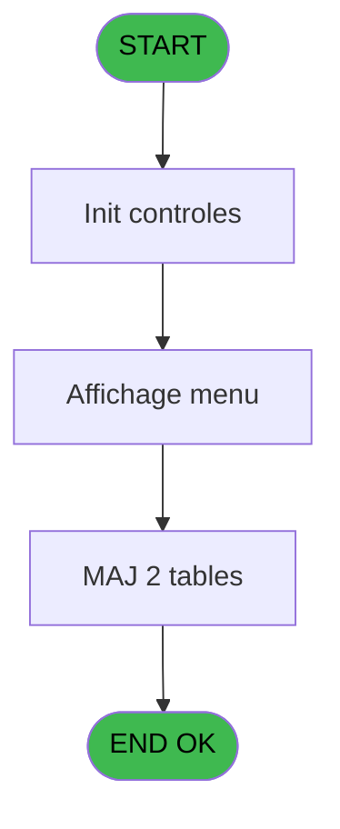
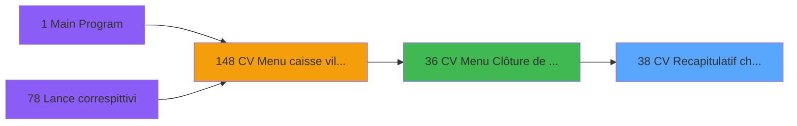
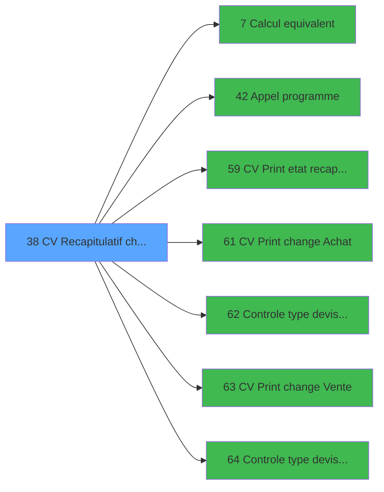

# VIL IDE 38 - CV  Recapitulatif change

> **Analyse**: Phases 1-4 2026-02-03 01:23 -> 01:23 (35s) | Assemblage 01:23
> **Pipeline**: V7.2 Enrichi
> **Structure**: 4 onglets (Resume | Ecrans | Donnees | Connexions)

<!-- TAB:Resume -->

## 1. FICHE D'IDENTITE

| Attribut | Valeur |
|----------|--------|
| Projet | VIL |
| IDE Position | 38 |
| Nom Programme | CV  Recapitulatif change |
| Fichier source | `Prg_38.xml` |
| Domaine metier | Change |
| Taches | 13 (1 ecrans visibles) |
| Tables modifiees | 2 |
| Programmes appeles | 7 |

## 2. DESCRIPTION FONCTIONNELLE

**CV  Recapitulatif change** assure la gestion complete de ce processus, accessible depuis [CV  Menu Clôture de caisse (IDE 36)](VIL-IDE-36.md).

Le flux de traitement s'organise en **5 blocs fonctionnels** :

- **Traitement** (9 taches) : traitements metier divers
- **Creation** (1 tache) : insertion d'enregistrements en base (mouvements, prestations)
- **Calcul** (1 tache) : calculs de montants, stocks ou compteurs
- **Consultation** (1 tache) : ecrans de recherche, selection et consultation
- **Initialisation** (1 tache) : reinitialisation d'etats et de variables de travail

**Donnees modifiees** : 2 tables en ecriture (devises_caisse___ddk, compteurs________cpt).

Detail : phases du traitement

#### Phase 1 : Traitement (9 taches)

- **38** - AC  Recapitulatif change **[[ECRAN]](#ecran-t1)**
- **38.2** - Cumul des montants
- **38.2.1** - MAJ total de la journee
- **38.4** - Cumul des montants
- **38.4.1** - MAJ total de la journee
- **38.5** - Cumul des montants
- **38.6** - Cumul des montants
- **38.6.1** - MAJ total de la journee
- **38.8** - (sans nom) **[[ECRAN]](#ecran-t15)**

Delegue a : [Appel programme (IDE 42)](VIL-IDE-42.md)

#### Phase 2 : Consultation (1 tache)

- **38.1** - Affichage menu **[[ECRAN]](#ecran-t2)**

#### Phase 3 : Initialisation (1 tache)

- **38.3** - Raz du change du jour

#### Phase 4 : Creation (1 tache)

- **38.7** - Creation pièce de caisse

#### Phase 5 : Calcul (1 tache)

- **38.7.1** - recup compteur PKES

Delegue a : [Calcul equivalent (IDE 7)](VIL-IDE-7.md)

#### Tables impactees

| Table | Operations | Role metier |
|-------|-----------|-------------|
| devises_caisse___ddk | **W** (4 usages) | Sessions de caisse |
| compteurs________cpt | **W** (1 usages) | Comptes GM (generaux) |

## 3. BLOCS FONCTIONNELS

### 3.1 Traitement (9 taches)

Traitements internes.

---

#### 38 - AC  Recapitulatif change [[ECRAN]](#ecran-t1)

**Role** : Tache d'orchestration : point d'entree du programme (9 sous-taches). Coordonne l'enchainement des traitements.
**Ecran** : 196 x 67 DLU (MDI) | [Voir mockup](#ecran-t1)

8 sous-taches directes

| Tache | Nom | Bloc |
|-------|-----|------|
| [38.2](#t3) | Cumul des montants | Traitement |
| [38.2.1](#t4) | MAJ total de la journee | Traitement |
| [38.4](#t6) | Cumul des montants | Traitement |
| [38.4.1](#t7) | MAJ total de la journee | Traitement |
| [38.5](#t8) | Cumul des montants | Traitement |
| [38.6](#t9) | Cumul des montants | Traitement |
| [38.6.1](#t10) | MAJ total de la journee | Traitement |
| [38.8](#t15) | (sans nom) **[[ECRAN]](#ecran-t15)** | Traitement |

**Variables liees** : D (P0 N° pkes change), E (P0 top resul change), K (P0 N° pkes frais change), M (W0 total change Acha), N (W0 total change Vent)
**Delegue a** : [Appel programme (IDE 42)](VIL-IDE-42.md)

---

#### 38.2 - Cumul des montants

**Role** : Traitement : Cumul des montants.
**Variables liees** : B (P0 masque cumul)
**Delegue a** : [Appel programme (IDE 42)](VIL-IDE-42.md)

---

#### 38.2.1 - MAJ total de la journee

**Role** : Traitement : MAJ total de la journee.
**Variables liees** : M (W0 total change Acha), N (W0 total change Vent), R (W0 total frais change)
**Delegue a** : [Appel programme (IDE 42)](VIL-IDE-42.md)

---

#### 38.4 - Cumul des montants

**Role** : Traitement : Cumul des montants.
**Variables liees** : B (P0 masque cumul)
**Delegue a** : [Appel programme (IDE 42)](VIL-IDE-42.md)

---

#### 38.4.1 - MAJ total de la journee

**Role** : Traitement : MAJ total de la journee.
**Variables liees** : M (W0 total change Acha), N (W0 total change Vent), R (W0 total frais change)
**Delegue a** : [Appel programme (IDE 42)](VIL-IDE-42.md)

---

#### 38.5 - Cumul des montants

**Role** : Traitement : Cumul des montants.
**Variables liees** : B (P0 masque cumul)
**Delegue a** : [Appel programme (IDE 42)](VIL-IDE-42.md)

---

#### 38.6 - Cumul des montants

**Role** : Traitement : Cumul des montants.
**Variables liees** : B (P0 masque cumul)
**Delegue a** : [Appel programme (IDE 42)](VIL-IDE-42.md)

---

#### 38.6.1 - MAJ total de la journee

**Role** : Traitement : MAJ total de la journee.
**Variables liees** : M (W0 total change Acha), N (W0 total change Vent), R (W0 total frais change)
**Delegue a** : [Appel programme (IDE 42)](VIL-IDE-42.md)

---

#### 38.8 - (sans nom) [[ECRAN]](#ecran-t15)

**Role** : Traitement interne.
**Ecran** : 100 x 24 DLU (MDI) | [Voir mockup](#ecran-t15)
**Delegue a** : [Appel programme (IDE 42)](VIL-IDE-42.md)

### 3.2 Consultation (1 tache)

Ecrans de recherche et consultation.

---

#### 38.1 - Affichage menu [[ECRAN]](#ecran-t2)

**Role** : Reinitialisation : Affichage menu.
**Ecran** : 794 x 186 DLU (MDI) | [Voir mockup](#ecran-t2)

### 3.3 Initialisation (1 tache)

Reinitialisation d'etats et variables de travail.

---

#### 38.3 - Raz du change du jour

**Role** : Reinitialisation : Raz du change du jour.
**Variables liees** : D (P0 N° pkes change), E (P0 top resul change), K (P0 N° pkes frais change), M (W0 total change Acha), N (W0 total change Vent)

### 3.4 Creation (1 tache)

Insertion de nouveaux enregistrements en base.

---

#### 38.7 - Creation pièce de caisse

**Role** : Creation d'enregistrement : Creation pièce de caisse.

### 3.5 Calcul (1 tache)

Calculs metier : montants, stocks, compteurs.

---

#### 38.7.1 - recup compteur PKES

**Role** : Calcul : recup compteur PKES.
**Variables liees** : D (P0 N° pkes change), K (P0 N° pkes frais change)
**Delegue a** : [Calcul equivalent (IDE 7)](VIL-IDE-7.md)

## 5. REGLES METIER

*(Aucune regle metier identifiee)*

## 6. CONTEXTE

- **Appele par**: [CV  Menu Clôture de caisse (IDE 36)](VIL-IDE-36.md)
- **Appelle**: 7 programmes | **Tables**: 10 (W:2 R:4 L:4) | **Taches**: 13 | **Expressions**: 9

<!-- TAB:Ecrans -->

## 8. ECRANS

### 8.1 Forms visibles (1 / 13)

| # | Position | Tache | Nom | Type | Largeur | Hauteur | Bloc |
|---|----------|-------|-----|------|---------|---------|------|
| 1 | 38.1 | 38.1 | Affichage menu | MDI | 794 | 186 | Consultation |

### 8.2 Mockups Ecrans

---

#### 38.1 - Affichage menu
**Tache** : [38.1](#t2) | **Type** : MDI | **Dimensions** : 794 x 186 DLU
**Bloc** : Consultation | **Titre IDE** : Affichage menu

<!-- FORM-DATA:
{
    "width":  794,
    "vFactor":  8,
    "type":  "MDI",
    "hFactor":  8,
    "controls":  [
                     {
                         "x":  1,
                         "type":  "label",
                         "var":  "",
                         "y":  1,
                         "w":  791,
                         "fmt":  "",
                         "name":  "",
                         "h":  17,
                         "color":  "",
                         "text":  "",
                         "parent":  null
                     },
                     {
                         "x":  187,
                         "type":  "label",
                         "var":  "",
                         "y":  42,
                         "w":  570,
                         "fmt":  "",
                         "name":  "",
                         "h":  105,
                         "color":  "",
                         "text":  "",
                         "parent":  null
                     },
                     {
                         "x":  190,
                         "type":  "label",
                         "var":  "",
                         "y":  43,
                         "w":  565,
                         "fmt":  "",
                         "name":  "",
                         "h":  103,
                         "color":  "",
                         "text":  "",
                         "parent":  null
                     },
                     {
                         "x":  252,
                         "type":  "label",
                         "var":  "",
                         "y":  52,
                         "w":  440,
                         "fmt":  "",
                         "name":  "",
                         "h":  71,
                         "color":  "",
                         "text":  "",
                         "parent":  null
                     },
                     {
                         "x":  255,
                         "type":  "label",
                         "var":  "",
                         "y":  53,
                         "w":  50,
                         "fmt":  "",
                         "name":  "",
                         "h":  69,
                         "color":  "",
                         "text":  "",
                         "parent":  null
                     },
                     {
                         "x":  315,
                         "type":  "label",
                         "var":  "",
                         "y":  58,
                         "w":  293,
                         "fmt":  "",
                         "name":  "",
                         "h":  8,
                         "color":  "7",
                         "text":  "Consolidation des opérations",
                         "parent":  null
                     },
                     {
                         "x":  313,
                         "type":  "label",
                         "var":  "",
                         "y":  81,
                         "w":  293,
                         "fmt":  "",
                         "name":  "",
                         "h":  8,
                         "color":  "7",
                         "text":  "Listing du change",
                         "parent":  null
                     },
                     {
                         "x":  313,
                         "type":  "label",
                         "var":  "",
                         "y":  103,
                         "w":  293,
                         "fmt":  "",
                         "name":  "",
                         "h":  8,
                         "color":  "7",
                         "text":  "Validation recap. change",
                         "parent":  null
                     },
                     {
                         "x":  338,
                         "type":  "label",
                         "var":  "",
                         "y":  132,
                         "w":  188,
                         "fmt":  "",
                         "name":  "",
                         "h":  8,
                         "color":  "",
                         "text":  "Choix de l\u0027action",
                         "parent":  null
                     },
                     {
                         "x":  0,
                         "type":  "label",
                         "var":  "",
                         "y":  163,
                         "w":  791,
                         "fmt":  "",
                         "name":  "",
                         "h":  23,
                         "color":  "",
                         "text":  "",
                         "parent":  null
                     },
                     {
                         "x":  540,
                         "type":  "edit",
                         "var":  "",
                         "y":  131,
                         "w":  32,
                         "fmt":  "UA",
                         "name":  "W1 choix action",
                         "h":  10,
                         "color":  "6",
                         "text":  "",
                         "parent":  null
                     },
                     {
                         "x":  6,
                         "type":  "edit",
                         "var":  "",
                         "y":  5,
                         "w":  267,
                         "fmt":  "20",
                         "name":  "",
                         "h":  8,
                         "color":  "",
                         "text":  "",
                         "parent":  1
                     },
                     {
                         "x":  576,
                         "type":  "edit",
                         "var":  "",
                         "y":  5,
                         "w":  203,
                         "fmt":  "WWW DD MMM YYYYZ",
                         "name":  "",
                         "h":  8,
                         "color":  "",
                         "text":  "",
                         "parent":  1
                     },
                     {
                         "x":  6,
                         "type":  "edit",
                         "var":  "",
                         "y":  22,
                         "w":  783,
                         "fmt":  "50",
                         "name":  "",
                         "h":  15,
                         "color":  "7",
                         "text":  "",
                         "parent":  null
                     },
                     {
                         "x":  27,
                         "type":  "image",
                         "var":  "",
                         "y":  48,
                         "w":  133,
                         "fmt":  "",
                         "name":  "",
                         "h":  70,
                         "color":  "",
                         "text":  "",
                         "parent":  null
                     },
                     {
                         "x":  265,
                         "type":  "button",
                         "var":  "",
                         "y":  58,
                         "w":  26,
                         "fmt":  "1",
                         "name":  "1",
                         "h":  9,
                         "color":  "",
                         "text":  "",
                         "parent":  null
                     },
                     {
                         "x":  632,
                         "type":  "edit",
                         "var":  "",
                         "y":  58,
                         "w":  46,
                         "fmt":  "2",
                         "name":  "",
                         "h":  8,
                         "color":  "",
                         "text":  "",
                         "parent":  8
                     },
                     {
                         "x":  265,
                         "type":  "button",
                         "var":  "",
                         "y":  80,
                         "w":  26,
                         "fmt":  "2",
                         "name":  "2",
                         "h":  9,
                         "color":  "",
                         "text":  "",
                         "parent":  null
                     },
                     {
                         "x":  632,
                         "type":  "edit",
                         "var":  "",
                         "y":  81,
                         "w":  46,
                         "fmt":  "2",
                         "name":  "",
                         "h":  8,
                         "color":  "",
                         "text":  "",
                         "parent":  8
                     },
                     {
                         "x":  265,
                         "type":  "button",
                         "var":  "",
                         "y":  102,
                         "w":  26,
                         "fmt":  "3",
                         "name":  "3",
                         "h":  9,
                         "color":  "",
                         "text":  "",
                         "parent":  null
                     },
                     {
                         "x":  632,
                         "type":  "edit",
                         "var":  "",
                         "y":  103,
                         "w":  46,
                         "fmt":  "2",
                         "name":  "",
                         "h":  8,
                         "color":  "",
                         "text":  "",
                         "parent":  8
                     },
                     {
                         "x":  8,
                         "type":  "button",
                         "var":  "",
                         "y":  166,
                         "w":  160,
                         "fmt":  "\u0026Quitter",
                         "name":  "",
                         "h":  18,
                         "color":  "",
                         "text":  "",
                         "parent":  null
                     }
                 ],
    "taskId":  "38.1",
    "height":  186
}
-->

<strong>Champs : 7 champs</strong>

| Pos (x,y) | Nom | Variable | Type |
|-----------|-----|----------|------|
| 540,131 | W1 choix action | - | edit |
| 6,5 | 20 | - | edit |
| 576,5 | WWW DD MMM YYYYZ | - | edit |
| 6,22 | 50 | - | edit |
| 632,58 | 2 | - | edit |
| 632,81 | 2 | - | edit |
| 632,103 | 2 | - | edit |

<strong>Boutons : 4 boutons</strong>

| Bouton | Pos (x,y) | Action |
|--------|-----------|--------|
| 1 | 265,58 | Bouton fonctionnel |
| 2 | 265,80 | Bouton fonctionnel |
| 3 | 265,102 | Bouton fonctionnel |
| Quitter | 8,166 | Quitte le programme |

## 9. NAVIGATION

Ecran unique: **Affichage menu**

### 9.3 Structure hierarchique (13 taches)

| Position | Tache | Type | Dimensions | Bloc |
|----------|-------|------|------------|------|
| **38.1** | [**AC  Recapitulatif change** (38)](#t1) [mockup](#ecran-t1) | MDI | 196x67 | Traitement |
| 38.1.1 | [Cumul des montants (38.2)](#t3) | MDI | - | |
| 38.1.2 | [MAJ total de la journee (38.2.1)](#t4) | MDI | - | |
| 38.1.3 | [Cumul des montants (38.4)](#t6) | MDI | - | |
| 38.1.4 | [MAJ total de la journee (38.4.1)](#t7) | MDI | - | |
| 38.1.5 | [Cumul des montants (38.5)](#t8) | MDI | - | |
| 38.1.6 | [Cumul des montants (38.6)](#t9) | MDI | - | |
| 38.1.7 | [MAJ total de la journee (38.6.1)](#t10) | MDI | - | |
| 38.1.8 | [(sans nom) (38.8)](#t15) [mockup](#ecran-t15) | MDI | 100x24 | |
| **38.2** | [**Affichage menu** (38.1)](#t2) [mockup](#ecran-t2) | MDI | 794x186 | Consultation |
| **38.3** | [**Raz du change du jour** (38.3)](#t5) | MDI | - | Initialisation |
| **38.4** | [**Creation pièce de caisse** (38.7)](#t11) | MDI | - | Creation |
| **38.5** | [**recup compteur PKES** (38.7.1)](#t12) | MDI | - | Calcul |

### 9.4 Algorigramme

> **Legende**: Vert = START/END OK | Rouge = END KO | Bleu = Decisions
> *Algorigramme auto-genere. Utiliser `/algorigramme` pour une synthese metier detaillee.*

<!-- TAB:Donnees -->

## 10. TABLES

### Tables utilisees (10)

| ID | Nom | Description | Type | R | W | L | Usages |
|----|-----|-------------|------|---|---|---|--------|
| 44 | change___________chg |  | DB | R |   |   | 2 |
| 54 | pieces_caisse____pks | Sessions de caisse | DB |   |   | L | 1 |
| 57 | devises_caisse___ddk | Sessions de caisse | DB |   | **W** |   | 4 |
| 66 | imputations______imp |  | DB | R |   |   | 1 |
| 68 | compteurs________cpt | Comptes GM (generaux) | DB |   | **W** |   | 1 |
| 90 | devises__________dev | Devises / taux de change | DB |   |   | L | 1 |
| 141 | devises__________dev | Devises / taux de change | DB |   |   | L | 2 |
| 147 | change_vente_____chg | Donnees de ventes | DB | R |   |   | 1 |
| 324 | frais_change___fchg |  | DB | R |   |   | 1 |
| 474 | comptage_caisse_devise | Sessions de caisse | TMP |   |   | L | 1 |

### Colonnes par table (4 / 6 tables avec colonnes identifiees)

Table 44 - change___________chg (R) - 2 usages

| Lettre | Variable | Acces | Type |
|--------|----------|-------|------|
| A | W1 cumul devise/mop | R | Numeric |
| B | W1 equivalent | R | Numeric |

Table 57 - devises_caisse___ddk (**W**) - 4 usages

*Table utilisee uniquement en Link ou aucune colonne Real identifiee dans le DataView.*

Table 66 - imputations______imp (R) - 1 usages

*Table utilisee uniquement en Link ou aucune colonne Real identifiee dans le DataView.*

Table 68 - compteurs________cpt (**W**) - 1 usages

*Table utilisee uniquement en Link ou aucune colonne Real identifiee dans le DataView.*

Table 147 - change_vente_____chg (R) - 1 usages

| Lettre | Variable | Acces | Type |
|--------|----------|-------|------|
| A | W1 cumul Devise Cash | R | Numeric |
| B | W1 equivalent | R | Numeric |

Table 324 - frais_change___fchg (R) - 1 usages

| Lettre | Variable | Acces | Type |
|--------|----------|-------|------|
| D | P0 N° pkes change | R | Numeric |
| E | P0 top resul change | R | Alpha |
| K | P0 N° pkes frais change | R | Numeric |
| M | W0 total change Acha | R | Numeric |
| N | W0 total change Vent | R | Numeric |
| Q | W0 top modif change | R | Alpha |
| R | W0 total frais change | R | Numeric |

## 11. VARIABLES

### 11.1 Parametres entrants (12)

Variables recues du programme appelant ([CV  Menu Clôture de caisse (IDE 36)](VIL-IDE-36.md)).

| Lettre | Nom | Type | Usage dans |
|--------|-----|------|-----------|
| A | P0 societe | Alpha | - |
| B | P0 masque cumul | Alpha | - |
| C | P0 date comptable | Date | - |
| D | P0 N° pkes change | Numeric | - |
| E | P0 top resul change | Alpha | [38](#t1), [38.3](#t5) |
| F | P0 devise locale | Alpha | - |
| G | P0 nbre decimales | Numeric | - |
| H | P0 masque montant | Alpha | - |
| I | P0 nom village | Alpha | - |
| J | P0 Uni/Bilateral | Alpha | 3x parametre entrant |
| K | P0 N° pkes frais change | Numeric | - |
| L | P0 Action Abandon | Alpha | - |

### 11.2 Variables de travail (8)

Variables internes au programme.

| Lettre | Nom | Type | Usage dans |
|--------|-----|------|-----------|
| M | W0 total change Acha | Numeric | - |
| N | W0 total change Vent | Numeric | - |
| O | W0 top exec consolid | Alpha | - |
| P | W0 top exec listing | Alpha | 1x calcul interne |
| Q | W0 top modif change | Alpha | [38](#t1), [38.3](#t5) |
| R | W0 total frais change | Numeric | - |
| S | W0 choix action | Alpha | - |
| T | W0 message | Alpha | 6x calcul interne |

Toutes les 20 variables (liste complete)

| Cat | Lettre | Nom Variable | Type |
|-----|--------|--------------|------|
| P0 | **A** | P0 societe | Alpha |
| P0 | **B** | P0 masque cumul | Alpha |
| P0 | **C** | P0 date comptable | Date |
| P0 | **D** | P0 N° pkes change | Numeric |
| P0 | **E** | P0 top resul change | Alpha |
| P0 | **F** | P0 devise locale | Alpha |
| P0 | **G** | P0 nbre decimales | Numeric |
| P0 | **H** | P0 masque montant | Alpha |
| P0 | **I** | P0 nom village | Alpha |
| P0 | **J** | P0 Uni/Bilateral | Alpha |
| P0 | **K** | P0 N° pkes frais change | Numeric |
| P0 | **L** | P0 Action Abandon | Alpha |
| W0 | **M** | W0 total change Acha | Numeric |
| W0 | **N** | W0 total change Vent | Numeric |
| W0 | **O** | W0 top exec consolid | Alpha |
| W0 | **P** | W0 top exec listing | Alpha |
| W0 | **Q** | W0 top modif change | Alpha |
| W0 | **R** | W0 total frais change | Numeric |
| W0 | **S** | W0 choix action | Alpha |
| W0 | **T** | W0 message | Alpha |

## 12. EXPRESSIONS

**9 / 9 expressions decodees (100%)**

### 12.1 Repartition par type

| Type | Expressions | Regles |
|------|-------------|--------|
| CONSTANTE | 1 | 0 |
| CONDITION | 8 | 0 |

### 12.2 Expressions cles par type

#### CONSTANTE (1 expressions)

| Type | IDE | Expression | Regle |
|------|-----|------------|-------|
| CONSTANTE | 9 | `'O'` | - |

#### CONDITION (8 expressions)

| Type | IDE | Expression | Regle |
|------|-----|------------|-------|
| CONDITION | 6 | `W0 message [T]='2'` | - |
| CONDITION | 5 | `P0 Uni/Bilateral [J]='B'` | - |
| CONDITION | 8 | `W0 message [T]='3' AND W0 top exec listing [P]='O' AND W0 top modif change [Q]='O' AND P0 top resul change [E]<>'O'` | - |
| CONDITION | 7 | `W0 message [T]='2' AND P0 Uni/Bilateral [J]='B'` | - |
| CONDITION | 2 | `W0 message [T]='F'` | - |
| ... | | *+3 autres* | |

<!-- TAB:Connexions -->

## 13. GRAPHE D'APPELS

### 13.1 Chaine depuis Main (Callers)

Main -> ... -> [CV  Menu Clôture de caisse (IDE 36)](VIL-IDE-36.md) -> **CV  Recapitulatif change (IDE 38)**

### 13.2 Callers

| IDE | Nom Programme | Nb Appels |
|-----|---------------|-----------|
| [36](VIL-IDE-36.md) | CV  Menu Clôture de caisse | 1 |

### 13.3 Callees (programmes appeles)

### 13.4 Detail Callees avec contexte

| IDE | Nom Programme | Appels | Contexte |
|-----|---------------|--------|----------|
| [7](VIL-IDE-7.md) | Calcul equivalent | 3 | Calcul de donnees |
| [42](VIL-IDE-42.md) | Appel programme | 1 | Sous-programme |
| [59](VIL-IDE-59.md) | CV  Print etat recap devises | 1 | Impression ticket/document |
| [61](VIL-IDE-61.md) | CV  Print change Achat | 1 | Impression ticket/document |
| [62](VIL-IDE-62.md) |   Controle type devise Achat | 1 | Controle/validation |
| [63](VIL-IDE-63.md) | CV  Print change Vente | 1 | Impression ticket/document |
| [64](VIL-IDE-64.md) |   Controle type devise Vente | 1 | Controle/validation |

## 14. RECOMMANDATIONS MIGRATION

### 14.1 Profil du programme

| Metrique | Valeur | Impact migration |
|----------|--------|-----------------|
| Lignes de logique | 241 | Taille moyenne |
| Expressions | 9 | Peu de logique |
| Tables WRITE | 2 | Impact faible |
| Sous-programmes | 7 | Dependances moderees |
| Ecrans visibles | 1 | Ecran unique ou traitement batch |
| Code desactive | 0% (0 / 241) | Code sain |
| Regles metier | 0 | Pas de regle identifiee |

### 14.2 Plan de migration par bloc

#### Traitement (9 taches: 2 ecrans, 7 traitements)

- **Strategie** : Orchestrateur avec 2 ecrans (Razor/React) et 7 traitements backend (services).
- Les ecrans deviennent des composants UI, les traitements invisibles deviennent des services injectables.
- 7 sous-programme(s) a migrer ou a reutiliser depuis les services existants.
- Decomposer les taches en services unitaires testables.

#### Consultation (1 tache: 1 ecran, 0 traitement)

- **Strategie** : Composants de recherche/selection en modales.
- 1 ecran : Affichage menu

#### Initialisation (1 tache: 0 ecran, 1 traitement)

- **Strategie** : Constructeur/methode `InitAsync()` dans l'orchestrateur.

#### Creation (1 tache: 0 ecran, 1 traitement)

- **Strategie** : Repository pattern avec Entity Framework Core.
- Insertion via `IRepository<T>.CreateAsync()`

#### Calcul (1 tache: 0 ecran, 1 traitement)

- **Strategie** : Services de calcul purs (Domain Services).
- Migrer la logique de calcul (stock, compteurs, montants)

### 14.3 Dependances critiques

| Dependance | Type | Appels | Impact |
|------------|------|--------|--------|
| devises_caisse___ddk | Table WRITE (Database) | 4x | Schema + repository |
| compteurs________cpt | Table WRITE (Database) | 1x | Schema + repository |
| [Calcul equivalent (IDE 7)](VIL-IDE-7.md) | Sous-programme | 3x | **CRITIQUE** - Calcul de donnees |
| [  Controle type devise Achat (IDE 62)](VIL-IDE-62.md) | Sous-programme | 1x | Normale - Controle/validation |
| [CV  Print change Vente (IDE 63)](VIL-IDE-63.md) | Sous-programme | 1x | Normale - Impression ticket/document |
| [  Controle type devise Vente (IDE 64)](VIL-IDE-64.md) | Sous-programme | 1x | Normale - Controle/validation |
| [Appel programme (IDE 42)](VIL-IDE-42.md) | Sous-programme | 1x | Normale - Sous-programme |
| [CV  Print etat recap devises (IDE 59)](VIL-IDE-59.md) | Sous-programme | 1x | Normale - Impression ticket/document |
| [CV  Print change Achat (IDE 61)](VIL-IDE-61.md) | Sous-programme | 1x | Normale - Impression ticket/document |

---
*Spec DETAILED generee par Pipeline V7.2 - 2026-02-03 01:23*
