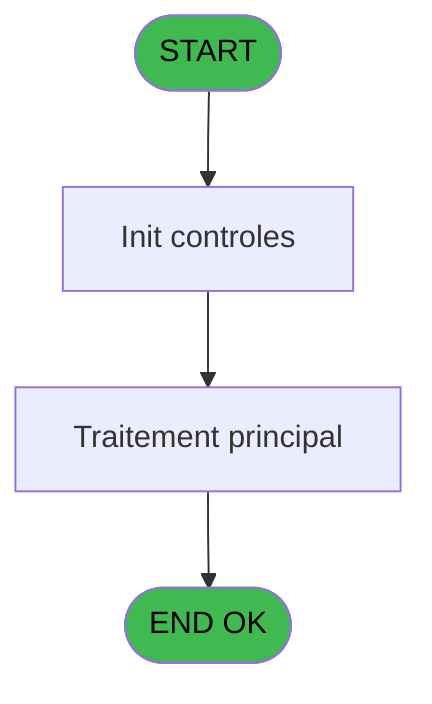
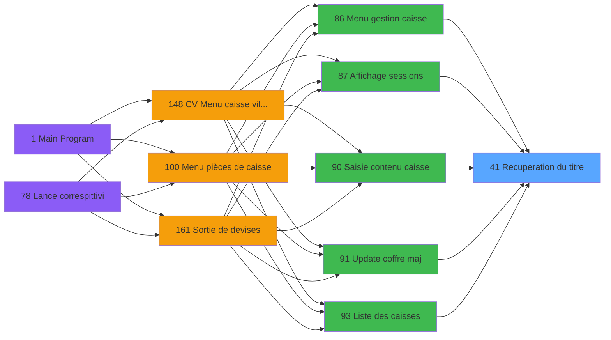

# VIL IDE 41 - Recuperation du titre

> **Analyse**: Phases 1-4 2026-02-03 08:51 -> 08:51 (25s) | Assemblage 08:51
> **Pipeline**: V7.2 Enrichi
> **Structure**: 4 onglets (Resume | Ecrans | Donnees | Connexions)

<!-- TAB:Resume -->

## 1. FICHE D'IDENTITE

| Attribut | Valeur |
|----------|--------|
| Projet | VIL |
| IDE Position | 41 |
| Nom Programme | Recuperation du titre |
| Fichier source | `Prg_41.xml` |
| Domaine metier | General |
| Taches | 1 (0 ecrans visibles) |
| Tables modifiees | 0 |
| Programmes appeles | 0 |

## 2. DESCRIPTION FONCTIONNELLE

**Recuperation du titre** assure la gestion complete de ce processus, accessible depuis [Affichage sessions (IDE 87)](VIL-IDE-87.md), [Sortie de devises (IDE 161)](VIL-IDE-161.md), [Contrôle caisse avec (IDE 97)](VIL-IDE-97.md), [CV  Menu telephone (IDE 164)](VIL-IDE-164.md), [Bi  Sortie de devises (IDE 212)](VIL-IDE-212.md), [Saisie contenu caisse (IDE 90)](VIL-IDE-90.md), [Liste des caisses (IDE 93)](VIL-IDE-93.md), [Liste des TPE (IDE 98)](VIL-IDE-98.md), [Menu listings complement. (IDE 135)](VIL-IDE-135.md), [  Print cpte non soldes/semin. (IDE 141)](VIL-IDE-141.md), [Uni Sortie de devises (IDE 211)](VIL-IDE-211.md), [Menu gestion caisse (IDE 86)](VIL-IDE-86.md), [Update coffre maj (IDE 91)](VIL-IDE-91.md), [Pièces de caisse manuelles (IDE 95)](VIL-IDE-95.md), [Menu pièces de caisse (IDE 100)](VIL-IDE-100.md), [Liste des ecarts (IDE 101)](VIL-IDE-101.md), [Mouvements article coffre (IDE 105)](VIL-IDE-105.md), [Historique session (IDE 109)](VIL-IDE-109.md), [Calcul coffre auto avec (IDE 116)](VIL-IDE-116.md), [Update coffre auto (IDE 117)](VIL-IDE-117.md).

Le flux de traitement s'organise en **1 blocs fonctionnels** :

- **Traitement** (1 tache) : traitements metier divers

## 3. BLOCS FONCTIONNELS

### 3.1 Traitement (1 tache)

Traitements internes.

---

#### 41 - Recuperation du titre

**Role** : Consultation/chargement : Recuperation du titre.

## 5. REGLES METIER

*(Aucune regle metier identifiee)*

## 6. CONTEXTE

- **Appele par**: [Affichage sessions (IDE 87)](VIL-IDE-87.md), [Sortie de devises (IDE 161)](VIL-IDE-161.md), [Contrôle caisse avec (IDE 97)](VIL-IDE-97.md), [CV  Menu telephone (IDE 164)](VIL-IDE-164.md), [Bi  Sortie de devises (IDE 212)](VIL-IDE-212.md), [Saisie contenu caisse (IDE 90)](VIL-IDE-90.md), [Liste des caisses (IDE 93)](VIL-IDE-93.md), [Liste des TPE (IDE 98)](VIL-IDE-98.md), [Menu listings complement. (IDE 135)](VIL-IDE-135.md), [  Print cpte non soldes/semin. (IDE 141)](VIL-IDE-141.md), [Uni Sortie de devises (IDE 211)](VIL-IDE-211.md), [Menu gestion caisse (IDE 86)](VIL-IDE-86.md), [Update coffre maj (IDE 91)](VIL-IDE-91.md), [Pièces de caisse manuelles (IDE 95)](VIL-IDE-95.md), [Menu pièces de caisse (IDE 100)](VIL-IDE-100.md), [Liste des ecarts (IDE 101)](VIL-IDE-101.md), [Mouvements article coffre (IDE 105)](VIL-IDE-105.md), [Historique session (IDE 109)](VIL-IDE-109.md), [Calcul coffre auto avec (IDE 116)](VIL-IDE-116.md), [Update coffre auto (IDE 117)](VIL-IDE-117.md)
- **Appelle**: 0 programmes | **Tables**: 1 (W:0 R:1 L:0) | **Taches**: 1 | **Expressions**: 4

<!-- TAB:Ecrans -->

## 8. ECRANS

*(Programme sans ecran visible)*

## 9. NAVIGATION

### 9.3 Structure hierarchique (1 tache)

| Position | Tache | Type | Dimensions | Bloc |
|----------|-------|------|------------|------|
| **41.1** | [**Recuperation du titre** (41)](#t1) | MDI | - | Traitement |

### 9.4 Algorigramme

> **Legende**: Vert = START/END OK | Rouge = END KO | Bleu = Decisions
> *Algorigramme auto-genere. Utiliser `/algorigramme` pour une synthese metier detaillee.*

<!-- TAB:Donnees -->

## 10. TABLES

### Tables utilisees (1)

| ID | Nom | Description | Type | R | W | L | Usages |
|----|-----|-------------|------|---|---|---|--------|
| 719 | arc_transac_detail_bar |  | DB | R |   |   | 1 |

### Colonnes par table (1 / 1 tables avec colonnes identifiees)

Table 719 - arc_transac_detail_bar (R) - 1 usages

| Lettre | Variable | Acces | Type |
|--------|----------|-------|------|
| A | > code ecran | R | Numeric |
| B | < nom ecran | R | Alpha |

## 11. VARIABLES

### 11.1 Autres (2)

Variables diverses.

| Lettre | Nom | Type | Usage dans |
|--------|-----|------|-----------|
| A | > code ecran | Numeric | 1x refs |
| B | < nom ecran | Alpha | - |

## 12. EXPRESSIONS

**4 / 4 expressions decodees (100%)**

### 12.1 Repartition par type

| Type | Expressions | Regles |
|------|-------------|--------|
| CONCATENATION | 1 | 0 |
| CONSTANTE | 1 | 0 |
| OTHER | 1 | 0 |
| CONDITION | 1 | 0 |

### 12.2 Expressions cles par type

#### CONCATENATION (1 expressions)

| Type | IDE | Expression | Regle |
|------|-----|------------|-------|
| CONCATENATION | 4 | `Trim ([F])&' - '&Trim ([G])` | - |

#### CONSTANTE (1 expressions)

| Type | IDE | Expression | Regle |
|------|-----|------------|-------|
| CONSTANTE | 3 | `'CV'` | - |

#### OTHER (1 expressions)

| Type | IDE | Expression | Regle |
|------|-----|------------|-------|
| OTHER | 1 | `GetParam ('CODELANGUE')` | - |

#### CONDITION (1 expressions)

| Type | IDE | Expression | Regle |
|------|-----|------------|-------|
| CONDITION | 2 | `> code ecran [A]` | - |

<!-- TAB:Connexions -->

## 13. GRAPHE D'APPELS

### 13.1 Chaine depuis Main (Callers)

Main -> ... -> [Affichage sessions (IDE 87)](VIL-IDE-87.md) -> **Recuperation du titre (IDE 41)**

Main -> ... -> [Sortie de devises (IDE 161)](VIL-IDE-161.md) -> **Recuperation du titre (IDE 41)**

Main -> ... -> [Contrôle caisse avec (IDE 97)](VIL-IDE-97.md) -> **Recuperation du titre (IDE 41)**

Main -> ... -> [CV  Menu telephone (IDE 164)](VIL-IDE-164.md) -> **Recuperation du titre (IDE 41)**

Main -> ... -> [Bi  Sortie de devises (IDE 212)](VIL-IDE-212.md) -> **Recuperation du titre (IDE 41)**

Main -> ... -> [Saisie contenu caisse (IDE 90)](VIL-IDE-90.md) -> **Recuperation du titre (IDE 41)**

Main -> ... -> [Liste des caisses (IDE 93)](VIL-IDE-93.md) -> **Recuperation du titre (IDE 41)**

Main -> ... -> [Liste des TPE (IDE 98)](VIL-IDE-98.md) -> **Recuperation du titre (IDE 41)**

Main -> ... -> [Menu listings complement. (IDE 135)](VIL-IDE-135.md) -> **Recuperation du titre (IDE 41)**

Main -> ... -> [  Print cpte non soldes/semin. (IDE 141)](VIL-IDE-141.md) -> **Recuperation du titre (IDE 41)**

Main -> ... -> [Uni Sortie de devises (IDE 211)](VIL-IDE-211.md) -> **Recuperation du titre (IDE 41)**

Main -> ... -> [Menu gestion caisse (IDE 86)](VIL-IDE-86.md) -> **Recuperation du titre (IDE 41)**

Main -> ... -> [Update coffre maj (IDE 91)](VIL-IDE-91.md) -> **Recuperation du titre (IDE 41)**

Main -> ... -> [Pièces de caisse manuelles (IDE 95)](VIL-IDE-95.md) -> **Recuperation du titre (IDE 41)**

Main -> ... -> [Menu pièces de caisse (IDE 100)](VIL-IDE-100.md) -> **Recuperation du titre (IDE 41)**

Main -> ... -> [Liste des ecarts (IDE 101)](VIL-IDE-101.md) -> **Recuperation du titre (IDE 41)**

Main -> ... -> [Mouvements article coffre (IDE 105)](VIL-IDE-105.md) -> **Recuperation du titre (IDE 41)**

Main -> ... -> [Historique session (IDE 109)](VIL-IDE-109.md) -> **Recuperation du titre (IDE 41)**

Main -> ... -> [Calcul coffre auto avec (IDE 116)](VIL-IDE-116.md) -> **Recuperation du titre (IDE 41)**

Main -> ... -> [Update coffre auto (IDE 117)](VIL-IDE-117.md) -> **Recuperation du titre (IDE 41)**

### 13.2 Callers

| IDE | Nom Programme | Nb Appels |
|-----|---------------|-----------|
| [87](VIL-IDE-87.md) | Affichage sessions | 7 |
| [161](VIL-IDE-161.md) | Sortie de devises | 5 |
| [97](VIL-IDE-97.md) | Contrôle caisse avec | 3 |
| [164](VIL-IDE-164.md) | CV  Menu telephone | 3 |
| [212](VIL-IDE-212.md) | Bi  Sortie de devises | 3 |
| [90](VIL-IDE-90.md) | Saisie contenu caisse | 2 |
| [93](VIL-IDE-93.md) | Liste des caisses | 2 |
| [98](VIL-IDE-98.md) | Liste des TPE | 2 |
| [135](VIL-IDE-135.md) | Menu listings complement. | 2 |
| [141](VIL-IDE-141.md) |   Print cpte non soldes/semin. | 2 |
| [211](VIL-IDE-211.md) | Uni Sortie de devises | 2 |
| [86](VIL-IDE-86.md) | Menu gestion caisse | 1 |
| [91](VIL-IDE-91.md) | Update coffre maj | 1 |
| [95](VIL-IDE-95.md) | Pièces de caisse manuelles | 1 |
| [100](VIL-IDE-100.md) | Menu pièces de caisse | 1 |
| [101](VIL-IDE-101.md) | Liste des ecarts | 1 |
| [105](VIL-IDE-105.md) | Mouvements article coffre | 1 |
| [109](VIL-IDE-109.md) | Historique session | 1 |
| [116](VIL-IDE-116.md) | Calcul coffre auto avec | 1 |
| [117](VIL-IDE-117.md) | Update coffre auto | 1 |

### 13.3 Callees (programmes appeles)

### 13.4 Detail Callees avec contexte

| IDE | Nom Programme | Appels | Contexte |
|-----|---------------|--------|----------|
| - | (aucun) | - | - |

## 14. RECOMMANDATIONS MIGRATION

### 14.1 Profil du programme

| Metrique | Valeur | Impact migration |
|----------|--------|-----------------|
| Lignes de logique | 12 | Programme compact |
| Expressions | 4 | Peu de logique |
| Tables WRITE | 0 | Impact faible |
| Sous-programmes | 0 | Peu de dependances |
| Ecrans visibles | 0 | Ecran unique ou traitement batch |
| Code desactive | 0% (0 / 12) | Code sain |
| Regles metier | 0 | Pas de regle identifiee |

### 14.2 Plan de migration par bloc

#### Traitement (1 tache: 0 ecran, 1 traitement)

- **Strategie** : 1 service(s) backend injectable(s) (Domain Services).
- Decomposer les taches en services unitaires testables.

### 14.3 Dependances critiques

| Dependance | Type | Appels | Impact |
|------------|------|--------|--------|

---
*Spec DETAILED generee par Pipeline V7.2 - 2026-02-03 08:51*
