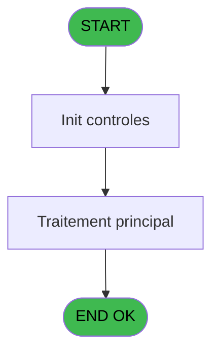
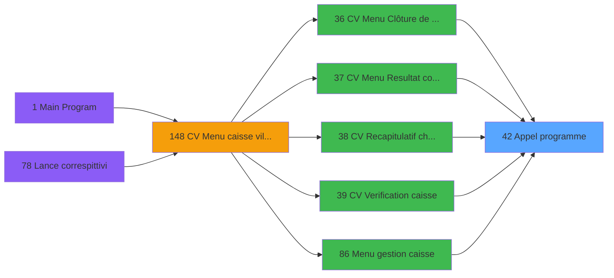

# VIL IDE 42 - Appel programme

> **Analyse**: Phases 1-4 2026-02-03 08:51 -> 08:52 (27s) | Assemblage 08:52
> **Pipeline**: V7.2 Enrichi
> **Structure**: 4 onglets (Resume | Ecrans | Donnees | Connexions)

<!-- TAB:Resume -->

## 1. FICHE D'IDENTITE

| Attribut | Valeur |
|----------|--------|
| Projet | VIL |
| IDE Position | 42 |
| Nom Programme | Appel programme |
| Fichier source | `Prg_42.xml` |
| Domaine metier | General |
| Taches | 1 (0 ecrans visibles) |
| Tables modifiees | 0 |
| Programmes appeles | 0 |

## 2. DESCRIPTION FONCTIONNELLE

**Appel programme** assure la gestion complete de ce processus, accessible depuis [Sortie de devises (IDE 161)](VIL-IDE-161.md), [CV  Menu telephone (IDE 164)](VIL-IDE-164.md), [Bi  Sortie de devises (IDE 212)](VIL-IDE-212.md), [CV Menu Resultat comptable (IDE 37)](VIL-IDE-37.md), [CV  Mise à jour base articles (IDE 153)](VIL-IDE-153.md), [CV  Mise à jour base articles* (IDE 198)](VIL-IDE-198.md), [CV  Mise à jour base articles (IDE 200)](VIL-IDE-200.md), [CV  Mise à jour base articles (IDE 208)](VIL-IDE-208.md), [Uni Sortie de devises (IDE 211)](VIL-IDE-211.md), [CV  Menu Clôture de caisse (IDE 36)](VIL-IDE-36.md), [CV  Recapitulatif change (IDE 38)](VIL-IDE-38.md), [CV  Verification caisse (IDE 39)](VIL-IDE-39.md), [Menu gestion caisse (IDE 86)](VIL-IDE-86.md), [Pièces de caisse manuelles (IDE 95)](VIL-IDE-95.md), [Menu pièces de caisse (IDE 100)](VIL-IDE-100.md), [  Print comptes non soldes (IDE 138)](VIL-IDE-138.md), [  Print extrait compte date (IDE 143)](VIL-IDE-143.md), [CV  Menu caisse village (IDE 148)](VIL-IDE-148.md), [CV  Gestion comptes recette (IDE 152)](VIL-IDE-152.md), [CV  Menu affectation auto (IDE 172)](VIL-IDE-172.md).

Le flux de traitement s'organise en **1 blocs fonctionnels** :

- **Traitement** (1 tache) : traitements metier divers

## 3. BLOCS FONCTIONNELS

### 3.1 Traitement (1 tache)

Traitements internes.

---

#### 42 - Appel programme

**Role** : Traitement : Appel programme.

## 5. REGLES METIER

*(Aucune regle metier identifiee)*

## 6. CONTEXTE

- **Appele par**: [Sortie de devises (IDE 161)](VIL-IDE-161.md), [CV  Menu telephone (IDE 164)](VIL-IDE-164.md), [Bi  Sortie de devises (IDE 212)](VIL-IDE-212.md), [CV Menu Resultat comptable (IDE 37)](VIL-IDE-37.md), [CV  Mise à jour base articles (IDE 153)](VIL-IDE-153.md), [CV  Mise à jour base articles* (IDE 198)](VIL-IDE-198.md), [CV  Mise à jour base articles (IDE 200)](VIL-IDE-200.md), [CV  Mise à jour base articles (IDE 208)](VIL-IDE-208.md), [Uni Sortie de devises (IDE 211)](VIL-IDE-211.md), [CV  Menu Clôture de caisse (IDE 36)](VIL-IDE-36.md), [CV  Recapitulatif change (IDE 38)](VIL-IDE-38.md), [CV  Verification caisse (IDE 39)](VIL-IDE-39.md), [Menu gestion caisse (IDE 86)](VIL-IDE-86.md), [Pièces de caisse manuelles (IDE 95)](VIL-IDE-95.md), [Menu pièces de caisse (IDE 100)](VIL-IDE-100.md), [  Print comptes non soldes (IDE 138)](VIL-IDE-138.md), [  Print extrait compte date (IDE 143)](VIL-IDE-143.md), [CV  Menu caisse village (IDE 148)](VIL-IDE-148.md), [CV  Gestion comptes recette (IDE 152)](VIL-IDE-152.md), [CV  Menu affectation auto (IDE 172)](VIL-IDE-172.md)
- **Appelle**: 0 programmes | **Tables**: 0 (W:0 R:0 L:0) | **Taches**: 1 | **Expressions**: 1

<!-- TAB:Ecrans -->

## 8. ECRANS

*(Programme sans ecran visible)*

## 9. NAVIGATION

### 9.3 Structure hierarchique (1 tache)

| Position | Tache | Type | Dimensions | Bloc |
|----------|-------|------|------------|------|
| **42.1** | [**Appel programme** (42)](#t1) | MDI | - | Traitement |

### 9.4 Algorigramme

> **Legende**: Vert = START/END OK | Rouge = END KO | Bleu = Decisions
> *Algorigramme auto-genere. Utiliser `/algorigramme` pour une synthese metier detaillee.*

<!-- TAB:Donnees -->

## 10. TABLES

### Tables utilisees (0)

| ID | Nom | Description | Type | R | W | L | Usages |
|----|-----|-------------|------|---|---|---|--------|

### Colonnes par table (0 / 0 tables avec colonnes identifiees)

## 11. VARIABLES

*(Programme sans variables locales mappees)*

## 12. EXPRESSIONS

**1 / 1 expressions decodees (100%)**

### 12.1 Repartition par type

| Type | Expressions | Regles |
|------|-------------|--------|
| OTHER | 1 | 0 |

### 12.2 Expressions cles par type

#### OTHER (1 expressions)

| Type | IDE | Expression | Regle |
|------|-----|------------|-------|
| OTHER | 1 | `LastClicked ()` | - |

<!-- TAB:Connexions -->

## 13. GRAPHE D'APPELS

### 13.1 Chaine depuis Main (Callers)

Main -> ... -> [Sortie de devises (IDE 161)](VIL-IDE-161.md) -> **Appel programme (IDE 42)**

Main -> ... -> [CV  Menu telephone (IDE 164)](VIL-IDE-164.md) -> **Appel programme (IDE 42)**

Main -> ... -> [Bi  Sortie de devises (IDE 212)](VIL-IDE-212.md) -> **Appel programme (IDE 42)**

Main -> ... -> [CV Menu Resultat comptable (IDE 37)](VIL-IDE-37.md) -> **Appel programme (IDE 42)**

Main -> ... -> [CV  Mise à jour base articles (IDE 153)](VIL-IDE-153.md) -> **Appel programme (IDE 42)**

Main -> ... -> [CV  Mise à jour base articles* (IDE 198)](VIL-IDE-198.md) -> **Appel programme (IDE 42)**

Main -> ... -> [CV  Mise à jour base articles (IDE 200)](VIL-IDE-200.md) -> **Appel programme (IDE 42)**

Main -> ... -> [CV  Mise à jour base articles (IDE 208)](VIL-IDE-208.md) -> **Appel programme (IDE 42)**

Main -> ... -> [Uni Sortie de devises (IDE 211)](VIL-IDE-211.md) -> **Appel programme (IDE 42)**

Main -> ... -> [CV  Menu Clôture de caisse (IDE 36)](VIL-IDE-36.md) -> **Appel programme (IDE 42)**

Main -> ... -> [CV  Recapitulatif change (IDE 38)](VIL-IDE-38.md) -> **Appel programme (IDE 42)**

Main -> ... -> [CV  Verification caisse (IDE 39)](VIL-IDE-39.md) -> **Appel programme (IDE 42)**

Main -> ... -> [Menu gestion caisse (IDE 86)](VIL-IDE-86.md) -> **Appel programme (IDE 42)**

Main -> ... -> [Pièces de caisse manuelles (IDE 95)](VIL-IDE-95.md) -> **Appel programme (IDE 42)**

Main -> ... -> [Menu pièces de caisse (IDE 100)](VIL-IDE-100.md) -> **Appel programme (IDE 42)**

Main -> ... -> [  Print comptes non soldes (IDE 138)](VIL-IDE-138.md) -> **Appel programme (IDE 42)**

Main -> ... -> [  Print extrait compte date (IDE 143)](VIL-IDE-143.md) -> **Appel programme (IDE 42)**

Main -> ... -> [CV  Menu caisse village (IDE 148)](VIL-IDE-148.md) -> **Appel programme (IDE 42)**

Main -> ... -> [CV  Gestion comptes recette (IDE 152)](VIL-IDE-152.md) -> **Appel programme (IDE 42)**

Main -> ... -> [CV  Menu affectation auto (IDE 172)](VIL-IDE-172.md) -> **Appel programme (IDE 42)**

### 13.2 Callers

| IDE | Nom Programme | Nb Appels |
|-----|---------------|-----------|
| [161](VIL-IDE-161.md) | Sortie de devises | 3 |
| [164](VIL-IDE-164.md) | CV  Menu telephone | 3 |
| [212](VIL-IDE-212.md) | Bi  Sortie de devises | 3 |
| [37](VIL-IDE-37.md) | CV Menu Resultat comptable | 2 |
| [153](VIL-IDE-153.md) | CV  Mise à jour base articles | 2 |
| [198](VIL-IDE-198.md) | CV  Mise à jour base articles* | 2 |
| [200](VIL-IDE-200.md) | CV  Mise à jour base articles | 2 |
| [208](VIL-IDE-208.md) | CV  Mise à jour base articles | 2 |
| [211](VIL-IDE-211.md) | Uni Sortie de devises | 2 |
| [36](VIL-IDE-36.md) | CV  Menu Clôture de caisse | 1 |
| [38](VIL-IDE-38.md) | CV  Recapitulatif change | 1 |
| [39](VIL-IDE-39.md) | CV  Verification caisse | 1 |
| [86](VIL-IDE-86.md) | Menu gestion caisse | 1 |
| [95](VIL-IDE-95.md) | Pièces de caisse manuelles | 1 |
| [100](VIL-IDE-100.md) | Menu pièces de caisse | 1 |
| [138](VIL-IDE-138.md) |   Print comptes non soldes | 1 |
| [143](VIL-IDE-143.md) |   Print extrait compte date | 1 |
| [148](VIL-IDE-148.md) | CV  Menu caisse village | 1 |
| [152](VIL-IDE-152.md) | CV  Gestion comptes recette | 1 |
| [172](VIL-IDE-172.md) | CV  Menu affectation auto | 1 |

### 13.3 Callees (programmes appeles)

### 13.4 Detail Callees avec contexte

| IDE | Nom Programme | Appels | Contexte |
|-----|---------------|--------|----------|
| - | (aucun) | - | - |

## 14. RECOMMANDATIONS MIGRATION

### 14.1 Profil du programme

| Metrique | Valeur | Impact migration |
|----------|--------|-----------------|
| Lignes de logique | 4 | Programme compact |
| Expressions | 1 | Peu de logique |
| Tables WRITE | 0 | Impact faible |
| Sous-programmes | 0 | Peu de dependances |
| Ecrans visibles | 0 | Ecran unique ou traitement batch |
| Code desactive | 0% (0 / 4) | Code sain |
| Regles metier | 0 | Pas de regle identifiee |

### 14.2 Plan de migration par bloc

#### Traitement (1 tache: 0 ecran, 1 traitement)

- **Strategie** : 1 service(s) backend injectable(s) (Domain Services).
- Decomposer les taches en services unitaires testables.

### 14.3 Dependances critiques

| Dependance | Type | Appels | Impact |
|------------|------|--------|--------|

---
*Spec DETAILED generee par Pipeline V7.2 - 2026-02-03 08:52*
