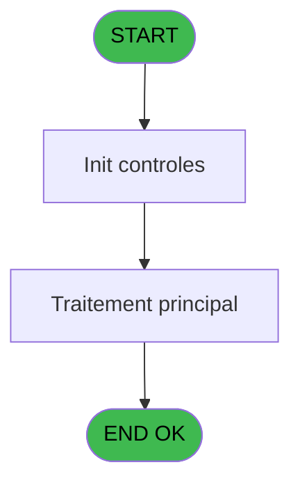
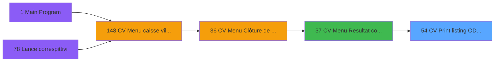

# VIL IDE 54 - CV  Print listing OD gratuits

> **Analyse**: Phases 1-4 2026-02-03 08:58 -> 08:58 (20s) | Assemblage 08:58
> **Pipeline**: V7.2 Enrichi
> **Structure**: 4 onglets (Resume | Ecrans | Donnees | Connexions)

<!-- TAB:Resume -->

## 1. FICHE D'IDENTITE

| Attribut | Valeur |
|----------|--------|
| Projet | VIL |
| IDE Position | 54 |
| Nom Programme | CV  Print listing OD gratuits |
| Fichier source | `Prg_54.xml` |
| Domaine metier | Impression |
| Taches | 1 (1 ecrans visibles) |
| Tables modifiees | 0 |
| Programmes appeles | 0 |

## 2. DESCRIPTION FONCTIONNELLE

**CV  Print listing OD gratuits** assure la gestion complete de ce processus, accessible depuis [CV Menu Resultat comptable (IDE 37)](VIL-IDE-37.md).

Le flux de traitement s'organise en **1 blocs fonctionnels** :

- **Traitement** (1 tache) : traitements metier divers

**Logique metier** : 7 regles identifiees couvrant conditions metier.

## 3. BLOCS FONCTIONNELS

### 3.1 Traitement (1 tache)

Traitements internes.

---

#### 54 - Veuillez patienter .... [[ECRAN]](#ecran-t1)

**Role** : Traitement : Veuillez patienter .....
**Ecran** : 422 x 56 DLU (MDI) | [Voir mockup](#ecran-t1)

## 5. REGLES METIER

7 regles identifiees:

### Autres (7 regles)

#### [RM-001] Si [W]='A' alors 'annul' sinon '')

| Element | Detail |
|---------|--------|
| **Condition** | `[W]='A'` |
| **Si vrai** | 'annul' |
| **Si faux** | '') |
| **Expression source** | Expression 11 : `IF ([W]='A','annul','')` |
| **Exemple** | Si [W]='A' → 'annul'. Sinon → '') |

#### [RM-002] Traitement conditionnel si [X]> est a zero

| Element | Detail |
|---------|--------|
| **Condition** | `[X]>=0` |
| **Si vrai** | [X] |
| **Si faux** | 0) |
| **Expression source** | Expression 12 : `IF ([X]>=0,[X],0)` |
| **Exemple** | Si [X]>=0 → [X]. Sinon → 0) |

#### [RM-003] Si [X]<0 alors ABS ([X]) sinon 0)

| Element | Detail |
|---------|--------|
| **Condition** | `[X]<0` |
| **Si vrai** | ABS ([X]) |
| **Si faux** | 0) |
| **Expression source** | Expression 13 : `IF ([X]<0,ABS ([X]),0)` |
| **Exemple** | Si [X]<0 → ABS ([X]). Sinon → 0) |

#### [RM-004] Traitement conditionnel si W0 total general [M]> est a zero

| Element | Detail |
|---------|--------|
| **Condition** | `W0 total general [M]>=0` |
| **Si vrai** | W0 total general [M] |
| **Si faux** | 0) |
| **Variables** | M (W0 total general) |
| **Expression source** | Expression 26 : `IF (W0 total general [M]>=0,W0 total general [M],0)` |
| **Exemple** | Si W0 total general [M]>=0 → W0 total general [M]. Sinon → 0) |

#### [RM-005] Si W0 total general [M]<0 alors ABS (W0 total general [M]) sinon 0)

| Element | Detail |
|---------|--------|
| **Condition** | `W0 total general [M]<0` |
| **Si vrai** | ABS (W0 total general [M]) |
| **Si faux** | 0) |
| **Variables** | M (W0 total general) |
| **Expression source** | Expression 27 : `IF (W0 total general [M]<0,ABS (W0 total general [M]),0)` |
| **Exemple** | Si W0 total general [M]<0 → ABS (W0 total general [M]). Sinon → 0) |

#### [RM-006] Si W0 cumul cr ss-imput [I]<>0 AND W0 cumul db ss-imput [J]<>0 alors IF (W0 cumul cr ss-imput [I]+W0 cumul db ss-imput [J]<0 sinon '(DB '&LTrim (RTrim (Str (ABS (W0 cumul cr ss-imput [I]+W0 cumul db ss-imput [J]),P0 masque cumul [B])))&')','(CR '&LTrim (RTrim (Str (ABS (W0 cumul cr ss-imput [I]+W0 cumul db ss-imput [J]),P0 masque cumul [B])))&')'),Fill ('.',22))

| Element | Detail |
|---------|--------|
| **Condition** | `W0 cumul cr ss-imput [I]<>0 AND W0 cumul db ss-imput [J]<>0` |
| **Si vrai** | IF (W0 cumul cr ss-imput [I]+W0 cumul db ss-imput [J]<0 |
| **Si faux** | '(DB '&LTrim (RTrim (Str (ABS (W0 cumul cr ss-imput [I]+W0 cumul db ss-imput [J]),P0 masque cumul [B])))&')','(CR '&LTrim (RTrim (Str (ABS (W0 cumul cr ss-imput [I]+W0 cumul db ss-imput [J]),P0 masque cumul [B])))&')'),Fill ('.',22)) |
| **Variables** | B (P0 masque cumul), I (W0 cumul cr ss-imput), J (W0 cumul db ss-imput) |
| **Expression source** | Expression 28 : `IF (W0 cumul cr ss-imput [I]<>0 AND W0 cumul db ss-imput [J]` |
| **Exemple** | Si W0 cumul cr ss-imput [I]<>0 AND W0 cumul db ss-imput [J]<>0 → IF (W0 cumul cr ss-imput [I]+W0 cumul db ss-imput [J]<0 |

#### [RM-007] Si W0 cumul cr imput [K]<>0 AND W0 cumul db imput [L]<>0 alors IF (W0 cumul cr imput [K]+W0 cumul db imput [L]<0 sinon '(DB '&LTrim (RTrim (Str (ABS (W0 cumul cr imput [K]+W0 cumul db imput [L]),P0 masque cumul [B])))&')','(CR '&LTrim (RTrim (Str (ABS (W0 cumul cr imput [K]+W0 cumul db imput [L]),P0 masque cumul [B])))&')'),Fill ('.',22))

| Element | Detail |
|---------|--------|
| **Condition** | `W0 cumul cr imput [K]<>0 AND W0 cumul db imput [L]<>0` |
| **Si vrai** | IF (W0 cumul cr imput [K]+W0 cumul db imput [L]<0 |
| **Si faux** | '(DB '&LTrim (RTrim (Str (ABS (W0 cumul cr imput [K]+W0 cumul db imput [L]),P0 masque cumul [B])))&')','(CR '&LTrim (RTrim (Str (ABS (W0 cumul cr imput [K]+W0 cumul db imput [L]),P0 masque cumul [B])))&')'),Fill ('.',22)) |
| **Variables** | B (P0 masque cumul), K (W0 cumul cr imput), L (W0 cumul db imput) |
| **Expression source** | Expression 29 : `IF (W0 cumul cr imput [K]<>0 AND W0 cumul db imput [L]<>0,IF` |
| **Exemple** | Si W0 cumul cr imput [K]<>0 AND W0 cumul db imput [L]<>0 → IF (W0 cumul cr imput [K]+W0 cumul db imput [L]<0 |

## 6. CONTEXTE

- **Appele par**: [CV Menu Resultat comptable (IDE 37)](VIL-IDE-37.md)
- **Appelle**: 0 programmes | **Tables**: 2 (W:0 R:1 L:1) | **Taches**: 1 | **Expressions**: 31

<!-- TAB:Ecrans -->

## 8. ECRANS

### 8.1 Forms visibles (1 / 1)

| # | Position | Tache | Nom | Type | Largeur | Hauteur | Bloc |
|---|----------|-------|-----|------|---------|---------|------|
| 1 | 54 | 54 | Veuillez patienter .... | MDI | 422 | 56 | Traitement |

### 8.2 Mockups Ecrans

---

#### 54 - Veuillez patienter ....
**Tache** : [54](#t1) | **Type** : MDI | **Dimensions** : 422 x 56 DLU
**Bloc** : Traitement | **Titre IDE** : Veuillez patienter ....

<!-- FORM-DATA:
{
    "width":  422,
    "vFactor":  8,
    "type":  "MDI",
    "hFactor":  8,
    "controls":  [
                     {
                         "x":  0,
                         "type":  "label",
                         "var":  "",
                         "y":  0,
                         "w":  423,
                         "fmt":  "",
                         "name":  "",
                         "h":  29,
                         "color":  "",
                         "text":  "",
                         "parent":  null
                     },
                     {
                         "x":  117,
                         "type":  "label",
                         "var":  "",
                         "y":  10,
                         "w":  275,
                         "fmt":  "",
                         "name":  "",
                         "h":  8,
                         "color":  "7",
                         "text":  "Impression en cours",
                         "parent":  null
                     },
                     {
                         "x":  0,
                         "type":  "label",
                         "var":  "",
                         "y":  29,
                         "w":  423,
                         "fmt":  "",
                         "name":  "",
                         "h":  27,
                         "color":  "",
                         "text":  "",
                         "parent":  null
                     },
                     {
                         "x":  66,
                         "type":  "label",
                         "var":  "",
                         "y":  39,
                         "w":  291,
                         "fmt":  "",
                         "name":  "",
                         "h":  8,
                         "color":  "",
                         "text":  "Impression listing OD gratuits",
                         "parent":  null
                     },
                     {
                         "x":  1,
                         "type":  "image",
                         "var":  "",
                         "y":  2,
                         "w":  72,
                         "fmt":  "",
                         "name":  "",
                         "h":  25,
                         "color":  "",
                         "text":  "",
                         "parent":  null
                     }
                 ],
    "taskId":  "54",
    "height":  56
}
-->

## 9. NAVIGATION

Ecran unique: **Veuillez patienter ....**

### 9.3 Structure hierarchique (1 tache)

| Position | Tache | Type | Dimensions | Bloc |
|----------|-------|------|------------|------|
| **54.1** | [**Veuillez patienter ....** (54)](#t1) [mockup](#ecran-t1) | MDI | 422x56 | Traitement |

### 9.4 Algorigramme

> **Legende**: Vert = START/END OK | Rouge = END KO | Bleu = Decisions
> *Algorigramme auto-genere. Utiliser `/algorigramme` pour une synthese metier detaillee.*

<!-- TAB:Donnees -->

## 10. TABLES

### Tables utilisees (2)

| ID | Nom | Description | Type | R | W | L | Usages |
|----|-----|-------------|------|---|---|---|--------|
| 30 | gm-recherche_____gmr | Index de recherche | DB | R |   |   | 1 |
| 38 | comptable_gratuite |  | DB |   |   | L | 1 |

### Colonnes par table (2 / 1 tables avec colonnes identifiees)

Table 30 - gm-recherche_____gmr (R) - 1 usages

| Lettre | Variable | Acces | Type |
|--------|----------|-------|------|
| A | P0 societe | R | Alpha |
| B | P0 masque cumul | R | Alpha |
| C | P0 date comptable | R | Date |
| D | P0 imputation | R | Numeric |
| E | P0 nom village | R | Alpha |
| F | W0 config imp. | R | Alpha |
| G | W0 date listing | R | Date |
| H | W0 heure listing | R | Time |
| I | W0 cumul cr ss-imput | R | Numeric |
| J | W0 cumul db ss-imput | R | Numeric |
| K | W0 cumul cr imput | R | Numeric |
| L | W0 cumul db imput | R | Numeric |
| M | W0 total general | R | Numeric |

## 11. VARIABLES

### 11.1 Parametres entrants (5)

Variables recues du programme appelant ([CV Menu Resultat comptable (IDE 37)](VIL-IDE-37.md)).

| Lettre | Nom | Type | Usage dans |
|--------|-----|------|-----------|
| A | P0 societe | Alpha | 1x parametre entrant |
| B | P0 masque cumul | Alpha | 3x parametre entrant |
| C | P0 date comptable | Date | 1x parametre entrant |
| D | P0 imputation | Numeric | 1x parametre entrant |
| E | P0 nom village | Alpha | - |

### 11.2 Variables de travail (8)

Variables internes au programme.

| Lettre | Nom | Type | Usage dans |
|--------|-----|------|-----------|
| F | W0 config imp. | Alpha | - |
| G | W0 date listing | Date | - |
| H | W0 heure listing | Time | - |
| I | W0 cumul cr ss-imput | Numeric | 2x calcul interne |
| J | W0 cumul db ss-imput | Numeric | 3x calcul interne |
| K | W0 cumul cr imput | Numeric | 2x calcul interne |
| L | W0 cumul db imput | Numeric | 3x calcul interne |
| M | W0 total general | Numeric | 3x calcul interne |

## 12. EXPRESSIONS

**31 / 31 expressions decodees (100%)**

### 12.1 Repartition par type

| Type | Expressions | Regles |
|------|-------------|--------|
| CALCULATION | 5 | 0 |
| CONCATENATION | 3 | 2 |
| CONDITION | 9 | 5 |
| CONSTANTE | 2 | 0 |
| DATE | 1 | 0 |
| OTHER | 11 | 0 |

### 12.2 Expressions cles par type

#### CALCULATION (5 expressions)

| Type | IDE | Expression | Regle |
|------|-----|------------|-------|
| CALCULATION | 24 | `W0 cumul db imput [L]+[X]` | - |
| CALCULATION | 25 | `W0 total general [M]+[X]` | - |
| CALCULATION | 23 | `W0 cumul cr imput [K]+[X]` | - |
| CALCULATION | 19 | `W0 cumul cr ss-imput [I]+[X]` | - |
| CALCULATION | 21 | `W0 cumul db ss-imput [J]+[X]` | - |

#### CONCATENATION (3 expressions)

| Type | IDE | Expression | Regle |
|------|-----|------------|-------|
| CONCATENATION | 29 | `IF (W0 cumul cr imput [K]<>0 AND W0 cumul db imput [L]<>0,IF (W0 cumul cr imput [K]+W0 cumul db imput [L]<0,'(DB '&LTrim (RTrim (Str (ABS (W0 cumul cr imput [K]+W0 cumul db imput [L]),P0 masque cumul [B])))&')','(CR '&LTrim (RTrim (Str (ABS (W0 cumul cr imput [K]+W0 cumul db imput [L]),P0 masque cumul [B])))&')'),Fill ('.',22))` | [RM-007](#rm-RM-007) |
| CONCATENATION | 28 | `IF (W0 cumul cr ss-imput [I]<>0 AND W0 cumul db ss-imput [J]<>0,IF (W0 cumul cr ss-imput [I]+W0 cumul db ss-imput [J]<0,'(DB '&LTrim (RTrim (Str (ABS (W0 cumul cr ss-imput [I]+W0 cumul db ss-imput [J]),P0 masque cumul [B])))&')','(CR '&LTrim (RTrim (Str (ABS (W0 cumul cr ss-imput [I]+W0 cumul db ss-imput [J]),P0 masque cumul [B])))&')'),Fill ('.',22))` | [RM-006](#rm-RM-006) |
| CONCATENATION | 31 | `'- '&Str (Page (0,1),'3P0Z0')&' -'` | - |

#### CONDITION (9 expressions)

| Type | IDE | Expression | Regle |
|------|-----|------------|-------|
| CONDITION | 26 | `IF (W0 total general [M]>=0,W0 total general [M],0)` | [RM-004](#rm-RM-004) |
| CONDITION | 27 | `IF (W0 total general [M]<0,ABS (W0 total general [M]),0)` | [RM-005](#rm-RM-005) |
| CONDITION | 13 | `IF ([X]<0,ABS ([X]),0)` | [RM-003](#rm-RM-003) |
| CONDITION | 11 | `IF ([W]='A','annul','')` | [RM-001](#rm-RM-001) |
| CONDITION | 12 | `IF ([X]>=0,[X],0)` | [RM-002](#rm-RM-002) |
| ... | | *+4 autres* | |

#### CONSTANTE (2 expressions)

| Type | IDE | Expression | Regle |
|------|-----|------------|-------|
| CONSTANTE | 18 | `0` | - |
| CONSTANTE | 8 | `'M'` | - |

#### DATE (1 expressions)

| Type | IDE | Expression | Regle |
|------|-----|------------|-------|
| DATE | 5 | `Date ()` | - |

#### OTHER (11 expressions)

| Type | IDE | Expression | Regle |
|------|-----|------------|-------|
| OTHER | 14 | `ABS (W0 cumul db ss-imput [J])` | - |
| OTHER | 10 | `P0 masque cumul [B]` | - |
| OTHER | 15 | `ABS (W0 cumul db imput [L])` | - |
| OTHER | 17 | `[R]` | - |
| OTHER | 16 | `[Q]` | - |
| ... | | *+6 autres* | |

### 12.3 Toutes les expressions (31)

Voir les 31 expressions

#### CALCULATION (5)

| IDE | Expression Decodee |
|-----|-------------------|
| 19 | `W0 cumul cr ss-imput [I]+[X]` |
| 21 | `W0 cumul db ss-imput [J]+[X]` |
| 23 | `W0 cumul cr imput [K]+[X]` |
| 24 | `W0 cumul db imput [L]+[X]` |
| 25 | `W0 total general [M]+[X]` |

#### CONCATENATION (3)

| IDE | Expression Decodee |
|-----|-------------------|
| 31 | `'- '&Str (Page (0,1),'3P0Z0')&' -'` |
| 28 | `IF (W0 cumul cr ss-imput [I]<>0 AND W0 cumul db ss-imput [J]<>0,IF (W0 cumul cr ss-imput [I]+W0 cumul db ss-imput [J]<0,'(DB '&LTrim (RTrim (Str (ABS (W0 cumul cr ss-imput [I]+W0 cumul db ss-imput [J]),P0 masque cumul [B])))&')','(CR '&LTrim (RTrim (Str (ABS (W0 cumul cr ss-imput [I]+W0 cumul db ss-imput [J]),P0 masque cumul [B])))&')'),Fill ('.',22))` |
| 29 | `IF (W0 cumul cr imput [K]<>0 AND W0 cumul db imput [L]<>0,IF (W0 cumul cr imput [K]+W0 cumul db imput [L]<0,'(DB '&LTrim (RTrim (Str (ABS (W0 cumul cr imput [K]+W0 cumul db imput [L]),P0 masque cumul [B])))&')','(CR '&LTrim (RTrim (Str (ABS (W0 cumul cr imput [K]+W0 cumul db imput [L]),P0 masque cumul [B])))&')'),Fill ('.',22))` |

#### CONDITION (9)

| IDE | Expression Decodee |
|-----|-------------------|
| 11 | `IF ([W]='A','annul','')` |
| 12 | `IF ([X]>=0,[X],0)` |
| 13 | `IF ([X]<0,ABS ([X]),0)` |
| 26 | `IF (W0 total general [M]>=0,W0 total general [M],0)` |
| 27 | `IF (W0 total general [M]<0,ABS (W0 total general [M]),0)` |
| 9 | `CndRange(P0 imputation [D]<>0,P0 imputation [D])` |
| 20 | `[X]>=0` |
| 22 | `[X]<0` |
| 30 | `INIGet ('[MAGIC_LOGICAL_NAMES]preview')='O'` |

#### CONSTANTE (2)

| IDE | Expression Decodee |
|-----|-------------------|
| 8 | `'M'` |
| 18 | `0` |

#### DATE (1)

| IDE | Expression Decodee |
|-----|-------------------|
| 5 | `Date ()` |

#### OTHER (11)

| IDE | Expression Decodee |
|-----|-------------------|
| 1 | `GetParam ('DTCLOSURE')` |
| 2 | `SetCrsr (1)` |
| 3 | `SetCrsr (2)` |
| 4 | `P0 societe [A]` |
| 6 | `Time ()` |
| 7 | `P0 date comptable [C]` |
| 10 | `P0 masque cumul [B]` |
| 14 | `ABS (W0 cumul db ss-imput [J])` |
| 15 | `ABS (W0 cumul db imput [L])` |
| 16 | `[Q]` |
| 17 | `[R]` |

<!-- TAB:Connexions -->

## 13. GRAPHE D'APPELS

### 13.1 Chaine depuis Main (Callers)

Main -> ... -> [CV Menu Resultat comptable (IDE 37)](VIL-IDE-37.md) -> **CV  Print listing OD gratuits (IDE 54)**

### 13.2 Callers

| IDE | Nom Programme | Nb Appels |
|-----|---------------|-----------|
| [37](VIL-IDE-37.md) | CV Menu Resultat comptable | 1 |

### 13.3 Callees (programmes appeles)

### 13.4 Detail Callees avec contexte

| IDE | Nom Programme | Appels | Contexte |
|-----|---------------|--------|----------|
| - | (aucun) | - | - |

## 14. RECOMMANDATIONS MIGRATION

### 14.1 Profil du programme

| Metrique | Valeur | Impact migration |
|----------|--------|-----------------|
| Lignes de logique | 61 | Programme compact |
| Expressions | 31 | Peu de logique |
| Tables WRITE | 0 | Impact faible |
| Sous-programmes | 0 | Peu de dependances |
| Ecrans visibles | 1 | Ecran unique ou traitement batch |
| Code desactive | 0% (0 / 61) | Code sain |
| Regles metier | 7 | Quelques regles a preserver |

### 14.2 Plan de migration par bloc

#### Traitement (1 tache: 1 ecran, 0 traitement)

- **Strategie** : 1 composant(s) UI (Razor/React) avec formulaires et validation.
- Decomposer les taches en services unitaires testables.

### 14.3 Dependances critiques

| Dependance | Type | Appels | Impact |
|------------|------|--------|--------|

---
*Spec DETAILED generee par Pipeline V7.2 - 2026-02-03 08:58*
