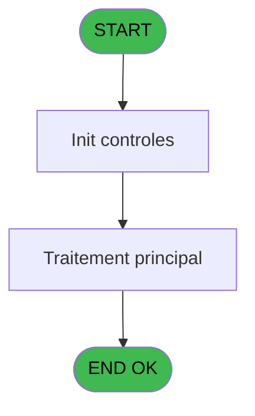
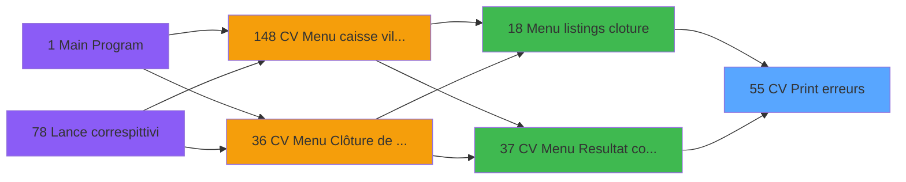

# VIL IDE 55 - CV  Print erreurs

> **Analyse**: Phases 1-4 2026-02-03 08:58 -> 08:59 (20s) | Assemblage 08:59
> **Pipeline**: V7.2 Enrichi
> **Structure**: 4 onglets (Resume | Ecrans | Donnees | Connexions)

<!-- TAB:Resume -->

## 1. FICHE D'IDENTITE

| Attribut | Valeur |
|----------|--------|
| Projet | VIL |
| IDE Position | 55 |
| Nom Programme | CV  Print erreurs |
| Fichier source | `Prg_55.xml` |
| Domaine metier | Impression |
| Taches | 6 (1 ecrans visibles) |
| Tables modifiees | 0 |
| Programmes appeles | 0 |

## 2. DESCRIPTION FONCTIONNELLE

**CV  Print erreurs** assure la gestion complete de ce processus, accessible depuis [Menu listings cloture (IDE 18)](VIL-IDE-18.md), [CV Menu Resultat comptable (IDE 37)](VIL-IDE-37.md).

Le flux de traitement s'organise en **1 blocs fonctionnels** :

- **Traitement** (6 taches) : traitements metier divers

Detail : phases du traitement

#### Phase 1 : Traitement (6 taches)

- **55** - Veuillez patienter .... **[[ECRAN]](#ecran-t1)**
- **55.1** - (sans nom) **[[ECRAN]](#ecran-t2)**
- **55.2** - erreurs PABX
- **55.2.1** - Lecture paramètre TEL
- **55.3** - erreurs PABX
- **55.4** - Erreurs Retail **[[ECRAN]](#ecran-t10)**

## 3. BLOCS FONCTIONNELS

### 3.1 Traitement (6 taches)

Traitements internes.

---

#### 55 - Veuillez patienter .... [[ECRAN]](#ecran-t1)

**Role** : Tache d'orchestration : point d'entree du programme (6 sous-taches). Coordonne l'enchainement des traitements.
**Ecran** : 422 x 56 DLU (MDI) | [Voir mockup](#ecran-t1)

5 sous-taches directes

| Tache | Nom | Bloc |
|-------|-----|------|
| [55.1](#t2) | (sans nom) **[[ECRAN]](#ecran-t2)** | Traitement |
| [55.2](#t5) | erreurs PABX | Traitement |
| [55.2.1](#t6) | Lecture paramètre TEL | Traitement |
| [55.3](#t9) | erreurs PABX | Traitement |
| [55.4](#t10) | Erreurs Retail **[[ECRAN]](#ecran-t10)** | Traitement |

---

#### 55.1 - (sans nom) [[ECRAN]](#ecran-t2)

**Role** : Traitement interne.
**Ecran** : 108 x 24 DLU (MDI) | [Voir mockup](#ecran-t2)

---

#### 55.2 - erreurs PABX

**Role** : Traitement : erreurs PABX.

---

#### 55.2.1 - Lecture paramètre TEL

**Role** : Traitement : Lecture paramètre TEL.

---

#### 55.3 - erreurs PABX

**Role** : Traitement : erreurs PABX.

---

#### 55.4 - Erreurs Retail [[ECRAN]](#ecran-t10)

**Role** : Traitement : Erreurs Retail.
**Ecran** : 316 x 66 DLU (MDI) | [Voir mockup](#ecran-t10)
**Variables liees** : N (v. retour erreur retail)

## 5. REGLES METIER

*(Aucune regle metier identifiee)*

## 6. CONTEXTE

- **Appele par**: [Menu listings cloture (IDE 18)](VIL-IDE-18.md), [CV Menu Resultat comptable (IDE 37)](VIL-IDE-37.md)
- **Appelle**: 0 programmes | **Tables**: 11 (W:0 R:4 L:8) | **Taches**: 6 | **Expressions**: 9

<!-- TAB:Ecrans -->

## 8. ECRANS

### 8.1 Forms visibles (1 / 6)

| # | Position | Tache | Nom | Type | Largeur | Hauteur | Bloc |
|---|----------|-------|-----|------|---------|---------|------|
| 1 | 55 | 55 | Veuillez patienter .... | MDI | 422 | 56 | Traitement |

### 8.2 Mockups Ecrans

---

#### 55 - Veuillez patienter ....
**Tache** : [55](#t1) | **Type** : MDI | **Dimensions** : 422 x 56 DLU
**Bloc** : Traitement | **Titre IDE** : Veuillez patienter ....

<!-- FORM-DATA:
{
    "width":  422,
    "vFactor":  8,
    "type":  "MDI",
    "hFactor":  8,
    "controls":  [
                     {
                         "x":  0,
                         "type":  "label",
                         "var":  "",
                         "y":  0,
                         "w":  423,
                         "fmt":  "",
                         "name":  "",
                         "h":  29,
                         "color":  "",
                         "text":  "",
                         "parent":  null
                     },
                     {
                         "x":  117,
                         "type":  "label",
                         "var":  "",
                         "y":  10,
                         "w":  275,
                         "fmt":  "",
                         "name":  "",
                         "h":  8,
                         "color":  "7",
                         "text":  "Impression en cours",
                         "parent":  null
                     },
                     {
                         "x":  0,
                         "type":  "label",
                         "var":  "",
                         "y":  29,
                         "w":  423,
                         "fmt":  "",
                         "name":  "",
                         "h":  27,
                         "color":  "",
                         "text":  "",
                         "parent":  null
                     },
                     {
                         "x":  96,
                         "type":  "label",
                         "var":  "",
                         "y":  39,
                         "w":  230,
                         "fmt":  "",
                         "name":  "",
                         "h":  8,
                         "color":  "",
                         "text":  "Impression  des erreurs",
                         "parent":  null
                     },
                     {
                         "x":  1,
                         "type":  "image",
                         "var":  "",
                         "y":  2,
                         "w":  72,
                         "fmt":  "",
                         "name":  "",
                         "h":  25,
                         "color":  "",
                         "text":  "",
                         "parent":  null
                     }
                 ],
    "taskId":  "55",
    "height":  56
}
-->

## 9. NAVIGATION

Ecran unique: **Veuillez patienter ....**

### 9.3 Structure hierarchique (6 taches)

| Position | Tache | Type | Dimensions | Bloc |
|----------|-------|------|------------|------|
| **55.1** | [**Veuillez patienter ....** (55)](#t1) [mockup](#ecran-t1) | MDI | 422x56 | Traitement |
| 55.1.1 | [(sans nom) (55.1)](#t2) [mockup](#ecran-t2) | MDI | 108x24 | |
| 55.1.2 | [erreurs PABX (55.2)](#t5) | MDI | - | |
| 55.1.3 | [Lecture paramètre TEL (55.2.1)](#t6) | MDI | - | |
| 55.1.4 | [erreurs PABX (55.3)](#t9) | MDI | - | |
| 55.1.5 | [Erreurs Retail (55.4)](#t10) [mockup](#ecran-t10) | MDI | 316x66 | |

### 9.4 Algorigramme

> **Legende**: Vert = START/END OK | Rouge = END KO | Bleu = Decisions
> *Algorigramme auto-genere. Utiliser `/algorigramme` pour une synthese metier detaillee.*

<!-- TAB:Donnees -->

## 10. TABLES

### Tables utilisees (11)

| ID | Nom | Description | Type | R | W | L | Usages |
|----|-----|-------------|------|---|---|---|--------|
| 30 | gm-recherche_____gmr | Index de recherche | DB | R |   | L | 3 |
| 47 | compte_gm________cgm | Comptes GM (generaux) | DB |   |   | L | 1 |
| 60 | table_code_acces_tca |  | DB |   |   | L | 1 |
| 78 | param__telephone_tel |  | DB | R |   |   | 1 |
| 80 | codes_autocom____aut |  | DB |   |   | L | 1 |
| 153 | libelle_erreur_pabx |  | DB |   |   | L | 1 |
| 156 | erreur_pabx |  | DB | R |   |   | 1 |
| 157 | coef__telephone__coe |  | DB |   |   | L | 1 |
| 362 | absences_personnel |  | DB |   |   | L | 1 |
| 363 | pms_listing |  | DB |   |   | L | 1 |
| 453 | tai_forfait |  | DB | R |   |   | 2 |

### Colonnes par table (4 / 4 tables avec colonnes identifiees)

Table 30 - gm-recherche_____gmr (R/L) - 3 usages

*Table utilisee uniquement en Link ou aucune colonne Real identifiee dans le DataView.*

Table 78 - param__telephone_tel (R) - 1 usages

*Table utilisee uniquement en Link ou aucune colonne Real identifiee dans le DataView.*

Table 156 - erreur_pabx (R) - 1 usages

| Lettre | Variable | Acces | Type |
|--------|----------|-------|------|
| A | W1 ret lien GM | R | Numeric |
| B | W1 longueur code | R | Numeric |

Table 453 - tai_forfait (R) - 2 usages

| Lettre | Variable | Acces | Type |
|--------|----------|-------|------|
| A | P0 societe | R | Alpha |
| B | P0 date comptable | R | Date |
| C | P0 nom village | R | Alpha |
| D | P0 exec prog erreur | R | Alpha |
| E | P0 village CAM | R | Alpha |
| F | P0 village TEL | R | Alpha |
| G | P0 village Bibop | R | Alpha |
| H | P0 village PME | R | Alpha |
| I | P0 masque montant | R | Alpha |
| J | P0 masque cumul | R | Alpha |
| K | P0 nbre decimales | R | Numeric |
| L | W0 config imprimante | R | Alpha |
| M | W0 fin tâche | R | Alpha |
| N | v. retour erreur retail | R | Logical |

## 11. VARIABLES

### 11.1 Parametres entrants (11)

Variables recues du programme appelant ([Menu listings cloture (IDE 18)](VIL-IDE-18.md)).

| Lettre | Nom | Type | Usage dans |
|--------|-----|------|-----------|
| A | P0 societe | Alpha | - |
| B | P0 date comptable | Date | 1x parametre entrant |
| C | P0 nom village | Alpha | - |
| D | P0 exec prog erreur | Alpha | - |
| E | P0 village CAM | Alpha | - |
| F | P0 village TEL | Alpha | 1x parametre entrant |
| G | P0 village Bibop | Alpha | - |
| H | P0 village PME | Alpha | - |
| I | P0 masque montant | Alpha | - |
| J | P0 masque cumul | Alpha | - |
| K | P0 nbre decimales | Numeric | - |

### 11.2 Variables de session (1)

Variables persistantes pendant toute la session.

| Lettre | Nom | Type | Usage dans |
|--------|-----|------|-----------|
| N | v. retour erreur retail | Logical | [55.2](#t5), [55.3](#t9), [55.4](#t10) |

### 11.3 Variables de travail (2)

Variables internes au programme.

| Lettre | Nom | Type | Usage dans |
|--------|-----|------|-----------|
| L | W0 config imprimante | Alpha | - |
| M | W0 fin tâche | Alpha | 1x calcul interne |

## 12. EXPRESSIONS

**9 / 9 expressions decodees (100%)**

### 12.1 Repartition par type

| Type | Expressions | Regles |
|------|-------------|--------|
| CONSTANTE | 2 | 0 |
| OTHER | 4 | 0 |
| CONDITION | 3 | 0 |

### 12.2 Expressions cles par type

#### CONSTANTE (2 expressions)

| Type | IDE | Expression | Regle |
|------|-----|------------|-------|
| CONSTANTE | 6 | `'O'` | - |
| CONSTANTE | 4 | `'F'` | - |

#### OTHER (4 expressions)

| Type | IDE | Expression | Regle |
|------|-----|------------|-------|
| OTHER | 8 | `P0 date comptable [B]` | - |
| OTHER | 9 | `v. retour erreur retail [N]` | - |
| OTHER | 1 | `SetCrsr (1)` | - |
| OTHER | 2 | `SetCrsr (2)` | - |

#### CONDITION (3 expressions)

| Type | IDE | Expression | Regle |
|------|-----|------------|-------|
| CONDITION | 7 | `DbRecs ('{362,2}'DSOURCE,'')>0` | - |
| CONDITION | 5 | `W0 fin tâche [M]='F'` | - |
| CONDITION | 3 | `P0 village TEL [F]='O'` | - |

<!-- TAB:Connexions -->

## 13. GRAPHE D'APPELS

### 13.1 Chaine depuis Main (Callers)

Main -> ... -> [Menu listings cloture (IDE 18)](VIL-IDE-18.md) -> **CV  Print erreurs (IDE 55)**

Main -> ... -> [CV Menu Resultat comptable (IDE 37)](VIL-IDE-37.md) -> **CV  Print erreurs (IDE 55)**

### 13.2 Callers

| IDE | Nom Programme | Nb Appels |
|-----|---------------|-----------|
| [18](VIL-IDE-18.md) | Menu listings cloture | 1 |
| [37](VIL-IDE-37.md) | CV Menu Resultat comptable | 1 |

### 13.3 Callees (programmes appeles)

### 13.4 Detail Callees avec contexte

| IDE | Nom Programme | Appels | Contexte |
|-----|---------------|--------|----------|
| - | (aucun) | - | - |

## 14. RECOMMANDATIONS MIGRATION

### 14.1 Profil du programme

| Metrique | Valeur | Impact migration |
|----------|--------|-----------------|
| Lignes de logique | 141 | Programme compact |
| Expressions | 9 | Peu de logique |
| Tables WRITE | 0 | Impact faible |
| Sous-programmes | 0 | Peu de dependances |
| Ecrans visibles | 1 | Ecran unique ou traitement batch |
| Code desactive | 0% (0 / 141) | Code sain |
| Regles metier | 0 | Pas de regle identifiee |

### 14.2 Plan de migration par bloc

#### Traitement (6 taches: 3 ecrans, 3 traitements)

- **Strategie** : Orchestrateur avec 3 ecrans (Razor/React) et 3 traitements backend (services).
- Les ecrans deviennent des composants UI, les traitements invisibles deviennent des services injectables.
- Decomposer les taches en services unitaires testables.

### 14.3 Dependances critiques

| Dependance | Type | Appels | Impact |
|------------|------|--------|--------|

---
*Spec DETAILED generee par Pipeline V7.2 - 2026-02-03 08:59*
