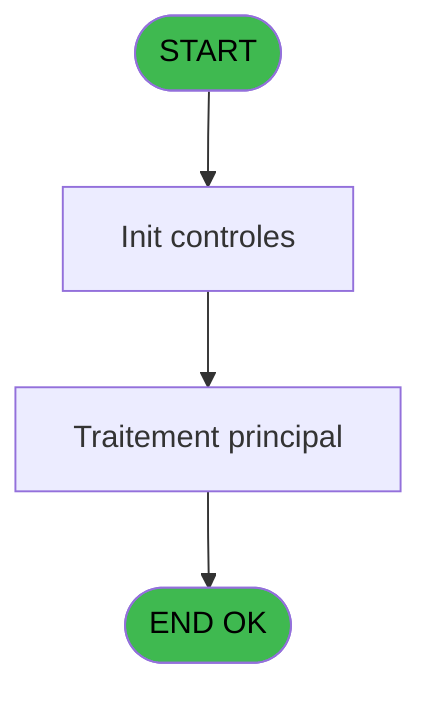
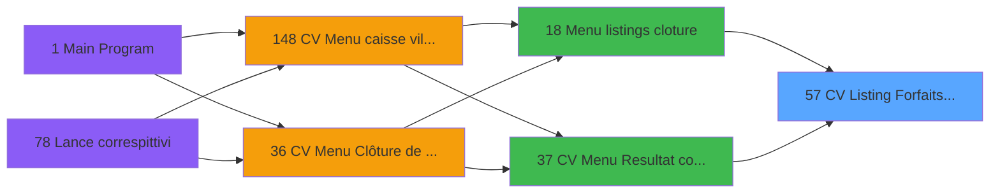

# VIL IDE 57 - CV Listing Forfaits TAI CASH

> **Analyse**: Phases 1-4 2026-02-03 08:59 -> 09:00 (21s) | Assemblage 09:00
> **Pipeline**: V7.2 Enrichi
> **Structure**: 4 onglets (Resume | Ecrans | Donnees | Connexions)

<!-- TAB:Resume -->

## 1. FICHE D'IDENTITE

| Attribut | Valeur |
|----------|--------|
| Projet | VIL |
| IDE Position | 57 |
| Nom Programme | CV Listing Forfaits TAI CASH |
| Fichier source | `Prg_57.xml` |
| Domaine metier | General |
| Taches | 3 (0 ecrans visibles) |
| Tables modifiees | 0 |
| Programmes appeles | 0 |

## 2. DESCRIPTION FONCTIONNELLE

**CV Listing Forfaits TAI CASH** assure la gestion complete de ce processus, accessible depuis [Menu listings cloture (IDE 18)](VIL-IDE-18.md), [CV Menu Resultat comptable (IDE 37)](VIL-IDE-37.md).

Le flux de traitement s'organise en **2 blocs fonctionnels** :

- **Calcul** (2 taches) : calculs de montants, stocks ou compteurs
- **Traitement** (1 tache) : traitements metier divers

**Logique metier** : 1 regles identifiees couvrant valeurs par defaut.

Detail : phases du traitement

#### Phase 1 : Traitement (1 tache)

- **57** - CV Listing Forfaits TAI CASH **[[ECRAN]](#ecran-t1)**

#### Phase 2 : Calcul (2 taches)

- **57.1** - Lecture date comptable
- **57.2** - Calcul change

## 3. BLOCS FONCTIONNELS

### 3.1 Traitement (1 tache)

Traitements internes.

---

#### 57 - CV Listing Forfaits TAI CASH [[ECRAN]](#ecran-t1)

**Role** : Traitement : CV Listing Forfaits TAI CASH.
**Ecran** : 862 x 184 DLU (MDI) | [Voir mockup](#ecran-t1)

### 3.2 Calcul (2 taches)

Calculs metier : montants, stocks, compteurs.

---

#### 57.1 - Lecture date comptable

**Role** : Traitement : Lecture date comptable.
**Variables liees** : G (W0 date comptable)

---

#### 57.2 - Calcul change

**Role** : Calcul : Calcul change.

## 5. REGLES METIER

1 regles identifiees:

### Autres (1 regles)

#### [RM-001] Valeur par defaut si P0 societe [A] est vide

| Element | Detail |
|---------|--------|
| **Condition** | `P0 societe [A]=''` |
| **Si vrai** | 'C' |
| **Si faux** | P0 societe [A]) |
| **Variables** | A (P0 societe) |
| **Expression source** | Expression 1 : `IF (P0 societe [A]='','C',P0 societe [A])` |
| **Exemple** | Si P0 societe [A]='' → 'C'. Sinon → P0 societe [A]) |

## 6. CONTEXTE

- **Appele par**: [Menu listings cloture (IDE 18)](VIL-IDE-18.md), [CV Menu Resultat comptable (IDE 37)](VIL-IDE-37.md)
- **Appelle**: 0 programmes | **Tables**: 3 (W:0 R:2 L:1) | **Taches**: 3 | **Expressions**: 2

<!-- TAB:Ecrans -->

## 8. ECRANS

*(Programme sans ecran visible)*

## 9. NAVIGATION

### 9.3 Structure hierarchique (3 taches)

| Position | Tache | Type | Dimensions | Bloc |
|----------|-------|------|------------|------|
| **57.1** | [**CV Listing Forfaits TAI CASH** (57)](#t1) [mockup](#ecran-t1) | MDI | 862x184 | Traitement |
| **57.2** | [**Lecture date comptable** (57.1)](#t3) | MDI | - | Calcul |
| 57.2.1 | [Calcul change (57.2)](#t4) | MDI | - | |

### 9.4 Algorigramme

> **Legende**: Vert = START/END OK | Rouge = END KO | Bleu = Decisions
> *Algorigramme auto-genere. Utiliser `/algorigramme` pour une synthese metier detaillee.*

<!-- TAB:Donnees -->

## 10. TABLES

### Tables utilisees (3)

| ID | Nom | Description | Type | R | W | L | Usages |
|----|-----|-------------|------|---|---|---|--------|
| 30 | gm-recherche_____gmr | Index de recherche | DB | R |   |   | 1 |
| 70 | date_comptable___dat |  | DB | R |   |   | 1 |
| 463 | heure_de_passage |  | DB |   |   | L | 1 |

### Colonnes par table (2 / 2 tables avec colonnes identifiees)

Table 30 - gm-recherche_____gmr (R) - 1 usages

| Lettre | Variable | Acces | Type |
|--------|----------|-------|------|
| A | W1 total reglt | R | Numeric |
| B | W1 total user | R | Numeric |
| C | W1 total montant | R | Numeric |

Table 70 - date_comptable___dat (R) - 1 usages

| Lettre | Variable | Acces | Type |
|--------|----------|-------|------|
| G | W0 date comptable | R | Date |

## 11. VARIABLES

### 11.1 Parametres entrants (6)

Variables recues du programme appelant ([Menu listings cloture (IDE 18)](VIL-IDE-18.md)).

| Lettre | Nom | Type | Usage dans |
|--------|-----|------|-----------|
| A | P0 societe | Alpha | 1x parametre entrant |
| B | P0 nbre decimales | Numeric | - |
| C | P0 nom village | Alpha | - |
| D | P0 masque cumul | Alpha | - |
| E | P0 devise locale | Alpha | - |
| F | P0 Top Exec TAI | Alpha | - |

### 11.2 Variables de travail (2)

Variables internes au programme.

| Lettre | Nom | Type | Usage dans |
|--------|-----|------|-----------|
| G | W0 date comptable | Date | - |
| H | W0 fin tache | Alpha | - |

## 12. EXPRESSIONS

**2 / 2 expressions decodees (100%)**

### 12.1 Repartition par type

| Type | Expressions | Regles |
|------|-------------|--------|
| CONDITION | 1 | 5 |
| CONSTANTE | 1 | 0 |

### 12.2 Expressions cles par type

#### CONDITION (1 expressions)

| Type | IDE | Expression | Regle |
|------|-----|------------|-------|
| CONDITION | 1 | `IF (P0 societe [A]='','C',P0 societe [A])` | [RM-001](#rm-RM-001) |

#### CONSTANTE (1 expressions)

| Type | IDE | Expression | Regle |
|------|-----|------------|-------|
| CONSTANTE | 2 | `'O'` | - |

<!-- TAB:Connexions -->

## 13. GRAPHE D'APPELS

### 13.1 Chaine depuis Main (Callers)

Main -> ... -> [Menu listings cloture (IDE 18)](VIL-IDE-18.md) -> **CV Listing Forfaits TAI CASH (IDE 57)**

Main -> ... -> [CV Menu Resultat comptable (IDE 37)](VIL-IDE-37.md) -> **CV Listing Forfaits TAI CASH (IDE 57)**

### 13.2 Callers

| IDE | Nom Programme | Nb Appels |
|-----|---------------|-----------|
| [18](VIL-IDE-18.md) | Menu listings cloture | 1 |
| [37](VIL-IDE-37.md) | CV Menu Resultat comptable | 1 |

### 13.3 Callees (programmes appeles)

### 13.4 Detail Callees avec contexte

| IDE | Nom Programme | Appels | Contexte |
|-----|---------------|--------|----------|
| - | (aucun) | - | - |

## 14. RECOMMANDATIONS MIGRATION

### 14.1 Profil du programme

| Metrique | Valeur | Impact migration |
|----------|--------|-----------------|
| Lignes de logique | 55 | Programme compact |
| Expressions | 2 | Peu de logique |
| Tables WRITE | 0 | Impact faible |
| Sous-programmes | 0 | Peu de dependances |
| Ecrans visibles | 0 | Ecran unique ou traitement batch |
| Code desactive | 0% (0 / 55) | Code sain |
| Regles metier | 1 | Quelques regles a preserver |

### 14.2 Plan de migration par bloc

#### Traitement (1 tache: 1 ecran, 0 traitement)

- **Strategie** : 1 composant(s) UI (Razor/React) avec formulaires et validation.
- Decomposer les taches en services unitaires testables.

#### Calcul (2 taches: 0 ecran, 2 traitements)

- **Strategie** : Services de calcul purs (Domain Services).
- Migrer la logique de calcul (stock, compteurs, montants)

### 14.3 Dependances critiques

| Dependance | Type | Appels | Impact |
|------------|------|--------|--------|

---
*Spec DETAILED generee par Pipeline V7.2 - 2026-02-03 09:00*
