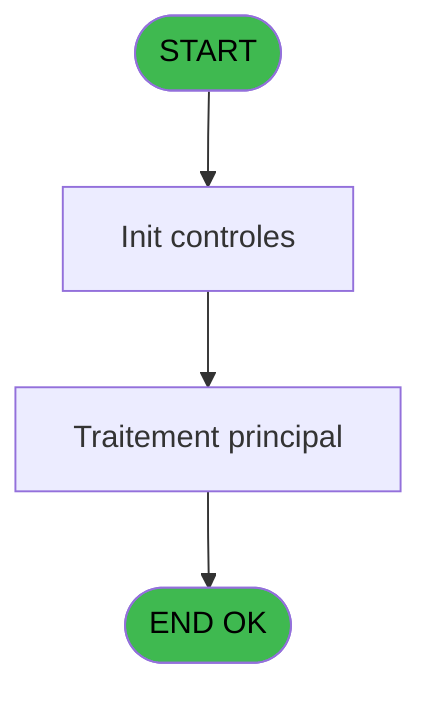
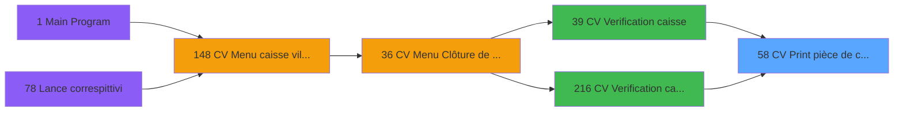

# VIL IDE 58 - CV  Print pièce de caisse

> **Analyse**: Phases 1-4 2026-02-03 09:00 -> 09:00 (21s) | Assemblage 09:00
> **Pipeline**: V7.2 Enrichi
> **Structure**: 4 onglets (Resume | Ecrans | Donnees | Connexions)

<!-- TAB:Resume -->

## 1. FICHE D'IDENTITE

| Attribut | Valeur |
|----------|--------|
| Projet | VIL |
| IDE Position | 58 |
| Nom Programme | CV  Print pièce de caisse |
| Fichier source | `Prg_58.xml` |
| Domaine metier | Caisse |
| Taches | 1 (0 ecrans visibles) |
| Tables modifiees | 0 |
| Programmes appeles | 0 |

## 2. DESCRIPTION FONCTIONNELLE

**CV  Print pièce de caisse** assure la gestion complete de ce processus, accessible depuis [CV  Verification caisse (IDE 39)](VIL-IDE-39.md), [CV  Verification caisse (IDE 216)](VIL-IDE-216.md).

Le flux de traitement s'organise en **1 blocs fonctionnels** :

- **Traitement** (1 tache) : traitements metier divers

**Logique metier** : 2 regles identifiees couvrant conditions metier.

## 3. BLOCS FONCTIONNELS

### 3.1 Traitement (1 tache)

Traitements internes.

---

#### 58 - Veuillez patienter.... [[ECRAN]](#ecran-t1)

**Role** : Traitement : Veuillez patienter.....
**Ecran** : 427 x 56 DLU (MDI) | [Voir mockup](#ecran-t1)

## 5. REGLES METIER

2 regles identifiees:

### Autres (2 regles)

#### [RM-001] Si [I]='A' alors 'ANNULATION' sinon '')

| Element | Detail |
|---------|--------|
| **Condition** | `[I]='A'` |
| **Si vrai** | 'ANNULATION' |
| **Si faux** | '') |
| **Expression source** | Expression 5 : `IF ([I]='A','ANNULATION','')` |
| **Exemple** | Si [I]='A' → 'ANNULATION'. Sinon → '') |

#### [RM-002] Si [N]='R' alors 'RECETTES' sinon 'DEPENSES')&' engagees par'

| Element | Detail |
|---------|--------|
| **Condition** | `[N]='R'` |
| **Si vrai** | 'RECETTES' |
| **Si faux** | 'DEPENSES')&' engagees par' |
| **Expression source** | Expression 6 : `IF ([N]='R','RECETTES','DEPENSES')&' engagees par'` |
| **Exemple** | Si [N]='R' → 'RECETTES'. Sinon → 'DEPENSES')&' engagees par' |

## 6. CONTEXTE

- **Appele par**: [CV  Verification caisse (IDE 39)](VIL-IDE-39.md), [CV  Verification caisse (IDE 216)](VIL-IDE-216.md)
- **Appelle**: 0 programmes | **Tables**: 1 (W:0 R:1 L:0) | **Taches**: 1 | **Expressions**: 8

<!-- TAB:Ecrans -->

## 8. ECRANS

*(Programme sans ecran visible)*

## 9. NAVIGATION

### 9.3 Structure hierarchique (1 tache)

| Position | Tache | Type | Dimensions | Bloc |
|----------|-------|------|------------|------|
| **58.1** | [**Veuillez patienter....** (58)](#t1) [mockup](#ecran-t1) | MDI | 427x56 | Traitement |

### 9.4 Algorigramme

> **Legende**: Vert = START/END OK | Rouge = END KO | Bleu = Decisions
> *Algorigramme auto-genere. Utiliser `/algorigramme` pour une synthese metier detaillee.*

<!-- TAB:Donnees -->

## 10. TABLES

### Tables utilisees (1)

| ID | Nom | Description | Type | R | W | L | Usages |
|----|-----|-------------|------|---|---|---|--------|
| 54 | pieces_caisse____pks | Sessions de caisse | DB | R |   |   | 1 |

### Colonnes par table (1 / 1 tables avec colonnes identifiees)

Table 54 - pieces_caisse____pks (R) - 1 usages

| Lettre | Variable | Acces | Type |
|--------|----------|-------|------|
| A | P0 societe | R | Alpha |
| B | P0 numero pièce | R | Numeric |
| C | P0 devise locale | R | Alpha |
| D | P0 masque mtt | R | Alpha |
| E | P0 nom village | R | Alpha |
| F | W0 config imp | R | Alpha |

## 11. VARIABLES

### 11.1 Parametres entrants (5)

Variables recues du programme appelant ([CV  Verification caisse (IDE 39)](VIL-IDE-39.md)).

| Lettre | Nom | Type | Usage dans |
|--------|-----|------|-----------|
| A | P0 societe | Alpha | 1x parametre entrant |
| B | P0 numero pièce | Numeric | 1x parametre entrant |
| C | P0 devise locale | Alpha | - |
| D | P0 masque mtt | Alpha | 1x parametre entrant |
| E | P0 nom village | Alpha | - |

### 11.2 Variables de travail (1)

Variables internes au programme.

| Lettre | Nom | Type | Usage dans |
|--------|-----|------|-----------|
| F | W0 config imp | Alpha | - |

## 12. EXPRESSIONS

**8 / 8 expressions decodees (100%)**

### 12.1 Repartition par type

| Type | Expressions | Regles |
|------|-------------|--------|
| CONDITION | 2 | 2 |
| OTHER | 6 | 0 |

### 12.2 Expressions cles par type

#### CONDITION (2 expressions)

| Type | IDE | Expression | Regle |
|------|-----|------------|-------|
| CONDITION | 6 | `IF ([N]='R','RECETTES','DEPENSES')&' engagees par'` | [RM-002](#rm-RM-002) |
| CONDITION | 5 | `IF ([I]='A','ANNULATION','')` | [RM-001](#rm-RM-001) |

#### OTHER (6 expressions)

| Type | IDE | Expression | Regle |
|------|-----|------------|-------|
| OTHER | 4 | `P0 societe [A]` | - |
| OTHER | 7 | `P0 masque mtt [D]` | - |
| OTHER | 8 | `P0 numero pièce [B]` | - |
| OTHER | 1 | `GetParam ('DTCLOSURE')` | - |
| OTHER | 2 | `SetCrsr (1)` | - |
| ... | | *+1 autres* | |

<!-- TAB:Connexions -->

## 13. GRAPHE D'APPELS

### 13.1 Chaine depuis Main (Callers)

Main -> ... -> [CV  Verification caisse (IDE 39)](VIL-IDE-39.md) -> **CV  Print pièce de caisse (IDE 58)**

Main -> ... -> [CV  Verification caisse (IDE 216)](VIL-IDE-216.md) -> **CV  Print pièce de caisse (IDE 58)**

### 13.2 Callers

| IDE | Nom Programme | Nb Appels |
|-----|---------------|-----------|
| [39](VIL-IDE-39.md) | CV  Verification caisse | 1 |
| [216](VIL-IDE-216.md) | CV  Verification caisse | 1 |

### 13.3 Callees (programmes appeles)

### 13.4 Detail Callees avec contexte

| IDE | Nom Programme | Appels | Contexte |
|-----|---------------|--------|----------|
| - | (aucun) | - | - |

## 14. RECOMMANDATIONS MIGRATION

### 14.1 Profil du programme

| Metrique | Valeur | Impact migration |
|----------|--------|-----------------|
| Lignes de logique | 22 | Programme compact |
| Expressions | 8 | Peu de logique |
| Tables WRITE | 0 | Impact faible |
| Sous-programmes | 0 | Peu de dependances |
| Ecrans visibles | 0 | Ecran unique ou traitement batch |
| Code desactive | 0% (0 / 22) | Code sain |
| Regles metier | 2 | Quelques regles a preserver |

### 14.2 Plan de migration par bloc

#### Traitement (1 tache: 1 ecran, 0 traitement)

- **Strategie** : 1 composant(s) UI (Razor/React) avec formulaires et validation.
- Decomposer les taches en services unitaires testables.

### 14.3 Dependances critiques

| Dependance | Type | Appels | Impact |
|------------|------|--------|--------|

---
*Spec DETAILED generee par Pipeline V7.2 - 2026-02-03 09:00*
