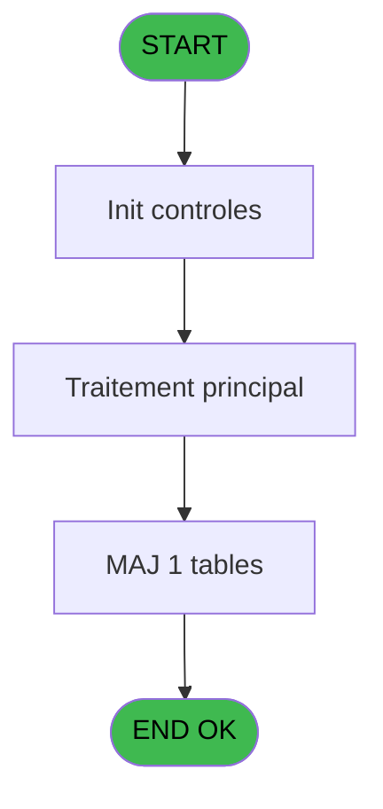

# VIL IDE 60 - CV  Print listing des comptes

> **Analyse**: Phases 1-4 2026-02-03 09:01 -> 09:01 (21s) | Assemblage 09:01
> **Pipeline**: V7.2 Enrichi
> **Structure**: 4 onglets (Resume | Ecrans | Donnees | Connexions)

<!-- TAB:Resume -->

## 1. FICHE D'IDENTITE

| Attribut | Valeur |
|----------|--------|
| Projet | VIL |
| IDE Position | 60 |
| Nom Programme | CV  Print listing des comptes |
| Fichier source | `Prg_60.xml` |
| Domaine metier | Comptabilite |
| Taches | 2 (1 ecrans visibles) |
| Tables modifiees | 1 |
| Programmes appeles | 0 |

## 2. DESCRIPTION FONCTIONNELLE

**CV  Print listing des comptes** assure la gestion complete de ce processus, accessible depuis [CV Menu Resultat comptable (IDE 37)](VIL-IDE-37.md).

Le flux de traitement s'organise en **2 blocs fonctionnels** :

- **Calcul** (1 tache) : calculs de montants, stocks ou compteurs
- **Traitement** (1 tache) : traitements metier divers

**Donnees modifiees** : 1 tables en ecriture (solde_compte_adherent).

**Logique metier** : 4 regles identifiees couvrant conditions metier.

Detail : phases du traitement

#### Phase 1 : Traitement (1 tache)

- **60** - Veuillez patienter ..... **[[ECRAN]](#ecran-t1)**

#### Phase 2 : Calcul (1 tache)

- **60.1** - Solde compte adherent

#### Tables impactees

| Table | Operations | Role metier |
|-------|-----------|-------------|
| solde_compte_adherent | **W** (1 usages) | Comptes GM (generaux) |

## 3. BLOCS FONCTIONNELS

### 3.1 Traitement (1 tache)

Traitements internes.

---

#### 60 - Veuillez patienter ..... [[ECRAN]](#ecran-t1)

**Role** : Traitement : Veuillez patienter ......
**Ecran** : 426 x 56 DLU (MDI) | [Voir mockup](#ecran-t1)

### 3.2 Calcul (1 tache)

Calculs metier : montants, stocks, compteurs.

---

#### 60.1 - Solde compte adherent

**Role** : Consultation/chargement : Solde compte adherent.
**Variables liees** : K (W0 string-solde), L (W0 string-solde)

## 5. REGLES METIER

4 regles identifiees:

### Autres (4 regles)

#### [RM-001] Si [U]<=P0 date comptable [C] alors 'INSOL' sinon '')

| Element | Detail |
|---------|--------|
| **Condition** | `[U]<=P0 date comptable [C]` |
| **Si vrai** | 'INSOL' |
| **Si faux** | '') |
| **Variables** | C (P0 date comptable) |
| **Expression source** | Expression 9 : `IF ([U]<=P0 date comptable [C],'INSOL','')` |
| **Exemple** | Si [U]<=P0 date comptable [C] → 'INSOL'. Sinon → '') |

#### [RM-002] Si [T]<0 alors Str (- ([T]) sinon P0 masque cumul [B]),Fill (' ',17)&Str ([T],Left (P0 masque cumul [B],17)))

| Element | Detail |
|---------|--------|
| **Condition** | `[T]<0` |
| **Si vrai** | Str (- ([T]) |
| **Si faux** | P0 masque cumul [B]),Fill (' ',17)&Str ([T],Left (P0 masque cumul [B],17))) |
| **Variables** | B (P0 masque cumul) |
| **Expression source** | Expression 12 : `IF ([T]<0,Str (- ([T]),P0 masque cumul [B]),Fill (' ',17)&St` |
| **Exemple** | Si [T]<0 → Str (- ([T]) |

#### [RM-003] Si W0 string-solde [K]+W0 cumul credit [J]<0 alors Str (- (W0 string-solde [K]+W0 cumul credit [J]) sinon P0 masque cumul [B]),Fill (' ',17)&Str (W0 string-solde [K]+W0 cumul credit [J],Left (P0 masque cumul [B],17)))

| Element | Detail |
|---------|--------|
| **Condition** | `W0 string-solde [K]+W0 cumul credit [J]<0` |
| **Si vrai** | Str (- (W0 string-solde [K]+W0 cumul credit [J]) |
| **Si faux** | P0 masque cumul [B]),Fill (' ',17)&Str (W0 string-solde [K]+W0 cumul credit [J],Left (P0 masque cumul [B],17))) |
| **Variables** | B (P0 masque cumul), J (W0 cumul credit), K (W0 string-solde), L (W0 string-solde) |
| **Expression source** | Expression 15 : `IF (W0 string-solde [K]+W0 cumul credit [J]<0,Str (- (W0 str` |
| **Exemple** | Si W0 string-solde [K]+W0 cumul credit [J]<0 → Str (- (W0 string-solde [K]+W0 cumul credit [J]) |
| **Impact** | [60.1 - Solde compte adherent](#t2) |

#### [RM-004] Si W0 cumul credit [J]+W0 string-solde [K]<0 alors MlsTrans ('debiteur') sinon MlsTrans ('crediteur'))

| Element | Detail |
|---------|--------|
| **Condition** | `W0 cumul credit [J]+W0 string-solde [K]<0` |
| **Si vrai** | MlsTrans ('debiteur') |
| **Si faux** | MlsTrans ('crediteur')) |
| **Variables** | J (W0 cumul credit), K (W0 string-solde), L (W0 string-solde) |
| **Expression source** | Expression 19 : `IF (W0 cumul credit [J]+W0 string-solde [K]<0,MlsTrans ('deb` |
| **Exemple** | Si W0 cumul credit [J]+W0 string-solde [K]<0 → MlsTrans ('debiteur'). Sinon → MlsTrans ('crediteur')) |
| **Impact** | [60.1 - Solde compte adherent](#t2) |

## 6. CONTEXTE

- **Appele par**: [CV Menu Resultat comptable (IDE 37)](VIL-IDE-37.md)
- **Appelle**: 0 programmes | **Tables**: 2 (W:1 R:1 L:0) | **Taches**: 2 | **Expressions**: 26

<!-- TAB:Ecrans -->

## 8. ECRANS

### 8.1 Forms visibles (1 / 2)

| # | Position | Tache | Nom | Type | Largeur | Hauteur | Bloc |
|---|----------|-------|-----|------|---------|---------|------|
| 1 | 60 | 60 | Veuillez patienter ..... | MDI | 426 | 56 | Traitement |

### 8.2 Mockups Ecrans

---

#### 60 - Veuillez patienter .....
**Tache** : [60](#t1) | **Type** : MDI | **Dimensions** : 426 x 56 DLU
**Bloc** : Traitement | **Titre IDE** : Veuillez patienter .....

<!-- FORM-DATA:
{
    "width":  426,
    "vFactor":  8,
    "type":  "MDI",
    "hFactor":  8,
    "controls":  [
                     {
                         "x":  2,
                         "type":  "label",
                         "var":  "",
                         "y":  0,
                         "w":  423,
                         "fmt":  "",
                         "name":  "",
                         "h":  29,
                         "color":  "",
                         "text":  "",
                         "parent":  null
                     },
                     {
                         "x":  119,
                         "type":  "label",
                         "var":  "",
                         "y":  10,
                         "w":  275,
                         "fmt":  "",
                         "name":  "",
                         "h":  8,
                         "color":  "7",
                         "text":  "Impression en cours",
                         "parent":  null
                     },
                     {
                         "x":  2,
                         "type":  "label",
                         "var":  "",
                         "y":  29,
                         "w":  423,
                         "fmt":  "",
                         "name":  "",
                         "h":  27,
                         "color":  "",
                         "text":  "",
                         "parent":  null
                     },
                     {
                         "x":  74,
                         "type":  "label",
                         "var":  "",
                         "y":  39,
                         "w":  302,
                         "fmt":  "",
                         "name":  "",
                         "h":  8,
                         "color":  "",
                         "text":  "Impression  listing des comptes",
                         "parent":  null
                     },
                     {
                         "x":  3,
                         "type":  "image",
                         "var":  "",
                         "y":  2,
                         "w":  72,
                         "fmt":  "",
                         "name":  "",
                         "h":  25,
                         "color":  "",
                         "text":  "",
                         "parent":  null
                     }
                 ],
    "taskId":  "60",
    "height":  56
}
-->

## 9. NAVIGATION

Ecran unique: **Veuillez patienter .....**

### 9.3 Structure hierarchique (2 taches)

| Position | Tache | Type | Dimensions | Bloc |
|----------|-------|------|------------|------|
| **60.1** | [**Veuillez patienter .....** (60)](#t1) [mockup](#ecran-t1) | MDI | 426x56 | Traitement |
| **60.2** | [**Solde compte adherent** (60.1)](#t2) | MDI | - | Calcul |

### 9.4 Algorigramme

> **Legende**: Vert = START/END OK | Rouge = END KO | Bleu = Decisions
> *Algorigramme auto-genere. Utiliser `/algorigramme` pour une synthese metier detaillee.*

<!-- TAB:Donnees -->

## 10. TABLES

### Tables utilisees (2)

| ID | Nom | Description | Type | R | W | L | Usages |
|----|-----|-------------|------|---|---|---|--------|
| 47 | compte_gm________cgm | Comptes GM (generaux) | DB | R |   |   | 1 |
| 253 | solde_compte_adherent | Comptes GM (generaux) | DB |   | **W** |   | 1 |

### Colonnes par table (2 / 2 tables avec colonnes identifiees)

Table 47 - compte_gm________cgm (R) - 1 usages

| Lettre | Variable | Acces | Type |
|--------|----------|-------|------|
| A | P0 societe | R | Alpha |
| B | P0 masque cumul | R | Alpha |
| C | P0 date comptable | R | Date |
| D | P0 top exec listing | R | Alpha |
| E | P0 nom village | R | Alpha |
| F | W0 config imp | R | Alpha |
| G | W0 date listing | R | Date |
| H | W0 heure listing | R | Time |
| I | W0 cumul debit | R | Numeric |
| J | W0 cumul credit | R | Numeric |
| K | W0 string-solde | R | Alpha |
| L | W0 string-solde | R | Alpha |

Table 253 - solde_compte_adherent (**W**) - 1 usages

| Lettre | Variable | Acces | Type |
|--------|----------|-------|------|
| K | W0 string-solde | W | Alpha |
| L | W0 string-solde | W | Alpha |

## 11. VARIABLES

### 11.1 Parametres entrants (5)

Variables recues du programme appelant ([CV Menu Resultat comptable (IDE 37)](VIL-IDE-37.md)).

| Lettre | Nom | Type | Usage dans |
|--------|-----|------|-----------|
| A | P0 societe | Alpha | 1x parametre entrant |
| B | P0 masque cumul | Alpha | 4x parametre entrant |
| C | P0 date comptable | Date | 1x parametre entrant |
| D | P0 top exec listing | Alpha | - |
| E | P0 nom village | Alpha | - |

### 11.2 Variables de travail (7)

Variables internes au programme.

| Lettre | Nom | Type | Usage dans |
|--------|-----|------|-----------|
| F | W0 config imp | Alpha | - |
| G | W0 date listing | Date | - |
| H | W0 heure listing | Time | - |
| I | W0 cumul debit | Numeric | - |
| J | W0 cumul credit | Numeric | 6x calcul interne |
| K | W0 string-solde | Alpha | 6x calcul interne |
| L | W0 string-solde | Alpha | 6x calcul interne |

## 12. EXPRESSIONS

**26 / 26 expressions decodees (100%)**

### 12.1 Repartition par type

| Type | Expressions | Regles |
|------|-------------|--------|
| CALCULATION | 3 | 0 |
| CONDITION | 12 | 4 |
| CONCATENATION | 1 | 0 |
| CONSTANTE | 2 | 0 |
| DATE | 1 | 0 |
| OTHER | 7 | 0 |

### 12.2 Expressions cles par type

#### CALCULATION (3 expressions)

| Type | IDE | Expression | Regle |
|------|-----|------------|-------|
| CALCULATION | 21 | `W0 string-solde [K]+[T]` | - |
| CALCULATION | 20 | `W0 cumul credit [J]+[T]` | - |
| CALCULATION | 16 | `W0 string-solde [K]+W0 cumul credit [J]` | - |

#### CONDITION (12 expressions)

| Type | IDE | Expression | Regle |
|------|-----|------------|-------|
| CONDITION | 12 | `IF ([T]<0,Str (- ([T]),P0 masque cumul [B]),Fill (' ',17)&Str ([T],Left (P0 masque cumul [B],17)))` | [RM-002](#rm-RM-002) |
| CONDITION | 15 | `IF (W0 string-solde [K]+W0 cumul credit [J]<0,Str (- (W0 string-solde [K]+W0 cumul credit [J]),P0 masque cumul [B]),Fill (' ',17)&Str (W0 string-solde [K]+W0 cumul credit [J],Left (P0 masque cumul [B],17)))` | [RM-003](#rm-RM-003) |
| CONDITION | 9 | `IF ([U]<=P0 date comptable [C],'INSOL','')` | [RM-001](#rm-RM-001) |
| CONDITION | 19 | `IF (W0 cumul credit [J]+W0 string-solde [K]<0,MlsTrans ('debiteur'),MlsTrans ('crediteur'))` | [RM-004](#rm-RM-004) |
| CONDITION | 14 | `[T]<0` | - |
| ... | | *+7 autres* | |

#### CONCATENATION (1 expressions)

| Type | IDE | Expression | Regle |
|------|-----|------------|-------|
| CONCATENATION | 26 | `'- '&Str (Page (0,1),'3P0Z0')&' -'` | - |

#### CONSTANTE (2 expressions)

| Type | IDE | Expression | Regle |
|------|-----|------------|-------|
| CONSTANTE | 24 | `''` | - |
| CONSTANTE | 23 | `'O'` | - |

#### DATE (1 expressions)

| Type | IDE | Expression | Regle |
|------|-----|------------|-------|
| DATE | 7 | `Date ()` | - |

#### OTHER (7 expressions)

| Type | IDE | Expression | Regle |
|------|-----|------------|-------|
| OTHER | 5 | `Left (P0 masque cumul [B],17)` | - |
| OTHER | 6 | `Left (Right (P0 masque cumul [B],17),16)` | - |
| OTHER | 8 | `Time ()` | - |
| OTHER | 4 | `P0 societe [A]` | - |
| OTHER | 1 | `GetParam ('DTCLOSURE')` | - |
| ... | | *+2 autres* | |

### 12.3 Toutes les expressions (26)

Voir les 26 expressions

#### CALCULATION (3)

| IDE | Expression Decodee |
|-----|-------------------|
| 16 | `W0 string-solde [K]+W0 cumul credit [J]` |
| 20 | `W0 cumul credit [J]+[T]` |
| 21 | `W0 string-solde [K]+[T]` |

#### CONDITION (12)

| IDE | Expression Decodee |
|-----|-------------------|
| 17 | `W0 string-solde [K]+W0 cumul credit [J]<0` |
| 18 | `W0 string-solde [K]+W0 cumul credit [J]>=0` |
| 9 | `IF ([U]<=P0 date comptable [C],'INSOL','')` |
| 12 | `IF ([T]<0,Str (- ([T]),P0 masque cumul [B]),Fill (' ',17)&Str ([T],Left (P0 masque cumul [B],17)))` |
| 15 | `IF (W0 string-solde [K]+W0 cumul credit [J]<0,Str (- (W0 string-solde [K]+W0 cumul credit [J]),P0 masque cumul [B]),Fill (' ',17)&Str (W0 string-solde [K]+W0 cumul credit [J],Left (P0 masque cumul [B],17)))` |
| 19 | `IF (W0 cumul credit [J]+W0 string-solde [K]<0,MlsTrans ('debiteur'),MlsTrans ('crediteur'))` |
| 10 | `[T]<0` |
| 11 | `[T]>0` |
| 13 | `[T]>=0` |
| 14 | `[T]<0` |
| 22 | `[T]<>0` |
| 25 | `INIGet ('[MAGIC_LOGICAL_NAMES]preview')='O'` |

#### CONCATENATION (1)

| IDE | Expression Decodee |
|-----|-------------------|
| 26 | `'- '&Str (Page (0,1),'3P0Z0')&' -'` |

#### CONSTANTE (2)

| IDE | Expression Decodee |
|-----|-------------------|
| 23 | `'O'` |
| 24 | `''` |

#### DATE (1)

| IDE | Expression Decodee |
|-----|-------------------|
| 7 | `Date ()` |

#### OTHER (7)

| IDE | Expression Decodee |
|-----|-------------------|
| 1 | `GetParam ('DTCLOSURE')` |
| 2 | `SetCrsr (1)` |
| 3 | `SetCrsr (2)` |
| 4 | `P0 societe [A]` |
| 5 | `Left (P0 masque cumul [B],17)` |
| 6 | `Left (Right (P0 masque cumul [B],17),16)` |
| 8 | `Time ()` |

<!-- TAB:Connexions -->

## 13. GRAPHE D'APPELS

### 13.1 Chaine depuis Main (Callers)

Main -> ... -> [CV Menu Resultat comptable (IDE 37)](VIL-IDE-37.md) -> **CV  Print listing des comptes (IDE 60)**

### 13.2 Callers

| IDE | Nom Programme | Nb Appels |
|-----|---------------|-----------|
| [37](VIL-IDE-37.md) | CV Menu Resultat comptable | 1 |

### 13.3 Callees (programmes appeles)

### 13.4 Detail Callees avec contexte

| IDE | Nom Programme | Appels | Contexte |
|-----|---------------|--------|----------|
| - | (aucun) | - | - |

## 14. RECOMMANDATIONS MIGRATION

### 14.1 Profil du programme

| Metrique | Valeur | Impact migration |
|----------|--------|-----------------|
| Lignes de logique | 46 | Programme compact |
| Expressions | 26 | Peu de logique |
| Tables WRITE | 1 | Impact faible |
| Sous-programmes | 0 | Peu de dependances |
| Ecrans visibles | 1 | Ecran unique ou traitement batch |
| Code desactive | 0% (0 / 46) | Code sain |
| Regles metier | 4 | Quelques regles a preserver |

### 14.2 Plan de migration par bloc

#### Traitement (1 tache: 1 ecran, 0 traitement)

- **Strategie** : 1 composant(s) UI (Razor/React) avec formulaires et validation.
- Decomposer les taches en services unitaires testables.

#### Calcul (1 tache: 0 ecran, 1 traitement)

- **Strategie** : Services de calcul purs (Domain Services).
- Migrer la logique de calcul (stock, compteurs, montants)

### 14.3 Dependances critiques

| Dependance | Type | Appels | Impact |
|------------|------|--------|--------|
| solde_compte_adherent | Table WRITE (Database) | 1x | Schema + repository |

---
*Spec DETAILED generee par Pipeline V7.2 - 2026-02-03 09:01*
