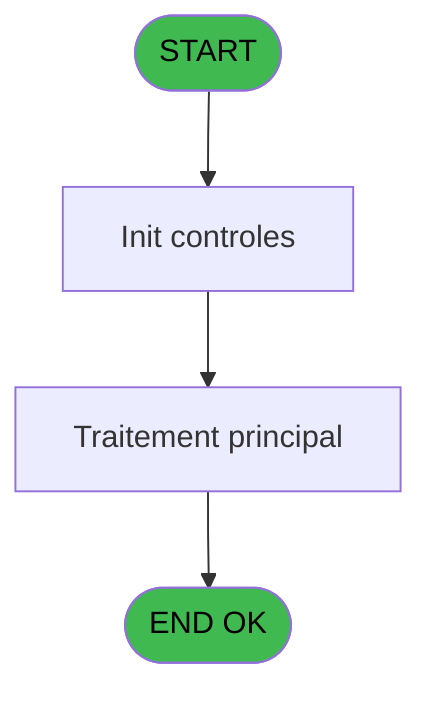
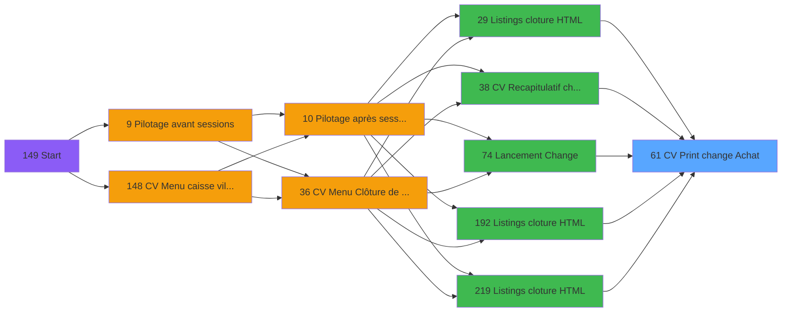

# VIL IDE 61 - CV  Print change Achat

> **Analyse**: Phases 1-4 2026-02-03 09:01 -> 09:02 (21s) | Assemblage 09:02
> **Pipeline**: V7.2 Enrichi
> **Structure**: 4 onglets (Resume | Ecrans | Donnees | Connexions)

<!-- TAB:Resume -->

## 1. FICHE D'IDENTITE

| Attribut | Valeur |
|----------|--------|
| Projet | VIL |
| IDE Position | 61 |
| Nom Programme | CV  Print change Achat |
| Fichier source | `Prg_61.xml` |
| Domaine metier | Change |
| Taches | 3 (1 ecrans visibles) |
| Tables modifiees | 0 |
| Programmes appeles | 1 |

## 2. DESCRIPTION FONCTIONNELLE

**CV  Print change Achat** assure la gestion complete de ce processus, accessible depuis [    Listings cloture HTML (IDE 29)](VIL-IDE-29.md), [CV  Recapitulatif change (IDE 38)](VIL-IDE-38.md), [Lancement Change (IDE 74)](VIL-IDE-74.md), [    Listings cloture HTML (IDE 192)](VIL-IDE-192.md), [    Listings cloture HTML (IDE 219)](VIL-IDE-219.md).

Le flux de traitement s'organise en **1 blocs fonctionnels** :

- **Traitement** (3 taches) : traitements metier divers

**Logique metier** : 2 regles identifiees couvrant conditions metier.

## 3. BLOCS FONCTIONNELS

### 3.1 Traitement (3 taches)

Traitements internes.

---

#### 61 - Veuillez patienter .... [[ECRAN]](#ecran-t1)

**Role** : Traitement : Veuillez patienter .....
**Ecran** : 422 x 56 DLU (MDI) | [Voir mockup](#ecran-t1)

---

#### 61.1 - Recup nom de GMR

**Role** : Consultation/chargement : Recup nom de GMR.

---

#### 61.2 - Recup nom de CHE

**Role** : Consultation/chargement : Recup nom de CHE.

## 5. REGLES METIER

2 regles identifiees:

### Autres (2 regles)

#### [RM-001] Si P0 Uni/Bilateral [G]<>'B' alors ASCIIChr (ASCIIVal (MID ([AK] sinon 1,1))-66+ASCIIVal (MID ([AK],2,1))-66+ASCIIVal (MID ([AK],3,1))-66+ASCIIVal (MID ([AK],4,1))-66),ASCIIChr (ASCIIVal ('A')-54+[AJ]*10+ASCIIVal (MID ([AK],1,1))+ASCIIVal (MID ([AK],2,1))+ASCIIVal (MID ([AK],3,1))+ASCIIVal (MID ([AK],4,1))-265+IF ([AK]='TRVL',100,0)))

| Element | Detail |
|---------|--------|
| **Condition** | `P0 Uni/Bilateral [G]<>'B'` |
| **Si vrai** | ASCIIChr (ASCIIVal (MID ([AK] |
| **Si faux** | 1,1))-66+ASCIIVal (MID ([AK],2,1))-66+ASCIIVal (MID ([AK],3,1))-66+ASCIIVal (MID ([AK],4,1))-66),ASCIIChr (ASCIIVal ('A')-54+[AJ]*10+ASCIIVal (MID ([AK],1,1))+ASCIIVal (MID ([AK],2,1))+ASCIIVal (MID ([AK],3,1))+ASCIIVal (MID ([AK],4,1))-265+IF ([AK]='TRVL',100,0))) |
| **Variables** | G (P0 Uni/Bilateral) |
| **Expression source** | Expression 20 : `IF (P0 Uni/Bilateral [G]<>'B',ASCIIChr (ASCIIVal (MID ([AK],` |
| **Exemple** | Si P0 Uni/Bilateral [G]<>'B' → ASCIIChr (ASCIIVal (MID ([AK] |

#### [RM-002] Si [AT]='O' alors 'V' sinon '')

| Element | Detail |
|---------|--------|
| **Condition** | `[AT]='O'` |
| **Si vrai** | 'V' |
| **Si faux** | '') |
| **Expression source** | Expression 35 : `IF ([AT]='O','V','')` |
| **Exemple** | Si [AT]='O' → 'V'. Sinon → '') |

## 6. CONTEXTE

- **Appele par**: [    Listings cloture HTML (IDE 29)](VIL-IDE-29.md), [CV  Recapitulatif change (IDE 38)](VIL-IDE-38.md), [Lancement Change (IDE 74)](VIL-IDE-74.md), [    Listings cloture HTML (IDE 192)](VIL-IDE-192.md), [    Listings cloture HTML (IDE 219)](VIL-IDE-219.md)
- **Appelle**: 1 programmes | **Tables**: 6 (W:0 R:3 L:3) | **Taches**: 3 | **Expressions**: 39

<!-- TAB:Ecrans -->

## 8. ECRANS

### 8.1 Forms visibles (1 / 3)

| # | Position | Tache | Nom | Type | Largeur | Hauteur | Bloc |
|---|----------|-------|-----|------|---------|---------|------|
| 1 | 61 | 61 | Veuillez patienter .... | MDI | 422 | 56 | Traitement |

### 8.2 Mockups Ecrans

---

#### 61 - Veuillez patienter ....
**Tache** : [61](#t1) | **Type** : MDI | **Dimensions** : 422 x 56 DLU
**Bloc** : Traitement | **Titre IDE** : Veuillez patienter ....

<!-- FORM-DATA:
{
    "width":  422,
    "vFactor":  8,
    "type":  "MDI",
    "hFactor":  8,
    "controls":  [
                     {
                         "x":  0,
                         "type":  "label",
                         "var":  "",
                         "y":  0,
                         "w":  423,
                         "fmt":  "",
                         "name":  "",
                         "h":  29,
                         "color":  "",
                         "text":  "",
                         "parent":  null
                     },
                     {
                         "x":  117,
                         "type":  "label",
                         "var":  "",
                         "y":  10,
                         "w":  275,
                         "fmt":  "",
                         "name":  "",
                         "h":  8,
                         "color":  "7",
                         "text":  "Impression en cours",
                         "parent":  null
                     },
                     {
                         "x":  0,
                         "type":  "label",
                         "var":  "",
                         "y":  29,
                         "w":  423,
                         "fmt":  "",
                         "name":  "",
                         "h":  27,
                         "color":  "",
                         "text":  "",
                         "parent":  null
                     },
                     {
                         "x":  38,
                         "type":  "label",
                         "var":  "",
                         "y":  39,
                         "w":  347,
                         "fmt":  "",
                         "name":  "",
                         "h":  8,
                         "color":  "",
                         "text":  "Impression change achat",
                         "parent":  null
                     },
                     {
                         "x":  1,
                         "type":  "image",
                         "var":  "",
                         "y":  2,
                         "w":  72,
                         "fmt":  "",
                         "name":  "",
                         "h":  25,
                         "color":  "",
                         "text":  "",
                         "parent":  null
                     }
                 ],
    "taskId":  "61",
    "height":  56
}
-->

## 9. NAVIGATION

Ecran unique: **Veuillez patienter ....**

### 9.3 Structure hierarchique (3 taches)

| Position | Tache | Type | Dimensions | Bloc |
|----------|-------|------|------------|------|
| **61.1** | [**Veuillez patienter ....** (61)](#t1) [mockup](#ecran-t1) | MDI | 422x56 | Traitement |
| 61.1.1 | [Recup nom de GMR (61.1)](#t2) | MDI | - | |
| 61.1.2 | [Recup nom de CHE (61.2)](#t3) | MDI | - | |

### 9.4 Algorigramme

> **Legende**: Vert = START/END OK | Rouge = END KO | Bleu = Decisions
> *Algorigramme auto-genere. Utiliser `/algorigramme` pour une synthese metier detaillee.*

<!-- TAB:Donnees -->

## 10. TABLES

### Tables utilisees (6)

| ID | Nom | Description | Type | R | W | L | Usages |
|----|-----|-------------|------|---|---|---|--------|
| 30 | gm-recherche_____gmr | Index de recherche | DB | R |   |   | 1 |
| 44 | change___________chg |  | DB | R |   |   | 1 |
| 45 | change_exterieur_che |  | DB | R |   |   | 1 |
| 324 | frais_change___fchg |  | DB |   |   | L | 1 |
| 474 | comptage_caisse_devise | Sessions de caisse | TMP |   |   | L | 1 |
| 713 | table_articles_caution | Articles et stock | DB |   |   | L | 1 |

### Colonnes par table (4 / 3 tables avec colonnes identifiees)

Table 30 - gm-recherche_____gmr (R) - 1 usages

*Table utilisee uniquement en Link ou aucune colonne Real identifiee dans le DataView.*

Table 44 - change___________chg (R) - 1 usages

| Lettre | Variable | Acces | Type |
|--------|----------|-------|------|
| A | P0 societe | R | Alpha |
| B | P0 masque cumul | R | Alpha |
| C | P0 date comptable | R | Date |
| D | W0 top exec listing | R | Alpha |
| E | P0 nbre decimales | R | Numeric |
| F | P0 nom village | R | Alpha |
| G | P0 Uni/Bilateral | R | Alpha |
| H | P0 devise local | R | Alpha |
| I | P0 Edition HTML | R | Logical |
| J | W0 config imp | R | Alpha |
| K | W0 date listing | R | Date |
| L | W0 heure listing | R | Time |
| M | W0 total quantite | R | Numeric |
| N | W0 total montant | R | Numeric |
| O | W0 montant | R | Numeric |
| P | W0 nom | R | Alpha |
| Q | W0 prenom | R | Alpha |
| R | W0 montant general | R | Numeric |
| S | W0 montant frais MOP | R | Numeric |
| T | W0 montant frais general | R | Numeric |
| U | W0 codrt devise in | R | Logical |
| V | W0 ascci mode paiement | R | Alpha |

Table 45 - change_exterieur_che (R) - 1 usages

*Table utilisee uniquement en Link ou aucune colonne Real identifiee dans le DataView.*

## 11. VARIABLES

### 11.1 Parametres entrants (8)

Variables recues du programme appelant ([    Listings cloture HTML (IDE 29)](VIL-IDE-29.md)).

| Lettre | Nom | Type | Usage dans |
|--------|-----|------|-----------|
| A | P0 societe | Alpha | 1x parametre entrant |
| B | P0 masque cumul | Alpha | 1x parametre entrant |
| C | P0 date comptable | Date | 2x parametre entrant |
| E | P0 nbre decimales | Numeric | 1x parametre entrant |
| F | P0 nom village | Alpha | - |
| G | P0 Uni/Bilateral | Alpha | 2x parametre entrant |
| H | P0 devise local | Alpha | - |
| I | P0 Edition HTML | Logical | 2x parametre entrant |

### 11.2 Variables de travail (14)

Variables internes au programme.

| Lettre | Nom | Type | Usage dans |
|--------|-----|------|-----------|
| D | W0 top exec listing | Alpha | - |
| J | W0 config imp | Alpha | - |
| K | W0 date listing | Date | - |
| L | W0 heure listing | Time | 1x calcul interne |
| M | W0 total quantite | Numeric | 1x calcul interne |
| N | W0 total montant | Numeric | 1x calcul interne |
| O | W0 montant | Numeric | 4x calcul interne |
| P | W0 nom | Alpha | - |
| Q | W0 prenom | Alpha | - |
| R | W0 montant general | Numeric | 1x calcul interne |
| S | W0 montant frais MOP | Numeric | 1x calcul interne |
| T | W0 montant frais general | Numeric | 1x calcul interne |
| U | W0 codrt devise in | Logical | - |
| V | W0 ascci mode paiement | Alpha | - |

Toutes les 22 variables (liste complete)

| Cat | Lettre | Nom Variable | Type |
|-----|--------|--------------|------|
| P0 | **A** | P0 societe | Alpha |
| P0 | **B** | P0 masque cumul | Alpha |
| P0 | **C** | P0 date comptable | Date |
| P0 | **E** | P0 nbre decimales | Numeric |
| P0 | **F** | P0 nom village | Alpha |
| P0 | **G** | P0 Uni/Bilateral | Alpha |
| P0 | **H** | P0 devise local | Alpha |
| P0 | **I** | P0 Edition HTML | Logical |
| W0 | **D** | W0 top exec listing | Alpha |
| W0 | **J** | W0 config imp | Alpha |
| W0 | **K** | W0 date listing | Date |
| W0 | **L** | W0 heure listing | Time |
| W0 | **M** | W0 total quantite | Numeric |
| W0 | **N** | W0 total montant | Numeric |
| W0 | **O** | W0 montant | Numeric |
| W0 | **P** | W0 nom | Alpha |
| W0 | **Q** | W0 prenom | Alpha |
| W0 | **R** | W0 montant general | Numeric |
| W0 | **S** | W0 montant frais MOP | Numeric |
| W0 | **T** | W0 montant frais general | Numeric |
| W0 | **U** | W0 codrt devise in | Logical |
| W0 | **V** | W0 ascci mode paiement | Alpha |

## 12. EXPRESSIONS

**39 / 39 expressions decodees (100%)**

### 12.1 Repartition par type

| Type | Expressions | Regles |
|------|-------------|--------|
| CALCULATION | 7 | 0 |
| CONCATENATION | 2 | 0 |
| CONDITION | 8 | 2 |
| CONSTANTE | 3 | 0 |
| DATE | 1 | 0 |
| OTHER | 15 | 0 |
| CAST_LOGIQUE | 2 | 0 |
| STRING | 1 | 0 |

### 12.2 Expressions cles par type

#### CALCULATION (7 expressions)

| Type | IDE | Expression | Regle |
|------|-----|------------|-------|
| CALCULATION | 27 | `W0 montant frais general [T]-[AS]` | - |
| CALCULATION | 28 | `W0 montant frais MOP [S]-[AS]` | - |
| CALCULATION | 30 | `- ([AS])` | - |
| CALCULATION | 21 | `Fix ([AE]*[AF],11,P0 nbre decimales [E])` | - |
| CALCULATION | 10 | `W0 total quantite [M]+[AE]` | - |
| ... | | *+2 autres* | |

#### CONCATENATION (2 expressions)

| Type | IDE | Expression | Regle |
|------|-----|------------|-------|
| CONCATENATION | 31 | `Trim (INIGet ('[MAGIC_LOGICAL_NAMES]club_exportdata')&'Cloture\Editions\Change'&IF (P0 Edition HTML [I],'_'&DStr (P0 date comptable [C],'YYYYMMDD'),'')&'.htm')` | - |
| CONCATENATION | 18 | `'- '&Str (Page (0,1),'3P0Z0')&' -'` | - |

#### CONDITION (8 expressions)

| Type | IDE | Expression | Regle |
|------|-----|------------|-------|
| CONDITION | 35 | `IF ([AT]='O','V','')` | [RM-002](#rm-RM-002) |
| CONDITION | 20 | `IF (P0 Uni/Bilateral [G]<>'B',ASCIIChr (ASCIIVal (MID ([AK],1,1))-66+ASCIIVal (MID ([AK],2,1))-66+ASCIIVal (MID ([AK],3,1))-66+ASCIIVal (MID ([AK],4,1))-66),ASCIIChr (ASCIIVal ('A')-54+[AJ]*10+ASCIIVal (MID ([AK],1,1))+ASCIIVal (MID ([AK],2,1))+ASCIIVal (MID ([AK],3,1))+ASCIIVal (MID ([AK],4,1))-265+IF ([AK]='TRVL',100,0)))` | [RM-001](#rm-RM-001) |
| CONDITION | 17 | `INIGet ('[MAGIC_LOGICAL_NAMES]preview')='O'` | - |
| CONDITION | 22 | `GetParam ('DEVISELOCAL_IN')='O'` | - |
| CONDITION | 29 | `[AT]='O'` | - |
| ... | | *+3 autres* | |

#### CONSTANTE (3 expressions)

| Type | IDE | Expression | Regle |
|------|-----|------------|-------|
| CONSTANTE | 34 | `''` | - |
| CONSTANTE | 15 | `'O'` | - |
| CONSTANTE | 8 | `0` | - |

#### DATE (1 expressions)

| Type | IDE | Expression | Regle |
|------|-----|------------|-------|
| DATE | 5 | `Date ()` | - |

#### OTHER (15 expressions)

| Type | IDE | Expression | Regle |
|------|-----|------------|-------|
| OTHER | 25 | `[AM]` | - |
| OTHER | 24 | `[AC]` | - |
| OTHER | 23 | `[Z]` | - |
| OTHER | 26 | `[AN]` | - |
| OTHER | 39 | `MlsTrans('Frais Change')` | - |
| ... | | *+10 autres* | |

#### CAST_LOGIQUE (2 expressions)

| Type | IDE | Expression | Regle |
|------|-----|------------|-------|
| CAST_LOGIQUE | 36 | `'FALSE'LOG` | - |
| CAST_LOGIQUE | 33 | `'TRUE'LOG` | - |

#### STRING (1 expressions)

| Type | IDE | Expression | Regle |
|------|-----|------------|-------|
| STRING | 37 | `'Total journee ............................................ '&Str (W0 heure listing [L],'N###########Z')` | - |

### 12.3 Toutes les expressions (39)

Voir les 39 expressions

#### CALCULATION (7)

| IDE | Expression Decodee |
|-----|-------------------|
| 10 | `W0 total quantite [M]+[AE]` |
| 11 | `W0 total montant [N]+W0 montant [O]` |
| 12 | `W0 montant general [R]+W0 montant [O]` |
| 21 | `Fix ([AE]*[AF],11,P0 nbre decimales [E])` |
| 27 | `W0 montant frais general [T]-[AS]` |
| 28 | `W0 montant frais MOP [S]-[AS]` |
| 30 | `- ([AS])` |

#### CONCATENATION (2)

| IDE | Expression Decodee |
|-----|-------------------|
| 18 | `'- '&Str (Page (0,1),'3P0Z0')&' -'` |
| 31 | `Trim (INIGet ('[MAGIC_LOGICAL_NAMES]club_exportdata')&'Cloture\Editions\Change'&IF (P0 Edition HTML [I],'_'&DStr (P0 date comptable [C],'YYYYMMDD'),'')&'.htm')` |

#### CONDITION (8)

| IDE | Expression Decodee |
|-----|-------------------|
| 20 | `IF (P0 Uni/Bilateral [G]<>'B',ASCIIChr (ASCIIVal (MID ([AK],1,1))-66+ASCIIVal (MID ([AK],2,1))-66+ASCIIVal (MID ([AK],3,1))-66+ASCIIVal (MID ([AK],4,1))-66),ASCIIChr (ASCIIVal ('A')-54+[AJ]*10+ASCIIVal (MID ([AK],1,1))+ASCIIVal (MID ([AK],2,1))+ASCIIVal (MID ([AK],3,1))+ASCIIVal (MID ([AK],4,1))-265+IF ([AK]='TRVL',100,0)))` |
| 35 | `IF ([AT]='O','V','')` |
| 13 | `[AA]='O'` |
| 14 | `[AA]='N'` |
| 16 | `P0 Uni/Bilateral [G]<>'B'` |
| 17 | `INIGet ('[MAGIC_LOGICAL_NAMES]preview')='O'` |
| 22 | `GetParam ('DEVISELOCAL_IN')='O'` |
| 29 | `[AT]='O'` |

#### CONSTANTE (3)

| IDE | Expression Decodee |
|-----|-------------------|
| 8 | `0` |
| 15 | `'O'` |
| 34 | `''` |

#### DATE (1)

| IDE | Expression Decodee |
|-----|-------------------|
| 5 | `Date ()` |

#### OTHER (15)

| IDE | Expression Decodee |
|-----|-------------------|
| 1 | `GetParam ('DTCLOSURE')` |
| 2 | `SetCrsr (1)` |
| 3 | `SetCrsr (2)` |
| 4 | `P0 societe [A]` |
| 6 | `Time ()` |
| 7 | `P0 masque cumul [B]` |
| 9 | `P0 date comptable [C]` |
| 19 | `[W]` |
| 23 | `[Z]` |
| 24 | `[AC]` |
| 25 | `[AM]` |
| 26 | `[AN]` |
| 32 | `P0 Edition HTML [I]` |
| 38 | `'L''ACHAT'` |
| 39 | `MlsTrans('Frais Change')` |

#### CAST_LOGIQUE (2)

| IDE | Expression Decodee |
|-----|-------------------|
| 33 | `'TRUE'LOG` |
| 36 | `'FALSE'LOG` |

#### STRING (1)

| IDE | Expression Decodee |
|-----|-------------------|
| 37 | `'Total journee ............................................ '&Str (W0 heure listing [L],'N###########Z')` |

<!-- TAB:Connexions -->

## 13. GRAPHE D'APPELS

### 13.1 Chaine depuis Main (Callers)

Main -> ... -> [    Listings cloture HTML (IDE 29)](VIL-IDE-29.md) -> **CV  Print change Achat (IDE 61)**

Main -> ... -> [CV  Recapitulatif change (IDE 38)](VIL-IDE-38.md) -> **CV  Print change Achat (IDE 61)**

Main -> ... -> [Lancement Change (IDE 74)](VIL-IDE-74.md) -> **CV  Print change Achat (IDE 61)**

Main -> ... -> [    Listings cloture HTML (IDE 192)](VIL-IDE-192.md) -> **CV  Print change Achat (IDE 61)**

Main -> ... -> [    Listings cloture HTML (IDE 219)](VIL-IDE-219.md) -> **CV  Print change Achat (IDE 61)**

### 13.2 Callers

| IDE | Nom Programme | Nb Appels |
|-----|---------------|-----------|
| [29](VIL-IDE-29.md) |     Listings cloture HTML | 1 |
| [38](VIL-IDE-38.md) | CV  Recapitulatif change | 1 |
| [74](VIL-IDE-74.md) | Lancement Change | 1 |
| [192](VIL-IDE-192.md) |     Listings cloture HTML | 1 |
| [219](VIL-IDE-219.md) |     Listings cloture HTML | 1 |

### 13.3 Callees (programmes appeles)

### 13.4 Detail Callees avec contexte

| IDE | Nom Programme | Appels | Contexte |
|-----|---------------|--------|----------|
| [62](VIL-IDE-62.md) |   Controle type devise Achat | 1 | Controle/validation |

## 14. RECOMMANDATIONS MIGRATION

### 14.1 Profil du programme

| Metrique | Valeur | Impact migration |
|----------|--------|-----------------|
| Lignes de logique | 115 | Programme compact |
| Expressions | 39 | Peu de logique |
| Tables WRITE | 0 | Impact faible |
| Sous-programmes | 1 | Peu de dependances |
| Ecrans visibles | 1 | Ecran unique ou traitement batch |
| Code desactive | 0% (0 / 115) | Code sain |
| Regles metier | 2 | Quelques regles a preserver |

### 14.2 Plan de migration par bloc

#### Traitement (3 taches: 1 ecran, 2 traitements)

- **Strategie** : Orchestrateur avec 1 ecrans (Razor/React) et 2 traitements backend (services).
- Les ecrans deviennent des composants UI, les traitements invisibles deviennent des services injectables.
- 1 sous-programme(s) a migrer ou a reutiliser depuis les services existants.
- Decomposer les taches en services unitaires testables.

### 14.3 Dependances critiques

| Dependance | Type | Appels | Impact |
|------------|------|--------|--------|
| [  Controle type devise Achat (IDE 62)](VIL-IDE-62.md) | Sous-programme | 1x | Normale - Controle/validation |

---
*Spec DETAILED generee par Pipeline V7.2 - 2026-02-03 09:02*
