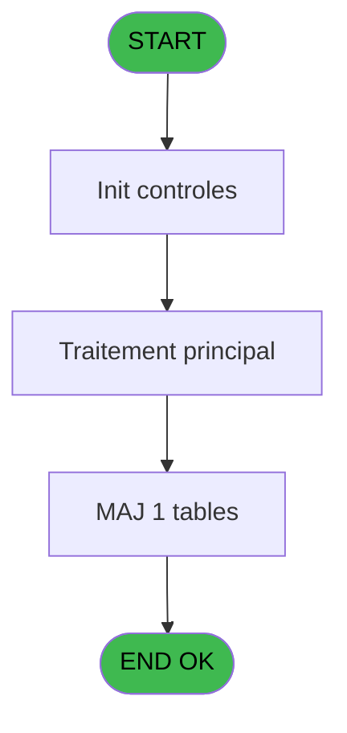
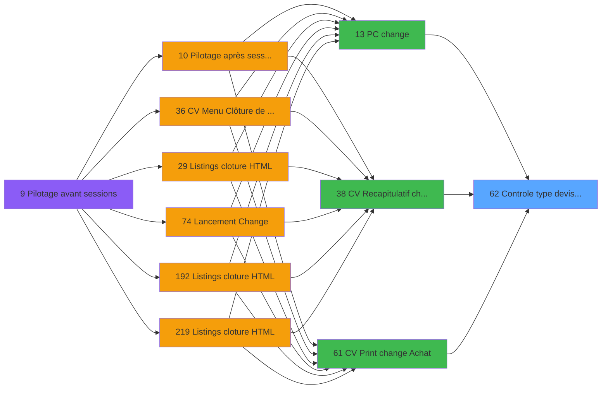

# VIL IDE 62 - Controle type devise Achat

> **Analyse**: Phases 1-4 2026-02-03 09:02 -> 09:02 (22s) | Assemblage 09:02
> **Pipeline**: V7.2 Enrichi
> **Structure**: 4 onglets (Resume | Ecrans | Donnees | Connexions)

<!-- TAB:Resume -->

## 1. FICHE D'IDENTITE

| Attribut | Valeur |
|----------|--------|
| Projet | VIL |
| IDE Position | 62 |
| Nom Programme | Controle type devise Achat |
| Fichier source | `Prg_62.xml` |
| Domaine metier | Change |
| Taches | 2 (0 ecrans visibles) |
| Tables modifiees | 1 |
| Programmes appeles | 0 |

## 2. DESCRIPTION FONCTIONNELLE

**Controle type devise Achat** assure la gestion complete de ce processus, accessible depuis [    PC change (IDE 13)](VIL-IDE-13.md), [CV  Recapitulatif change (IDE 38)](VIL-IDE-38.md), [CV  Print change Achat (IDE 61)](VIL-IDE-61.md).

Le flux de traitement s'organise en **2 blocs fonctionnels** :

- **Calcul** (1 tache) : calculs de montants, stocks ou compteurs
- **Validation** (1 tache) : controles et verifications de coherence

**Donnees modifiees** : 1 tables en ecriture (comptage_caisse_devise).

Detail : phases du traitement

#### Phase 1 : Validation (1 tache)

- **62** - Controle type devise Achat

#### Phase 2 : Calcul (1 tache)

- **62.1** - Calcul

#### Tables impactees

| Table | Operations | Role metier |
|-------|-----------|-------------|
| comptage_caisse_devise | **W**/L (2 usages) | Sessions de caisse |

## 3. BLOCS FONCTIONNELS

### 3.1 Validation (1 tache)

Controles de coherence : 1 tache verifie les donnees et conditions.

---

#### 62 - Controle type devise Achat

**Role** : Verification : Controle type devise Achat.

### 3.2 Calcul (1 tache)

Calculs metier : montants, stocks, compteurs.

---

#### 62.1 - Calcul

**Role** : Calcul : Calcul.

## 5. REGLES METIER

*(Aucune regle metier identifiee)*

## 6. CONTEXTE

- **Appele par**: [    PC change (IDE 13)](VIL-IDE-13.md), [CV  Recapitulatif change (IDE 38)](VIL-IDE-38.md), [CV  Print change Achat (IDE 61)](VIL-IDE-61.md)
- **Appelle**: 0 programmes | **Tables**: 2 (W:1 R:1 L:1) | **Taches**: 2 | **Expressions**: 6

<!-- TAB:Ecrans -->

## 8. ECRANS

*(Programme sans ecran visible)*

## 9. NAVIGATION

### 9.3 Structure hierarchique (2 taches)

| Position | Tache | Type | Dimensions | Bloc |
|----------|-------|------|------------|------|
| **62.1** | [**Controle type devise Achat** (62)](#t1) | MDI | - | Validation |
| **62.2** | [**Calcul** (62.1)](#t2) | MDI | - | Calcul |

### 9.4 Algorigramme

> **Legende**: Vert = START/END OK | Rouge = END KO | Bleu = Decisions
> *Algorigramme auto-genere. Utiliser `/algorigramme` pour une synthese metier detaillee.*

<!-- TAB:Donnees -->

## 10. TABLES

### Tables utilisees (2)

| ID | Nom | Description | Type | R | W | L | Usages |
|----|-----|-------------|------|---|---|---|--------|
| 44 | change___________chg |  | DB | R |   |   | 1 |
| 474 | comptage_caisse_devise | Sessions de caisse | TMP |   | **W** | L | 2 |

### Colonnes par table (0 / 2 tables avec colonnes identifiees)

Table 44 - change___________chg (R) - 1 usages

*Table utilisee uniquement en Link ou aucune colonne Real identifiee dans le DataView.*

Table 474 - comptage_caisse_devise (**W**/L) - 2 usages

*Table utilisee uniquement en Link ou aucune colonne Real identifiee dans le DataView.*

## 11. VARIABLES

*(Programme sans variables locales mappees)*

## 12. EXPRESSIONS

**6 / 6 expressions decodees (100%)**

### 12.1 Repartition par type

| Type | Expressions | Regles |
|------|-------------|--------|
| CONSTANTE | 1 | 0 |
| CONDITION | 2 | 0 |
| OTHER | 3 | 0 |

### 12.2 Expressions cles par type

#### CONSTANTE (1 expressions)

| Type | IDE | Expression | Regle |
|------|-----|------------|-------|
| CONSTANTE | 5 | `'A'` | - |

#### CONDITION (2 expressions)

| Type | IDE | Expression | Regle |
|------|-----|------------|-------|
| CONDITION | 6 | `[H]=0` | - |
| CONDITION | 1 | `> Societe [A]` | - |

#### OTHER (3 expressions)

| Type | IDE | Expression | Regle |
|------|-----|------------|-------|
| OTHER | 4 | `[E]` | - |
| OTHER | 3 | `[D]` | - |
| OTHER | 2 | `[B]` | - |

<!-- TAB:Connexions -->

## 13. GRAPHE D'APPELS

### 13.1 Chaine depuis Main (Callers)

Main -> ... -> [    PC change (IDE 13)](VIL-IDE-13.md) -> **Controle type devise Achat (IDE 62)**

Main -> ... -> [CV  Recapitulatif change (IDE 38)](VIL-IDE-38.md) -> **Controle type devise Achat (IDE 62)**

Main -> ... -> [CV  Print change Achat (IDE 61)](VIL-IDE-61.md) -> **Controle type devise Achat (IDE 62)**

### 13.2 Callers

| IDE | Nom Programme | Nb Appels |
|-----|---------------|-----------|
| [13](VIL-IDE-13.md) |     PC change | 1 |
| [38](VIL-IDE-38.md) | CV  Recapitulatif change | 1 |
| [61](VIL-IDE-61.md) | CV  Print change Achat | 1 |

### 13.3 Callees (programmes appeles)

### 13.4 Detail Callees avec contexte

| IDE | Nom Programme | Appels | Contexte |
|-----|---------------|--------|----------|
| - | (aucun) | - | - |

## 14. RECOMMANDATIONS MIGRATION

### 14.1 Profil du programme

| Metrique | Valeur | Impact migration |
|----------|--------|-----------------|
| Lignes de logique | 30 | Programme compact |
| Expressions | 6 | Peu de logique |
| Tables WRITE | 1 | Impact faible |
| Sous-programmes | 0 | Peu de dependances |
| Ecrans visibles | 0 | Ecran unique ou traitement batch |
| Code desactive | 0% (0 / 30) | Code sain |
| Regles metier | 0 | Pas de regle identifiee |

### 14.2 Plan de migration par bloc

#### Validation (1 tache: 0 ecran, 1 traitement)

- **Strategie** : FluentValidation avec validators specifiques.
- Chaque tache de validation -> un validator injectable

#### Calcul (1 tache: 0 ecran, 1 traitement)

- **Strategie** : Services de calcul purs (Domain Services).
- Migrer la logique de calcul (stock, compteurs, montants)

### 14.3 Dependances critiques

| Dependance | Type | Appels | Impact |
|------------|------|--------|--------|
| comptage_caisse_devise | Table WRITE (Temp) | 1x | Schema + repository |

---
*Spec DETAILED generee par Pipeline V7.2 - 2026-02-03 09:02*
