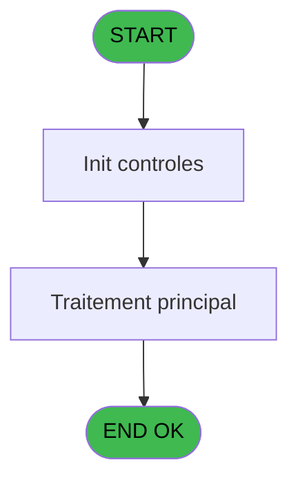
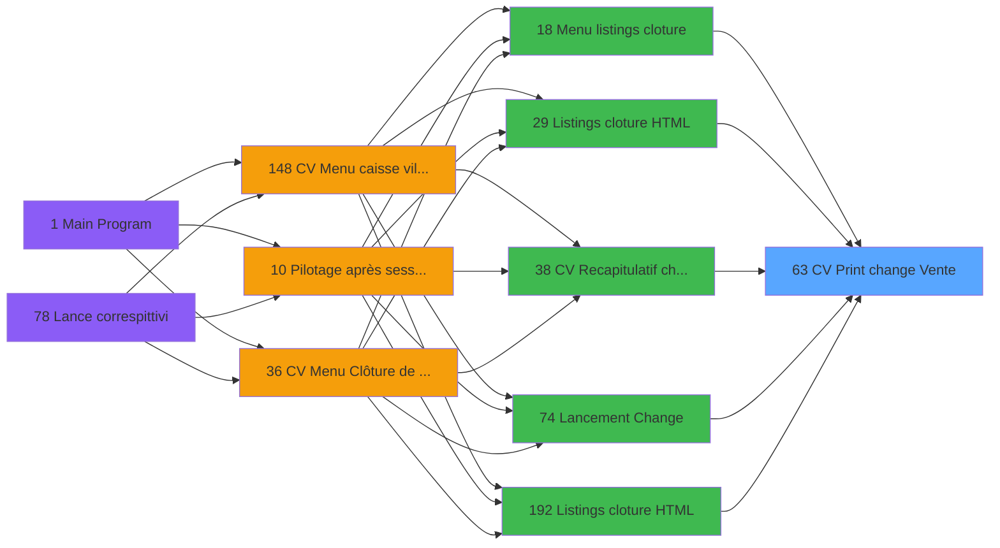
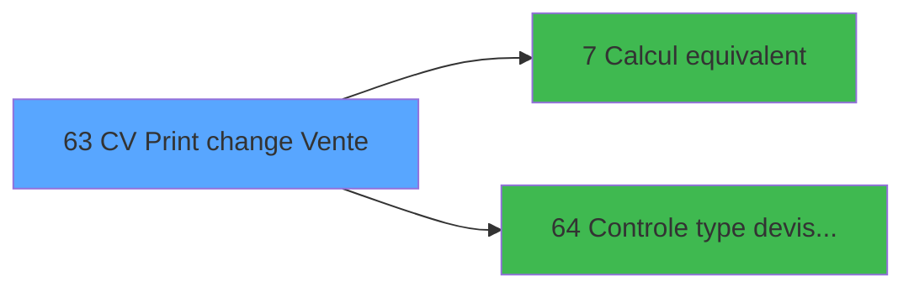

# VIL IDE 63 - CV  Print change Vente

> **Analyse**: Phases 1-4 2026-02-03 09:03 -> 09:03 (21s) | Assemblage 09:03
> **Pipeline**: V7.2 Enrichi
> **Structure**: 4 onglets (Resume | Ecrans | Donnees | Connexions)

<!-- TAB:Resume -->

## 1. FICHE D'IDENTITE

| Attribut | Valeur |
|----------|--------|
| Projet | VIL |
| IDE Position | 63 |
| Nom Programme | CV  Print change Vente |
| Fichier source | `Prg_63.xml` |
| Domaine metier | Ventes |
| Taches | 3 (1 ecrans visibles) |
| Tables modifiees | 0 |
| Programmes appeles | 2 |

## 2. DESCRIPTION FONCTIONNELLE

**CV  Print change Vente** assure la gestion complete de ce processus, accessible depuis [Menu listings cloture (IDE 18)](VIL-IDE-18.md), [    Listings cloture HTML (IDE 29)](VIL-IDE-29.md), [CV  Recapitulatif change (IDE 38)](VIL-IDE-38.md), [Lancement Change (IDE 74)](VIL-IDE-74.md), [    Listings cloture HTML (IDE 192)](VIL-IDE-192.md), [    Listings cloture HTML (IDE 219)](VIL-IDE-219.md).

Le flux de traitement s'organise en **1 blocs fonctionnels** :

- **Traitement** (3 taches) : traitements metier divers

## 3. BLOCS FONCTIONNELS

### 3.1 Traitement (3 taches)

Traitements internes.

---

#### 63 - Veuillez patienter ..... [[ECRAN]](#ecran-t1)

**Role** : Traitement : Veuillez patienter ......
**Ecran** : 422 x 57 DLU (MDI) | [Voir mockup](#ecran-t1)

---

#### 63.1 - Recup nom de GMR

**Role** : Consultation/chargement : Recup nom de GMR.

---

#### 63.2 - Recup nom de CHE

**Role** : Consultation/chargement : Recup nom de CHE.

## 5. REGLES METIER

*(Aucune regle metier identifiee)*

## 6. CONTEXTE

- **Appele par**: [Menu listings cloture (IDE 18)](VIL-IDE-18.md), [    Listings cloture HTML (IDE 29)](VIL-IDE-29.md), [CV  Recapitulatif change (IDE 38)](VIL-IDE-38.md), [Lancement Change (IDE 74)](VIL-IDE-74.md), [    Listings cloture HTML (IDE 192)](VIL-IDE-192.md), [    Listings cloture HTML (IDE 219)](VIL-IDE-219.md)
- **Appelle**: 2 programmes | **Tables**: 3 (W:0 R:3 L:0) | **Taches**: 3 | **Expressions**: 31

<!-- TAB:Ecrans -->

## 8. ECRANS

### 8.1 Forms visibles (1 / 3)

| # | Position | Tache | Nom | Type | Largeur | Hauteur | Bloc |
|---|----------|-------|-----|------|---------|---------|------|
| 1 | 63 | 63 | Veuillez patienter ..... | MDI | 422 | 57 | Traitement |

### 8.2 Mockups Ecrans

---

#### 63 - Veuillez patienter .....
**Tache** : [63](#t1) | **Type** : MDI | **Dimensions** : 422 x 57 DLU
**Bloc** : Traitement | **Titre IDE** : Veuillez patienter .....

<!-- FORM-DATA:
{
    "width":  422,
    "vFactor":  8,
    "type":  "MDI",
    "hFactor":  8,
    "controls":  [
                     {
                         "x":  0,
                         "type":  "label",
                         "var":  "",
                         "y":  0,
                         "w":  423,
                         "fmt":  "",
                         "name":  "",
                         "h":  29,
                         "color":  "",
                         "text":  "",
                         "parent":  null
                     },
                     {
                         "x":  117,
                         "type":  "label",
                         "var":  "",
                         "y":  10,
                         "w":  275,
                         "fmt":  "",
                         "name":  "",
                         "h":  8,
                         "color":  "7",
                         "text":  "Impression en cours",
                         "parent":  null
                     },
                     {
                         "x":  0,
                         "type":  "label",
                         "var":  "",
                         "y":  29,
                         "w":  423,
                         "fmt":  "",
                         "name":  "",
                         "h":  27,
                         "color":  "",
                         "text":  "",
                         "parent":  null
                     },
                     {
                         "x":  72,
                         "type":  "label",
                         "var":  "",
                         "y":  39,
                         "w":  254,
                         "fmt":  "",
                         "name":  "",
                         "h":  8,
                         "color":  "",
                         "text":  "Impression change vente",
                         "parent":  null
                     },
                     {
                         "x":  1,
                         "type":  "image",
                         "var":  "",
                         "y":  2,
                         "w":  72,
                         "fmt":  "",
                         "name":  "",
                         "h":  25,
                         "color":  "",
                         "text":  "",
                         "parent":  null
                     }
                 ],
    "taskId":  "63",
    "height":  57
}
-->

## 9. NAVIGATION

Ecran unique: **Veuillez patienter .....**

### 9.3 Structure hierarchique (3 taches)

| Position | Tache | Type | Dimensions | Bloc |
|----------|-------|------|------------|------|
| **63.1** | [**Veuillez patienter .....** (63)](#t1) [mockup](#ecran-t1) | MDI | 422x57 | Traitement |
| 63.1.1 | [Recup nom de GMR (63.1)](#t2) | MDI | - | |
| 63.1.2 | [Recup nom de CHE (63.2)](#t3) | MDI | - | |

### 9.4 Algorigramme

> **Legende**: Vert = START/END OK | Rouge = END KO | Bleu = Decisions
> *Algorigramme auto-genere. Utiliser `/algorigramme` pour une synthese metier detaillee.*

<!-- TAB:Donnees -->

## 10. TABLES

### Tables utilisees (3)

| ID | Nom | Description | Type | R | W | L | Usages |
|----|-----|-------------|------|---|---|---|--------|
| 30 | gm-recherche_____gmr | Index de recherche | DB | R |   |   | 1 |
| 45 | change_exterieur_che |  | DB | R |   |   | 1 |
| 147 | change_vente_____chg | Donnees de ventes | DB | R |   |   | 1 |

### Colonnes par table (1 / 3 tables avec colonnes identifiees)

Table 30 - gm-recherche_____gmr (R) - 1 usages

*Table utilisee uniquement en Link ou aucune colonne Real identifiee dans le DataView.*

Table 45 - change_exterieur_che (R) - 1 usages

*Table utilisee uniquement en Link ou aucune colonne Real identifiee dans le DataView.*

Table 147 - change_vente_____chg (R) - 1 usages

| Lettre | Variable | Acces | Type |
|--------|----------|-------|------|
| A | P0 societe | R | Alpha |
| B | P0 masque cumul | R | Alpha |
| C | P0 date comptable | R | Date |
| D | P0 top exec listing | R | Alpha |
| E | P0 nbre decimales | R | Numeric |
| F | P0 nom village | R | Alpha |
| G | P0 Uni/Bilateral | R | Alpha |
| H | P0 devise locale | R | Alpha |
| I | P0 Edition HTML | R | Logical |
| J | W0 config imp | R | Alpha |
| K | W0 date listing | R | Date |
| L | W0 heure listing | R | Time |
| M | W0 total quantite | R | Numeric |
| N | W0 total montant | R | Numeric |
| O | W0 montant | R | Numeric |
| P | W0 nom | R | Alpha |
| Q | W0 prenom | R | Alpha |
| R | W0 montant general | R | Numeric |
| S | W0 equivalent | R | Numeric |
| T | W0 devise in | R | Logical |

## 11. VARIABLES

### 11.1 Parametres entrants (9)

Variables recues du programme appelant ([Menu listings cloture (IDE 18)](VIL-IDE-18.md)).

| Lettre | Nom | Type | Usage dans |
|--------|-----|------|-----------|
| A | P0 societe | Alpha | 1x parametre entrant |
| B | P0 masque cumul | Alpha | 1x parametre entrant |
| C | P0 date comptable | Date | 2x parametre entrant |
| D | P0 top exec listing | Alpha | - |
| E | P0 nbre decimales | Numeric | - |
| F | P0 nom village | Alpha | - |
| G | P0 Uni/Bilateral | Alpha | 1x parametre entrant |
| H | P0 devise locale | Alpha | 1x parametre entrant |
| I | P0 Edition HTML | Logical | - |

### 11.2 Variables de travail (11)

Variables internes au programme.

| Lettre | Nom | Type | Usage dans |
|--------|-----|------|-----------|
| J | W0 config imp | Alpha | - |
| K | W0 date listing | Date | - |
| L | W0 heure listing | Time | 1x calcul interne |
| M | W0 total quantite | Numeric | 1x calcul interne |
| N | W0 total montant | Numeric | 2x calcul interne |
| O | W0 montant | Numeric | - |
| P | W0 nom | Alpha | - |
| Q | W0 prenom | Alpha | 1x calcul interne |
| R | W0 montant general | Numeric | - |
| S | W0 equivalent | Numeric | - |
| T | W0 devise in | Logical | - |

Toutes les 20 variables (liste complete)

| Cat | Lettre | Nom Variable | Type |
|-----|--------|--------------|------|
| P0 | **A** | P0 societe | Alpha |
| P0 | **B** | P0 masque cumul | Alpha |
| P0 | **C** | P0 date comptable | Date |
| P0 | **D** | P0 top exec listing | Alpha |
| P0 | **E** | P0 nbre decimales | Numeric |
| P0 | **F** | P0 nom village | Alpha |
| P0 | **G** | P0 Uni/Bilateral | Alpha |
| P0 | **H** | P0 devise locale | Alpha |
| P0 | **I** | P0 Edition HTML | Logical |
| W0 | **J** | W0 config imp | Alpha |
| W0 | **K** | W0 date listing | Date |
| W0 | **L** | W0 heure listing | Time |
| W0 | **M** | W0 total quantite | Numeric |
| W0 | **N** | W0 total montant | Numeric |
| W0 | **O** | W0 montant | Numeric |
| W0 | **P** | W0 nom | Alpha |
| W0 | **Q** | W0 prenom | Alpha |
| W0 | **R** | W0 montant general | Numeric |
| W0 | **S** | W0 equivalent | Numeric |
| W0 | **T** | W0 devise in | Logical |

## 12. EXPRESSIONS

**31 / 31 expressions decodees (100%)**

### 12.1 Repartition par type

| Type | Expressions | Regles |
|------|-------------|--------|
| CALCULATION | 3 | 0 |
| CONCATENATION | 2 | 0 |
| CONSTANTE | 7 | 0 |
| DATE | 1 | 0 |
| OTHER | 12 | 0 |
| CONDITION | 4 | 0 |
| CAST_LOGIQUE | 2 | 0 |

### 12.2 Expressions cles par type

#### CALCULATION (3 expressions)

| Type | IDE | Expression | Regle |
|------|-----|------------|-------|
| CALCULATION | 13 | `W0 prenom [Q]+W0 total montant [N]` | - |
| CALCULATION | 12 | `W0 total quantite [M]+W0 total montant [N]` | - |
| CALCULATION | 11 | `W0 heure listing [L]+[AA]` | - |

#### CONCATENATION (2 expressions)

| Type | IDE | Expression | Regle |
|------|-----|------------|-------|
| CONCATENATION | 23 | `Translate('%club_exportdata%')&'Cloture\Editions\Change_Vente'&IF ([BM],'_'&DStr (P0 date comptable [C],'YYYYMMDD'),'')&'.htm'` | - |
| CONCATENATION | 18 | `'- '&Str (Page (0,1),'3P0Z0')&' -'` | - |

#### CONSTANTE (7 expressions)

| Type | IDE | Expression | Regle |
|------|-----|------------|-------|
| CONSTANTE | 24 | `'LA VENTE'` | - |
| CONSTANTE | 26 | `''` | - |
| CONSTANTE | 28 | `'Total journée ..........................'` | - |
| CONSTANTE | 20 | `0` | - |
| CONSTANTE | 8 | `0` | - |
| ... | | *+2 autres* | |

#### DATE (1 expressions)

| Type | IDE | Expression | Regle |
|------|-----|------------|-------|
| DATE | 5 | `Date ()` | - |

#### OTHER (12 expressions)

| Type | IDE | Expression | Regle |
|------|-----|------------|-------|
| OTHER | 21 | `P0 devise locale [H]` | - |
| OTHER | 10 | `[AE]` | - |
| OTHER | 9 | `P0 date comptable [C]` | - |
| OTHER | 31 | `MlsTrans('MOP')` | - |
| OTHER | 30 | `NOT([BM])` | - |
| ... | | *+7 autres* | |

#### CONDITION (4 expressions)

| Type | IDE | Expression | Regle |
|------|-----|------------|-------|
| CONDITION | 17 | `INIGet ('[MAGIC_LOGICAL_NAMES]preview')='O'` | - |
| CONDITION | 22 | `P0 Uni/Bilateral [G]='B'` | - |
| CONDITION | 14 | `[W]='O'` | - |
| CONDITION | 15 | `[W]='N'` | - |

#### CAST_LOGIQUE (2 expressions)

| Type | IDE | Expression | Regle |
|------|-----|------------|-------|
| CAST_LOGIQUE | 27 | `'FALSE'LOG` | - |
| CAST_LOGIQUE | 25 | `'TRUE'LOG` | - |

### 12.3 Toutes les expressions (31)

Voir les 31 expressions

#### CALCULATION (3)

| IDE | Expression Decodee |
|-----|-------------------|
| 11 | `W0 heure listing [L]+[AA]` |
| 12 | `W0 total quantite [M]+W0 total montant [N]` |
| 13 | `W0 prenom [Q]+W0 total montant [N]` |

#### CONCATENATION (2)

| IDE | Expression Decodee |
|-----|-------------------|
| 18 | `'- '&Str (Page (0,1),'3P0Z0')&' -'` |
| 23 | `Translate('%club_exportdata%')&'Cloture\Editions\Change_Vente'&IF ([BM],'_'&DStr (P0 date comptable [C],'YYYYMMDD'),'')&'.htm'` |

#### CONSTANTE (7)

| IDE | Expression Decodee |
|-----|-------------------|
| 8 | `0` |
| 16 | `'O'` |
| 19 | `'V'` |
| 20 | `0` |
| 24 | `'LA VENTE'` |
| 26 | `''` |
| 28 | `'Total journée ..........................'` |

#### DATE (1)

| IDE | Expression Decodee |
|-----|-------------------|
| 5 | `Date ()` |

#### OTHER (12)

| IDE | Expression Decodee |
|-----|-------------------|
| 1 | `GetParam ('DTCLOSURE')` |
| 2 | `SetCrsr (1)` |
| 3 | `SetCrsr (2)` |
| 4 | `P0 societe [A]` |
| 6 | `Time ()` |
| 7 | `P0 masque cumul [B]` |
| 9 | `P0 date comptable [C]` |
| 10 | `[AE]` |
| 21 | `P0 devise locale [H]` |
| 29 | `[BM]` |
| 30 | `NOT([BM])` |
| 31 | `MlsTrans('MOP')` |

#### CONDITION (4)

| IDE | Expression Decodee |
|-----|-------------------|
| 14 | `[W]='O'` |
| 15 | `[W]='N'` |
| 17 | `INIGet ('[MAGIC_LOGICAL_NAMES]preview')='O'` |
| 22 | `P0 Uni/Bilateral [G]='B'` |

#### CAST_LOGIQUE (2)

| IDE | Expression Decodee |
|-----|-------------------|
| 25 | `'TRUE'LOG` |
| 27 | `'FALSE'LOG` |

<!-- TAB:Connexions -->

## 13. GRAPHE D'APPELS

### 13.1 Chaine depuis Main (Callers)

Main -> ... -> [Menu listings cloture (IDE 18)](VIL-IDE-18.md) -> **CV  Print change Vente (IDE 63)**

Main -> ... -> [    Listings cloture HTML (IDE 29)](VIL-IDE-29.md) -> **CV  Print change Vente (IDE 63)**

Main -> ... -> [CV  Recapitulatif change (IDE 38)](VIL-IDE-38.md) -> **CV  Print change Vente (IDE 63)**

Main -> ... -> [Lancement Change (IDE 74)](VIL-IDE-74.md) -> **CV  Print change Vente (IDE 63)**

Main -> ... -> [    Listings cloture HTML (IDE 192)](VIL-IDE-192.md) -> **CV  Print change Vente (IDE 63)**

Main -> ... -> [    Listings cloture HTML (IDE 219)](VIL-IDE-219.md) -> **CV  Print change Vente (IDE 63)**

### 13.2 Callers

| IDE | Nom Programme | Nb Appels |
|-----|---------------|-----------|
| [18](VIL-IDE-18.md) | Menu listings cloture | 1 |
| [29](VIL-IDE-29.md) |     Listings cloture HTML | 1 |
| [38](VIL-IDE-38.md) | CV  Recapitulatif change | 1 |
| [74](VIL-IDE-74.md) | Lancement Change | 1 |
| [192](VIL-IDE-192.md) |     Listings cloture HTML | 1 |
| [219](VIL-IDE-219.md) |     Listings cloture HTML | 1 |

### 13.3 Callees (programmes appeles)

### 13.4 Detail Callees avec contexte

| IDE | Nom Programme | Appels | Contexte |
|-----|---------------|--------|----------|
| [7](VIL-IDE-7.md) | Calcul equivalent | 1 | Calcul de donnees |
| [64](VIL-IDE-64.md) |   Controle type devise Vente | 1 | Controle/validation |

## 14. RECOMMANDATIONS MIGRATION

### 14.1 Profil du programme

| Metrique | Valeur | Impact migration |
|----------|--------|-----------------|
| Lignes de logique | 85 | Programme compact |
| Expressions | 31 | Peu de logique |
| Tables WRITE | 0 | Impact faible |
| Sous-programmes | 2 | Peu de dependances |
| Ecrans visibles | 1 | Ecran unique ou traitement batch |
| Code desactive | 0% (0 / 85) | Code sain |
| Regles metier | 0 | Pas de regle identifiee |

### 14.2 Plan de migration par bloc

#### Traitement (3 taches: 1 ecran, 2 traitements)

- **Strategie** : Orchestrateur avec 1 ecrans (Razor/React) et 2 traitements backend (services).
- Les ecrans deviennent des composants UI, les traitements invisibles deviennent des services injectables.
- 2 sous-programme(s) a migrer ou a reutiliser depuis les services existants.
- Decomposer les taches en services unitaires testables.

### 14.3 Dependances critiques

| Dependance | Type | Appels | Impact |
|------------|------|--------|--------|
| [  Controle type devise Vente (IDE 64)](VIL-IDE-64.md) | Sous-programme | 1x | Normale - Controle/validation |
| [Calcul equivalent (IDE 7)](VIL-IDE-7.md) | Sous-programme | 1x | Normale - Calcul de donnees |

---
*Spec DETAILED generee par Pipeline V7.2 - 2026-02-03 09:03*
