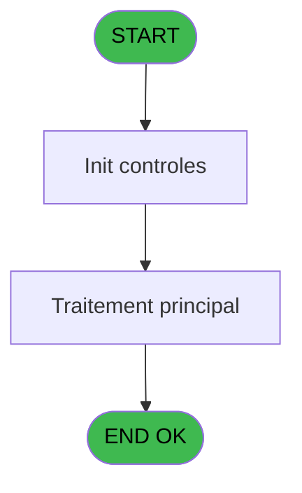
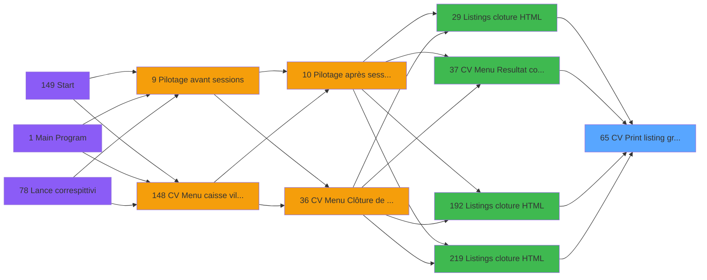

# VIL IDE 65 - CV  Print listing gratuites

> **Analyse**: Phases 1-4 2026-02-03 09:04 -> 09:04 (20s) | Assemblage 09:04
> **Pipeline**: V7.2 Enrichi
> **Structure**: 4 onglets (Resume | Ecrans | Donnees | Connexions)

<!-- TAB:Resume -->

## 1. FICHE D'IDENTITE

| Attribut | Valeur |
|----------|--------|
| Projet | VIL |
| IDE Position | 65 |
| Nom Programme | CV  Print listing gratuites |
| Fichier source | `Prg_65.xml` |
| Domaine metier | Impression |
| Taches | 1 (1 ecrans visibles) |
| Tables modifiees | 0 |
| Programmes appeles | 0 |

## 2. DESCRIPTION FONCTIONNELLE

**CV  Print listing gratuites** assure la gestion complete de ce processus, accessible depuis [    Listings cloture HTML (IDE 29)](VIL-IDE-29.md), [CV Menu Resultat comptable (IDE 37)](VIL-IDE-37.md), [    Listings cloture HTML (IDE 192)](VIL-IDE-192.md), [    Listings cloture HTML (IDE 219)](VIL-IDE-219.md).

Le flux de traitement s'organise en **1 blocs fonctionnels** :

- **Impression** (1 tache) : generation de tickets et documents

**Logique metier** : 7 regles identifiees couvrant conditions metier.

## 3. BLOCS FONCTIONNELS

### 3.1 Impression (1 tache)

Generation des documents et tickets.

---

#### 65 - AC  Print listing comptable [[ECRAN]](#ecran-t1)

**Role** : Generation du document : AC  Print listing comptable.
**Ecran** : 422 x 56 DLU (MDI) | [Voir mockup](#ecran-t1)
**Variables liees** : C (P0 date comptable), D (P0 top exec listing), H (W0 date listing), I (W0 heure listing)

## 5. REGLES METIER

7 regles identifiees:

### Autres (7 regles)

#### [RM-001] Si [W]='A' alors 'annul' sinon '')

| Element | Detail |
|---------|--------|
| **Condition** | `[W]='A'` |
| **Si vrai** | 'annul' |
| **Si faux** | '') |
| **Expression source** | Expression 9 : `IF ([W]='A','annul','')` |
| **Exemple** | Si [W]='A' → 'annul'. Sinon → '') |

#### [RM-002] Traitement conditionnel si [Y]> est a zero

| Element | Detail |
|---------|--------|
| **Condition** | `[Y]>=0` |
| **Si vrai** | [Y] |
| **Si faux** | 0) |
| **Expression source** | Expression 10 : `IF ([Y]>=0,[Y],0)` |
| **Exemple** | Si [Y]>=0 → [Y]. Sinon → 0) |

#### [RM-003] Si [Y]<0 alors ABS ([Y]) sinon 0)

| Element | Detail |
|---------|--------|
| **Condition** | `[Y]<0` |
| **Si vrai** | ABS ([Y]) |
| **Si faux** | 0) |
| **Expression source** | Expression 11 : `IF ([Y]<0,ABS ([Y]),0)` |
| **Exemple** | Si [Y]<0 → ABS ([Y]). Sinon → 0) |

#### [RM-004] Traitement conditionnel si W0 total [N]> est a zero

| Element | Detail |
|---------|--------|
| **Condition** | `W0 total [N]>=0` |
| **Si vrai** | W0 total [N] |
| **Si faux** | 0) |
| **Variables** | N (W0 total) |
| **Expression source** | Expression 24 : `IF (W0 total [N]>=0,W0 total [N],0)` |
| **Exemple** | Si W0 total [N]>=0 → W0 total [N]. Sinon → 0) |

#### [RM-005] Si W0 total [N]<0 alors W0 total [N] sinon 0)

| Element | Detail |
|---------|--------|
| **Condition** | `W0 total [N]<0` |
| **Si vrai** | W0 total [N] |
| **Si faux** | 0) |
| **Variables** | N (W0 total) |
| **Expression source** | Expression 25 : `IF (W0 total [N]<0,W0 total [N],0)` |
| **Exemple** | Si W0 total [N]<0 → W0 total [N]. Sinon → 0) |

#### [RM-006] Si W0 cumul cr ss-imput [J]<>0 AND W0 cumul db ss-imput [K]<>0 alors IF (W0 cumul cr ss-imput [J]+W0 cumul db ss-imput [K]<0 sinon '(DB '&LTrim (RTrim (Str (ABS (W0 cumul cr ss-imput [J]+W0 cumul db ss-imput [K]),P0 masque cumul [B])))&')','(CR '&LTrim (RTrim (Str (ABS (W0 cumul cr ss-imput [J]+W0 cumul db ss-imput [K]),P0 masque cumul [B])))&')'),Fill ('.',22))

| Element | Detail |
|---------|--------|
| **Condition** | `W0 cumul cr ss-imput [J]<>0 AND W0 cumul db ss-imput [K]<>0` |
| **Si vrai** | IF (W0 cumul cr ss-imput [J]+W0 cumul db ss-imput [K]<0 |
| **Si faux** | '(DB '&LTrim (RTrim (Str (ABS (W0 cumul cr ss-imput [J]+W0 cumul db ss-imput [K]),P0 masque cumul [B])))&')','(CR '&LTrim (RTrim (Str (ABS (W0 cumul cr ss-imput [J]+W0 cumul db ss-imput [K]),P0 masque cumul [B])))&')'),Fill ('.',22)) |
| **Variables** | B (P0 masque cumul), J (W0 cumul cr ss-imput), K (W0 cumul db ss-imput) |
| **Expression source** | Expression 27 : `IF (W0 cumul cr ss-imput [J]<>0 AND W0 cumul db ss-imput [K]` |
| **Exemple** | Si W0 cumul cr ss-imput [J]<>0 AND W0 cumul db ss-imput [K]<>0 → IF (W0 cumul cr ss-imput [J]+W0 cumul db ss-imput [K]<0 |

#### [RM-007] Si W0 cumul cr imput [L]<>0 AND W0 cumul db imput [M]<>0 alors IF (W0 cumul cr imput [L]+W0 cumul db imput [M]<0 sinon '(DB '&LTrim (RTrim (Str (ABS (W0 cumul cr imput [L]+W0 cumul db imput [M]),P0 masque cumul [B])))&')','(CR '&LTrim (RTrim (Str (ABS (W0 cumul cr imput [L]+W0 cumul db imput [M]),P0 masque cumul [B])))&')'),Fill ('.',22))

| Element | Detail |
|---------|--------|
| **Condition** | `W0 cumul cr imput [L]<>0 AND W0 cumul db imput [M]<>0` |
| **Si vrai** | IF (W0 cumul cr imput [L]+W0 cumul db imput [M]<0 |
| **Si faux** | '(DB '&LTrim (RTrim (Str (ABS (W0 cumul cr imput [L]+W0 cumul db imput [M]),P0 masque cumul [B])))&')','(CR '&LTrim (RTrim (Str (ABS (W0 cumul cr imput [L]+W0 cumul db imput [M]),P0 masque cumul [B])))&')'),Fill ('.',22)) |
| **Variables** | B (P0 masque cumul), L (W0 cumul cr imput), M (W0 cumul db imput) |
| **Expression source** | Expression 28 : `IF (W0 cumul cr imput [L]<>0 AND W0 cumul db imput [M]<>0,IF` |
| **Exemple** | Si W0 cumul cr imput [L]<>0 AND W0 cumul db imput [M]<>0 → IF (W0 cumul cr imput [L]+W0 cumul db imput [M]<0 |

## 6. CONTEXTE

- **Appele par**: [    Listings cloture HTML (IDE 29)](VIL-IDE-29.md), [CV Menu Resultat comptable (IDE 37)](VIL-IDE-37.md), [    Listings cloture HTML (IDE 192)](VIL-IDE-192.md), [    Listings cloture HTML (IDE 219)](VIL-IDE-219.md)
- **Appelle**: 0 programmes | **Tables**: 2 (W:0 R:1 L:1) | **Taches**: 1 | **Expressions**: 39

<!-- TAB:Ecrans -->

## 8. ECRANS

### 8.1 Forms visibles (1 / 1)

| # | Position | Tache | Nom | Type | Largeur | Hauteur | Bloc |
|---|----------|-------|-----|------|---------|---------|------|
| 1 | 65 | 65 | AC  Print listing comptable | MDI | 422 | 56 | Impression |

### 8.2 Mockups Ecrans

---

#### 65 - AC  Print listing comptable
**Tache** : [65](#t1) | **Type** : MDI | **Dimensions** : 422 x 56 DLU
**Bloc** : Impression | **Titre IDE** : AC  Print listing comptable

<!-- FORM-DATA:
{
    "width":  422,
    "vFactor":  8,
    "type":  "MDI",
    "hFactor":  8,
    "controls":  [
                     {
                         "x":  0,
                         "type":  "label",
                         "var":  "",
                         "y":  0,
                         "w":  423,
                         "fmt":  "",
                         "name":  "",
                         "h":  29,
                         "color":  "",
                         "text":  "",
                         "parent":  null
                     },
                     {
                         "x":  117,
                         "type":  "label",
                         "var":  "",
                         "y":  10,
                         "w":  275,
                         "fmt":  "",
                         "name":  "",
                         "h":  8,
                         "color":  "7",
                         "text":  "Impression en cours",
                         "parent":  null
                     },
                     {
                         "x":  0,
                         "type":  "label",
                         "var":  "",
                         "y":  29,
                         "w":  423,
                         "fmt":  "",
                         "name":  "",
                         "h":  27,
                         "color":  "",
                         "text":  "",
                         "parent":  null
                     },
                     {
                         "x":  70,
                         "type":  "label",
                         "var":  "",
                         "y":  39,
                         "w":  282,
                         "fmt":  "",
                         "name":  "",
                         "h":  8,
                         "color":  "",
                         "text":  "Impression listing comptable",
                         "parent":  null
                     },
                     {
                         "x":  1,
                         "type":  "image",
                         "var":  "",
                         "y":  2,
                         "w":  72,
                         "fmt":  "",
                         "name":  "",
                         "h":  25,
                         "color":  "",
                         "text":  "",
                         "parent":  null
                     }
                 ],
    "taskId":  "65",
    "height":  56
}
-->

## 9. NAVIGATION

Ecran unique: **AC  Print listing comptable**

### 9.3 Structure hierarchique (1 tache)

| Position | Tache | Type | Dimensions | Bloc |
|----------|-------|------|------------|------|
| **65.1** | [**AC  Print listing comptable** (65)](#t1) [mockup](#ecran-t1) | MDI | 422x56 | Impression |

### 9.4 Algorigramme

> **Legende**: Vert = START/END OK | Rouge = END KO | Bleu = Decisions
> *Algorigramme auto-genere. Utiliser `/algorigramme` pour une synthese metier detaillee.*

<!-- TAB:Donnees -->

## 10. TABLES

### Tables utilisees (2)

| ID | Nom | Description | Type | R | W | L | Usages |
|----|-----|-------------|------|---|---|---|--------|
| 30 | gm-recherche_____gmr | Index de recherche | DB | R |   |   | 1 |
| 38 | comptable_gratuite |  | DB |   |   | L | 1 |

### Colonnes par table (2 / 1 tables avec colonnes identifiees)

Table 30 - gm-recherche_____gmr (R) - 1 usages

| Lettre | Variable | Acces | Type |
|--------|----------|-------|------|
| A | P0 societe | R | Alpha |
| B | P0 masque cumul | R | Alpha |
| C | P0 date comptable | R | Date |
| D | P0 top exec listing | R | Alpha |
| E | P0 nom village | R | Alpha |
| F | P0 fichier html | R | Logical |
| G | W0 config imp | R | Alpha |
| H | W0 date listing | R | Date |
| I | W0 heure listing | R | Time |
| J | W0 cumul cr ss-imput | R | Numeric |
| K | W0 cumul db ss-imput | R | Numeric |
| L | W0 cumul cr imput | R | Numeric |
| M | W0 cumul db imput | R | Numeric |
| N | W0 total | R | Numeric |

## 11. VARIABLES

### 11.1 Parametres entrants (6)

Variables recues du programme appelant ([    Listings cloture HTML (IDE 29)](VIL-IDE-29.md)).

| Lettre | Nom | Type | Usage dans |
|--------|-----|------|-----------|
| A | P0 societe | Alpha | 1x parametre entrant |
| B | P0 masque cumul | Alpha | 3x parametre entrant |
| C | P0 date comptable | Date | [65](#t1) |
| D | P0 top exec listing | Alpha | - |
| E | P0 nom village | Alpha | - |
| F | P0 fichier html | Logical | 2x parametre entrant |

### 11.2 Variables de travail (8)

Variables internes au programme.

| Lettre | Nom | Type | Usage dans |
|--------|-----|------|-----------|
| G | W0 config imp | Alpha | - |
| H | W0 date listing | Date | - |
| I | W0 heure listing | Time | - |
| J | W0 cumul cr ss-imput | Numeric | 2x calcul interne |
| K | W0 cumul db ss-imput | Numeric | 3x calcul interne |
| L | W0 cumul cr imput | Numeric | 2x calcul interne |
| M | W0 cumul db imput | Numeric | 3x calcul interne |
| N | W0 total | Numeric | 3x calcul interne |

## 12. EXPRESSIONS

**39 / 39 expressions decodees (100%)**

### 12.1 Repartition par type

| Type | Expressions | Regles |
|------|-------------|--------|
| CALCULATION | 5 | 0 |
| CONCATENATION | 4 | 2 |
| CONDITION | 8 | 5 |
| CONSTANTE | 5 | 0 |
| DATE | 1 | 0 |
| OTHER | 13 | 0 |
| CAST_LOGIQUE | 2 | 0 |
| STRING | 1 | 0 |

### 12.2 Expressions cles par type

#### CALCULATION (5 expressions)

| Type | IDE | Expression | Regle |
|------|-----|------------|-------|
| CALCULATION | 22 | `W0 cumul cr imput [L]+[Y]` | - |
| CALCULATION | 23 | `W0 cumul db imput [M]+[Y]` | - |
| CALCULATION | 20 | `W0 cumul db ss-imput [K]+[Y]` | - |
| CALCULATION | 14 | `W0 total [N]+[Y]` | - |
| CALCULATION | 18 | `W0 cumul cr ss-imput [J]+[Y]` | - |

#### CONCATENATION (4 expressions)

| Type | IDE | Expression | Regle |
|------|-----|------------|-------|
| CONCATENATION | 28 | `IF (W0 cumul cr imput [L]<>0 AND W0 cumul db imput [M]<>0,IF (W0 cumul cr imput [L]+W0 cumul db imput [M]<0,'(DB '&LTrim (RTrim (Str (ABS (W0 cumul cr imput [L]+W0 cumul db imput [M]),P0 masque cumul [B])))&')','(CR '&LTrim (RTrim (Str (ABS (W0 cumul cr imput [L]+W0 cumul db imput [M]),P0 masque cumul [B])))&')'),Fill ('.',22))` | [RM-007](#rm-RM-007) |
| CONCATENATION | 27 | `IF (W0 cumul cr ss-imput [J]<>0 AND W0 cumul db ss-imput [K]<>0,IF (W0 cumul cr ss-imput [J]+W0 cumul db ss-imput [K]<0,'(DB '&LTrim (RTrim (Str (ABS (W0 cumul cr ss-imput [J]+W0 cumul db ss-imput [K]),P0 masque cumul [B])))&')','(CR '&LTrim (RTrim (Str (ABS (W0 cumul cr ss-imput [J]+W0 cumul db ss-imput [K]),P0 masque cumul [B])))&')'),Fill ('.',22))` | [RM-006](#rm-RM-006) |
| CONCATENATION | 31 | `Trim (INIGet ('[MAGIC_LOGICAL_NAMES]club_exportdata')&'Cloture\Editions\Gratuite'&IF (P0 fichier html [F],'_'&DStr (P0 date comptable [C],'YYYYMMDD'),'')&'.htm')` | - |
| CONCATENATION | 30 | `'- '&Str (Page (0,1),'3P0Z0')&' -'` | - |

#### CONDITION (8 expressions)

| Type | IDE | Expression | Regle |
|------|-----|------------|-------|
| CONDITION | 24 | `IF (W0 total [N]>=0,W0 total [N],0)` | [RM-004](#rm-RM-004) |
| CONDITION | 25 | `IF (W0 total [N]<0,W0 total [N],0)` | [RM-005](#rm-RM-005) |
| CONDITION | 11 | `IF ([Y]<0,ABS ([Y]),0)` | [RM-003](#rm-RM-003) |
| CONDITION | 9 | `IF ([W]='A','annul','')` | [RM-001](#rm-RM-001) |
| CONDITION | 10 | `IF ([Y]>=0,[Y],0)` | [RM-002](#rm-RM-002) |
| ... | | *+3 autres* | |

#### CONSTANTE (5 expressions)

| Type | IDE | Expression | Regle |
|------|-----|------------|-------|
| CONSTANTE | 37 | `''` | - |
| CONSTANTE | 39 | `'SOLDE'` | - |
| CONSTANTE | 32 | `'GRATUITES'` | - |
| CONSTANTE | 17 | `0` | - |
| CONSTANTE | 26 | `'O'` | - |

#### DATE (1 expressions)

| Type | IDE | Expression | Regle |
|------|-----|------------|-------|
| DATE | 5 | `Date ()` | - |

#### OTHER (13 expressions)

| Type | IDE | Expression | Regle |
|------|-----|------------|-------|
| OTHER | 15 | `[Q]` | - |
| OTHER | 13 | `ABS (W0 cumul db imput [M])` | - |
| OTHER | 12 | `ABS (W0 cumul db ss-imput [K])` | - |
| OTHER | 38 | `'Sous total '&ExpCalc ('27'EXP)` | - |
| OTHER | 33 | `P0 fichier html [F]` | - |
| ... | | *+8 autres* | |

#### CAST_LOGIQUE (2 expressions)

| Type | IDE | Expression | Regle |
|------|-----|------------|-------|
| CAST_LOGIQUE | 35 | `'FALSE'LOG` | - |
| CAST_LOGIQUE | 34 | `'TRUE'LOG` | - |

#### STRING (1 expressions)

| Type | IDE | Expression | Regle |
|------|-----|------------|-------|
| STRING | 36 | `'Sous imputation '&Str ([T],'3P0Z0')` | - |

### 12.3 Toutes les expressions (39)

Voir les 39 expressions

#### CALCULATION (5)

| IDE | Expression Decodee |
|-----|-------------------|
| 14 | `W0 total [N]+[Y]` |
| 18 | `W0 cumul cr ss-imput [J]+[Y]` |
| 20 | `W0 cumul db ss-imput [K]+[Y]` |
| 22 | `W0 cumul cr imput [L]+[Y]` |
| 23 | `W0 cumul db imput [M]+[Y]` |

#### CONCATENATION (4)

| IDE | Expression Decodee |
|-----|-------------------|
| 30 | `'- '&Str (Page (0,1),'3P0Z0')&' -'` |
| 27 | `IF (W0 cumul cr ss-imput [J]<>0 AND W0 cumul db ss-imput [K]<>0,IF (W0 cumul cr ss-imput [J]+W0 cumul db ss-imput [K]<0,'(DB '&LTrim (RTrim (Str (ABS (W0 cumul cr ss-imput [J]+W0 cumul db ss-imput [K]),P0 masque cumul [B])))&')','(CR '&LTrim (RTrim (Str (ABS (W0 cumul cr ss-imput [J]+W0 cumul db ss-imput [K]),P0 masque cumul [B])))&')'),Fill ('.',22))` |
| 28 | `IF (W0 cumul cr imput [L]<>0 AND W0 cumul db imput [M]<>0,IF (W0 cumul cr imput [L]+W0 cumul db imput [M]<0,'(DB '&LTrim (RTrim (Str (ABS (W0 cumul cr imput [L]+W0 cumul db imput [M]),P0 masque cumul [B])))&')','(CR '&LTrim (RTrim (Str (ABS (W0 cumul cr imput [L]+W0 cumul db imput [M]),P0 masque cumul [B])))&')'),Fill ('.',22))` |
| 31 | `Trim (INIGet ('[MAGIC_LOGICAL_NAMES]club_exportdata')&'Cloture\Editions\Gratuite'&IF (P0 fichier html [F],'_'&DStr (P0 date comptable [C],'YYYYMMDD'),'')&'.htm')` |

#### CONDITION (8)

| IDE | Expression Decodee |
|-----|-------------------|
| 9 | `IF ([W]='A','annul','')` |
| 10 | `IF ([Y]>=0,[Y],0)` |
| 11 | `IF ([Y]<0,ABS ([Y]),0)` |
| 24 | `IF (W0 total [N]>=0,W0 total [N],0)` |
| 25 | `IF (W0 total [N]<0,W0 total [N],0)` |
| 19 | `[Y]>=0` |
| 21 | `[Y]<0` |
| 29 | `INIGet ('[MAGIC_LOGICAL_NAMES]preview')='O'` |

#### CONSTANTE (5)

| IDE | Expression Decodee |
|-----|-------------------|
| 17 | `0` |
| 26 | `'O'` |
| 32 | `'GRATUITES'` |
| 37 | `''` |
| 39 | `'SOLDE'` |

#### DATE (1)

| IDE | Expression Decodee |
|-----|-------------------|
| 5 | `Date ()` |

#### OTHER (13)

| IDE | Expression Decodee |
|-----|-------------------|
| 1 | `GetParam ('DTCLOSURE')` |
| 2 | `SetCrsr (1)` |
| 3 | `SetCrsr (2)` |
| 4 | `P0 societe [A]` |
| 6 | `Time ()` |
| 7 | `P0 date comptable [C]` |
| 8 | `P0 masque cumul [B]` |
| 12 | `ABS (W0 cumul db ss-imput [K])` |
| 13 | `ABS (W0 cumul db imput [M])` |
| 15 | `[Q]` |
| 16 | `[R]` |
| 33 | `P0 fichier html [F]` |
| 38 | `'Sous total '&ExpCalc ('27'EXP)` |

#### CAST_LOGIQUE (2)

| IDE | Expression Decodee |
|-----|-------------------|
| 34 | `'TRUE'LOG` |
| 35 | `'FALSE'LOG` |

#### STRING (1)

| IDE | Expression Decodee |
|-----|-------------------|
| 36 | `'Sous imputation '&Str ([T],'3P0Z0')` |

<!-- TAB:Connexions -->

## 13. GRAPHE D'APPELS

### 13.1 Chaine depuis Main (Callers)

Main -> ... -> [    Listings cloture HTML (IDE 29)](VIL-IDE-29.md) -> **CV  Print listing gratuites (IDE 65)**

Main -> ... -> [CV Menu Resultat comptable (IDE 37)](VIL-IDE-37.md) -> **CV  Print listing gratuites (IDE 65)**

Main -> ... -> [    Listings cloture HTML (IDE 192)](VIL-IDE-192.md) -> **CV  Print listing gratuites (IDE 65)**

Main -> ... -> [    Listings cloture HTML (IDE 219)](VIL-IDE-219.md) -> **CV  Print listing gratuites (IDE 65)**

### 13.2 Callers

| IDE | Nom Programme | Nb Appels |
|-----|---------------|-----------|
| [29](VIL-IDE-29.md) |     Listings cloture HTML | 1 |
| [37](VIL-IDE-37.md) | CV Menu Resultat comptable | 1 |
| [192](VIL-IDE-192.md) |     Listings cloture HTML | 1 |
| [219](VIL-IDE-219.md) |     Listings cloture HTML | 1 |

### 13.3 Callees (programmes appeles)

### 13.4 Detail Callees avec contexte

| IDE | Nom Programme | Appels | Contexte |
|-----|---------------|--------|----------|
| - | (aucun) | - | - |

## 14. RECOMMANDATIONS MIGRATION

### 14.1 Profil du programme

| Metrique | Valeur | Impact migration |
|----------|--------|-----------------|
| Lignes de logique | 73 | Programme compact |
| Expressions | 39 | Peu de logique |
| Tables WRITE | 0 | Impact faible |
| Sous-programmes | 0 | Peu de dependances |
| Ecrans visibles | 1 | Ecran unique ou traitement batch |
| Code desactive | 0% (0 / 73) | Code sain |
| Regles metier | 7 | Quelques regles a preserver |

### 14.2 Plan de migration par bloc

#### Impression (1 tache: 1 ecran, 0 traitement)

- **Strategie** : Templates HTML -> PDF via wkhtmltopdf ou Puppeteer.
- `PrintService` injectable avec choix imprimante

### 14.3 Dependances critiques

| Dependance | Type | Appels | Impact |
|------------|------|--------|--------|

---
*Spec DETAILED generee par Pipeline V7.2 - 2026-02-03 09:04*
