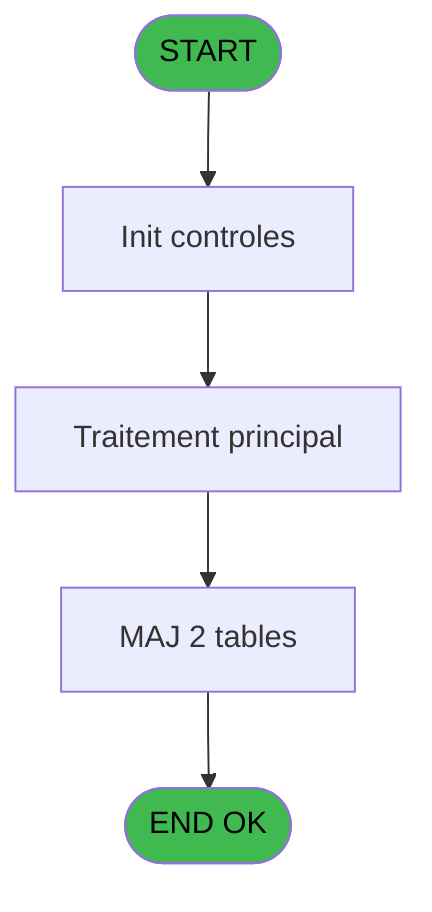
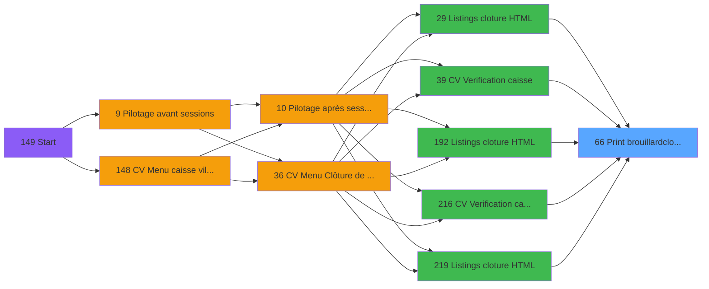

# VIL IDE 66 - Print brouillard/cloture

> **Analyse**: Phases 1-4 2026-02-03 09:04 -> 09:04 (21s) | Assemblage 09:04
> **Pipeline**: V7.2 Enrichi
> **Structure**: 4 onglets (Resume | Ecrans | Donnees | Connexions)

<!-- TAB:Resume -->

## 1. FICHE D'IDENTITE

| Attribut | Valeur |
|----------|--------|
| Projet | VIL |
| IDE Position | 66 |
| Nom Programme | Print brouillard/cloture |
| Fichier source | `Prg_66.xml` |
| Domaine metier | Impression |
| Taches | 28 (1 ecrans visibles) |
| Tables modifiees | 2 |
| Programmes appeles | 0 |

## 2. DESCRIPTION FONCTIONNELLE

**Print brouillard/cloture** assure la gestion complete de ce processus, accessible depuis [CV  Verification caisse (IDE 39)](VIL-IDE-39.md), [CV  Verification caisse (IDE 216)](VIL-IDE-216.md), [    Listings cloture HTML (IDE 29)](VIL-IDE-29.md), [    Listings cloture HTML (IDE 192)](VIL-IDE-192.md), [    Listings cloture HTML (IDE 219)](VIL-IDE-219.md).

Le flux de traitement s'organise en **4 blocs fonctionnels** :

- **Traitement** (23 taches) : traitements metier divers
- **Creation** (2 taches) : insertion d'enregistrements en base (mouvements, prestations)
- **Impression** (2 taches) : generation de tickets et documents
- **Calcul** (1 tache) : calculs de montants, stocks ou compteurs

**Donnees modifiees** : 2 tables en ecriture (recap_devise_cloture, modif__caisse____mks).

**Logique metier** : 7 regles identifiees couvrant conditions metier.

Detail : phases du traitement

#### Phase 1 : Traitement (23 taches)

- **66** - Veuillez patienter .... **[[ECRAN]](#ecran-t1)**
- **66.1** - Recapitulatif
- **66.1.1** - COFFRE
- **66.1.1.1** - Devises du coffre
- **66.1.1.1.1** - RECAP DEVISE
- **66.1.2** - Lecture user
- **66.1.2.1** - Last FDR
- **66.1.2.2** - solde PMS coffre
- **66.1.2.3** - Sessions caisses
- **66.1.2.3.1** - CAISSE
- **66.1.2.4** - Sessions caisses
- **66.1.3** - Lecture user
- **66.1.3.1** - Sessions caisses
- **66.1.3.1.1** - CAISSE
- **66.1.3.1.2** - RECAP DEVISE
- **66.1.4.2** - Existe
- **66.1.4.3** - Devises
- **66.1.4.4** - Devises totaux
- **66.3** - parametre change
- **66.4** - COFFRE 2 v1
- **66.1.4.5** - Devises totaux
- **66.5** - COFFRE 2 v1
- **66.1.3.1.3** - CAISSE

#### Phase 2 : Impression (2 taches)

- **66.1.4** - Print recap devises
- **66.2** - Edition des modifications MKS

#### Phase 3 : Calcul (1 tache)

- **66.1.4.1** - Calcul totaux devises

#### Phase 4 : Creation (2 taches)

- **66.1.4.1.1** - creation total
- **66.1.4.1.2** - creation total

#### Tables impactees

| Table | Operations | Role metier |
|-------|-----------|-------------|
| recap_devise_cloture | R/**W**/L (10 usages) | Donnees reseau/cloture |
| modif__caisse____mks | **W** (1 usages) | Sessions de caisse |

## 3. BLOCS FONCTIONNELS

### 3.1 Traitement (23 taches)

Traitements internes.

---

#### 66 - Veuillez patienter .... [[ECRAN]](#ecran-t1)

**Role** : Tache d'orchestration : point d'entree du programme (23 sous-taches). Coordonne l'enchainement des traitements.
**Ecran** : 424 x 56 DLU (MDI) | [Voir mockup](#ecran-t1)

22 sous-taches directes

| Tache | Nom | Bloc |
|-------|-----|------|
| [66.1](#t2) | Recapitulatif | Traitement |
| [66.1.1](#t3) | COFFRE | Traitement |
| [66.1.1.1](#t4) | Devises du coffre | Traitement |
| [66.1.1.1.1](#t5) | RECAP DEVISE | Traitement |
| [66.1.2](#t6) | Lecture user | Traitement |
| [66.1.2.1](#t7) | Last FDR | Traitement |
| [66.1.2.2](#t9) | solde PMS coffre | Traitement |
| [66.1.2.3](#t10) | Sessions caisses | Traitement |
| [66.1.2.3.1](#t11) | CAISSE | Traitement |
| [66.1.2.4](#t12) | Sessions caisses | Traitement |
| [66.1.3](#t13) | Lecture user | Traitement |
| [66.1.3.1](#t14) | Sessions caisses | Traitement |
| [66.1.3.1.1](#t15) | CAISSE | Traitement |
| [66.1.3.1.2](#t16) | RECAP DEVISE | Traitement |
| [66.1.4.2](#t24) | Existe | Traitement |
| [66.1.4.3](#t25) | Devises | Traitement |
| [66.1.4.4](#t26) | Devises totaux | Traitement |
| [66.3](#t28) | parametre change | Traitement |
| [66.4](#t29) | COFFRE 2 v1 | Traitement |
| [66.1.4.5](#t35) | Devises totaux | Traitement |
| [66.5](#t38) | COFFRE 2 v1 | Traitement |
| [66.1.3.1.3](#t41) | CAISSE | Traitement |

---

#### 66.1 - Recapitulatif

**Role** : Traitement : Recapitulatif.

---

#### 66.1.1 - COFFRE

**Role** : Traitement : COFFRE.
**Variables liees** : T (W0 Coffre2 actif), U (WO Term Coffre2), V (WO Host Coffre2)

---

#### 66.1.1.1 - Devises du coffre

**Role** : Traitement : Devises du coffre.
**Variables liees** : T (W0 Coffre2 actif), U (WO Term Coffre2), V (WO Host Coffre2)

---

#### 66.1.1.1.1 - RECAP DEVISE

**Role** : Traitement : RECAP DEVISE.

---

#### 66.1.2 - Lecture user

**Role** : Traitement : Lecture user.

---

#### 66.1.2.1 - Last FDR

**Role** : Traitement : Last FDR.

---

#### 66.1.2.2 - solde PMS coffre

**Role** : Consultation/chargement : solde PMS coffre.
**Variables liees** : D (P0 solde veille), T (W0 Coffre2 actif), U (WO Term Coffre2), V (WO Host Coffre2)

---

#### 66.1.2.3 - Sessions caisses

**Role** : Traitement : Sessions caisses.

---

#### 66.1.2.3.1 - CAISSE

**Role** : Traitement : CAISSE.

---

#### 66.1.2.4 - Sessions caisses

**Role** : Traitement : Sessions caisses.

---

#### 66.1.3 - Lecture user

**Role** : Traitement : Lecture user.

---

#### 66.1.3.1 - Sessions caisses

**Role** : Traitement : Sessions caisses.

---

#### 66.1.3.1.1 - CAISSE

**Role** : Traitement : CAISSE.

---

#### 66.1.3.1.2 - RECAP DEVISE

**Role** : Traitement : RECAP DEVISE.

---

#### 66.1.4.2 - Existe

**Role** : Traitement : Existe.

---

#### 66.1.4.3 - Devises

**Role** : Traitement : Devises.

---

#### 66.1.4.4 - Devises totaux

**Role** : Calcul : Devises totaux.

---

#### 66.3 - parametre change

**Role** : Traitement : parametre change.
**Variables liees** : S (W0 Imputation change)

---

#### 66.4 - COFFRE 2 v1

**Role** : Traitement : COFFRE 2 v1.
**Variables liees** : T (W0 Coffre2 actif), U (WO Term Coffre2), V (WO Host Coffre2)

---

#### 66.1.4.5 - Devises totaux

**Role** : Calcul : Devises totaux.

---

#### 66.5 - COFFRE 2 v1

**Role** : Traitement : COFFRE 2 v1.
**Variables liees** : T (W0 Coffre2 actif), U (WO Term Coffre2), V (WO Host Coffre2)

---

#### 66.1.3.1.3 - CAISSE

**Role** : Traitement : CAISSE.

### 3.2 Impression (2 taches)

Generation des documents et tickets.

---

#### 66.1.4 - Print recap devises

**Role** : Generation du document : Print recap devises.

---

#### 66.2 - Edition des modifications MKS

**Role** : Generation du document : Edition des modifications MKS.
**Variables liees** : O (P0 edition cloture auto), P (P0 edition HTML)

### 3.3 Calcul (1 tache)

Calculs metier : montants, stocks, compteurs.

---

#### 66.1.4.1 - Calcul totaux devises

**Role** : Calcul : Calcul totaux devises.

### 3.4 Creation (2 taches)

Insertion de nouveaux enregistrements en base.

---

#### 66.1.4.1.1 - creation total

**Role** : Creation d'enregistrement : creation total.

---

#### 66.1.4.1.2 - creation total

**Role** : Creation d'enregistrement : creation total.

## 5. REGLES METIER

7 regles identifiees:

### Autres (7 regles)

#### [RM-001] Si [Y]='A' alors 'annul' sinon '')

| Element | Detail |
|---------|--------|
| **Condition** | `[Y]='A'` |
| **Si vrai** | 'annul' |
| **Si faux** | '') |
| **Expression source** | Expression 9 : `IF ([Y]='A','annul','')` |
| **Exemple** | Si [Y]='A' → 'annul'. Sinon → '') |

#### [RM-002] Traitement conditionnel si [AA]> est a zero

| Element | Detail |
|---------|--------|
| **Condition** | `[AA]>=0` |
| **Si vrai** | [AA] |
| **Si faux** | 0) |
| **Expression source** | Expression 10 : `IF ([AA]>=0,[AA],0)` |
| **Exemple** | Si [AA]>=0 → [AA]. Sinon → 0) |

#### [RM-003] Si [AA]<0 alors ABS ([AA]) sinon 0)

| Element | Detail |
|---------|--------|
| **Condition** | `[AA]<0` |
| **Si vrai** | ABS ([AA]) |
| **Si faux** | 0) |
| **Expression source** | Expression 11 : `IF ([AA]<0,ABS ([AA]),0)` |
| **Exemple** | Si [AA]<0 → ABS ([AA]). Sinon → 0) |

#### [RM-004] Si P0 clôture/brouillar [I]='O' alors MlsTrans ('CLOTURE') sinon MlsTrans ('BROUILLARD'))&' '&MlsTrans ('DU')&' '&DStr (P0 date comptable [C],'DD/MM/YYYY')

| Element | Detail |
|---------|--------|
| **Condition** | `P0 clôture/brouillar [I]='O'` |
| **Si vrai** | MlsTrans ('CLOTURE') |
| **Si faux** | MlsTrans ('BROUILLARD'))&' '&MlsTrans ('DU')&' '&DStr (P0 date comptable [C],'DD/MM/YYYY') |
| **Variables** | C (P0 date comptable), I (P0 clôture/brouillar) |
| **Expression source** | Expression 17 : `IF (P0 clôture/brouillar [I]='O',MlsTrans ('CLOTURE'),MlsTra` |
| **Exemple** | Si P0 clôture/brouillar [I]='O' → MlsTrans ('CLOTURE') |

#### [RM-005] Si WO Host Coffre2 [V]='D' alors MlsTrans ('DEPENSES') sinon MlsTrans ('RECETTES'))

| Element | Detail |
|---------|--------|
| **Condition** | `WO Host Coffre2 [V]='D'` |
| **Si vrai** | MlsTrans ('DEPENSES') |
| **Si faux** | MlsTrans ('RECETTES')) |
| **Variables** | V (WO Host Coffre2) |
| **Expression source** | Expression 18 : `IF (WO Host Coffre2 [V]='D',MlsTrans ('DEPENSES'),MlsTrans (` |
| **Exemple** | Si WO Host Coffre2 [V]='D' → MlsTrans ('DEPENSES'). Sinon → MlsTrans ('RECETTES')) |
| **Impact** | [66.1.1 - COFFRE](#t3) |

#### [RM-006] Traitement si [AE] est renseigne

| Element | Detail |
|---------|--------|
| **Condition** | `[AE]<>''` |
| **Si vrai** | Trim ([AE]) |
| **Si faux** | [Z]) |
| **Expression source** | Expression 29 : `IF ([AE]<>'',Trim ([AE]),[Z])` |
| **Exemple** | Si [AE]<>'' → Trim ([AE]). Sinon → [Z]) |

#### [RM-007] Si ExpCalc ('30'EXP) alors '*' sinon '')

| Element | Detail |
|---------|--------|
| **Condition** | `ExpCalc ('30'EXP)` |
| **Si vrai** | '*' |
| **Si faux** | '') |
| **Expression source** | Expression 36 : `IF (ExpCalc ('30'EXP),'*','')` |
| **Exemple** | Si ExpCalc ('30'EXP) → '*'. Sinon → '') |

## 6. CONTEXTE

- **Appele par**: [CV  Verification caisse (IDE 39)](VIL-IDE-39.md), [CV  Verification caisse (IDE 216)](VIL-IDE-216.md), [    Listings cloture HTML (IDE 29)](VIL-IDE-29.md), [    Listings cloture HTML (IDE 192)](VIL-IDE-192.md), [    Listings cloture HTML (IDE 219)](VIL-IDE-219.md)
- **Appelle**: 0 programmes | **Tables**: 17 (W:2 R:12 L:7) | **Taches**: 28 | **Expressions**: 38

<!-- TAB:Ecrans -->

## 8. ECRANS

### 8.1 Forms visibles (1 / 28)

| # | Position | Tache | Nom | Type | Largeur | Hauteur | Bloc |
|---|----------|-------|-----|------|---------|---------|------|
| 1 | 66 | 66 | Veuillez patienter .... | MDI | 424 | 56 | Traitement |

### 8.2 Mockups Ecrans

---

#### 66 - Veuillez patienter ....
**Tache** : [66](#t1) | **Type** : MDI | **Dimensions** : 424 x 56 DLU
**Bloc** : Traitement | **Titre IDE** : Veuillez patienter ....

<!-- FORM-DATA:
{
    "width":  424,
    "vFactor":  8,
    "type":  "MDI",
    "hFactor":  8,
    "controls":  [
                     {
                         "x":  1,
                         "type":  "label",
                         "var":  "",
                         "y":  0,
                         "w":  423,
                         "fmt":  "",
                         "name":  "",
                         "h":  29,
                         "color":  "",
                         "text":  "",
                         "parent":  null
                     },
                     {
                         "x":  118,
                         "type":  "label",
                         "var":  "",
                         "y":  10,
                         "w":  275,
                         "fmt":  "",
                         "name":  "",
                         "h":  8,
                         "color":  "7",
                         "text":  "Impression en cours",
                         "parent":  null
                     },
                     {
                         "x":  1,
                         "type":  "label",
                         "var":  "",
                         "y":  29,
                         "w":  423,
                         "fmt":  "",
                         "name":  "",
                         "h":  27,
                         "color":  "",
                         "text":  "",
                         "parent":  null
                     },
                     {
                         "x":  59,
                         "type":  "label",
                         "var":  "",
                         "y":  39,
                         "w":  306,
                         "fmt":  "",
                         "name":  "",
                         "h":  8,
                         "color":  "",
                         "text":  "Impression  brouillard de caisse",
                         "parent":  null
                     },
                     {
                         "x":  59,
                         "type":  "label",
                         "var":  "",
                         "y":  39,
                         "w":  306,
                         "fmt":  "",
                         "name":  "",
                         "h":  8,
                         "color":  "",
                         "text":  "Impression  clôture de caisse",
                         "parent":  null
                     },
                     {
                         "x":  2,
                         "type":  "image",
                         "var":  "",
                         "y":  2,
                         "w":  72,
                         "fmt":  "",
                         "name":  "",
                         "h":  25,
                         "color":  "",
                         "text":  "",
                         "parent":  null
                     }
                 ],
    "taskId":  "66",
    "height":  56
}
-->

## 9. NAVIGATION

Ecran unique: **Veuillez patienter ....**

### 9.3 Structure hierarchique (28 taches)

| Position | Tache | Type | Dimensions | Bloc |
|----------|-------|------|------------|------|
| **66.1** | [**Veuillez patienter ....** (66)](#t1) [mockup](#ecran-t1) | MDI | 424x56 | Traitement |
| 66.1.1 | [Recapitulatif (66.1)](#t2) | MDI | - | |
| 66.1.2 | [COFFRE (66.1.1)](#t3) | MDI | - | |
| 66.1.3 | [Devises du coffre (66.1.1.1)](#t4) | MDI | - | |
| 66.1.4 | [RECAP DEVISE (66.1.1.1.1)](#t5) | MDI | - | |
| 66.1.5 | [Lecture user (66.1.2)](#t6) | MDI | - | |
| 66.1.6 | [Last FDR (66.1.2.1)](#t7) | MDI | - | |
| 66.1.7 | [solde PMS coffre (66.1.2.2)](#t9) | MDI | - | |
| 66.1.8 | [Sessions caisses (66.1.2.3)](#t10) | MDI | - | |
| 66.1.9 | [CAISSE (66.1.2.3.1)](#t11) | MDI | - | |
| 66.1.10 | [Sessions caisses (66.1.2.4)](#t12) | MDI | - | |
| 66.1.11 | [Lecture user (66.1.3)](#t13) | MDI | - | |
| 66.1.12 | [Sessions caisses (66.1.3.1)](#t14) | MDI | - | |
| 66.1.13 | [CAISSE (66.1.3.1.1)](#t15) | MDI | - | |
| 66.1.14 | [RECAP DEVISE (66.1.3.1.2)](#t16) | MDI | - | |
| 66.1.15 | [Existe (66.1.4.2)](#t24) | MDI | - | |
| 66.1.16 | [Devises (66.1.4.3)](#t25) | MDI | - | |
| 66.1.17 | [Devises totaux (66.1.4.4)](#t26) | MDI | - | |
| 66.1.18 | [parametre change (66.3)](#t28) | MDI | - | |
| 66.1.19 | [COFFRE 2 v1 (66.4)](#t29) | MDI | - | |
| 66.1.20 | [Devises totaux (66.1.4.5)](#t35) | MDI | - | |
| 66.1.21 | [COFFRE 2 v1 (66.5)](#t38) | MDI | - | |
| 66.1.22 | [CAISSE (66.1.3.1.3)](#t41) | MDI | - | |
| **66.2** | [**Print recap devises** (66.1.4)](#t19) | MDI | - | Impression |
| 66.2.1 | [Edition des modifications MKS (66.2)](#t27) | MDI | - | |
| **66.3** | [**Calcul totaux devises** (66.1.4.1)](#t22) | MDI | - | Calcul |
| **66.4** | [**creation total** (66.1.4.1.1)](#t23) | MDI | - | Creation |
| 66.4.1 | [creation total (66.1.4.1.2)](#t32) | MDI | - | |

### 9.4 Algorigramme

> **Legende**: Vert = START/END OK | Rouge = END KO | Bleu = Decisions
> *Algorigramme auto-genere. Utiliser `/algorigramme` pour une synthese metier detaillee.*

<!-- TAB:Donnees -->

## 10. TABLES

### Tables utilisees (17)

| ID | Nom | Description | Type | R | W | L | Usages |
|----|-----|-------------|------|---|---|---|--------|
| 7 | recap_devise_cloture | Donnees reseau/cloture | TMP | R | **W** | L | 10 |
| 54 | pieces_caisse____pks | Sessions de caisse | DB | R |   |   | 1 |
| 56 | modif__caisse____mks | Sessions de caisse | DB |   | **W** |   | 1 |
| 57 | devises_caisse___ddk | Sessions de caisse | DB |   |   | L | 1 |
| 66 | imputations______imp |  | DB | R |   |   | 1 |
| 67 | tables___________tab |  | DB | R |   |   | 3 |
| 224 | complement_pieces_de_caisse | Sessions de caisse | DB |   |   | L | 1 |
| 228 | detail_coffre | Etat du coffre | DB | R |   | L | 2 |
| 229 | detail_coffre_devise | Etat du coffre | DB | R |   |   | 1 |
| 246 | histo_sessions_caisse | Sessions de caisse | DB | R |   |   | 4 |
| 249 | histo_sessions_caisse_detail | Sessions de caisse | DB | R |   | L | 6 |
| 250 | histo_sessions_caisse_devise | Sessions de caisse | DB | R |   |   | 1 |
| 254 | histo_fdr | Historique / journal | DB | R |   |   | 1 |
| 255 | suivi_pdc |  | DB | R |   |   | 1 |
| 257 | numero_des_terminaux_ims |  | DB | R |   |   | 2 |
| 508 | pv_customer |  | TMP |   |   | L | 1 |
| 697 | droits_applications | Droits operateur | DB |   |   | L | 2 |

### Colonnes par table (11 / 13 tables avec colonnes identifiees)

Table 7 - recap_devise_cloture (R/**W**/L) - 10 usages

| Lettre | Variable | Acces | Type |
|--------|----------|-------|------|
| A | code_mop | W | Alpha |
| B | total | W | Numeric |

Table 54 - pieces_caisse____pks (R) - 1 usages

| Lettre | Variable | Acces | Type |
|--------|----------|-------|------|
| A | P0 societe | R | Alpha |
| B | P0 masque cumul | R | Alpha |
| C | P0 date comptable | R | Date |
| D | P0 solde veille | R | Numeric |
| E | P0 montant versmnt | R | Numeric |
| F | P0 montant retrait | R | Numeric |
| G | P0 pkes recette | R | Numeric |
| H | P0 pkes depense | R | Numeric |
| I | P0 clôture/brouillar | R | Alpha |
| J | P0 nom village | R | Alpha |
| K | P0 versement CASH | R | Numeric |
| L | P0 versement NON CASH | R | Numeric |
| M | P0 retrait CASH | R | Numeric |
| N | P0 retrait NON CASH | R | Numeric |
| O | P0 edition cloture auto | R | Logical |
| P | P0 edition HTML | R | Logical |
| Q | W0 date listing | R | Date |
| R | W0 heure listing | R | Time |
| S | W0 Imputation change | R | Numeric |
| T | W0 Coffre2 actif | R | Alpha |
| U | WO Term Coffre2 | R | Numeric |
| V | WO Host Coffre2 | R | Unicode |

Table 56 - modif__caisse____mks (**W**) - 1 usages

| Lettre | Variable | Acces | Type |
|--------|----------|-------|------|
| A | v cumul monnaie caisse | W | Numeric |

Table 66 - imputations______imp (R) - 1 usages

*Table utilisee uniquement en Link ou aucune colonne Real identifiee dans le DataView.*

Table 67 - tables___________tab (R) - 3 usages

*Table utilisee uniquement en Link ou aucune colonne Real identifiee dans le DataView.*

Table 228 - detail_coffre (R/L) - 2 usages

| Lettre | Variable | Acces | Type |
|--------|----------|-------|------|
| A | v.montant coffre/sessions | R | Numeric |
| B | v.produits coffre/sessions | R | Numeric |
| C | LibCoffreAvec2EstCompte | R | Alpha |
| D | LibCoffreAvec2NonCompte | R | Alpha |
| T | W0 Coffre2 actif | R | Alpha |
| U | WO Term Coffre2 | R | Numeric |
| V | WO Host Coffre2 | R | Unicode |

Table 229 - detail_coffre_devise (R) - 1 usages

| Lettre | Variable | Acces | Type |
|--------|----------|-------|------|
| A | v.montant coffre/sessions | R | Numeric |
| B | v.produits coffre/sessions | R | Numeric |
| C | LibCoffreAvec2EstCompte | R | Alpha |
| D | LibCoffreAvec2NonCompte | R | Alpha |
| T | W0 Coffre2 actif | R | Alpha |
| U | WO Term Coffre2 | R | Numeric |
| V | WO Host Coffre2 | R | Unicode |

Table 246 - histo_sessions_caisse (R) - 4 usages

| Lettre | Variable | Acces | Type |
|--------|----------|-------|------|
| A | v cumul monnaie caisse | R | Numeric |
| B | v last fdr | R | Numeric |
| C | v solde PMS coffre | R | Numeric |

Table 249 - histo_sessions_caisse_detail (R/L) - 6 usages

| Lettre | Variable | Acces | Type |
|--------|----------|-------|------|
| A | v.montant coffre/sessions | R | Numeric |
| B | v.produits coffre/sessions | R | Numeric |

Table 250 - histo_sessions_caisse_devise (R) - 1 usages

| Lettre | Variable | Acces | Type |
|--------|----------|-------|------|
| A | v.montant coffre/sessions | R | Numeric |
| B | v.produits coffre/sessions | R | Numeric |

Table 254 - histo_fdr (R) - 1 usages

*Table utilisee uniquement en Link ou aucune colonne Real identifiee dans le DataView.*

Table 255 - suivi_pdc (R) - 1 usages

| Lettre | Variable | Acces | Type |
|--------|----------|-------|------|
| A | LibCoffreSans2EstCompte | R | Alpha |
| B | LibCoffreSans2NonCompte | R | Alpha |
| C | LibCoffreAvec2EstCompte | R | Alpha |
| D | LibCoffreAvec2NonCompte | R | Alpha |

Table 257 - numero_des_terminaux_ims (R) - 2 usages

*Table utilisee uniquement en Link ou aucune colonne Real identifiee dans le DataView.*

## 11. VARIABLES

### 11.1 Parametres entrants (16)

Variables recues du programme appelant ([CV  Verification caisse (IDE 39)](VIL-IDE-39.md)).

| Lettre | Nom | Type | Usage dans |
|--------|-----|------|-----------|
| A | P0 societe | Alpha | 1x parametre entrant |
| B | P0 masque cumul | Alpha | 1x parametre entrant |
| C | P0 date comptable | Date | 3x parametre entrant |
| D | P0 solde veille | Numeric | [66.1.2.2](#t9) |
| E | P0 montant versmnt | Numeric | 1x parametre entrant |
| F | P0 montant retrait | Numeric | 2x parametre entrant |
| G | P0 pkes recette | Numeric | 2x parametre entrant |
| H | P0 pkes depense | Numeric | 3x parametre entrant |
| I | P0 clôture/brouillar | Alpha | 3x parametre entrant |
| J | P0 nom village | Alpha | - |
| K | P0 versement CASH | Numeric | - |
| L | P0 versement NON CASH | Numeric | - |
| M | P0 retrait CASH | Numeric | 1x parametre entrant |
| N | P0 retrait NON CASH | Numeric | 1x parametre entrant |
| O | P0 edition cloture auto | Logical | [66.2](#t27) |
| P | P0 edition HTML | Logical | [66.2](#t27) |

### 11.2 Variables de travail (4)

Variables internes au programme.

| Lettre | Nom | Type | Usage dans |
|--------|-----|------|-----------|
| Q | W0 date listing | Date | - |
| R | W0 heure listing | Time | - |
| S | W0 Imputation change | Numeric | - |
| T | W0 Coffre2 actif | Alpha | - |

### 11.3 Autres (2)

Variables diverses.

| Lettre | Nom | Type | Usage dans |
|--------|-----|------|-----------|
| U | WO Term Coffre2 | Numeric | - |
| V | WO Host Coffre2 | Unicode | 1x refs |

Toutes les 22 variables (liste complete)

| Cat | Lettre | Nom Variable | Type |
|-----|--------|--------------|------|
| P0 | **A** | P0 societe | Alpha |
| P0 | **B** | P0 masque cumul | Alpha |
| P0 | **C** | P0 date comptable | Date |
| P0 | **D** | P0 solde veille | Numeric |
| P0 | **E** | P0 montant versmnt | Numeric |
| P0 | **F** | P0 montant retrait | Numeric |
| P0 | **G** | P0 pkes recette | Numeric |
| P0 | **H** | P0 pkes depense | Numeric |
| P0 | **I** | P0 clôture/brouillar | Alpha |
| P0 | **J** | P0 nom village | Alpha |
| P0 | **K** | P0 versement CASH | Numeric |
| P0 | **L** | P0 versement NON CASH | Numeric |
| P0 | **M** | P0 retrait CASH | Numeric |
| P0 | **N** | P0 retrait NON CASH | Numeric |
| P0 | **O** | P0 edition cloture auto | Logical |
| P0 | **P** | P0 edition HTML | Logical |
| W0 | **Q** | W0 date listing | Date |
| W0 | **R** | W0 heure listing | Time |
| W0 | **S** | W0 Imputation change | Numeric |
| W0 | **T** | W0 Coffre2 actif | Alpha |
| Autre | **U** | WO Term Coffre2 | Numeric |
| Autre | **V** | WO Host Coffre2 | Unicode |

## 12. EXPRESSIONS

**38 / 38 expressions decodees (100%)**

### 12.1 Repartition par type

| Type | Expressions | Regles |
|------|-------------|--------|
| CALCULATION | 3 | 0 |
| CONCATENATION | 3 | 5 |
| CONDITION | 13 | 6 |
| CONSTANTE | 1 | 0 |
| DATE | 1 | 0 |
| OTHER | 13 | 0 |
| CAST_LOGIQUE | 2 | 0 |
| NEGATION | 1 | 0 |
| REFERENCE_VG | 1 | 0 |

### 12.2 Expressions cles par type

#### CALCULATION (3 expressions)

| Type | IDE | Expression | Regle |
|------|-----|------------|-------|
| CALCULATION | 16 | `P0 solde veille [D]+P0 montant versmnt [E]+P0 montant retrait [F]+P0 pkes recette [G]+P0 pkes depense [H]` | - |
| CALCULATION | 13 | `P0 pkes depense [H]+[AA]` | - |
| CALCULATION | 12 | `P0 pkes recette [G]+[AA]` | - |

#### CONCATENATION (3 expressions)

| Type | IDE | Expression | Regle |
|------|-----|------------|-------|
| CONCATENATION | 17 | `IF (P0 clôture/brouillar [I]='O',MlsTrans ('CLOTURE'),MlsTrans ('BROUILLARD'))&' '&MlsTrans ('DU')&' '&DStr (P0 date comptable [C],'DD/MM/YYYY')` | [RM-004](#rm-RM-004) |
| CONCATENATION | 32 | `Trim (INIGet ('[MAGIC_LOGICAL_NAMES]club_exportdata')&'Cloture\Editions\Cloture'&IF (P0 edition cloture auto [O],'_'&DStr (P0 date comptable [C],'YYYYMMDD'),'')&'.htm')` | - |
| CONCATENATION | 25 | `'- '&Str (Page (0,1),'3P0Z0')&' -'` | - |

#### CONDITION (13 expressions)

| Type | IDE | Expression | Regle |
|------|-----|------------|-------|
| CONDITION | 11 | `IF ([AA]<0,ABS ([AA]),0)` | [RM-003](#rm-RM-003) |
| CONDITION | 18 | `IF (WO Host Coffre2 [V]='D',MlsTrans ('DEPENSES'),MlsTrans ('RECETTES'))` | [RM-005](#rm-RM-005) |
| CONDITION | 29 | `IF ([AE]<>'',Trim ([AE]),[Z])` | [RM-006](#rm-RM-006) |
| CONDITION | 36 | `IF (ExpCalc ('30'EXP),'*','')` | [RM-007](#rm-RM-007) |
| CONDITION | 9 | `IF ([Y]='A','annul','')` | [RM-001](#rm-RM-001) |
| ... | | *+8 autres* | |

#### CONSTANTE (1 expressions)

| Type | IDE | Expression | Regle |
|------|-----|------------|-------|
| CONSTANTE | 23 | `0` | - |

#### DATE (1 expressions)

| Type | IDE | Expression | Regle |
|------|-----|------------|-------|
| DATE | 5 | `Date ()` | - |

#### OTHER (13 expressions)

| Type | IDE | Expression | Regle |
|------|-----|------------|-------|
| OTHER | 21 | `ABS (P0 retrait NON CASH [N])` | - |
| OTHER | 20 | `ABS (P0 retrait CASH [M])` | - |
| OTHER | 19 | `ABS (P0 montant retrait [F])` | - |
| OTHER | 33 | `P0 edition HTML [P]` | - |
| OTHER | 28 | `[X]` | - |
| ... | | *+8 autres* | |

#### CAST_LOGIQUE (2 expressions)

| Type | IDE | Expression | Regle |
|------|-----|------------|-------|
| CAST_LOGIQUE | 35 | `'FALSE'LOG` | - |
| CAST_LOGIQUE | 34 | `'TRUE'LOG` | - |

#### NEGATION (1 expressions)

| Type | IDE | Expression | Regle |
|------|-----|------------|-------|
| NEGATION | 37 | `NOT VG39` | - |

#### REFERENCE_VG (1 expressions)

| Type | IDE | Expression | Regle |
|------|-----|------------|-------|
| REFERENCE_VG | 38 | `VG39` | - |

### 12.3 Toutes les expressions (38)

Voir les 38 expressions

#### CALCULATION (3)

| IDE | Expression Decodee |
|-----|-------------------|
| 12 | `P0 pkes recette [G]+[AA]` |
| 13 | `P0 pkes depense [H]+[AA]` |
| 16 | `P0 solde veille [D]+P0 montant versmnt [E]+P0 montant retrait [F]+P0 pkes recette [G]+P0 pkes depense [H]` |

#### CONCATENATION (3)

| IDE | Expression Decodee |
|-----|-------------------|
| 25 | `'- '&Str (Page (0,1),'3P0Z0')&' -'` |
| 17 | `IF (P0 clôture/brouillar [I]='O',MlsTrans ('CLOTURE'),MlsTrans ('BROUILLARD'))&' '&MlsTrans ('DU')&' '&DStr (P0 date comptable [C],'DD/MM/YYYY')` |
| 32 | `Trim (INIGet ('[MAGIC_LOGICAL_NAMES]club_exportdata')&'Cloture\Editions\Cloture'&IF (P0 edition cloture auto [O],'_'&DStr (P0 date comptable [C],'YYYYMMDD'),'')&'.htm')` |

#### CONDITION (13)

| IDE | Expression Decodee |
|-----|-------------------|
| 30 | `[AB]='PDC-AUTO' OR [W]=[AI]` |
| 9 | `IF ([Y]='A','annul','')` |
| 10 | `IF ([AA]>=0,[AA],0)` |
| 11 | `IF ([AA]<0,ABS ([AA]),0)` |
| 18 | `IF (WO Host Coffre2 [V]='D',MlsTrans ('DEPENSES'),MlsTrans ('RECETTES'))` |
| 29 | `IF ([AE]<>'',Trim ([AE]),[Z])` |
| 36 | `IF (ExpCalc ('30'EXP),'*','')` |
| 14 | `[AA]>=0` |
| 15 | `[AA]<0` |
| 24 | `INIGet ('[MAGIC_LOGICAL_NAMES]preview')='O'` |
| 26 | `P0 clôture/brouillar [I]<>'O'` |
| 27 | `P0 clôture/brouillar [I]='O'` |
| 31 | `[AH]<>'C'` |

#### CONSTANTE (1)

| IDE | Expression Decodee |
|-----|-------------------|
| 23 | `0` |

#### DATE (1)

| IDE | Expression Decodee |
|-----|-------------------|
| 5 | `Date ()` |

#### OTHER (13)

| IDE | Expression Decodee |
|-----|-------------------|
| 1 | `GetParam ('DTCLOSURE')` |
| 2 | `SetCrsr (1)` |
| 3 | `SetCrsr (2)` |
| 4 | `P0 societe [A]` |
| 6 | `Time ()` |
| 7 | `P0 masque cumul [B]` |
| 8 | `P0 date comptable [C]` |
| 19 | `ABS (P0 montant retrait [F])` |
| 20 | `ABS (P0 retrait CASH [M])` |
| 21 | `ABS (P0 retrait NON CASH [N])` |
| 22 | `ABS (P0 pkes depense [H])` |
| 28 | `[X]` |
| 33 | `P0 edition HTML [P]` |

#### CAST_LOGIQUE (2)

| IDE | Expression Decodee |
|-----|-------------------|
| 34 | `'TRUE'LOG` |
| 35 | `'FALSE'LOG` |

#### NEGATION (1)

| IDE | Expression Decodee |
|-----|-------------------|
| 37 | `NOT VG39` |

#### REFERENCE_VG (1)

| IDE | Expression Decodee |
|-----|-------------------|
| 38 | `VG39` |

<!-- TAB:Connexions -->

## 13. GRAPHE D'APPELS

### 13.1 Chaine depuis Main (Callers)

Main -> ... -> [CV  Verification caisse (IDE 39)](VIL-IDE-39.md) -> **Print brouillard/cloture (IDE 66)**

Main -> ... -> [CV  Verification caisse (IDE 216)](VIL-IDE-216.md) -> **Print brouillard/cloture (IDE 66)**

Main -> ... -> [    Listings cloture HTML (IDE 29)](VIL-IDE-29.md) -> **Print brouillard/cloture (IDE 66)**

Main -> ... -> [    Listings cloture HTML (IDE 192)](VIL-IDE-192.md) -> **Print brouillard/cloture (IDE 66)**

Main -> ... -> [    Listings cloture HTML (IDE 219)](VIL-IDE-219.md) -> **Print brouillard/cloture (IDE 66)**

### 13.2 Callers

| IDE | Nom Programme | Nb Appels |
|-----|---------------|-----------|
| [39](VIL-IDE-39.md) | CV  Verification caisse | 2 |
| [216](VIL-IDE-216.md) | CV  Verification caisse | 2 |
| [29](VIL-IDE-29.md) |     Listings cloture HTML | 1 |
| [192](VIL-IDE-192.md) |     Listings cloture HTML | 1 |
| [219](VIL-IDE-219.md) |     Listings cloture HTML | 1 |

### 13.3 Callees (programmes appeles)

### 13.4 Detail Callees avec contexte

| IDE | Nom Programme | Appels | Contexte |
|-----|---------------|--------|----------|
| - | (aucun) | - | - |

## 14. RECOMMANDATIONS MIGRATION

### 14.1 Profil du programme

| Metrique | Valeur | Impact migration |
|----------|--------|-----------------|
| Lignes de logique | 445 | Taille moyenne |
| Expressions | 38 | Peu de logique |
| Tables WRITE | 2 | Impact faible |
| Sous-programmes | 0 | Peu de dependances |
| Ecrans visibles | 1 | Ecran unique ou traitement batch |
| Code desactive | 0.2% (1 / 445) | Code sain |
| Regles metier | 7 | Quelques regles a preserver |

### 14.2 Plan de migration par bloc

#### Traitement (23 taches: 1 ecran, 22 traitements)

- **Strategie** : Orchestrateur avec 1 ecrans (Razor/React) et 22 traitements backend (services).
- Les ecrans deviennent des composants UI, les traitements invisibles deviennent des services injectables.
- Decomposer les taches en services unitaires testables.

#### Impression (2 taches: 0 ecran, 2 traitements)

- **Strategie** : Templates HTML -> PDF via wkhtmltopdf ou Puppeteer.
- `PrintService` injectable avec choix imprimante

#### Calcul (1 tache: 0 ecran, 1 traitement)

- **Strategie** : Services de calcul purs (Domain Services).
- Migrer la logique de calcul (stock, compteurs, montants)

#### Creation (2 taches: 0 ecran, 2 traitements)

- **Strategie** : Repository pattern avec Entity Framework Core.
- Insertion via `IRepository<T>.CreateAsync()`

### 14.3 Dependances critiques

| Dependance | Type | Appels | Impact |
|------------|------|--------|--------|
| recap_devise_cloture | Table WRITE (Temp) | 4x | Schema + repository |
| modif__caisse____mks | Table WRITE (Database) | 1x | Schema + repository |

---
*Spec DETAILED generee par Pipeline V7.2 - 2026-02-03 09:04*
