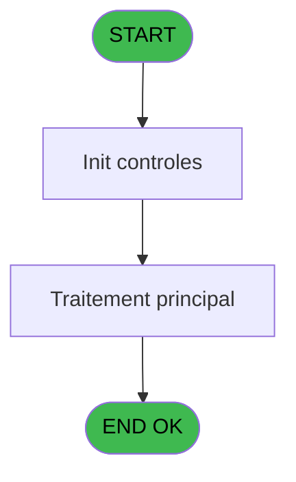
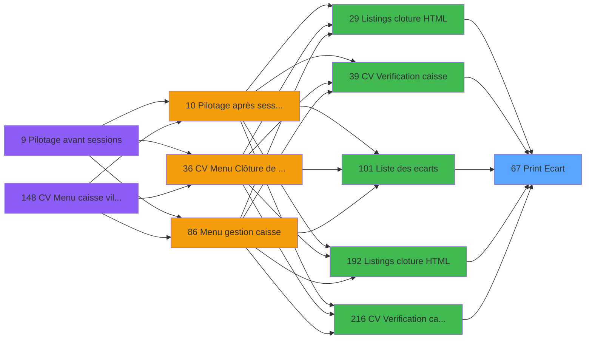

# VIL IDE 67 - Print Ecart

> **Analyse**: Phases 1-4 2026-02-03 09:05 -> 09:05 (21s) | Assemblage 09:05
> **Pipeline**: V7.2 Enrichi
> **Structure**: 4 onglets (Resume | Ecrans | Donnees | Connexions)

<!-- TAB:Resume -->

## 1. FICHE D'IDENTITE

| Attribut | Valeur |
|----------|--------|
| Projet | VIL |
| IDE Position | 67 |
| Nom Programme | Print Ecart |
| Fichier source | `Prg_67.xml` |
| Domaine metier | Impression |
| Taches | 1 (1 ecrans visibles) |
| Tables modifiees | 0 |
| Programmes appeles | 0 |

## 2. DESCRIPTION FONCTIONNELLE

**Print Ecart** assure la gestion complete de ce processus, accessible depuis [    Listings cloture HTML (IDE 29)](VIL-IDE-29.md), [CV  Verification caisse (IDE 39)](VIL-IDE-39.md), [Liste des ecarts (IDE 101)](VIL-IDE-101.md), [    Listings cloture HTML (IDE 192)](VIL-IDE-192.md), [CV  Verification caisse (IDE 216)](VIL-IDE-216.md), [    Listings cloture HTML (IDE 219)](VIL-IDE-219.md).

Le flux de traitement s'organise en **1 blocs fonctionnels** :

- **Traitement** (1 tache) : traitements metier divers

**Logique metier** : 2 regles identifiees couvrant conditions metier.

## 3. BLOCS FONCTIONNELS

### 3.1 Traitement (1 tache)

Traitements internes.

---

#### 67 - Veuillez patienter ....... [[ECRAN]](#ecran-t1)

**Role** : Traitement : Veuillez patienter ........
**Ecran** : 426 x 56 DLU (MDI) | [Voir mockup](#ecran-t1)

## 5. REGLES METIER

2 regles identifiees:

### Autres (2 regles)

#### [RM-001] Si P0 TRI cle 2 ou 3 [D]=2 alors MlsTrans ('DATE COMPTABLE') sinon MlsTrans ('DATE GENERATION'))

| Element | Detail |
|---------|--------|
| **Condition** | `P0 TRI cle 2 ou 3 [D]=2` |
| **Si vrai** | MlsTrans ('DATE COMPTABLE') |
| **Si faux** | MlsTrans ('DATE GENERATION')) |
| **Variables** | D (P0 TRI cle 2 ou 3) |
| **Expression source** | Expression 4 : `IF (P0 TRI cle 2 ou 3 [D]=2,MlsTrans ('DATE COMPTABLE'),MlsT` |
| **Exemple** | Si P0 TRI cle 2 ou 3 [D]=2 → MlsTrans ('DATE COMPTABLE'). Sinon → MlsTrans ('DATE GENERATION')) |

#### [RM-002] Condition toujours vraie (flag actif)

| Element | Detail |
|---------|--------|
| **Condition** | `P0 selection [H]=MlsTrans ('Reception')` |
| **Si vrai** | [S]='O' OR [S]='F' |
| **Si faux** | IF (P0 selection [H]=MlsTrans ('Coffre'),[S]='C','TRUE'LOG)) |
| **Variables** | H (P0 selection) |
| **Expression source** | Expression 17 : `IF (P0 selection [H]=MlsTrans ('Reception'),[S]='O' OR [S]='` |
| **Exemple** | Si P0 selection [H]=MlsTrans ('Reception') → [S]='O' OR [S]='F' |

## 6. CONTEXTE

- **Appele par**: [    Listings cloture HTML (IDE 29)](VIL-IDE-29.md), [CV  Verification caisse (IDE 39)](VIL-IDE-39.md), [Liste des ecarts (IDE 101)](VIL-IDE-101.md), [    Listings cloture HTML (IDE 192)](VIL-IDE-192.md), [CV  Verification caisse (IDE 216)](VIL-IDE-216.md), [    Listings cloture HTML (IDE 219)](VIL-IDE-219.md)
- **Appelle**: 0 programmes | **Tables**: 1 (W:0 R:1 L:0) | **Taches**: 1 | **Expressions**: 21

<!-- TAB:Ecrans -->

## 8. ECRANS

### 8.1 Forms visibles (1 / 1)

| # | Position | Tache | Nom | Type | Largeur | Hauteur | Bloc |
|---|----------|-------|-----|------|---------|---------|------|
| 1 | 67 | 67 | Veuillez patienter ....... | MDI | 426 | 56 | Traitement |

### 8.2 Mockups Ecrans

---

#### 67 - Veuillez patienter .......
**Tache** : [67](#t1) | **Type** : MDI | **Dimensions** : 426 x 56 DLU
**Bloc** : Traitement | **Titre IDE** : Veuillez patienter .......

<!-- FORM-DATA:
{
    "width":  426,
    "vFactor":  8,
    "type":  "MDI",
    "hFactor":  8,
    "controls":  [
                     {
                         "x":  3,
                         "type":  "label",
                         "var":  "",
                         "y":  0,
                         "w":  423,
                         "fmt":  "",
                         "name":  "",
                         "h":  29,
                         "color":  "",
                         "text":  "",
                         "parent":  null
                     },
                     {
                         "x":  120,
                         "type":  "label",
                         "var":  "",
                         "y":  10,
                         "w":  275,
                         "fmt":  "",
                         "name":  "",
                         "h":  8,
                         "color":  "7",
                         "text":  "Impression en cours",
                         "parent":  null
                     },
                     {
                         "x":  3,
                         "type":  "label",
                         "var":  "",
                         "y":  29,
                         "w":  423,
                         "fmt":  "",
                         "name":  "",
                         "h":  27,
                         "color":  "",
                         "text":  "",
                         "parent":  null
                     },
                     {
                         "x":  75,
                         "type":  "label",
                         "var":  "",
                         "y":  39,
                         "w":  331,
                         "fmt":  "",
                         "name":  "",
                         "h":  8,
                         "color":  "",
                         "text":  "Impression listing gratuites bar GO",
                         "parent":  null
                     },
                     {
                         "x":  4,
                         "type":  "image",
                         "var":  "",
                         "y":  2,
                         "w":  72,
                         "fmt":  "",
                         "name":  "",
                         "h":  25,
                         "color":  "",
                         "text":  "",
                         "parent":  null
                     }
                 ],
    "taskId":  "67",
    "height":  56
}
-->

## 9. NAVIGATION

Ecran unique: **Veuillez patienter .......**

### 9.3 Structure hierarchique (1 tache)

| Position | Tache | Type | Dimensions | Bloc |
|----------|-------|------|------------|------|
| **67.1** | [**Veuillez patienter .......** (67)](#t1) [mockup](#ecran-t1) | MDI | 426x56 | Traitement |

### 9.4 Algorigramme

> **Legende**: Vert = START/END OK | Rouge = END KO | Bleu = Decisions
> *Algorigramme auto-genere. Utiliser `/algorigramme` pour une synthese metier detaillee.*

<!-- TAB:Donnees -->

## 10. TABLES

### Tables utilisees (1)

| ID | Nom | Description | Type | R | W | L | Usages |
|----|-----|-------------|------|---|---|---|--------|
| 234 | ecarts |  | DB | R |   |   | 1 |

### Colonnes par table (1 / 1 tables avec colonnes identifiees)

Table 234 - ecarts (R) - 1 usages

| Lettre | Variable | Acces | Type |
|--------|----------|-------|------|
| A | P0 societe | R | Alpha |
| B | P0 masque cumul | R | Alpha |
| C | P0 nom du village | R | Alpha |
| D | P0 TRI cle 2 ou 3 | R | Numeric |
| E | P0 date 1 | R | Date |
| F | P0 date 2 | R | Date |
| G | P0 edition cloture auto | R | Logical |
| H | P0 selection | R | Alpha |
| I | W0 Total ecart | R | Numeric |

## 11. VARIABLES

### 11.1 Parametres entrants (8)

Variables recues du programme appelant ([    Listings cloture HTML (IDE 29)](VIL-IDE-29.md)).

| Lettre | Nom | Type | Usage dans |
|--------|-----|------|-----------|
| A | P0 societe | Alpha | - |
| B | P0 masque cumul | Alpha | 1x parametre entrant |
| C | P0 nom du village | Alpha | - |
| D | P0 TRI cle 2 ou 3 | Numeric | 6x parametre entrant |
| E | P0 date 1 | Date | 3x parametre entrant |
| F | P0 date 2 | Date | 2x parametre entrant |
| G | P0 edition cloture auto | Logical | 2x parametre entrant |
| H | P0 selection | Alpha | 2x parametre entrant |

### 11.2 Variables de travail (1)

Variables internes au programme.

| Lettre | Nom | Type | Usage dans |
|--------|-----|------|-----------|
| I | W0 Total ecart | Numeric | 1x calcul interne |

## 12. EXPRESSIONS

**21 / 21 expressions decodees (100%)**

### 12.1 Repartition par type

| Type | Expressions | Regles |
|------|-------------|--------|
| CALCULATION | 1 | 0 |
| CONCATENATION | 3 | 0 |
| CONDITION | 7 | 5 |
| CAST_LOGIQUE | 1 | 5 |
| OTHER | 9 | 0 |

### 12.2 Expressions cles par type

#### CALCULATION (1 expressions)

| Type | IDE | Expression | Regle |
|------|-----|------------|-------|
| CALCULATION | 9 | `W0 Total ecart [I]+[R]` | - |

#### CONCATENATION (3 expressions)

| Type | IDE | Expression | Regle |
|------|-----|------------|-------|
| CONCATENATION | 19 | `Trim (INIGet ('[MAGIC_LOGICAL_NAMES]club_exportdata')&'Cloture\Editions\Ecarts'&IF (P0 edition cloture auto [G],'_'&DStr (P0 date 1 [E],'YYYYMMDD'),'')&'.htm')` | - |
| CONCATENATION | 5 | `DStr (Date (),'DD/MM/YYYY')&' - '&TStr (Time (),'HH:MM:SS')` | - |
| CONCATENATION | 11 | `'- '&Str (Page (0,1),'3P0Z0')&' -'` | - |

#### CONDITION (7 expressions)

| Type | IDE | Expression | Regle |
|------|-----|------------|-------|
| CONDITION | 4 | `IF (P0 TRI cle 2 ou 3 [D]=2,MlsTrans ('DATE COMPTABLE'),MlsTrans ('DATE GENERATION'))` | [RM-001](#rm-RM-001) |
| CONDITION | 14 | `CndRange (P0 TRI cle 2 ou 3 [D]=2,P0 date 2 [F])` | - |
| CONDITION | 15 | `CndRange (P0 TRI cle 2 ou 3 [D]=3,P0 date 1 [E])` | - |
| CONDITION | 16 | `CndRange (P0 TRI cle 2 ou 3 [D]=3,P0 date 2 [F])` | - |
| CONDITION | 10 | `INIGet ('[MAGIC_LOGICAL_NAMES]preview')='O'` | - |
| ... | | *+2 autres* | |

#### CAST_LOGIQUE (1 expressions)

| Type | IDE | Expression | Regle |
|------|-----|------------|-------|
| CAST_LOGIQUE | 17 | `IF (P0 selection [H]=MlsTrans ('Reception'),[S]='O' OR [S]='F',IF (P0 selection [H]=MlsTrans ('Coffre'),[S]='C','TRUE'LOG))` | [RM-002](#rm-RM-002) |

#### OTHER (9 expressions)

| Type | IDE | Expression | Regle |
|------|-----|------------|-------|
| OTHER | 18 | `P0 selection [H]` | - |
| OTHER | 8 | `P0 masque cumul [B]` | - |
| OTHER | 21 | `GetParam ('DTCLOSURE')` | - |
| OTHER | 20 | `P0 edition cloture auto [G]` | - |
| OTHER | 7 | `SetCrsr (2)` | - |
| ... | | *+4 autres* | |

### 12.3 Toutes les expressions (21)

Voir les 21 expressions

#### CALCULATION (1)

| IDE | Expression Decodee |
|-----|-------------------|
| 9 | `W0 Total ecart [I]+[R]` |

#### CONCATENATION (3)

| IDE | Expression Decodee |
|-----|-------------------|
| 11 | `'- '&Str (Page (0,1),'3P0Z0')&' -'` |
| 5 | `DStr (Date (),'DD/MM/YYYY')&' - '&TStr (Time (),'HH:MM:SS')` |
| 19 | `Trim (INIGet ('[MAGIC_LOGICAL_NAMES]club_exportdata')&'Cloture\Editions\Ecarts'&IF (P0 edition cloture auto [G],'_'&DStr (P0 date 1 [E],'YYYYMMDD'),'')&'.htm')` |

#### CONDITION (7)

| IDE | Expression Decodee |
|-----|-------------------|
| 4 | `IF (P0 TRI cle 2 ou 3 [D]=2,MlsTrans ('DATE COMPTABLE'),MlsTrans ('DATE GENERATION'))` |
| 10 | `INIGet ('[MAGIC_LOGICAL_NAMES]preview')='O'` |
| 12 | `MlsTrans (IF ([S]='C','Coffre','Reception'))` |
| 13 | `CndRange (P0 TRI cle 2 ou 3 [D]=2,P0 date 1 [E])` |
| 14 | `CndRange (P0 TRI cle 2 ou 3 [D]=2,P0 date 2 [F])` |
| 15 | `CndRange (P0 TRI cle 2 ou 3 [D]=3,P0 date 1 [E])` |
| 16 | `CndRange (P0 TRI cle 2 ou 3 [D]=3,P0 date 2 [F])` |

#### CAST_LOGIQUE (1)

| IDE | Expression Decodee |
|-----|-------------------|
| 17 | `IF (P0 selection [H]=MlsTrans ('Reception'),[S]='O' OR [S]='F',IF (P0 selection [H]=MlsTrans ('Coffre'),[S]='C','TRUE'LOG))` |

#### OTHER (9)

| IDE | Expression Decodee |
|-----|-------------------|
| 1 | `P0 TRI cle 2 ou 3 [D]` |
| 2 | `MlsTrans ('Selection dates :')` |
| 3 | `MlsTrans ('Selection lieu :')` |
| 6 | `SetCrsr (1)` |
| 7 | `SetCrsr (2)` |
| 8 | `P0 masque cumul [B]` |
| 18 | `P0 selection [H]` |
| 20 | `P0 edition cloture auto [G]` |
| 21 | `GetParam ('DTCLOSURE')` |

<!-- TAB:Connexions -->

## 13. GRAPHE D'APPELS

### 13.1 Chaine depuis Main (Callers)

Main -> ... -> [    Listings cloture HTML (IDE 29)](VIL-IDE-29.md) -> **Print Ecart (IDE 67)**

Main -> ... -> [CV  Verification caisse (IDE 39)](VIL-IDE-39.md) -> **Print Ecart (IDE 67)**

Main -> ... -> [Liste des ecarts (IDE 101)](VIL-IDE-101.md) -> **Print Ecart (IDE 67)**

Main -> ... -> [    Listings cloture HTML (IDE 192)](VIL-IDE-192.md) -> **Print Ecart (IDE 67)**

Main -> ... -> [CV  Verification caisse (IDE 216)](VIL-IDE-216.md) -> **Print Ecart (IDE 67)**

Main -> ... -> [    Listings cloture HTML (IDE 219)](VIL-IDE-219.md) -> **Print Ecart (IDE 67)**

### 13.2 Callers

| IDE | Nom Programme | Nb Appels |
|-----|---------------|-----------|
| [29](VIL-IDE-29.md) |     Listings cloture HTML | 1 |
| [39](VIL-IDE-39.md) | CV  Verification caisse | 1 |
| [101](VIL-IDE-101.md) | Liste des ecarts | 1 |
| [192](VIL-IDE-192.md) |     Listings cloture HTML | 1 |
| [216](VIL-IDE-216.md) | CV  Verification caisse | 1 |
| [219](VIL-IDE-219.md) |     Listings cloture HTML | 1 |

### 13.3 Callees (programmes appeles)

### 13.4 Detail Callees avec contexte

| IDE | Nom Programme | Appels | Contexte |
|-----|---------------|--------|----------|
| - | (aucun) | - | - |

## 14. RECOMMANDATIONS MIGRATION

### 14.1 Profil du programme

| Metrique | Valeur | Impact migration |
|----------|--------|-----------------|
| Lignes de logique | 34 | Programme compact |
| Expressions | 21 | Peu de logique |
| Tables WRITE | 0 | Impact faible |
| Sous-programmes | 0 | Peu de dependances |
| Ecrans visibles | 1 | Ecran unique ou traitement batch |
| Code desactive | 0% (0 / 34) | Code sain |
| Regles metier | 2 | Quelques regles a preserver |

### 14.2 Plan de migration par bloc

#### Traitement (1 tache: 1 ecran, 0 traitement)

- **Strategie** : 1 composant(s) UI (Razor/React) avec formulaires et validation.
- Decomposer les taches en services unitaires testables.

### 14.3 Dependances critiques

| Dependance | Type | Appels | Impact |
|------------|------|--------|--------|

---
*Spec DETAILED generee par Pipeline V7.2 - 2026-02-03 09:05*
