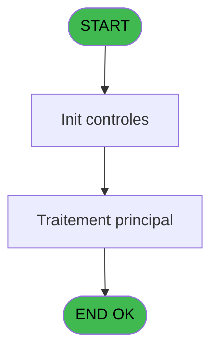
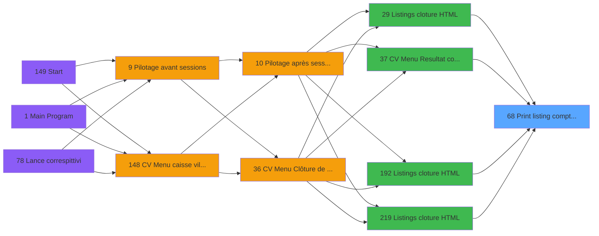

# VIL IDE 68 - Print listing comptable

> **Analyse**: Phases 1-4 2026-02-03 09:05 -> 09:05 (21s) | Assemblage 09:05
> **Pipeline**: V7.2 Enrichi
> **Structure**: 4 onglets (Resume | Ecrans | Donnees | Connexions)

<!-- TAB:Resume -->

## 1. FICHE D'IDENTITE

| Attribut | Valeur |
|----------|--------|
| Projet | VIL |
| IDE Position | 68 |
| Nom Programme | Print listing comptable |
| Fichier source | `Prg_68.xml` |
| Domaine metier | Impression |
| Taches | 1 (1 ecrans visibles) |
| Tables modifiees | 0 |
| Programmes appeles | 1 |

## 2. DESCRIPTION FONCTIONNELLE

**Print listing comptable** assure la gestion complete de ce processus, accessible depuis [    Listings cloture HTML (IDE 29)](VIL-IDE-29.md), [CV Menu Resultat comptable (IDE 37)](VIL-IDE-37.md), [    Listings cloture HTML (IDE 192)](VIL-IDE-192.md), [    Listings cloture HTML (IDE 219)](VIL-IDE-219.md).

Le flux de traitement s'organise en **1 blocs fonctionnels** :

- **Traitement** (1 tache) : traitements metier divers

**Logique metier** : 12 regles identifiees couvrant conditions metier.

## 3. BLOCS FONCTIONNELS

### 3.1 Traitement (1 tache)

Traitements internes.

---

#### 68 - Veuillez patienter ..... [[ECRAN]](#ecran-t1)

**Role** : Traitement : Veuillez patienter ......
**Ecran** : 422 x 56 DLU (MDI) | [Voir mockup](#ecran-t1)

## 5. REGLES METIER

12 regles identifiees:

### Autres (12 regles)

#### [RM-001] Si [X]='A' alors 'annul' sinon '')

| Element | Detail |
|---------|--------|
| **Condition** | `[X]='A'` |
| **Si vrai** | 'annul' |
| **Si faux** | '') |
| **Expression source** | Expression 9 : `IF ([X]='A','annul','')` |
| **Exemple** | Si [X]='A' → 'annul'. Sinon → '') |

#### [RM-002] Traitement conditionnel si [AA]> est a zero

| Element | Detail |
|---------|--------|
| **Condition** | `[AA]>=0` |
| **Si vrai** | [AA] |
| **Si faux** | 0) |
| **Expression source** | Expression 10 : `IF ([AA]>=0,[AA],0)` |
| **Exemple** | Si [AA]>=0 → [AA]. Sinon → 0) |

#### [RM-003] Si [AA]<0 alors ABS ([AA]) sinon 0)

| Element | Detail |
|---------|--------|
| **Condition** | `[AA]<0` |
| **Si vrai** | ABS ([AA]) |
| **Si faux** | 0) |
| **Expression source** | Expression 11 : `IF ([AA]<0,ABS ([AA]),0)` |
| **Exemple** | Si [AA]<0 → ABS ([AA]). Sinon → 0) |

#### [RM-004] Traitement conditionnel si P0 resultat J [D]> est a zero

| Element | Detail |
|---------|--------|
| **Condition** | `P0 resultat J [D]>=0` |
| **Si vrai** | P0 resultat J [D] |
| **Si faux** | 0) |
| **Variables** | D (P0 resultat J) |
| **Expression source** | Expression 24 : `IF (P0 resultat J [D]>=0,P0 resultat J [D],0)` |
| **Exemple** | Si P0 resultat J [D]>=0 → P0 resultat J [D]. Sinon → 0) |

#### [RM-005] Si P0 resultat J [D]<0 alors P0 resultat J [D] sinon 0)

| Element | Detail |
|---------|--------|
| **Condition** | `P0 resultat J [D]<0` |
| **Si vrai** | P0 resultat J [D] |
| **Si faux** | 0) |
| **Variables** | D (P0 resultat J) |
| **Expression source** | Expression 25 : `IF (P0 resultat J [D]<0,P0 resultat J [D],0)` |
| **Exemple** | Si P0 resultat J [D]<0 → P0 resultat J [D]. Sinon → 0) |

#### [RM-006] Si W0 heure listing [K]<>0 AND W0 cumul cr ss-imput [L]<>0 alors IF (W0 heure listing [K]+W0 cumul cr ss-imput [L]<0 sinon '(DB '&LTrim (RTrim (Str (ABS (W0 heure listing [K]+W0 cumul cr ss-imput [L]),P0 masque cumul [B])))&')','(CR '&LTrim (RTrim (Str (ABS (W0 heure listing [K]+W0 cumul cr ss-imput [L]),P0 masque cumul [B])))&')'),Fill ('.',22))

| Element | Detail |
|---------|--------|
| **Condition** | `W0 heure listing [K]<>0 AND W0 cumul cr ss-imput [L]<>0` |
| **Si vrai** | IF (W0 heure listing [K]+W0 cumul cr ss-imput [L]<0 |
| **Si faux** | '(DB '&LTrim (RTrim (Str (ABS (W0 heure listing [K]+W0 cumul cr ss-imput [L]),P0 masque cumul [B])))&')','(CR '&LTrim (RTrim (Str (ABS (W0 heure listing [K]+W0 cumul cr ss-imput [L]),P0 masque cumul [B])))&')'),Fill ('.',22)) |
| **Variables** | B (P0 masque cumul), K (W0 heure listing), L (W0 cumul cr ss-imput) |
| **Expression source** | Expression 26 : `IF (W0 heure listing [K]<>0 AND W0 cumul cr ss-imput [L]<>0,` |
| **Exemple** | Si W0 heure listing [K]<>0 AND W0 cumul cr ss-imput [L]<>0 → IF (W0 heure listing [K]+W0 cumul cr ss-imput [L]<0 |

#### [RM-007] Si W0 cumul db ss-imput [M]<>0 AND W0 cumul cr imput [N]<>0 alors IF (W0 cumul db ss-imput [M]+W0 cumul cr imput [N]<0 sinon '(DB '&LTrim (RTrim (Str (ABS (W0 cumul db ss-imput [M]+W0 cumul cr imput [N]),P0 masque cumul [B])))&')','(CR '&LTrim (RTrim (Str (ABS (W0 cumul db ss-imput [M]+W0 cumul cr imput [N]),P0 masque cumul [B])))&')'),Fill ('.',22))

| Element | Detail |
|---------|--------|
| **Condition** | `W0 cumul db ss-imput [M]<>0 AND W0 cumul cr imput [N]<>0` |
| **Si vrai** | IF (W0 cumul db ss-imput [M]+W0 cumul cr imput [N]<0 |
| **Si faux** | '(DB '&LTrim (RTrim (Str (ABS (W0 cumul db ss-imput [M]+W0 cumul cr imput [N]),P0 masque cumul [B])))&')','(CR '&LTrim (RTrim (Str (ABS (W0 cumul db ss-imput [M]+W0 cumul cr imput [N]),P0 masque cumul [B])))&')'),Fill ('.',22)) |
| **Variables** | B (P0 masque cumul), M (W0 cumul db ss-imput), N (W0 cumul cr imput) |
| **Expression source** | Expression 27 : `IF (W0 cumul db ss-imput [M]<>0 AND W0 cumul cr imput [N]<>0` |
| **Exemple** | Si W0 cumul db ss-imput [M]<>0 AND W0 cumul cr imput [N]<>0 → IF (W0 cumul db ss-imput [M]+W0 cumul cr imput [N]<0 |

#### [RM-008] Si [Y]='V' OR [DT]='V' alors [Z] sinon W0 total retrait NON CASH [V])

| Element | Detail |
|---------|--------|
| **Condition** | `[Y]='V' OR [DT]='V'` |
| **Si vrai** | [Z] |
| **Si faux** | W0 total retrait NON CASH [V]) |
| **Variables** | V (W0 total retrait NON CASH) |
| **Expression source** | Expression 47 : `IF ([Y]='V' OR [DT]='V',[Z],W0 total retrait NON CASH [V])` |
| **Exemple** | Si [Y]='V' OR [DT]='V' → [Z]. Sinon → W0 total retrait NON CASH [V]) |

#### [RM-009] Si [DT] vaut 'C' alors 'COMPTABLE', sinon 'VENTE'

| Element | Detail |
|---------|--------|
| **Condition** | `[DT]='C'` |
| **Si vrai** | 'COMPTABLE' |
| **Si faux** | 'VENTE') |
| **Expression source** | Expression 56 : `IF([DT]='C','COMPTABLE','VENTE')` |
| **Exemple** | Si [DT]='C' → 'COMPTABLE'. Sinon → 'VENTE') |

#### [RM-010] Traitement si Trim([AH]) est renseigne

| Element | Detail |
|---------|--------|
| **Condition** | `Trim([AH])<>''` |
| **Si vrai** | [AH] |
| **Si faux** | [AO]) |
| **Expression source** | Expression 69 : `IF(Trim([AH])<>'',[AH],[AO])` |
| **Exemple** | Si Trim([AH])<>'' → [AH]. Sinon → [AO]) |

#### [RM-011] Traitement si Trim([AI]) est renseigne

| Element | Detail |
|---------|--------|
| **Condition** | `Trim([AI])<>''` |
| **Si vrai** | [AI] |
| **Si faux** | [AP]) |
| **Expression source** | Expression 70 : `IF(Trim([AI])<>'',[AI],[AP])` |
| **Exemple** | Si Trim([AI])<>'' → [AI]. Sinon → [AP]) |

#### [RM-012] Traitement si Trim([AS]) est renseigne

| Element | Detail |
|---------|--------|
| **Condition** | `Trim([AS])<>''` |
| **Si vrai** | [AS] |
| **Si faux** | [DR]) |
| **Expression source** | Expression 71 : `IF(Trim([AS])<>'',[AS],[DR])` |
| **Exemple** | Si Trim([AS])<>'' → [AS]. Sinon → [DR]) |

## 6. CONTEXTE

- **Appele par**: [    Listings cloture HTML (IDE 29)](VIL-IDE-29.md), [CV Menu Resultat comptable (IDE 37)](VIL-IDE-37.md), [    Listings cloture HTML (IDE 192)](VIL-IDE-192.md), [    Listings cloture HTML (IDE 219)](VIL-IDE-219.md)
- **Appelle**: 1 programmes | **Tables**: 5 (W:0 R:1 L:4) | **Taches**: 1 | **Expressions**: 73

<!-- TAB:Ecrans -->

## 8. ECRANS

### 8.1 Forms visibles (1 / 1)

| # | Position | Tache | Nom | Type | Largeur | Hauteur | Bloc |
|---|----------|-------|-----|------|---------|---------|------|
| 1 | 68 | 68 | Veuillez patienter ..... | MDI | 422 | 56 | Traitement |

### 8.2 Mockups Ecrans

---

#### 68 - Veuillez patienter .....
**Tache** : [68](#t1) | **Type** : MDI | **Dimensions** : 422 x 56 DLU
**Bloc** : Traitement | **Titre IDE** : Veuillez patienter .....

<!-- FORM-DATA:
{
    "width":  422,
    "vFactor":  8,
    "type":  "MDI",
    "hFactor":  8,
    "controls":  [
                     {
                         "x":  0,
                         "type":  "label",
                         "var":  "",
                         "y":  0,
                         "w":  423,
                         "fmt":  "",
                         "name":  "",
                         "h":  29,
                         "color":  "",
                         "text":  "",
                         "parent":  null
                     },
                     {
                         "x":  117,
                         "type":  "label",
                         "var":  "",
                         "y":  10,
                         "w":  275,
                         "fmt":  "",
                         "name":  "",
                         "h":  8,
                         "color":  "7",
                         "text":  "Impression en cours",
                         "parent":  null
                     },
                     {
                         "x":  0,
                         "type":  "label",
                         "var":  "",
                         "y":  29,
                         "w":  423,
                         "fmt":  "",
                         "name":  "",
                         "h":  27,
                         "color":  "",
                         "text":  "",
                         "parent":  null
                     },
                     {
                         "x":  70,
                         "type":  "label",
                         "var":  "",
                         "y":  39,
                         "w":  282,
                         "fmt":  "",
                         "name":  "",
                         "h":  8,
                         "color":  "",
                         "text":  "Impression listing comptable",
                         "parent":  null
                     },
                     {
                         "x":  1,
                         "type":  "image",
                         "var":  "",
                         "y":  2,
                         "w":  72,
                         "fmt":  "",
                         "name":  "",
                         "h":  25,
                         "color":  "",
                         "text":  "",
                         "parent":  null
                     }
                 ],
    "taskId":  "68",
    "height":  56
}
-->

## 9. NAVIGATION

Ecran unique: **Veuillez patienter .....**

### 9.3 Structure hierarchique (1 tache)

| Position | Tache | Type | Dimensions | Bloc |
|----------|-------|------|------------|------|
| **68.1** | [**Veuillez patienter .....** (68)](#t1) [mockup](#ecran-t1) | MDI | 422x56 | Traitement |

### 9.4 Algorigramme

> **Legende**: Vert = START/END OK | Rouge = END KO | Bleu = Decisions
> *Algorigramme auto-genere. Utiliser `/algorigramme` pour une synthese metier detaillee.*

<!-- TAB:Donnees -->

## 10. TABLES

### Tables utilisees (5)

| ID | Nom | Description | Type | R | W | L | Usages |
|----|-----|-------------|------|---|---|---|--------|
| 30 | gm-recherche_____gmr | Index de recherche | DB | R |   |   | 1 |
| 65 | comptes_recette__cre | Comptes GM (generaux) | DB |   |   | L | 1 |
| 209 | plan_comptable_central |  | DB |   |   | L | 1 |
| 553 | import_logement__iml |  | DB |   |   | L | 1 |
| 892 | Boo_CategoriesProduit |  | DB |   |   | L | 1 |

### Colonnes par table (3 / 1 tables avec colonnes identifiees)

Table 30 - gm-recherche_____gmr (R) - 1 usages

| Lettre | Variable | Acces | Type |
|--------|----------|-------|------|
| A | P0 societe | R | Alpha |
| B | P0 masque cumul | R | Alpha |
| C | P0 date comptable | R | Date |
| D | P0 resultat J | R | Numeric |
| E | P0 nom village | R | Alpha |
| F | P0 UNI/BI | R | Alpha |
| G | P0 Sortie HTML | R | Logical |
| H | P0 Comptable C / Vente V | R | Alpha |
| I | W0 config imp | R | Alpha |
| J | W0 date listing | R | Date |
| K | W0 heure listing | R | Time |
| L | W0 cumul cr ss-imput | R | Numeric |
| M | W0 cumul db ss-imput | R | Numeric |
| N | W0 cumul cr imput | R | Numeric |
| O | W0 cumul db imput | R | Numeric |
| P | v.retour GM | R | Logical |
| Q | v.compte recette sous imputatio | R | Logical |
| R | W0 Classe | R | Alpha |
| S | W0 total versement CASH | R | Numeric |
| T | W0 total versement NON CASH | R | Numeric |
| U | W0 total retrait CASH | R | Numeric |
| V | W0 total retrait NON CASH | R | Numeric |

## 11. VARIABLES

### 11.1 Parametres entrants (8)

Variables recues du programme appelant ([    Listings cloture HTML (IDE 29)](VIL-IDE-29.md)).

| Lettre | Nom | Type | Usage dans |
|--------|-----|------|-----------|
| A | P0 societe | Alpha | 1x parametre entrant |
| B | P0 masque cumul | Alpha | 3x parametre entrant |
| C | P0 date comptable | Date | 2x parametre entrant |
| D | P0 resultat J | Numeric | 3x parametre entrant |
| E | P0 nom village | Alpha | - |
| F | P0 UNI/BI | Alpha | - |
| G | P0 Sortie HTML | Logical | 3x parametre entrant |
| H | P0 Comptable C / Vente V | Alpha | - |

### 11.2 Variables de session (2)

Variables persistantes pendant toute la session.

| Lettre | Nom | Type | Usage dans |
|--------|-----|------|-----------|
| P | v.retour GM | Logical | - |
| Q | v.compte recette sous imputatio | Logical | - |

### 11.3 Variables de travail (12)

Variables internes au programme.

| Lettre | Nom | Type | Usage dans |
|--------|-----|------|-----------|
| I | W0 config imp | Alpha | - |
| J | W0 date listing | Date | - |
| K | W0 heure listing | Time | 2x calcul interne |
| L | W0 cumul cr ss-imput | Numeric | 3x calcul interne |
| M | W0 cumul db ss-imput | Numeric | 2x calcul interne |
| N | W0 cumul cr imput | Numeric | 3x calcul interne |
| O | W0 cumul db imput | Numeric | - |
| R | W0 Classe | Alpha | 1x calcul interne |
| S | W0 total versement CASH | Numeric | 3x calcul interne |
| T | W0 total versement NON CASH | Numeric | - |
| U | W0 total retrait CASH | Numeric | - |
| V | W0 total retrait NON CASH | Numeric | 1x calcul interne |

Toutes les 22 variables (liste complete)

| Cat | Lettre | Nom Variable | Type |
|-----|--------|--------------|------|
| P0 | **A** | P0 societe | Alpha |
| P0 | **B** | P0 masque cumul | Alpha |
| P0 | **C** | P0 date comptable | Date |
| P0 | **D** | P0 resultat J | Numeric |
| P0 | **E** | P0 nom village | Alpha |
| P0 | **F** | P0 UNI/BI | Alpha |
| P0 | **G** | P0 Sortie HTML | Logical |
| P0 | **H** | P0 Comptable C / Vente V | Alpha |
| W0 | **I** | W0 config imp | Alpha |
| W0 | **J** | W0 date listing | Date |
| W0 | **K** | W0 heure listing | Time |
| W0 | **L** | W0 cumul cr ss-imput | Numeric |
| W0 | **M** | W0 cumul db ss-imput | Numeric |
| W0 | **N** | W0 cumul cr imput | Numeric |
| W0 | **O** | W0 cumul db imput | Numeric |
| W0 | **R** | W0 Classe | Alpha |
| W0 | **S** | W0 total versement CASH | Numeric |
| W0 | **T** | W0 total versement NON CASH | Numeric |
| W0 | **U** | W0 total retrait CASH | Numeric |
| W0 | **V** | W0 total retrait NON CASH | Numeric |
| V. | **P** | v.retour GM | Logical |
| V. | **Q** | v.compte recette sous imputatio | Logical |

## 12. EXPRESSIONS

**73 / 73 expressions decodees (100%)**

### 12.1 Repartition par type

| Type | Expressions | Regles |
|------|-------------|--------|
| CALCULATION | 10 | 0 |
| CONCATENATION | 5 | 2 |
| CALCUL | 1 | 0 |
| CONDITION | 24 | 10 |
| CONSTANTE | 4 | 0 |
| DATE | 1 | 0 |
| OTHER | 23 | 0 |
| CAST_LOGIQUE | 2 | 0 |
| STRING | 1 | 0 |
| FORMAT | 2 | 0 |

### 12.2 Expressions cles par type

#### CALCULATION (10 expressions)

| Type | IDE | Expression | Regle |
|------|-----|------------|-------|
| CALCULATION | 36 | `[AV]+[AA]` | - |
| CALCULATION | 35 | `[AU]+[AA]` | - |
| CALCULATION | 37 | `[AW]+[AA]` | - |
| CALCULATION | 63 | `-1*[AA]` | - |
| CALCULATION | 38 | `[AX]+[AA]` | - |
| ... | | *+5 autres* | |

#### CONCATENATION (5 expressions)

| Type | IDE | Expression | Regle |
|------|-----|------------|-------|
| CONCATENATION | 26 | `IF (W0 heure listing [K]<>0 AND W0 cumul cr ss-imput [L]<>0,IF (W0 heure listing [K]+W0 cumul cr ss-imput [L]<0,'(DB '&LTrim (RTrim (Str (ABS (W0 heure listing [K]+W0 cumul cr ss-imput [L]),P0 masque cumul [B])))&')','(CR '&LTrim (RTrim (Str (ABS (W0 heure listing [K]+W0 cumul cr ss-imput [L]),P0 masque cumul [B])))&')'),Fill ('.',22))` | [RM-006](#rm-RM-006) |
| CONCATENATION | 27 | `IF (W0 cumul db ss-imput [M]<>0 AND W0 cumul cr imput [N]<>0,IF (W0 cumul db ss-imput [M]+W0 cumul cr imput [N]<0,'(DB '&LTrim (RTrim (Str (ABS (W0 cumul db ss-imput [M]+W0 cumul cr imput [N]),P0 masque cumul [B])))&')','(CR '&LTrim (RTrim (Str (ABS (W0 cumul db ss-imput [M]+W0 cumul cr imput [N]),P0 masque cumul [B])))&')'),Fill ('.',22))` | [RM-007](#rm-RM-007) |
| CONCATENATION | 73 | `'LISTING '&ExpCalc('57'EXP)&' DU'` | - |
| CONCATENATION | 49 | `Trim (INIGet ('[MAGIC_LOGICAL_NAMES]club_exportdata')&'Cloture\Editions\'&IF([DT]='C','Comptable','Ventes')&IF (P0 Sortie HTML [G],'_'&DStr (P0 date comptable [C],'YYYYMMDD'),'')&'.htm')` | - |
| CONCATENATION | 29 | `'- '&Str (Page (0,1),'3P0Z0')&' -'` | - |

#### CALCUL (1 expressions)

| Type | IDE | Expression | Regle |
|------|-----|------------|-------|
| CALCUL | 62 | `-1*[AA]/(1+[DJ]/100)` | - |

#### CONDITION (24 expressions)

| Type | IDE | Expression | Regle |
|------|-----|------------|-------|
| CONDITION | 56 | `IF([DT]='C','COMPTABLE','VENTE')` | [RM-009](#rm-RM-009) |
| CONDITION | 47 | `IF ([Y]='V' OR [DT]='V',[Z],W0 total retrait NON CASH [V])` | [RM-008](#rm-RM-008) |
| CONDITION | 69 | `IF(Trim([AH])<>'',[AH],[AO])` | [RM-010](#rm-RM-010) |
| CONDITION | 71 | `IF(Trim([AS])<>'',[AS],[DR])` | [RM-012](#rm-RM-012) |
| CONDITION | 70 | `IF(Trim([AI])<>'',[AI],[AP])` | [RM-011](#rm-RM-011) |
| ... | | *+19 autres* | |

#### CONSTANTE (4 expressions)

| Type | IDE | Expression | Regle |
|------|-----|------------|-------|
| CONSTANTE | 57 | `'SOLDE'` | - |
| CONSTANTE | 72 | `0` | - |
| CONSTANTE | 17 | `0` | - |
| CONSTANTE | 53 | `''` | - |

#### DATE (1 expressions)

| Type | IDE | Expression | Regle |
|------|-----|------------|-------|
| DATE | 5 | `Date ()` | - |

#### OTHER (23 expressions)

| Type | IDE | Expression | Regle |
|------|-----|------------|-------|
| OTHER | 55 | `'Sous total '&ExpCalc ('26'EXP)` | - |
| OTHER | 58 | `VG23 AND P0 Sortie HTML [G]` | - |
| OTHER | 50 | `P0 Sortie HTML [G]` | - |
| OTHER | 41 | `ABS ([AW])` | - |
| OTHER | 42 | `ABS ([AX])` | - |
| ... | | *+18 autres* | |

#### CAST_LOGIQUE (2 expressions)

| Type | IDE | Expression | Regle |
|------|-----|------------|-------|
| CAST_LOGIQUE | 52 | `'TRUE'LOG` | - |
| CAST_LOGIQUE | 51 | `'FALSE'LOG` | - |

#### STRING (1 expressions)

| Type | IDE | Expression | Regle |
|------|-----|------------|-------|
| STRING | 54 | `'Sous imputation '&Str (W0 total versement NON... [T],'3P0Z0')` | - |

#### FORMAT (2 expressions)

| Type | IDE | Expression | Regle |
|------|-----|------------|-------|
| FORMAT | 67 | `Val(Right(Str(W0 total versement CASH [S],'9'),3),'3')` | - |
| FORMAT | 66 | `Val(Left(Str(W0 total versement CASH [S],'9'),6),'6')` | - |

### 12.3 Toutes les expressions (73)

Voir les 73 expressions

#### CALCULATION (10)

| IDE | Expression Decodee |
|-----|-------------------|
| 14 | `P0 resultat J [D]+[AA]` |
| 18 | `W0 heure listing [K]+[AA]` |
| 20 | `W0 cumul cr ss-imput [L]+[AA]` |
| 22 | `W0 cumul db ss-imput [M]+[AA]` |
| 23 | `W0 cumul cr imput [N]+[AA]` |
| 35 | `[AU]+[AA]` |
| 36 | `[AV]+[AA]` |
| 37 | `[AW]+[AA]` |
| 38 | `[AX]+[AA]` |
| 63 | `-1*[AA]` |

#### CONCATENATION (5)

| IDE | Expression Decodee |
|-----|-------------------|
| 29 | `'- '&Str (Page (0,1),'3P0Z0')&' -'` |
| 26 | `IF (W0 heure listing [K]<>0 AND W0 cumul cr ss-imput [L]<>0,IF (W0 heure listing [K]+W0 cumul cr ss-imput [L]<0,'(DB '&LTrim (RTrim (Str (ABS (W0 heure listing [K]+W0 cumul cr ss-imput [L]),P0 masque cumul [B])))&')','(CR '&LTrim (RTrim (Str (ABS (W0 heure listing [K]+W0 cumul cr ss-imput [L]),P0 masque cumul [B])))&')'),Fill ('.',22))` |
| 27 | `IF (W0 cumul db ss-imput [M]<>0 AND W0 cumul cr imput [N]<>0,IF (W0 cumul db ss-imput [M]+W0 cumul cr imput [N]<0,'(DB '&LTrim (RTrim (Str (ABS (W0 cumul db ss-imput [M]+W0 cumul cr imput [N]),P0 masque cumul [B])))&')','(CR '&LTrim (RTrim (Str (ABS (W0 cumul db ss-imput [M]+W0 cumul cr imput [N]),P0 masque cumul [B])))&')'),Fill ('.',22))` |
| 49 | `Trim (INIGet ('[MAGIC_LOGICAL_NAMES]club_exportdata')&'Cloture\Editions\'&IF([DT]='C','Comptable','Ventes')&IF (P0 Sortie HTML [G],'_'&DStr (P0 date comptable [C],'YYYYMMDD'),'')&'.htm')` |
| 73 | `'LISTING '&ExpCalc('57'EXP)&' DU'` |

#### CALCUL (1)

| IDE | Expression Decodee |
|-----|-------------------|
| 62 | `-1*[AA]/(1+[DJ]/100)` |

#### CONDITION (24)

| IDE | Expression Decodee |
|-----|-------------------|
| 9 | `IF ([X]='A','annul','')` |
| 10 | `IF ([AA]>=0,[AA],0)` |
| 11 | `IF ([AA]<0,ABS ([AA]),0)` |
| 24 | `IF (P0 resultat J [D]>=0,P0 resultat J [D],0)` |
| 25 | `IF (P0 resultat J [D]<0,P0 resultat J [D],0)` |
| 47 | `IF ([Y]='V' OR [DT]='V',[Z],W0 total retrait NON CASH [V])` |
| 56 | `IF([DT]='C','COMPTABLE','VENTE')` |
| 69 | `IF(Trim([AH])<>'',[AH],[AO])` |
| 70 | `IF(Trim([AI])<>'',[AI],[AP])` |
| 71 | `IF(Trim([AS])<>'',[AS],[DR])` |
| 19 | `[AA]>=0` |
| 21 | `[AA]<0` |
| 28 | `INIGet ('[MAGIC_LOGICAL_NAMES]preview')='O'` |
| 31 | `CndRange(W0 total versement NON... [T]<>0,W0 total versement NON... [T])` |
| 32 | `[Y]='V'` |
| 33 | `[AA]>=0` |
| 34 | `[AA]<0` |
| 39 | `[AT]='$CASH'` |
| 40 | `[AT]<>'$CASH'` |
| 43 | `[AU]<>0` |
| 44 | `[AV]<>0` |
| 45 | `[AW]<>0` |
| 46 | `[AX]<>0` |
| 48 | `[AU]<>0 OR [AV]<>0 OR [AW]<>0 OR [AX]<>0` |

#### CONSTANTE (4)

| IDE | Expression Decodee |
|-----|-------------------|
| 17 | `0` |
| 53 | `''` |
| 57 | `'SOLDE'` |
| 72 | `0` |

#### DATE (1)

| IDE | Expression Decodee |
|-----|-------------------|
| 5 | `Date ()` |

#### OTHER (23)

| IDE | Expression Decodee |
|-----|-------------------|
| 1 | `GetParam ('DTCLOSURE')` |
| 2 | `SetCrsr (1)` |
| 3 | `SetCrsr (2)` |
| 4 | `P0 societe [A]` |
| 6 | `Time ()` |
| 7 | `P0 date comptable [C]` |
| 8 | `P0 masque cumul [B]` |
| 12 | `ABS (W0 cumul cr ss-imput [L])` |
| 13 | `ABS (W0 cumul cr imput [N])` |
| 15 | `v.compte recette sous ... [Q]` |
| 16 | `W0 Classe [R]` |
| 30 | `W0 total versement CASH [S]` |
| 41 | `ABS ([AW])` |
| 42 | `ABS ([AX])` |
| 50 | `P0 Sortie HTML [G]` |
| 55 | `'Sous total '&ExpCalc ('26'EXP)` |
| 58 | `VG23 AND P0 Sortie HTML [G]` |
| 59 | `[DF]` |
| 60 | `[DG]` |
| 61 | `[DK]` |
| 64 | `[DJ]` |
| 65 | `NOT([DL])` |
| 68 | `NOT([DM])` |

#### CAST_LOGIQUE (2)

| IDE | Expression Decodee |
|-----|-------------------|
| 51 | `'FALSE'LOG` |
| 52 | `'TRUE'LOG` |

#### STRING (1)

| IDE | Expression Decodee |
|-----|-------------------|
| 54 | `'Sous imputation '&Str (W0 total versement NON... [T],'3P0Z0')` |

#### FORMAT (2)

| IDE | Expression Decodee |
|-----|-------------------|
| 66 | `Val(Left(Str(W0 total versement CASH [S],'9'),6),'6')` |
| 67 | `Val(Right(Str(W0 total versement CASH [S],'9'),3),'3')` |

<!-- TAB:Connexions -->

## 13. GRAPHE D'APPELS

### 13.1 Chaine depuis Main (Callers)

Main -> ... -> [    Listings cloture HTML (IDE 29)](VIL-IDE-29.md) -> **Print listing comptable (IDE 68)**

Main -> ... -> [CV Menu Resultat comptable (IDE 37)](VIL-IDE-37.md) -> **Print listing comptable (IDE 68)**

Main -> ... -> [    Listings cloture HTML (IDE 192)](VIL-IDE-192.md) -> **Print listing comptable (IDE 68)**

Main -> ... -> [    Listings cloture HTML (IDE 219)](VIL-IDE-219.md) -> **Print listing comptable (IDE 68)**

### 13.2 Callers

| IDE | Nom Programme | Nb Appels |
|-----|---------------|-----------|
| [29](VIL-IDE-29.md) |     Listings cloture HTML | 2 |
| [37](VIL-IDE-37.md) | CV Menu Resultat comptable | 1 |
| [192](VIL-IDE-192.md) |     Listings cloture HTML | 1 |
| [219](VIL-IDE-219.md) |     Listings cloture HTML | 1 |

### 13.3 Callees (programmes appeles)

### 13.4 Detail Callees avec contexte

| IDE | Nom Programme | Appels | Contexte |
|-----|---------------|--------|----------|
| [120](VIL-IDE-120.md) | Recup Classe et Lib du MOP | 1 | Recuperation donnees |

## 14. RECOMMANDATIONS MIGRATION

### 14.1 Profil du programme

| Metrique | Valeur | Impact migration |
|----------|--------|-----------------|
| Lignes de logique | 152 | Programme compact |
| Expressions | 73 | Logique moderee |
| Tables WRITE | 0 | Impact faible |
| Sous-programmes | 1 | Peu de dependances |
| Ecrans visibles | 1 | Ecran unique ou traitement batch |
| Code desactive | 0% (0 / 152) | Code sain |
| Regles metier | 12 | Logique metier riche |

### 14.2 Plan de migration par bloc

#### Traitement (1 tache: 1 ecran, 0 traitement)

- **Strategie** : 1 composant(s) UI (Razor/React) avec formulaires et validation.
- 1 sous-programme(s) a migrer ou a reutiliser depuis les services existants.
- Decomposer les taches en services unitaires testables.

### 14.3 Dependances critiques

| Dependance | Type | Appels | Impact |
|------------|------|--------|--------|
| [Recup Classe et Lib du MOP (IDE 120)](VIL-IDE-120.md) | Sous-programme | 1x | Normale - Recuperation donnees |

---
*Spec DETAILED generee par Pipeline V7.2 - 2026-02-03 09:05*
