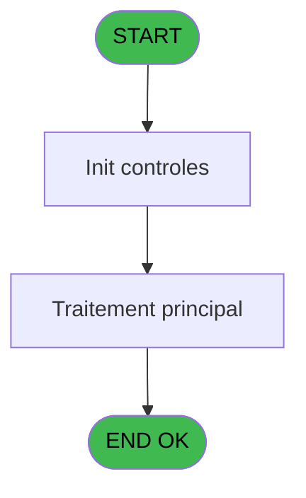
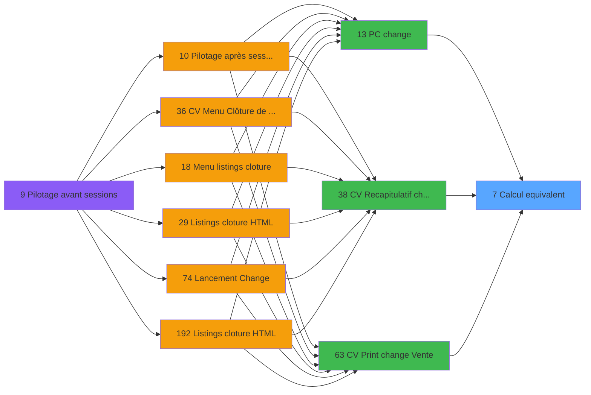

# VIL IDE 7 - Calcul equivalent

> **Analyse**: Phases 1-4 2026-02-03 00:54 -> 00:55 (36s) | Assemblage 00:55
> **Pipeline**: V7.2 Enrichi
> **Structure**: 4 onglets (Resume | Ecrans | Donnees | Connexions)

<!-- TAB:Resume -->

## 1. FICHE D'IDENTITE

| Attribut | Valeur |
|----------|--------|
| Projet | VIL |
| IDE Position | 7 |
| Nom Programme | Calcul equivalent |
| Fichier source | `Prg_7.xml` |
| Domaine metier | General |
| Taches | 1 (0 ecrans visibles) |
| Tables modifiees | 0 |
| Programmes appeles | 0 |

## 2. DESCRIPTION FONCTIONNELLE

**Calcul equivalent** assure la gestion complete de ce processus, accessible depuis [    PC change (IDE 13)](VIL-IDE-13.md), [CV  Recapitulatif change (IDE 38)](VIL-IDE-38.md), [CV  Print change Vente (IDE 63)](VIL-IDE-63.md).

Le flux de traitement s'organise en **1 blocs fonctionnels** :

- **Consultation** (1 tache) : ecrans de recherche, selection et consultation

## 3. BLOCS FONCTIONNELS

### 3.1 Consultation (1 tache)

Ecrans de recherche et consultation.

---

#### 7 - Creation/Affichage change [[ECRAN]](#ecran-t1)

**Role** : Reinitialisation : Creation/Affichage change.
**Ecran** : 874 x 210 DLU (MDI) | [Voir mockup](#ecran-t1)
**Variables liees** : H (> Taux de change)

## 5. REGLES METIER

*(Aucune regle metier identifiee)*

## 6. CONTEXTE

- **Appele par**: [    PC change (IDE 13)](VIL-IDE-13.md), [CV  Recapitulatif change (IDE 38)](VIL-IDE-38.md), [CV  Print change Vente (IDE 63)](VIL-IDE-63.md)
- **Appelle**: 0 programmes | **Tables**: 2 (W:0 R:1 L:1) | **Taches**: 1 | **Expressions**: 14

<!-- TAB:Ecrans -->

## 8. ECRANS

*(Programme sans ecran visible)*

## 9. NAVIGATION

### 9.3 Structure hierarchique (1 tache)

| Position | Tache | Type | Dimensions | Bloc |
|----------|-------|------|------------|------|
| **7.1** | [**Creation/Affichage change** (7)](#t1) [mockup](#ecran-t1) | MDI | 874x210 | Consultation |

### 9.4 Algorigramme

> **Legende**: Vert = START/END OK | Rouge = END KO | Bleu = Decisions
> *Algorigramme auto-genere. Utiliser `/algorigramme` pour une synthese metier detaillee.*

<!-- TAB:Donnees -->

## 10. TABLES

### Tables utilisees (2)

| ID | Nom | Description | Type | R | W | L | Usages |
|----|-----|-------------|------|---|---|---|--------|
| 50 | moyens_reglement_mor | Reglements / paiements | DB | R |   |   | 1 |
| 139 | moyens_reglement_mor | Reglements / paiements | DB |   |   | L | 1 |

### Colonnes par table (1 / 1 tables avec colonnes identifiees)

Table 50 - moyens_reglement_mor (R) - 1 usages

| Lettre | Variable | Acces | Type |
|--------|----------|-------|------|
| A | > Societe | R | Alpha |
| B | > Uni/Bi | R | Alpha |
| C | > devise locale | R | Alpha |
| D | > nombre de decimal | R | Numeric |
| E | > Devise | R | Alpha |
| F | > mode de paiement | R | Alpha |
| G | > quantite | R | Numeric |
| H | > Taux de change | R | Numeric |
| I | < Equivalent | R | Numeric |
| J | > Type operation | R | Alpha |
| K | > Type devise | R | Numeric |

## 11. VARIABLES

### 11.1 Autres (11)

Variables diverses.

| Lettre | Nom | Type | Usage dans |
|--------|-----|------|-----------|
| A | > Societe | Alpha | 1x refs |
| B | > Uni/Bi | Alpha | 4x refs |
| C | > devise locale | Alpha | - |
| D | > nombre de decimal | Numeric | 3x refs |
| E | > Devise | Alpha | 1x refs |
| F | > mode de paiement | Alpha | 1x refs |
| G | > quantite | Numeric | 3x refs |
| H | > Taux de change | Numeric | - |
| I | < Equivalent | Numeric | - |
| J | > Type operation | Alpha | 3x refs |
| K | > Type devise | Numeric | 1x refs |

## 12. EXPRESSIONS

**14 / 14 expressions decodees (100%)**

### 12.1 Repartition par type

| Type | Expressions | Regles |
|------|-------------|--------|
| CONDITION | 12 | 0 |
| CONSTANTE | 2 | 0 |

### 12.2 Expressions cles par type

#### CONDITION (12 expressions)

| Type | IDE | Expression | Regle |
|------|-----|------------|-------|
| CONDITION | 11 | `> Uni/Bi [B]='B' AND > Type operation [J]='V'` | - |
| CONDITION | 10 | `> Uni/Bi [B]='B'` | - |
| CONDITION | 9 | `> Uni/Bi [B]<>'B'` | - |
| CONDITION | 14 | `> Type devise [K]` | - |
| CONDITION | 13 | `> Type operation [J]` | - |
| ... | | *+7 autres* | |

#### CONSTANTE (2 expressions)

| Type | IDE | Expression | Regle |
|------|-----|------------|-------|
| CONSTANTE | 5 | `'O'` | - |
| CONSTANTE | 4 | `''` | - |

<!-- TAB:Connexions -->

## 13. GRAPHE D'APPELS

### 13.1 Chaine depuis Main (Callers)

Main -> ... -> [    PC change (IDE 13)](VIL-IDE-13.md) -> **Calcul equivalent (IDE 7)**

Main -> ... -> [CV  Recapitulatif change (IDE 38)](VIL-IDE-38.md) -> **Calcul equivalent (IDE 7)**

Main -> ... -> [CV  Print change Vente (IDE 63)](VIL-IDE-63.md) -> **Calcul equivalent (IDE 7)**

### 13.2 Callers

| IDE | Nom Programme | Nb Appels |
|-----|---------------|-----------|
| [13](VIL-IDE-13.md) |     PC change | 3 |
| [38](VIL-IDE-38.md) | CV  Recapitulatif change | 3 |
| [63](VIL-IDE-63.md) | CV  Print change Vente | 1 |

### 13.3 Callees (programmes appeles)

### 13.4 Detail Callees avec contexte

| IDE | Nom Programme | Appels | Contexte |
|-----|---------------|--------|----------|
| - | (aucun) | - | - |

## 14. RECOMMANDATIONS MIGRATION

### 14.1 Profil du programme

| Metrique | Valeur | Impact migration |
|----------|--------|-----------------|
| Lignes de logique | 33 | Programme compact |
| Expressions | 14 | Peu de logique |
| Tables WRITE | 0 | Impact faible |
| Sous-programmes | 0 | Peu de dependances |
| Ecrans visibles | 0 | Ecran unique ou traitement batch |
| Code desactive | 0% (0 / 33) | Code sain |
| Regles metier | 0 | Pas de regle identifiee |

### 14.2 Plan de migration par bloc

#### Consultation (1 tache: 1 ecran, 0 traitement)

- **Strategie** : Composants de recherche/selection en modales.
- 1 ecran : Creation/Affichage change

### 14.3 Dependances critiques

| Dependance | Type | Appels | Impact |
|------------|------|--------|--------|

---
*Spec DETAILED generee par Pipeline V7.2 - 2026-02-03 00:55*
