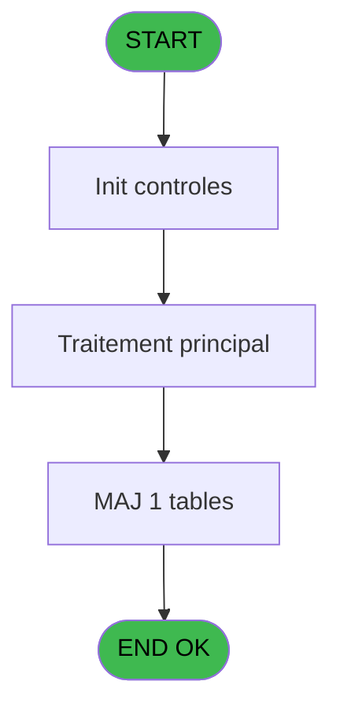
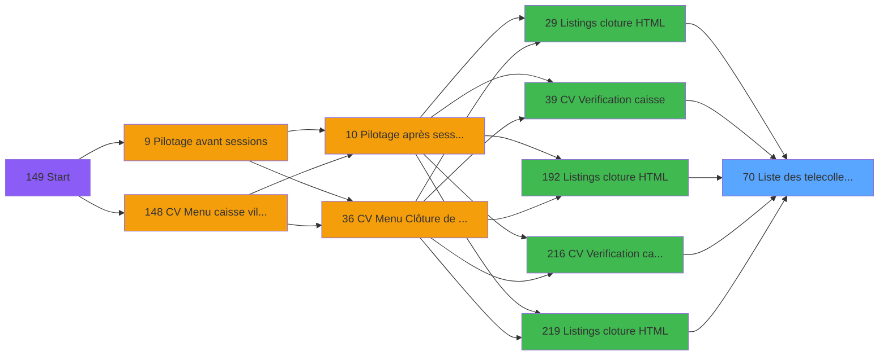

# VIL IDE 70 - Liste des telecollectes

> **Analyse**: Phases 1-4 2026-02-03 09:06 -> 09:06 (21s) | Assemblage 09:06
> **Pipeline**: V7.2 Enrichi
> **Structure**: 4 onglets (Resume | Ecrans | Donnees | Connexions)

<!-- TAB:Resume -->

## 1. FICHE D'IDENTITE

| Attribut | Valeur |
|----------|--------|
| Projet | VIL |
| IDE Position | 70 |
| Nom Programme | Liste des telecollectes |
| Fichier source | `Prg_70.xml` |
| Domaine metier | General |
| Taches | 14 (0 ecrans visibles) |
| Tables modifiees | 1 |
| Programmes appeles | 0 |

## 2. DESCRIPTION FONCTIONNELLE

**Liste des telecollectes** assure la gestion complete de ce processus, accessible depuis [    Listings cloture HTML (IDE 29)](VIL-IDE-29.md), [CV  Verification caisse (IDE 39)](VIL-IDE-39.md), [    Listings cloture HTML (IDE 192)](VIL-IDE-192.md), [CV  Verification caisse (IDE 216)](VIL-IDE-216.md), [    Listings cloture HTML (IDE 219)](VIL-IDE-219.md).

Le flux de traitement s'organise en **4 blocs fonctionnels** :

- **Traitement** (7 taches) : traitements metier divers
- **Reglement** (3 taches) : gestion des moyens de paiement et reglements
- **Impression** (2 taches) : generation de tickets et documents
- **Saisie** (2 taches) : ecrans de saisie utilisateur (formulaires, champs, donnees)

**Donnees modifiees** : 1 tables en ecriture (import_circuit___imc).

Detail : phases du traitement

#### Phase 1 : Saisie (2 taches)

- **70** - Liste des transactions **[[ECRAN]](#ecran-t1)**
- **70.1.2** - Lecture saisie TPE

#### Phase 2 : Traitement (7 taches)

- **70.1** - Lecture des TPE
- **70.1.2.1** - update tempo
- **70.3** - Lecture des TPE
- **70.3.2** - update tempo
- **70.4** - Lecture des TPE
- **70.4.1** - update tempo
- **70.1.2.2** - update tempo

#### Phase 3 : Reglement (3 taches)

- **70.1.1** - sub total mop
- **70.3.1** - sub total mop
- **70.4.2** - sub total mop

#### Phase 4 : Impression (2 taches)

- **70.2** - print v1
- **70.5** - print v1

#### Tables impactees

| Table | Operations | Role metier |
|-------|-----------|-------------|
| import_circuit___imc | R/**W**/L (12 usages) |  |

## 3. BLOCS FONCTIONNELS

### 3.1 Saisie (2 taches)

L'operateur saisit les donnees de la transaction via 1 ecran (Liste des transactions).

---

#### 70 - Liste des transactions [[ECRAN]](#ecran-t1)

**Role** : Saisie des donnees : Liste des transactions.
**Ecran** : 422 x 56 DLU (MDI) | [Voir mockup](#ecran-t1)

---

#### 70.1.2 - Lecture saisie TPE

**Role** : Saisie des donnees : Lecture saisie TPE.

### 3.2 Traitement (7 taches)

Traitements internes.

---

#### 70.1 - Lecture des TPE

**Role** : Traitement : Lecture des TPE.

---

#### 70.1.2.1 - update tempo

**Role** : Traitement : update tempo.

---

#### 70.3 - Lecture des TPE

**Role** : Traitement : Lecture des TPE.

---

#### 70.3.2 - update tempo

**Role** : Traitement : update tempo.

---

#### 70.4 - Lecture des TPE

**Role** : Traitement : Lecture des TPE.

---

#### 70.4.1 - update tempo

**Role** : Traitement : update tempo.

---

#### 70.1.2.2 - update tempo

**Role** : Traitement : update tempo.

### 3.3 Reglement (3 taches)

Gestion des moyens de paiement : 3 taches de reglement.

---

#### 70.1.1 - sub total mop

**Role** : Traitement : sub total mop.

---

#### 70.3.1 - sub total mop

**Role** : Traitement : sub total mop.

---

#### 70.4.2 - sub total mop

**Role** : Traitement : sub total mop.

### 3.4 Impression (2 taches)

Generation des documents et tickets.

---

#### 70.2 - print v1

**Role** : Generation du document : print v1.

---

#### 70.5 - print v1

**Role** : Generation du document : print v1.

## 5. REGLES METIER

*(Aucune regle metier identifiee)*

## 6. CONTEXTE

- **Appele par**: [    Listings cloture HTML (IDE 29)](VIL-IDE-29.md), [CV  Verification caisse (IDE 39)](VIL-IDE-39.md), [    Listings cloture HTML (IDE 192)](VIL-IDE-192.md), [CV  Verification caisse (IDE 216)](VIL-IDE-216.md), [    Listings cloture HTML (IDE 219)](VIL-IDE-219.md)
- **Appelle**: 0 programmes | **Tables**: 10 (W:1 R:6 L:7) | **Taches**: 14 | **Expressions**: 8

<!-- TAB:Ecrans -->

## 8. ECRANS

*(Programme sans ecran visible)*

## 9. NAVIGATION

### 9.3 Structure hierarchique (14 taches)

| Position | Tache | Type | Dimensions | Bloc |
|----------|-------|------|------------|------|
| **70.1** | [**Liste des transactions** (70)](#t1) [mockup](#ecran-t1) | MDI | 422x56 | Saisie |
| 70.1.1 | [Lecture saisie TPE (70.1.2)](#t5) | MDI | - | |
| **70.2** | [**Lecture des TPE** (70.1)](#t2) | MDI | - | Traitement |
| 70.2.1 | [update tempo (70.1.2.1)](#t6) | MDI | - | |
| 70.2.2 | [Lecture des TPE (70.3)](#t10) | MDI | - | |
| 70.2.3 | [update tempo (70.3.2)](#t17) | MDI | - | |
| 70.2.4 | [Lecture des TPE (70.4)](#t30) | MDI | - | |
| 70.2.5 | [update tempo (70.4.1)](#t31) | MDI | - | |
| 70.2.6 | [update tempo (70.1.2.2)](#t35) | MDI | - | |
| **70.3** | [**sub total mop** (70.1.1)](#t4) | MDI | - | Reglement |
| 70.3.1 | [sub total mop (70.3.1)](#t12) | MDI | - | |
| 70.3.2 | [sub total mop (70.4.2)](#t32) | MDI | - | |
| **70.4** | [**print v1** (70.2)](#t7) | MDI | - | Impression |
| 70.4.1 | [print v1 (70.5)](#t41) | MDI | - | |

### 9.4 Algorigramme

> **Legende**: Vert = START/END OK | Rouge = END KO | Bleu = Decisions
> *Algorigramme auto-genere. Utiliser `/algorigramme` pour une synthese metier detaillee.*

<!-- TAB:Donnees -->

## 10. TABLES

### Tables utilisees (10)

| ID | Nom | Description | Type | R | W | L | Usages |
|----|-----|-------------|------|---|---|---|--------|
| 24 | imprimante_______prn |  | DB | R |   |   | 1 |
| 67 | tables___________tab |  | DB | R |   |   | 1 |
| 89 | moyen_paiement___mop |  | DB | R |   | L | 3 |
| 258 | liste_des_tpe |  | DB |   |   | L | 1 |
| 259 | tpe_par_service | Services / filieres | DB |   |   | L | 2 |
| 260 | tickets_tpe |  | DB | R |   | L | 3 |
| 372 | pv_budget |  | DB | R |   |   | 1 |
| 554 | import_circuit___imc |  | TMP | R | **W** | L | 12 |
| 734 | arc_pv_cust_packages |  | DB |   |   | L | 1 |
| 876 | log_express_co |  | DB |   |   | L | 1 |

### Colonnes par table (5 / 6 tables avec colonnes identifiees)

Table 24 - imprimante_______prn (R) - 1 usages

| Lettre | Variable | Acces | Type |
|--------|----------|-------|------|
| A | V.term service ims ? | R | Logical |
| B | V.term service ims VAD ? | R | Logical |
| C | current chrono | R | Numeric |
| D | total mop | R | Numeric |

Table 67 - tables___________tab (R) - 1 usages

| Lettre | Variable | Acces | Type |
|--------|----------|-------|------|
| A | V.term service ims ? | R | Logical |
| B | v.Libellé service | R | Unicode |
| C | v.Current chrono | R | Numeric |
| D | v.Total mop | R | Numeric |

Table 89 - moyen_paiement___mop (R/L) - 3 usages

| Lettre | Variable | Acces | Type |
|--------|----------|-------|------|
| A | current chrono | R | Numeric |
| B | total mop | R | Numeric |

Table 260 - tickets_tpe (R/L) - 3 usages

*Table utilisee uniquement en Link ou aucune colonne Real identifiee dans le DataView.*

Table 372 - pv_budget (R) - 1 usages

| Lettre | Variable | Acces | Type |
|--------|----------|-------|------|
| A | param societe | R | Alpha |
| B | param masque cumul | R | Alpha |
| C | param date comptable | R | Date |
| D | param devise | R | Alpha |
| E | param nom village | R | Alpha |
| F | param edition HTML | R | Logical |

Table 554 - import_circuit___imc (R/**W**/L) - 12 usages

*Table utilisee uniquement en Link ou aucune colonne Real identifiee dans le DataView.*

## 11. VARIABLES

### 11.1 Autres (6)

Variables diverses.

| Lettre | Nom | Type | Usage dans |
|--------|-----|------|-----------|
| A | param societe | Alpha | - |
| B | param masque cumul | Alpha | - |
| C | param date comptable | Date | - |
| D | param devise | Alpha | - |
| E | param nom village | Alpha | - |
| F | param edition HTML | Logical | - |

## 12. EXPRESSIONS

**8 / 8 expressions decodees (100%)**

### 12.1 Repartition par type

| Type | Expressions | Regles |
|------|-------------|--------|
| CONCATENATION | 2 | 0 |
| CONDITION | 1 | 0 |
| OTHER | 1 | 0 |
| REFERENCE_VG | 2 | 0 |
| NEGATION | 2 | 0 |

### 12.2 Expressions cles par type

#### CONCATENATION (2 expressions)

| Type | IDE | Expression | Regle |
|------|-----|------------|-------|
| CONCATENATION | 1 | `DStr (Date (),'DD/MM/YYYY')&' - '&TStr (Time (),'HH:MM:SS')` | - |
| CONCATENATION | 3 | `'- '&Str (Page (0,1),'3P0Z0')&' -'` | - |

#### CONDITION (1 expressions)

| Type | IDE | Expression | Regle |
|------|-----|------------|-------|
| CONDITION | 2 | `INIGet ('[MAGIC_LOGICAL_NAMES]preview')='O'` | - |

#### OTHER (1 expressions)

| Type | IDE | Expression | Regle |
|------|-----|------------|-------|
| OTHER | 4 | `DbDel ('{554,2}'DSOURCE,'')` | - |

#### REFERENCE_VG (2 expressions)

| Type | IDE | Expression | Regle |
|------|-----|------------|-------|
| REFERENCE_VG | 8 | `VG39` | - |
| REFERENCE_VG | 5 | `VG25` | - |

#### NEGATION (2 expressions)

| Type | IDE | Expression | Regle |
|------|-----|------------|-------|
| NEGATION | 7 | `NOT VG39` | - |
| NEGATION | 6 | `NOT VG25` | - |

<!-- TAB:Connexions -->

## 13. GRAPHE D'APPELS

### 13.1 Chaine depuis Main (Callers)

Main -> ... -> [    Listings cloture HTML (IDE 29)](VIL-IDE-29.md) -> **Liste des telecollectes (IDE 70)**

Main -> ... -> [CV  Verification caisse (IDE 39)](VIL-IDE-39.md) -> **Liste des telecollectes (IDE 70)**

Main -> ... -> [    Listings cloture HTML (IDE 192)](VIL-IDE-192.md) -> **Liste des telecollectes (IDE 70)**

Main -> ... -> [CV  Verification caisse (IDE 216)](VIL-IDE-216.md) -> **Liste des telecollectes (IDE 70)**

Main -> ... -> [    Listings cloture HTML (IDE 219)](VIL-IDE-219.md) -> **Liste des telecollectes (IDE 70)**

### 13.2 Callers

| IDE | Nom Programme | Nb Appels |
|-----|---------------|-----------|
| [29](VIL-IDE-29.md) |     Listings cloture HTML | 1 |
| [39](VIL-IDE-39.md) | CV  Verification caisse | 1 |
| [192](VIL-IDE-192.md) |     Listings cloture HTML | 1 |
| [216](VIL-IDE-216.md) | CV  Verification caisse | 1 |
| [219](VIL-IDE-219.md) |     Listings cloture HTML | 1 |

### 13.3 Callees (programmes appeles)

### 13.4 Detail Callees avec contexte

| IDE | Nom Programme | Appels | Contexte |
|-----|---------------|--------|----------|
| - | (aucun) | - | - |

## 14. RECOMMANDATIONS MIGRATION

### 14.1 Profil du programme

| Metrique | Valeur | Impact migration |
|----------|--------|-----------------|
| Lignes de logique | 330 | Taille moyenne |
| Expressions | 8 | Peu de logique |
| Tables WRITE | 1 | Impact faible |
| Sous-programmes | 0 | Peu de dependances |
| Ecrans visibles | 0 | Ecran unique ou traitement batch |
| Code desactive | 0% (0 / 330) | Code sain |
| Regles metier | 0 | Pas de regle identifiee |

### 14.2 Plan de migration par bloc

#### Saisie (2 taches: 1 ecran, 1 traitement)

- **Strategie** : Formulaire React/Blazor avec validation Zod/FluentValidation.
- Reproduire 1 ecran : Liste des transactions
- Validation temps reel cote client + serveur

#### Traitement (7 taches: 0 ecran, 7 traitements)

- **Strategie** : 7 service(s) backend injectable(s) (Domain Services).
- Decomposer les taches en services unitaires testables.

#### Reglement (3 taches: 0 ecran, 3 traitements)

- **Strategie** : Service `IReglementService` avec pattern Strategy par mode de paiement.
- Integration TPE si applicable

#### Impression (2 taches: 0 ecran, 2 traitements)

- **Strategie** : Templates HTML -> PDF via wkhtmltopdf ou Puppeteer.
- `PrintService` injectable avec choix imprimante

### 14.3 Dependances critiques

| Dependance | Type | Appels | Impact |
|------------|------|--------|--------|
| import_circuit___imc | Table WRITE (Temp) | 7x | Schema + repository |

---
*Spec DETAILED generee par Pipeline V7.2 - 2026-02-03 09:06*
