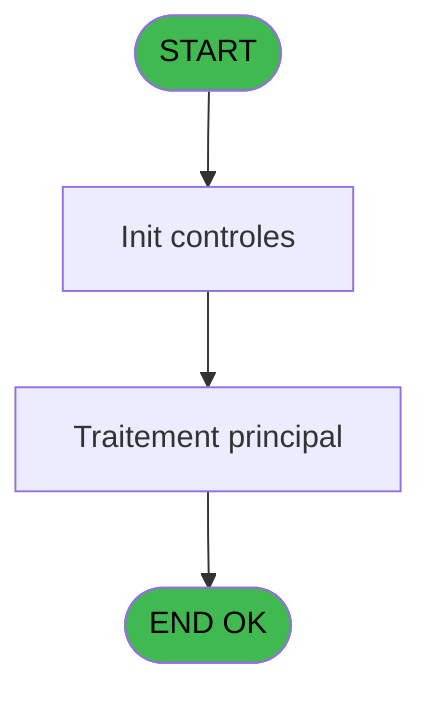
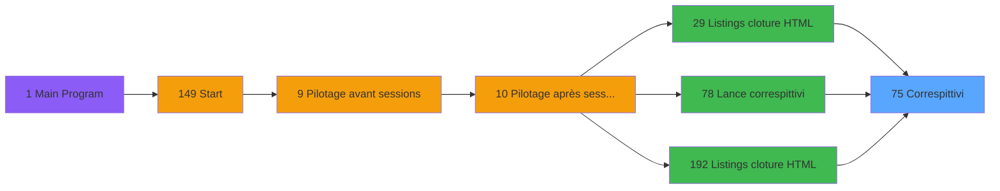

# VIL IDE 75 - Correspittivi

> **Analyse**: Phases 1-4 2026-02-03 09:09 -> 09:09 (27s) | Assemblage 09:09
> **Pipeline**: V7.2 Enrichi
> **Structure**: 4 onglets (Resume | Ecrans | Donnees | Connexions)

<!-- TAB:Resume -->

## 1. FICHE D'IDENTITE

| Attribut | Valeur |
|----------|--------|
| Projet | VIL |
| IDE Position | 75 |
| Nom Programme | Correspittivi |
| Fichier source | `Prg_75.xml` |
| Domaine metier | General |
| Taches | 14 (0 ecrans visibles) |
| Tables modifiees | 0 |
| Programmes appeles | 0 |

## 2. DESCRIPTION FONCTIONNELLE

**Correspittivi** assure la gestion complete de ce processus, accessible depuis [    Listings cloture HTML (IDE 29)](VIL-IDE-29.md), [    Listings cloture HTML (IDE 192)](VIL-IDE-192.md), [Lance correspittivi (IDE 78)](VIL-IDE-78.md).

Le flux de traitement s'organise en **3 blocs fonctionnels** :

- **Calcul** (6 taches) : calculs de montants, stocks ou compteurs
- **Saisie** (5 taches) : ecrans de saisie utilisateur (formulaires, champs, donnees)
- **Traitement** (3 taches) : traitements metier divers

Detail : phases du traitement

#### Phase 1 : Traitement (3 taches)

- **75** - Correspittivi
- **75.6.2** - Calc boutique **[[ECRAN]](#ecran-t14)**
- **75.8.2** - Calc boutique **[[ECRAN]](#ecran-t24)**

#### Phase 2 : Saisie (5 taches)

- **75.1** - Lecture ventes
- **75.5** - Lecture ventes
- **75.6.1** - calc vente **[[ECRAN]](#ecran-t13)**
- **75.7.1** - calc vente **[[ECRAN]](#ecran-t18)**
- **75.8.1** - calc vente **[[ECRAN]](#ecran-t23)**

#### Phase 3 : Calcul (6 taches)

- **75.2** - Calcul chaine tva fisc **[[ECRAN]](#ecran-t3)**
- **75.3** - Calcul chaine tva non fisc **[[ECRAN]](#ecran-t4)**
- **75.4** - Calcul chaine tva fisc **[[ECRAN]](#ecran-t8)**
- **75.6** - Calcul total **[[ECRAN]](#ecran-t12)**
- **75.7** - Calcul total **[[ECRAN]](#ecran-t17)**
- **75.8** - Calcul total **[[ECRAN]](#ecran-t22)**

## 3. BLOCS FONCTIONNELS

### 3.1 Traitement (3 taches)

Traitements internes.

---

#### 75 - Correspittivi

**Role** : Traitement : Correspittivi.

---

#### 75.6.2 - Calc boutique [[ECRAN]](#ecran-t14)

**Role** : Traitement : Calc boutique.
**Ecran** : 193 x 195 DLU | [Voir mockup](#ecran-t14)

---

#### 75.8.2 - Calc boutique [[ECRAN]](#ecran-t24)

**Role** : Traitement : Calc boutique.
**Ecran** : 193 x 195 DLU | [Voir mockup](#ecran-t24)

### 3.2 Saisie (5 taches)

L'operateur saisit les donnees de la transaction via 3 ecrans (calc vente, calc vente, calc vente).

---

#### 75.1 - Lecture ventes

**Role** : Saisie des donnees : Lecture ventes.

---

#### 75.5 - Lecture ventes

**Role** : Saisie des donnees : Lecture ventes.

---

#### 75.6.1 - calc vente [[ECRAN]](#ecran-t13)

**Role** : Saisie des donnees : calc vente.
**Ecran** : 193 x 195 DLU | [Voir mockup](#ecran-t13)

---

#### 75.7.1 - calc vente [[ECRAN]](#ecran-t18)

**Role** : Saisie des donnees : calc vente.
**Ecran** : 193 x 195 DLU | [Voir mockup](#ecran-t18)

---

#### 75.8.1 - calc vente [[ECRAN]](#ecran-t23)

**Role** : Saisie des donnees : calc vente.
**Ecran** : 193 x 195 DLU | [Voir mockup](#ecran-t23)

### 3.3 Calcul (6 taches)

Calculs metier : montants, stocks, compteurs.

---

#### 75.2 - Calcul chaine tva fisc [[ECRAN]](#ecran-t3)

**Role** : Calcul : Calcul chaine tva fisc.
**Ecran** : 120 x 195 DLU | [Voir mockup](#ecran-t3)
**Variables liees** : R (V.Chaine extraction), F (Chaine tva fiscale), G (Chaine tva non fiscale), H (Chaine titre tva fiscale), I (Chaine titre tva non fiscale)

---

#### 75.3 - Calcul chaine tva non fisc [[ECRAN]](#ecran-t4)

**Role** : Calcul : Calcul chaine tva non fisc.
**Ecran** : 120 x 195 DLU | [Voir mockup](#ecran-t4)
**Variables liees** : R (V.Chaine extraction), F (Chaine tva fiscale), G (Chaine tva non fiscale), H (Chaine titre tva fiscale), I (Chaine titre tva non fiscale)

---

#### 75.4 - Calcul chaine tva fisc [[ECRAN]](#ecran-t8)

**Role** : Calcul : Calcul chaine tva fisc.
**Ecran** : 120 x 195 DLU | [Voir mockup](#ecran-t8)
**Variables liees** : R (V.Chaine extraction), F (Chaine tva fiscale), G (Chaine tva non fiscale), H (Chaine titre tva fiscale), I (Chaine titre tva non fiscale)

---

#### 75.6 - Calcul total [[ECRAN]](#ecran-t12)

**Role** : Calcul : Calcul total.
**Ecran** : 120 x 195 DLU | [Voir mockup](#ecran-t12)
**Variables liees** : S (V.Total general TTC), T (V.Total general TVA), L (Chaine total tva fiscale), M (Chaine total tva non fiscale), Q (Chaine total tva mensuel)

---

#### 75.7 - Calcul total [[ECRAN]](#ecran-t17)

**Role** : Calcul : Calcul total.
**Ecran** : 120 x 195 DLU | [Voir mockup](#ecran-t17)
**Variables liees** : S (V.Total general TTC), T (V.Total general TVA), L (Chaine total tva fiscale), M (Chaine total tva non fiscale), Q (Chaine total tva mensuel)

---

#### 75.8 - Calcul total [[ECRAN]](#ecran-t22)

**Role** : Calcul : Calcul total.
**Ecran** : 120 x 195 DLU | [Voir mockup](#ecran-t22)
**Variables liees** : S (V.Total general TTC), T (V.Total general TVA), L (Chaine total tva fiscale), M (Chaine total tva non fiscale), Q (Chaine total tva mensuel)

## 5. REGLES METIER

*(Aucune regle metier identifiee)*

## 6. CONTEXTE

- **Appele par**: [    Listings cloture HTML (IDE 29)](VIL-IDE-29.md), [    Listings cloture HTML (IDE 192)](VIL-IDE-192.md), [Lance correspittivi (IDE 78)](VIL-IDE-78.md)
- **Appelle**: 0 programmes | **Tables**: 3 (W:0 R:3 L:0) | **Taches**: 14 | **Expressions**: 17

<!-- TAB:Ecrans -->

## 8. ECRANS

*(Programme sans ecran visible)*

## 9. NAVIGATION

### 9.3 Structure hierarchique (14 taches)

| Position | Tache | Type | Dimensions | Bloc |
|----------|-------|------|------------|------|
| **75.1** | [**Correspittivi** (75)](#t1) | - | - | Traitement |
| 75.1.1 | [Calc boutique (75.6.2)](#t14) [mockup](#ecran-t14) | - | 193x195 | |
| 75.1.2 | [Calc boutique (75.8.2)](#t24) [mockup](#ecran-t24) | - | 193x195 | |
| **75.2** | [**Lecture ventes** (75.1)](#t2) | - | - | Saisie |
| 75.2.1 | [Lecture ventes (75.5)](#t11) | - | - | |
| 75.2.2 | [calc vente (75.6.1)](#t13) [mockup](#ecran-t13) | - | 193x195 | |
| 75.2.3 | [calc vente (75.7.1)](#t18) [mockup](#ecran-t18) | - | 193x195 | |
| 75.2.4 | [calc vente (75.8.1)](#t23) [mockup](#ecran-t23) | - | 193x195 | |
| **75.3** | [**Calcul chaine tva fisc** (75.2)](#t3) [mockup](#ecran-t3) | - | 120x195 | Calcul |
| 75.3.1 | [Calcul chaine tva non fisc (75.3)](#t4) [mockup](#ecran-t4) | - | 120x195 | |
| 75.3.2 | [Calcul chaine tva fisc (75.4)](#t8) [mockup](#ecran-t8) | - | 120x195 | |
| 75.3.3 | [Calcul total (75.6)](#t12) [mockup](#ecran-t12) | - | 120x195 | |
| 75.3.4 | [Calcul total (75.7)](#t17) [mockup](#ecran-t17) | - | 120x195 | |
| 75.3.5 | [Calcul total (75.8)](#t22) [mockup](#ecran-t22) | - | 120x195 | |

### 9.4 Algorigramme

> **Legende**: Vert = START/END OK | Rouge = END KO | Bleu = Decisions
> *Algorigramme auto-genere. Utiliser `/algorigramme` pour une synthese metier detaillee.*

<!-- TAB:Donnees -->

## 10. TABLES

### Tables utilisees (3)

| ID | Nom | Description | Type | R | W | L | Usages |
|----|-----|-------------|------|---|---|---|--------|
| 891 | pv_booking |  | DB | R |   |   | 1 |
| 892 | Boo_CategoriesProduit |  | DB | R |   |   | 1 |
| 903 | Boo_AvailibleRooms |  | DB | R |   |   | 1 |

### Colonnes par table (3 / 3 tables avec colonnes identifiees)

Table 891 - pv_booking (R) - 1 usages

| Lettre | Variable | Acces | Type |
|--------|----------|-------|------|
| A | p.Date Comptable début | R | Date |
| B | p.Date Comptable fin | R | Date |
| C | P.Type mensuel/Journalier | R | Alpha |
| D | P.Masque | R | Alpha |
| E | P.Nom village | R | Alpha |
| F | Chaine tva fiscale | R | Alpha |
| G | Chaine tva non fiscale | R | Alpha |
| H | Chaine titre tva fiscale | R | Alpha |
| I | Chaine titre tva non fiscale | R | Alpha |
| J | Chaine titre2 tva fiscale | R | Alpha |
| K | Chaine titre2 tva non fiscale | R | Alpha |
| L | Chaine total tva fiscale | R | Alpha |
| M | Chaine total tva non fiscale | R | Alpha |
| N | Chaine tva mensuel | R | Alpha |
| O | titre tva mensuel | R | Alpha |
| P | titre 2 tva mensuel | R | Alpha |
| Q | Chaine total tva mensuel | R | Alpha |
| R | V.Chaine extraction | R | Alpha |
| S | V.Total general TTC | R | Numeric |
| T | V.Total general TVA | R | Numeric |

Table 892 - Boo_CategoriesProduit (R) - 1 usages

| Lettre | Variable | Acces | Type |
|--------|----------|-------|------|
| A | Total HT | R | Numeric |
| B | Total TTC | R | Numeric |
| C | Total HT compte | R | Numeric |
| D | Total TTC compte | R | Numeric |
| E | Total TVA compte | R | Numeric |
| F | V.Chaine tva | R | Alpha |
| G | compteur | R | Numeric |
| H | V.chaine a 0 fisc | R | Alpha |

Table 903 - Boo_AvailibleRooms (R) - 1 usages

| Lettre | Variable | Acces | Type |
|--------|----------|-------|------|
| A | Total HT | R | Numeric |
| B | Total TTC | R | Numeric |
| C | Total HT compte | R | Numeric |
| D | Total TTC compte | R | Numeric |
| E | Total TVA compte | R | Numeric |
| F | V.Chaine tva | R | Alpha |
| G | compteur | R | Numeric |
| H | V.chaine a 0 non fisc | R | Alpha |

## 11. VARIABLES

### 11.1 Parametres entrants (5)

Variables recues du programme appelant ([    Listings cloture HTML (IDE 29)](VIL-IDE-29.md)).

| Lettre | Nom | Type | Usage dans |
|--------|-----|------|-----------|
| A | p.Date Comptable début | Date | 2x parametre entrant |
| B | p.Date Comptable fin | Date | 1x parametre entrant |
| C | P.Type mensuel/Journalier | Alpha | - |
| D | P.Masque | Alpha | 2x parametre entrant |
| E | P.Nom village | Alpha | - |

### 11.2 Variables de session (3)

Variables persistantes pendant toute la session.

| Lettre | Nom | Type | Usage dans |
|--------|-----|------|-----------|
| R | V.Chaine extraction | Alpha | - |
| S | V.Total general TTC | Numeric | 1x session |
| T | V.Total general TVA | Numeric | 1x session |

### 11.3 Autres (12)

Variables diverses.

| Lettre | Nom | Type | Usage dans |
|--------|-----|------|-----------|
| F | Chaine tva fiscale | Alpha | - |
| G | Chaine tva non fiscale | Alpha | - |
| H | Chaine titre tva fiscale | Alpha | - |
| I | Chaine titre tva non fiscale | Alpha | - |
| J | Chaine titre2 tva fiscale | Alpha | [75.2](#t3), [75.3](#t4), [75.4](#t8) |
| K | Chaine titre2 tva non fiscale | Alpha | - |
| L | Chaine total tva fiscale | Alpha | - |
| M | Chaine total tva non fiscale | Alpha | - |
| N | Chaine tva mensuel | Alpha | - |
| O | titre tva mensuel | Alpha | - |
| P | titre 2 tva mensuel | Alpha | - |
| Q | Chaine total tva mensuel | Alpha | - |

Toutes les 20 variables (liste complete)

| Cat | Lettre | Nom Variable | Type |
|-----|--------|--------------|------|
| P0 | **A** | p.Date Comptable début | Date |
| P0 | **B** | p.Date Comptable fin | Date |
| P0 | **C** | P.Type mensuel/Journalier | Alpha |
| P0 | **D** | P.Masque | Alpha |
| P0 | **E** | P.Nom village | Alpha |
| V. | **R** | V.Chaine extraction | Alpha |
| V. | **S** | V.Total general TTC | Numeric |
| V. | **T** | V.Total general TVA | Numeric |
| Autre | **F** | Chaine tva fiscale | Alpha |
| Autre | **G** | Chaine tva non fiscale | Alpha |
| Autre | **H** | Chaine titre tva fiscale | Alpha |
| Autre | **I** | Chaine titre tva non fiscale | Alpha |
| Autre | **J** | Chaine titre2 tva fiscale | Alpha |
| Autre | **K** | Chaine titre2 tva non fiscale | Alpha |
| Autre | **L** | Chaine total tva fiscale | Alpha |
| Autre | **M** | Chaine total tva non fiscale | Alpha |
| Autre | **N** | Chaine tva mensuel | Alpha |
| Autre | **O** | titre tva mensuel | Alpha |
| Autre | **P** | titre 2 tva mensuel | Alpha |
| Autre | **Q** | Chaine total tva mensuel | Alpha |

## 12. EXPRESSIONS

**17 / 17 expressions decodees (100%)**

### 12.1 Repartition par type

| Type | Expressions | Regles |
|------|-------------|--------|
| CONSTANTE | 3 | 0 |
| CONCATENATION | 5 | 0 |
| FORMAT | 4 | 0 |
| CONDITION | 4 | 0 |
| STRING | 1 | 0 |

### 12.2 Expressions cles par type

#### CONSTANTE (3 expressions)

| Type | IDE | Expression | Regle |
|------|-----|------------|-------|
| CONSTANTE | 17 | `0` | - |
| CONSTANTE | 13 | `'ESTRATTO DEI CORRISPETTIVI MENSILI'` | - |
| CONSTANTE | 12 | `'ESTRATTO DEI CORRISPETTIVI GIORNALIERI'` | - |

#### CONCATENATION (5 expressions)

| Type | IDE | Expression | Regle |
|------|-----|------------|-------|
| CONCATENATION | 8 | `MlsTrans('Imputazione contabile')&VG19&''&VG19&MlsTrans('Descrizione')&VG19&MlsTrans('Totale')&VG19&Trim([V])&VG19&MlsTrans('TOTAL IVA')` | - |
| CONCATENATION | 9 | `MlsTrans('COMPTE')&VG19&MlsTrans('ACTIVITE')&VG19&''&VG19&''&VG19&Trim([Y])&VG19&''` | - |
| CONCATENATION | 3 | `MlsTrans('Imputazione contabile')&VG19&MlsTrans('Descrizione')&VG19&MlsTrans('Totale')&VG19&Trim(V.Total general TTC [S])&VG19&Trim(V.Total general TVA [T])` | - |
| CONCATENATION | 1 | `Translate('%club_exportdata%')&'Cloture\Editions\COR_'&Trim(VG16)&'_'&DStr (p.Date Comptable fin [B],'YYYYMMDD')&'_'&Trim(Chaine titre tva non f... [I])&'.csv'` | - |
| CONCATENATION | 2 | `''&VG19&''&VG19&''&VG19&Trim([Z])&VG19&Trim([AA])` | - |

#### FORMAT (4 expressions)

| Type | IDE | Expression | Regle |
|------|-----|------------|-------|
| FORMAT | 11 | `''&VG19&''&VG19&MlsTrans('TOTALE')&VG19&Trim(Str([AE],Chaine titre2 tva fiscale [J]))&VG19&Trim([AD])&VG19&IF([AI]<>0,Trim(Str([AI],Chaine titre2 tva fiscale [J])),'')` | - |
| FORMAT | 16 | `'MESE DI : '&NMonth(Month(p.Date Comptable début [A]))&' '&Str(Year(p.Date Comptable début [A]),'4')` | - |
| FORMAT | 15 | `'GIORNO DEL : '&DStr(p.Date Comptable début [A],'DD/MM/YYYY')` | - |
| FORMAT | 10 | `''&VG19&MlsTrans('TOTALE')&VG19&Trim(Str([AE],Chaine titre2 tva fiscale [J]))&VG19&Trim([AB])&VG19&Trim([AC])` | - |

#### CONDITION (4 expressions)

| Type | IDE | Expression | Regle |
|------|-----|------------|-------|
| CONDITION | 6 | `P.Masque [D]<>'BOUT'` | - |
| CONDITION | 7 | `P.Masque [D]='BOUT'` | - |
| CONDITION | 4 | `Chaine titre tva non f... [I]='J'` | - |
| CONDITION | 5 | `Chaine titre tva non f... [I]='M'` | - |

#### STRING (1 expressions)

| Type | IDE | Expression | Regle |
|------|-----|------------|-------|
| STRING | 14 | `'VILLAGGIO : '&Trim([AH])` | - |

<!-- TAB:Connexions -->

## 13. GRAPHE D'APPELS

### 13.1 Chaine depuis Main (Callers)

Main -> ... -> [    Listings cloture HTML (IDE 29)](VIL-IDE-29.md) -> **Correspittivi (IDE 75)**

Main -> ... -> [    Listings cloture HTML (IDE 192)](VIL-IDE-192.md) -> **Correspittivi (IDE 75)**

Main -> ... -> [Lance correspittivi (IDE 78)](VIL-IDE-78.md) -> **Correspittivi (IDE 75)**

### 13.2 Callers

| IDE | Nom Programme | Nb Appels |
|-----|---------------|-----------|
| [29](VIL-IDE-29.md) |     Listings cloture HTML | 2 |
| [192](VIL-IDE-192.md) |     Listings cloture HTML | 2 |
| [78](VIL-IDE-78.md) | Lance correspittivi | 1 |

### 13.3 Callees (programmes appeles)

### 13.4 Detail Callees avec contexte

| IDE | Nom Programme | Appels | Contexte |
|-----|---------------|--------|----------|
| - | (aucun) | - | - |

## 14. RECOMMANDATIONS MIGRATION

### 14.1 Profil du programme

| Metrique | Valeur | Impact migration |
|----------|--------|-----------------|
| Lignes de logique | 290 | Taille moyenne |
| Expressions | 17 | Peu de logique |
| Tables WRITE | 0 | Impact faible |
| Sous-programmes | 0 | Peu de dependances |
| Ecrans visibles | 0 | Ecran unique ou traitement batch |
| Code desactive | 0% (0 / 290) | Code sain |
| Regles metier | 0 | Pas de regle identifiee |

### 14.2 Plan de migration par bloc

#### Traitement (3 taches: 2 ecrans, 1 traitement)

- **Strategie** : Orchestrateur avec 2 ecrans (Razor/React) et 1 traitements backend (services).
- Les ecrans deviennent des composants UI, les traitements invisibles deviennent des services injectables.
- Decomposer les taches en services unitaires testables.

#### Saisie (5 taches: 3 ecrans, 2 traitements)

- **Strategie** : Formulaire React/Blazor avec validation Zod/FluentValidation.
- Reproduire 3 ecrans : calc vente, calc vente, calc vente
- Validation temps reel cote client + serveur

#### Calcul (6 taches: 6 ecrans, 0 traitement)

- **Strategie** : Services de calcul purs (Domain Services).
- Migrer la logique de calcul (stock, compteurs, montants)

### 14.3 Dependances critiques

| Dependance | Type | Appels | Impact |
|------------|------|--------|--------|

---
*Spec DETAILED generee par Pipeline V7.2 - 2026-02-03 09:09*
