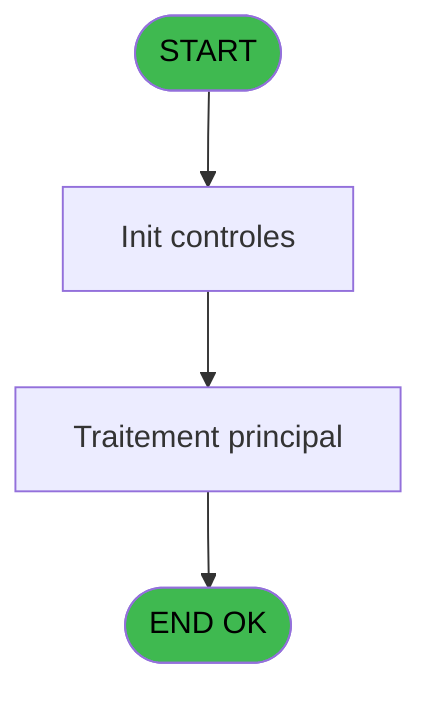

# VIL IDE 76 - Genere tempo vente telecollec

> **Analyse**: Phases 1-4 2026-02-03 09:09 -> 09:10 (27s) | Assemblage 09:10
> **Pipeline**: V7.2 Enrichi
> **Structure**: 4 onglets (Resume | Ecrans | Donnees | Connexions)

<!-- TAB:Resume -->

## 1. FICHE D'IDENTITE

| Attribut | Valeur |
|----------|--------|
| Projet | VIL |
| IDE Position | 76 |
| Nom Programme | Genere tempo vente telecollec |
| Fichier source | `Prg_76.xml` |
| Domaine metier | Ventes |
| Taches | 6 (0 ecrans visibles) |
| Tables modifiees | 0 |
| Programmes appeles | 0 |

## 2. DESCRIPTION FONCTIONNELLE

**Genere tempo vente telecollec** assure la gestion complete de ce processus, accessible depuis [    Listings cloture HTML (IDE 29)](VIL-IDE-29.md).

Le flux de traitement s'organise en **2 blocs fonctionnels** :

- **Saisie** (5 taches) : ecrans de saisie utilisateur (formulaires, champs, donnees)
- **Impression** (1 tache) : generation de tickets et documents

Detail : phases du traitement

#### Phase 1 : Saisie (5 taches)

- **76** - Genere tempo vente telecollec
- **76.1** - Lect caisse_vente
- **76.2** - Lect caisse_vente
- **76.4** - Lect caisse_vente
- **76.5** - Lect caisse_vente

#### Phase 2 : Impression (1 tache)

- **76.3** - Lect ticket tpe

## 3. BLOCS FONCTIONNELS

### 3.1 Saisie (5 taches)

Ce bloc traite la saisie des donnees de la transaction.

---

#### 76 - Genere tempo vente telecollec

**Role** : Saisie des donnees : Genere tempo vente telecollec.

4 sous-taches directes

| Tache | Nom | Bloc |
|-------|-----|------|
| [76.1](#t2) | Lect caisse_vente | Saisie |
| [76.2](#t5) | Lect caisse_vente | Saisie |
| [76.4](#t9) | Lect caisse_vente | Saisie |
| [76.5](#t12) | Lect caisse_vente | Saisie |

---

#### 76.1 - Lect caisse_vente

**Role** : Saisie des donnees : Lect caisse_vente.

---

#### 76.2 - Lect caisse_vente

**Role** : Saisie des donnees : Lect caisse_vente.

---

#### 76.4 - Lect caisse_vente

**Role** : Saisie des donnees : Lect caisse_vente.

---

#### 76.5 - Lect caisse_vente

**Role** : Saisie des donnees : Lect caisse_vente.

### 3.2 Impression (1 tache)

Generation des documents et tickets.

---

#### 76.3 - Lect ticket tpe

**Role** : Generation du document : Lect ticket tpe.

## 5. REGLES METIER

*(Aucune regle metier identifiee)*

## 6. CONTEXTE

- **Appele par**: [    Listings cloture HTML (IDE 29)](VIL-IDE-29.md)
- **Appelle**: 0 programmes | **Tables**: 5 (W:0 R:3 L:2) | **Taches**: 6 | **Expressions**: 3

<!-- TAB:Ecrans -->

## 8. ECRANS

*(Programme sans ecran visible)*

## 9. NAVIGATION

### 9.3 Structure hierarchique (6 taches)

| Position | Tache | Type | Dimensions | Bloc |
|----------|-------|------|------------|------|
| **76.1** | [**Genere tempo vente telecollec** (76)](#t1) | - | - | Saisie |
| 76.1.1 | [Lect caisse_vente (76.1)](#t2) | - | - | |
| 76.1.2 | [Lect caisse_vente (76.2)](#t5) | - | - | |
| 76.1.3 | [Lect caisse_vente (76.4)](#t9) | - | - | |
| 76.1.4 | [Lect caisse_vente (76.5)](#t12) | - | - | |
| **76.2** | [**Lect ticket tpe** (76.3)](#t6) | - | - | Impression |

### 9.4 Algorigramme

> **Legende**: Vert = START/END OK | Rouge = END KO | Bleu = Decisions
> *Algorigramme auto-genere. Utiliser `/algorigramme` pour une synthese metier detaillee.*

<!-- TAB:Donnees -->

## 10. TABLES

### Tables utilisees (5)

| ID | Nom | Description | Type | R | W | L | Usages |
|----|-----|-------------|------|---|---|---|--------|
| 40 | comptable________cte |  | DB | R |   |   | 2 |
| 260 | tickets_tpe |  | DB | R |   |   | 1 |
| 263 | vente | Donnees de ventes | DB | R |   |   | 2 |
| 875 | annulation_vente | Donnees de ventes | DB |   |   | L | 2 |
| 914 | import_resort_credit | Resort Credit | DB |   |   | L | 5 |

### Colonnes par table (1 / 3 tables avec colonnes identifiees)

Table 40 - comptable________cte (R) - 2 usages

| Lettre | Variable | Acces | Type |
|--------|----------|-------|------|
| B | P.Date comptable | R | Date |

Table 260 - tickets_tpe (R) - 1 usages

*Table utilisee uniquement en Link ou aucune colonne Real identifiee dans le DataView.*

Table 263 - vente (R) - 2 usages

*Table utilisee uniquement en Link ou aucune colonne Real identifiee dans le DataView.*

## 11. VARIABLES

### 11.1 Parametres entrants (2)

Variables recues du programme appelant ([    Listings cloture HTML (IDE 29)](VIL-IDE-29.md)).

| Lettre | Nom | Type | Usage dans |
|--------|-----|------|-----------|
| A | P.Societe | Alpha | - |
| B | P.Date comptable | Date | - |

## 12. EXPRESSIONS

**3 / 3 expressions decodees (100%)**

### 12.1 Repartition par type

| Type | Expressions | Regles |
|------|-------------|--------|
| OTHER | 1 | 0 |
| NEGATION | 1 | 0 |
| REFERENCE_VG | 1 | 0 |

### 12.2 Expressions cles par type

#### OTHER (1 expressions)

| Type | IDE | Expression | Regle |
|------|-----|------------|-------|
| OTHER | 1 | `DbDel('{914,2}'DSOURCE,'')` | - |

#### NEGATION (1 expressions)

| Type | IDE | Expression | Regle |
|------|-----|------------|-------|
| NEGATION | 2 | `NOT VG39` | - |

#### REFERENCE_VG (1 expressions)

| Type | IDE | Expression | Regle |
|------|-----|------------|-------|
| REFERENCE_VG | 3 | `VG39` | - |

<!-- TAB:Connexions -->

## 13. GRAPHE D'APPELS

### 13.1 Chaine depuis Main (Callers)

Main -> ... -> [    Listings cloture HTML (IDE 29)](VIL-IDE-29.md) -> **Genere tempo vente telecollec (IDE 76)**

### 13.2 Callers

| IDE | Nom Programme | Nb Appels |
|-----|---------------|-----------|
| [29](VIL-IDE-29.md) |     Listings cloture HTML | 1 |

### 13.3 Callees (programmes appeles)

### 13.4 Detail Callees avec contexte

| IDE | Nom Programme | Appels | Contexte |
|-----|---------------|--------|----------|
| - | (aucun) | - | - |

## 14. RECOMMANDATIONS MIGRATION

### 14.1 Profil du programme

| Metrique | Valeur | Impact migration |
|----------|--------|-----------------|
| Lignes de logique | 194 | Programme compact |
| Expressions | 3 | Peu de logique |
| Tables WRITE | 0 | Impact faible |
| Sous-programmes | 0 | Peu de dependances |
| Ecrans visibles | 0 | Ecran unique ou traitement batch |
| Code desactive | 0% (0 / 194) | Code sain |
| Regles metier | 0 | Pas de regle identifiee |

### 14.2 Plan de migration par bloc

#### Saisie (5 taches: 0 ecran, 5 traitements)

- **Strategie** : Formulaire React/Blazor avec validation Zod/FluentValidation.
- Validation temps reel cote client + serveur

#### Impression (1 tache: 0 ecran, 1 traitement)

- **Strategie** : Templates HTML -> PDF via wkhtmltopdf ou Puppeteer.
- `PrintService` injectable avec choix imprimante

### 14.3 Dependances critiques

| Dependance | Type | Appels | Impact |
|------------|------|--------|--------|

---
*Spec DETAILED generee par Pipeline V7.2 - 2026-02-03 09:10*
