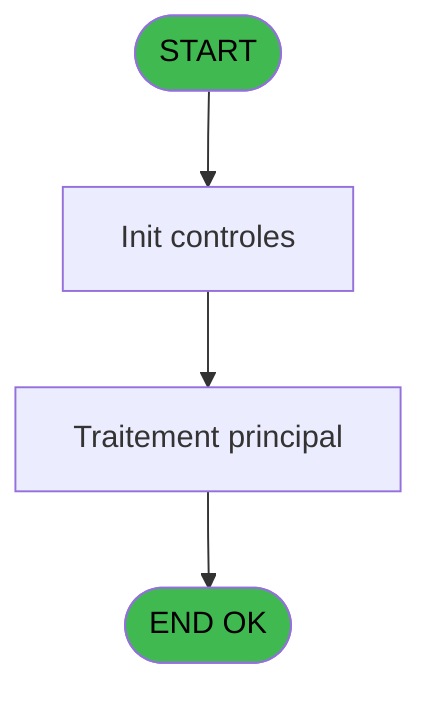

# VIL IDE 77 - Edition HTML Ventes TPE

> **Analyse**: Phases 1-4 2026-02-03 09:10 -> 09:10 (21s) | Assemblage 09:10
> **Pipeline**: V7.2 Enrichi
> **Structure**: 4 onglets (Resume | Ecrans | Donnees | Connexions)

<!-- TAB:Resume -->

## 1. FICHE D'IDENTITE

| Attribut | Valeur |
|----------|--------|
| Projet | VIL |
| IDE Position | 77 |
| Nom Programme | Edition HTML Ventes TPE |
| Fichier source | `Prg_77.xml` |
| Domaine metier | Ventes |
| Taches | 2 (1 ecrans visibles) |
| Tables modifiees | 0 |
| Programmes appeles | 0 |

## 2. DESCRIPTION FONCTIONNELLE

**Edition HTML Ventes TPE** assure la gestion complete de ce processus, accessible depuis [    Listings cloture HTML (IDE 29)](VIL-IDE-29.md).

Le flux de traitement s'organise en **1 blocs fonctionnels** :

- **Traitement** (2 taches) : traitements metier divers

**Logique metier** : 7 regles identifiees couvrant conditions metier.

## 3. BLOCS FONCTIONNELS

### 3.1 Traitement (2 taches)

Traitements internes.

---

#### 77 - Veuillez patienter ..... [[ECRAN]](#ecran-t3)

**Role** : Traitement : Veuillez patienter ......
**Ecran** : 422 x 56 DLU (MDI) | [Voir mockup](#ecran-t3)

---

#### 77.1 - Recapitulatif

**Role** : Traitement : Recapitulatif.

## 5. REGLES METIER

7 regles identifiees:

### Autres (7 regles)

#### [RM-001] Si [AA]='A' alors 'annul' sinon '')

| Element | Detail |
|---------|--------|
| **Condition** | `[AA]='A'` |
| **Si vrai** | 'annul' |
| **Si faux** | '') |
| **Expression source** | Expression 6 : `IF ([AA]='A','annul','')` |
| **Exemple** | Si [AA]='A' → 'annul'. Sinon → '') |

#### [RM-002] Traitement conditionnel si [AD]> est a zero

| Element | Detail |
|---------|--------|
| **Condition** | `[AD]>=0` |
| **Si vrai** | [AD] |
| **Si faux** | 0) |
| **Expression source** | Expression 7 : `IF ([AD]>=0,[AD],0)` |
| **Exemple** | Si [AD]>=0 → [AD]. Sinon → 0) |

#### [RM-003] Si [AD]<0 alors ABS ([AD]) sinon 0)

| Element | Detail |
|---------|--------|
| **Condition** | `[AD]<0` |
| **Si vrai** | ABS ([AD]) |
| **Si faux** | 0) |
| **Expression source** | Expression 8 : `IF ([AD]<0,ABS ([AD]),0)` |
| **Exemple** | Si [AD]<0 → ABS ([AD]). Sinon → 0) |

#### [RM-004] Si [EO] alors [EM] sinon CASE([AG],'VISA',[EK],'AMEX',[EL],''))

| Element | Detail |
|---------|--------|
| **Condition** | `[EO]` |
| **Si vrai** | [EM] |
| **Si faux** | CASE([AG],'VISA',[EK],'AMEX',[EL],'')) |
| **Expression source** | Expression 28 : `IF([EO],[EM],CASE([AG],'VISA',[EK],'AMEX',[EL],''))` |
| **Exemple** | Si [EO] → [EM]. Sinon → CASE([AG],'VISA',[EK],'AMEX',[EL],'')) |

#### [RM-005] Si [DY]<>0 AND [EF]<>0 alors IF ([DY]+[EF]<0 sinon '(DB '&LTrim (RTrim (Str (ABS ([DY]+[EF]),P0 masque cumul [B])))&')','(CR '&LTrim (RTrim (Str (ABS ([DY]+[EF]),P0 masque cumul [B])))&')'),Fill ('.',22))

| Element | Detail |
|---------|--------|
| **Condition** | `[DY]<>0 AND [EF]<>0` |
| **Si vrai** | IF ([DY]+[EF]<0 |
| **Si faux** | '(DB '&LTrim (RTrim (Str (ABS ([DY]+[EF]),P0 masque cumul [B])))&')','(CR '&LTrim (RTrim (Str (ABS ([DY]+[EF]),P0 masque cumul [B])))&')'),Fill ('.',22)) |
| **Variables** | B (P0 masque cumul) |
| **Expression source** | Expression 37 : `IF ([DY]<>0 AND [EF]<>0,IF ([DY]+[EF]<0,'(DB '&LTrim (RTrim ` |
| **Exemple** | Si [DY]<>0 AND [EF]<>0 → IF ([DY]+[EF]<0 |

#### [RM-006] Si [DX]<>0 AND [EE]<>0 alors IF ([DX]+[EE]<0 sinon '(DB '&LTrim (RTrim (Str (ABS ([DX]+[EE]),P0 masque cumul [B])))&')','(CR '&LTrim (RTrim (Str (ABS ([DX]+[EE]),P0 masque cumul [B])))&')'),Fill ('.',22))

| Element | Detail |
|---------|--------|
| **Condition** | `[DX]<>0 AND [EE]<>0` |
| **Si vrai** | IF ([DX]+[EE]<0 |
| **Si faux** | '(DB '&LTrim (RTrim (Str (ABS ([DX]+[EE]),P0 masque cumul [B])))&')','(CR '&LTrim (RTrim (Str (ABS ([DX]+[EE]),P0 masque cumul [B])))&')'),Fill ('.',22)) |
| **Variables** | B (P0 masque cumul) |
| **Expression source** | Expression 38 : `IF ([DX]<>0 AND [EE]<>0,IF ([DX]+[EE]<0,'(DB '&LTrim (RTrim ` |
| **Exemple** | Si [DX]<>0 AND [EE]<>0 → IF ([DX]+[EE]<0 |

#### [RM-007] Si [DZ]<>0 AND [EG]<>0 alors IF ([DZ]+[EG]<0 sinon '(DB '&LTrim (RTrim (Str (ABS ([DZ]+[EG]),P0 masque cumul [B])))&')','(CR '&LTrim (RTrim (Str (ABS ([DZ]+[EG]),P0 masque cumul [B])))&')'),Fill ('.',22))

| Element | Detail |
|---------|--------|
| **Condition** | `[DZ]<>0 AND [EG]<>0` |
| **Si vrai** | IF ([DZ]+[EG]<0 |
| **Si faux** | '(DB '&LTrim (RTrim (Str (ABS ([DZ]+[EG]),P0 masque cumul [B])))&')','(CR '&LTrim (RTrim (Str (ABS ([DZ]+[EG]),P0 masque cumul [B])))&')'),Fill ('.',22)) |
| **Variables** | B (P0 masque cumul) |
| **Expression source** | Expression 39 : `IF ([DZ]<>0 AND [EG]<>0,IF ([DZ]+[EG]<0,'(DB '&LTrim (RTrim ` |
| **Exemple** | Si [DZ]<>0 AND [EG]<>0 → IF ([DZ]+[EG]<0 |

## 6. CONTEXTE

- **Appele par**: [    Listings cloture HTML (IDE 29)](VIL-IDE-29.md)
- **Appelle**: 0 programmes | **Tables**: 3 (W:0 R:2 L:2) | **Taches**: 2 | **Expressions**: 41

<!-- TAB:Ecrans -->

## 8. ECRANS

### 8.1 Forms visibles (1 / 2)

| # | Position | Tache | Nom | Type | Largeur | Hauteur | Bloc |
|---|----------|-------|-----|------|---------|---------|------|
| 1 | 77.1 | 77 | Veuillez patienter ..... | MDI | 422 | 56 | Traitement |

### 8.2 Mockups Ecrans

---

#### 77.1 - Veuillez patienter .....
**Tache** : [77](#t3) | **Type** : MDI | **Dimensions** : 422 x 56 DLU
**Bloc** : Traitement | **Titre IDE** : Veuillez patienter .....

<!-- FORM-DATA:
{
    "width":  422,
    "vFactor":  8,
    "type":  "MDI",
    "hFactor":  8,
    "controls":  [
                     {
                         "x":  0,
                         "type":  "label",
                         "var":  "",
                         "y":  0,
                         "w":  423,
                         "fmt":  "",
                         "name":  "",
                         "h":  29,
                         "color":  "",
                         "text":  "",
                         "parent":  null
                     },
                     {
                         "x":  117,
                         "type":  "label",
                         "var":  "",
                         "y":  10,
                         "w":  275,
                         "fmt":  "",
                         "name":  "",
                         "h":  8,
                         "color":  "7",
                         "text":  "Impression en cours",
                         "parent":  null
                     },
                     {
                         "x":  0,
                         "type":  "label",
                         "var":  "",
                         "y":  29,
                         "w":  423,
                         "fmt":  "",
                         "name":  "",
                         "h":  27,
                         "color":  "",
                         "text":  "",
                         "parent":  null
                     },
                     {
                         "x":  70,
                         "type":  "label",
                         "var":  "",
                         "y":  39,
                         "w":  282,
                         "fmt":  "",
                         "name":  "",
                         "h":  8,
                         "color":  "",
                         "text":  "Impression listing comptable",
                         "parent":  null
                     },
                     {
                         "x":  1,
                         "type":  "image",
                         "var":  "",
                         "y":  2,
                         "w":  72,
                         "fmt":  "",
                         "name":  "",
                         "h":  25,
                         "color":  "",
                         "text":  "",
                         "parent":  null
                     }
                 ],
    "taskId":  "77.1",
    "height":  56
}
-->

## 9. NAVIGATION

Ecran unique: **Veuillez patienter .....**

### 9.3 Structure hierarchique (2 taches)

| Position | Tache | Type | Dimensions | Bloc |
|----------|-------|------|------------|------|
| **77.1** | [**Veuillez patienter .....** (77)](#t3) [mockup](#ecran-t3) | MDI | 422x56 | Traitement |
| 77.1.1 | [Recapitulatif (77.1)](#t4) | - | - | |

### 9.4 Algorigramme

> **Legende**: Vert = START/END OK | Rouge = END KO | Bleu = Decisions
> *Algorigramme auto-genere. Utiliser `/algorigramme` pour une synthese metier detaillee.*

<!-- TAB:Donnees -->

## 10. TABLES

### Tables utilisees (3)

| ID | Nom | Description | Type | R | W | L | Usages |
|----|-----|-------------|------|---|---|---|--------|
| 30 | gm-recherche_____gmr | Index de recherche | DB | R |   |   | 1 |
| 372 | pv_budget |  | DB |   |   | L | 1 |
| 914 | import_resort_credit | Resort Credit | DB | R |   | L | 2 |

### Colonnes par table (2 / 2 tables avec colonnes identifiees)

Table 30 - gm-recherche_____gmr (R) - 1 usages

| Lettre | Variable | Acces | Type |
|--------|----------|-------|------|
| A | P0 societe | R | Alpha |
| B | P0 masque cumul | R | Alpha |
| C | P0 date comptable | R | Date |
| D | P0 nom village | R | Alpha |
| E | V0.print mop entete ? | R | Logical |
| F | V0.print tpe entete ? | R | Logical |
| G | V0.print lignes ? | R | Logical |
| H | V0.print tpe pied ? | R | Logical |
| I | V0.print mop pied ? | R | Logical |
| J | V0.Print total general ? | R | Logical |
| K | V0.Total mop DB | R | Numeric |
| L | V0.Total tpe DB | R | Numeric |
| M | V0.Total general DB | R | Numeric |
| N | V0.Total mop CR | R | Numeric |
| O | V0.Total tpe CR | R | Numeric |
| P | V0.total general CR | R | Numeric |
| Q | V0.Total VAD CR | R | Numeric |
| R | V0.Total VAD DB | R | Numeric |

Table 914 - import_resort_credit (R/L) - 2 usages

| Lettre | Variable | Acces | Type |
|--------|----------|-------|------|
| A | V.N° commercant | R | Alpha |
| B | V.Total MOP debit | R | Numeric |
| C | V.Total MOP credit | R | Numeric |

## 11. VARIABLES

### 11.1 Parametres entrants (4)

Variables recues du programme appelant ([    Listings cloture HTML (IDE 29)](VIL-IDE-29.md)).

| Lettre | Nom | Type | Usage dans |
|--------|-----|------|-----------|
| A | P0 societe | Alpha | 1x parametre entrant |
| B | P0 masque cumul | Alpha | 6x parametre entrant |
| C | P0 date comptable | Date | 2x parametre entrant |
| D | P0 nom village | Alpha | - |

### 11.2 Autres (14)

Variables diverses.

| Lettre | Nom | Type | Usage dans |
|--------|-----|------|-----------|
| E | V0.print mop entete ? | Logical | - |
| F | V0.print tpe entete ? | Logical | - |
| G | V0.print lignes ? | Logical | - |
| H | V0.print tpe pied ? | Logical | - |
| I | V0.print mop pied ? | Logical | - |
| J | V0.Print total general ? | Logical | - |
| K | V0.Total mop DB | Numeric | - |
| L | V0.Total tpe DB | Numeric | - |
| M | V0.Total general DB | Numeric | - |
| N | V0.Total mop CR | Numeric | - |
| O | V0.Total tpe CR | Numeric | - |
| P | V0.total general CR | Numeric | - |
| Q | V0.Total VAD CR | Numeric | - |
| R | V0.Total VAD DB | Numeric | - |

Toutes les 18 variables (liste complete)

| Cat | Lettre | Nom Variable | Type |
|-----|--------|--------------|------|
| P0 | **A** | P0 societe | Alpha |
| P0 | **B** | P0 masque cumul | Alpha |
| P0 | **C** | P0 date comptable | Date |
| P0 | **D** | P0 nom village | Alpha |
| Autre | **E** | V0.print mop entete ? | Logical |
| Autre | **F** | V0.print tpe entete ? | Logical |
| Autre | **G** | V0.print lignes ? | Logical |
| Autre | **H** | V0.print tpe pied ? | Logical |
| Autre | **I** | V0.print mop pied ? | Logical |
| Autre | **J** | V0.Print total general ? | Logical |
| Autre | **K** | V0.Total mop DB | Numeric |
| Autre | **L** | V0.Total tpe DB | Numeric |
| Autre | **M** | V0.Total general DB | Numeric |
| Autre | **N** | V0.Total mop CR | Numeric |
| Autre | **O** | V0.Total tpe CR | Numeric |
| Autre | **P** | V0.total general CR | Numeric |
| Autre | **Q** | V0.Total VAD CR | Numeric |
| Autre | **R** | V0.Total VAD DB | Numeric |

## 12. EXPRESSIONS

**41 / 41 expressions decodees (100%)**

### 12.1 Repartition par type

| Type | Expressions | Regles |
|------|-------------|--------|
| CALCULATION | 8 | 0 |
| CONDITION | 11 | 4 |
| CONCATENATION | 5 | 3 |
| CONSTANTE | 1 | 0 |
| DATE | 1 | 0 |
| OTHER | 12 | 0 |
| CAST_LOGIQUE | 2 | 0 |
| NEGATION | 1 | 0 |

### 12.2 Expressions cles par type

#### CALCULATION (8 expressions)

| Type | IDE | Expression | Regle |
|------|-----|------------|-------|
| CALCULATION | 22 | `[EI]-[AD]` | - |
| CALCULATION | 21 | `[DX]-[AD]` | - |
| CALCULATION | 24 | `[DZ]-[AD]` | - |
| CALCULATION | 23 | `[DY]-[AD]` | - |
| CALCULATION | 18 | `[EH]-[AD]` | - |
| ... | | *+3 autres* | |

#### CONDITION (11 expressions)

| Type | IDE | Expression | Regle |
|------|-----|------------|-------|
| CONDITION | 8 | `IF ([AD]<0,ABS ([AD]),0)` | [RM-003](#rm-RM-003) |
| CONDITION | 28 | `IF([EO],[EM],CASE([AG],'VISA',[EK],'AMEX',[EL],''))` | [RM-004](#rm-RM-004) |
| CONDITION | 6 | `IF ([AA]='A','annul','')` | [RM-001](#rm-RM-001) |
| CONDITION | 7 | `IF ([AD]>=0,[AD],0)` | [RM-002](#rm-RM-002) |
| CONDITION | 12 | `[AD]<0` | - |
| ... | | *+6 autres* | |

#### CONCATENATION (5 expressions)

| Type | IDE | Expression | Regle |
|------|-----|------------|-------|
| CONCATENATION | 39 | `IF ([DZ]<>0 AND [EG]<>0,IF ([DZ]+[EG]<0,'(DB '&LTrim (RTrim (Str (ABS ([DZ]+[EG]),P0 masque cumul [B])))&')','(CR '&LTrim (RTrim (Str (ABS ([DZ]+[EG]),P0 masque cumul [B])))&')'),Fill ('.',22))` | [RM-007](#rm-RM-007) |
| CONCATENATION | 38 | `IF ([DX]<>0 AND [EE]<>0,IF ([DX]+[EE]<0,'(DB '&LTrim (RTrim (Str (ABS ([DX]+[EE]),P0 masque cumul [B])))&')','(CR '&LTrim (RTrim (Str (ABS ([DX]+[EE]),P0 masque cumul [B])))&')'),Fill ('.',22))` | [RM-006](#rm-RM-006) |
| CONCATENATION | 37 | `IF ([DY]<>0 AND [EF]<>0,IF ([DY]+[EF]<0,'(DB '&LTrim (RTrim (Str (ABS ([DY]+[EF]),P0 masque cumul [B])))&')','(CR '&LTrim (RTrim (Str (ABS ([DY]+[EF]),P0 masque cumul [B])))&')'),Fill ('.',22))` | [RM-005](#rm-RM-005) |
| CONCATENATION | 41 | `Trim([EP])&' '&IF([EQ]='BOUT','(Boutique)','')` | - |
| CONCATENATION | 13 | `Trim (INIGet ('[MAGIC_LOGICAL_NAMES]club_exportdata')&'Cloture\Editions\Ventes_TPE_'&DStr (P0 date comptable [C],'YYYYMMDD')&'.htm')` | - |

#### CONSTANTE (1 expressions)

| Type | IDE | Expression | Regle |
|------|-----|------------|-------|
| CONSTANTE | 25 | `0` | - |

#### DATE (1 expressions)

| Type | IDE | Expression | Regle |
|------|-----|------------|-------|
| DATE | 32 | `Date()` | - |

#### OTHER (12 expressions)

| Type | IDE | Expression | Regle |
|------|-----|------------|-------|
| OTHER | 33 | `ABS([DZ])` | - |
| OTHER | 26 | `[EO]` | - |
| OTHER | 10 | `[U]` | - |
| OTHER | 36 | `ABS([EF])` | - |
| OTHER | 35 | `ABS([DY])` | - |
| ... | | *+7 autres* | |

#### CAST_LOGIQUE (2 expressions)

| Type | IDE | Expression | Regle |
|------|-----|------------|-------|
| CAST_LOGIQUE | 16 | `'TRUE'LOG` | - |
| CAST_LOGIQUE | 15 | `'FALSE'LOG` | - |

#### NEGATION (1 expressions)

| Type | IDE | Expression | Regle |
|------|-----|------------|-------|
| NEGATION | 27 | `NOT [EO]` | - |

### 12.3 Toutes les expressions (41)

Voir les 41 expressions

#### CALCULATION (8)

| IDE | Expression Decodee |
|-----|-------------------|
| 17 | `[EE]-[AD]` |
| 18 | `[EH]-[AD]` |
| 19 | `[EF]-[AD]` |
| 20 | `[EG]-[AD]` |
| 21 | `[DX]-[AD]` |
| 22 | `[EI]-[AD]` |
| 23 | `[DY]-[AD]` |
| 24 | `[DZ]-[AD]` |

#### CONDITION (11)

| IDE | Expression Decodee |
|-----|-------------------|
| 6 | `IF ([AA]='A','annul','')` |
| 7 | `IF ([AD]>=0,[AD],0)` |
| 8 | `IF ([AD]<0,ABS ([AD]),0)` |
| 28 | `IF([EO],[EM],CASE([AG],'VISA',[EK],'AMEX',[EL],''))` |
| 29 | `IF([EO],Str(ABS([EI]),P0 masque cumul [B]),Str(ABS([DX]),P0 masque cumul [B]))` |
| 30 | `IF([EO],Str(ABS([EH]),P0 masque cumul [B]),Str(ABS([EE]),P0 masque cumul [B]))` |
| 31 | `IF([EO],'VAD',Trim([AG]))` |
| 11 | `[AD]>=0` |
| 12 | `[AD]<0` |
| 14 | `Counter(0)=1` |
| 40 | `[EQ]<>'BOUT'` |

#### CONCATENATION (5)

| IDE | Expression Decodee |
|-----|-------------------|
| 37 | `IF ([DY]<>0 AND [EF]<>0,IF ([DY]+[EF]<0,'(DB '&LTrim (RTrim (Str (ABS ([DY]+[EF]),P0 masque cumul [B])))&')','(CR '&LTrim (RTrim (Str (ABS ([DY]+[EF]),P0 masque cumul [B])))&')'),Fill ('.',22))` |
| 38 | `IF ([DX]<>0 AND [EE]<>0,IF ([DX]+[EE]<0,'(DB '&LTrim (RTrim (Str (ABS ([DX]+[EE]),P0 masque cumul [B])))&')','(CR '&LTrim (RTrim (Str (ABS ([DX]+[EE]),P0 masque cumul [B])))&')'),Fill ('.',22))` |
| 39 | `IF ([DZ]<>0 AND [EG]<>0,IF ([DZ]+[EG]<0,'(DB '&LTrim (RTrim (Str (ABS ([DZ]+[EG]),P0 masque cumul [B])))&')','(CR '&LTrim (RTrim (Str (ABS ([DZ]+[EG]),P0 masque cumul [B])))&')'),Fill ('.',22))` |
| 13 | `Trim (INIGet ('[MAGIC_LOGICAL_NAMES]club_exportdata')&'Cloture\Editions\Ventes_TPE_'&DStr (P0 date comptable [C],'YYYYMMDD')&'.htm')` |
| 41 | `Trim([EP])&' '&IF([EQ]='BOUT','(Boutique)','')` |

#### CONSTANTE (1)

| IDE | Expression Decodee |
|-----|-------------------|
| 25 | `0` |

#### DATE (1)

| IDE | Expression Decodee |
|-----|-------------------|
| 32 | `Date()` |

#### OTHER (12)

| IDE | Expression Decodee |
|-----|-------------------|
| 1 | `SetCrsr (1)` |
| 2 | `SetCrsr (2)` |
| 3 | `P0 societe [A]` |
| 4 | `P0 date comptable [C]` |
| 5 | `P0 masque cumul [B]` |
| 9 | `[T]` |
| 10 | `[U]` |
| 26 | `[EO]` |
| 33 | `ABS([DZ])` |
| 34 | `ABS([EG])` |
| 35 | `ABS([DY])` |
| 36 | `ABS([EF])` |

#### CAST_LOGIQUE (2)

| IDE | Expression Decodee |
|-----|-------------------|
| 15 | `'FALSE'LOG` |
| 16 | `'TRUE'LOG` |

#### NEGATION (1)

| IDE | Expression Decodee |
|-----|-------------------|
| 27 | `NOT [EO]` |

<!-- TAB:Connexions -->

## 13. GRAPHE D'APPELS

### 13.1 Chaine depuis Main (Callers)

Main -> ... -> [    Listings cloture HTML (IDE 29)](VIL-IDE-29.md) -> **Edition HTML Ventes TPE (IDE 77)**

### 13.2 Callers

| IDE | Nom Programme | Nb Appels |
|-----|---------------|-----------|
| [29](VIL-IDE-29.md) |     Listings cloture HTML | 1 |

### 13.3 Callees (programmes appeles)

### 13.4 Detail Callees avec contexte

| IDE | Nom Programme | Appels | Contexte |
|-----|---------------|--------|----------|
| - | (aucun) | - | - |

## 14. RECOMMANDATIONS MIGRATION

### 14.1 Profil du programme

| Metrique | Valeur | Impact migration |
|----------|--------|-----------------|
| Lignes de logique | 159 | Programme compact |
| Expressions | 41 | Peu de logique |
| Tables WRITE | 0 | Impact faible |
| Sous-programmes | 0 | Peu de dependances |
| Ecrans visibles | 1 | Ecran unique ou traitement batch |
| Code desactive | 0% (0 / 159) | Code sain |
| Regles metier | 7 | Quelques regles a preserver |

### 14.2 Plan de migration par bloc

#### Traitement (2 taches: 1 ecran, 1 traitement)

- **Strategie** : Orchestrateur avec 1 ecrans (Razor/React) et 1 traitements backend (services).
- Les ecrans deviennent des composants UI, les traitements invisibles deviennent des services injectables.
- Decomposer les taches en services unitaires testables.

### 14.3 Dependances critiques

| Dependance | Type | Appels | Impact |
|------------|------|--------|--------|

---
*Spec DETAILED generee par Pipeline V7.2 - 2026-02-03 09:10*
