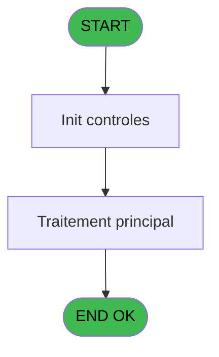

# VIL IDE 79 - Liste des paiements en attente

> **Analyse**: Phases 1-4 2026-02-03 09:11 -> 09:11 (20s) | Assemblage 09:11
> **Pipeline**: V7.2 Enrichi
> **Structure**: 4 onglets (Resume | Ecrans | Donnees | Connexions)

<!-- TAB:Resume -->

## 1. FICHE D'IDENTITE

| Attribut | Valeur |
|----------|--------|
| Projet | VIL |
| IDE Position | 79 |
| Nom Programme | Liste des paiements en attente |
| Fichier source | `Prg_79.xml` |
| Domaine metier | General |
| Taches | 2 (0 ecrans visibles) |
| Tables modifiees | 0 |
| Programmes appeles | 0 |

## 2. DESCRIPTION FONCTIONNELLE

**Liste des paiements en attente** assure la gestion complete de ce processus, accessible depuis [    Listings cloture HTML (IDE 29)](VIL-IDE-29.md).

Le flux de traitement s'organise en **2 blocs fonctionnels** :

- **Traitement** (1 tache) : traitements metier divers
- **Reglement** (1 tache) : gestion des moyens de paiement et reglements

**Logique metier** : 1 regles identifiees couvrant conditions metier.

Detail : phases du traitement

#### Phase 1 : Reglement (1 tache)

- **79** - Liste des paiements en attente **[[ECRAN]](#ecran-t1)**

#### Phase 2 : Traitement (1 tache)

- **79.1** - Total

## 3. BLOCS FONCTIONNELS

### 3.1 Reglement (1 tache)

Gestion des moyens de paiement : 1 tache de reglement.

---

#### 79 - Liste des paiements en attente [[ECRAN]](#ecran-t1)

**Role** : Gestion du reglement : Liste des paiements en attente.
**Ecran** : 1040 x 195 DLU | [Voir mockup](#ecran-t1)
**Variables liees** : P (v.total paiements en attente)

### 3.2 Traitement (1 tache)

Traitements internes.

---

#### 79.1 - Total

**Role** : Traitement : Total.
**Variables liees** : P (v.total paiements en attente)

## 5. REGLES METIER

1 regles identifiees:

### Autres (1 regles)

#### [RM-001] Traitement si [R] est renseigne

| Element | Detail |
|---------|--------|
| **Condition** | `[R]<>''` |
| **Si vrai** | Trim([R]) |
| **Si faux** | 'N9.2C') |
| **Expression source** | Expression 15 : `IF([R]<>'',Trim([R]),'N9.2C')` |
| **Exemple** | Si [R]<>'' → Trim([R]). Sinon → 'N9.2C') |

## 6. CONTEXTE

- **Appele par**: [    Listings cloture HTML (IDE 29)](VIL-IDE-29.md)
- **Appelle**: 0 programmes | **Tables**: 0 (W:0 R:0 L:0) | **Taches**: 2 | **Expressions**: 15

<!-- TAB:Ecrans -->

## 8. ECRANS

*(Programme sans ecran visible)*

## 9. NAVIGATION

### 9.3 Structure hierarchique (2 taches)

| Position | Tache | Type | Dimensions | Bloc |
|----------|-------|------|------------|------|
| **79.1** | [**Liste des paiements en attente** (79)](#t1) [mockup](#ecran-t1) | - | 1040x195 | Reglement |
| **79.2** | [**Total** (79.1)](#t2) | - | - | Traitement |

### 9.4 Algorigramme

> **Legende**: Vert = START/END OK | Rouge = END KO | Bleu = Decisions
> *Algorigramme auto-genere. Utiliser `/algorigramme` pour une synthese metier detaillee.*

<!-- TAB:Donnees -->

## 10. TABLES

### Tables utilisees (0)

| ID | Nom | Description | Type | R | W | L | Usages |
|----|-----|-------------|------|---|---|---|--------|

### Colonnes par table (0 / 0 tables avec colonnes identifiees)

## 11. VARIABLES

### 11.1 Parametres entrants (4)

Variables recues du programme appelant ([    Listings cloture HTML (IDE 29)](VIL-IDE-29.md)).

| Lettre | Nom | Type | Usage dans |
|--------|-----|------|-----------|
| A | P.i.Date comptable (clôture) | Date | - |
| B | P.i.Nom village | Alpha | 1x parametre entrant |
| C | P.i.Delai expiration | Numeric | - |
| D | P.i.masque montants | Alpha | - |

### 11.2 Variables de session (1)

Variables persistantes pendant toute la session.

| Lettre | Nom | Type | Usage dans |
|--------|-----|------|-----------|
| P | v.total paiements en attente | Numeric | - |

### 11.3 Autres (11)

Variables diverses.

| Lettre | Nom | Type | Usage dans |
|--------|-----|------|-----------|
| E | date_op | Alpha | 1x refs |
| F | paiement | Unicode | [79](#t1) |
| G | CPTE | Numeric | - |
| H | FIL | Numeric | - |
| I | gmc_nom_complet | Unicode | 2x refs |
| J | gmc_prenom_complet | Unicode | 1x refs |
| K | num_ticket | Numeric | 1x refs |
| L | type_table | Alpha | - |
| M | montant | Numeric | 2x refs |
| N | libelle | Unicode | 1x refs |
| O | date_exp | Alpha | - |

Toutes les 16 variables (liste complete)

| Cat | Lettre | Nom Variable | Type |
|-----|--------|--------------|------|
| P0 | **A** | P.i.Date comptable (clôture) | Date |
| P0 | **B** | P.i.Nom village | Alpha |
| P0 | **C** | P.i.Delai expiration | Numeric |
| P0 | **D** | P.i.masque montants | Alpha |
| V. | **P** | v.total paiements en attente | Numeric |
| Autre | **E** | date_op | Alpha |
| Autre | **F** | paiement | Unicode |
| Autre | **G** | CPTE | Numeric |
| Autre | **H** | FIL | Numeric |
| Autre | **I** | gmc_nom_complet | Unicode |
| Autre | **J** | gmc_prenom_complet | Unicode |
| Autre | **K** | num_ticket | Numeric |
| Autre | **L** | type_table | Alpha |
| Autre | **M** | montant | Numeric |
| Autre | **N** | libelle | Unicode |
| Autre | **O** | date_exp | Alpha |

## 12. EXPRESSIONS

**15 / 15 expressions decodees (100%)**

### 12.1 Repartition par type

| Type | Expressions | Regles |
|------|-------------|--------|
| CALCULATION | 2 | 0 |
| CONDITION | 1 | 5 |
| CONSTANTE | 1 | 0 |
| CONCATENATION | 1 | 0 |
| DATE | 2 | 0 |
| OTHER | 8 | 0 |

### 12.2 Expressions cles par type

#### CALCULATION (2 expressions)

| Type | IDE | Expression | Regle |
|------|-----|------------|-------|
| CALCULATION | 13 | `v.total paiements en a... [P]+gmc_nom_complet [I]` | - |
| CALCULATION | 9 | `-gmc_nom_complet [I]` | - |

#### CONDITION (1 expressions)

| Type | IDE | Expression | Regle |
|------|-----|------------|-------|
| CONDITION | 15 | `IF([R]<>'',Trim([R]),'N9.2C')` | [RM-001](#rm-RM-001) |

#### CONSTANTE (1 expressions)

| Type | IDE | Expression | Regle |
|------|-----|------------|-------|
| CONSTANTE | 12 | `0` | - |

#### CONCATENATION (1 expressions)

| Type | IDE | Expression | Regle |
|------|-----|------------|-------|
| CONCATENATION | 1 | `Trim (INIGet ('[MAGIC_LOGICAL_NAMES]club_exportdata')&'Cloture\Editions\Paiement_en_attente_'&DStr (montant [M],'YYYYMMDD')&'.htm')` | - |

#### DATE (2 expressions)

| Type | IDE | Expression | Regle |
|------|-----|------------|-------|
| DATE | 5 | `DVal(P.i.Date comptable (cl... [A],'YYYYMMDD')` | - |
| DATE | 4 | `Date()` | - |

#### OTHER (8 expressions)

| Type | IDE | Expression | Regle |
|------|-----|------------|-------|
| OTHER | 10 | `P.i.Nom village [B]` | - |
| OTHER | 8 | `gmc_prenom_complet [J]` | - |
| OTHER | 14 | `[Q]` | - |
| OTHER | 11 | `num_ticket [K]` | - |
| OTHER | 3 | `libelle [N]` | - |
| ... | | *+3 autres* | |

<!-- TAB:Connexions -->

## 13. GRAPHE D'APPELS

### 13.1 Chaine depuis Main (Callers)

Main -> ... -> [    Listings cloture HTML (IDE 29)](VIL-IDE-29.md) -> **Liste des paiements en attente (IDE 79)**

### 13.2 Callers

| IDE | Nom Programme | Nb Appels |
|-----|---------------|-----------|
| [29](VIL-IDE-29.md) |     Listings cloture HTML | 1 |

### 13.3 Callees (programmes appeles)

### 13.4 Detail Callees avec contexte

| IDE | Nom Programme | Appels | Contexte |
|-----|---------------|--------|----------|
| - | (aucun) | - | - |

## 14. RECOMMANDATIONS MIGRATION

### 14.1 Profil du programme

| Metrique | Valeur | Impact migration |
|----------|--------|-----------------|
| Lignes de logique | 28 | Programme compact |
| Expressions | 15 | Peu de logique |
| Tables WRITE | 0 | Impact faible |
| Sous-programmes | 0 | Peu de dependances |
| Ecrans visibles | 0 | Ecran unique ou traitement batch |
| Code desactive | 0% (0 / 28) | Code sain |
| Regles metier | 1 | Quelques regles a preserver |

### 14.2 Plan de migration par bloc

#### Reglement (1 tache: 1 ecran, 0 traitement)

- **Strategie** : Service `IReglementService` avec pattern Strategy par mode de paiement.
- Integration TPE si applicable

#### Traitement (1 tache: 0 ecran, 1 traitement)

- **Strategie** : 1 service(s) backend injectable(s) (Domain Services).
- Decomposer les taches en services unitaires testables.

### 14.3 Dependances critiques

| Dependance | Type | Appels | Impact |
|------------|------|--------|--------|

---
*Spec DETAILED generee par Pipeline V7.2 - 2026-02-03 09:11*
