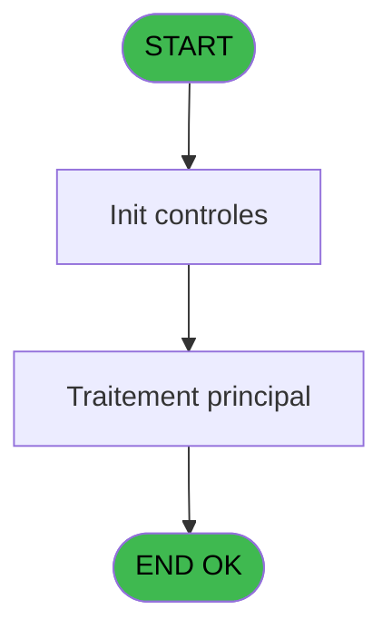

# VIL IDE 80 - Export Comptable Turquie

> **Analyse**: Phases 1-4 2026-02-03 09:12 -> 09:12 (19s) | Assemblage 09:12
> **Pipeline**: V7.2 Enrichi
> **Structure**: 4 onglets (Resume | Ecrans | Donnees | Connexions)

<!-- TAB:Resume -->

## 1. FICHE D'IDENTITE

| Attribut | Valeur |
|----------|--------|
| Projet | VIL |
| IDE Position | 80 |
| Nom Programme | Export Comptable Turquie |
| Fichier source | `Prg_80.xml` |
| Domaine metier | General |
| Taches | 1 (0 ecrans visibles) |
| Tables modifiees | 0 |
| Programmes appeles | 0 |

## 2. DESCRIPTION FONCTIONNELLE

**Export Comptable Turquie** assure la gestion complete de ce processus, accessible depuis [Pilotage après sessions (IDE 10)](VIL-IDE-10.md).

Le flux de traitement s'organise en **1 blocs fonctionnels** :

- **Calcul** (1 tache) : calculs de montants, stocks ou compteurs

## 3. BLOCS FONCTIONNELS

### 3.1 Calcul (1 tache)

Calculs metier : montants, stocks, compteurs.

---

#### 80 - Export Comptable Turquie [[ECRAN]](#ecran-t10)

**Role** : Traitement : Export Comptable Turquie.
**Ecran** : 1040 x 195 DLU | [Voir mockup](#ecran-t10)
**Variables liees** : A (P.i.Date comptable (clôture)), P (v. ligne export)

## 5. REGLES METIER

*(Aucune regle metier identifiee)*

## 6. CONTEXTE

- **Appele par**: [Pilotage après sessions (IDE 10)](VIL-IDE-10.md)
- **Appelle**: 0 programmes | **Tables**: 0 (W:0 R:0 L:0) | **Taches**: 1 | **Expressions**: 6

<!-- TAB:Ecrans -->

## 8. ECRANS

*(Programme sans ecran visible)*

## 9. NAVIGATION

### 9.3 Structure hierarchique (1 tache)

| Position | Tache | Type | Dimensions | Bloc |
|----------|-------|------|------------|------|
| **80.1** | [**Export Comptable Turquie** (80)](#t10) [mockup](#ecran-t10) | - | 1040x195 | Calcul |

### 9.4 Algorigramme

> **Legende**: Vert = START/END OK | Rouge = END KO | Bleu = Decisions
> *Algorigramme auto-genere. Utiliser `/algorigramme` pour une synthese metier detaillee.*

<!-- TAB:Donnees -->

## 10. TABLES

### Tables utilisees (0)

| ID | Nom | Description | Type | R | W | L | Usages |
|----|-----|-------------|------|---|---|---|--------|

### Colonnes par table (0 / 0 tables avec colonnes identifiees)

## 11. VARIABLES

### 11.1 Parametres entrants (1)

Variables recues du programme appelant ([Pilotage après sessions (IDE 10)](VIL-IDE-10.md)).

| Lettre | Nom | Type | Usage dans |
|--------|-----|------|-----------|
| A | P.i.Date comptable (clôture) | Date | - |

### 11.2 Variables de session (2)

Variables persistantes pendant toute la session.

| Lettre | Nom | Type | Usage dans |
|--------|-----|------|-----------|
| O | v. Séparateur virgule | Unicode | - |
| P | v. ligne export | Unicode | - |

### 11.3 Autres (13)

Variables diverses.

| Lettre | Nom | Type | Usage dans |
|--------|-----|------|-----------|
| B | AccountingDate | Alpha | 2x refs |
| C | SaleDate | Alpha | 2x refs |
| D | Imputation | Numeric | 2x refs |
| E | libelle | Unicode | 2x refs |
| F | VATRate | Numeric | 2x refs |
| G | AmountWT | Numeric | 2x refs |
| H | VATAmount | Numeric | 2x refs |
| I | AmountTaxIncluded | Numeric | 2x refs |
| J | LastName | Unicode | 2x refs |
| K | FirstName | Unicode | 2x refs |
| L | PlaceOfStay | Unicode | 1x refs |
| M | Quantity | Numeric | 3x refs |
| N | SaleType | Unicode | 1x refs |

Toutes les 16 variables (liste complete)

| Cat | Lettre | Nom Variable | Type |
|-----|--------|--------------|------|
| P0 | **A** | P.i.Date comptable (clôture) | Date |
| V. | **O** | v. Séparateur virgule | Unicode |
| V. | **P** | v. ligne export | Unicode |
| Autre | **B** | AccountingDate | Alpha |
| Autre | **C** | SaleDate | Alpha |
| Autre | **D** | Imputation | Numeric |
| Autre | **E** | libelle | Unicode |
| Autre | **F** | VATRate | Numeric |
| Autre | **G** | AmountWT | Numeric |
| Autre | **H** | VATAmount | Numeric |
| Autre | **I** | AmountTaxIncluded | Numeric |
| Autre | **J** | LastName | Unicode |
| Autre | **K** | FirstName | Unicode |
| Autre | **L** | PlaceOfStay | Unicode |
| Autre | **M** | Quantity | Numeric |
| Autre | **N** | SaleType | Unicode |

## 12. EXPRESSIONS

**6 / 6 expressions decodees (100%)**

### 12.1 Repartition par type

| Type | Expressions | Regles |
|------|-------------|--------|
| CONSTANTE | 1 | 0 |
| CONCATENATION | 2 | 0 |
| FORMAT | 2 | 0 |
| STRING | 1 | 0 |

### 12.2 Expressions cles par type

#### CONSTANTE (1 expressions)

| Type | IDE | Expression | Regle |
|------|-----|------------|-------|
| CONSTANTE | 2 | `','` | - |

#### CONCATENATION (2 expressions)

| Type | IDE | Expression | Regle |
|------|-----|------------|-------|
| CONCATENATION | 3 | `'AccountingDate'&[W]&'SaleDate'&[W]&'imputation'&[W]&'libelle'&[W]&'VATRate'&[W]&'AmountWT'&[W]&'VATAmount'&[W]&'AmountTaxIncluded'&[W]&'LastName'&[W]&'FirstName'&[W]&'PlaceOfStay'&[W]&'Quantity'&[W]&'SaleType'` | - |
| CONCATENATION | 1 | `Trim (INIGet ('[MAGIC_LOGICAL_NAMES]club_exportdata')&'Cloture\Editions\Export_'&ExpCalc('23'EXP)&'_'&DStr (Quantity [M],'YYYYMMDD')&'.csv')` | - |

#### FORMAT (2 expressions)

| Type | IDE | Expression | Regle |
|------|-----|------------|-------|
| FORMAT | 5 | `DStr(Quantity [M],'YYYYMMDD')` | - |
| FORMAT | 4 | `DStr(DVal(P.i.Date comptable (cl... [A],'YYYYMMDD'),'DD/MM/YYYY')&[W]&DStr(DVal(AccountingDate [B],'YYYYMMDD'),'DD/MM/YYYY')&[W]&Trim(Str(SaleDate [C],'10'))&[W]&Trim(Imputation [D])&[W]&Trim(Str(libelle [E],'8.2'))&[W]&Trim(Str(VATRate [F],'8.2'))&[W]&Trim(Str(AmountWT [G],'8.2'))&[W]&Trim(Str(VATAmount [H],'8.2'))&[W]&Trim(AmountTaxIncluded [I])&[W]&Trim(LastName [J])&[W]&Trim(FirstName [K])&[W]&Trim(Str([T],'3'))&[W]&Trim([U])` | - |

#### STRING (1 expressions)

| Type | IDE | Expression | Regle |
|------|-----|------------|-------|
| STRING | 6 | `Left(Trim(StrToken(INIGet('[MAGIC_DATABASES]Pms'),5,',')),4)` | - |

<!-- TAB:Connexions -->

## 13. GRAPHE D'APPELS

### 13.1 Chaine depuis Main (Callers)

Main -> ... -> [Pilotage après sessions (IDE 10)](VIL-IDE-10.md) -> **Export Comptable Turquie (IDE 80)**

### 13.2 Callers

| IDE | Nom Programme | Nb Appels |
|-----|---------------|-----------|
| [10](VIL-IDE-10.md) | Pilotage après sessions | 1 |

### 13.3 Callees (programmes appeles)

### 13.4 Detail Callees avec contexte

| IDE | Nom Programme | Appels | Contexte |
|-----|---------------|--------|----------|
| - | (aucun) | - | - |

## 14. RECOMMANDATIONS MIGRATION

### 14.1 Profil du programme

| Metrique | Valeur | Impact migration |
|----------|--------|-----------------|
| Lignes de logique | 24 | Programme compact |
| Expressions | 6 | Peu de logique |
| Tables WRITE | 0 | Impact faible |
| Sous-programmes | 0 | Peu de dependances |
| Ecrans visibles | 0 | Ecran unique ou traitement batch |
| Code desactive | 0% (0 / 24) | Code sain |
| Regles metier | 0 | Pas de regle identifiee |

### 14.2 Plan de migration par bloc

#### Calcul (1 tache: 1 ecran, 0 traitement)

- **Strategie** : Services de calcul purs (Domain Services).
- Migrer la logique de calcul (stock, compteurs, montants)

### 14.3 Dependances critiques

| Dependance | Type | Appels | Impact |
|------------|------|--------|--------|

---
*Spec DETAILED generee par Pipeline V7.2 - 2026-02-03 09:12*
