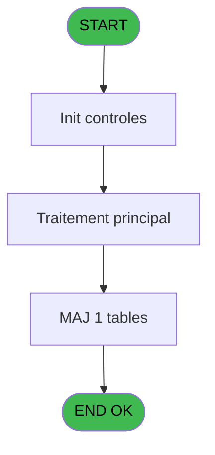

# VIL IDE 82 - Calcul concurrence session T2H

> **Analyse**: Phases 1-4 2026-02-03 09:12 -> 09:13 (20s) | Assemblage 09:13
> **Pipeline**: V7.2 Enrichi
> **Structure**: 4 onglets (Resume | Ecrans | Donnees | Connexions)

<!-- TAB:Resume -->

## 1. FICHE D'IDENTITE

| Attribut | Valeur |
|----------|--------|
| Projet | VIL |
| IDE Position | 82 |
| Nom Programme | Calcul concurrence session T2H |
| Fichier source | `Prg_82.xml` |
| Domaine metier | Caisse |
| Taches | 3 (0 ecrans visibles) |
| Tables modifiees | 1 |
| Programmes appeles | 0 |
| :warning: Statut | **ORPHELIN_POTENTIEL** |

## 2. DESCRIPTION FONCTIONNELLE

**Calcul concurrence session T2H** assure la gestion complete de ce processus.

Le flux de traitement s'organise en **1 blocs fonctionnels** :

- **Traitement** (3 taches) : traitements metier divers

**Donnees modifiees** : 1 tables en ecriture (concurrence_sessions).

## 3. BLOCS FONCTIONNELS

### 3.1 Traitement (3 taches)

Traitements internes.

---

#### 82 - (sans nom)

**Role** : Traitement interne.

---

#### 82.1 - Blocage reception

**Role** : Traitement : Blocage reception.
**Variables liees** : E (PO saisie reception en cours)

---

#### 82.2 - Deblocage reception

**Role** : Traitement : Deblocage reception.
**Variables liees** : E (PO saisie reception en cours)

## 5. REGLES METIER

*(Aucune regle metier identifiee)*

## 6. CONTEXTE

- **Appele par**: (aucun)
- **Appelle**: 0 programmes | **Tables**: 1 (W:1 R:1 L:0) | **Taches**: 3 | **Expressions**: 12

<!-- TAB:Ecrans -->

## 8. ECRANS

*(Programme sans ecran visible)*

## 9. NAVIGATION

### 9.3 Structure hierarchique (3 taches)

| Position | Tache | Type | Dimensions | Bloc |
|----------|-------|------|------------|------|
| **82.1** | [**(sans nom)** (82)](#t1) | MDI | - | Traitement |
| 82.1.1 | [Blocage reception (82.1)](#t2) | MDI | - | |
| 82.1.2 | [Deblocage reception (82.2)](#t3) | MDI | - | |

### 9.4 Algorigramme

> **Legende**: Vert = START/END OK | Rouge = END KO | Bleu = Decisions
> *Algorigramme auto-genere. Utiliser `/algorigramme` pour une synthese metier detaillee.*

<!-- TAB:Donnees -->

## 10. TABLES

### Tables utilisees (1)

| ID | Nom | Description | Type | R | W | L | Usages |
|----|-----|-------------|------|---|---|---|--------|
| 227 | concurrence_sessions | Sessions de caisse | DB | R | **W** |   | 3 |

### Colonnes par table (1 / 1 tables avec colonnes identifiees)

Table 227 - concurrence_sessions (R/**W**) - 3 usages

| Lettre | Variable | Acces | Type |
|--------|----------|-------|------|
| A | PI code calcul | W | Alpha |
| B | PI avec coffre 2 | W | Alpha |
| C | PI terminal coffre 2 | W | Numeric |
| D | p.i.Host coffre 2 | W | Unicode |
| E | PO saisie reception en cours | W | Alpha |
| F | SaisieRec sans coffre 2 | W | Logical |
| G | SaisieRec avec coffre 2 | W | Logical |

## 11. VARIABLES

### 11.1 Parametres entrants (5)

Variables recues en parametre.

| Lettre | Nom | Type | Usage dans |
|--------|-----|------|-----------|
| A | PI code calcul | Alpha | 2x parametre entrant |
| B | PI avec coffre 2 | Alpha | 2x parametre entrant |
| C | PI terminal coffre 2 | Numeric | - |
| D | p.i.Host coffre 2 | Unicode | - |
| E | PO saisie reception en cours | Alpha | - |

### 11.2 Autres (2)

Variables diverses.

| Lettre | Nom | Type | Usage dans |
|--------|-----|------|-----------|
| F | SaisieRec sans coffre 2 | Logical | - |
| G | SaisieRec avec coffre 2 | Logical | - |

## 12. EXPRESSIONS

**12 / 12 expressions decodees (100%)**

### 12.1 Repartition par type

| Type | Expressions | Regles |
|------|-------------|--------|
| CONSTANTE | 3 | 0 |
| CONDITION | 4 | 0 |
| OTHER | 3 | 0 |
| NEGATION | 2 | 0 |

### 12.2 Expressions cles par type

#### CONSTANTE (3 expressions)

| Type | IDE | Expression | Regle |
|------|-----|------------|-------|
| CONSTANTE | 8 | `'O'` | - |
| CONSTANTE | 6 | `'O'` | - |
| CONSTANTE | 5 | `'R'` | - |

#### CONDITION (4 expressions)

| Type | IDE | Expression | Regle |
|------|-----|------------|-------|
| CONDITION | 3 | `PI avec coffre 2 [B]='O'` | - |
| CONDITION | 4 | `PI code calcul [A]='D'` | - |
| CONDITION | 1 | `PI code calcul [A]='C'` | - |
| CONDITION | 2 | `PI avec coffre 2 [B]<>'O'` | - |

#### OTHER (3 expressions)

| Type | IDE | Expression | Regle |
|------|-----|------------|-------|
| OTHER | 10 | `[H]` | - |
| OTHER | 9 | `PO saisie reception en... [E]` | - |
| OTHER | 7 | `[X]` | - |

#### NEGATION (2 expressions)

| Type | IDE | Expression | Regle |
|------|-----|------------|-------|
| NEGATION | 12 | `NOT ([H])` | - |
| NEGATION | 11 | `NOT (PO saisie reception en... [E])` | - |

<!-- TAB:Connexions -->

## 13. GRAPHE D'APPELS

### 13.1 Chaine depuis Main (Callers)

**Chemin**: (pas de callers directs)

### 13.2 Callers

| IDE | Nom Programme | Nb Appels |
|-----|---------------|-----------|
| - | (aucun) | - |

### 13.3 Callees (programmes appeles)

### 13.4 Detail Callees avec contexte

| IDE | Nom Programme | Appels | Contexte |
|-----|---------------|--------|----------|
| - | (aucun) | - | - |

## 14. RECOMMANDATIONS MIGRATION

### 14.1 Profil du programme

| Metrique | Valeur | Impact migration |
|----------|--------|-----------------|
| Lignes de logique | 69 | Programme compact |
| Expressions | 12 | Peu de logique |
| Tables WRITE | 1 | Impact faible |
| Sous-programmes | 0 | Peu de dependances |
| Ecrans visibles | 0 | Ecran unique ou traitement batch |
| Code desactive | 0% (0 / 69) | Code sain |
| Regles metier | 0 | Pas de regle identifiee |

### 14.2 Plan de migration par bloc

#### Traitement (3 taches: 0 ecran, 3 traitements)

- **Strategie** : 3 service(s) backend injectable(s) (Domain Services).
- Decomposer les taches en services unitaires testables.

### 14.3 Dependances critiques

| Dependance | Type | Appels | Impact |
|------------|------|--------|--------|
| concurrence_sessions | Table WRITE (Database) | 2x | Schema + repository |

---
*Spec DETAILED generee par Pipeline V7.2 - 2026-02-03 09:13*
