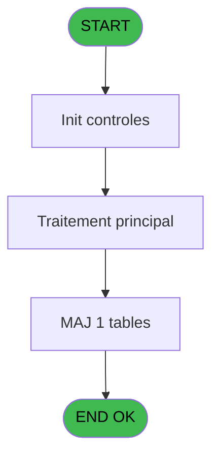
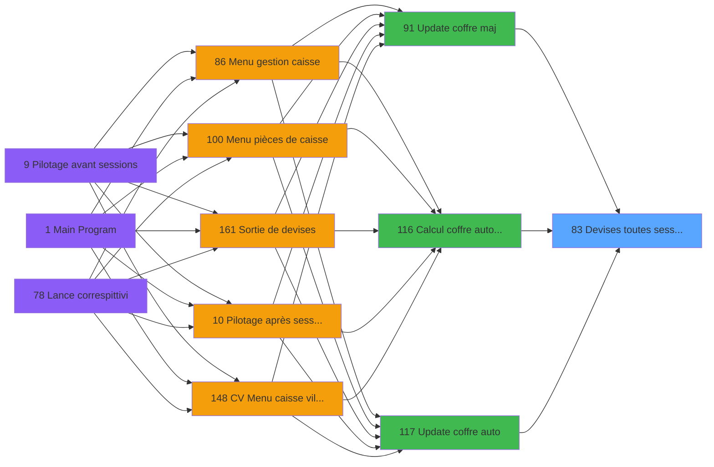

# VIL IDE 83 - Devises toutes sessions

> **Analyse**: Phases 1-4 2026-02-03 09:13 -> 09:13 (19s) | Assemblage 09:13
> **Pipeline**: V7.2 Enrichi
> **Structure**: 4 onglets (Resume | Ecrans | Donnees | Connexions)

<!-- TAB:Resume -->

## 1. FICHE D'IDENTITE

| Attribut | Valeur |
|----------|--------|
| Projet | VIL |
| IDE Position | 83 |
| Nom Programme | Devises toutes sessions |
| Fichier source | `Prg_83.xml` |
| Domaine metier | Caisse |
| Taches | 9 (0 ecrans visibles) |
| Tables modifiees | 1 |
| Programmes appeles | 0 |

## 2. DESCRIPTION FONCTIONNELLE

**Devises toutes sessions** assure la gestion complete de ce processus, accessible depuis [Update coffre maj (IDE 91)](VIL-IDE-91.md), [Calcul coffre auto avec (IDE 116)](VIL-IDE-116.md), [Update coffre auto (IDE 117)](VIL-IDE-117.md).

Le flux de traitement s'organise en **1 blocs fonctionnels** :

- **Traitement** (9 taches) : traitements metier divers

**Donnees modifiees** : 1 tables en ecriture (pv_customer).

Detail : phases du traitement

#### Phase 1 : Traitement (9 taches)

- **83** - toutes Sessions
- **83.1** - dern session
- **83.2** - Etat de la caisse
- **83.3** - mvt devises
- **83.3.1** - MAJ total de la journee
- **83.4** - Session devise
- **83.4.1** - MAJ total de la journee
- **83.5** - mvt devises
- **83.5.1** - MAJ total de la journee

#### Tables impactees

| Table | Operations | Role metier |
|-------|-----------|-------------|
| pv_customer | **W** (3 usages) |  |

## 3. BLOCS FONCTIONNELS

### 3.1 Traitement (9 taches)

Traitements internes.

---

#### 83 - toutes Sessions

**Role** : Tache d'orchestration : point d'entree du programme (9 sous-taches). Coordonne l'enchainement des traitements.

8 sous-taches directes

| Tache | Nom | Bloc |
|-------|-----|------|
| [83.1](#t2) | dern session | Traitement |
| [83.2](#t3) | Etat de la caisse | Traitement |
| [83.3](#t4) | mvt devises | Traitement |
| [83.3.1](#t5) | MAJ total de la journee | Traitement |
| [83.4](#t6) | Session devise | Traitement |
| [83.4.1](#t7) | MAJ total de la journee | Traitement |
| [83.5](#t10) | mvt devises | Traitement |
| [83.5.1](#t11) | MAJ total de la journee | Traitement |

---

#### 83.1 - dern session

**Role** : Traitement : dern session.
**Variables liees** : E (lastSession)

---

#### 83.2 - Etat de la caisse

**Role** : Traitement : Etat de la caisse.

---

#### 83.3 - mvt devises

**Role** : Traitement : mvt devises.

---

#### 83.3.1 - MAJ total de la journee

**Role** : Traitement : MAJ total de la journee.

---

#### 83.4 - Session devise

**Role** : Traitement : Session devise.
**Variables liees** : E (lastSession)

---

#### 83.4.1 - MAJ total de la journee

**Role** : Traitement : MAJ total de la journee.

---

#### 83.5 - mvt devises

**Role** : Traitement : mvt devises.

---

#### 83.5.1 - MAJ total de la journee

**Role** : Traitement : MAJ total de la journee.

## 5. REGLES METIER

*(Aucune regle metier identifiee)*

## 6. CONTEXTE

- **Appele par**: [Update coffre maj (IDE 91)](VIL-IDE-91.md), [Calcul coffre auto avec (IDE 116)](VIL-IDE-116.md), [Update coffre auto (IDE 117)](VIL-IDE-117.md)
- **Appelle**: 0 programmes | **Tables**: 5 (W:1 R:3 L:1) | **Taches**: 9 | **Expressions**: 4

<!-- TAB:Ecrans -->

## 8. ECRANS

*(Programme sans ecran visible)*

## 9. NAVIGATION

### 9.3 Structure hierarchique (9 taches)

| Position | Tache | Type | Dimensions | Bloc |
|----------|-------|------|------------|------|
| **83.1** | [**toutes Sessions** (83)](#t1) | MDI | - | Traitement |
| 83.1.1 | [dern session (83.1)](#t2) | MDI | - | |
| 83.1.2 | [Etat de la caisse (83.2)](#t3) | MDI | - | |
| 83.1.3 | [mvt devises (83.3)](#t4) | MDI | - | |
| 83.1.4 | [MAJ total de la journee (83.3.1)](#t5) | MDI | - | |
| 83.1.5 | [Session devise (83.4)](#t6) | MDI | - | |
| 83.1.6 | [MAJ total de la journee (83.4.1)](#t7) | MDI | - | |
| 83.1.7 | [mvt devises (83.5)](#t10) | MDI | - | |
| 83.1.8 | [MAJ total de la journee (83.5.1)](#t11) | MDI | - | |

### 9.4 Algorigramme

> **Legende**: Vert = START/END OK | Rouge = END KO | Bleu = Decisions
> *Algorigramme auto-genere. Utiliser `/algorigramme` pour une synthese metier detaillee.*

<!-- TAB:Donnees -->

## 10. TABLES

### Tables utilisees (5)

| ID | Nom | Description | Type | R | W | L | Usages |
|----|-----|-------------|------|---|---|---|--------|
| 232 | gestion_devise_session | Sessions de caisse | DB | R |   |   | 1 |
| 246 | histo_sessions_caisse | Sessions de caisse | DB | R |   |   | 2 |
| 249 | histo_sessions_caisse_detail | Sessions de caisse | DB | R |   |   | 3 |
| 250 | histo_sessions_caisse_devise | Sessions de caisse | DB |   |   | L | 2 |
| 508 | pv_customer |  | TMP |   | **W** |   | 3 |

### Colonnes par table (2 / 4 tables avec colonnes identifiees)

Table 232 - gestion_devise_session (R) - 1 usages

| Lettre | Variable | Acces | Type |
|--------|----------|-------|------|
| E | lastSession | R | Numeric |

Table 246 - histo_sessions_caisse (R) - 2 usages

| Lettre | Variable | Acces | Type |
|--------|----------|-------|------|
| A | PI Coffre2 est actif | R | Alpha |
| B | PI Terminal du coffre2 | R | Numeric |
| C | PI Hostname du coffre2 | R | Unicode |
| D | PI cloture auto est en cours | R | Logical |
| E | lastSession | R | Numeric |
| F | existe ligne F/F | R | Logical |

Table 249 - histo_sessions_caisse_detail (R) - 3 usages

*Table utilisee uniquement en Link ou aucune colonne Real identifiee dans le DataView.*

Table 508 - pv_customer (**W**) - 3 usages

*Table utilisee uniquement en Link ou aucune colonne Real identifiee dans le DataView.*

## 11. VARIABLES

### 11.1 Parametres entrants (4)

Variables recues du programme appelant ([Update coffre maj (IDE 91)](VIL-IDE-91.md)).

| Lettre | Nom | Type | Usage dans |
|--------|-----|------|-----------|
| A | PI Coffre2 est actif | Alpha | - |
| B | PI Terminal du coffre2 | Numeric | - |
| C | PI Hostname du coffre2 | Unicode | 1x parametre entrant |
| D | PI cloture auto est en cours | Logical | - |

### 11.2 Autres (2)

Variables diverses.

| Lettre | Nom | Type | Usage dans |
|--------|-----|------|-----------|
| E | lastSession | Numeric | - |
| F | existe ligne F/F | Logical | - |

## 12. EXPRESSIONS

**4 / 4 expressions decodees (100%)**

### 12.1 Repartition par type

| Type | Expressions | Regles |
|------|-------------|--------|
| OTHER | 1 | 0 |
| NEGATION | 2 | 0 |
| REFERENCE_VG | 1 | 0 |

### 12.2 Expressions cles par type

#### OTHER (1 expressions)

| Type | IDE | Expression | Regle |
|------|-----|------------|-------|
| OTHER | 1 | `[H]` | - |

#### NEGATION (2 expressions)

| Type | IDE | Expression | Regle |
|------|-----|------------|-------|
| NEGATION | 3 | `NOT VG39` | - |
| NEGATION | 2 | `NOT ([H]) AND NOT (PI Hostname du coffre2 [C])` | - |

#### REFERENCE_VG (1 expressions)

| Type | IDE | Expression | Regle |
|------|-----|------------|-------|
| REFERENCE_VG | 4 | `VG39` | - |

<!-- TAB:Connexions -->

## 13. GRAPHE D'APPELS

### 13.1 Chaine depuis Main (Callers)

Main -> ... -> [Update coffre maj (IDE 91)](VIL-IDE-91.md) -> **Devises toutes sessions (IDE 83)**

Main -> ... -> [Calcul coffre auto avec (IDE 116)](VIL-IDE-116.md) -> **Devises toutes sessions (IDE 83)**

Main -> ... -> [Update coffre auto (IDE 117)](VIL-IDE-117.md) -> **Devises toutes sessions (IDE 83)**

### 13.2 Callers

| IDE | Nom Programme | Nb Appels |
|-----|---------------|-----------|
| [91](VIL-IDE-91.md) | Update coffre maj | 1 |
| [116](VIL-IDE-116.md) | Calcul coffre auto avec | 1 |
| [117](VIL-IDE-117.md) | Update coffre auto | 1 |

### 13.3 Callees (programmes appeles)

### 13.4 Detail Callees avec contexte

| IDE | Nom Programme | Appels | Contexte |
|-----|---------------|--------|----------|
| - | (aucun) | - | - |

## 14. RECOMMANDATIONS MIGRATION

### 14.1 Profil du programme

| Metrique | Valeur | Impact migration |
|----------|--------|-----------------|
| Lignes de logique | 122 | Programme compact |
| Expressions | 4 | Peu de logique |
| Tables WRITE | 1 | Impact faible |
| Sous-programmes | 0 | Peu de dependances |
| Ecrans visibles | 0 | Ecran unique ou traitement batch |
| Code desactive | 0% (0 / 122) | Code sain |
| Regles metier | 0 | Pas de regle identifiee |

### 14.2 Plan de migration par bloc

#### Traitement (9 taches: 0 ecran, 9 traitements)

- **Strategie** : 9 service(s) backend injectable(s) (Domain Services).
- Decomposer les taches en services unitaires testables.

### 14.3 Dependances critiques

| Dependance | Type | Appels | Impact |
|------------|------|--------|--------|
| pv_customer | Table WRITE (Temp) | 3x | Schema + repository |

---
*Spec DETAILED generee par Pipeline V7.2 - 2026-02-03 09:13*
