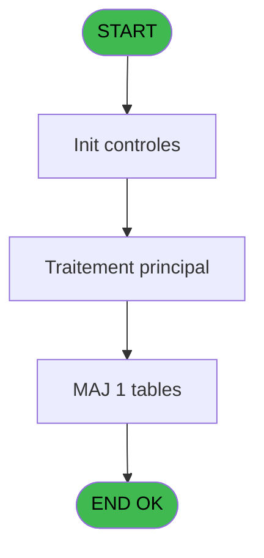
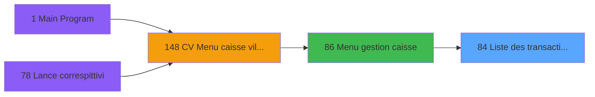

# VIL IDE 84 - Liste des transactions genère

> **Analyse**: Phases 1-4 2026-02-03 09:13 -> 09:14 (19s) | Assemblage 09:14
> **Pipeline**: V7.2 Enrichi
> **Structure**: 4 onglets (Resume | Ecrans | Donnees | Connexions)

<!-- TAB:Resume -->

## 1. FICHE D'IDENTITE

| Attribut | Valeur |
|----------|--------|
| Projet | VIL |
| IDE Position | 84 |
| Nom Programme | Liste des transactions genère |
| Fichier source | `Prg_84.xml` |
| Domaine metier | Ventes |
| Taches | 5 (0 ecrans visibles) |
| Tables modifiees | 1 |
| Programmes appeles | 0 |

## 2. DESCRIPTION FONCTIONNELLE

**Liste des transactions genère** assure la gestion complete de ce processus, accessible depuis [Menu gestion caisse (IDE 86)](VIL-IDE-86.md).

Le flux de traitement s'organise en **2 blocs fonctionnels** :

- **Traitement** (3 taches) : traitements metier divers
- **Saisie** (2 taches) : ecrans de saisie utilisateur (formulaires, champs, donnees)

**Donnees modifiees** : 1 tables en ecriture (email_pointage).

Detail : phases du traitement

#### Phase 1 : Saisie (2 taches)

- **84** - Liste des transactions genère
- **84.2** - ventes

#### Phase 2 : Traitement (3 taches)

- **84.1** - od
- **84.1.1** - gener tempo
- **84.2.1** - gener tempo

#### Tables impactees

| Table | Operations | Role metier |
|-------|-----------|-------------|
| email_pointage | **W**/L (4 usages) |  |

## 3. BLOCS FONCTIONNELS

### 3.1 Saisie (2 taches)

Ce bloc traite la saisie des donnees de la transaction.

---

#### 84 - Liste des transactions genère

**Role** : Saisie des donnees : Liste des transactions genère.

---

#### 84.2 - ventes

**Role** : Saisie des donnees : ventes.

### 3.2 Traitement (3 taches)

Traitements internes.

---

#### 84.1 - od

**Role** : Traitement interne.

---

#### 84.1.1 - gener tempo

**Role** : Traitement : gener tempo.

---

#### 84.2.1 - gener tempo

**Role** : Traitement : gener tempo.

## 5. REGLES METIER

*(Aucune regle metier identifiee)*

## 6. CONTEXTE

- **Appele par**: [Menu gestion caisse (IDE 86)](VIL-IDE-86.md)
- **Appelle**: 0 programmes | **Tables**: 3 (W:1 R:2 L:1) | **Taches**: 5 | **Expressions**: 2

<!-- TAB:Ecrans -->

## 8. ECRANS

*(Programme sans ecran visible)*

## 9. NAVIGATION

### 9.3 Structure hierarchique (5 taches)

| Position | Tache | Type | Dimensions | Bloc |
|----------|-------|------|------------|------|
| **84.1** | [**Liste des transactions genère** (84)](#t1) | MDI | - | Saisie |
| 84.1.1 | [ventes (84.2)](#t4) | MDI | - | |
| **84.2** | [**od** (84.1)](#t2) | MDI | - | Traitement |
| 84.2.1 | [gener tempo (84.1.1)](#t3) | MDI | - | |
| 84.2.2 | [gener tempo (84.2.1)](#t5) | MDI | - | |

### 9.4 Algorigramme

> **Legende**: Vert = START/END OK | Rouge = END KO | Bleu = Decisions
> *Algorigramme auto-genere. Utiliser `/algorigramme` pour une synthese metier detaillee.*

<!-- TAB:Donnees -->

## 10. TABLES

### Tables utilisees (3)

| ID | Nom | Description | Type | R | W | L | Usages |
|----|-----|-------------|------|---|---|---|--------|
| 40 | comptable________cte |  | DB | R |   |   | 1 |
| 263 | vente | Donnees de ventes | DB | R |   |   | 1 |
| 500 | email_pointage |  | TMP |   | **W** | L | 4 |

### Colonnes par table (0 / 3 tables avec colonnes identifiees)

Table 40 - comptable________cte (R) - 1 usages

*Table utilisee uniquement en Link ou aucune colonne Real identifiee dans le DataView.*

Table 263 - vente (R) - 1 usages

*Table utilisee uniquement en Link ou aucune colonne Real identifiee dans le DataView.*

Table 500 - email_pointage (**W**/L) - 4 usages

*Table utilisee uniquement en Link ou aucune colonne Real identifiee dans le DataView.*

## 11. VARIABLES

### 11.1 Autres (6)

Variables diverses.

| Lettre | Nom | Type | Usage dans |
|--------|-----|------|-----------|
| A | param code selection | Alpha | - |
| B | param date mini | Date | - |
| C | param date maxi | Date | - |
| D | param imputation | Numeric | - |
| E | param mop | Alpha | 1x refs |
| F | param user | Alpha | - |

## 12. EXPRESSIONS

**2 / 2 expressions decodees (100%)**

### 12.1 Repartition par type

| Type | Expressions | Regles |
|------|-------------|--------|
| OTHER | 1 | 0 |
| CONDITION | 1 | 0 |

### 12.2 Expressions cles par type

#### OTHER (1 expressions)

| Type | IDE | Expression | Regle |
|------|-----|------------|-------|
| OTHER | 1 | `DbDel ('{500,2}'DSOURCE,'')` | - |

#### CONDITION (1 expressions)

| Type | IDE | Expression | Regle |
|------|-----|------------|-------|
| CONDITION | 2 | `param mop [E]='' OR param mop [E]='OD'` | - |

<!-- TAB:Connexions -->

## 13. GRAPHE D'APPELS

### 13.1 Chaine depuis Main (Callers)

Main -> ... -> [Menu gestion caisse (IDE 86)](VIL-IDE-86.md) -> **Liste des transactions genère (IDE 84)**

### 13.2 Callers

| IDE | Nom Programme | Nb Appels |
|-----|---------------|-----------|
| [86](VIL-IDE-86.md) | Menu gestion caisse | 1 |

### 13.3 Callees (programmes appeles)

### 13.4 Detail Callees avec contexte

| IDE | Nom Programme | Appels | Contexte |
|-----|---------------|--------|----------|
| - | (aucun) | - | - |

## 14. RECOMMANDATIONS MIGRATION

### 14.1 Profil du programme

| Metrique | Valeur | Impact migration |
|----------|--------|-----------------|
| Lignes de logique | 167 | Programme compact |
| Expressions | 2 | Peu de logique |
| Tables WRITE | 1 | Impact faible |
| Sous-programmes | 0 | Peu de dependances |
| Ecrans visibles | 0 | Ecran unique ou traitement batch |
| Code desactive | 0% (0 / 167) | Code sain |
| Regles metier | 0 | Pas de regle identifiee |

### 14.2 Plan de migration par bloc

#### Saisie (2 taches: 0 ecran, 2 traitements)

- **Strategie** : Formulaire React/Blazor avec validation Zod/FluentValidation.
- Validation temps reel cote client + serveur

#### Traitement (3 taches: 0 ecran, 3 traitements)

- **Strategie** : 3 service(s) backend injectable(s) (Domain Services).
- Decomposer les taches en services unitaires testables.

### 14.3 Dependances critiques

| Dependance | Type | Appels | Impact |
|------------|------|--------|--------|
| email_pointage | Table WRITE (Temp) | 2x | Schema + repository |

---
*Spec DETAILED generee par Pipeline V7.2 - 2026-02-03 09:14*
