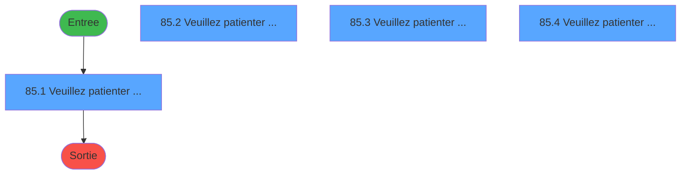
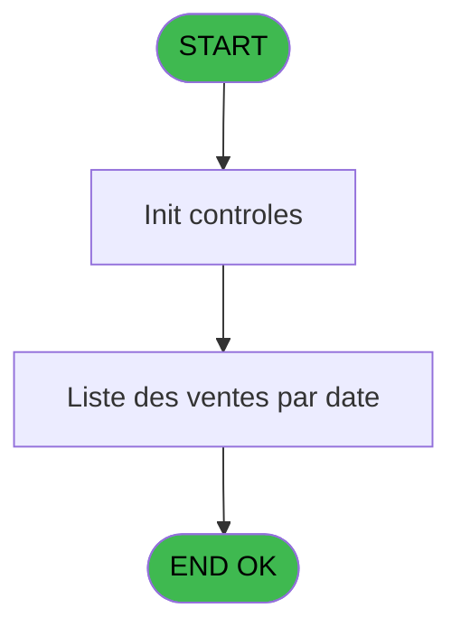
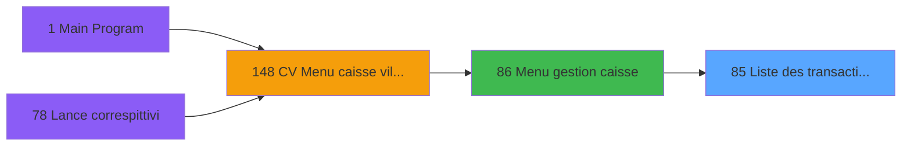

# VIL IDE 85 - Liste des transactions imprime

> **Analyse**: Phases 1-4 2026-02-03 09:14 -> 09:14 (19s) | Assemblage 09:14
> **Pipeline**: V7.2 Enrichi
> **Structure**: 4 onglets (Resume | Ecrans | Donnees | Connexions)

<!-- TAB:Resume -->

## 1. FICHE D'IDENTITE

| Attribut | Valeur |
|----------|--------|
| Projet | VIL |
| IDE Position | 85 |
| Nom Programme | Liste des transactions imprime |
| Fichier source | `Prg_85.xml` |
| Domaine metier | Ventes |
| Taches | 5 (4 ecrans visibles) |
| Tables modifiees | 0 |
| Programmes appeles | 0 |

## 2. DESCRIPTION FONCTIONNELLE

**Liste des transactions imprime** assure la gestion complete de ce processus, accessible depuis [Menu gestion caisse (IDE 86)](VIL-IDE-86.md).

Le flux de traitement s'organise en **2 blocs fonctionnels** :

- **Traitement** (4 taches) : traitements metier divers
- **Saisie** (1 tache) : ecrans de saisie utilisateur (formulaires, champs, donnees)

Detail : phases du traitement

#### Phase 1 : Saisie (1 tache)

- **85** - Liste des ventes WS **[[ECRAN]](#ecran-t1)**

#### Phase 2 : Traitement (4 taches)

- **85.1** - Veuillez patienter ..... **[[ECRAN]](#ecran-t2)**
- **85.2** - Veuillez patienter ..... **[[ECRAN]](#ecran-t3)**
- **85.3** - Veuillez patienter ..... **[[ECRAN]](#ecran-t4)**
- **85.4** - Veuillez patienter ..... **[[ECRAN]](#ecran-t5)**

## 3. BLOCS FONCTIONNELS

### 3.1 Saisie (1 tache)

L'operateur saisit les donnees de la transaction via 1 ecran (Liste des ventes WS).

---

#### 85 - Liste des ventes WS [[ECRAN]](#ecran-t1)

**Role** : Saisie des donnees : Liste des ventes WS.
**Ecran** : 422 x 56 DLU (MDI) | [Voir mockup](#ecran-t1)

### 3.2 Traitement (4 taches)

Traitements internes.

---

#### 85.1 - Veuillez patienter ..... [[ECRAN]](#ecran-t2)

**Role** : Traitement : Veuillez patienter ......
**Ecran** : 422 x 56 DLU (MDI) | [Voir mockup](#ecran-t2)

---

#### 85.2 - Veuillez patienter ..... [[ECRAN]](#ecran-t3)

**Role** : Traitement : Veuillez patienter ......
**Ecran** : 422 x 56 DLU (MDI) | [Voir mockup](#ecran-t3)

---

#### 85.3 - Veuillez patienter ..... [[ECRAN]](#ecran-t4)

**Role** : Traitement : Veuillez patienter ......
**Ecran** : 422 x 56 DLU (MDI) | [Voir mockup](#ecran-t4)

---

#### 85.4 - Veuillez patienter ..... [[ECRAN]](#ecran-t5)

**Role** : Traitement : Veuillez patienter ......
**Ecran** : 422 x 56 DLU (MDI) | [Voir mockup](#ecran-t5)

## 5. REGLES METIER

*(Aucune regle metier identifiee)*

## 6. CONTEXTE

- **Appele par**: [Menu gestion caisse (IDE 86)](VIL-IDE-86.md)
- **Appelle**: 0 programmes | **Tables**: 6 (W:0 R:1 L:5) | **Taches**: 5 | **Expressions**: 4

<!-- TAB:Ecrans -->

## 8. ECRANS

### 8.1 Forms visibles (4 / 5)

| # | Position | Tache | Nom | Type | Largeur | Hauteur | Bloc |
|---|----------|-------|-----|------|---------|---------|------|
| 1 | 85.1 | 85.1 | Veuillez patienter ..... | MDI | 422 | 56 | Traitement |
| 2 | 85.2 | 85.2 | Veuillez patienter ..... | MDI | 422 | 56 | Traitement |
| 3 | 85.3 | 85.3 | Veuillez patienter ..... | MDI | 422 | 56 | Traitement |
| 4 | 85.4 | 85.4 | Veuillez patienter ..... | MDI | 422 | 56 | Traitement |

### 8.2 Mockups Ecrans

---

#### 85.1 - Veuillez patienter .....
**Tache** : [85.1](#t2) | **Type** : MDI | **Dimensions** : 422 x 56 DLU
**Bloc** : Traitement | **Titre IDE** : Veuillez patienter .....

<!-- FORM-DATA:
{
    "width":  422,
    "vFactor":  8,
    "type":  "MDI",
    "hFactor":  8,
    "controls":  [
                     {
                         "x":  0,
                         "type":  "label",
                         "var":  "",
                         "y":  0,
                         "w":  423,
                         "fmt":  "",
                         "name":  "",
                         "h":  29,
                         "color":  "",
                         "text":  "",
                         "parent":  null
                     },
                     {
                         "x":  117,
                         "type":  "label",
                         "var":  "",
                         "y":  10,
                         "w":  275,
                         "fmt":  "",
                         "name":  "",
                         "h":  8,
                         "color":  "7",
                         "text":  "Impression en cours",
                         "parent":  null
                     },
                     {
                         "x":  0,
                         "type":  "label",
                         "var":  "",
                         "y":  29,
                         "w":  423,
                         "fmt":  "",
                         "name":  "",
                         "h":  27,
                         "color":  "",
                         "text":  "",
                         "parent":  null
                     },
                     {
                         "x":  70,
                         "type":  "label",
                         "var":  "",
                         "y":  39,
                         "w":  282,
                         "fmt":  "",
                         "name":  "",
                         "h":  8,
                         "color":  "",
                         "text":  "Impression listing comptable",
                         "parent":  null
                     },
                     {
                         "x":  1,
                         "type":  "image",
                         "var":  "",
                         "y":  2,
                         "w":  72,
                         "fmt":  "",
                         "name":  "",
                         "h":  25,
                         "color":  "",
                         "text":  "",
                         "parent":  null
                     }
                 ],
    "taskId":  "85.1",
    "height":  56
}
-->

---

#### 85.2 - Veuillez patienter .....
**Tache** : [85.2](#t3) | **Type** : MDI | **Dimensions** : 422 x 56 DLU
**Bloc** : Traitement | **Titre IDE** : Veuillez patienter .....

<!-- FORM-DATA:
{
    "width":  422,
    "vFactor":  8,
    "type":  "MDI",
    "hFactor":  8,
    "controls":  [
                     {
                         "x":  0,
                         "type":  "label",
                         "var":  "",
                         "y":  0,
                         "w":  423,
                         "fmt":  "",
                         "name":  "",
                         "h":  29,
                         "color":  "",
                         "text":  "",
                         "parent":  null
                     },
                     {
                         "x":  117,
                         "type":  "label",
                         "var":  "",
                         "y":  10,
                         "w":  275,
                         "fmt":  "",
                         "name":  "",
                         "h":  8,
                         "color":  "7",
                         "text":  "Impression en cours",
                         "parent":  null
                     },
                     {
                         "x":  0,
                         "type":  "label",
                         "var":  "",
                         "y":  29,
                         "w":  423,
                         "fmt":  "",
                         "name":  "",
                         "h":  27,
                         "color":  "",
                         "text":  "",
                         "parent":  null
                     },
                     {
                         "x":  70,
                         "type":  "label",
                         "var":  "",
                         "y":  39,
                         "w":  282,
                         "fmt":  "",
                         "name":  "",
                         "h":  8,
                         "color":  "",
                         "text":  "Impression listing comptable",
                         "parent":  null
                     },
                     {
                         "x":  1,
                         "type":  "image",
                         "var":  "",
                         "y":  2,
                         "w":  72,
                         "fmt":  "",
                         "name":  "",
                         "h":  25,
                         "color":  "",
                         "text":  "",
                         "parent":  null
                     }
                 ],
    "taskId":  "85.2",
    "height":  56
}
-->

---

#### 85.3 - Veuillez patienter .....
**Tache** : [85.3](#t4) | **Type** : MDI | **Dimensions** : 422 x 56 DLU
**Bloc** : Traitement | **Titre IDE** : Veuillez patienter .....

<!-- FORM-DATA:
{
    "width":  422,
    "vFactor":  8,
    "type":  "MDI",
    "hFactor":  8,
    "controls":  [
                     {
                         "x":  0,
                         "type":  "label",
                         "var":  "",
                         "y":  0,
                         "w":  423,
                         "fmt":  "",
                         "name":  "",
                         "h":  29,
                         "color":  "",
                         "text":  "",
                         "parent":  null
                     },
                     {
                         "x":  117,
                         "type":  "label",
                         "var":  "",
                         "y":  10,
                         "w":  275,
                         "fmt":  "",
                         "name":  "",
                         "h":  8,
                         "color":  "7",
                         "text":  "Impression en cours",
                         "parent":  null
                     },
                     {
                         "x":  0,
                         "type":  "label",
                         "var":  "",
                         "y":  29,
                         "w":  423,
                         "fmt":  "",
                         "name":  "",
                         "h":  27,
                         "color":  "",
                         "text":  "",
                         "parent":  null
                     },
                     {
                         "x":  70,
                         "type":  "label",
                         "var":  "",
                         "y":  39,
                         "w":  282,
                         "fmt":  "",
                         "name":  "",
                         "h":  8,
                         "color":  "",
                         "text":  "Impression listing comptable",
                         "parent":  null
                     },
                     {
                         "x":  1,
                         "type":  "image",
                         "var":  "",
                         "y":  2,
                         "w":  72,
                         "fmt":  "",
                         "name":  "",
                         "h":  25,
                         "color":  "",
                         "text":  "",
                         "parent":  null
                     }
                 ],
    "taskId":  "85.3",
    "height":  56
}
-->

---

#### 85.4 - Veuillez patienter .....
**Tache** : [85.4](#t5) | **Type** : MDI | **Dimensions** : 422 x 56 DLU
**Bloc** : Traitement | **Titre IDE** : Veuillez patienter .....

<!-- FORM-DATA:
{
    "width":  422,
    "vFactor":  8,
    "type":  "MDI",
    "hFactor":  8,
    "controls":  [
                     {
                         "x":  0,
                         "type":  "label",
                         "var":  "",
                         "y":  0,
                         "w":  423,
                         "fmt":  "",
                         "name":  "",
                         "h":  29,
                         "color":  "",
                         "text":  "",
                         "parent":  null
                     },
                     {
                         "x":  117,
                         "type":  "label",
                         "var":  "",
                         "y":  10,
                         "w":  275,
                         "fmt":  "",
                         "name":  "",
                         "h":  8,
                         "color":  "7",
                         "text":  "Impression en cours",
                         "parent":  null
                     },
                     {
                         "x":  0,
                         "type":  "label",
                         "var":  "",
                         "y":  29,
                         "w":  423,
                         "fmt":  "",
                         "name":  "",
                         "h":  27,
                         "color":  "",
                         "text":  "",
                         "parent":  null
                     },
                     {
                         "x":  70,
                         "type":  "label",
                         "var":  "",
                         "y":  39,
                         "w":  282,
                         "fmt":  "",
                         "name":  "",
                         "h":  8,
                         "color":  "",
                         "text":  "Impression listing comptable",
                         "parent":  null
                     },
                     {
                         "x":  1,
                         "type":  "image",
                         "var":  "",
                         "y":  2,
                         "w":  72,
                         "fmt":  "",
                         "name":  "",
                         "h":  25,
                         "color":  "",
                         "text":  "",
                         "parent":  null
                     }
                 ],
    "taskId":  "85.4",
    "height":  56
}
-->

## 9. NAVIGATION

### 9.1 Enchainement des ecrans

**Detail par enchainement :**

| Depuis | Action | Vers | Retour |
|--------|--------|------|--------|

### 9.3 Structure hierarchique (5 taches)

| Position | Tache | Type | Dimensions | Bloc |
|----------|-------|------|------------|------|
| **85.1** | [**Liste des ventes WS** (85)](#t1) [mockup](#ecran-t1) | MDI | 422x56 | Saisie |
| **85.2** | [**Veuillez patienter .....** (85.1)](#t2) [mockup](#ecran-t2) | MDI | 422x56 | Traitement |
| 85.2.1 | [Veuillez patienter ..... (85.2)](#t3) [mockup](#ecran-t3) | MDI | 422x56 | |
| 85.2.2 | [Veuillez patienter ..... (85.3)](#t4) [mockup](#ecran-t4) | MDI | 422x56 | |
| 85.2.3 | [Veuillez patienter ..... (85.4)](#t5) [mockup](#ecran-t5) | MDI | 422x56 | |

### 9.4 Algorigramme

> **Legende**: Vert = START/END OK | Rouge = END KO | Bleu = Decisions
> *Algorigramme auto-genere. Utiliser `/algorigramme` pour une synthese metier detaillee.*

<!-- TAB:Donnees -->

## 10. TABLES

### Tables utilisees (6)

| ID | Nom | Description | Type | R | W | L | Usages |
|----|-----|-------------|------|---|---|---|--------|
| 30 | gm-recherche_____gmr | Index de recherche | DB | R |   |   | 4 |
| 31 | gm-complet_______gmc |  | DB |   |   | L | 4 |
| 65 | comptes_recette__cre | Comptes GM (generaux) | DB |   |   | L | 3 |
| 77 | articles_________art | Articles et stock | DB |   |   | L | 3 |
| 89 | moyen_paiement___mop |  | DB |   |   | L | 1 |
| 500 | email_pointage |  | TMP |   |   | L | 4 |

### Colonnes par table (1 / 1 tables avec colonnes identifiees)

Table 30 - gm-recherche_____gmr (R) - 4 usages

| Lettre | Variable | Acces | Type |
|--------|----------|-------|------|
| A | P0 societe | R | Alpha |
| B | P0 masque cumul | R | Alpha |
| C | P0 date comptable | R | Date |
| D | P0 resultat J | R | Numeric |
| E | P0 nom village | R | Alpha |
| F | P0 user | R | Alpha |
| G | P0 date mini | R | Date |
| H | P0 date maxi | R | Date |
| I | W0 config imp | R | Alpha |
| J | W0 date listing | R | Date |
| K | W0 heure listing | R | Time |
| L | W0 cumul cr ss-imput | R | Numeric |
| M | W0 cumul db ss-imput | R | Numeric |
| N | W0 cumul cr imput | R | Numeric |
| O | W0 cumul db imput | R | Numeric |
| P | W0 cumul cr date | R | Numeric |
| Q | W0 cumul db date | R | Numeric |
| R | W0 total cr | R | Numeric |
| S | W0 total db | R | Numeric |
| T | v. cdr file 9 | R | Logical |

## 11. VARIABLES

### 11.1 Variables de session (1)

Variables persistantes pendant toute la session.

| Lettre | Nom | Type | Usage dans |
|--------|-----|------|-----------|
| T | v. cdr file 9 | Logical | - |

### 11.2 Variables de travail (7)

Variables internes au programme.

| Lettre | Nom | Type | Usage dans |
|--------|-----|------|-----------|
| M | W0 cumul db ss-imput | Numeric | - |
| N | W0 cumul cr imput | Numeric | - |
| O | W0 cumul db imput | Numeric | - |
| P | W0 cumul cr date | Numeric | - |
| Q | W0 cumul db date | Numeric | - |
| R | W0 total cr | Numeric | - |
| S | W0 total db | Numeric | - |

### 11.3 Autres (12)

Variables diverses.

| Lettre | Nom | Type | Usage dans |
|--------|-----|------|-----------|
| A | param societe | Alpha | - |
| B | param masque | Alpha | - |
| C | param date comptable | Date | - |
| D | param resu | Numeric | - |
| E | param nom village | Alpha | - |
| F | param user | Alpha | - |
| G | param date mini | Date | - |
| H | param date maxi | Date | - |
| I | param mode reglement | Alpha | - |
| J | param imputation | Numeric | - |
| K | param code edition | Alpha | 4x refs |
| L | param edition html | Logical | - |

Toutes les 20 variables (liste complete)

| Cat | Lettre | Nom Variable | Type |
|-----|--------|--------------|------|
| W0 | **M** | W0 cumul db ss-imput | Numeric |
| W0 | **N** | W0 cumul cr imput | Numeric |
| W0 | **O** | W0 cumul db imput | Numeric |
| W0 | **P** | W0 cumul cr date | Numeric |
| W0 | **Q** | W0 cumul db date | Numeric |
| W0 | **R** | W0 total cr | Numeric |
| W0 | **S** | W0 total db | Numeric |
| V. | **T** | v. cdr file 9 | Logical |
| Autre | **A** | param societe | Alpha |
| Autre | **B** | param masque | Alpha |
| Autre | **C** | param date comptable | Date |
| Autre | **D** | param resu | Numeric |
| Autre | **E** | param nom village | Alpha |
| Autre | **F** | param user | Alpha |
| Autre | **G** | param date mini | Date |
| Autre | **H** | param date maxi | Date |
| Autre | **I** | param mode reglement | Alpha |
| Autre | **J** | param imputation | Numeric |
| Autre | **K** | param code edition | Alpha |
| Autre | **L** | param edition html | Logical |

## 12. EXPRESSIONS

**4 / 4 expressions decodees (100%)**

### 12.1 Repartition par type

| Type | Expressions | Regles |
|------|-------------|--------|
| CONDITION | 4 | 0 |

### 12.2 Expressions cles par type

#### CONDITION (4 expressions)

| Type | IDE | Expression | Regle |
|------|-----|------------|-------|
| CONDITION | 3 | `param code edition [K]='3'` | - |
| CONDITION | 4 | `param code edition [K]='4'` | - |
| CONDITION | 1 | `param code edition [K]='1'` | - |
| CONDITION | 2 | `param code edition [K]='2'` | - |

<!-- TAB:Connexions -->

## 13. GRAPHE D'APPELS

### 13.1 Chaine depuis Main (Callers)

Main -> ... -> [Menu gestion caisse (IDE 86)](VIL-IDE-86.md) -> **Liste des transactions imprime (IDE 85)**

### 13.2 Callers

| IDE | Nom Programme | Nb Appels |
|-----|---------------|-----------|
| [86](VIL-IDE-86.md) | Menu gestion caisse | 4 |

### 13.3 Callees (programmes appeles)

### 13.4 Detail Callees avec contexte

| IDE | Nom Programme | Appels | Contexte |
|-----|---------------|--------|----------|
| - | (aucun) | - | - |

## 14. RECOMMANDATIONS MIGRATION

### 14.1 Profil du programme

| Metrique | Valeur | Impact migration |
|----------|--------|-----------------|
| Lignes de logique | 422 | Taille moyenne |
| Expressions | 4 | Peu de logique |
| Tables WRITE | 0 | Impact faible |
| Sous-programmes | 0 | Peu de dependances |
| Ecrans visibles | 4 | Quelques ecrans |
| Code desactive | 0% (0 / 422) | Code sain |
| Regles metier | 0 | Pas de regle identifiee |

### 14.2 Plan de migration par bloc

#### Saisie (1 tache: 1 ecran, 0 traitement)

- **Strategie** : Formulaire React/Blazor avec validation Zod/FluentValidation.
- Reproduire 1 ecran : Liste des ventes WS
- Validation temps reel cote client + serveur

#### Traitement (4 taches: 4 ecrans, 0 traitement)

- **Strategie** : 4 composant(s) UI (Razor/React) avec formulaires et validation.
- Decomposer les taches en services unitaires testables.

### 14.3 Dependances critiques

| Dependance | Type | Appels | Impact |
|------------|------|--------|--------|

---
*Spec DETAILED generee par Pipeline V7.2 - 2026-02-03 09:14*
