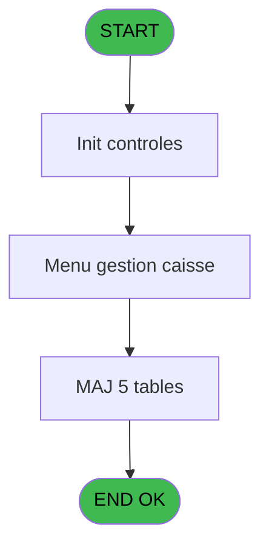
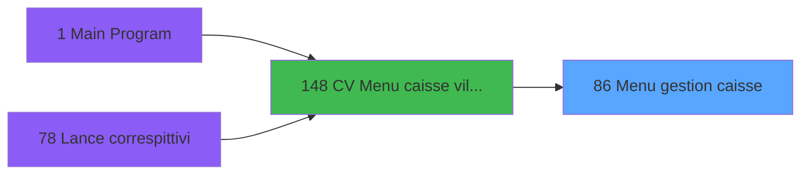
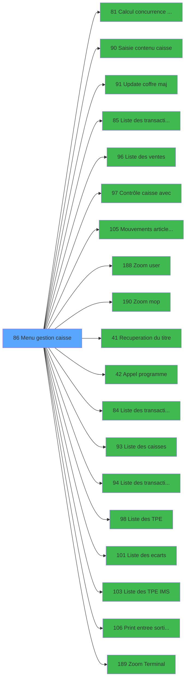

# VIL IDE 86 - Menu gestion caisse

> **Analyse**: Phases 1-4 2026-02-03 09:14 -> 09:15 (20s) | Assemblage 09:15
> **Pipeline**: V7.2 Enrichi
> **Structure**: 4 onglets (Resume | Ecrans | Donnees | Connexions)

<!-- TAB:Resume -->

## 1. FICHE D'IDENTITE

| Attribut | Valeur |
|----------|--------|
| Projet | VIL |
| IDE Position | 86 |
| Nom Programme | Menu gestion caisse |
| Fichier source | `Prg_86.xml` |
| Domaine metier | Caisse |
| Taches | 21 (5 ecrans visibles) |
| Tables modifiees | 5 |
| Programmes appeles | 19 |

## 2. DESCRIPTION FONCTIONNELLE

**Menu gestion caisse** assure la gestion complete de ce processus, accessible depuis [CV  Menu caisse village (IDE 148)](VIL-IDE-148.md).

Le flux de traitement s'organise en **6 blocs fonctionnels** :

- **Traitement** (14 taches) : traitements metier divers
- **Saisie** (2 taches) : ecrans de saisie utilisateur (formulaires, champs, donnees)
- **Creation** (2 taches) : insertion d'enregistrements en base (mouvements, prestations)
- **Initialisation** (1 tache) : reinitialisation d'etats et de variables de travail
- **Consultation** (1 tache) : ecrans de recherche, selection et consultation
- **Calcul** (1 tache) : calculs de montants, stocks ou compteurs

**Donnees modifiees** : 5 tables en ecriture (detail_coffre, mouvement_stock_histo, mouvement_stock_valeur, suivi_pdc, pv_stats_localprepaid).

**Logique metier** : 1 regles identifiees couvrant conditions metier.

Detail : phases du traitement

#### Phase 1 : Traitement (14 taches)

- **86** - CV  Autres tables **[[ECRAN]](#ecran-t1)**
- **86.1** - param caisse
- **86.2** - Menu gestion caisse **[[ECRAN]](#ecran-t3)**
- **86.3** - Mise à jour
- **86.3.1** - UPDATE coffre
- **86.3.2** - UPDATE MVT valeur
- **86.3.3** - UPDATE MVT histo
- **86.4** - Tableau Excel **[[ECRAN]](#ecran-t9)**
- **86.4.1** - parametre versRet
- **86.6.1** - Lance impression
- **86.7** - update suivi PDC
- **86.8.1** - Lance impression
- **86.8.2.2** - load
- **86.8.2.3** - (sans nom) **[[ECRAN]](#ecran-t31)**

Delegue a : [Update coffre maj (IDE 91)](VIL-IDE-91.md), [Contrôle caisse avec (IDE 97)](VIL-IDE-97.md), [Mouvements article coffre (IDE 105)](VIL-IDE-105.md), [Recuperation du titre (IDE 41)](VIL-IDE-41.md), [Appel programme (IDE 42)](VIL-IDE-42.md), [Liste des caisses (IDE 93)](VIL-IDE-93.md), [Liste des TPE (IDE 98)](VIL-IDE-98.md), [Liste des ecarts (IDE 101)](VIL-IDE-101.md), [Liste des TPE IMS (IDE 103)](VIL-IDE-103.md)

#### Phase 2 : Creation (2 taches)

- **86.3.3.1** - create histo
- **86.8.2.2.1** - create tempo

#### Phase 3 : Calcul (1 tache)

- **86.5** - Article gere en stock

Delegue a : [Calcul concurrence sessions v1 (IDE 81)](VIL-IDE-81.md)

#### Phase 4 : Saisie (2 taches)

- **86.6** - Listes des transactions **[[ECRAN]](#ecran-t14)**
- **86.8** - Listes des transactions **[[ECRAN]](#ecran-t21)**

Delegue a : [Saisie contenu caisse (IDE 90)](VIL-IDE-90.md), [Liste des transactions imprime (IDE 85)](VIL-IDE-85.md), [Liste des ventes (IDE 96)](VIL-IDE-96.md), [Liste des transactions genère (IDE 84)](VIL-IDE-84.md), [Liste des transactions IMS (IDE 94)](VIL-IDE-94.md)

#### Phase 5 : Consultation (1 tache)

- **86.8.2** - Zoom imputation

Delegue a : [Zoom user (IDE 188)](VIL-IDE-188.md), [Zoom mop (IDE 190)](VIL-IDE-190.md), [Recuperation du titre (IDE 41)](VIL-IDE-41.md), [Zoom Terminal (IDE 189)](VIL-IDE-189.md)

#### Phase 6 : Initialisation (1 tache)

- **86.8.2.1** - raz

#### Tables impactees

| Table | Operations | Role metier |
|-------|-----------|-------------|
| pv_stats_localprepaid | **W**/L (4 usages) |  |
| suivi_pdc | **W** (1 usages) |  |
| mouvement_stock_histo | **W** (1 usages) | Mouvements de prestation |
| mouvement_stock_valeur | **W** (1 usages) | Mouvements de prestation |
| detail_coffre | **W** (1 usages) | Etat du coffre |

## 3. BLOCS FONCTIONNELS

### 3.1 Traitement (14 taches)

Traitements internes.

---

#### 86 - CV  Autres tables [[ECRAN]](#ecran-t1)

**Role** : Tache d'orchestration : point d'entree du programme (14 sous-taches). Coordonne l'enchainement des traitements.
**Ecran** : 640 x 224 DLU (MDI) | [Voir mockup](#ecran-t1)

13 sous-taches directes

| Tache | Nom | Bloc |
|-------|-----|------|
| [86.1](#t2) | param caisse | Traitement |
| [86.2](#t3) | Menu gestion caisse **[[ECRAN]](#ecran-t3)** | Traitement |
| [86.3](#t4) | Mise à jour | Traitement |
| [86.3.1](#t5) | UPDATE coffre | Traitement |
| [86.3.2](#t6) | UPDATE MVT valeur | Traitement |
| [86.3.3](#t7) | UPDATE MVT histo | Traitement |
| [86.4](#t9) | Tableau Excel **[[ECRAN]](#ecran-t9)** | Traitement |
| [86.4.1](#t12) | parametre versRet | Traitement |
| [86.6.1](#t15) | Lance impression | Traitement |
| [86.7](#t19) | update suivi PDC | Traitement |
| [86.8.1](#t22) | Lance impression | Traitement |
| [86.8.2.2](#t29) | load | Traitement |
| [86.8.2.3](#t31) | (sans nom) **[[ECRAN]](#ecran-t31)** | Traitement |

---

#### 86.1 - param caisse

**Role** : Traitement : param caisse.
**Variables liees** : O (v total caisse), A (Param societe), B (Param devise locale), C (Param masque), D (Param date comptable)

---

#### 86.2 - Menu gestion caisse [[ECRAN]](#ecran-t3)

**Role** : Gestion du moyen de paiement : Menu gestion caisse.
**Ecran** : 640 x 198 DLU (MDI) | [Voir mockup](#ecran-t3)
**Variables liees** : O (v total caisse)

---

#### 86.3 - Mise à jour

**Role** : Traitement : Mise à jour.

---

#### 86.3.1 - UPDATE coffre

**Role** : Traitement : UPDATE coffre.
**Variables liees** : W (v abandon update), BM (v avec coffre 2), H (Param N° term coffre2), I (Param Hostname coffre2)

---

#### 86.3.2 - UPDATE MVT valeur

**Role** : Traitement : UPDATE MVT valeur.
**Variables liees** : W (v abandon update)

---

#### 86.3.3 - UPDATE MVT histo

**Role** : Traitement : UPDATE MVT histo.
**Variables liees** : L (v chrono histo), W (v abandon update)

---

#### 86.4 - Tableau Excel [[ECRAN]](#ecran-t9)

**Role** : Traitement : Tableau Excel.
**Ecran** : 640 x 224 DLU (MDI) | [Voir mockup](#ecran-t9)
**Variables liees** : BC (v validation demande excel), BG (v mont excel sans zero à gauche)

---

#### 86.4.1 - parametre versRet

**Role** : Traitement : parametre versRet.

---

#### 86.6.1 - Lance impression

**Role** : Generation du document : Lance impression.

---

#### 86.7 - update suivi PDC

**Role** : Traitement : update suivi PDC.
**Variables liees** : W (v abandon update)

---

#### 86.8.1 - Lance impression

**Role** : Generation du document : Lance impression.

---

#### 86.8.2.2 - load

**Role** : Traitement : load.

---

#### 86.8.2.3 - (sans nom) [[ECRAN]](#ecran-t31)

**Role** : Traitement interne.
**Ecran** : 547 x 162 DLU (MDI) | [Voir mockup](#ecran-t31)

### 3.2 Creation (2 taches)

Insertion de nouveaux enregistrements en base.

---

#### 86.3.3.1 - create histo

**Role** : Traitement : create histo.
**Variables liees** : L (v chrono histo)

---

#### 86.8.2.2.1 - create tempo

**Role** : Traitement : create tempo.

### 3.3 Calcul (1 tache)

Calculs metier : montants, stocks, compteurs.

---

#### 86.5 - Article gere en stock

**Role** : Calcul : Article gere en stock.
**Variables liees** : Y (v montant mvt stock article), BJ (v article gere en stock existe)
**Delegue a** : [Calcul concurrence sessions v1 (IDE 81)](VIL-IDE-81.md), [Mouvements article coffre (IDE 105)](VIL-IDE-105.md)

### 3.4 Saisie (2 taches)

L'operateur saisit les donnees de la transaction via 2 ecrans (Listes des transactions, Listes des transactions).

---

#### 86.6 - Listes des transactions [[ECRAN]](#ecran-t14)

**Role** : Saisie des donnees : Listes des transactions.
**Ecran** : 640 x 224 DLU (MDI) | [Voir mockup](#ecran-t14)
**Delegue a** : [Saisie contenu caisse (IDE 90)](VIL-IDE-90.md), [Liste des transactions imprime (IDE 85)](VIL-IDE-85.md), [Liste des ventes (IDE 96)](VIL-IDE-96.md)

---

#### 86.8 - Listes des transactions [[ECRAN]](#ecran-t21)

**Role** : Saisie des donnees : Listes des transactions.
**Ecran** : 640 x 224 DLU (MDI) | [Voir mockup](#ecran-t21)
**Delegue a** : [Saisie contenu caisse (IDE 90)](VIL-IDE-90.md), [Liste des transactions imprime (IDE 85)](VIL-IDE-85.md), [Liste des ventes (IDE 96)](VIL-IDE-96.md)

### 3.5 Consultation (1 tache)

Ecrans de recherche et consultation.

---

#### 86.8.2 - Zoom imputation

**Role** : Selection par l'operateur : Zoom imputation.
**Delegue a** : [Zoom user (IDE 188)](VIL-IDE-188.md), [Zoom Terminal (IDE 189)](VIL-IDE-189.md)

### 3.6 Initialisation (1 tache)

Reinitialisation d'etats et variables de travail.

---

#### 86.8.2.1 - raz

**Role** : Reinitialisation des variables de travail.

## 5. REGLES METIER

1 regles identifiees:

### Autres (1 regles)

#### [RM-001] Traitement conditionnel si DbRecs ('{228,2}'DSOURCE,'') est a zero

| Element | Detail |
|---------|--------|
| **Condition** | `DbRecs ('{228` |
| **Si vrai** | 2}'DSOURCE |
| **Si faux** | '')=0,'TRUE'LOG,'FALSE'LOG) |
| **Expression source** | Expression 14 : `IF (DbRecs ('{228,2}'DSOURCE,'')=0,'TRUE'LOG,'FALSE'LOG)` |
| **Exemple** | Si DbRecs ('{228 → 2}'DSOURCE. Sinon → '')=0,'TRUE'LOG,'FALSE'LOG) |

## 6. CONTEXTE

- **Appele par**: [CV  Menu caisse village (IDE 148)](VIL-IDE-148.md)
- **Appelle**: 19 programmes | **Tables**: 9 (W:5 R:4 L:1) | **Taches**: 21 | **Expressions**: 32

<!-- TAB:Ecrans -->

## 8. ECRANS

### 8.1 Forms visibles (5 / 21)

| # | Position | Tache | Nom | Type | Largeur | Hauteur | Bloc |
|---|----------|-------|-----|------|---------|---------|------|
| 1 | 86.2 | 86.2 | Menu gestion caisse | MDI | 640 | 198 | Traitement |
| 2 | 86.4 | 86.4 | Tableau Excel | MDI | 640 | 224 | Traitement |
| 3 | 86.6 | 86.6 | Listes des transactions | MDI | 640 | 224 | Saisie |
| 4 | 86.8 | 86.8 | Listes des transactions | MDI | 640 | 224 | Saisie |
| 5 | 86.8.2.3 | 86.8.2.3 | (sans nom) | MDI | 547 | 162 | Traitement |

### 8.2 Mockups Ecrans

---

#### 86.2 - Menu gestion caisse
**Tache** : [86.2](#t3) | **Type** : MDI | **Dimensions** : 640 x 198 DLU
**Bloc** : Traitement | **Titre IDE** : Menu gestion caisse

<!-- FORM-DATA:
{
    "width":  640,
    "vFactor":  8,
    "type":  "MDI",
    "hFactor":  8,
    "controls":  [
                     {
                         "x":  0,
                         "type":  "label",
                         "var":  "",
                         "y":  1,
                         "w":  637,
                         "fmt":  "",
                         "name":  "",
                         "h":  19,
                         "color":  "",
                         "text":  "",
                         "parent":  null
                     },
                     {
                         "x":  7,
                         "type":  "label",
                         "var":  "",
                         "y":  23,
                         "w":  626,
                         "fmt":  "",
                         "name":  "",
                         "h":  145,
                         "color":  "",
                         "text":  "",
                         "parent":  null
                     },
                     {
                         "x":  146,
                         "type":  "label",
                         "var":  "",
                         "y":  26,
                         "w":  479,
                         "fmt":  "",
                         "name":  "",
                         "h":  133,
                         "color":  "",
                         "text":  "",
                         "parent":  null
                     },
                     {
                         "x":  160,
                         "type":  "label",
                         "var":  "",
                         "y":  31,
                         "w":  445,
                         "fmt":  "",
                         "name":  "",
                         "h":  106,
                         "color":  "",
                         "text":  "",
                         "parent":  5
                     },
                     {
                         "x":  212,
                         "type":  "label",
                         "var":  "",
                         "y":  35,
                         "w":  387,
                         "fmt":  "",
                         "name":  "",
                         "h":  9,
                         "color":  "7",
                         "text":  "Comptage coffre",
                         "parent":  5
                     },
                     {
                         "x":  212,
                         "type":  "label",
                         "var":  "",
                         "y":  49,
                         "w":  387,
                         "fmt":  "",
                         "name":  "",
                         "h":  9,
                         "color":  "7",
                         "text":  "Articles en stock - Sorties",
                         "parent":  5
                     },
                     {
                         "x":  212,
                         "type":  "label",
                         "var":  "",
                         "y":  63,
                         "w":  387,
                         "fmt":  "",
                         "name":  "",
                         "h":  9,
                         "color":  "7",
                         "text":  "Articles en stock - Entrées",
                         "parent":  5
                     },
                     {
                         "x":  212,
                         "type":  "label",
                         "var":  "",
                         "y":  77,
                         "w":  387,
                         "fmt":  "",
                         "name":  "",
                         "h":  9,
                         "color":  "7",
                         "text":  "Liste des TPE",
                         "parent":  5
                     },
                     {
                         "x":  212,
                         "type":  "label",
                         "var":  "",
                         "y":  91,
                         "w":  387,
                         "fmt":  "",
                         "name":  "",
                         "h":  9,
                         "color":  "7",
                         "text":  "Liste des écarts de caisse",
                         "parent":  5
                     },
                     {
                         "x":  212,
                         "type":  "label",
                         "var":  "",
                         "y":  105,
                         "w":  387,
                         "fmt":  "",
                         "name":  "",
                         "h":  9,
                         "color":  "7",
                         "text":  "Liste des caisses",
                         "parent":  5
                     },
                     {
                         "x":  212,
                         "type":  "label",
                         "var":  "",
                         "y":  119,
                         "w":  387,
                         "fmt":  "",
                         "name":  "",
                         "h":  9,
                         "color":  "7",
                         "text":  "Listes des transactions",
                         "parent":  5
                     },
                     {
                         "x":  297,
                         "type":  "label",
                         "var":  "",
                         "y":  143,
                         "w":  133,
                         "fmt":  "",
                         "name":  "",
                         "h":  10,
                         "color":  "",
                         "text":  " Votre choix",
                         "parent":  5
                     },
                     {
                         "x":  0,
                         "type":  "label",
                         "var":  "",
                         "y":  172,
                         "w":  637,
                         "fmt":  "",
                         "name":  "",
                         "h":  24,
                         "color":  "",
                         "text":  "",
                         "parent":  null
                     },
                     {
                         "x":  164,
                         "type":  "label",
                         "var":  "",
                         "y":  32,
                         "w":  40,
                         "fmt":  "",
                         "name":  "",
                         "h":  102,
                         "color":  "",
                         "text":  "",
                         "parent":  5
                     },
                     {
                         "x":  441,
                         "type":  "edit",
                         "var":  "",
                         "y":  143,
                         "w":  26,
                         "fmt":  "",
                         "name":  "",
                         "h":  10,
                         "color":  "6",
                         "text":  "",
                         "parent":  5
                     },
                     {
                         "x":  7,
                         "type":  "edit",
                         "var":  "",
                         "y":  6,
                         "w":  267,
                         "fmt":  "20",
                         "name":  "",
                         "h":  8,
                         "color":  "",
                         "text":  "",
                         "parent":  null
                     },
                     {
                         "x":  370,
                         "type":  "edit",
                         "var":  "",
                         "y":  7,
                         "w":  256,
                         "fmt":  "WWW DD MMM YYYYT",
                         "name":  "",
                         "h":  8,
                         "color":  "",
                         "text":  "",
                         "parent":  null
                     },
                     {
                         "x":  17,
                         "type":  "image",
                         "var":  "",
                         "y":  64,
                         "w":  120,
                         "fmt":  "",
                         "name":  "",
                         "h":  45,
                         "color":  "",
                         "text":  "",
                         "parent":  null
                     },
                     {
                         "x":  169,
                         "type":  "button",
                         "var":  "",
                         "y":  35,
                         "w":  26,
                         "fmt":  "1",
                         "name":  "1",
                         "h":  9,
                         "color":  "",
                         "text":  "",
                         "parent":  null
                     },
                     {
                         "x":  169,
                         "type":  "button",
                         "var":  "",
                         "y":  49,
                         "w":  26,
                         "fmt":  "2",
                         "name":  "2",
                         "h":  9,
                         "color":  "",
                         "text":  "",
                         "parent":  null
                     },
                     {
                         "x":  169,
                         "type":  "button",
                         "var":  "",
                         "y":  63,
                         "w":  26,
                         "fmt":  "3",
                         "name":  "3",
                         "h":  9,
                         "color":  "",
                         "text":  "",
                         "parent":  null
                     },
                     {
                         "x":  169,
                         "type":  "button",
                         "var":  "",
                         "y":  77,
                         "w":  26,
                         "fmt":  "4",
                         "name":  "4",
                         "h":  9,
                         "color":  "",
                         "text":  "",
                         "parent":  null
                     },
                     {
                         "x":  169,
                         "type":  "button",
                         "var":  "",
                         "y":  91,
                         "w":  26,
                         "fmt":  "5",
                         "name":  "5",
                         "h":  9,
                         "color":  "",
                         "text":  "",
                         "parent":  null
                     },
                     {
                         "x":  169,
                         "type":  "button",
                         "var":  "",
                         "y":  105,
                         "w":  26,
                         "fmt":  "6",
                         "name":  "6",
                         "h":  9,
                         "color":  "",
                         "text":  "",
                         "parent":  null
                     },
                     {
                         "x":  169,
                         "type":  "button",
                         "var":  "",
                         "y":  119,
                         "w":  26,
                         "fmt":  "7",
                         "name":  "7",
                         "h":  9,
                         "color":  "",
                         "text":  "",
                         "parent":  null
                     },
                     {
                         "x":  7,
                         "type":  "button",
                         "var":  "",
                         "y":  175,
                         "w":  154,
                         "fmt":  "\u0026Quitter",
                         "name":  "",
                         "h":  18,
                         "color":  "",
                         "text":  "",
                         "parent":  null
                     }
                 ],
    "taskId":  "86.2",
    "height":  198
}
-->

<strong>Champs : 3 champs</strong>

| Pos (x,y) | Nom | Variable | Type |
|-----------|-----|----------|------|
| 441,143 | (sans nom) | - | edit |
| 7,6 | 20 | - | edit |
| 370,7 | WWW DD MMM YYYYT | - | edit |

<strong>Boutons : 8 boutons</strong>

| Bouton | Pos (x,y) | Action |
|--------|-----------|--------|
| 1 | 169,35 | Bouton fonctionnel |
| 2 | 169,49 | Bouton fonctionnel |
| 3 | 169,63 | Bouton fonctionnel |
| 4 | 169,77 | Bouton fonctionnel |
| 5 | 169,91 | Bouton fonctionnel |
| 6 | 169,105 | Bouton fonctionnel |
| 7 | 169,119 | Bouton fonctionnel |
| Quitter | 7,175 | Quitte le programme |

---

#### 86.4 - Tableau Excel
**Tache** : [86.4](#t9) | **Type** : MDI | **Dimensions** : 640 x 224 DLU
**Bloc** : Traitement | **Titre IDE** : Tableau Excel

<!-- FORM-DATA:
{
    "width":  640,
    "vFactor":  8,
    "type":  "MDI",
    "hFactor":  8,
    "controls":  [
                     {
                         "x":  0,
                         "type":  "label",
                         "var":  "",
                         "y":  1,
                         "w":  637,
                         "fmt":  "",
                         "name":  "",
                         "h":  19,
                         "color":  "",
                         "text":  "",
                         "parent":  null
                     },
                     {
                         "x":  264,
                         "type":  "label",
                         "var":  "",
                         "y":  34,
                         "w":  315,
                         "fmt":  "",
                         "name":  "",
                         "h":  66,
                         "color":  "",
                         "text":  "",
                         "parent":  null
                     },
                     {
                         "x":  94,
                         "type":  "label",
                         "var":  "",
                         "y":  111,
                         "w":  485,
                         "fmt":  "",
                         "name":  "",
                         "h":  23,
                         "color":  "",
                         "text":  "",
                         "parent":  null
                     },
                     {
                         "x":  106,
                         "type":  "label",
                         "var":  "",
                         "y":  116,
                         "w":  242,
                         "fmt":  "",
                         "name":  "",
                         "h":  12,
                         "color":  "",
                         "text":  "Compte des versements/retraits",
                         "parent":  null
                     },
                     {
                         "x":  97,
                         "type":  "label",
                         "var":  "",
                         "y":  143,
                         "w":  482,
                         "fmt":  "",
                         "name":  "",
                         "h":  51,
                         "color":  "",
                         "text":  "",
                         "parent":  null
                     },
                     {
                         "x":  146,
                         "type":  "label",
                         "var":  "",
                         "y":  153,
                         "w":  160,
                         "fmt":  "",
                         "name":  "",
                         "h":  12,
                         "color":  "",
                         "text":  "Date comptable",
                         "parent":  null
                     },
                     {
                         "x":  0,
                         "type":  "label",
                         "var":  "",
                         "y":  200,
                         "w":  637,
                         "fmt":  "",
                         "name":  "",
                         "h":  24,
                         "color":  "",
                         "text":  "",
                         "parent":  null
                     },
                     {
                         "x":  282,
                         "type":  "checkbox",
                         "var":  "",
                         "y":  46,
                         "w":  281,
                         "fmt":  "",
                         "name":  "",
                         "h":  12,
                         "color":  "",
                         "text":  " Format fixe",
                         "parent":  null
                     },
                     {
                         "x":  282,
                         "type":  "checkbox",
                         "var":  "",
                         "y":  62,
                         "w":  281,
                         "fmt":  "",
                         "name":  "",
                         "h":  12,
                         "color":  "",
                         "text":  " Format variable",
                         "parent":  null
                     },
                     {
                         "x":  282,
                         "type":  "checkbox",
                         "var":  "",
                         "y":  78,
                         "w":  281,
                         "fmt":  "",
                         "name":  "",
                         "h":  12,
                         "color":  "",
                         "text":  " Montants sans zero à gauche",
                         "parent":  null
                     },
                     {
                         "x":  360,
                         "type":  "edit",
                         "var":  "",
                         "y":  116,
                         "w":  169,
                         "fmt":  "",
                         "name":  "",
                         "h":  12,
                         "color":  "6",
                         "text":  "",
                         "parent":  null
                     },
                     {
                         "x":  360,
                         "type":  "edit",
                         "var":  "",
                         "y":  153,
                         "w":  169,
                         "fmt":  "",
                         "name":  "",
                         "h":  12,
                         "color":  "6",
                         "text":  "",
                         "parent":  null
                     },
                     {
                         "x":  240,
                         "type":  "combobox",
                         "var":  "",
                         "y":  174,
                         "w":  160,
                         "fmt":  "",
                         "name":  "",
                         "h":  12,
                         "color":  "110",
                         "text":  "Detail,Global",
                         "parent":  null
                     },
                     {
                         "x":  370,
                         "type":  "edit",
                         "var":  "",
                         "y":  7,
                         "w":  256,
                         "fmt":  "WWW DD MMM YYYYT",
                         "name":  "",
                         "h":  8,
                         "color":  "",
                         "text":  "",
                         "parent":  null
                     },
                     {
                         "x":  94,
                         "type":  "image",
                         "var":  "",
                         "y":  34,
                         "w":  154,
                         "fmt":  "",
                         "name":  "",
                         "h":  66,
                         "color":  "",
                         "text":  "",
                         "parent":  null
                     },
                     {
                         "x":  7,
                         "type":  "button",
                         "var":  "",
                         "y":  203,
                         "w":  154,
                         "fmt":  "\u0026Abandon",
                         "name":  "",
                         "h":  18,
                         "color":  "",
                         "text":  "",
                         "parent":  null
                     },
                     {
                         "x":  477,
                         "type":  "button",
                         "var":  "",
                         "y":  203,
                         "w":  154,
                         "fmt":  "\u0026Validation",
                         "name":  "",
                         "h":  18,
                         "color":  "",
                         "text":  "",
                         "parent":  null
                     },
                     {
                         "x":  7,
                         "type":  "edit",
                         "var":  "",
                         "y":  6,
                         "w":  267,
                         "fmt":  "30",
                         "name":  "",
                         "h":  8,
                         "color":  "",
                         "text":  "",
                         "parent":  null
                     }
                 ],
    "taskId":  "86.4",
    "height":  224
}
-->

<strong>Champs : 8 champs</strong>

| Pos (x,y) | Nom | Variable | Type |
|-----------|-----|----------|------|
| 282,46 |  Format fixe | - | checkbox |
| 282,62 |  Format variable | - | checkbox |
| 282,78 |  Montants sans zero à gauche | - | checkbox |
| 360,116 | (sans nom) | - | edit |
| 360,153 | (sans nom) | - | edit |
| 240,174 | Detail,Global | - | combobox |
| 370,7 | WWW DD MMM YYYYT | - | edit |
| 7,6 | 30 | - | edit |

<strong>Boutons : 2 boutons</strong>

| Bouton | Pos (x,y) | Action |
|--------|-----------|--------|
| Abandon | 7,203 | Annule et retour au menu |
| Validation | 477,203 | Valide la saisie et enregistre |

---

#### 86.6 - Listes des transactions
**Tache** : [86.6](#t14) | **Type** : MDI | **Dimensions** : 640 x 224 DLU
**Bloc** : Saisie | **Titre IDE** : Listes des transactions

<!-- FORM-DATA:
{
    "width":  640,
    "vFactor":  8,
    "type":  "MDI",
    "hFactor":  8,
    "controls":  [
                     {
                         "x":  1,
                         "type":  "label",
                         "var":  "",
                         "y":  0,
                         "w":  637,
                         "fmt":  "",
                         "name":  "",
                         "h":  19,
                         "color":  "",
                         "text":  "",
                         "parent":  null
                     },
                     {
                         "x":  320,
                         "type":  "line",
                         "var":  "",
                         "y":  20,
                         "w":  0,
                         "fmt":  "",
                         "name":  "",
                         "h":  176,
                         "color":  "",
                         "text":  "",
                         "parent":  null
                     },
                     {
                         "x":  348,
                         "type":  "label",
                         "var":  "",
                         "y":  25,
                         "w":  280,
                         "fmt":  "",
                         "name":  "",
                         "h":  10,
                         "color":  "7",
                         "text":  "Listes IMS",
                         "parent":  null
                     },
                     {
                         "x":  18,
                         "type":  "label",
                         "var":  "",
                         "y":  26,
                         "w":  280,
                         "fmt":  "",
                         "name":  "",
                         "h":  10,
                         "color":  "7",
                         "text":  "Listes des ventes",
                         "parent":  null
                     },
                     {
                         "x":  66,
                         "type":  "label",
                         "var":  "",
                         "y":  44,
                         "w":  213,
                         "fmt":  "",
                         "name":  "",
                         "h":  10,
                         "color":  "142",
                         "text":  "Selection",
                         "parent":  null
                     },
                     {
                         "x":  32,
                         "type":  "label",
                         "var":  "",
                         "y":  102,
                         "w":  80,
                         "fmt":  "",
                         "name":  "",
                         "h":  10,
                         "color":  "",
                         "text":  "User",
                         "parent":  null
                     },
                     {
                         "x":  32,
                         "type":  "label",
                         "var":  "",
                         "y":  116,
                         "w":  80,
                         "fmt":  "",
                         "name":  "",
                         "h":  10,
                         "color":  "",
                         "text":  "du",
                         "parent":  null
                     },
                     {
                         "x":  376,
                         "type":  "label",
                         "var":  "",
                         "y":  116,
                         "w":  138,
                         "fmt":  "",
                         "name":  "",
                         "h":  10,
                         "color":  "",
                         "text":  "Terminal IMS",
                         "parent":  null
                     },
                     {
                         "x":  32,
                         "type":  "label",
                         "var":  "",
                         "y":  130,
                         "w":  80,
                         "fmt":  "",
                         "name":  "",
                         "h":  10,
                         "color":  "",
                         "text":  "au",
                         "parent":  null
                     },
                     {
                         "x":  32,
                         "type":  "label",
                         "var":  "",
                         "y":  144,
                         "w":  80,
                         "fmt":  "",
                         "name":  "",
                         "h":  10,
                         "color":  "",
                         "text":  "MOP",
                         "parent":  null
                     },
                     {
                         "x":  1,
                         "type":  "label",
                         "var":  "",
                         "y":  199,
                         "w":  637,
                         "fmt":  "",
                         "name":  "",
                         "h":  24,
                         "color":  "",
                         "text":  "",
                         "parent":  null
                     },
                     {
                         "x":  66,
                         "type":  "combobox",
                         "var":  "",
                         "y":  56,
                         "w":  213,
                         "fmt":  "",
                         "name":  "selection",
                         "h":  12,
                         "color":  "110",
                         "text":  "1 par date, 2 par imputation, 3 par mode de règlement, 4 par user",
                         "parent":  null
                     },
                     {
                         "x":  125,
                         "type":  "edit",
                         "var":  "",
                         "y":  116,
                         "w":  160,
                         "fmt":  "##/##/####Z",
                         "name":  "date mini",
                         "h":  10,
                         "color":  "6",
                         "text":  "",
                         "parent":  null
                     },
                     {
                         "x":  125,
                         "type":  "edit",
                         "var":  "",
                         "y":  130,
                         "w":  160,
                         "fmt":  "##/##/####Z",
                         "name":  "date maxi",
                         "h":  10,
                         "color":  "6",
                         "text":  "",
                         "parent":  null
                     },
                     {
                         "x":  125,
                         "type":  "edit",
                         "var":  "",
                         "y":  144,
                         "w":  160,
                         "fmt":  "",
                         "name":  "mode reglement",
                         "h":  10,
                         "color":  "6",
                         "text":  "",
                         "parent":  null
                     },
                     {
                         "x":  125,
                         "type":  "edit",
                         "var":  "",
                         "y":  102,
                         "w":  160,
                         "fmt":  "",
                         "name":  "user",
                         "h":  10,
                         "color":  "6",
                         "text":  "",
                         "parent":  null
                     },
                     {
                         "x":  531,
                         "type":  "edit",
                         "var":  "",
                         "y":  116,
                         "w":  56,
                         "fmt":  "3Z",
                         "name":  "terminal IMS",
                         "h":  10,
                         "color":  "6",
                         "text":  "",
                         "parent":  null
                     },
                     {
                         "x":  348,
                         "type":  "button",
                         "var":  "",
                         "y":  151,
                         "w":  280,
                         "fmt":  "",
                         "name":  "Bt Listing Transaction",
                         "h":  18,
                         "color":  "",
                         "text":  "",
                         "parent":  null
                     },
                     {
                         "x":  348,
                         "type":  "button",
                         "var":  "",
                         "y":  176,
                         "w":  280,
                         "fmt":  "",
                         "name":  "Bt Listing RECUS TPE",
                         "h":  18,
                         "color":  "",
                         "text":  "",
                         "parent":  null
                     },
                     {
                         "x":  8,
                         "type":  "edit",
                         "var":  "",
                         "y":  5,
                         "w":  267,
                         "fmt":  "30",
                         "name":  "",
                         "h":  8,
                         "color":  "",
                         "text":  "",
                         "parent":  null
                     },
                     {
                         "x":  371,
                         "type":  "edit",
                         "var":  "",
                         "y":  5,
                         "w":  256,
                         "fmt":  "WWW DD MMM YYYYT",
                         "name":  "",
                         "h":  8,
                         "color":  "",
                         "text":  "",
                         "parent":  null
                     },
                     {
                         "x":  436,
                         "type":  "image",
                         "var":  "",
                         "y":  54,
                         "w":  104,
                         "fmt":  "",
                         "name":  "",
                         "h":  45,
                         "color":  "",
                         "text":  "",
                         "parent":  null
                     },
                     {
                         "x":  18,
                         "type":  "button",
                         "var":  "",
                         "y":  176,
                         "w":  280,
                         "fmt":  "\u0026Impression",
                         "name":  "",
                         "h":  18,
                         "color":  "",
                         "text":  "",
                         "parent":  null
                     },
                     {
                         "x":  8,
                         "type":  "button",
                         "var":  "",
                         "y":  202,
                         "w":  154,
                         "fmt":  "\u0026Quitter",
                         "name":  "",
                         "h":  18,
                         "color":  "",
                         "text":  "",
                         "parent":  null
                     }
                 ],
    "taskId":  "86.6",
    "height":  224
}
-->

<strong>Champs : 8 champs</strong>

| Pos (x,y) | Nom | Variable | Type |
|-----------|-----|----------|------|
| 66,56 | selection | - | combobox |
| 125,116 | date mini | - | edit |
| 125,130 | date maxi | - | edit |
| 125,144 | mode reglement | - | edit |
| 125,102 | user | - | edit |
| 531,116 | terminal IMS | - | edit |
| 8,5 | 30 | - | edit |
| 371,5 | WWW DD MMM YYYYT | - | edit |

<strong>Boutons : 4 boutons</strong>

| Bouton | Pos (x,y) | Action |
|--------|-----------|--------|
| Bt Listing Transaction | 348,151 | Bouton fonctionnel |
| Bt Listing RECUS TPE | 348,176 | Bouton fonctionnel |
| Impression | 18,176 | Bouton fonctionnel |
| Quitter | 8,202 | Quitte le programme |

---

#### 86.8 - Listes des transactions
**Tache** : [86.8](#t21) | **Type** : MDI | **Dimensions** : 640 x 224 DLU
**Bloc** : Saisie | **Titre IDE** : Listes des transactions

<!-- FORM-DATA:
{
    "width":  640,
    "vFactor":  8,
    "type":  "MDI",
    "hFactor":  8,
    "controls":  [
                     {
                         "x":  1,
                         "type":  "label",
                         "var":  "",
                         "y":  0,
                         "w":  637,
                         "fmt":  "",
                         "name":  "",
                         "h":  19,
                         "color":  "",
                         "text":  "",
                         "parent":  null
                     },
                     {
                         "x":  180,
                         "type":  "label",
                         "var":  "",
                         "y":  26,
                         "w":  280,
                         "fmt":  "",
                         "name":  "",
                         "h":  10,
                         "color":  "7",
                         "text":  "Listes des transactions",
                         "parent":  null
                     },
                     {
                         "x":  207,
                         "type":  "label",
                         "var":  "",
                         "y":  48,
                         "w":  213,
                         "fmt":  "",
                         "name":  "",
                         "h":  10,
                         "color":  "142",
                         "text":  "Sélection",
                         "parent":  null
                     },
                     {
                         "x":  171,
                         "type":  "label",
                         "var":  "",
                         "y":  94,
                         "w":  298,
                         "fmt":  "",
                         "name":  "",
                         "h":  36,
                         "color":  "",
                         "text":  "",
                         "parent":  null
                     },
                     {
                         "x":  181,
                         "type":  "label",
                         "var":  "",
                         "y":  98,
                         "w":  109,
                         "fmt":  "",
                         "name":  "",
                         "h":  10,
                         "color":  "",
                         "text":  "du",
                         "parent":  null
                     },
                     {
                         "x":  181,
                         "type":  "label",
                         "var":  "",
                         "y":  114,
                         "w":  109,
                         "fmt":  "",
                         "name":  "",
                         "h":  10,
                         "color":  "",
                         "text":  "au",
                         "parent":  null
                     },
                     {
                         "x":  171,
                         "type":  "label",
                         "var":  "",
                         "y":  137,
                         "w":  298,
                         "fmt":  "",
                         "name":  "",
                         "h":  51,
                         "color":  "",
                         "text":  "",
                         "parent":  null
                     },
                     {
                         "x":  181,
                         "type":  "label",
                         "var":  "",
                         "y":  140,
                         "w":  109,
                         "fmt":  "",
                         "name":  "",
                         "h":  10,
                         "color":  "",
                         "text":  "Imputation",
                         "parent":  null
                     },
                     {
                         "x":  181,
                         "type":  "label",
                         "var":  "",
                         "y":  156,
                         "w":  109,
                         "fmt":  "",
                         "name":  "",
                         "h":  10,
                         "color":  "",
                         "text":  "MOP",
                         "parent":  null
                     },
                     {
                         "x":  181,
                         "type":  "label",
                         "var":  "",
                         "y":  172,
                         "w":  109,
                         "fmt":  "",
                         "name":  "",
                         "h":  10,
                         "color":  "",
                         "text":  "User",
                         "parent":  null
                     },
                     {
                         "x":  1,
                         "type":  "label",
                         "var":  "",
                         "y":  199,
                         "w":  637,
                         "fmt":  "",
                         "name":  "",
                         "h":  24,
                         "color":  "",
                         "text":  "",
                         "parent":  null
                     },
                     {
                         "x":  8,
                         "type":  "button",
                         "var":  "",
                         "y":  202,
                         "w":  200,
                         "fmt":  "",
                         "name":  "Bouton Abandon",
                         "h":  18,
                         "color":  "",
                         "text":  "",
                         "parent":  null
                     },
                     {
                         "x":  207,
                         "type":  "combobox",
                         "var":  "",
                         "y":  67,
                         "w":  213,
                         "fmt":  "",
                         "name":  "selection",
                         "h":  12,
                         "color":  "110",
                         "text":  "1 par date, 2 par imputation, 3 par mode de règlement, 4 par user",
                         "parent":  null
                     },
                     {
                         "x":  323,
                         "type":  "edit",
                         "var":  "",
                         "y":  98,
                         "w":  136,
                         "fmt":  "##/##/####Z",
                         "name":  "date mini",
                         "h":  10,
                         "color":  "6",
                         "text":  "",
                         "parent":  null
                     },
                     {
                         "x":  323,
                         "type":  "edit",
                         "var":  "",
                         "y":  114,
                         "w":  136,
                         "fmt":  "##/##/####Z",
                         "name":  "date maxi",
                         "h":  10,
                         "color":  "6",
                         "text":  "",
                         "parent":  null
                     },
                     {
                         "x":  323,
                         "type":  "edit",
                         "var":  "",
                         "y":  140,
                         "w":  136,
                         "fmt":  "10Z",
                         "name":  "imputation",
                         "h":  10,
                         "color":  "6",
                         "text":  "",
                         "parent":  null
                     },
                     {
                         "x":  323,
                         "type":  "edit",
                         "var":  "",
                         "y":  156,
                         "w":  136,
                         "fmt":  "",
                         "name":  "mode reglement",
                         "h":  10,
                         "color":  "6",
                         "text":  "",
                         "parent":  null
                     },
                     {
                         "x":  323,
                         "type":  "edit",
                         "var":  "",
                         "y":  172,
                         "w":  136,
                         "fmt":  "",
                         "name":  "user",
                         "h":  10,
                         "color":  "6",
                         "text":  "",
                         "parent":  null
                     },
                     {
                         "x":  8,
                         "type":  "edit",
                         "var":  "",
                         "y":  5,
                         "w":  267,
                         "fmt":  "30",
                         "name":  "",
                         "h":  8,
                         "color":  "",
                         "text":  "",
                         "parent":  null
                     },
                     {
                         "x":  371,
                         "type":  "edit",
                         "var":  "",
                         "y":  5,
                         "w":  256,
                         "fmt":  "WWW DD MMM YYYYT",
                         "name":  "",
                         "h":  8,
                         "color":  "",
                         "text":  "",
                         "parent":  null
                     },
                     {
                         "x":  428,
                         "type":  "button",
                         "var":  "",
                         "y":  202,
                         "w":  200,
                         "fmt":  "\u0026Impression",
                         "name":  "",
                         "h":  18,
                         "color":  "",
                         "text":  "",
                         "parent":  null
                     }
                 ],
    "taskId":  "86.8",
    "height":  224
}
-->

<strong>Champs : 8 champs</strong>

| Pos (x,y) | Nom | Variable | Type |
|-----------|-----|----------|------|
| 207,67 | selection | - | combobox |
| 323,98 | date mini | - | edit |
| 323,114 | date maxi | - | edit |
| 323,140 | imputation | - | edit |
| 323,156 | mode reglement | - | edit |
| 323,172 | user | - | edit |
| 8,5 | 30 | - | edit |
| 371,5 | WWW DD MMM YYYYT | - | edit |

<strong>Boutons : 2 boutons</strong>

| Bouton | Pos (x,y) | Action |
|--------|-----------|--------|
| Abandon | 8,202 | Annule et retour au menu |
| Impression | 428,202 | Bouton fonctionnel |

---

#### 86.8.2.3 - (sans nom)
**Tache** : [86.8.2.3](#t31) | **Type** : MDI | **Dimensions** : 547 x 162 DLU
**Bloc** : Traitement | **Titre IDE** : (sans nom)

<!-- FORM-DATA:
{
    "width":  547,
    "vFactor":  8,
    "type":  "MDI",
    "hFactor":  8,
    "controls":  [
                     {
                         "x":  83,
                         "type":  "table",
                         "var":  "",
                         "name":  "",
                         "titleH":  12,
                         "color":  "196",
                         "w":  378,
                         "y":  11,
                         "fmt":  "",
                         "parent":  null,
                         "text":  "",
                         "rowH":  14,
                         "h":  100,
                         "cols":  [
                                      {
                                          "title":  "Imputation",
                                          "layer":  1,
                                          "w":  136
                                      },
                                      {
                                          "title":  "Libellé",
                                          "layer":  2,
                                          "w":  208
                                      }
                                  ],
                         "rows":  2
                     },
                     {
                         "x":  1,
                         "type":  "label",
                         "var":  "",
                         "y":  136,
                         "w":  545,
                         "fmt":  "",
                         "name":  "",
                         "h":  24,
                         "color":  "",
                         "text":  "",
                         "parent":  null
                     },
                     {
                         "x":  93,
                         "type":  "edit",
                         "var":  "",
                         "y":  27,
                         "w":  101,
                         "fmt":  "",
                         "name":  "imputation",
                         "h":  8,
                         "color":  "196",
                         "text":  "",
                         "parent":  1
                     },
                     {
                         "x":  234,
                         "type":  "edit",
                         "var":  "",
                         "y":  27,
                         "w":  190,
                         "fmt":  "",
                         "name":  "",
                         "h":  8,
                         "color":  "196",
                         "text":  "",
                         "parent":  1
                     },
                     {
                         "x":  243,
                         "type":  "image",
                         "var":  "",
                         "y":  115,
                         "w":  58,
                         "fmt":  "",
                         "name":  "",
                         "h":  18,
                         "color":  "",
                         "text":  "",
                         "parent":  null
                     },
                     {
                         "x":  70,
                         "type":  "button",
                         "var":  "",
                         "y":  139,
                         "w":  160,
                         "fmt":  "\u0026Sélectionner",
                         "name":  "",
                         "h":  18,
                         "color":  "",
                         "text":  "",
                         "parent":  7
                     },
                     {
                         "x":  314,
                         "type":  "button",
                         "var":  "",
                         "y":  139,
                         "w":  160,
                         "fmt":  "\u0026Quitter",
                         "name":  "",
                         "h":  18,
                         "color":  "",
                         "text":  "",
                         "parent":  7
                     }
                 ],
    "taskId":  "86.8.2.3",
    "height":  162
}
-->

<strong>Champs : 2 champs</strong>

| Pos (x,y) | Nom | Variable | Type |
|-----------|-----|----------|------|
| 93,27 | imputation | - | edit |
| 234,27 | (sans nom) | - | edit |

<strong>Boutons : 2 boutons</strong>

| Bouton | Pos (x,y) | Action |
|--------|-----------|--------|
| Sélectionner | 70,139 | Bouton fonctionnel |
| Quitter | 314,139 | Quitte le programme |

## 9. NAVIGATION

### 9.1 Enchainement des ecrans

```mermaid
flowchart TD
    START([Entree])
    style START fill:#3fb950
    VF3[86.2 Menu gestion caisse]
    style VF3 fill:#58a6ff
    VF9[86.4 Tableau Excel]
    style VF9 fill:#58a6ff
    VF14[86.6 Listes des transac...]
    style VF14 fill:#58a6ff
    VF21[86.8 Listes des transac...]
    style VF21 fill:#58a6ff
    VF31[86.8.2.3 sans nom]
    style VF31 fill:#58a6ff
    EXT81[IDE 81 Calcul concurre...]
    style EXT81 fill:#3fb950
    EXT90[IDE 90 Saisie contenu ...]
    style EXT90 fill:#3fb950
    EXT91[IDE 91 Update coffre maj]
    style EXT91 fill:#3fb950
    EXT85[IDE 85 Liste des trans...]
    style EXT85 fill:#3fb950
    EXT96[IDE 96 Liste des ventes]
    style EXT96 fill:#3fb950
    EXT97[IDE 97 Contrôle caisse...]
    style EXT97 fill:#3fb950
    EXT105[IDE 105 Mouvements art...]
    style EXT105 fill:#3fb950
    EXT188[IDE 188 Zoom user]
    style EXT188 fill:#3fb950
    EXT190[IDE 190 Zoom mop]
    style EXT190 fill:#3fb950
    EXT41[IDE 41 Recuperation du...]
    style EXT41 fill:#3fb950
    EXT42[IDE 42 Appel programme]
    style EXT42 fill:#3fb950
    EXT84[IDE 84 Liste des trans...]
    style EXT84 fill:#3fb950
    EXT93[IDE 93 Liste des caisses]
    style EXT93 fill:#3fb950
    EXT94[IDE 94 Liste des trans...]
    style EXT94 fill:#3fb950
    EXT98[IDE 98 Liste des TPE]
    style EXT98 fill:#3fb950
    EXT101[IDE 101 Liste des ecarts]
    style EXT101 fill:#3fb950
    EXT103[IDE 103 Liste des TPE IMS]
    style EXT103 fill:#3fb950
    EXT106[IDE 106 Print entree s...]
    style EXT106 fill:#3fb950
    EXT189[IDE 189 Zoom Terminal]
    style EXT189 fill:#3fb950
    FIN([Sortie])
    style FIN fill:#f85149
    START --> VF3
    VF3 -->|Calcul de donnees| EXT81
    VF3 -->|Sous-programme| EXT90
    VF3 -->|Mise a jour donnees| EXT91
    VF3 -->|Impression ticket/document| EXT85
    VF3 -->|Configuration impression| EXT96
    VF3 -->|Sous-programme| EXT97
    VF3 -->|Sous-programme| EXT105
    VF3 -->|Selection/consultation| EXT188
    EXT189 --> FIN
```

**Detail par enchainement :**

| Depuis | Action | Vers | Retour |
|--------|--------|------|--------|
| Menu gestion caisse | Calcul de donnees | [Calcul concurrence sessions v1 (IDE 81)](VIL-IDE-81.md) | Retour ecran |
| Menu gestion caisse | Sous-programme | [Saisie contenu caisse (IDE 90)](VIL-IDE-90.md) | Retour ecran |
| Menu gestion caisse | Mise a jour donnees | [Update coffre maj (IDE 91)](VIL-IDE-91.md) | Retour ecran |
| Menu gestion caisse | Impression ticket/document | [Liste des transactions imprime (IDE 85)](VIL-IDE-85.md) | Retour ecran |
| Menu gestion caisse | Configuration impression | [Liste des ventes (IDE 96)](VIL-IDE-96.md) | Retour ecran |
| Menu gestion caisse | Sous-programme | [Contrôle caisse avec (IDE 97)](VIL-IDE-97.md) | Retour ecran |
| Menu gestion caisse | Sous-programme | [Mouvements article coffre (IDE 105)](VIL-IDE-105.md) | Retour ecran |
| Menu gestion caisse | Selection/consultation | [Zoom user (IDE 188)](VIL-IDE-188.md) | Retour ecran |
| Menu gestion caisse | Selection/consultation | [Zoom mop (IDE 190)](VIL-IDE-190.md) | Retour ecran |
| Menu gestion caisse | Recuperation donnees | [Recuperation du titre (IDE 41)](VIL-IDE-41.md) | Retour ecran |
| Menu gestion caisse | Sous-programme | [Appel programme (IDE 42)](VIL-IDE-42.md) | Retour ecran |
| Menu gestion caisse | Configuration impression | [Liste des transactions genère (IDE 84)](VIL-IDE-84.md) | Retour ecran |
| Menu gestion caisse | Configuration impression | [Liste des caisses (IDE 93)](VIL-IDE-93.md) | Retour ecran |
| Menu gestion caisse | Configuration impression | [Liste des transactions IMS (IDE 94)](VIL-IDE-94.md) | Retour ecran |
| Menu gestion caisse | Configuration impression | [Liste des TPE (IDE 98)](VIL-IDE-98.md) | Retour ecran |
| Menu gestion caisse | Configuration impression | [Liste des ecarts (IDE 101)](VIL-IDE-101.md) | Retour ecran |
| Menu gestion caisse | Configuration impression | [Liste des TPE IMS (IDE 103)](VIL-IDE-103.md) | Retour ecran |
| Menu gestion caisse | Impression ticket/document | [Print entree sortie coffre (IDE 106)](VIL-IDE-106.md) | Retour ecran |
| Menu gestion caisse | Selection/consultation | [Zoom Terminal (IDE 189)](VIL-IDE-189.md) | Retour ecran |

### 9.3 Structure hierarchique (21 taches)

| Position | Tache | Type | Dimensions | Bloc |
|----------|-------|------|------------|------|
| **86.1** | [**CV  Autres tables** (86)](#t1) [mockup](#ecran-t1) | MDI | 640x224 | Traitement |
| 86.1.1 | [param caisse (86.1)](#t2) | MDI | - | |
| 86.1.2 | [Menu gestion caisse (86.2)](#t3) [mockup](#ecran-t3) | MDI | 640x198 | |
| 86.1.3 | [Mise à jour (86.3)](#t4) | MDI | - | |
| 86.1.4 | [UPDATE coffre (86.3.1)](#t5) | MDI | - | |
| 86.1.5 | [UPDATE MVT valeur (86.3.2)](#t6) | MDI | - | |
| 86.1.6 | [UPDATE MVT histo (86.3.3)](#t7) | MDI | - | |
| 86.1.7 | [Tableau Excel (86.4)](#t9) [mockup](#ecran-t9) | MDI | 640x224 | |
| 86.1.8 | [parametre versRet (86.4.1)](#t12) | MDI | - | |
| 86.1.9 | [Lance impression (86.6.1)](#t15) | MDI | - | |
| 86.1.10 | [update suivi PDC (86.7)](#t19) | MDI | - | |
| 86.1.11 | [Lance impression (86.8.1)](#t22) | MDI | - | |
| 86.1.12 | [load (86.8.2.2)](#t29) | MDI | - | |
| 86.1.13 | [(sans nom) (86.8.2.3)](#t31) [mockup](#ecran-t31) | MDI | 547x162 | |
| **86.2** | [**create histo** (86.3.3.1)](#t8) | MDI | - | Creation |
| 86.2.1 | [create tempo (86.8.2.2.1)](#t30) | MDI | - | |
| **86.3** | [**Article gere en stock** (86.5)](#t13) | MDI | - | Calcul |
| **86.4** | [**Listes des transactions** (86.6)](#t14) [mockup](#ecran-t14) | MDI | 640x224 | Saisie |
| 86.4.1 | [Listes des transactions (86.8)](#t21) [mockup](#ecran-t21) | MDI | 640x224 | |
| **86.5** | [**Zoom imputation** (86.8.2)](#t27) | MDI | - | Consultation |
| **86.6** | [**raz** (86.8.2.1)](#t28) | MDI | - | Initialisation |

### 9.4 Algorigramme

> **Legende**: Vert = START/END OK | Rouge = END KO | Bleu = Decisions
> *Algorigramme auto-genere. Utiliser `/algorigramme` pour une synthese metier detaillee.*

<!-- TAB:Donnees -->

## 10. TABLES

### Tables utilisees (9)

| ID | Nom | Description | Type | R | W | L | Usages |
|----|-----|-------------|------|---|---|---|--------|
| 77 | articles_________art | Articles et stock | DB | R |   |   | 1 |
| 197 | articles_en_stock | Articles et stock | DB | R |   |   | 1 |
| 214 | gestion_article_coffre | Articles et stock | DB | R |   |   | 1 |
| 228 | detail_coffre | Etat du coffre | DB |   | **W** |   | 1 |
| 237 | mouvement_stock_histo | Mouvements de prestation | DB |   | **W** |   | 1 |
| 238 | mouvement_stock_valeur | Mouvements de prestation | DB |   | **W** |   | 1 |
| 255 | suivi_pdc |  | DB |   | **W** |   | 1 |
| 521 | pv_stats_localprepaid |  | TMP |   | **W** | L | 4 |
| 697 | droits_applications | Droits operateur | DB | R |   |   | 2 |

### Colonnes par table (6 / 9 tables avec colonnes identifiees)

Table 77 - articles_________art (R) - 1 usages

*Table utilisee uniquement en Link ou aucune colonne Real identifiee dans le DataView.*

Table 197 - articles_en_stock (R) - 1 usages

| Lettre | Variable | Acces | Type |
|--------|----------|-------|------|
| BJ | v article gere en stock existe | R | Logical |
| Y | v montant mvt stock article | R | Numeric |

Table 214 - gestion_article_coffre (R) - 1 usages

| Lettre | Variable | Acces | Type |
|--------|----------|-------|------|
| BJ | v article gere en stock existe | R | Logical |
| BM | v avec coffre 2 | R | Alpha |
| H | Param N° term coffre2 | R | Numeric |
| I | Param Hostname coffre2 | R | Unicode |
| Y | v montant mvt stock article | R | Numeric |

Table 228 - detail_coffre (**W**) - 1 usages

| Lettre | Variable | Acces | Type |
|--------|----------|-------|------|
| BE | v detail ou global | W | Alpha |
| BM | v avec coffre 2 | W | Alpha |
| F | Detail ou global | W | Alpha |
| H | Param N° term coffre2 | W | Numeric |
| I | Param Hostname coffre2 | W | Unicode |

Table 237 - mouvement_stock_histo (**W**) - 1 usages

| Lettre | Variable | Acces | Type |
|--------|----------|-------|------|
| A | chrono du mouvement | W | Numeric |
| BJ | v article gere en stock existe | W | Logical |
| L | v chrono histo | W | Numeric |
| Y | v montant mvt stock article | W | Numeric |

Table 238 - mouvement_stock_valeur (**W**) - 1 usages

| Lettre | Variable | Acces | Type |
|--------|----------|-------|------|
| A | chrono du mouvement | W | Numeric |
| BJ | v article gere en stock existe | W | Logical |
| Y | v montant mvt stock article | W | Numeric |

Table 255 - suivi_pdc (**W**) - 1 usages

*Table utilisee uniquement en Link ou aucune colonne Real identifiee dans le DataView.*

Table 521 - pv_stats_localprepaid (**W**/L) - 4 usages

| Lettre | Variable | Acces | Type |
|--------|----------|-------|------|
| A | v. passage | W | Logical |
| B | >v.titre | W | Alpha |

Table 697 - droits_applications (R) - 2 usages

*Table utilisee uniquement en Link ou aucune colonne Real identifiee dans le DataView.*

## 11. VARIABLES

### 11.1 Variables de session (30)

Variables persistantes pendant toute la session.

| Lettre | Nom | Type | Usage dans |
|--------|-----|------|-----------|
| J | v quand (blanc) | Alpha | - |
| K | v chrono session (zero) | Numeric | - |
| L | v chrono histo | Numeric | - |
| M | v date validation | Date | - |
| N | v time validation | Time | - |
| O | v total caisse | Numeric | - |
| P | v total monnaie | Numeric | - |
| Q | v total produits | Numeric | - |
| R | v total cartes | Numeric | - |
| S | v total cheques | Numeric | - |
| T | v total od | Numeric | - |
| U | v nbre devises | Numeric | 3x session |
| V | v abandon comptage | Logical | 3x session |
| W | v abandon update | Logical | [86.3.1](#t5), [86.3.2](#t6), [86.3.3](#t7) |
| X | v abandon ecart | Logical | 2x session |
| Y | v montant mvt stock article | Numeric | - |
| Z | v Total ventes | Numeric | 8x session |
| BB | v. titre | Alpha | - |
| BC | v validation demande excel | Logical | - |
| BD | v date comptable demandee | Date | - |
| BE | v detail ou global | Alpha | - |
| BF | v format fixe ou variable | Alpha | - |
| BG | v mont excel sans zero à gauche | Logical | - |
| BH | v compte versement/retrait | Alpha | - |
| BI | v masque cumul | Alpha | - |
| BJ | v article gere en stock existe | Logical | - |
| BK | v cloture_auto | Logical | - |
| BL | v saisie reception en cours | Alpha | - |
| BM | v avec coffre 2 | Alpha | - |
| BN | V. Comptage post entree/sortie | Logical | - |

### 11.2 Variables de travail (1)

Variables internes au programme.

| Lettre | Nom | Type | Usage dans |
|--------|-----|------|-----------|
| BA | W0 choix action | Alpha | - |

### 11.3 Autres (9)

Variables diverses.

| Lettre | Nom | Type | Usage dans |
|--------|-----|------|-----------|
| A | Param societe | Alpha | - |
| B | Param devise locale | Alpha | - |
| C | Param masque | Alpha | - |
| D | Param date comptable | Date | - |
| E | Param nom village | Alpha | - |
| F | Param Nbre decimales | Numeric | - |
| G | Param UNI/BI | Alpha | - |
| H | Param N° term coffre2 | Numeric | - |
| I | Param Hostname coffre2 | Unicode | - |

Toutes les 40 variables (liste complete)

| Cat | Lettre | Nom Variable | Type |
|-----|--------|--------------|------|
| W0 | **BA** | W0 choix action | Alpha |
| V. | **J** | v quand (blanc) | Alpha |
| V. | **K** | v chrono session (zero) | Numeric |
| V. | **L** | v chrono histo | Numeric |
| V. | **M** | v date validation | Date |
| V. | **N** | v time validation | Time |
| V. | **O** | v total caisse | Numeric |
| V. | **P** | v total monnaie | Numeric |
| V. | **Q** | v total produits | Numeric |
| V. | **R** | v total cartes | Numeric |
| V. | **S** | v total cheques | Numeric |
| V. | **T** | v total od | Numeric |
| V. | **U** | v nbre devises | Numeric |
| V. | **V** | v abandon comptage | Logical |
| V. | **W** | v abandon update | Logical |
| V. | **X** | v abandon ecart | Logical |
| V. | **Y** | v montant mvt stock article | Numeric |
| V. | **Z** | v Total ventes | Numeric |
| V. | **BB** | v. titre | Alpha |
| V. | **BC** | v validation demande excel | Logical |
| V. | **BD** | v date comptable demandee | Date |
| V. | **BE** | v detail ou global | Alpha |
| V. | **BF** | v format fixe ou variable | Alpha |
| V. | **BG** | v mont excel sans zero à gauche | Logical |
| V. | **BH** | v compte versement/retrait | Alpha |
| V. | **BI** | v masque cumul | Alpha |
| V. | **BJ** | v article gere en stock existe | Logical |
| V. | **BK** | v cloture_auto | Logical |
| V. | **BL** | v saisie reception en cours | Alpha |
| V. | **BM** | v avec coffre 2 | Alpha |
| V. | **BN** | V. Comptage post entree/sortie | Logical |
| Autre | **A** | Param societe | Alpha |
| Autre | **B** | Param devise locale | Alpha |
| Autre | **C** | Param masque | Alpha |
| Autre | **D** | Param date comptable | Date |
| Autre | **E** | Param nom village | Alpha |
| Autre | **F** | Param Nbre decimales | Numeric |
| Autre | **G** | Param UNI/BI | Alpha |
| Autre | **H** | Param N° term coffre2 | Numeric |
| Autre | **I** | Param Hostname coffre2 | Unicode |

## 12. EXPRESSIONS

**32 / 32 expressions decodees (100%)**

### 12.1 Repartition par type

| Type | Expressions | Regles |
|------|-------------|--------|
| CAST_LOGIQUE | 4 | 5 |
| CONSTANTE | 7 | 0 |
| CONDITION | 12 | 0 |
| NEGATION | 5 | 0 |
| OTHER | 3 | 0 |
| STRING | 1 | 0 |

### 12.2 Expressions cles par type

#### CAST_LOGIQUE (4 expressions)

| Type | IDE | Expression | Regle |
|------|-----|------------|-------|
| CAST_LOGIQUE | 14 | `IF (DbRecs ('{228,2}'DSOURCE,'')=0,'TRUE'LOG,'FALSE'LOG)` | [RM-001](#rm-RM-001) |
| CAST_LOGIQUE | 31 | `'TRUE'LOG` | - |
| CAST_LOGIQUE | 15 | `'FALSE'LOG` | - |
| CAST_LOGIQUE | 10 | `'FALSE'LOG` | - |

#### CONSTANTE (7 expressions)

| Type | IDE | Expression | Regle |
|------|-----|------------|-------|
| CONSTANTE | 26 | `'C'` | - |
| CONSTANTE | 29 | `'D'` | - |
| CONSTANTE | 30 | `0` | - |
| CONSTANTE | 19 | `'Sortie'` | - |
| CONSTANTE | 16 | `'MENUCAISSE'` | - |
| ... | | *+2 autres* | |

#### CONDITION (12 expressions)

| Type | IDE | Expression | Regle |
|------|-----|------------|-------|
| CONDITION | 20 | `v abandon ecart [X]<>0` | - |
| CONDITION | 9 | `v Total ventes [Z]='F'` | - |
| CONDITION | 8 | `v Total ventes [Z]='7'` | - |
| CONDITION | 28 | `[AK]='O'` | - |
| CONDITION | 27 | `[AK]<>'O'` | - |
| ... | | *+7 autres* | |

#### NEGATION (5 expressions)

| Type | IDE | Expression | Regle |
|------|-----|------------|-------|
| NEGATION | 22 | `NOT ([AI])` | - |
| NEGATION | 24 | `NOT ([AJ])` | - |
| NEGATION | 13 | `NOT (v nbre devises [U]) AND NOT (v abandon comptage [V]) AND NOT (v abandon update [W])` | - |
| NEGATION | 11 | `NOT (v nbre devises [U])` | - |
| NEGATION | 12 | `NOT (v nbre devises [U]) AND NOT (v abandon comptage [V])` | - |

#### OTHER (3 expressions)

| Type | IDE | Expression | Regle |
|------|-----|------------|-------|
| OTHER | 32 | `v abandon comptage [V]` | - |
| OTHER | 25 | `[AJ]` | - |
| OTHER | 23 | `[AI]` | - |

#### STRING (1 expressions)

| Type | IDE | Expression | Regle |
|------|-----|------------|-------|
| STRING | 1 | `Trim ([AA])` | - |

### 12.3 Toutes les expressions (32)

Voir les 32 expressions

#### CAST_LOGIQUE (4)

| IDE | Expression Decodee |
|-----|-------------------|
| 14 | `IF (DbRecs ('{228,2}'DSOURCE,'')=0,'TRUE'LOG,'FALSE'LOG)` |
| 10 | `'FALSE'LOG` |
| 15 | `'FALSE'LOG` |
| 31 | `'TRUE'LOG` |

#### CONSTANTE (7)

| IDE | Expression Decodee |
|-----|-------------------|
| 16 | `'MENUCAISSE'` |
| 17 | `''` |
| 18 | `'Entree'` |
| 19 | `'Sortie'` |
| 26 | `'C'` |
| 29 | `'D'` |
| 30 | `0` |

#### CONDITION (12)

| IDE | Expression Decodee |
|-----|-------------------|
| 2 | `v Total ventes [Z]='1'` |
| 3 | `v Total ventes [Z]='2'` |
| 4 | `v Total ventes [Z]='3'` |
| 5 | `v Total ventes [Z]='4'` |
| 6 | `v Total ventes [Z]='5'` |
| 7 | `v Total ventes [Z]='6'` |
| 8 | `v Total ventes [Z]='7'` |
| 9 | `v Total ventes [Z]='F'` |
| 20 | `v abandon ecart [X]<>0` |
| 21 | `v abandon ecart [X]<>0 AND [CA]` |
| 27 | `[AK]<>'O'` |
| 28 | `[AK]='O'` |

#### NEGATION (5)

| IDE | Expression Decodee |
|-----|-------------------|
| 11 | `NOT (v nbre devises [U])` |
| 12 | `NOT (v nbre devises [U]) AND NOT (v abandon comptage [V])` |
| 13 | `NOT (v nbre devises [U]) AND NOT (v abandon comptage [V]) AND NOT (v abandon update [W])` |
| 22 | `NOT ([AI])` |
| 24 | `NOT ([AJ])` |

#### OTHER (3)

| IDE | Expression Decodee |
|-----|-------------------|
| 23 | `[AI]` |
| 25 | `[AJ]` |
| 32 | `v abandon comptage [V]` |

#### STRING (1)

| IDE | Expression Decodee |
|-----|-------------------|
| 1 | `Trim ([AA])` |

<!-- TAB:Connexions -->

## 13. GRAPHE D'APPELS

### 13.1 Chaine depuis Main (Callers)

Main -> ... -> [CV  Menu caisse village (IDE 148)](VIL-IDE-148.md) -> **Menu gestion caisse (IDE 86)**

### 13.2 Callers

| IDE | Nom Programme | Nb Appels |
|-----|---------------|-----------|
| [148](VIL-IDE-148.md) | CV  Menu caisse village | 1 |

### 13.3 Callees (programmes appeles)

### 13.4 Detail Callees avec contexte

| IDE | Nom Programme | Appels | Contexte |
|-----|---------------|--------|----------|
| [81](VIL-IDE-81.md) | Calcul concurrence sessions v1 | 6 | Calcul de donnees |
| [90](VIL-IDE-90.md) | Saisie contenu caisse | 6 | Sous-programme |
| [91](VIL-IDE-91.md) | Update coffre maj | 6 | Mise a jour donnees |
| [85](VIL-IDE-85.md) | Liste des transactions imprime | 4 | Impression ticket/document |
| [96](VIL-IDE-96.md) | Liste des ventes | 4 | Configuration impression |
| [97](VIL-IDE-97.md) | Contrôle caisse avec | 3 | Sous-programme |
| [105](VIL-IDE-105.md) | Mouvements article coffre | 2 | Sous-programme |
| [188](VIL-IDE-188.md) | Zoom user | 2 | Selection/consultation |
| [190](VIL-IDE-190.md) | Zoom mop | 2 | Selection/consultation |
| [41](VIL-IDE-41.md) | Recuperation du titre | 1 | Recuperation donnees |
| [42](VIL-IDE-42.md) | Appel programme | 1 | Sous-programme |
| [84](VIL-IDE-84.md) | Liste des transactions genère | 1 | Configuration impression |
| [93](VIL-IDE-93.md) | Liste des caisses | 1 | Configuration impression |
| [94](VIL-IDE-94.md) | Liste des transactions IMS | 1 | Configuration impression |
| [98](VIL-IDE-98.md) | Liste des TPE | 1 | Configuration impression |
| [101](VIL-IDE-101.md) | Liste des ecarts | 1 | Configuration impression |
| [103](VIL-IDE-103.md) | Liste des TPE IMS | 1 | Configuration impression |
| [106](VIL-IDE-106.md) | Print entree sortie coffre | 1 | Impression ticket/document |
| [189](VIL-IDE-189.md) | Zoom Terminal | 1 | Selection/consultation |

## 14. RECOMMANDATIONS MIGRATION

### 14.1 Profil du programme

| Metrique | Valeur | Impact migration |
|----------|--------|-----------------|
| Lignes de logique | 503 | Programme volumineux |
| Expressions | 32 | Peu de logique |
| Tables WRITE | 5 | Impact modere |
| Sous-programmes | 19 | Forte dependance |
| Ecrans visibles | 5 | Quelques ecrans |
| Code desactive | 0% (0 / 503) | Code sain |
| Regles metier | 1 | Quelques regles a preserver |

### 14.2 Plan de migration par bloc

#### Traitement (14 taches: 4 ecrans, 10 traitements)

- **Strategie** : Orchestrateur avec 4 ecrans (Razor/React) et 10 traitements backend (services).
- Les ecrans deviennent des composants UI, les traitements invisibles deviennent des services injectables.
- 19 sous-programme(s) a migrer ou a reutiliser depuis les services existants.
- Decomposer les taches en services unitaires testables.

#### Creation (2 taches: 0 ecran, 2 traitements)

- **Strategie** : Repository pattern avec Entity Framework Core.
- Insertion via `IRepository<T>.CreateAsync()`

#### Calcul (1 tache: 0 ecran, 1 traitement)

- **Strategie** : Services de calcul purs (Domain Services).
- Migrer la logique de calcul (stock, compteurs, montants)

#### Saisie (2 taches: 2 ecrans, 0 traitement)

- **Strategie** : Formulaire React/Blazor avec validation Zod/FluentValidation.
- Reproduire 2 ecrans : Listes des transactions, Listes des transactions
- Validation temps reel cote client + serveur

#### Consultation (1 tache: 0 ecran, 1 traitement)

- **Strategie** : Composants de recherche/selection en modales.

#### Initialisation (1 tache: 0 ecran, 1 traitement)

- **Strategie** : Constructeur/methode `InitAsync()` dans l'orchestrateur.

### 14.3 Dependances critiques

| Dependance | Type | Appels | Impact |
|------------|------|--------|--------|
| detail_coffre | Table WRITE (Database) | 1x | Schema + repository |
| mouvement_stock_histo | Table WRITE (Database) | 1x | Schema + repository |
| mouvement_stock_valeur | Table WRITE (Database) | 1x | Schema + repository |
| suivi_pdc | Table WRITE (Database) | 1x | Schema + repository |
| pv_stats_localprepaid | Table WRITE (Temp) | 3x | Schema + repository |
| [Update coffre maj (IDE 91)](VIL-IDE-91.md) | Sous-programme | 6x | **CRITIQUE** - Mise a jour donnees |
| [Saisie contenu caisse (IDE 90)](VIL-IDE-90.md) | Sous-programme | 6x | **CRITIQUE** - Sous-programme |
| [Calcul concurrence sessions v1 (IDE 81)](VIL-IDE-81.md) | Sous-programme | 6x | **CRITIQUE** - Calcul de donnees |
| [Liste des ventes (IDE 96)](VIL-IDE-96.md) | Sous-programme | 4x | **CRITIQUE** - Configuration impression |
| [Liste des transactions imprime (IDE 85)](VIL-IDE-85.md) | Sous-programme | 4x | **CRITIQUE** - Impression ticket/document |
| [Contrôle caisse avec (IDE 97)](VIL-IDE-97.md) | Sous-programme | 3x | **CRITIQUE** - Sous-programme |
| [Zoom mop (IDE 190)](VIL-IDE-190.md) | Sous-programme | 2x | Haute - Selection/consultation |
| [Zoom user (IDE 188)](VIL-IDE-188.md) | Sous-programme | 2x | Haute - Selection/consultation |
| [Mouvements article coffre (IDE 105)](VIL-IDE-105.md) | Sous-programme | 2x | Haute - Sous-programme |
| [Liste des ecarts (IDE 101)](VIL-IDE-101.md) | Sous-programme | 1x | Normale - Configuration impression |

---
*Spec DETAILED generee par Pipeline V7.2 - 2026-02-03 09:15*
