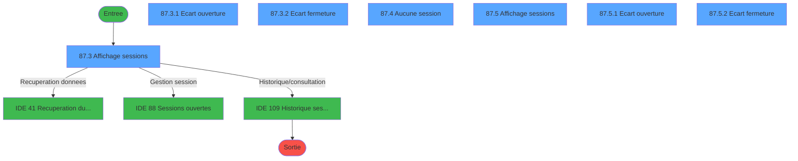
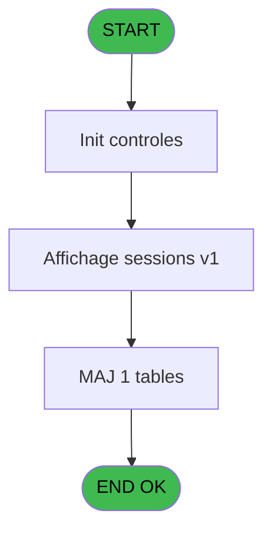
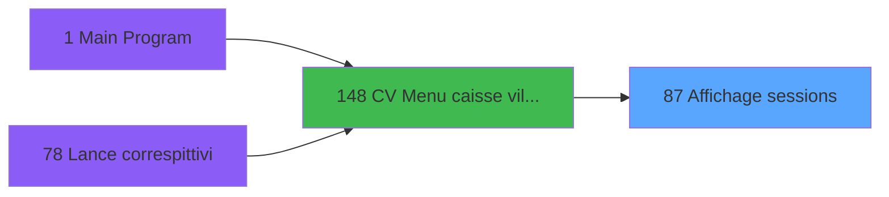
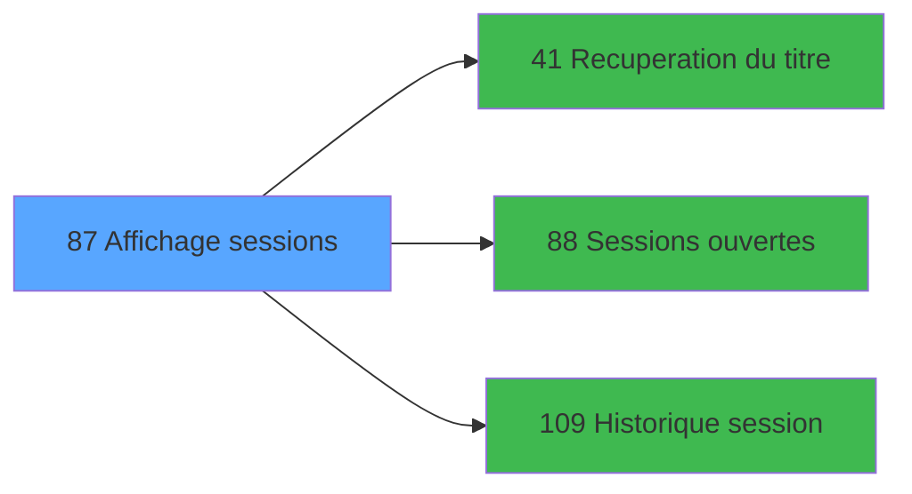

# VIL IDE 87 - Affichage sessions

> **Analyse**: Phases 1-4 2026-02-03 09:15 -> 09:15 (20s) | Assemblage 09:15
> **Pipeline**: V7.2 Enrichi
> **Structure**: 4 onglets (Resume | Ecrans | Donnees | Connexions)

<!-- TAB:Resume -->

## 1. FICHE D'IDENTITE

| Attribut | Valeur |
|----------|--------|
| Projet | VIL |
| IDE Position | 87 |
| Nom Programme | Affichage sessions |
| Fichier source | `Prg_87.xml` |
| Domaine metier | Caisse |
| Taches | 10 (7 ecrans visibles) |
| Tables modifiees | 1 |
| Programmes appeles | 3 |

## 2. DESCRIPTION FONCTIONNELLE

**Affichage sessions** assure la gestion complete de ce processus, accessible depuis [CV  Menu caisse village (IDE 148)](VIL-IDE-148.md).

Le flux de traitement s'organise en **2 blocs fonctionnels** :

- **Traitement** (7 taches) : traitements metier divers
- **Consultation** (3 taches) : ecrans de recherche, selection et consultation

**Donnees modifiees** : 1 tables en ecriture (suivi_pdc).

Detail : phases du traitement

#### Phase 1 : Consultation (3 taches)

- **87** - Affichage sessions 239 240 241
- **87.3** - Affichage sessions **[[ECRAN]](#ecran-t4)**
- **87.5** - Affichage sessions **[[ECRAN]](#ecran-t13)**

Delegue a : [Recuperation du titre (IDE 41)](VIL-IDE-41.md)

#### Phase 2 : Traitement (7 taches)

- **87.1** - Session pour PDC
- **87.2** - Update suivi pdc
- **87.3.1** - Ecart ouverture **[[ECRAN]](#ecran-t7)**
- **87.3.2** - Ecart fermeture **[[ECRAN]](#ecran-t8)**
- **87.4** - Aucune session **[[ECRAN]](#ecran-t10)**
- **87.5.1** - Ecart ouverture **[[ECRAN]](#ecran-t14)**
- **87.5.2** - Ecart fermeture **[[ECRAN]](#ecran-t15)**

Delegue a : [Recuperation du titre (IDE 41)](VIL-IDE-41.md), [Sessions ouvertes (IDE 88)](VIL-IDE-88.md), [Historique session (IDE 109)](VIL-IDE-109.md)

#### Tables impactees

| Table | Operations | Role metier |
|-------|-----------|-------------|
| suivi_pdc | R/**W** (2 usages) |  |

## 3. BLOCS FONCTIONNELS

### 3.1 Consultation (3 taches)

Ecrans de recherche et consultation.

---

#### 87 - Affichage sessions 239 240 241

**Role** : Reinitialisation : Affichage sessions 239 240 241.

---

#### 87.3 - Affichage sessions [[ECRAN]](#ecran-t4)

**Role** : Reinitialisation : Affichage sessions.
**Ecran** : 1200 x 208 DLU (MDI) | [Voir mockup](#ecran-t4)

---

#### 87.5 - Affichage sessions [[ECRAN]](#ecran-t13)

**Role** : Reinitialisation : Affichage sessions.
**Ecran** : 1200 x 208 DLU (MDI) | [Voir mockup](#ecran-t13)

### 3.2 Traitement (7 taches)

Traitements internes.

---

#### 87.1 - Session pour PDC

**Role** : Traitement : Session pour PDC.
**Variables liees** : J (Existe session), K (Existe session ouverte)
**Delegue a** : [Recuperation du titre (IDE 41)](VIL-IDE-41.md), [Sessions ouvertes (IDE 88)](VIL-IDE-88.md), [Historique session (IDE 109)](VIL-IDE-109.md)

---

#### 87.2 - Update suivi pdc

**Role** : Traitement : Update suivi pdc.
**Variables liees** : L (Faire Update suivi PDC)
**Delegue a** : [Recuperation du titre (IDE 41)](VIL-IDE-41.md), [Sessions ouvertes (IDE 88)](VIL-IDE-88.md), [Historique session (IDE 109)](VIL-IDE-109.md)

---

#### 87.3.1 - Ecart ouverture [[ECRAN]](#ecran-t7)

**Role** : Traitement : Ecart ouverture.
**Ecran** : 1200 x 76 DLU (MDI) | [Voir mockup](#ecran-t7)
**Delegue a** : [Recuperation du titre (IDE 41)](VIL-IDE-41.md), [Sessions ouvertes (IDE 88)](VIL-IDE-88.md), [Historique session (IDE 109)](VIL-IDE-109.md)

---

#### 87.3.2 - Ecart fermeture [[ECRAN]](#ecran-t8)

**Role** : Traitement : Ecart fermeture.
**Ecran** : 1200 x 76 DLU (MDI) | [Voir mockup](#ecran-t8)
**Delegue a** : [Recuperation du titre (IDE 41)](VIL-IDE-41.md), [Sessions ouvertes (IDE 88)](VIL-IDE-88.md), [Historique session (IDE 109)](VIL-IDE-109.md)

---

#### 87.4 - Aucune session [[ECRAN]](#ecran-t10)

**Role** : Traitement : Aucune session.
**Ecran** : 1200 x 0 DLU (MDI) | [Voir mockup](#ecran-t10)
**Variables liees** : J (Existe session), K (Existe session ouverte)
**Delegue a** : [Recuperation du titre (IDE 41)](VIL-IDE-41.md), [Sessions ouvertes (IDE 88)](VIL-IDE-88.md), [Historique session (IDE 109)](VIL-IDE-109.md)

---

#### 87.5.1 - Ecart ouverture [[ECRAN]](#ecran-t14)

**Role** : Traitement : Ecart ouverture.
**Ecran** : 1200 x 76 DLU (MDI) | [Voir mockup](#ecran-t14)
**Delegue a** : [Recuperation du titre (IDE 41)](VIL-IDE-41.md), [Sessions ouvertes (IDE 88)](VIL-IDE-88.md), [Historique session (IDE 109)](VIL-IDE-109.md)

---

#### 87.5.2 - Ecart fermeture [[ECRAN]](#ecran-t15)

**Role** : Traitement : Ecart fermeture.
**Ecran** : 1200 x 76 DLU (MDI) | [Voir mockup](#ecran-t15)
**Delegue a** : [Recuperation du titre (IDE 41)](VIL-IDE-41.md), [Sessions ouvertes (IDE 88)](VIL-IDE-88.md), [Historique session (IDE 109)](VIL-IDE-109.md)

## 5. REGLES METIER

*(Aucune regle metier identifiee)*

## 6. CONTEXTE

- **Appele par**: [CV  Menu caisse village (IDE 148)](VIL-IDE-148.md)
- **Appelle**: 3 programmes | **Tables**: 7 (W:1 R:2 L:5) | **Taches**: 10 | **Expressions**: 10

<!-- TAB:Ecrans -->

## 8. ECRANS

### 8.1 Forms visibles (7 / 10)

| # | Position | Tache | Nom | Type | Largeur | Hauteur | Bloc |
|---|----------|-------|-----|------|---------|---------|------|
| 1 | 87.3 | 87.3 | Affichage sessions | MDI | 1200 | 208 | Consultation |
| 2 | 87.3.1 | 87.3.1 | Ecart ouverture | MDI | 1200 | 76 | Traitement |
| 3 | 87.3.2 | 87.3.2 | Ecart fermeture | MDI | 1200 | 76 | Traitement |
| 4 | 87.5 | 87.4 | Aucune session | MDI | 1200 | 0 | Traitement |
| 5 | 87.4 | 87.5 | Affichage sessions | MDI | 1200 | 208 | Consultation |
| 6 | 87.4.1 | 87.5.1 | Ecart ouverture | MDI | 1200 | 76 | Traitement |
| 7 | 87.4.2 | 87.5.2 | Ecart fermeture | MDI | 1200 | 76 | Traitement |

### 8.2 Mockups Ecrans

---

#### 87.3 - Affichage sessions
**Tache** : [87.3](#t4) | **Type** : MDI | **Dimensions** : 1200 x 208 DLU
**Bloc** : Consultation | **Titre IDE** : Affichage sessions

<!-- FORM-DATA:
{
    "width":  1200,
    "vFactor":  8,
    "type":  "MDI",
    "hFactor":  8,
    "controls":  [
                     {
                         "x":  0,
                         "type":  "label",
                         "var":  "",
                         "y":  0,
                         "w":  1200,
                         "fmt":  "",
                         "name":  "",
                         "h":  24,
                         "color":  "",
                         "text":  "",
                         "parent":  null
                     },
                     {
                         "x":  310,
                         "type":  "label",
                         "var":  "",
                         "y":  3,
                         "w":  368,
                         "fmt":  "",
                         "name":  "",
                         "h":  19,
                         "color":  "",
                         "text":  "",
                         "parent":  null
                     },
                     {
                         "x":  317,
                         "type":  "label",
                         "var":  "",
                         "y":  8,
                         "w":  190,
                         "fmt":  "",
                         "name":  "",
                         "h":  10,
                         "color":  "7",
                         "text":  "Date comptable",
                         "parent":  4
                     },
                     {
                         "x":  11,
                         "type":  "label",
                         "var":  "",
                         "y":  26,
                         "w":  114,
                         "fmt":  "",
                         "name":  "",
                         "h":  10,
                         "color":  "",
                         "text":  "Caisse",
                         "parent":  null
                     },
                     {
                         "x":  294,
                         "type":  "label",
                         "var":  "",
                         "y":  26,
                         "w":  79,
                         "fmt":  "",
                         "name":  "",
                         "h":  10,
                         "color":  "",
                         "text":  "Terminal",
                         "parent":  null
                     },
                     {
                         "x":  626,
                         "type":  "label",
                         "var":  "",
                         "y":  26,
                         "w":  68,
                         "fmt":  "",
                         "name":  "",
                         "h":  10,
                         "color":  "",
                         "text":  "Service",
                         "parent":  null
                     },
                     {
                         "x":  1090,
                         "type":  "label",
                         "var":  "",
                         "y":  27,
                         "w":  77,
                         "fmt":  "",
                         "name":  "",
                         "h":  10,
                         "color":  "",
                         "text":  "Ecart",
                         "parent":  null
                     },
                     {
                         "x":  5,
                         "type":  "table",
                         "var":  "",
                         "name":  "",
                         "titleH":  12,
                         "color":  "110",
                         "w":  1190,
                         "y":  38,
                         "fmt":  "",
                         "parent":  null,
                         "text":  "",
                         "rowH":  11,
                         "h":  124,
                         "cols":  [
                                      {
                                          "title":  "Utilisateur",
                                          "layer":  1,
                                          "w":  116
                                      },
                                      {
                                          "title":  "Numéro session",
                                          "layer":  2,
                                          "w":  160
                                      },
                                      {
                                          "title":  "Date début",
                                          "layer":  3,
                                          "w":  166
                                      },
                                      {
                                          "title":  "Heure début",
                                          "layer":  4,
                                          "w":  176
                                      },
                                      {
                                          "title":  "Date fin",
                                          "layer":  5,
                                          "w":  140
                                      },
                                      {
                                          "title":  "Heure fin",
                                          "layer":  6,
                                          "w":  150
                                      },
                                      {
                                          "title":  "Etat de la session",
                                          "layer":  7,
                                          "w":  170
                                      },
                                      {
                                          "title":  "O",
                                          "layer":  8,
                                          "w":  39
                                      },
                                      {
                                          "title":  "F",
                                          "layer":  9,
                                          "w":  41
                                      }
                                  ],
                         "rows":  9
                     },
                     {
                         "x":  1169,
                         "type":  "label",
                         "var":  "",
                         "y":  39,
                         "w":  19,
                         "fmt":  "",
                         "name":  "",
                         "h":  11,
                         "color":  "7",
                         "text":  "",
                         "parent":  null
                     },
                     {
                         "x":  500,
                         "type":  "label",
                         "var":  "",
                         "y":  167,
                         "w":  200,
                         "fmt":  "",
                         "name":  "",
                         "h":  16,
                         "color":  "",
                         "text":  "Aucune session",
                         "parent":  36
                     },
                     {
                         "x":  0,
                         "type":  "label",
                         "var":  "",
                         "y":  184,
                         "w":  1200,
                         "fmt":  "",
                         "name":  "",
                         "h":  24,
                         "color":  "",
                         "text":  "",
                         "parent":  null
                     },
                     {
                         "x":  214,
                         "type":  "label",
                         "var":  "",
                         "y":  158,
                         "w":  34,
                         "fmt":  "",
                         "name":  "",
                         "h":  9,
                         "color":  "",
                         "text":  "Etat",
                         "parent":  null
                     },
                     {
                         "x":  213,
                         "type":  "label",
                         "var":  "",
                         "y":  172,
                         "w":  171,
                         "fmt":  "",
                         "name":  "",
                         "h":  9,
                         "color":  "",
                         "text":  "Existe session ouverte",
                         "parent":  null
                     },
                     {
                         "x":  11,
                         "type":  "edit",
                         "var":  "",
                         "y":  52,
                         "w":  109,
                         "fmt":  "",
                         "name":  "",
                         "h":  8,
                         "color":  "110",
                         "text":  "",
                         "parent":  17
                     },
                     {
                         "x":  126,
                         "type":  "edit",
                         "var":  "",
                         "y":  52,
                         "w":  153,
                         "fmt":  "12Z",
                         "name":  "",
                         "h":  8,
                         "color":  "110",
                         "text":  "",
                         "parent":  17
                     },
                     {
                         "x":  286,
                         "type":  "edit",
                         "var":  "",
                         "y":  52,
                         "w":  157,
                         "fmt":  "##/##/####Z",
                         "name":  "",
                         "h":  8,
                         "color":  "110",
                         "text":  "",
                         "parent":  17
                     },
                     {
                         "x":  453,
                         "type":  "edit",
                         "var":  "",
                         "y":  52,
                         "w":  166,
                         "fmt":  "HH:MM:SSZ",
                         "name":  "",
                         "h":  8,
                         "color":  "110",
                         "text":  "",
                         "parent":  17
                     },
                     {
                         "x":  629,
                         "type":  "edit",
                         "var":  "",
                         "y":  52,
                         "w":  131,
                         "fmt":  "##/##/####Z",
                         "name":  "",
                         "h":  8,
                         "color":  "110",
                         "text":  "",
                         "parent":  17
                     },
                     {
                         "x":  770,
                         "type":  "edit",
                         "var":  "",
                         "y":  52,
                         "w":  143,
                         "fmt":  "HH:MM:SSZ",
                         "name":  "",
                         "h":  8,
                         "color":  "110",
                         "text":  "",
                         "parent":  17
                     },
                     {
                         "x":  1090,
                         "type":  "checkbox",
                         "var":  "",
                         "y":  52,
                         "w":  30,
                         "fmt":  "",
                         "name":  "",
                         "h":  8,
                         "color":  "110",
                         "text":  "",
                         "parent":  17
                     },
                     {
                         "x":  1128,
                         "type":  "checkbox",
                         "var":  "",
                         "y":  52,
                         "w":  30,
                         "fmt":  "",
                         "name":  "",
                         "h":  8,
                         "color":  "110",
                         "text":  "",
                         "parent":  17
                     },
                     {
                         "x":  380,
                         "type":  "edit",
                         "var":  "",
                         "y":  26,
                         "w":  54,
                         "fmt":  "",
                         "name":  "",
                         "h":  10,
                         "color":  "6",
                         "text":  "",
                         "parent":  null
                     },
                     {
                         "x":  701,
                         "type":  "edit",
                         "var":  "",
                         "y":  26,
                         "w":  54,
                         "fmt":  "",
                         "name":  "",
                         "h":  10,
                         "color":  "6",
                         "text":  "",
                         "parent":  null
                     },
                     {
                         "x":  769,
                         "type":  "edit",
                         "var":  "",
                         "y":  26,
                         "w":  203,
                         "fmt":  "",
                         "name":  "",
                         "h":  10,
                         "color":  "6",
                         "text":  "",
                         "parent":  null
                     },
                     {
                         "x":  691,
                         "type":  "edit",
                         "var":  "",
                         "y":  3,
                         "w":  200,
                         "fmt":  "30",
                         "name":  "",
                         "h":  18,
                         "color":  "142",
                         "text":  "",
                         "parent":  null
                     },
                     {
                         "x":  691,
                         "type":  "edit",
                         "var":  "",
                         "y":  3,
                         "w":  200,
                         "fmt":  "30",
                         "name":  "",
                         "h":  18,
                         "color":  "144",
                         "text":  "",
                         "parent":  null
                     },
                     {
                         "x":  8,
                         "type":  "edit",
                         "var":  "",
                         "y":  8,
                         "w":  262,
                         "fmt":  "30",
                         "name":  "",
                         "h":  8,
                         "color":  "",
                         "text":  "",
                         "parent":  null
                     },
                     {
                         "x":  515,
                         "type":  "edit",
                         "var":  "",
                         "y":  8,
                         "w":  158,
                         "fmt":  "",
                         "name":  "",
                         "h":  10,
                         "color":  "7",
                         "text":  "",
                         "parent":  4
                     },
                     {
                         "x":  914,
                         "type":  "edit",
                         "var":  "",
                         "y":  8,
                         "w":  280,
                         "fmt":  "WWW DD MMM YYYYT",
                         "name":  "",
                         "h":  8,
                         "color":  "",
                         "text":  "",
                         "parent":  null
                     },
                     {
                         "x":  132,
                         "type":  "edit",
                         "var":  "",
                         "y":  26,
                         "w":  145,
                         "fmt":  "30",
                         "name":  "",
                         "h":  10,
                         "color":  "6",
                         "text":  "",
                         "parent":  null
                     },
                     {
                         "x":  918,
                         "type":  "edit",
                         "var":  "",
                         "y":  52,
                         "w":  162,
                         "fmt":  "30",
                         "name":  "",
                         "h":  8,
                         "color":  "110",
                         "text":  "",
                         "parent":  17
                     },
                     {
                         "x":  11,
                         "type":  "button",
                         "var":  "",
                         "y":  167,
                         "w":  154,
                         "fmt":  "\u0026Historique",
                         "name":  "",
                         "h":  16,
                         "color":  "",
                         "text":  "",
                         "parent":  null
                     },
                     {
                         "x":  11,
                         "type":  "button",
                         "var":  "",
                         "y":  187,
                         "w":  154,
                         "fmt":  "\u0026Abandon",
                         "name":  "",
                         "h":  18,
                         "color":  "",
                         "text":  "",
                         "parent":  null
                     },
                     {
                         "x":  190,
                         "type":  "button",
                         "var":  "",
                         "y":  187,
                         "w":  192,
                         "fmt":  "\u0026Toutes les sessions",
                         "name":  "TOUTES",
                         "h":  18,
                         "color":  "",
                         "text":  "",
                         "parent":  null
                     },
                     {
                         "x":  399,
                         "type":  "button",
                         "var":  "",
                         "y":  187,
                         "w":  192,
                         "fmt":  "\u0026Sessions ouvertes",
                         "name":  "OUVERTES",
                         "h":  18,
                         "color":  "",
                         "text":  "",
                         "parent":  null
                     },
                     {
                         "x":  608,
                         "type":  "button",
                         "var":  "",
                         "y":  187,
                         "w":  192,
                         "fmt":  "Ecart \u0026Ouverture",
                         "name":  "",
                         "h":  18,
                         "color":  "",
                         "text":  "",
                         "parent":  null
                     },
                     {
                         "x":  819,
                         "type":  "button",
                         "var":  "",
                         "y":  187,
                         "w":  192,
                         "fmt":  "Ecart \u0026Fermeture",
                         "name":  "",
                         "h":  18,
                         "color":  "",
                         "text":  "",
                         "parent":  null
                     },
                     {
                         "x":  1040,
                         "type":  "button",
                         "var":  "",
                         "y":  187,
                         "w":  154,
                         "fmt":  "\u0026Validation",
                         "name":  "",
                         "h":  18,
                         "color":  "",
                         "text":  "",
                         "parent":  null
                     },
                     {
                         "x":  1040,
                         "type":  "button",
                         "var":  "",
                         "y":  187,
                         "w":  154,
                         "fmt":  "\u0026Quitter",
                         "name":  "",
                         "h":  18,
                         "color":  "",
                         "text":  "",
                         "parent":  null
                     },
                     {
                         "x":  250,
                         "type":  "edit",
                         "var":  "",
                         "y":  158,
                         "w":  18,
                         "fmt":  "",
                         "name":  "Etat",
                         "h":  10,
                         "color":  "",
                         "text":  "",
                         "parent":  null
                     },
                     {
                         "x":  386,
                         "type":  "edit",
                         "var":  "",
                         "y":  172,
                         "w":  62,
                         "fmt":  "",
                         "name":  "Existe session ouverte",
                         "h":  10,
                         "color":  "",
                         "text":  "",
                         "parent":  null
                     }
                 ],
    "taskId":  "87.3",
    "height":  208
}
-->

<strong>Champs : 20 champs</strong>

| Pos (x,y) | Nom | Variable | Type |
|-----------|-----|----------|------|
| 11,52 | (sans nom) | - | edit |
| 126,52 | 12Z | - | edit |
| 286,52 | ##/##/####Z | - | edit |
| 453,52 | HH:MM:SSZ | - | edit |
| 629,52 | ##/##/####Z | - | edit |
| 770,52 | HH:MM:SSZ | - | edit |
| 1090,52 | (sans nom) | - | checkbox |
| 1128,52 | (sans nom) | - | checkbox |
| 380,26 | (sans nom) | - | edit |
| 701,26 | (sans nom) | - | edit |
| 769,26 | (sans nom) | - | edit |
| 691,3 | 30 | - | edit |
| 691,3 | 30 | - | edit |
| 8,8 | 30 | - | edit |
| 515,8 | (sans nom) | - | edit |
| 914,8 | WWW DD MMM YYYYT | - | edit |
| 132,26 | 30 | - | edit |
| 918,52 | 30 | - | edit |
| 250,158 | Etat | - | edit |
| 386,172 | Existe session ouverte | - | edit |

<strong>Boutons : 8 boutons</strong>

| Bouton | Pos (x,y) | Action |
|--------|-----------|--------|
| Historique | 11,167 | Appel [Historique session (IDE 109)](VIL-IDE-109.md) |
| Abandon | 11,187 | Annule et retour au menu |
| Toutes les sessions | 190,187 | Bouton fonctionnel |
| Sessions ouvertes | 399,187 | Appel [Sessions ouvertes (IDE 88)](VIL-IDE-88.md) |
| Ecart Ouverture | 608,187 | Bouton fonctionnel |
| Ecart Fermeture | 819,187 | Ouvre ou ferme la session |
| Validation | 1040,187 | Valide la saisie et enregistre |
| Quitter | 1040,187 | Quitte le programme |

---

#### 87.3.1 - Ecart ouverture
**Tache** : [87.3.1](#t7) | **Type** : MDI | **Dimensions** : 1200 x 76 DLU
**Bloc** : Traitement | **Titre IDE** : Ecart ouverture

<!-- FORM-DATA:
{
    "width":  1200,
    "vFactor":  8,
    "type":  "MDI",
    "hFactor":  8,
    "controls":  [
                     {
                         "x":  243,
                         "type":  "label",
                         "var":  "",
                         "y":  13,
                         "w":  112,
                         "fmt":  "",
                         "name":  "",
                         "h":  12,
                         "color":  "7",
                         "text":  "Cash",
                         "parent":  null
                     },
                     {
                         "x":  360,
                         "type":  "label",
                         "var":  "",
                         "y":  13,
                         "w":  112,
                         "fmt":  "",
                         "name":  "",
                         "h":  12,
                         "color":  "7",
                         "text":  "Produits",
                         "parent":  null
                     },
                     {
                         "x":  477,
                         "type":  "label",
                         "var":  "",
                         "y":  13,
                         "w":  112,
                         "fmt":  "",
                         "name":  "",
                         "h":  12,
                         "color":  "7",
                         "text":  "Cartes",
                         "parent":  null
                     },
                     {
                         "x":  594,
                         "type":  "label",
                         "var":  "",
                         "y":  13,
                         "w":  112,
                         "fmt":  "",
                         "name":  "",
                         "h":  12,
                         "color":  "7",
                         "text":  "Chèques",
                         "parent":  null
                     },
                     {
                         "x":  711,
                         "type":  "label",
                         "var":  "",
                         "y":  13,
                         "w":  112,
                         "fmt":  "",
                         "name":  "",
                         "h":  12,
                         "color":  "7",
                         "text":  "OD",
                         "parent":  null
                     },
                     {
                         "x":  831,
                         "type":  "label",
                         "var":  "",
                         "y":  13,
                         "w":  154,
                         "fmt":  "",
                         "name":  "",
                         "h":  12,
                         "color":  "7",
                         "text":  "TOTAL",
                         "parent":  null
                     },
                     {
                         "x":  991,
                         "type":  "label",
                         "var":  "",
                         "y":  13,
                         "w":  96,
                         "fmt":  "",
                         "name":  "",
                         "h":  12,
                         "color":  "",
                         "text":  "Devise",
                         "parent":  null
                     },
                     {
                         "x":  41,
                         "type":  "label",
                         "var":  "",
                         "y":  32,
                         "w":  192,
                         "fmt":  "",
                         "name":  "",
                         "h":  12,
                         "color":  "7",
                         "text":  "Ecart ouverture",
                         "parent":  null
                     },
                     {
                         "x":  0,
                         "type":  "label",
                         "var":  "",
                         "y":  52,
                         "w":  1200,
                         "fmt":  "",
                         "name":  "",
                         "h":  24,
                         "color":  "",
                         "text":  "",
                         "parent":  null
                     },
                     {
                         "x":  40,
                         "type":  "label",
                         "var":  "",
                         "y":  59,
                         "w":  149,
                         "fmt":  "",
                         "name":  "",
                         "h":  10,
                         "color":  "",
                         "text":  "Commentaire écart",
                         "parent":  null
                     },
                     {
                         "x":  578,
                         "type":  "label",
                         "var":  "",
                         "y":  59,
                         "w":  203,
                         "fmt":  "",
                         "name":  "",
                         "h":  10,
                         "color":  "",
                         "text":  "Commentaire écart devise",
                         "parent":  null
                     },
                     {
                         "x":  1168,
                         "type":  "edit",
                         "var":  "",
                         "y":  32,
                         "w":  26,
                         "fmt":  "",
                         "name":  "",
                         "h":  12,
                         "color":  "6",
                         "text":  "",
                         "parent":  null
                     },
                     {
                         "x":  243,
                         "type":  "edit",
                         "var":  "",
                         "y":  32,
                         "w":  112,
                         "fmt":  "N## ### ### ###.###Z",
                         "name":  "",
                         "h":  12,
                         "color":  "7",
                         "text":  "",
                         "parent":  null
                     },
                     {
                         "x":  360,
                         "type":  "edit",
                         "var":  "",
                         "y":  32,
                         "w":  112,
                         "fmt":  "N## ### ### ###.###Z",
                         "name":  "",
                         "h":  12,
                         "color":  "7",
                         "text":  "",
                         "parent":  null
                     },
                     {
                         "x":  477,
                         "type":  "edit",
                         "var":  "",
                         "y":  32,
                         "w":  112,
                         "fmt":  "N## ### ### ###.###Z",
                         "name":  "",
                         "h":  12,
                         "color":  "7",
                         "text":  "",
                         "parent":  null
                     },
                     {
                         "x":  594,
                         "type":  "edit",
                         "var":  "",
                         "y":  32,
                         "w":  112,
                         "fmt":  "N## ### ### ###.###Z",
                         "name":  "",
                         "h":  12,
                         "color":  "7",
                         "text":  "",
                         "parent":  null
                     },
                     {
                         "x":  711,
                         "type":  "edit",
                         "var":  "",
                         "y":  32,
                         "w":  112,
                         "fmt":  "N## ### ### ###.###Z",
                         "name":  "",
                         "h":  12,
                         "color":  "7",
                         "text":  "",
                         "parent":  null
                     },
                     {
                         "x":  831,
                         "type":  "edit",
                         "var":  "",
                         "y":  32,
                         "w":  154,
                         "fmt":  "N## ### ### ###.###Z",
                         "name":  "",
                         "h":  12,
                         "color":  "7",
                         "text":  "",
                         "parent":  null
                     },
                     {
                         "x":  991,
                         "type":  "edit",
                         "var":  "",
                         "y":  32,
                         "w":  96,
                         "fmt":  "6Z",
                         "name":  "",
                         "h":  12,
                         "color":  "177",
                         "text":  "",
                         "parent":  null
                     },
                     {
                         "x":  191,
                         "type":  "edit",
                         "var":  "",
                         "y":  59,
                         "w":  350,
                         "fmt":  "",
                         "name":  "",
                         "h":  10,
                         "color":  "6",
                         "text":  "",
                         "parent":  null
                     },
                     {
                         "x":  783,
                         "type":  "edit",
                         "var":  "",
                         "y":  59,
                         "w":  198,
                         "fmt":  "",
                         "name":  "",
                         "h":  10,
                         "color":  "6",
                         "text":  "",
                         "parent":  null
                     },
                     {
                         "x":  1040,
                         "type":  "button",
                         "var":  "",
                         "y":  55,
                         "w":  154,
                         "fmt":  "\u0026Quitter",
                         "name":  "",
                         "h":  18,
                         "color":  "",
                         "text":  "",
                         "parent":  null
                     }
                 ],
    "taskId":  "87.3.1",
    "height":  76
}
-->

<strong>Champs : 10 champs</strong>

| Pos (x,y) | Nom | Variable | Type |
|-----------|-----|----------|------|
| 1168,32 | (sans nom) | - | edit |
| 243,32 | N## ### ### ###.###Z | - | edit |
| 360,32 | N## ### ### ###.###Z | - | edit |
| 477,32 | N## ### ### ###.###Z | - | edit |
| 594,32 | N## ### ### ###.###Z | - | edit |
| 711,32 | N## ### ### ###.###Z | - | edit |
| 831,32 | N## ### ### ###.###Z | - | edit |
| 991,32 | 6Z | - | edit |
| 191,59 | (sans nom) | - | edit |
| 783,59 | (sans nom) | - | edit |

<strong>Boutons : 1 boutons</strong>

| Bouton | Pos (x,y) | Action |
|--------|-----------|--------|
| Quitter | 1040,55 | Quitte le programme |

---

#### 87.3.2 - Ecart fermeture
**Tache** : [87.3.2](#t8) | **Type** : MDI | **Dimensions** : 1200 x 76 DLU
**Bloc** : Traitement | **Titre IDE** : Ecart fermeture

<!-- FORM-DATA:
{
    "width":  1200,
    "vFactor":  8,
    "type":  "MDI",
    "hFactor":  8,
    "controls":  [
                     {
                         "x":  243,
                         "type":  "label",
                         "var":  "",
                         "y":  13,
                         "w":  112,
                         "fmt":  "",
                         "name":  "",
                         "h":  12,
                         "color":  "7",
                         "text":  "Cash",
                         "parent":  null
                     },
                     {
                         "x":  360,
                         "type":  "label",
                         "var":  "",
                         "y":  13,
                         "w":  112,
                         "fmt":  "",
                         "name":  "",
                         "h":  12,
                         "color":  "7",
                         "text":  "Produits",
                         "parent":  null
                     },
                     {
                         "x":  477,
                         "type":  "label",
                         "var":  "",
                         "y":  13,
                         "w":  112,
                         "fmt":  "",
                         "name":  "",
                         "h":  12,
                         "color":  "7",
                         "text":  "Cartes",
                         "parent":  null
                     },
                     {
                         "x":  594,
                         "type":  "label",
                         "var":  "",
                         "y":  13,
                         "w":  112,
                         "fmt":  "",
                         "name":  "",
                         "h":  12,
                         "color":  "7",
                         "text":  "Chèques",
                         "parent":  null
                     },
                     {
                         "x":  711,
                         "type":  "label",
                         "var":  "",
                         "y":  13,
                         "w":  112,
                         "fmt":  "",
                         "name":  "",
                         "h":  12,
                         "color":  "7",
                         "text":  "OD",
                         "parent":  null
                     },
                     {
                         "x":  831,
                         "type":  "label",
                         "var":  "",
                         "y":  13,
                         "w":  154,
                         "fmt":  "",
                         "name":  "",
                         "h":  12,
                         "color":  "7",
                         "text":  "TOTAL",
                         "parent":  null
                     },
                     {
                         "x":  991,
                         "type":  "label",
                         "var":  "",
                         "y":  13,
                         "w":  96,
                         "fmt":  "",
                         "name":  "",
                         "h":  12,
                         "color":  "",
                         "text":  "Devise",
                         "parent":  null
                     },
                     {
                         "x":  41,
                         "type":  "label",
                         "var":  "",
                         "y":  32,
                         "w":  192,
                         "fmt":  "",
                         "name":  "",
                         "h":  12,
                         "color":  "7",
                         "text":  "Ecart fermeture",
                         "parent":  null
                     },
                     {
                         "x":  0,
                         "type":  "label",
                         "var":  "",
                         "y":  52,
                         "w":  1200,
                         "fmt":  "",
                         "name":  "",
                         "h":  24,
                         "color":  "",
                         "text":  "",
                         "parent":  null
                     },
                     {
                         "x":  40,
                         "type":  "label",
                         "var":  "",
                         "y":  59,
                         "w":  149,
                         "fmt":  "",
                         "name":  "",
                         "h":  10,
                         "color":  "",
                         "text":  "Commentaire écart",
                         "parent":  null
                     },
                     {
                         "x":  578,
                         "type":  "label",
                         "var":  "",
                         "y":  59,
                         "w":  203,
                         "fmt":  "",
                         "name":  "",
                         "h":  10,
                         "color":  "",
                         "text":  "Commentaire écart devise",
                         "parent":  null
                     },
                     {
                         "x":  1168,
                         "type":  "edit",
                         "var":  "",
                         "y":  32,
                         "w":  26,
                         "fmt":  "",
                         "name":  "",
                         "h":  12,
                         "color":  "6",
                         "text":  "",
                         "parent":  null
                     },
                     {
                         "x":  243,
                         "type":  "edit",
                         "var":  "",
                         "y":  32,
                         "w":  112,
                         "fmt":  "N## ### ### ###.###Z",
                         "name":  "",
                         "h":  12,
                         "color":  "7",
                         "text":  "",
                         "parent":  null
                     },
                     {
                         "x":  360,
                         "type":  "edit",
                         "var":  "",
                         "y":  32,
                         "w":  112,
                         "fmt":  "N## ### ### ###.###Z",
                         "name":  "",
                         "h":  12,
                         "color":  "7",
                         "text":  "",
                         "parent":  null
                     },
                     {
                         "x":  477,
                         "type":  "edit",
                         "var":  "",
                         "y":  32,
                         "w":  112,
                         "fmt":  "N## ### ### ###.###Z",
                         "name":  "",
                         "h":  12,
                         "color":  "7",
                         "text":  "",
                         "parent":  null
                     },
                     {
                         "x":  594,
                         "type":  "edit",
                         "var":  "",
                         "y":  32,
                         "w":  112,
                         "fmt":  "N## ### ### ###.###Z",
                         "name":  "",
                         "h":  12,
                         "color":  "7",
                         "text":  "",
                         "parent":  null
                     },
                     {
                         "x":  711,
                         "type":  "edit",
                         "var":  "",
                         "y":  32,
                         "w":  112,
                         "fmt":  "N## ### ### ###.###Z",
                         "name":  "",
                         "h":  12,
                         "color":  "7",
                         "text":  "",
                         "parent":  null
                     },
                     {
                         "x":  831,
                         "type":  "edit",
                         "var":  "",
                         "y":  32,
                         "w":  154,
                         "fmt":  "N## ### ### ###.###Z",
                         "name":  "",
                         "h":  12,
                         "color":  "7",
                         "text":  "",
                         "parent":  null
                     },
                     {
                         "x":  991,
                         "type":  "edit",
                         "var":  "",
                         "y":  32,
                         "w":  96,
                         "fmt":  "6Z",
                         "name":  "",
                         "h":  12,
                         "color":  "177",
                         "text":  "",
                         "parent":  null
                     },
                     {
                         "x":  191,
                         "type":  "edit",
                         "var":  "",
                         "y":  59,
                         "w":  350,
                         "fmt":  "",
                         "name":  "",
                         "h":  10,
                         "color":  "6",
                         "text":  "",
                         "parent":  null
                     },
                     {
                         "x":  783,
                         "type":  "edit",
                         "var":  "",
                         "y":  59,
                         "w":  198,
                         "fmt":  "",
                         "name":  "",
                         "h":  10,
                         "color":  "6",
                         "text":  "",
                         "parent":  null
                     },
                     {
                         "x":  1040,
                         "type":  "button",
                         "var":  "",
                         "y":  55,
                         "w":  154,
                         "fmt":  "\u0026Quitter",
                         "name":  "",
                         "h":  18,
                         "color":  "",
                         "text":  "",
                         "parent":  null
                     }
                 ],
    "taskId":  "87.3.2",
    "height":  76
}
-->

<strong>Champs : 10 champs</strong>

| Pos (x,y) | Nom | Variable | Type |
|-----------|-----|----------|------|
| 1168,32 | (sans nom) | - | edit |
| 243,32 | N## ### ### ###.###Z | - | edit |
| 360,32 | N## ### ### ###.###Z | - | edit |
| 477,32 | N## ### ### ###.###Z | - | edit |
| 594,32 | N## ### ### ###.###Z | - | edit |
| 711,32 | N## ### ### ###.###Z | - | edit |
| 831,32 | N## ### ### ###.###Z | - | edit |
| 991,32 | 6Z | - | edit |
| 191,59 | (sans nom) | - | edit |
| 783,59 | (sans nom) | - | edit |

<strong>Boutons : 1 boutons</strong>

| Bouton | Pos (x,y) | Action |
|--------|-----------|--------|
| Quitter | 1040,55 | Quitte le programme |

---

#### 87.5 - Aucune session
**Tache** : [87.4](#t10) | **Type** : MDI | **Dimensions** : 1200 x 0 DLU
**Bloc** : Traitement | **Titre IDE** : Aucune session

<!-- FORM-DATA:
{
    "width":  1200,
    "vFactor":  8,
    "type":  "MDI",
    "hFactor":  8,
    "controls":  [
                     {
                         "x":  0,
                         "type":  "label",
                         "var":  "",
                         "y":  0,
                         "w":  1200,
                         "fmt":  "",
                         "name":  "",
                         "h":  24,
                         "color":  "",
                         "text":  "",
                         "parent":  null
                     },
                     {
                         "x":  310,
                         "type":  "label",
                         "var":  "",
                         "y":  2,
                         "w":  368,
                         "fmt":  "",
                         "name":  "",
                         "h":  20,
                         "color":  "",
                         "text":  "",
                         "parent":  null
                     },
                     {
                         "x":  317,
                         "type":  "label",
                         "var":  "",
                         "y":  8,
                         "w":  190,
                         "fmt":  "",
                         "name":  "",
                         "h":  10,
                         "color":  "7",
                         "text":  "Date comptable",
                         "parent":  2
                     },
                     {
                         "x":  500,
                         "type":  "label",
                         "var":  "",
                         "y":  96,
                         "w":  200,
                         "fmt":  "",
                         "name":  "",
                         "h":  8,
                         "color":  "",
                         "text":  "Aucune session",
                         "parent":  10
                     },
                     {
                         "x":  0,
                         "type":  "label",
                         "var":  "",
                         "y":  176,
                         "w":  1200,
                         "fmt":  "",
                         "name":  "",
                         "h":  24,
                         "color":  "",
                         "text":  "",
                         "parent":  null
                     },
                     {
                         "x":  1035,
                         "type":  "edit",
                         "var":  "",
                         "y":  195,
                         "w":  2,
                         "fmt":  "",
                         "name":  "",
                         "h":  1,
                         "color":  "6",
                         "text":  "",
                         "parent":  null
                     },
                     {
                         "x":  691,
                         "type":  "edit",
                         "var":  "",
                         "y":  4,
                         "w":  200,
                         "fmt":  "30",
                         "name":  "",
                         "h":  18,
                         "color":  "144",
                         "text":  "",
                         "parent":  null
                     },
                     {
                         "x":  8,
                         "type":  "edit",
                         "var":  "",
                         "y":  8,
                         "w":  262,
                         "fmt":  "30",
                         "name":  "",
                         "h":  8,
                         "color":  "",
                         "text":  "",
                         "parent":  null
                     },
                     {
                         "x":  515,
                         "type":  "edit",
                         "var":  "",
                         "y":  8,
                         "w":  158,
                         "fmt":  "",
                         "name":  "",
                         "h":  10,
                         "color":  "7",
                         "text":  "",
                         "parent":  2
                     },
                     {
                         "x":  914,
                         "type":  "edit",
                         "var":  "",
                         "y":  8,
                         "w":  280,
                         "fmt":  "WWW DD MMM YYYYT",
                         "name":  "",
                         "h":  8,
                         "color":  "",
                         "text":  "",
                         "parent":  null
                     },
                     {
                         "x":  1040,
                         "type":  "button",
                         "var":  "",
                         "y":  179,
                         "w":  154,
                         "fmt":  "\u0026Quitter",
                         "name":  "",
                         "h":  18,
                         "color":  "",
                         "text":  "",
                         "parent":  null
                     },
                     {
                         "x":  691,
                         "type":  "edit",
                         "var":  "",
                         "y":  4,
                         "w":  200,
                         "fmt":  "30",
                         "name":  "",
                         "h":  18,
                         "color":  "142",
                         "text":  "",
                         "parent":  null
                     }
                 ],
    "taskId":  "87.5",
    "height":  0
}
-->

<strong>Champs : 6 champs</strong>

| Pos (x,y) | Nom | Variable | Type |
|-----------|-----|----------|------|
| 1035,195 | (sans nom) | - | edit |
| 691,4 | 30 | - | edit |
| 8,8 | 30 | - | edit |
| 515,8 | (sans nom) | - | edit |
| 914,8 | WWW DD MMM YYYYT | - | edit |
| 691,4 | 30 | - | edit |

<strong>Boutons : 1 boutons</strong>

| Bouton | Pos (x,y) | Action |
|--------|-----------|--------|
| Quitter | 1040,179 | Quitte le programme |

---

#### 87.4 - Affichage sessions
**Tache** : [87.5](#t13) | **Type** : MDI | **Dimensions** : 1200 x 208 DLU
**Bloc** : Consultation | **Titre IDE** : Affichage sessions

<!-- FORM-DATA:
{
    "width":  1200,
    "vFactor":  8,
    "type":  "MDI",
    "hFactor":  8,
    "controls":  [
                     {
                         "x":  0,
                         "type":  "label",
                         "var":  "",
                         "y":  0,
                         "w":  1200,
                         "fmt":  "",
                         "name":  "",
                         "h":  24,
                         "color":  "",
                         "text":  "",
                         "parent":  null
                     },
                     {
                         "x":  310,
                         "type":  "label",
                         "var":  "",
                         "y":  3,
                         "w":  368,
                         "fmt":  "",
                         "name":  "",
                         "h":  19,
                         "color":  "",
                         "text":  "",
                         "parent":  null
                     },
                     {
                         "x":  317,
                         "type":  "label",
                         "var":  "",
                         "y":  8,
                         "w":  190,
                         "fmt":  "",
                         "name":  "",
                         "h":  10,
                         "color":  "7",
                         "text":  "Date comptable",
                         "parent":  4
                     },
                     {
                         "x":  11,
                         "type":  "label",
                         "var":  "",
                         "y":  26,
                         "w":  114,
                         "fmt":  "",
                         "name":  "",
                         "h":  10,
                         "color":  "",
                         "text":  "Caisse",
                         "parent":  null
                     },
                     {
                         "x":  294,
                         "type":  "label",
                         "var":  "",
                         "y":  26,
                         "w":  79,
                         "fmt":  "",
                         "name":  "",
                         "h":  10,
                         "color":  "",
                         "text":  "Poste",
                         "parent":  null
                     },
                     {
                         "x":  626,
                         "type":  "label",
                         "var":  "",
                         "y":  26,
                         "w":  68,
                         "fmt":  "",
                         "name":  "",
                         "h":  10,
                         "color":  "",
                         "text":  "Service",
                         "parent":  null
                     },
                     {
                         "x":  1090,
                         "type":  "label",
                         "var":  "",
                         "y":  27,
                         "w":  77,
                         "fmt":  "",
                         "name":  "",
                         "h":  10,
                         "color":  "",
                         "text":  "Ecart",
                         "parent":  null
                     },
                     {
                         "x":  5,
                         "type":  "table",
                         "var":  "",
                         "name":  "",
                         "titleH":  12,
                         "color":  "110",
                         "w":  1190,
                         "y":  38,
                         "fmt":  "",
                         "parent":  null,
                         "text":  "",
                         "rowH":  11,
                         "h":  124,
                         "cols":  [
                                      {
                                          "title":  "Utilisateur",
                                          "layer":  1,
                                          "w":  116
                                      },
                                      {
                                          "title":  "Numéro session",
                                          "layer":  2,
                                          "w":  160
                                      },
                                      {
                                          "title":  "Date début",
                                          "layer":  3,
                                          "w":  166
                                      },
                                      {
                                          "title":  "Heure début",
                                          "layer":  4,
                                          "w":  176
                                      },
                                      {
                                          "title":  "Date fin",
                                          "layer":  5,
                                          "w":  140
                                      },
                                      {
                                          "title":  "Heure fin",
                                          "layer":  6,
                                          "w":  150
                                      },
                                      {
                                          "title":  "Etat de la session",
                                          "layer":  7,
                                          "w":  170
                                      },
                                      {
                                          "title":  "O",
                                          "layer":  8,
                                          "w":  39
                                      },
                                      {
                                          "title":  "F",
                                          "layer":  9,
                                          "w":  41
                                      }
                                  ],
                         "rows":  9
                     },
                     {
                         "x":  1169,
                         "type":  "label",
                         "var":  "",
                         "y":  39,
                         "w":  19,
                         "fmt":  "",
                         "name":  "",
                         "h":  11,
                         "color":  "7",
                         "text":  "",
                         "parent":  null
                     },
                     {
                         "x":  500,
                         "type":  "label",
                         "var":  "",
                         "y":  167,
                         "w":  200,
                         "fmt":  "",
                         "name":  "",
                         "h":  16,
                         "color":  "",
                         "text":  "Aucune session",
                         "parent":  36
                     },
                     {
                         "x":  0,
                         "type":  "label",
                         "var":  "",
                         "y":  184,
                         "w":  1200,
                         "fmt":  "",
                         "name":  "",
                         "h":  24,
                         "color":  "",
                         "text":  "",
                         "parent":  null
                     },
                     {
                         "x":  214,
                         "type":  "label",
                         "var":  "",
                         "y":  158,
                         "w":  34,
                         "fmt":  "",
                         "name":  "",
                         "h":  9,
                         "color":  "",
                         "text":  "Etat",
                         "parent":  null
                     },
                     {
                         "x":  213,
                         "type":  "label",
                         "var":  "",
                         "y":  172,
                         "w":  171,
                         "fmt":  "",
                         "name":  "",
                         "h":  9,
                         "color":  "",
                         "text":  "Existe session ouverte",
                         "parent":  null
                     },
                     {
                         "x":  11,
                         "type":  "edit",
                         "var":  "",
                         "y":  52,
                         "w":  109,
                         "fmt":  "",
                         "name":  "",
                         "h":  8,
                         "color":  "110",
                         "text":  "",
                         "parent":  17
                     },
                     {
                         "x":  126,
                         "type":  "edit",
                         "var":  "",
                         "y":  52,
                         "w":  153,
                         "fmt":  "12Z",
                         "name":  "",
                         "h":  8,
                         "color":  "110",
                         "text":  "",
                         "parent":  17
                     },
                     {
                         "x":  286,
                         "type":  "edit",
                         "var":  "",
                         "y":  52,
                         "w":  157,
                         "fmt":  "##/##/####Z",
                         "name":  "",
                         "h":  8,
                         "color":  "110",
                         "text":  "",
                         "parent":  17
                     },
                     {
                         "x":  453,
                         "type":  "edit",
                         "var":  "",
                         "y":  52,
                         "w":  166,
                         "fmt":  "HH:MM:SSZ",
                         "name":  "",
                         "h":  8,
                         "color":  "110",
                         "text":  "",
                         "parent":  17
                     },
                     {
                         "x":  629,
                         "type":  "edit",
                         "var":  "",
                         "y":  52,
                         "w":  131,
                         "fmt":  "##/##/####Z",
                         "name":  "",
                         "h":  8,
                         "color":  "110",
                         "text":  "",
                         "parent":  17
                     },
                     {
                         "x":  770,
                         "type":  "edit",
                         "var":  "",
                         "y":  52,
                         "w":  143,
                         "fmt":  "HH:MM:SSZ",
                         "name":  "",
                         "h":  8,
                         "color":  "110",
                         "text":  "",
                         "parent":  17
                     },
                     {
                         "x":  1090,
                         "type":  "checkbox",
                         "var":  "",
                         "y":  52,
                         "w":  30,
                         "fmt":  "",
                         "name":  "",
                         "h":  8,
                         "color":  "110",
                         "text":  "",
                         "parent":  17
                     },
                     {
                         "x":  1128,
                         "type":  "checkbox",
                         "var":  "",
                         "y":  52,
                         "w":  30,
                         "fmt":  "",
                         "name":  "",
                         "h":  8,
                         "color":  "110",
                         "text":  "",
                         "parent":  17
                     },
                     {
                         "x":  380,
                         "type":  "edit",
                         "var":  "",
                         "y":  26,
                         "w":  166,
                         "fmt":  "",
                         "name":  "",
                         "h":  10,
                         "color":  "6",
                         "text":  "",
                         "parent":  null
                     },
                     {
                         "x":  701,
                         "type":  "edit",
                         "var":  "",
                         "y":  26,
                         "w":  54,
                         "fmt":  "",
                         "name":  "",
                         "h":  10,
                         "color":  "6",
                         "text":  "",
                         "parent":  null
                     },
                     {
                         "x":  769,
                         "type":  "edit",
                         "var":  "",
                         "y":  26,
                         "w":  203,
                         "fmt":  "",
                         "name":  "",
                         "h":  10,
                         "color":  "6",
                         "text":  "",
                         "parent":  null
                     },
                     {
                         "x":  691,
                         "type":  "edit",
                         "var":  "",
                         "y":  3,
                         "w":  200,
                         "fmt":  "30",
                         "name":  "",
                         "h":  18,
                         "color":  "142",
                         "text":  "",
                         "parent":  null
                     },
                     {
                         "x":  691,
                         "type":  "edit",
                         "var":  "",
                         "y":  3,
                         "w":  200,
                         "fmt":  "30",
                         "name":  "",
                         "h":  18,
                         "color":  "144",
                         "text":  "",
                         "parent":  null
                     },
                     {
                         "x":  8,
                         "type":  "edit",
                         "var":  "",
                         "y":  8,
                         "w":  262,
                         "fmt":  "30",
                         "name":  "",
                         "h":  8,
                         "color":  "",
                         "text":  "",
                         "parent":  null
                     },
                     {
                         "x":  515,
                         "type":  "edit",
                         "var":  "",
                         "y":  8,
                         "w":  158,
                         "fmt":  "",
                         "name":  "",
                         "h":  10,
                         "color":  "7",
                         "text":  "",
                         "parent":  4
                     },
                     {
                         "x":  914,
                         "type":  "edit",
                         "var":  "",
                         "y":  8,
                         "w":  280,
                         "fmt":  "WWW DD MMM YYYYT",
                         "name":  "",
                         "h":  8,
                         "color":  "",
                         "text":  "",
                         "parent":  null
                     },
                     {
                         "x":  132,
                         "type":  "edit",
                         "var":  "",
                         "y":  26,
                         "w":  145,
                         "fmt":  "30",
                         "name":  "",
                         "h":  10,
                         "color":  "6",
                         "text":  "",
                         "parent":  null
                     },
                     {
                         "x":  918,
                         "type":  "edit",
                         "var":  "",
                         "y":  52,
                         "w":  162,
                         "fmt":  "30",
                         "name":  "",
                         "h":  8,
                         "color":  "110",
                         "text":  "",
                         "parent":  17
                     },
                     {
                         "x":  11,
                         "type":  "button",
                         "var":  "",
                         "y":  167,
                         "w":  154,
                         "fmt":  "\u0026Historique",
                         "name":  "",
                         "h":  16,
                         "color":  "",
                         "text":  "",
                         "parent":  null
                     },
                     {
                         "x":  11,
                         "type":  "button",
                         "var":  "",
                         "y":  187,
                         "w":  154,
                         "fmt":  "\u0026Abandon",
                         "name":  "",
                         "h":  18,
                         "color":  "",
                         "text":  "",
                         "parent":  null
                     },
                     {
                         "x":  190,
                         "type":  "button",
                         "var":  "",
                         "y":  187,
                         "w":  192,
                         "fmt":  "\u0026Toutes les sessions",
                         "name":  "TOUTES",
                         "h":  18,
                         "color":  "",
                         "text":  "",
                         "parent":  null
                     },
                     {
                         "x":  399,
                         "type":  "button",
                         "var":  "",
                         "y":  187,
                         "w":  192,
                         "fmt":  "\u0026Sessions ouvertes",
                         "name":  "OUVERTES",
                         "h":  18,
                         "color":  "",
                         "text":  "",
                         "parent":  null
                     },
                     {
                         "x":  608,
                         "type":  "button",
                         "var":  "",
                         "y":  187,
                         "w":  192,
                         "fmt":  "Ecart \u0026Ouverture",
                         "name":  "",
                         "h":  18,
                         "color":  "",
                         "text":  "",
                         "parent":  null
                     },
                     {
                         "x":  819,
                         "type":  "button",
                         "var":  "",
                         "y":  187,
                         "w":  192,
                         "fmt":  "Ecart \u0026Fermeture",
                         "name":  "",
                         "h":  18,
                         "color":  "",
                         "text":  "",
                         "parent":  null
                     },
                     {
                         "x":  1040,
                         "type":  "button",
                         "var":  "",
                         "y":  187,
                         "w":  154,
                         "fmt":  "\u0026Validation",
                         "name":  "",
                         "h":  18,
                         "color":  "",
                         "text":  "",
                         "parent":  null
                     },
                     {
                         "x":  1040,
                         "type":  "button",
                         "var":  "",
                         "y":  187,
                         "w":  154,
                         "fmt":  "\u0026Quitter",
                         "name":  "",
                         "h":  18,
                         "color":  "",
                         "text":  "",
                         "parent":  null
                     },
                     {
                         "x":  250,
                         "type":  "edit",
                         "var":  "",
                         "y":  158,
                         "w":  18,
                         "fmt":  "",
                         "name":  "Etat",
                         "h":  10,
                         "color":  "",
                         "text":  "",
                         "parent":  null
                     },
                     {
                         "x":  386,
                         "type":  "edit",
                         "var":  "",
                         "y":  172,
                         "w":  62,
                         "fmt":  "",
                         "name":  "Existe session ouverte",
                         "h":  10,
                         "color":  "",
                         "text":  "",
                         "parent":  null
                     }
                 ],
    "taskId":  "87.4",
    "height":  208
}
-->

<strong>Champs : 20 champs</strong>

| Pos (x,y) | Nom | Variable | Type |
|-----------|-----|----------|------|
| 11,52 | (sans nom) | - | edit |
| 126,52 | 12Z | - | edit |
| 286,52 | ##/##/####Z | - | edit |
| 453,52 | HH:MM:SSZ | - | edit |
| 629,52 | ##/##/####Z | - | edit |
| 770,52 | HH:MM:SSZ | - | edit |
| 1090,52 | (sans nom) | - | checkbox |
| 1128,52 | (sans nom) | - | checkbox |
| 380,26 | (sans nom) | - | edit |
| 701,26 | (sans nom) | - | edit |
| 769,26 | (sans nom) | - | edit |
| 691,3 | 30 | - | edit |
| 691,3 | 30 | - | edit |
| 8,8 | 30 | - | edit |
| 515,8 | (sans nom) | - | edit |
| 914,8 | WWW DD MMM YYYYT | - | edit |
| 132,26 | 30 | - | edit |
| 918,52 | 30 | - | edit |
| 250,158 | Etat | - | edit |
| 386,172 | Existe session ouverte | - | edit |

<strong>Boutons : 8 boutons</strong>

| Bouton | Pos (x,y) | Action |
|--------|-----------|--------|
| Historique | 11,167 | Appel [Historique session (IDE 109)](VIL-IDE-109.md) |
| Abandon | 11,187 | Annule et retour au menu |
| Toutes les sessions | 190,187 | Bouton fonctionnel |
| Sessions ouvertes | 399,187 | Appel [Sessions ouvertes (IDE 88)](VIL-IDE-88.md) |
| Ecart Ouverture | 608,187 | Bouton fonctionnel |
| Ecart Fermeture | 819,187 | Ouvre ou ferme la session |
| Validation | 1040,187 | Valide la saisie et enregistre |
| Quitter | 1040,187 | Quitte le programme |

---

#### 87.4.1 - Ecart ouverture
**Tache** : [87.5.1](#t14) | **Type** : MDI | **Dimensions** : 1200 x 76 DLU
**Bloc** : Traitement | **Titre IDE** : Ecart ouverture

<!-- FORM-DATA:
{
    "width":  1200,
    "vFactor":  8,
    "type":  "MDI",
    "hFactor":  8,
    "controls":  [
                     {
                         "x":  243,
                         "type":  "label",
                         "var":  "",
                         "y":  13,
                         "w":  112,
                         "fmt":  "",
                         "name":  "",
                         "h":  12,
                         "color":  "7",
                         "text":  "Cash",
                         "parent":  null
                     },
                     {
                         "x":  360,
                         "type":  "label",
                         "var":  "",
                         "y":  13,
                         "w":  112,
                         "fmt":  "",
                         "name":  "",
                         "h":  12,
                         "color":  "7",
                         "text":  "Produits",
                         "parent":  null
                     },
                     {
                         "x":  477,
                         "type":  "label",
                         "var":  "",
                         "y":  13,
                         "w":  112,
                         "fmt":  "",
                         "name":  "",
                         "h":  12,
                         "color":  "7",
                         "text":  "Cartes",
                         "parent":  null
                     },
                     {
                         "x":  594,
                         "type":  "label",
                         "var":  "",
                         "y":  13,
                         "w":  112,
                         "fmt":  "",
                         "name":  "",
                         "h":  12,
                         "color":  "7",
                         "text":  "Chèques",
                         "parent":  null
                     },
                     {
                         "x":  711,
                         "type":  "label",
                         "var":  "",
                         "y":  13,
                         "w":  112,
                         "fmt":  "",
                         "name":  "",
                         "h":  12,
                         "color":  "7",
                         "text":  "OD",
                         "parent":  null
                     },
                     {
                         "x":  831,
                         "type":  "label",
                         "var":  "",
                         "y":  13,
                         "w":  154,
                         "fmt":  "",
                         "name":  "",
                         "h":  12,
                         "color":  "7",
                         "text":  "TOTAL",
                         "parent":  null
                     },
                     {
                         "x":  991,
                         "type":  "label",
                         "var":  "",
                         "y":  13,
                         "w":  96,
                         "fmt":  "",
                         "name":  "",
                         "h":  12,
                         "color":  "",
                         "text":  "Devise",
                         "parent":  null
                     },
                     {
                         "x":  41,
                         "type":  "label",
                         "var":  "",
                         "y":  32,
                         "w":  192,
                         "fmt":  "",
                         "name":  "",
                         "h":  12,
                         "color":  "7",
                         "text":  "Ecart ouverture",
                         "parent":  null
                     },
                     {
                         "x":  0,
                         "type":  "label",
                         "var":  "",
                         "y":  52,
                         "w":  1200,
                         "fmt":  "",
                         "name":  "",
                         "h":  24,
                         "color":  "",
                         "text":  "",
                         "parent":  null
                     },
                     {
                         "x":  40,
                         "type":  "label",
                         "var":  "",
                         "y":  59,
                         "w":  149,
                         "fmt":  "",
                         "name":  "",
                         "h":  10,
                         "color":  "",
                         "text":  "Commentaire écart",
                         "parent":  null
                     },
                     {
                         "x":  578,
                         "type":  "label",
                         "var":  "",
                         "y":  59,
                         "w":  203,
                         "fmt":  "",
                         "name":  "",
                         "h":  10,
                         "color":  "",
                         "text":  "Commentaire écart devise",
                         "parent":  null
                     },
                     {
                         "x":  1168,
                         "type":  "edit",
                         "var":  "",
                         "y":  32,
                         "w":  26,
                         "fmt":  "",
                         "name":  "",
                         "h":  12,
                         "color":  "6",
                         "text":  "",
                         "parent":  null
                     },
                     {
                         "x":  243,
                         "type":  "edit",
                         "var":  "",
                         "y":  32,
                         "w":  112,
                         "fmt":  "N## ### ### ###.###Z",
                         "name":  "",
                         "h":  12,
                         "color":  "7",
                         "text":  "",
                         "parent":  null
                     },
                     {
                         "x":  360,
                         "type":  "edit",
                         "var":  "",
                         "y":  32,
                         "w":  112,
                         "fmt":  "N## ### ### ###.###Z",
                         "name":  "",
                         "h":  12,
                         "color":  "7",
                         "text":  "",
                         "parent":  null
                     },
                     {
                         "x":  477,
                         "type":  "edit",
                         "var":  "",
                         "y":  32,
                         "w":  112,
                         "fmt":  "N## ### ### ###.###Z",
                         "name":  "",
                         "h":  12,
                         "color":  "7",
                         "text":  "",
                         "parent":  null
                     },
                     {
                         "x":  594,
                         "type":  "edit",
                         "var":  "",
                         "y":  32,
                         "w":  112,
                         "fmt":  "N## ### ### ###.###Z",
                         "name":  "",
                         "h":  12,
                         "color":  "7",
                         "text":  "",
                         "parent":  null
                     },
                     {
                         "x":  711,
                         "type":  "edit",
                         "var":  "",
                         "y":  32,
                         "w":  112,
                         "fmt":  "N## ### ### ###.###Z",
                         "name":  "",
                         "h":  12,
                         "color":  "7",
                         "text":  "",
                         "parent":  null
                     },
                     {
                         "x":  831,
                         "type":  "edit",
                         "var":  "",
                         "y":  32,
                         "w":  154,
                         "fmt":  "N## ### ### ###.###Z",
                         "name":  "",
                         "h":  12,
                         "color":  "7",
                         "text":  "",
                         "parent":  null
                     },
                     {
                         "x":  991,
                         "type":  "edit",
                         "var":  "",
                         "y":  32,
                         "w":  96,
                         "fmt":  "6Z",
                         "name":  "",
                         "h":  12,
                         "color":  "177",
                         "text":  "",
                         "parent":  null
                     },
                     {
                         "x":  191,
                         "type":  "edit",
                         "var":  "",
                         "y":  59,
                         "w":  350,
                         "fmt":  "",
                         "name":  "",
                         "h":  10,
                         "color":  "6",
                         "text":  "",
                         "parent":  null
                     },
                     {
                         "x":  783,
                         "type":  "edit",
                         "var":  "",
                         "y":  59,
                         "w":  198,
                         "fmt":  "",
                         "name":  "",
                         "h":  10,
                         "color":  "6",
                         "text":  "",
                         "parent":  null
                     },
                     {
                         "x":  1040,
                         "type":  "button",
                         "var":  "",
                         "y":  55,
                         "w":  154,
                         "fmt":  "\u0026Quitter",
                         "name":  "",
                         "h":  18,
                         "color":  "",
                         "text":  "",
                         "parent":  null
                     }
                 ],
    "taskId":  "87.4.1",
    "height":  76
}
-->

<strong>Champs : 10 champs</strong>

| Pos (x,y) | Nom | Variable | Type |
|-----------|-----|----------|------|
| 1168,32 | (sans nom) | - | edit |
| 243,32 | N## ### ### ###.###Z | - | edit |
| 360,32 | N## ### ### ###.###Z | - | edit |
| 477,32 | N## ### ### ###.###Z | - | edit |
| 594,32 | N## ### ### ###.###Z | - | edit |
| 711,32 | N## ### ### ###.###Z | - | edit |
| 831,32 | N## ### ### ###.###Z | - | edit |
| 991,32 | 6Z | - | edit |
| 191,59 | (sans nom) | - | edit |
| 783,59 | (sans nom) | - | edit |

<strong>Boutons : 1 boutons</strong>

| Bouton | Pos (x,y) | Action |
|--------|-----------|--------|
| Quitter | 1040,55 | Quitte le programme |

---

#### 87.4.2 - Ecart fermeture
**Tache** : [87.5.2](#t15) | **Type** : MDI | **Dimensions** : 1200 x 76 DLU
**Bloc** : Traitement | **Titre IDE** : Ecart fermeture

<!-- FORM-DATA:
{
    "width":  1200,
    "vFactor":  8,
    "type":  "MDI",
    "hFactor":  8,
    "controls":  [
                     {
                         "x":  243,
                         "type":  "label",
                         "var":  "",
                         "y":  13,
                         "w":  112,
                         "fmt":  "",
                         "name":  "",
                         "h":  12,
                         "color":  "7",
                         "text":  "Cash",
                         "parent":  null
                     },
                     {
                         "x":  360,
                         "type":  "label",
                         "var":  "",
                         "y":  13,
                         "w":  112,
                         "fmt":  "",
                         "name":  "",
                         "h":  12,
                         "color":  "7",
                         "text":  "Produits",
                         "parent":  null
                     },
                     {
                         "x":  477,
                         "type":  "label",
                         "var":  "",
                         "y":  13,
                         "w":  112,
                         "fmt":  "",
                         "name":  "",
                         "h":  12,
                         "color":  "7",
                         "text":  "Cartes",
                         "parent":  null
                     },
                     {
                         "x":  594,
                         "type":  "label",
                         "var":  "",
                         "y":  13,
                         "w":  112,
                         "fmt":  "",
                         "name":  "",
                         "h":  12,
                         "color":  "7",
                         "text":  "Chèques",
                         "parent":  null
                     },
                     {
                         "x":  711,
                         "type":  "label",
                         "var":  "",
                         "y":  13,
                         "w":  112,
                         "fmt":  "",
                         "name":  "",
                         "h":  12,
                         "color":  "7",
                         "text":  "OD",
                         "parent":  null
                     },
                     {
                         "x":  831,
                         "type":  "label",
                         "var":  "",
                         "y":  13,
                         "w":  154,
                         "fmt":  "",
                         "name":  "",
                         "h":  12,
                         "color":  "7",
                         "text":  "TOTAL",
                         "parent":  null
                     },
                     {
                         "x":  991,
                         "type":  "label",
                         "var":  "",
                         "y":  13,
                         "w":  96,
                         "fmt":  "",
                         "name":  "",
                         "h":  12,
                         "color":  "",
                         "text":  "Devise",
                         "parent":  null
                     },
                     {
                         "x":  41,
                         "type":  "label",
                         "var":  "",
                         "y":  32,
                         "w":  192,
                         "fmt":  "",
                         "name":  "",
                         "h":  12,
                         "color":  "7",
                         "text":  "Ecart fermeture",
                         "parent":  null
                     },
                     {
                         "x":  0,
                         "type":  "label",
                         "var":  "",
                         "y":  52,
                         "w":  1200,
                         "fmt":  "",
                         "name":  "",
                         "h":  24,
                         "color":  "",
                         "text":  "",
                         "parent":  null
                     },
                     {
                         "x":  40,
                         "type":  "label",
                         "var":  "",
                         "y":  59,
                         "w":  149,
                         "fmt":  "",
                         "name":  "",
                         "h":  10,
                         "color":  "",
                         "text":  "Commentaire écart",
                         "parent":  null
                     },
                     {
                         "x":  578,
                         "type":  "label",
                         "var":  "",
                         "y":  59,
                         "w":  203,
                         "fmt":  "",
                         "name":  "",
                         "h":  10,
                         "color":  "",
                         "text":  "Commentaire écart devise",
                         "parent":  null
                     },
                     {
                         "x":  1168,
                         "type":  "edit",
                         "var":  "",
                         "y":  32,
                         "w":  26,
                         "fmt":  "",
                         "name":  "",
                         "h":  12,
                         "color":  "6",
                         "text":  "",
                         "parent":  null
                     },
                     {
                         "x":  243,
                         "type":  "edit",
                         "var":  "",
                         "y":  32,
                         "w":  112,
                         "fmt":  "N## ### ### ###.###Z",
                         "name":  "",
                         "h":  12,
                         "color":  "7",
                         "text":  "",
                         "parent":  null
                     },
                     {
                         "x":  360,
                         "type":  "edit",
                         "var":  "",
                         "y":  32,
                         "w":  112,
                         "fmt":  "N## ### ### ###.###Z",
                         "name":  "",
                         "h":  12,
                         "color":  "7",
                         "text":  "",
                         "parent":  null
                     },
                     {
                         "x":  477,
                         "type":  "edit",
                         "var":  "",
                         "y":  32,
                         "w":  112,
                         "fmt":  "N## ### ### ###.###Z",
                         "name":  "",
                         "h":  12,
                         "color":  "7",
                         "text":  "",
                         "parent":  null
                     },
                     {
                         "x":  594,
                         "type":  "edit",
                         "var":  "",
                         "y":  32,
                         "w":  112,
                         "fmt":  "N## ### ### ###.###Z",
                         "name":  "",
                         "h":  12,
                         "color":  "7",
                         "text":  "",
                         "parent":  null
                     },
                     {
                         "x":  711,
                         "type":  "edit",
                         "var":  "",
                         "y":  32,
                         "w":  112,
                         "fmt":  "N## ### ### ###.###Z",
                         "name":  "",
                         "h":  12,
                         "color":  "7",
                         "text":  "",
                         "parent":  null
                     },
                     {
                         "x":  831,
                         "type":  "edit",
                         "var":  "",
                         "y":  32,
                         "w":  154,
                         "fmt":  "N## ### ### ###.###Z",
                         "name":  "",
                         "h":  12,
                         "color":  "7",
                         "text":  "",
                         "parent":  null
                     },
                     {
                         "x":  991,
                         "type":  "edit",
                         "var":  "",
                         "y":  32,
                         "w":  96,
                         "fmt":  "6Z",
                         "name":  "",
                         "h":  12,
                         "color":  "177",
                         "text":  "",
                         "parent":  null
                     },
                     {
                         "x":  191,
                         "type":  "edit",
                         "var":  "",
                         "y":  59,
                         "w":  350,
                         "fmt":  "",
                         "name":  "",
                         "h":  10,
                         "color":  "6",
                         "text":  "",
                         "parent":  null
                     },
                     {
                         "x":  783,
                         "type":  "edit",
                         "var":  "",
                         "y":  59,
                         "w":  198,
                         "fmt":  "",
                         "name":  "",
                         "h":  10,
                         "color":  "6",
                         "text":  "",
                         "parent":  null
                     },
                     {
                         "x":  1040,
                         "type":  "button",
                         "var":  "",
                         "y":  55,
                         "w":  154,
                         "fmt":  "\u0026Quitter",
                         "name":  "",
                         "h":  18,
                         "color":  "",
                         "text":  "",
                         "parent":  null
                     }
                 ],
    "taskId":  "87.4.2",
    "height":  76
}
-->

<strong>Champs : 10 champs</strong>

| Pos (x,y) | Nom | Variable | Type |
|-----------|-----|----------|------|
| 1168,32 | (sans nom) | - | edit |
| 243,32 | N## ### ### ###.###Z | - | edit |
| 360,32 | N## ### ### ###.###Z | - | edit |
| 477,32 | N## ### ### ###.###Z | - | edit |
| 594,32 | N## ### ### ###.###Z | - | edit |
| 711,32 | N## ### ### ###.###Z | - | edit |
| 831,32 | N## ### ### ###.###Z | - | edit |
| 991,32 | 6Z | - | edit |
| 191,59 | (sans nom) | - | edit |
| 783,59 | (sans nom) | - | edit |

<strong>Boutons : 1 boutons</strong>

| Bouton | Pos (x,y) | Action |
|--------|-----------|--------|
| Quitter | 1040,55 | Quitte le programme |

## 9. NAVIGATION

### 9.1 Enchainement des ecrans

**Detail par enchainement :**

| Depuis | Action | Vers | Retour |
|--------|--------|------|--------|
| Affichage sessions | Recuperation donnees | [Recuperation du titre (IDE 41)](VIL-IDE-41.md) | Retour ecran |
| Affichage sessions | Gestion session | [Sessions ouvertes (IDE 88)](VIL-IDE-88.md) | Retour ecran |
| Affichage sessions | Historique/consultation | [Historique session (IDE 109)](VIL-IDE-109.md) | Retour ecran |

### 9.3 Structure hierarchique (10 taches)

| Position | Tache | Type | Dimensions | Bloc |
|----------|-------|------|------------|------|
| **87.1** | [**Affichage sessions 239 240 241** (87)](#t1) | MDI | - | Consultation |
| 87.1.1 | [Affichage sessions (87.3)](#t4) [mockup](#ecran-t4) | MDI | 1200x208 | |
| 87.1.2 | [Affichage sessions (87.5)](#t13) [mockup](#ecran-t13) | MDI | 1200x208 | |
| **87.2** | [**Session pour PDC** (87.1)](#t2) | MDI | - | Traitement |
| 87.2.1 | [Update suivi pdc (87.2)](#t3) | MDI | - | |
| 87.2.2 | [Ecart ouverture (87.3.1)](#t7) [mockup](#ecran-t7) | MDI | 1200x76 | |
| 87.2.3 | [Ecart fermeture (87.3.2)](#t8) [mockup](#ecran-t8) | MDI | 1200x76 | |
| 87.2.4 | [Aucune session (87.4)](#t10) [mockup](#ecran-t10) | MDI | 1200x0 | |
| 87.2.5 | [Ecart ouverture (87.5.1)](#t14) [mockup](#ecran-t14) | MDI | 1200x76 | |
| 87.2.6 | [Ecart fermeture (87.5.2)](#t15) [mockup](#ecran-t15) | MDI | 1200x76 | |

### 9.4 Algorigramme

> **Legende**: Vert = START/END OK | Rouge = END KO | Bleu = Decisions
> *Algorigramme auto-genere. Utiliser `/algorigramme` pour une synthese metier detaillee.*

<!-- TAB:Donnees -->

## 10. TABLES

### Tables utilisees (7)

| ID | Nom | Description | Type | R | W | L | Usages |
|----|-----|-------------|------|---|---|---|--------|
| 67 | tables___________tab |  | DB | R |   |   | 2 |
| 246 | histo_sessions_caisse | Sessions de caisse | DB |   |   | L | 3 |
| 249 | histo_sessions_caisse_detail | Sessions de caisse | DB |   |   | L | 2 |
| 255 | suivi_pdc |  | DB | R | **W** |   | 2 |
| 734 | arc_pv_cust_packages |  | DB |   |   | L | 1 |
| 875 | annulation_vente | Donnees de ventes | DB |   |   | L | 1 |
| 876 | log_express_co |  | DB |   |   | L | 1 |

### Colonnes par table (2 / 2 tables avec colonnes identifiees)

Table 67 - tables___________tab (R) - 2 usages

| Lettre | Variable | Acces | Type |
|--------|----------|-------|------|
| A | Ecart Ouverture | R | Logical |
| B | Ecart fermeture | R | Logical |
| C | titre | R | Alpha |
| D | titre | R | Alpha |

Table 255 - suivi_pdc (R/**W**) - 2 usages

| Lettre | Variable | Acces | Type |
|--------|----------|-------|------|
| L | Faire Update suivi PDC | W | Logical |

## 11. VARIABLES

### 11.1 Autres (12)

Variables diverses.

| Lettre | Nom | Type | Usage dans |
|--------|-----|------|-----------|
| A | Param Visu/Cloture | Alpha | - |
| B | Param societe | Alpha | - |
| C | Param devise locale | Alpha | - |
| D | Param Masque montant | Alpha | - |
| E | Param date comptable | Date | - |
| F | Param autorisation clôture | Logical | - |
| G | Param abandon | Logical | - |
| H | Fin | Logical | 1x refs |
| I | Etat | Alpha | 2x refs |
| J | Existe session | Logical | [87](#t1), [87.1](#t2), [87.3](#t4) |
| K | Existe session ouverte | Logical | [87](#t1), [87.1](#t2), [87.3](#t4) |
| L | Faire Update suivi PDC | Logical | [87.2](#t3) |

## 12. EXPRESSIONS

**10 / 10 expressions decodees (100%)**

### 12.1 Repartition par type

| Type | Expressions | Regles |
|------|-------------|--------|
| OTHER | 4 | 0 |
| CONDITION | 2 | 0 |
| NEGATION | 3 | 0 |
| REFERENCE_VG | 1 | 0 |

### 12.2 Expressions cles par type

#### OTHER (4 expressions)

| Type | IDE | Expression | Regle |
|------|-----|------------|-------|
| OTHER | 6 | `Existe session ouverte [K]` | - |
| OTHER | 8 | `Faire Update suivi PDC [L]` | - |
| OTHER | 1 | `Fin [H]` | - |
| OTHER | 4 | `Existe session [J]` | - |

#### CONDITION (2 expressions)

| Type | IDE | Expression | Regle |
|------|-----|------------|-------|
| CONDITION | 3 | `Etat [I]='O'` | - |
| CONDITION | 2 | `Etat [I]=''` | - |

#### NEGATION (3 expressions)

| Type | IDE | Expression | Regle |
|------|-----|------------|-------|
| NEGATION | 9 | `NOT VG39` | - |
| NEGATION | 7 | `NOT (Existe session ouverte [K])` | - |
| NEGATION | 5 | `NOT (Existe session [J])` | - |

#### REFERENCE_VG (1 expressions)

| Type | IDE | Expression | Regle |
|------|-----|------------|-------|
| REFERENCE_VG | 10 | `VG39` | - |

<!-- TAB:Connexions -->

## 13. GRAPHE D'APPELS

### 13.1 Chaine depuis Main (Callers)

Main -> ... -> [CV  Menu caisse village (IDE 148)](VIL-IDE-148.md) -> **Affichage sessions (IDE 87)**

### 13.2 Callers

| IDE | Nom Programme | Nb Appels |
|-----|---------------|-----------|
| [148](VIL-IDE-148.md) | CV  Menu caisse village | 2 |

### 13.3 Callees (programmes appeles)

### 13.4 Detail Callees avec contexte

| IDE | Nom Programme | Appels | Contexte |
|-----|---------------|--------|----------|
| [41](VIL-IDE-41.md) | Recuperation du titre | 7 | Recuperation donnees |
| [88](VIL-IDE-88.md) | Sessions ouvertes | 3 | Gestion session |
| [109](VIL-IDE-109.md) | Historique session | 2 | Historique/consultation |

## 14. RECOMMANDATIONS MIGRATION

### 14.1 Profil du programme

| Metrique | Valeur | Impact migration |
|----------|--------|-----------------|
| Lignes de logique | 291 | Taille moyenne |
| Expressions | 10 | Peu de logique |
| Tables WRITE | 1 | Impact faible |
| Sous-programmes | 3 | Peu de dependances |
| Ecrans visibles | 7 | Interface complexe multi-ecrans |
| Code desactive | 0% (0 / 291) | Code sain |
| Regles metier | 0 | Pas de regle identifiee |

### 14.2 Plan de migration par bloc

#### Consultation (3 taches: 2 ecrans, 1 traitement)

- **Strategie** : Composants de recherche/selection en modales.
- 2 ecrans : Affichage sessions, Affichage sessions

#### Traitement (7 taches: 5 ecrans, 2 traitements)

- **Strategie** : Orchestrateur avec 5 ecrans (Razor/React) et 2 traitements backend (services).
- Les ecrans deviennent des composants UI, les traitements invisibles deviennent des services injectables.
- 3 sous-programme(s) a migrer ou a reutiliser depuis les services existants.
- Decomposer les taches en services unitaires testables.

### 14.3 Dependances critiques

| Dependance | Type | Appels | Impact |
|------------|------|--------|--------|
| suivi_pdc | Table WRITE (Database) | 1x | Schema + repository |
| [Recuperation du titre (IDE 41)](VIL-IDE-41.md) | Sous-programme | 7x | **CRITIQUE** - Recuperation donnees |
| [Sessions ouvertes (IDE 88)](VIL-IDE-88.md) | Sous-programme | 3x | **CRITIQUE** - Gestion session |
| [Historique session (IDE 109)](VIL-IDE-109.md) | Sous-programme | 2x | Haute - Historique/consultation |

---
*Spec DETAILED generee par Pipeline V7.2 - 2026-02-03 09:15*
