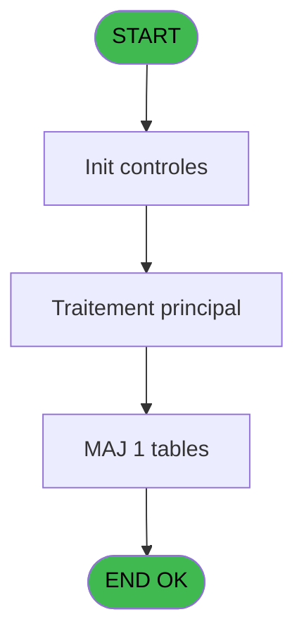
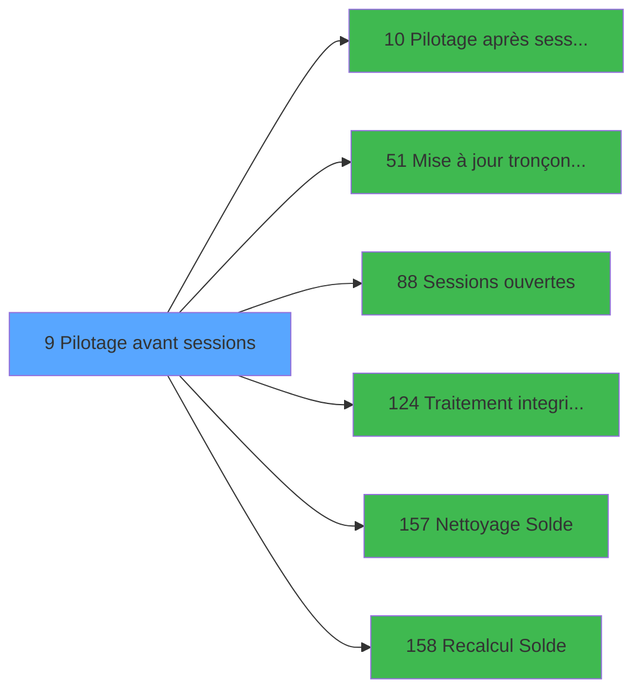

# VIL IDE 9 - Pilotage avant sessions

> **Analyse**: Phases 1-4 2026-02-03 00:56 -> 00:56 (36s) | Assemblage 00:56
> **Pipeline**: V7.2 Enrichi
> **Structure**: 4 onglets (Resume | Ecrans | Donnees | Connexions)

<!-- TAB:Resume -->

## 1. FICHE D'IDENTITE

| Attribut | Valeur |
|----------|--------|
| Projet | VIL |
| IDE Position | 9 |
| Nom Programme | Pilotage avant sessions |
| Fichier source | `Prg_9.xml` |
| Domaine metier | Caisse |
| Taches | 4 (0 ecrans visibles) |
| Tables modifiees | 1 |
| Programmes appeles | 6 |

## 2. DESCRIPTION FONCTIONNELLE

**Pilotage avant sessions** assure la gestion complete de ce processus, accessible depuis [Start (IDE 149)](VIL-IDE-149.md).

Le flux de traitement s'organise en **1 blocs fonctionnels** :

- **Traitement** (4 taches) : traitements metier divers

**Donnees modifiees** : 1 tables en ecriture (reseau_cloture___rec).

Detail : phases du traitement

#### Phase 1 : Traitement (4 taches)

- **9** - Pilotage
- **9.1** - Blocage Cloture v1
- **9.2** - Fermeture Session
- **9.3** - Blocage Cloture v1

Delegue a : [Pilotage après sessions (IDE 10)](VIL-IDE-10.md), [Mise à jour tronçons erronés (IDE 51)](VIL-IDE-51.md), [Sessions ouvertes (IDE 88)](VIL-IDE-88.md), [Traitement integrite base (IDE 124)](VIL-IDE-124.md), [Nettoyage Solde (IDE 157)](VIL-IDE-157.md)

#### Tables impactees

| Table | Operations | Role metier |
|-------|-----------|-------------|
| reseau_cloture___rec | **W** (2 usages) | Donnees reseau/cloture |

## 3. BLOCS FONCTIONNELS

### 3.1 Traitement (4 taches)

Traitements internes.

---

#### 9 - Pilotage

**Role** : Traitement : Pilotage.

3 sous-taches directes

| Tache | Nom | Bloc |
|-------|-----|------|
| [9.1](#t2) | Blocage Cloture v1 | Traitement |
| [9.2](#t3) | Fermeture Session | Traitement |
| [9.3](#t9) | Blocage Cloture v1 | Traitement |

**Delegue a** : [Pilotage après sessions (IDE 10)](VIL-IDE-10.md), [Mise à jour tronçons erronés (IDE 51)](VIL-IDE-51.md), [Sessions ouvertes (IDE 88)](VIL-IDE-88.md)

---

#### 9.1 - Blocage Cloture v1

**Role** : Traitement : Blocage Cloture v1.
**Delegue a** : [Pilotage après sessions (IDE 10)](VIL-IDE-10.md), [Mise à jour tronçons erronés (IDE 51)](VIL-IDE-51.md), [Sessions ouvertes (IDE 88)](VIL-IDE-88.md)

---

#### 9.2 - Fermeture Session

**Role** : Traitement : Fermeture Session.
**Variables liees** : E (W0 existe session), F (W0 sessions ouvertes), G (W0 nb sessions ouvertes)
**Delegue a** : [Pilotage après sessions (IDE 10)](VIL-IDE-10.md), [Mise à jour tronçons erronés (IDE 51)](VIL-IDE-51.md), [Sessions ouvertes (IDE 88)](VIL-IDE-88.md)

---

#### 9.3 - Blocage Cloture v1

**Role** : Traitement : Blocage Cloture v1.
**Delegue a** : [Pilotage après sessions (IDE 10)](VIL-IDE-10.md), [Mise à jour tronçons erronés (IDE 51)](VIL-IDE-51.md), [Sessions ouvertes (IDE 88)](VIL-IDE-88.md)

## 5. REGLES METIER

*(Aucune regle metier identifiee)*

## 6. CONTEXTE

- **Appele par**: [Start (IDE 149)](VIL-IDE-149.md)
- **Appelle**: 6 programmes | **Tables**: 10 (W:1 R:2 L:7) | **Taches**: 4 | **Expressions**: 22

<!-- TAB:Ecrans -->

## 8. ECRANS

*(Programme sans ecran visible)*

## 9. NAVIGATION

### 9.3 Structure hierarchique (4 taches)

| Position | Tache | Type | Dimensions | Bloc |
|----------|-------|------|------------|------|
| **9.1** | [**Pilotage** (9)](#t1) | MDI | - | Traitement |
| 9.1.1 | [Blocage Cloture v1 (9.1)](#t2) | MDI | - | |
| 9.1.2 | [Fermeture Session (9.2)](#t3) | MDI | - | |
| 9.1.3 | [Blocage Cloture v1 (9.3)](#t9) | MDI | - | |

### 9.4 Algorigramme

> **Legende**: Vert = START/END OK | Rouge = END KO | Bleu = Decisions
> *Algorigramme auto-genere. Utiliser `/algorigramme` pour une synthese metier detaillee.*

<!-- TAB:Donnees -->

## 10. TABLES

### Tables utilisees (10)

| ID | Nom | Description | Type | R | W | L | Usages |
|----|-----|-------------|------|---|---|---|--------|
| 23 | reseau_cloture___rec | Donnees reseau/cloture | DB |   | **W** |   | 2 |
| 63 | parametres___par |  | DB | R |   |   | 1 |
| 69 | initialisation___ini |  | DB |   |   | L | 1 |
| 70 | date_comptable___dat |  | DB |   |   | L | 1 |
| 122 | unilateral_bilateral |  | DB |   |   | L | 1 |
| 213 | suivi_cloture | Donnees reseau/cloture | DB |   |   | L | 1 |
| 246 | histo_sessions_caisse | Sessions de caisse | DB | R |   |   | 1 |
| 348 | log_cloture_auto | Donnees reseau/cloture | DB |   |   | L | 1 |
| 351 | sessions_ouvertes | Sessions de caisse | DB |   |   | L | 1 |
| 697 | droits_applications | Droits operateur | DB |   |   | L | 1 |

### Colonnes par table (3 / 3 tables avec colonnes identifiees)

Table 23 - reseau_cloture___rec (**W**) - 2 usages

*Table utilisee uniquement en Link ou aucune colonne Real identifiee dans le DataView.*

Table 63 - parametres___par (R) - 1 usages

| Lettre | Variable | Acces | Type |
|--------|----------|-------|------|
| A | Param N° Term coffre2 | R | Numeric |
| B | Param Hostname coffre2 | R | Unicode |
| C | Param Host courant coffre2 ? | R | Logical |
| D | Param Sortie Interdite | R | Logical |
| E | W0 existe session | R | Logical |
| F | W0 sessions ouvertes | R | Logical |
| G | W0 nb sessions ouvertes | R | Numeric |
| H | W0 societe | R | Alpha |
| I | W0 masque montant | R | Alpha |
| J | W0 abandon | R | Logical |
| K | W0 compte total | R | Numeric |
| L | W0 compte monnaie | R | Numeric |
| M | W0 compte produit | R | Numeric |
| N | W0 compte carte | R | Numeric |
| O | W0 compte cheque | R | Numeric |
| P | W0 compte od | R | Numeric |
| Q | W0 compte nbre devises | R | Numeric |
| R | W0 Compte Verst Retrait | R | Alpha |
| S | W0 Erreur Restructuration | R | Numeric |

Table 246 - histo_sessions_caisse (R) - 1 usages

| Lettre | Variable | Acces | Type |
|--------|----------|-------|------|
| F | W0 sessions ouvertes | R | Logical |
| G | W0 nb sessions ouvertes | R | Numeric |

## 11. VARIABLES

### 11.1 Variables de travail (15)

Variables internes au programme.

| Lettre | Nom | Type | Usage dans |
|--------|-----|------|-----------|
| E | W0 existe session | Logical | [9.2](#t3) |
| F | W0 sessions ouvertes | Logical | 2x calcul interne |
| G | W0 nb sessions ouvertes | Numeric | - |
| H | W0 societe | Alpha | - |
| I | W0 masque montant | Alpha | - |
| J | W0 abandon | Logical | - |
| K | W0 compte total | Numeric | - |
| L | W0 compte monnaie | Numeric | - |
| M | W0 compte produit | Numeric | - |
| N | W0 compte carte | Numeric | - |
| O | W0 compte cheque | Numeric | - |
| P | W0 compte od | Numeric | - |
| Q | W0 compte nbre devises | Numeric | - |
| R | W0 Compte Verst Retrait | Alpha | - |
| S | W0 Erreur Restructuration | Numeric | 1x calcul interne |

### 11.2 Autres (4)

Variables diverses.

| Lettre | Nom | Type | Usage dans |
|--------|-----|------|-----------|
| A | Param N° Term coffre2 | Numeric | - |
| B | Param Hostname coffre2 | Unicode | - |
| C | Param Host courant coffre2 ? | Logical | - |
| D | Param Sortie Interdite | Logical | 2x refs |

Toutes les 19 variables (liste complete)

| Cat | Lettre | Nom Variable | Type |
|-----|--------|--------------|------|
| W0 | **E** | W0 existe session | Logical |
| W0 | **F** | W0 sessions ouvertes | Logical |
| W0 | **G** | W0 nb sessions ouvertes | Numeric |
| W0 | **H** | W0 societe | Alpha |
| W0 | **I** | W0 masque montant | Alpha |
| W0 | **J** | W0 abandon | Logical |
| W0 | **K** | W0 compte total | Numeric |
| W0 | **L** | W0 compte monnaie | Numeric |
| W0 | **M** | W0 compte produit | Numeric |
| W0 | **N** | W0 compte carte | Numeric |
| W0 | **O** | W0 compte cheque | Numeric |
| W0 | **P** | W0 compte od | Numeric |
| W0 | **Q** | W0 compte nbre devises | Numeric |
| W0 | **R** | W0 Compte Verst Retrait | Alpha |
| W0 | **S** | W0 Erreur Restructuration | Numeric |
| Autre | **A** | Param N° Term coffre2 | Numeric |
| Autre | **B** | Param Hostname coffre2 | Unicode |
| Autre | **C** | Param Host courant coffre2 ? | Logical |
| Autre | **D** | Param Sortie Interdite | Logical |

## 12. EXPRESSIONS

**22 / 22 expressions decodees (100%)**

### 12.1 Repartition par type

| Type | Expressions | Regles |
|------|-------------|--------|
| CALCULATION | 1 | 0 |
| CONSTANTE | 6 | 0 |
| DATE | 1 | 0 |
| OTHER | 7 | 0 |
| NEGATION | 2 | 0 |
| CAST_LOGIQUE | 1 | 0 |
| CONDITION | 1 | 0 |
| REFERENCE_VG | 1 | 0 |
| FORMAT | 1 | 0 |
| STRING | 1 | 0 |

### 12.2 Expressions cles par type

#### CALCULATION (1 expressions)

| Type | IDE | Expression | Regle |
|------|-----|------------|-------|
| CALCULATION | 6 | `[AG]+1` | - |

#### CONSTANTE (6 expressions)

| Type | IDE | Expression | Regle |
|------|-----|------------|-------|
| CONSTANTE | 5 | `9` | - |
| CONSTANTE | 13 | `0` | - |
| CONSTANTE | 18 | `'O'` | - |
| CONSTANTE | 1 | `'C'` | - |
| CONSTANTE | 3 | `'CAISSE'` | - |
| ... | | *+1 autres* | |

#### DATE (1 expressions)

| Type | IDE | Expression | Regle |
|------|-----|------------|-------|
| DATE | 10 | `Date ()` | - |

#### OTHER (7 expressions)

| Type | IDE | Expression | Regle |
|------|-----|------------|-------|
| OTHER | 15 | `Param Sortie Interdite [D]` | - |
| OTHER | 17 | `W0 existe session [E]` | - |
| OTHER | 19 | `SetParam('SOCIETE',W0 sessions ouvertes [F])` | - |
| OTHER | 12 | `W0 Erreur Restructuration [S]` | - |
| OTHER | 2 | `W0 sessions ouvertes [F]` | - |
| ... | | *+2 autres* | |

#### NEGATION (2 expressions)

| Type | IDE | Expression | Regle |
|------|-----|------------|-------|
| NEGATION | 21 | `NOT VG39` | - |
| NEGATION | 14 | `NOT (Param Sortie Interdite [D])` | - |

#### CAST_LOGIQUE (1 expressions)

| Type | IDE | Expression | Regle |
|------|-----|------------|-------|
| CAST_LOGIQUE | 16 | `'TRUE'LOG` | - |

#### CONDITION (1 expressions)

| Type | IDE | Expression | Regle |
|------|-----|------------|-------|
| CONDITION | 20 | `Translate('%club_test%')<>'T'` | - |

#### REFERENCE_VG (1 expressions)

| Type | IDE | Expression | Regle |
|------|-----|------------|-------|
| REFERENCE_VG | 22 | `VG39` | - |

#### FORMAT (1 expressions)

| Type | IDE | Expression | Regle |
|------|-----|------------|-------|
| FORMAT | 8 | `'N15'&IF([AA]>0,'.'&Trim(Str([AA],'1')),'')&'CZ'` | - |

#### STRING (1 expressions)

| Type | IDE | Expression | Regle |
|------|-----|------------|-------|
| STRING | 9 | `Str ([AC],'9')` | - |

### 12.3 Toutes les expressions (22)

Voir les 22 expressions

#### CALCULATION (1)

| IDE | Expression Decodee |
|-----|-------------------|
| 6 | `[AG]+1` |

#### CONSTANTE (6)

| IDE | Expression Decodee |
|-----|-------------------|
| 1 | `'C'` |
| 3 | `'CAISSE'` |
| 4 | `2` |
| 5 | `9` |
| 13 | `0` |
| 18 | `'O'` |

#### DATE (1)

| IDE | Expression Decodee |
|-----|-------------------|
| 10 | `Date ()` |

#### OTHER (7)

| IDE | Expression Decodee |
|-----|-------------------|
| 2 | `W0 sessions ouvertes [F]` |
| 7 | `SetParam ('DEVISELOCAL_IN','N')` |
| 11 | `Time ()` |
| 12 | `W0 Erreur Restructuration [S]` |
| 15 | `Param Sortie Interdite [D]` |
| 17 | `W0 existe session [E]` |
| 19 | `SetParam('SOCIETE',W0 sessions ouvertes [F])` |

#### NEGATION (2)

| IDE | Expression Decodee |
|-----|-------------------|
| 14 | `NOT (Param Sortie Interdite [D])` |
| 21 | `NOT VG39` |

#### CAST_LOGIQUE (1)

| IDE | Expression Decodee |
|-----|-------------------|
| 16 | `'TRUE'LOG` |

#### CONDITION (1)

| IDE | Expression Decodee |
|-----|-------------------|
| 20 | `Translate('%club_test%')<>'T'` |

#### REFERENCE_VG (1)

| IDE | Expression Decodee |
|-----|-------------------|
| 22 | `VG39` |

#### FORMAT (1)

| IDE | Expression Decodee |
|-----|-------------------|
| 8 | `'N15'&IF([AA]>0,'.'&Trim(Str([AA],'1')),'')&'CZ'` |

#### STRING (1)

| IDE | Expression Decodee |
|-----|-------------------|
| 9 | `Str ([AC],'9')` |

<!-- TAB:Connexions -->

## 13. GRAPHE D'APPELS

### 13.1 Chaine depuis Main (Callers)

Main -> ... -> [Start (IDE 149)](VIL-IDE-149.md) -> **Pilotage avant sessions (IDE 9)**

### 13.2 Callers

| IDE | Nom Programme | Nb Appels |
|-----|---------------|-----------|
| [149](VIL-IDE-149.md) | Start | 1 |

### 13.3 Callees (programmes appeles)

### 13.4 Detail Callees avec contexte

| IDE | Nom Programme | Appels | Contexte |
|-----|---------------|--------|----------|
| [10](VIL-IDE-10.md) | Pilotage après sessions | 1 | Gestion session |
| [51](VIL-IDE-51.md) | Mise à jour tronçons erronés | 1 | Mise a jour donnees |
| [88](VIL-IDE-88.md) | Sessions ouvertes | 1 | Gestion session |
| [124](VIL-IDE-124.md) | Traitement integrite base | 1 | Sous-programme |
| [157](VIL-IDE-157.md) | Nettoyage Solde | 1 | Verification solde |
| [158](VIL-IDE-158.md) | Recalcul Solde | 1 | Calcul de donnees |

## 14. RECOMMANDATIONS MIGRATION

### 14.1 Profil du programme

| Metrique | Valeur | Impact migration |
|----------|--------|-----------------|
| Lignes de logique | 178 | Programme compact |
| Expressions | 22 | Peu de logique |
| Tables WRITE | 1 | Impact faible |
| Sous-programmes | 6 | Dependances moderees |
| Ecrans visibles | 0 | Ecran unique ou traitement batch |
| Code desactive | 0% (0 / 178) | Code sain |
| Regles metier | 0 | Pas de regle identifiee |

### 14.2 Plan de migration par bloc

#### Traitement (4 taches: 0 ecran, 4 traitements)

- **Strategie** : 4 service(s) backend injectable(s) (Domain Services).
- 6 sous-programme(s) a migrer ou a reutiliser depuis les services existants.
- Decomposer les taches en services unitaires testables.

### 14.3 Dependances critiques

| Dependance | Type | Appels | Impact |
|------------|------|--------|--------|
| reseau_cloture___rec | Table WRITE (Database) | 2x | Schema + repository |
| [Traitement integrite base (IDE 124)](VIL-IDE-124.md) | Sous-programme | 1x | Normale - Sous-programme |
| [Nettoyage Solde (IDE 157)](VIL-IDE-157.md) | Sous-programme | 1x | Normale - Verification solde |
| [Recalcul Solde (IDE 158)](VIL-IDE-158.md) | Sous-programme | 1x | Normale - Calcul de donnees |
| [Pilotage après sessions (IDE 10)](VIL-IDE-10.md) | Sous-programme | 1x | Normale - Gestion session |
| [Mise à jour tronçons erronés (IDE 51)](VIL-IDE-51.md) | Sous-programme | 1x | Normale - Mise a jour donnees |
| [Sessions ouvertes (IDE 88)](VIL-IDE-88.md) | Sous-programme | 1x | Normale - Gestion session |

---
*Spec DETAILED generee par Pipeline V7.2 - 2026-02-03 00:56*
