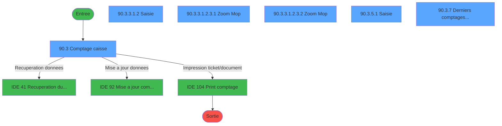
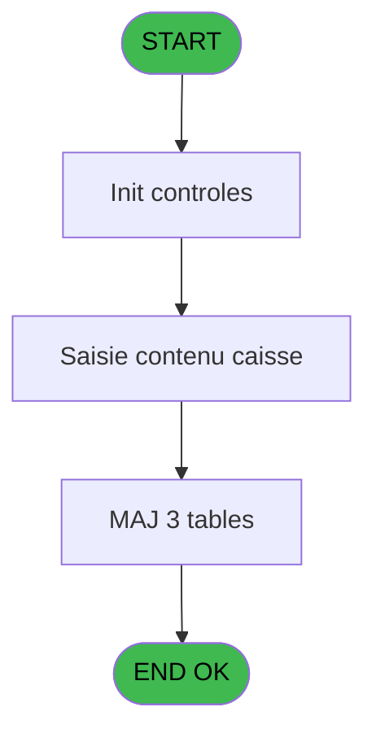
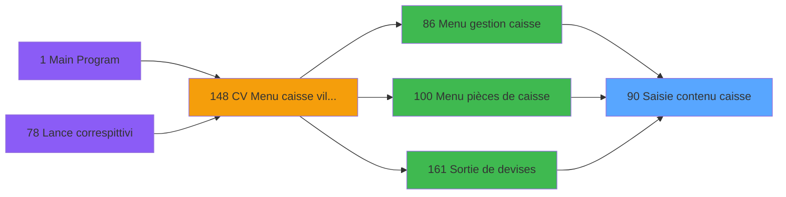
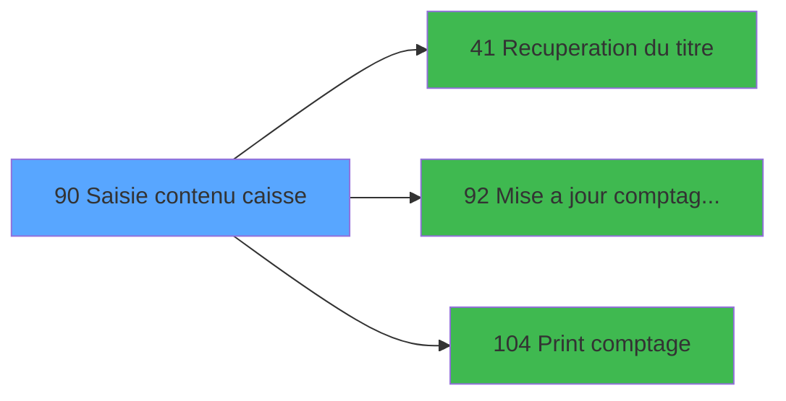

# VIL IDE 90 - Saisie contenu caisse

> **Analyse**: Phases 1-4 2026-02-03 09:16 -> 09:17 (19s) | Assemblage 09:17
> **Pipeline**: V7.2 Enrichi
> **Structure**: 4 onglets (Resume | Ecrans | Donnees | Connexions)

<!-- TAB:Resume -->

## 1. FICHE D'IDENTITE

| Attribut | Valeur |
|----------|--------|
| Projet | VIL |
| IDE Position | 90 |
| Nom Programme | Saisie contenu caisse |
| Fichier source | `Prg_90.xml` |
| Domaine metier | Caisse |
| Taches | 75 (6 ecrans visibles) |
| Tables modifiees | 3 |
| Programmes appeles | 3 |

## 2. DESCRIPTION FONCTIONNELLE

**Saisie contenu caisse** assure la gestion complete de ce processus, accessible depuis [Menu gestion caisse (IDE 86)](VIL-IDE-86.md), [Sortie de devises (IDE 161)](VIL-IDE-161.md), [Menu pièces de caisse (IDE 100)](VIL-IDE-100.md).

Le flux de traitement s'organise en **7 blocs fonctionnels** :

- **Traitement** (41 taches) : traitements metier divers
- **Saisie** (19 taches) : ecrans de saisie utilisateur (formulaires, champs, donnees)
- **Reglement** (6 taches) : gestion des moyens de paiement et reglements
- **Calcul** (4 taches) : calculs de montants, stocks ou compteurs
- **Creation** (2 taches) : insertion d'enregistrements en base (mouvements, prestations)
- **Initialisation** (2 taches) : reinitialisation d'etats et de variables de travail
- **Validation** (1 tache) : controles et verifications de coherence

**Donnees modifiees** : 3 tables en ecriture (saisie_ele_detail_cloture, saisie_transaction, situation_devise).

Detail : phases du traitement

#### Phase 1 : Saisie (19 taches)

- **90** - Saisie contenu caisse **[[ECRAN]](#ecran-t1)**
- **90.1** - RAZ saisie
- **90.1.1** - Saisie
- **90.1.2** - Saisie Montant
- **90.1.3** - Saisie Devise
- **90.2** - Initialisation saisie
- **90.3.3** - Saisie sans PU
- **90.3.3.1.2** - Saisie **[[ECRAN]](#ecran-t24)**
- **90.3.5** - Saisie devises
- **90.3.5.1** - Saisie **[[ECRAN]](#ecran-t43)**
- **90.4.1** - RAZ saisie
- **90.4.1.1** - Saisie
- **90.4.1.2** - Saisie Montant
- **90.4.1.3** - Saisie Devise
- **90.4.7.1** - Saisie
- **90.5.1** - RAZ saisie
- **90.5.1.1** - Saisie
- **90.5.1.2** - Saisie Montant
- **90.5.1.3** - Saisie Devise

#### Phase 2 : Traitement (41 taches)

- **90.2.1** - Monnaie
- **90.2.2** - Cartes chèques
- **90.2.3** - Articles
- **90.2.4** - Cigarettes
- **90.2.5** - OD devises
- **90.3.1** - dernier solde PMS
- **90.3.2** - Recup prec possible
- **90.3.2.1** - Last Chrono
- **90.3.2.2** - Lect courant
- **90.3.2.3** - Lect histo
- **90.3.3.1** - Pilotage
- **90.3.3.1.1** - Total
- **90.3.3.1.2.1** - Chrono suivant
- **90.3.3.1.2.2** - Efface tout
- **90.3.3.1.3** - Efface tout
- **90.3.4** - Gener devises
- **90.3.4.1** - Gener devises
- **90.3.4.2** - Gener devises
- **90.3.5.1.1** - Efface tout
- **90.3.5.2** - Effacer tout
- **90.3.5.3** - Nombre
- **90.4** - Recup Precedent
- **90.4.2** - Last Chrono
- **90.4.3** - Lecture Histo
- **90.4.4** - Lect Histo Mont
- **90.4.5** - Lect Histo Devise
- **90.4.6** - Couleurs
- **90.4.7.2** - Montant
- **90.4.7.3** - Devises
- **90.5** - Recup Precedent
- **90.5.2** - Last Chrono
- **90.5.3** - Lecture Histo
- **90.5.4** - Lect Histo Mont
- **90.6** - Repartition
- **90.7** - Nbre devises
- **90.8** - Recup prec possible
- **90.8.1** - Last Chrono
- **90.8.2** - Lect courant
- **90.8.3** - Lect histo
- **90.9** - Nombre
- **90.3.8** - Nombre

Delegue a : [Recuperation du titre (IDE 41)](VIL-IDE-41.md)

#### Phase 3 : Reglement (6 taches)

- **90.2.6** - Init MOP
- **90.2.6.1** - Init MOP
- **90.2.6.2** - Init MOP
- **90.3.3.1.2.3** - Zoom Mop **[[ECRAN]](#ecran-t30)**
- **90.3.3.1.2.3.1** - Zoom Mop **[[ECRAN]](#ecran-t31)**
- **90.3.3.1.2.3.2** - Zoom Mop **[[ECRAN]](#ecran-t32)**

#### Phase 4 : Calcul (4 taches)

- **90.3** - Comptage caisse **[[ECRAN]](#ecran-t15)**
- **90.3.3.1.4** - Calcul chrono
- **90.3.3.1.6** - Recalcule Montant
- **90.3.7** - Derniers comptages coffre **[[ECRAN]](#ecran-t55)**

Delegue a : [Mise a jour comptage caisse (IDE 92)](VIL-IDE-92.md)

#### Phase 5 : Initialisation (2 taches)

- **90.3.3.1.5** - RAZ Ligne zero
- **90.4.7** - Raz 1ere ouverture

#### Phase 6 : Creation (2 taches)

- **90.3.4.1.1** - Creation
- **90.3.4.2.1** - Creation

#### Phase 7 : Validation (1 tache)

- **90.3.6** - Validation

#### Tables impactees

| Table | Operations | Role metier |
|-------|-----------|-------------|
| saisie_ele_detail_cloture | R/**W**/L (18 usages) | Donnees reseau/cloture |
| situation_devise | **W**/L (15 usages) | Devises / taux de change |
| saisie_transaction | R/**W**/L (15 usages) |  |

## 3. BLOCS FONCTIONNELS

### 3.1 Saisie (19 taches)

L'operateur saisit les donnees de la transaction via 3 ecrans (Saisie contenu caisse, Saisie, Saisie).

---

#### 90 - Saisie contenu caisse [[ECRAN]](#ecran-t1)

**Role** : Tache d'orchestration : point d'entree du programme (19 sous-taches). Coordonne l'enchainement des traitements.
**Ecran** : 500 x 271 DLU (MDI) | [Voir mockup](#ecran-t1)

18 sous-taches directes

| Tache | Nom | Bloc |
|-------|-----|------|
| [90.1](#t2) | RAZ saisie | Saisie |
| [90.1.1](#t3) | Saisie | Saisie |
| [90.1.2](#t4) | Saisie Montant | Saisie |
| [90.1.3](#t5) | Saisie Devise | Saisie |
| [90.2](#t6) | Initialisation saisie | Saisie |
| [90.3.3](#t21) | Saisie sans PU | Saisie |
| [90.3.3.1.2](#t24) | Saisie **[[ECRAN]](#ecran-t24)** | Saisie |
| [90.3.5](#t42) | Saisie devises | Saisie |
| [90.3.5.1](#t43) | Saisie **[[ECRAN]](#ecran-t43)** | Saisie |
| [90.4.1](#t57) | RAZ saisie | Saisie |
| [90.4.1.1](#t58) | Saisie | Saisie |
| [90.4.1.2](#t59) | Saisie Montant | Saisie |
| [90.4.1.3](#t60) | Saisie Devise | Saisie |
| [90.4.7.1](#t67) | Saisie | Saisie |
| [90.5.1](#t71) | RAZ saisie | Saisie |
| [90.5.1.1](#t72) | Saisie | Saisie |
| [90.5.1.2](#t73) | Saisie Montant | Saisie |
| [90.5.1.3](#t74) | Saisie Devise | Saisie |

**Variables liees** : V (P. Saisie obligatoire), BJ (v. Saisie effectué?), I (Param Total caisse), J (Param Total caisse monnaie), K (Param Total caisse produits)

---

#### 90.1 - RAZ saisie

**Role** : Saisie des donnees : RAZ saisie.
**Variables liees** : V (P. Saisie obligatoire), BJ (v. Saisie effectué?), W (SortieSaisieCaisse)

---

#### 90.1.1 - Saisie

**Role** : Saisie des donnees : Saisie.
**Variables liees** : V (P. Saisie obligatoire), BJ (v. Saisie effectué?), W (SortieSaisieCaisse)

---

#### 90.1.2 - Saisie Montant

**Role** : Saisie des donnees : Saisie Montant.
**Variables liees** : V (P. Saisie obligatoire), BJ (v. Saisie effectué?), C (Param masque montant), W (SortieSaisieCaisse)

---

#### 90.1.3 - Saisie Devise

**Role** : Saisie des donnees : Saisie Devise.
**Variables liees** : V (P. Saisie obligatoire), BJ (v. Saisie effectué?), B (Param devise locale), O (Param Nbre devise), P (Mtt devises avant)

---

#### 90.2 - Initialisation saisie

**Role** : Saisie des donnees : Initialisation saisie.
**Variables liees** : V (P. Saisie obligatoire), BJ (v. Saisie effectué?), W (SortieSaisieCaisse)

---

#### 90.3.3 - Saisie sans PU

**Role** : Saisie des donnees : Saisie sans PU.
**Variables liees** : V (P. Saisie obligatoire), BJ (v. Saisie effectué?), W (SortieSaisieCaisse)

---

#### 90.3.3.1.2 - Saisie [[ECRAN]](#ecran-t24)

**Role** : Saisie des donnees : Saisie.
**Ecran** : 880 x 270 DLU (MDI) | [Voir mockup](#ecran-t24)
**Variables liees** : V (P. Saisie obligatoire), BJ (v. Saisie effectué?), W (SortieSaisieCaisse)

---

#### 90.3.5 - Saisie devises

**Role** : Saisie des donnees : Saisie devises.
**Variables liees** : V (P. Saisie obligatoire), BJ (v. Saisie effectué?), P (Mtt devises avant), Q (Mtt devises après), W (SortieSaisieCaisse)

---

#### 90.3.5.1 - Saisie [[ECRAN]](#ecran-t43)

**Role** : Saisie des donnees : Saisie.
**Ecran** : 880 x 270 DLU (MDI) | [Voir mockup](#ecran-t43)
**Variables liees** : V (P. Saisie obligatoire), BJ (v. Saisie effectué?), W (SortieSaisieCaisse)

---

#### 90.4.1 - RAZ saisie

**Role** : Saisie des donnees : RAZ saisie.
**Variables liees** : V (P. Saisie obligatoire), BJ (v. Saisie effectué?), W (SortieSaisieCaisse)

---

#### 90.4.1.1 - Saisie

**Role** : Saisie des donnees : Saisie.
**Variables liees** : V (P. Saisie obligatoire), BJ (v. Saisie effectué?), W (SortieSaisieCaisse)

---

#### 90.4.1.2 - Saisie Montant

**Role** : Saisie des donnees : Saisie Montant.
**Variables liees** : V (P. Saisie obligatoire), BJ (v. Saisie effectué?), C (Param masque montant), W (SortieSaisieCaisse)

---

#### 90.4.1.3 - Saisie Devise

**Role** : Saisie des donnees : Saisie Devise.
**Variables liees** : V (P. Saisie obligatoire), BJ (v. Saisie effectué?), B (Param devise locale), O (Param Nbre devise), P (Mtt devises avant)

---

#### 90.4.7.1 - Saisie

**Role** : Saisie des donnees : Saisie.
**Variables liees** : V (P. Saisie obligatoire), BJ (v. Saisie effectué?), W (SortieSaisieCaisse)

---

#### 90.5.1 - RAZ saisie

**Role** : Saisie des donnees : RAZ saisie.
**Variables liees** : V (P. Saisie obligatoire), BJ (v. Saisie effectué?), W (SortieSaisieCaisse)

---

#### 90.5.1.1 - Saisie

**Role** : Saisie des donnees : Saisie.
**Variables liees** : V (P. Saisie obligatoire), BJ (v. Saisie effectué?), W (SortieSaisieCaisse)

---

#### 90.5.1.2 - Saisie Montant

**Role** : Saisie des donnees : Saisie Montant.
**Variables liees** : V (P. Saisie obligatoire), BJ (v. Saisie effectué?), C (Param masque montant), W (SortieSaisieCaisse)

---

#### 90.5.1.3 - Saisie Devise

**Role** : Saisie des donnees : Saisie Devise.
**Variables liees** : V (P. Saisie obligatoire), BJ (v. Saisie effectué?), B (Param devise locale), O (Param Nbre devise), P (Mtt devises avant)

### 3.2 Traitement (41 taches)

Traitements internes.

---

#### 90.2.1 - Monnaie

**Role** : Traitement : Monnaie.
**Variables liees** : J (Param Total caisse monnaie), Y (TotalMonnaie)

---

#### 90.2.2 - Cartes chèques

**Role** : Traitement : Cartes chèques.
**Variables liees** : L (Param Total caisse cartes), BF (Ordre cartes)

---

#### 90.2.3 - Articles

**Role** : Traitement : Articles.

---

#### 90.2.4 - Cigarettes

**Role** : Traitement : Cigarettes.
**Variables liees** : BC (Ordre cigarettes)

---

#### 90.2.5 - OD devises

**Role** : Traitement : OD devises.
**Variables liees** : P (Mtt devises avant), Q (Mtt devises après)

---

#### 90.3.1 - dernier solde PMS

**Role** : Consultation/chargement : dernier solde PMS.

---

#### 90.3.2 - Recup prec possible

**Role** : Consultation/chargement : Recup prec possible.
**Variables liees** : Z (RecuperationPrecedent), BA (RecuperationStandard), BI (Recup precedent possible)

---

#### 90.3.2.1 - Last Chrono

**Role** : Traitement : Last Chrono.
**Variables liees** : E (Param chrono session), F (Param chrono histo)

---

#### 90.3.2.2 - Lect courant

**Role** : Traitement : Lect courant.

---

#### 90.3.2.3 - Lect histo

**Role** : Traitement : Lect histo.
**Variables liees** : F (Param chrono histo)

---

#### 90.3.3.1 - Pilotage

**Role** : Traitement : Pilotage.

---

#### 90.3.3.1.1 - Total

**Role** : Traitement : Total.
**Variables liees** : I (Param Total caisse), J (Param Total caisse monnaie), K (Param Total caisse produits), L (Param Total caisse cartes), M (Param Total caisse cheque)

---

#### 90.3.3.1.2.1 - Chrono suivant

**Role** : Traitement : Chrono suivant.
**Variables liees** : E (Param chrono session), F (Param chrono histo)

---

#### 90.3.3.1.2.2 - Efface tout

**Role** : Traitement : Efface tout.

---

#### 90.3.3.1.3 - Efface tout

**Role** : Traitement : Efface tout.

---

#### 90.3.4 - Gener devises

**Role** : Traitement : Gener devises.
**Variables liees** : P (Mtt devises avant), Q (Mtt devises après)

---

#### 90.3.4.1 - Gener devises

**Role** : Traitement : Gener devises.
**Variables liees** : P (Mtt devises avant), Q (Mtt devises après)

---

#### 90.3.4.2 - Gener devises

**Role** : Traitement : Gener devises.
**Variables liees** : P (Mtt devises avant), Q (Mtt devises après)

---

#### 90.3.5.1.1 - Efface tout

**Role** : Traitement : Efface tout.

---

#### 90.3.5.2 - Effacer tout

**Role** : Traitement : Effacer tout.

---

#### 90.3.5.3 - Nombre

**Role** : Calcul : Nombre.

---

#### 90.4 - Recup Precedent

**Role** : Consultation/chargement : Recup Precedent.
**Variables liees** : Z (RecuperationPrecedent), BA (RecuperationStandard), BI (Recup precedent possible)

---

#### 90.4.2 - Last Chrono

**Role** : Traitement : Last Chrono.
**Variables liees** : E (Param chrono session), F (Param chrono histo)

---

#### 90.4.3 - Lecture Histo

**Role** : Traitement : Lecture Histo.
**Variables liees** : F (Param chrono histo)

---

#### 90.4.4 - Lect Histo Mont

**Role** : Traitement : Lect Histo Mont.
**Variables liees** : C (Param masque montant), F (Param chrono histo)

---

#### 90.4.5 - Lect Histo Devise

**Role** : Traitement : Lect Histo Devise.
**Variables liees** : B (Param devise locale), F (Param chrono histo), O (Param Nbre devise), P (Mtt devises avant), Q (Mtt devises après)

---

#### 90.4.6 - Couleurs

**Role** : Traitement : Couleurs.

---

#### 90.4.7.2 - Montant

**Role** : Traitement : Montant.
**Variables liees** : C (Param masque montant)

---

#### 90.4.7.3 - Devises

**Role** : Traitement : Devises.
**Variables liees** : P (Mtt devises avant), Q (Mtt devises après)

---

#### 90.5 - Recup Precedent

**Role** : Consultation/chargement : Recup Precedent.
**Variables liees** : Z (RecuperationPrecedent), BA (RecuperationStandard), BI (Recup precedent possible)

---

#### 90.5.2 - Last Chrono

**Role** : Traitement : Last Chrono.
**Variables liees** : E (Param chrono session), F (Param chrono histo)

---

#### 90.5.3 - Lecture Histo

**Role** : Traitement : Lecture Histo.
**Variables liees** : F (Param chrono histo)

---

#### 90.5.4 - Lect Histo Mont

**Role** : Traitement : Lect Histo Mont.
**Variables liees** : C (Param masque montant), F (Param chrono histo)

---

#### 90.6 - Repartition

**Role** : Traitement : Repartition.

---

#### 90.7 - Nbre devises

**Role** : Traitement : Nbre devises.
**Variables liees** : O (Param Nbre devise), P (Mtt devises avant), Q (Mtt devises après)

---

#### 90.8 - Recup prec possible

**Role** : Consultation/chargement : Recup prec possible.
**Variables liees** : Z (RecuperationPrecedent), BA (RecuperationStandard), BI (Recup precedent possible)

---

#### 90.8.1 - Last Chrono

**Role** : Traitement : Last Chrono.
**Variables liees** : E (Param chrono session), F (Param chrono histo)

---

#### 90.8.2 - Lect courant

**Role** : Traitement : Lect courant.

---

#### 90.8.3 - Lect histo

**Role** : Traitement : Lect histo.
**Variables liees** : F (Param chrono histo)

---

#### 90.9 - Nombre

**Role** : Calcul : Nombre.

---

#### 90.3.8 - Nombre

**Role** : Calcul : Nombre.

### 3.3 Reglement (6 taches)

Gestion des moyens de paiement : 6 taches de reglement.

---

#### 90.2.6 - Init MOP

**Role** : Reinitialisation : Init MOP.

---

#### 90.2.6.1 - Init MOP

**Role** : Reinitialisation : Init MOP.

---

#### 90.2.6.2 - Init MOP

**Role** : Reinitialisation : Init MOP.

---

#### 90.3.3.1.2.3 - Zoom Mop [[ECRAN]](#ecran-t30)

**Role** : Selection par l'operateur : Zoom Mop.
**Ecran** : 482 x 184 DLU (MDI) | [Voir mockup](#ecran-t30)

---

#### 90.3.3.1.2.3.1 - Zoom Mop [[ECRAN]](#ecran-t31)

**Role** : Selection par l'operateur : Zoom Mop.
**Ecran** : 482 x 184 DLU (MDI) | [Voir mockup](#ecran-t31)

---

#### 90.3.3.1.2.3.2 - Zoom Mop [[ECRAN]](#ecran-t32)

**Role** : Selection par l'operateur : Zoom Mop.
**Ecran** : 482 x 184 DLU (MDI) | [Voir mockup](#ecran-t32)

### 3.4 Calcul (4 taches)

Calculs metier : montants, stocks, compteurs.

---

#### 90.3 - Comptage caisse [[ECRAN]](#ecran-t15)

**Role** : Traitement : Comptage caisse.
**Ecran** : 1040 x 271 DLU (MDI) | [Voir mockup](#ecran-t15)
**Variables liees** : I (Param Total caisse), J (Param Total caisse monnaie), K (Param Total caisse produits), L (Param Total caisse cartes), M (Param Total caisse cheque)
**Delegue a** : [Mise a jour comptage caisse (IDE 92)](VIL-IDE-92.md), [Print comptage (IDE 104)](VIL-IDE-104.md)

---

#### 90.3.3.1.4 - Calcul chrono

**Role** : Calcul : Calcul chrono.
**Variables liees** : E (Param chrono session), F (Param chrono histo)
**Delegue a** : [Mise a jour comptage caisse (IDE 92)](VIL-IDE-92.md)

---

#### 90.3.3.1.6 - Recalcule Montant

**Role** : Calcul : Recalcule Montant.
**Variables liees** : C (Param masque montant)
**Delegue a** : [Mise a jour comptage caisse (IDE 92)](VIL-IDE-92.md)

---

#### 90.3.7 - Derniers comptages coffre [[ECRAN]](#ecran-t55)

**Role** : Traitement : Derniers comptages coffre.
**Ecran** : 640 x 0 DLU (MDI) | [Voir mockup](#ecran-t55)
**Delegue a** : [Mise a jour comptage caisse (IDE 92)](VIL-IDE-92.md)

### 3.5 Initialisation (2 taches)

Reinitialisation d'etats et variables de travail.

---

#### 90.3.3.1.5 - RAZ Ligne zero

**Role** : Reinitialisation : RAZ Ligne zero.

---

#### 90.4.7 - Raz 1ere ouverture

**Role** : Reinitialisation : Raz 1ere ouverture.

### 3.6 Creation (2 taches)

Insertion de nouveaux enregistrements en base.

---

#### 90.3.4.1.1 - Creation

**Role** : Creation d'enregistrement : Creation.

---

#### 90.3.4.2.1 - Creation

**Role** : Creation d'enregistrement : Creation.

### 3.7 Validation (1 tache)

Controles de coherence : 1 tache verifie les donnees et conditions.

---

#### 90.3.6 - Validation

**Role** : Verification : Validation.
**Variables liees** : G (Param date validation), H (Param time validation)

## 5. REGLES METIER

*(Aucune regle metier identifiee)*

## 6. CONTEXTE

- **Appele par**: [Menu gestion caisse (IDE 86)](VIL-IDE-86.md), [Sortie de devises (IDE 161)](VIL-IDE-161.md), [Menu pièces de caisse (IDE 100)](VIL-IDE-100.md)
- **Appelle**: 3 programmes | **Tables**: 20 (W:3 R:12 L:12) | **Taches**: 75 | **Expressions**: 11

<!-- TAB:Ecrans -->

## 8. ECRANS

### 8.1 Forms visibles (6 / 75)

| # | Position | Tache | Nom | Type | Largeur | Hauteur | Bloc |
|---|----------|-------|-----|------|---------|---------|------|
| 1 | 90.4 | 90.3 | Comptage caisse | MDI | 1040 | 271 | Calcul |
| 2 | 90.4.4.1.2 | 90.3.3.1.2 | Saisie | MDI | 880 | 270 | Saisie |
| 3 | 90.4.4.1.2.3.1 | 90.3.3.1.2.3.1 | Zoom Mop | MDI | 482 | 184 | Reglement |
| 4 | 90.4.4.1.2.3.2 | 90.3.3.1.2.3.2 | Zoom Mop | MDI | 482 | 184 | Reglement |
| 5 | 90.4.6.1 | 90.3.5.1 | Saisie | MDI | 880 | 270 | Saisie |
| 6 | 90.4.8 | 90.3.7 | Derniers comptages coffre | MDI | 640 | 0 | Calcul |

### 8.2 Mockups Ecrans

---

#### 90.4 - Comptage caisse
**Tache** : [90.3](#t15) | **Type** : MDI | **Dimensions** : 1040 x 271 DLU
**Bloc** : Calcul | **Titre IDE** : Comptage caisse

<!-- FORM-DATA:
{
    "width":  1040,
    "vFactor":  8,
    "type":  "MDI",
    "hFactor":  8,
    "controls":  [
                     {
                         "x":  8,
                         "type":  "label",
                         "var":  "",
                         "y":  1,
                         "w":  1031,
                         "fmt":  "",
                         "name":  "",
                         "h":  19,
                         "color":  "",
                         "text":  "",
                         "parent":  null
                     },
                     {
                         "x":  341,
                         "type":  "label",
                         "var":  "",
                         "y":  1,
                         "w":  359,
                         "fmt":  "",
                         "name":  "",
                         "h":  18,
                         "color":  "142",
                         "text":  "Saisie de la caisse",
                         "parent":  null
                     },
                     {
                         "x":  204,
                         "type":  "table",
                         "var":  "",
                         "name":  "",
                         "titleH":  11,
                         "color":  "110",
                         "w":  640,
                         "y":  23,
                         "fmt":  "",
                         "parent":  null,
                         "text":  "",
                         "rowH":  12,
                         "h":  177,
                         "cols":  [
                                      {
                                          "title":  "Libellé",
                                          "layer":  1,
                                          "w":  201
                                      },
                                      {
                                          "title":  "Prix Unitaire",
                                          "layer":  2,
                                          "w":  104
                                      },
                                      {
                                          "title":  "Quantité",
                                          "layer":  3,
                                          "w":  90
                                      },
                                      {
                                          "title":  "Montant",
                                          "layer":  4,
                                          "w":  212
                                      }
                                  ],
                         "rows":  4
                     },
                     {
                         "x":  516,
                         "type":  "label",
                         "var":  "",
                         "y":  203,
                         "w":  84,
                         "fmt":  "",
                         "name":  "",
                         "h":  12,
                         "color":  "",
                         "text":  "Total",
                         "parent":  null
                     },
                     {
                         "x":  204,
                         "type":  "label",
                         "var":  "",
                         "y":  219,
                         "w":  634,
                         "fmt":  "",
                         "name":  "",
                         "h":  32,
                         "color":  "",
                         "text":  "",
                         "parent":  null
                     },
                     {
                         "x":  4,
                         "type":  "label",
                         "var":  "",
                         "y":  253,
                         "w":  1036,
                         "fmt":  "",
                         "name":  "",
                         "h":  18,
                         "color":  "",
                         "text":  "",
                         "parent":  null
                     },
                     {
                         "x":  15,
                         "type":  "label",
                         "var":  "",
                         "y":  176,
                         "w":  160,
                         "fmt":  "",
                         "name":  "",
                         "h":  10,
                         "color":  "",
                         "text":  "Dernier solde PMS",
                         "parent":  23
                     },
                     {
                         "x":  15,
                         "type":  "label",
                         "var":  "",
                         "y":  200,
                         "w":  160,
                         "fmt":  "",
                         "name":  "",
                         "h":  10,
                         "color":  "",
                         "text":  "Date comptable",
                         "parent":  23
                     },
                     {
                         "x":  15,
                         "type":  "label",
                         "var":  "",
                         "y":  212,
                         "w":  160,
                         "fmt":  "",
                         "name":  "",
                         "h":  10,
                         "color":  "",
                         "text":  "du dernier solde PMS",
                         "parent":  null
                     },
                     {
                         "x":  874,
                         "type":  "label",
                         "var":  "",
                         "y":  24,
                         "w":  160,
                         "fmt":  "",
                         "name":  "",
                         "h":  10,
                         "color":  "",
                         "text":  "Total monnaie",
                         "parent":  null
                     },
                     {
                         "x":  8,
                         "type":  "button",
                         "var":  "",
                         "y":  24,
                         "w":  128,
                         "fmt":  "",
                         "name":  "BoutonRecupStandard",
                         "h":  14,
                         "color":  "",
                         "text":  "",
                         "parent":  null
                     },
                     {
                         "x":  874,
                         "type":  "button",
                         "var":  "",
                         "y":  237,
                         "w":  160,
                         "fmt":  "",
                         "name":  "BoutonRaz",
                         "h":  14,
                         "color":  "",
                         "text":  "",
                         "parent":  null
                     },
                     {
                         "x":  874,
                         "type":  "button",
                         "var":  "",
                         "y":  219,
                         "w":  160,
                         "fmt":  "",
                         "name":  "BoutonImpression",
                         "h":  14,
                         "color":  "",
                         "text":  "",
                         "parent":  null
                     },
                     {
                         "x":  210,
                         "type":  "edit",
                         "var":  "",
                         "y":  36,
                         "w":  196,
                         "fmt":  "",
                         "name":  "",
                         "h":  10,
                         "color":  "110",
                         "text":  "",
                         "parent":  5
                     },
                     {
                         "x":  413,
                         "type":  "edit",
                         "var":  "",
                         "y":  36,
                         "w":  95,
                         "fmt":  "10.3CZ",
                         "name":  "",
                         "h":  10,
                         "color":  "110",
                         "text":  "",
                         "parent":  5
                     },
                     {
                         "x":  517,
                         "type":  "edit",
                         "var":  "",
                         "y":  36,
                         "w":  84,
                         "fmt":  "6Z",
                         "name":  "Quantite",
                         "h":  10,
                         "color":  "110",
                         "text":  "",
                         "parent":  5
                     },
                     {
                         "x":  517,
                         "type":  "button",
                         "var":  "",
                         "y":  36,
                         "w":  84,
                         "fmt":  "",
                         "name":  "Zoom",
                         "h":  10,
                         "color":  "",
                         "text":  "",
                         "parent":  5
                     },
                     {
                         "x":  605,
                         "type":  "edit",
                         "var":  "",
                         "y":  35,
                         "w":  198,
                         "fmt":  "## ### ### ###.##Z",
                         "name":  "Montant",
                         "h":  10,
                         "color":  "110",
                         "text":  "",
                         "parent":  5
                     },
                     {
                         "x":  210,
                         "type":  "edit",
                         "var":  "",
                         "y":  223,
                         "w":  196,
                         "fmt":  "",
                         "name":  "",
                         "h":  10,
                         "color":  "",
                         "text":  "",
                         "parent":  null
                     },
                     {
                         "x":  605,
                         "type":  "edit",
                         "var":  "",
                         "y":  223,
                         "w":  198,
                         "fmt":  "N## ### ### ###.###Z",
                         "name":  "",
                         "h":  10,
                         "color":  "",
                         "text":  "",
                         "parent":  null
                     },
                     {
                         "x":  210,
                         "type":  "edit",
                         "var":  "",
                         "y":  237,
                         "w":  196,
                         "fmt":  "",
                         "name":  "",
                         "h":  10,
                         "color":  "",
                         "text":  "",
                         "parent":  null
                     },
                     {
                         "x":  605,
                         "type":  "edit",
                         "var":  "",
                         "y":  237,
                         "w":  198,
                         "fmt":  "6Z",
                         "name":  "",
                         "h":  10,
                         "color":  "",
                         "text":  "",
                         "parent":  null
                     },
                     {
                         "x":  15,
                         "type":  "edit",
                         "var":  "",
                         "y":  188,
                         "w":  160,
                         "fmt":  "N## ### ### ###.###Z",
                         "name":  "",
                         "h":  10,
                         "color":  "",
                         "text":  "",
                         "parent":  23
                     },
                     {
                         "x":  15,
                         "type":  "edit",
                         "var":  "",
                         "y":  224,
                         "w":  160,
                         "fmt":  "",
                         "name":  "",
                         "h":  10,
                         "color":  "",
                         "text":  "",
                         "parent":  23
                     },
                     {
                         "x":  19,
                         "type":  "edit",
                         "var":  "",
                         "y":  4,
                         "w":  280,
                         "fmt":  "30",
                         "name":  "",
                         "h":  10,
                         "color":  "",
                         "text":  "",
                         "parent":  null
                     },
                     {
                         "x":  754,
                         "type":  "edit",
                         "var":  "",
                         "y":  4,
                         "w":  280,
                         "fmt":  "WWW DD MMM YYYYT",
                         "name":  "",
                         "h":  10,
                         "color":  "",
                         "text":  "",
                         "parent":  null
                     },
                     {
                         "x":  605,
                         "type":  "edit",
                         "var":  "",
                         "y":  36,
                         "w":  198,
                         "fmt":  "8C",
                         "name":  "",
                         "h":  10,
                         "color":  "110",
                         "text":  "",
                         "parent":  5
                     },
                     {
                         "x":  874,
                         "type":  "edit",
                         "var":  "",
                         "y":  35,
                         "w":  160,
                         "fmt":  "## ### ### ###.##Z",
                         "name":  "",
                         "h":  10,
                         "color":  "6",
                         "text":  "",
                         "parent":  null
                     },
                     {
                         "x":  906,
                         "type":  "button",
                         "var":  "",
                         "y":  86,
                         "w":  74,
                         "fmt":  "ñ",
                         "name":  "",
                         "h":  27,
                         "color":  "",
                         "text":  "",
                         "parent":  null
                     },
                     {
                         "x":  14,
                         "type":  "image",
                         "var":  "",
                         "y":  102,
                         "w":  173,
                         "fmt":  "",
                         "name":  "",
                         "h":  66,
                         "color":  "",
                         "text":  "",
                         "parent":  null
                     },
                     {
                         "x":  906,
                         "type":  "button",
                         "var":  "",
                         "y":  134,
                         "w":  71,
                         "fmt":  "ò",
                         "name":  "",
                         "h":  27,
                         "color":  "",
                         "text":  "",
                         "parent":  null
                     },
                     {
                         "x":  605,
                         "type":  "edit",
                         "var":  "",
                         "y":  203,
                         "w":  198,
                         "fmt":  "## ### ### ###.##Z",
                         "name":  "",
                         "h":  12,
                         "color":  "6",
                         "text":  "",
                         "parent":  null
                     },
                     {
                         "x":  845,
                         "type":  "edit",
                         "var":  "",
                         "y":  203,
                         "w":  45,
                         "fmt":  "",
                         "name":  "",
                         "h":  12,
                         "color":  "6",
                         "text":  "",
                         "parent":  null
                     },
                     {
                         "x":  516,
                         "type":  "button",
                         "var":  "",
                         "y":  223,
                         "w":  84,
                         "fmt":  "Zoom",
                         "name":  "",
                         "h":  10,
                         "color":  "",
                         "text":  "",
                         "parent":  null
                     },
                     {
                         "x":  516,
                         "type":  "button",
                         "var":  "",
                         "y":  237,
                         "w":  84,
                         "fmt":  "Zoom",
                         "name":  "",
                         "h":  10,
                         "color":  "",
                         "text":  "",
                         "parent":  null
                     },
                     {
                         "x":  8,
                         "type":  "button",
                         "var":  "",
                         "y":  255,
                         "w":  128,
                         "fmt":  "Abandon",
                         "name":  "",
                         "h":  14,
                         "color":  "",
                         "text":  "",
                         "parent":  null
                     },
                     {
                         "x":  874,
                         "type":  "button",
                         "var":  "",
                         "y":  255,
                         "w":  160,
                         "fmt":  "Validation",
                         "name":  "",
                         "h":  14,
                         "color":  "",
                         "text":  "",
                         "parent":  null
                     }
                 ],
    "taskId":  "90.4",
    "height":  271
}
-->

<strong>Champs : 16 champs</strong>

| Pos (x,y) | Nom | Variable | Type |
|-----------|-----|----------|------|
| 210,36 | (sans nom) | - | edit |
| 413,36 | 10.3CZ | - | edit |
| 517,36 | Quantite | - | edit |
| 605,35 | Montant | - | edit |
| 210,223 | (sans nom) | - | edit |
| 605,223 | N## ### ### ###.###Z | - | edit |
| 210,237 | (sans nom) | - | edit |
| 605,237 | 6Z | - | edit |
| 15,188 | N## ### ### ###.###Z | - | edit |
| 15,224 | (sans nom) | - | edit |
| 19,4 | 30 | - | edit |
| 754,4 | WWW DD MMM YYYYT | - | edit |
| 605,36 | 8C | - | edit |
| 874,35 | ## ### ### ###.##Z | - | edit |
| 605,203 | ## ### ### ###.##Z | - | edit |
| 845,203 | (sans nom) | - | edit |

<strong>Boutons : 10 boutons</strong>

| Bouton | Pos (x,y) | Action |
|--------|-----------|--------|
| RecupStandard | 8,24 | Appel [Recuperation du titre (IDE 41)](VIL-IDE-41.md) |
| Raz | 874,237 | Bouton fonctionnel |
| Impression | 874,219 | Bouton fonctionnel |
| Zoom | 517,36 | Ouvre la selection |
| ñ | 906,86 | Bouton fonctionnel |
| ò | 906,134 | Bouton fonctionnel |
| Zoom | 516,223 | Ouvre la selection |
| Zoom | 516,237 | Ouvre la selection |
| Abandon | 8,255 | Annule et retour au menu |
| Validation | 874,255 | Valide la saisie et enregistre |

---

#### 90.4.4.1.2 - Saisie
**Tache** : [90.3.3.1.2](#t24) | **Type** : MDI | **Dimensions** : 880 x 270 DLU
**Bloc** : Saisie | **Titre IDE** : Saisie

<!-- FORM-DATA:
{
    "width":  880,
    "vFactor":  8,
    "type":  "MDI",
    "hFactor":  8,
    "controls":  [
                     {
                         "x":  3,
                         "type":  "label",
                         "var":  "",
                         "y":  1,
                         "w":  877,
                         "fmt":  "",
                         "name":  "",
                         "h":  19,
                         "color":  "",
                         "text":  "",
                         "parent":  null
                     },
                     {
                         "x":  287,
                         "type":  "table",
                         "var":  "",
                         "name":  "",
                         "titleH":  12,
                         "color":  "110",
                         "w":  391,
                         "y":  30,
                         "fmt":  "",
                         "parent":  null,
                         "text":  "",
                         "rowH":  12,
                         "h":  210,
                         "cols":  [
                                      {
                                          "title":  "Moyen de paiement",
                                          "layer":  1,
                                          "w":  168
                                      },
                                      {
                                          "title":  "Montant",
                                          "layer":  2,
                                          "w":  189
                                      }
                                  ],
                         "rows":  2
                     },
                     {
                         "x":  0,
                         "type":  "label",
                         "var":  "",
                         "y":  252,
                         "w":  877,
                         "fmt":  "",
                         "name":  "",
                         "h":  18,
                         "color":  "",
                         "text":  "",
                         "parent":  null
                     },
                     {
                         "x":  250,
                         "type":  "label",
                         "var":  "",
                         "y":  255,
                         "w":  82,
                         "fmt":  "",
                         "name":  "",
                         "h":  14,
                         "color":  "",
                         "text":  "Total",
                         "parent":  null
                     },
                     {
                         "x":  293,
                         "type":  "edit",
                         "var":  "",
                         "y":  44,
                         "w":  53,
                         "fmt":  "",
                         "name":  "",
                         "h":  8,
                         "color":  "110",
                         "text":  "",
                         "parent":  4
                     },
                     {
                         "x":  461,
                         "type":  "edit",
                         "var":  "",
                         "y":  44,
                         "w":  172,
                         "fmt":  "## ### ### ###.###Z",
                         "name":  "Montant",
                         "h":  8,
                         "color":  "110",
                         "text":  "",
                         "parent":  4
                     },
                     {
                         "x":  385,
                         "type":  "edit",
                         "var":  "",
                         "y":  255,
                         "w":  172,
                         "fmt":  "## ### ### ###.##Z",
                         "name":  "",
                         "h":  14,
                         "color":  "6",
                         "text":  "",
                         "parent":  null
                     },
                     {
                         "x":  13,
                         "type":  "edit",
                         "var":  "",
                         "y":  5,
                         "w":  288,
                         "fmt":  "30",
                         "name":  "",
                         "h":  10,
                         "color":  "",
                         "text":  "",
                         "parent":  null
                     },
                     {
                         "x":  546,
                         "type":  "edit",
                         "var":  "",
                         "y":  5,
                         "w":  256,
                         "fmt":  "WWW DD MMM YYYYT",
                         "name":  "",
                         "h":  10,
                         "color":  "",
                         "text":  "",
                         "parent":  null
                     },
                     {
                         "x":  13,
                         "type":  "edit",
                         "var":  "",
                         "y":  44,
                         "w":  226,
                         "fmt":  "30",
                         "name":  "",
                         "h":  10,
                         "color":  "6",
                         "text":  "",
                         "parent":  null
                     },
                     {
                         "x":  8,
                         "type":  "button",
                         "var":  "",
                         "y":  224,
                         "w":  128,
                         "fmt":  "Efface tout",
                         "name":  "",
                         "h":  14,
                         "color":  "",
                         "text":  "",
                         "parent":  null
                     },
                     {
                         "x":  8,
                         "type":  "button",
                         "var":  "",
                         "y":  255,
                         "w":  128,
                         "fmt":  "Abandon",
                         "name":  "",
                         "h":  14,
                         "color":  "",
                         "text":  "",
                         "parent":  null
                     },
                     {
                         "x":  746,
                         "type":  "button",
                         "var":  "",
                         "y":  255,
                         "w":  128,
                         "fmt":  "Validation",
                         "name":  "",
                         "h":  14,
                         "color":  "",
                         "text":  "",
                         "parent":  null
                     }
                 ],
    "taskId":  "90.4.4.1.2",
    "height":  270
}
-->

<strong>Champs : 6 champs</strong>

| Pos (x,y) | Nom | Variable | Type |
|-----------|-----|----------|------|
| 293,44 | (sans nom) | - | edit |
| 461,44 | Montant | - | edit |
| 385,255 | ## ### ### ###.##Z | - | edit |
| 13,5 | 30 | - | edit |
| 546,5 | WWW DD MMM YYYYT | - | edit |
| 13,44 | 30 | - | edit |

<strong>Boutons : 3 boutons</strong>

| Bouton | Pos (x,y) | Action |
|--------|-----------|--------|
| Efface tout | 8,224 | Supprime l'element selectionne |
| Abandon | 8,255 | Annule et retour au menu |
| Validation | 746,255 | Valide la saisie et enregistre |

---

#### 90.4.4.1.2.3.1 - Zoom Mop
**Tache** : [90.3.3.1.2.3.1](#t31) | **Type** : MDI | **Dimensions** : 482 x 184 DLU
**Bloc** : Reglement | **Titre IDE** : Zoom Mop

<!-- FORM-DATA:
{
    "width":  482,
    "vFactor":  8,
    "type":  "MDI",
    "hFactor":  8,
    "controls":  [
                     {
                         "x":  3,
                         "type":  "label",
                         "var":  "",
                         "y":  1,
                         "w":  477,
                         "fmt":  "",
                         "name":  "",
                         "h":  19,
                         "color":  "",
                         "text":  "",
                         "parent":  null
                     },
                     {
                         "x":  181,
                         "type":  "table",
                         "var":  "",
                         "name":  "",
                         "titleH":  12,
                         "color":  "196",
                         "w":  117,
                         "y":  28,
                         "fmt":  "",
                         "parent":  null,
                         "text":  "",
                         "rowH":  13,
                         "h":  103,
                         "cols":  [
                                      {
                                          "title":  "Code",
                                          "layer":  1,
                                          "w":  84
                                      }
                                  ],
                         "rows":  1
                     },
                     {
                         "x":  0,
                         "type":  "label",
                         "var":  "",
                         "y":  166,
                         "w":  477,
                         "fmt":  "",
                         "name":  "",
                         "h":  18,
                         "color":  "",
                         "text":  "",
                         "parent":  null
                     },
                     {
                         "x":  186,
                         "type":  "edit",
                         "var":  "",
                         "y":  42,
                         "w":  70,
                         "fmt":  "",
                         "name":  "",
                         "h":  10,
                         "color":  "196",
                         "text":  "",
                         "parent":  4
                     },
                     {
                         "x":  244,
                         "type":  "edit",
                         "var":  "",
                         "y":  5,
                         "w":  227,
                         "fmt":  "WWW DD MMM YYYYT",
                         "name":  "",
                         "h":  10,
                         "color":  "",
                         "text":  "",
                         "parent":  null
                     },
                     {
                         "x":  211,
                         "type":  "image",
                         "var":  "",
                         "y":  139,
                         "w":  58,
                         "fmt":  "",
                         "name":  "",
                         "h":  18,
                         "color":  "",
                         "text":  "",
                         "parent":  null
                     },
                     {
                         "x":  8,
                         "type":  "button",
                         "var":  "",
                         "y":  169,
                         "w":  128,
                         "fmt":  "A\u0026bandon",
                         "name":  "",
                         "h":  14,
                         "color":  "",
                         "text":  "",
                         "parent":  null
                     },
                     {
                         "x":  343,
                         "type":  "button",
                         "var":  "",
                         "y":  169,
                         "w":  128,
                         "fmt":  "Validation",
                         "name":  "",
                         "h":  14,
                         "color":  "",
                         "text":  "",
                         "parent":  null
                     },
                     {
                         "x":  13,
                         "type":  "edit",
                         "var":  "",
                         "y":  5,
                         "w":  174,
                         "fmt":  "30",
                         "name":  "",
                         "h":  10,
                         "color":  "",
                         "text":  "",
                         "parent":  null
                     }
                 ],
    "taskId":  "90.4.4.1.2.3.1",
    "height":  184
}
-->

<strong>Champs : 3 champs</strong>

| Pos (x,y) | Nom | Variable | Type |
|-----------|-----|----------|------|
| 186,42 | (sans nom) | - | edit |
| 244,5 | WWW DD MMM YYYYT | - | edit |
| 13,5 | 30 | - | edit |

<strong>Boutons : 2 boutons</strong>

| Bouton | Pos (x,y) | Action |
|--------|-----------|--------|
| Abandon | 8,169 | Annule et retour au menu |
| Validation | 343,169 | Valide la saisie et enregistre |

---

#### 90.4.4.1.2.3.2 - Zoom Mop
**Tache** : [90.3.3.1.2.3.2](#t32) | **Type** : MDI | **Dimensions** : 482 x 184 DLU
**Bloc** : Reglement | **Titre IDE** : Zoom Mop

<!-- FORM-DATA:
{
    "width":  482,
    "vFactor":  8,
    "type":  "MDI",
    "hFactor":  8,
    "controls":  [
                     {
                         "x":  3,
                         "type":  "label",
                         "var":  "",
                         "y":  1,
                         "w":  477,
                         "fmt":  "",
                         "name":  "",
                         "h":  19,
                         "color":  "",
                         "text":  "",
                         "parent":  null
                     },
                     {
                         "x":  182,
                         "type":  "table",
                         "var":  "",
                         "name":  "",
                         "titleH":  12,
                         "color":  "196",
                         "w":  115,
                         "y":  28,
                         "fmt":  "",
                         "parent":  null,
                         "text":  "",
                         "rowH":  13,
                         "h":  103,
                         "cols":  [
                                      {
                                          "title":  "Code",
                                          "layer":  1,
                                          "w":  84
                                      }
                                  ],
                         "rows":  1
                     },
                     {
                         "x":  0,
                         "type":  "label",
                         "var":  "",
                         "y":  166,
                         "w":  477,
                         "fmt":  "",
                         "name":  "",
                         "h":  18,
                         "color":  "",
                         "text":  "",
                         "parent":  null
                     },
                     {
                         "x":  187,
                         "type":  "edit",
                         "var":  "",
                         "y":  42,
                         "w":  70,
                         "fmt":  "",
                         "name":  "",
                         "h":  10,
                         "color":  "196",
                         "text":  "",
                         "parent":  4
                     },
                     {
                         "x":  244,
                         "type":  "edit",
                         "var":  "",
                         "y":  5,
                         "w":  227,
                         "fmt":  "WWW DD MMM YYYYT",
                         "name":  "",
                         "h":  10,
                         "color":  "",
                         "text":  "",
                         "parent":  null
                     },
                     {
                         "x":  211,
                         "type":  "image",
                         "var":  "",
                         "y":  139,
                         "w":  58,
                         "fmt":  "",
                         "name":  "",
                         "h":  18,
                         "color":  "",
                         "text":  "",
                         "parent":  null
                     },
                     {
                         "x":  8,
                         "type":  "button",
                         "var":  "",
                         "y":  169,
                         "w":  128,
                         "fmt":  "A\u0026bandon",
                         "name":  "",
                         "h":  14,
                         "color":  "",
                         "text":  "",
                         "parent":  null
                     },
                     {
                         "x":  343,
                         "type":  "button",
                         "var":  "",
                         "y":  169,
                         "w":  128,
                         "fmt":  "Validation",
                         "name":  "",
                         "h":  14,
                         "color":  "",
                         "text":  "",
                         "parent":  null
                     },
                     {
                         "x":  13,
                         "type":  "edit",
                         "var":  "",
                         "y":  5,
                         "w":  174,
                         "fmt":  "30",
                         "name":  "",
                         "h":  10,
                         "color":  "",
                         "text":  "",
                         "parent":  null
                     }
                 ],
    "taskId":  "90.4.4.1.2.3.2",
    "height":  184
}
-->

<strong>Champs : 3 champs</strong>

| Pos (x,y) | Nom | Variable | Type |
|-----------|-----|----------|------|
| 187,42 | (sans nom) | - | edit |
| 244,5 | WWW DD MMM YYYYT | - | edit |
| 13,5 | 30 | - | edit |

<strong>Boutons : 2 boutons</strong>

| Bouton | Pos (x,y) | Action |
|--------|-----------|--------|
| Abandon | 8,169 | Annule et retour au menu |
| Validation | 343,169 | Valide la saisie et enregistre |

---

#### 90.4.6.1 - Saisie
**Tache** : [90.3.5.1](#t43) | **Type** : MDI | **Dimensions** : 880 x 270 DLU
**Bloc** : Saisie | **Titre IDE** : Saisie

<!-- FORM-DATA:
{
    "width":  880,
    "vFactor":  8,
    "type":  "MDI",
    "hFactor":  8,
    "controls":  [
                     {
                         "x":  3,
                         "type":  "label",
                         "var":  "",
                         "y":  1,
                         "w":  877,
                         "fmt":  "",
                         "name":  "",
                         "h":  19,
                         "color":  "",
                         "text":  "",
                         "parent":  null
                     },
                     {
                         "x":  142,
                         "type":  "table",
                         "var":  "",
                         "name":  "",
                         "titleH":  12,
                         "color":  "110",
                         "w":  595,
                         "y":  30,
                         "fmt":  "",
                         "parent":  null,
                         "text":  "",
                         "rowH":  12,
                         "h":  210,
                         "cols":  [
                                      {
                                          "title":  "Code",
                                          "layer":  1,
                                          "w":  70
                                      },
                                      {
                                          "title":  "Pays",
                                          "layer":  2,
                                          "w":  203
                                      },
                                      {
                                          "title":  "Mode de paiement",
                                          "layer":  3,
                                          "w":  154
                                      },
                                      {
                                          "title":  "Quantité",
                                          "layer":  4,
                                          "w":  136
                                      }
                                  ],
                         "rows":  4
                     },
                     {
                         "x":  0,
                         "type":  "label",
                         "var":  "",
                         "y":  252,
                         "w":  877,
                         "fmt":  "",
                         "name":  "",
                         "h":  18,
                         "color":  "",
                         "text":  "",
                         "parent":  null
                     },
                     {
                         "x":  147,
                         "type":  "edit",
                         "var":  "",
                         "y":  44,
                         "w":  58,
                         "fmt":  "",
                         "name":  "",
                         "h":  8,
                         "color":  "110",
                         "text":  "",
                         "parent":  4
                     },
                     {
                         "x":  462,
                         "type":  "edit",
                         "var":  "",
                         "y":  44,
                         "w":  53,
                         "fmt":  "",
                         "name":  "",
                         "h":  8,
                         "color":  "110",
                         "text":  "",
                         "parent":  4
                     },
                     {
                         "x":  576,
                         "type":  "edit",
                         "var":  "",
                         "y":  44,
                         "w":  124,
                         "fmt":  "",
                         "name":  "",
                         "h":  8,
                         "color":  "110",
                         "text":  "",
                         "parent":  4
                     },
                     {
                         "x":  218,
                         "type":  "edit",
                         "var":  "",
                         "y":  44,
                         "w":  190,
                         "fmt":  "",
                         "name":  "",
                         "h":  8,
                         "color":  "110",
                         "text":  "",
                         "parent":  4
                     },
                     {
                         "x":  613,
                         "type":  "edit",
                         "var":  "",
                         "y":  5,
                         "w":  256,
                         "fmt":  "WWW DD MMM YYYYT",
                         "name":  "",
                         "h":  10,
                         "color":  "",
                         "text":  "",
                         "parent":  null
                     },
                     {
                         "x":  8,
                         "type":  "button",
                         "var":  "",
                         "y":  226,
                         "w":  128,
                         "fmt":  "Efface tout",
                         "name":  "",
                         "h":  14,
                         "color":  "",
                         "text":  "",
                         "parent":  null
                     },
                     {
                         "x":  8,
                         "type":  "button",
                         "var":  "",
                         "y":  255,
                         "w":  128,
                         "fmt":  "A\u0026bandon",
                         "name":  "",
                         "h":  14,
                         "color":  "",
                         "text":  "",
                         "parent":  null
                     },
                     {
                         "x":  746,
                         "type":  "button",
                         "var":  "",
                         "y":  255,
                         "w":  128,
                         "fmt":  "Validation",
                         "name":  "",
                         "h":  14,
                         "color":  "",
                         "text":  "",
                         "parent":  null
                     },
                     {
                         "x":  13,
                         "type":  "edit",
                         "var":  "",
                         "y":  5,
                         "w":  288,
                         "fmt":  "30",
                         "name":  "",
                         "h":  10,
                         "color":  "",
                         "text":  "",
                         "parent":  null
                     }
                 ],
    "taskId":  "90.4.6.1",
    "height":  270
}
-->

<strong>Champs : 6 champs</strong>

| Pos (x,y) | Nom | Variable | Type |
|-----------|-----|----------|------|
| 147,44 | (sans nom) | - | edit |
| 462,44 | (sans nom) | - | edit |
| 576,44 | (sans nom) | - | edit |
| 218,44 | (sans nom) | - | edit |
| 613,5 | WWW DD MMM YYYYT | - | edit |
| 13,5 | 30 | - | edit |

<strong>Boutons : 3 boutons</strong>

| Bouton | Pos (x,y) | Action |
|--------|-----------|--------|
| Efface tout | 8,226 | Supprime l'element selectionne |
| Abandon | 8,255 | Annule et retour au menu |
| Validation | 746,255 | Valide la saisie et enregistre |

---

#### 90.4.8 - Derniers comptages coffre
**Tache** : [90.3.7](#t55) | **Type** : MDI | **Dimensions** : 640 x 0 DLU
**Bloc** : Calcul | **Titre IDE** : Derniers comptages coffre

<!-- FORM-DATA:
{
    "width":  640,
    "vFactor":  8,
    "type":  "MDI",
    "hFactor":  8,
    "controls":  [
                     {
                         "x":  221,
                         "type":  "label",
                         "var":  "",
                         "y":  26,
                         "w":  383,
                         "fmt":  "",
                         "name":  "",
                         "h":  133,
                         "color":  "",
                         "text":  "",
                         "parent":  null
                     },
                     {
                         "x":  26,
                         "type":  "table",
                         "var":  "",
                         "name":  "",
                         "titleH":  12,
                         "color":  "110",
                         "w":  174,
                         "y":  27,
                         "fmt":  "",
                         "parent":  null,
                         "text":  "",
                         "rowH":  13,
                         "h":  130,
                         "cols":  [
                                      {
                                          "title":  "Date comptable",
                                          "layer":  1,
                                          "w":  140
                                      }
                                  ],
                         "rows":  1
                     },
                     {
                         "x":  240,
                         "type":  "label",
                         "var":  "",
                         "y":  29,
                         "w":  107,
                         "fmt":  "",
                         "name":  "",
                         "h":  8,
                         "color":  "",
                         "text":  "Monnaie",
                         "parent":  null
                     },
                     {
                         "x":  240,
                         "type":  "label",
                         "var":  "",
                         "y":  46,
                         "w":  107,
                         "fmt":  "",
                         "name":  "",
                         "h":  8,
                         "color":  "",
                         "text":  "Cartes",
                         "parent":  null
                     },
                     {
                         "x":  240,
                         "type":  "label",
                         "var":  "",
                         "y":  63,
                         "w":  107,
                         "fmt":  "",
                         "name":  "",
                         "h":  8,
                         "color":  "",
                         "text":  "Chèques",
                         "parent":  null
                     },
                     {
                         "x":  240,
                         "type":  "label",
                         "var":  "",
                         "y":  80,
                         "w":  107,
                         "fmt":  "",
                         "name":  "",
                         "h":  8,
                         "color":  "",
                         "text":  "Produits",
                         "parent":  null
                     },
                     {
                         "x":  230,
                         "type":  "label",
                         "var":  "",
                         "y":  98,
                         "w":  354,
                         "fmt":  "",
                         "name":  "",
                         "h":  21,
                         "color":  "",
                         "text":  "",
                         "parent":  2
                     },
                     {
                         "x":  240,
                         "type":  "label",
                         "var":  "",
                         "y":  104,
                         "w":  107,
                         "fmt":  "",
                         "name":  "",
                         "h":  8,
                         "color":  "",
                         "text":  "Total",
                         "parent":  null
                     },
                     {
                         "x":  240,
                         "type":  "label",
                         "var":  "",
                         "y":  128,
                         "w":  107,
                         "fmt":  "",
                         "name":  "",
                         "h":  8,
                         "color":  "",
                         "text":  "OD",
                         "parent":  null
                     },
                     {
                         "x":  240,
                         "type":  "label",
                         "var":  "",
                         "y":  145,
                         "w":  107,
                         "fmt":  "",
                         "name":  "",
                         "h":  8,
                         "color":  "",
                         "text":  "Nbre devises",
                         "parent":  null
                     },
                     {
                         "x":  32,
                         "type":  "edit",
                         "var":  "",
                         "y":  41,
                         "w":  126,
                         "fmt":  "",
                         "name":  "",
                         "h":  10,
                         "color":  "110",
                         "text":  "",
                         "parent":  3
                     },
                     {
                         "x":  349,
                         "type":  "edit",
                         "var":  "",
                         "y":  104,
                         "w":  221,
                         "fmt":  "",
                         "name":  "",
                         "h":  8,
                         "color":  "7",
                         "text":  "",
                         "parent":  null
                     },
                     {
                         "x":  349,
                         "type":  "edit",
                         "var":  "",
                         "y":  29,
                         "w":  221,
                         "fmt":  "",
                         "name":  "",
                         "h":  8,
                         "color":  "7",
                         "text":  "",
                         "parent":  null
                     },
                     {
                         "x":  349,
                         "type":  "edit",
                         "var":  "",
                         "y":  80,
                         "w":  221,
                         "fmt":  "",
                         "name":  "",
                         "h":  8,
                         "color":  "7",
                         "text":  "",
                         "parent":  null
                     },
                     {
                         "x":  349,
                         "type":  "edit",
                         "var":  "",
                         "y":  46,
                         "w":  221,
                         "fmt":  "",
                         "name":  "",
                         "h":  8,
                         "color":  "7",
                         "text":  "",
                         "parent":  null
                     },
                     {
                         "x":  349,
                         "type":  "edit",
                         "var":  "",
                         "y":  63,
                         "w":  221,
                         "fmt":  "",
                         "name":  "",
                         "h":  8,
                         "color":  "7",
                         "text":  "",
                         "parent":  null
                     },
                     {
                         "x":  349,
                         "type":  "edit",
                         "var":  "",
                         "y":  128,
                         "w":  221,
                         "fmt":  "",
                         "name":  "",
                         "h":  8,
                         "color":  "7",
                         "text":  "",
                         "parent":  null
                     },
                     {
                         "x":  488,
                         "type":  "edit",
                         "var":  "",
                         "y":  145,
                         "w":  82,
                         "fmt":  "",
                         "name":  "",
                         "h":  10,
                         "color":  "6",
                         "text":  "",
                         "parent":  null
                     },
                     {
                         "x":  454,
                         "type":  "button",
                         "var":  "",
                         "y":  178,
                         "w":  154,
                         "fmt":  "Quitter",
                         "name":  "",
                         "h":  14,
                         "color":  "",
                         "text":  "",
                         "parent":  null
                     }
                 ],
    "taskId":  "90.4.8",
    "height":  0
}
-->

<strong>Champs : 8 champs</strong>

| Pos (x,y) | Nom | Variable | Type |
|-----------|-----|----------|------|
| 32,41 | (sans nom) | - | edit |
| 349,104 | (sans nom) | - | edit |
| 349,29 | (sans nom) | - | edit |
| 349,80 | (sans nom) | - | edit |
| 349,46 | (sans nom) | - | edit |
| 349,63 | (sans nom) | - | edit |
| 349,128 | (sans nom) | - | edit |
| 488,145 | (sans nom) | - | edit |

<strong>Boutons : 1 boutons</strong>

| Bouton | Pos (x,y) | Action |
|--------|-----------|--------|
| Quitter | 454,178 | Quitte le programme |

## 9. NAVIGATION

### 9.1 Enchainement des ecrans

**Detail par enchainement :**

| Depuis | Action | Vers | Retour |
|--------|--------|------|--------|
| Comptage caisse | Recuperation donnees | [Recuperation du titre (IDE 41)](VIL-IDE-41.md) | Retour ecran |
| Comptage caisse | Mise a jour donnees | [Mise a jour comptage caisse (IDE 92)](VIL-IDE-92.md) | Retour ecran |
| Comptage caisse | Impression ticket/document | [Print comptage (IDE 104)](VIL-IDE-104.md) | Retour ecran |

### 9.3 Structure hierarchique (75 taches)

| Position | Tache | Type | Dimensions | Bloc |
|----------|-------|------|------------|------|
| **90.1** | [**Saisie contenu caisse** (90)](#t1) [mockup](#ecran-t1) | MDI | 500x271 | Saisie |
| 90.1.1 | [RAZ saisie (90.1)](#t2) | MDI | - | |
| 90.1.2 | [Saisie (90.1.1)](#t3) | MDI | - | |
| 90.1.3 | [Saisie Montant (90.1.2)](#t4) | MDI | - | |
| 90.1.4 | [Saisie Devise (90.1.3)](#t5) | MDI | - | |
| 90.1.5 | [Initialisation saisie (90.2)](#t6) | MDI | - | |
| 90.1.6 | [Saisie sans PU (90.3.3)](#t21) | MDI | - | |
| 90.1.7 | [Saisie (90.3.3.1.2)](#t24) [mockup](#ecran-t24) | MDI | 880x270 | |
| 90.1.8 | [Saisie devises (90.3.5)](#t42) | MDI | - | |
| 90.1.9 | [Saisie (90.3.5.1)](#t43) [mockup](#ecran-t43) | MDI | 880x270 | |
| 90.1.10 | [RAZ saisie (90.4.1)](#t57) | MDI | - | |
| 90.1.11 | [Saisie (90.4.1.1)](#t58) | MDI | - | |
| 90.1.12 | [Saisie Montant (90.4.1.2)](#t59) | MDI | - | |
| 90.1.13 | [Saisie Devise (90.4.1.3)](#t60) | MDI | - | |
| 90.1.14 | [Saisie (90.4.7.1)](#t67) | MDI | - | |
| 90.1.15 | [RAZ saisie (90.5.1)](#t71) | MDI | - | |
| 90.1.16 | [Saisie (90.5.1.1)](#t72) | MDI | - | |
| 90.1.17 | [Saisie Montant (90.5.1.2)](#t73) | MDI | - | |
| 90.1.18 | [Saisie Devise (90.5.1.3)](#t74) | MDI | - | |
| **90.2** | [**Monnaie** (90.2.1)](#t7) | MDI | - | Traitement |
| 90.2.1 | [Cartes chèques (90.2.2)](#t8) | MDI | - | |
| 90.2.2 | [Articles (90.2.3)](#t9) | MDI | - | |
| 90.2.3 | [Cigarettes (90.2.4)](#t10) | MDI | - | |
| 90.2.4 | [OD devises (90.2.5)](#t11) | MDI | - | |
| 90.2.5 | [dernier solde PMS (90.3.1)](#t16) | MDI | - | |
| 90.2.6 | [Recup prec possible (90.3.2)](#t17) | MDI | - | |
| 90.2.7 | [Last Chrono (90.3.2.1)](#t18) | MDI | - | |
| 90.2.8 | [Lect courant (90.3.2.2)](#t19) | MDI | - | |
| 90.2.9 | [Lect histo (90.3.2.3)](#t20) | MDI | - | |
| 90.2.10 | [Pilotage (90.3.3.1)](#t22) | MDI | - | |
| 90.2.11 | [Total (90.3.3.1.1)](#t23) | MDI | - | |
| 90.2.12 | [Chrono suivant (90.3.3.1.2.1)](#t25) | MDI | - | |
| 90.2.13 | [Efface tout (90.3.3.1.2.2)](#t28) | MDI | - | |
| 90.2.14 | [Efface tout (90.3.3.1.3)](#t33) | MDI | - | |
| 90.2.15 | [Gener devises (90.3.4)](#t37) | MDI | - | |
| 90.2.16 | [Gener devises (90.3.4.1)](#t38) | MDI | - | |
| 90.2.17 | [Gener devises (90.3.4.2)](#t40) | MDI | - | |
| 90.2.18 | [Efface tout (90.3.5.1.1)](#t46) | MDI | - | |
| 90.2.19 | [Effacer tout (90.3.5.2)](#t47) | MDI | - | |
| 90.2.20 | [Nombre (90.3.5.3)](#t48) | MDI | - | |
| 90.2.21 | [Recup Precedent (90.4)](#t56) | MDI | - | |
| 90.2.22 | [Last Chrono (90.4.2)](#t61) | MDI | - | |
| 90.2.23 | [Lecture Histo (90.4.3)](#t62) | MDI | - | |
| 90.2.24 | [Lect Histo Mont (90.4.4)](#t63) | MDI | - | |
| 90.2.25 | [Lect Histo Devise (90.4.5)](#t64) | MDI | - | |
| 90.2.26 | [Couleurs (90.4.6)](#t65) | MDI | - | |
| 90.2.27 | [Montant (90.4.7.2)](#t68) | MDI | - | |
| 90.2.28 | [Devises (90.4.7.3)](#t69) | MDI | - | |
| 90.2.29 | [Recup Precedent (90.5)](#t70) | MDI | - | |
| 90.2.30 | [Last Chrono (90.5.2)](#t75) | MDI | - | |
| 90.2.31 | [Lecture Histo (90.5.3)](#t76) | MDI | - | |
| 90.2.32 | [Lect Histo Mont (90.5.4)](#t77) | MDI | - | |
| 90.2.33 | [Repartition (90.6)](#t78) | MDI | - | |
| 90.2.34 | [Nbre devises (90.7)](#t79) | MDI | - | |
| 90.2.35 | [Recup prec possible (90.8)](#t80) | MDI | - | |
| 90.2.36 | [Last Chrono (90.8.1)](#t81) | MDI | - | |
| 90.2.37 | [Lect courant (90.8.2)](#t82) | MDI | - | |
| 90.2.38 | [Lect histo (90.8.3)](#t83) | MDI | - | |
| 90.2.39 | [Nombre (90.9)](#t86) | MDI | - | |
| 90.2.40 | [Nombre (90.3.8)](#t89) | MDI | - | |
| **90.3** | [**Init MOP** (90.2.6)](#t12) | MDI | - | Reglement |
| 90.3.1 | [Init MOP (90.2.6.1)](#t13) | MDI | - | |
| 90.3.2 | [Init MOP (90.2.6.2)](#t14) | MDI | - | |
| 90.3.3 | [Zoom Mop (90.3.3.1.2.3)](#t30) [mockup](#ecran-t30) | MDI | 482x184 | |
| 90.3.4 | [Zoom Mop (90.3.3.1.2.3.1)](#t31) [mockup](#ecran-t31) | MDI | 482x184 | |
| 90.3.5 | [Zoom Mop (90.3.3.1.2.3.2)](#t32) [mockup](#ecran-t32) | MDI | 482x184 | |
| **90.4** | [**Comptage caisse** (90.3)](#t15) [mockup](#ecran-t15) | MDI | 1040x271 | Calcul |
| 90.4.1 | [Calcul chrono (90.3.3.1.4)](#t34) | MDI | - | |
| 90.4.2 | [Recalcule Montant (90.3.3.1.6)](#t36) | MDI | - | |
| 90.4.3 | [Derniers comptages coffre (90.3.7)](#t55) [mockup](#ecran-t55) | MDI | 640x0 | |
| **90.5** | [**RAZ Ligne zero** (90.3.3.1.5)](#t35) | MDI | - | Initialisation |
| 90.5.1 | [Raz 1ere ouverture (90.4.7)](#t66) | MDI | - | |
| **90.6** | [**Creation** (90.3.4.1.1)](#t39) | MDI | - | Creation |
| 90.6.1 | [Creation (90.3.4.2.1)](#t41) | MDI | - | |
| **90.7** | [**Validation** (90.3.6)](#t49) | MDI | - | Validation |

### 9.4 Algorigramme

> **Legende**: Vert = START/END OK | Rouge = END KO | Bleu = Decisions
> *Algorigramme auto-genere. Utiliser `/algorigramme` pour une synthese metier detaillee.*

<!-- TAB:Donnees -->

## 10. TABLES

### Tables utilisees (20)

| ID | Nom | Description | Type | R | W | L | Usages |
|----|-----|-------------|------|---|---|---|--------|
| 50 | moyens_reglement_mor | Reglements / paiements | DB | R |   |   | 1 |
| 55 | solde_caisse_____sks | Sessions de caisse | DB | R |   |   | 2 |
| 67 | tables___________tab |  | DB | R |   |   | 1 |
| 77 | articles_________art | Articles et stock | DB | R |   |   | 2 |
| 89 | moyen_paiement___mop |  | DB | R |   |   | 2 |
| 90 | devises__________dev | Devises / taux de change | DB |   |   | L | 1 |
| 139 | moyens_reglement_mor | Reglements / paiements | DB | R |   |   | 1 |
| 140 | moyen_paiement___mop |  | DB | R |   |   | 2 |
| 141 | devises__________dev | Devises / taux de change | DB |   |   | L | 1 |
| 197 | articles_en_stock | Articles et stock | DB |   |   | L | 1 |
| 198 | coupures_monnaie_locale |  | DB |   |   | L | 1 |
| 199 | fond_de_caisse_std_montant | Sessions de caisse | DB |   |   | L | 1 |
| 200 | fond_de_caisse_std | Sessions de caisse | DB | R |   | L | 2 |
| 215 | comptage_coffre_devise_histo | Etat du coffre | DB |   |   | L | 1 |
| 217 | comptage_coffre_histo | Etat du coffre | DB | R |   | L | 9 |
| 218 | comptage_coffre_montant_histo | Etat du coffre | DB |   |   | L | 1 |
| 228 | detail_coffre | Etat du coffre | DB | R |   |   | 1 |
| 488 | saisie_ele_detail_cloture | Donnees reseau/cloture | TMP | R | **W** | L | 18 |
| 489 | saisie_transaction |  | TMP | R | **W** | L | 15 |
| 490 | situation_devise | Devises / taux de change | TMP |   | **W** | L | 15 |

### Colonnes par table (13 / 13 tables avec colonnes identifiees)

Table 50 - moyens_reglement_mor (R) - 1 usages

*Table utilisee uniquement en Link ou aucune colonne Real identifiee dans le DataView.*

Table 55 - solde_caisse_____sks (R) - 2 usages

| Lettre | Variable | Acces | Type |
|--------|----------|-------|------|
| A | V Titre | R | Alpha |
| B | V Recup Precedent autorise | R | Logical |
| C | BoutonRecupPrecedent | R | Alpha |
| D | BoutonRecupStandard | R | Alpha |
| E | BoutonRaz | R | Alpha |
| F | BoutonImpression | R | Alpha |
| G | Sauvegarde du comptage | R | Logical |
| H | ---------------OD | R | Alpha |
| I | ---------------DEVISE | R | Alpha |
| J | NewChronoHisto | R | Numeric |
| K | DateValidation | R | Date |
| L | HeureValidation | R | Time |
| M | Dernier solde PMS | R | Numeric |
| N | Date compta dernier solde PMS | R | Date |
| O | CHG_REASON_quantite | R | Numeric |
| P | CHG_PRV_quantite | R | Numeric |

Table 67 - tables___________tab (R) - 1 usages

*Table utilisee uniquement en Link ou aucune colonne Real identifiee dans le DataView.*

Table 77 - articles_________art (R) - 2 usages

*Table utilisee uniquement en Link ou aucune colonne Real identifiee dans le DataView.*

Table 89 - moyen_paiement___mop (R) - 2 usages

*Table utilisee uniquement en Link ou aucune colonne Real identifiee dans le DataView.*

Table 139 - moyens_reglement_mor (R) - 1 usages

*Table utilisee uniquement en Link ou aucune colonne Real identifiee dans le DataView.*

Table 140 - moyen_paiement___mop (R) - 2 usages

*Table utilisee uniquement en Link ou aucune colonne Real identifiee dans le DataView.*

Table 200 - fond_de_caisse_std (R/L) - 2 usages

| Lettre | Variable | Acces | Type |
|--------|----------|-------|------|
| I | Param Total caisse | R | Numeric |
| J | Param Total caisse monnaie | R | Numeric |
| K | Param Total caisse produits | R | Numeric |
| L | Param Total caisse cartes | R | Numeric |
| M | Param Total caisse cheque | R | Numeric |
| N | Param Total caisse od | R | Numeric |
| W | SortieSaisieCaisse | R | Logical |
| X | TotalCaisse | R | Numeric |

Table 217 - comptage_coffre_histo (R/L) - 9 usages

| Lettre | Variable | Acces | Type |
|--------|----------|-------|------|
| A | Last chrono histo | R | Numeric |
| B | Courant non trouve dans histo | R | Logical |
| BH | Faire la sauvegarde du comptage | R | Logical |
| C | Histo non trouve dans courant | R | Logical |
| F | Param chrono histo | R | Numeric |
| G | Sauvegarde du comptage | R | Logical |
| J | NewChronoHisto | R | Numeric |

Table 228 - detail_coffre (R) - 1 usages

*Table utilisee uniquement en Link ou aucune colonne Real identifiee dans le DataView.*

Table 488 - saisie_ele_detail_cloture (R/**W**/L) - 18 usages

| Lettre | Variable | Acces | Type |
|--------|----------|-------|------|
| A | FinSaisieDemandee | W | Logical |
| BJ | v. Saisie effectué? | W | Logical |
| V | P. Saisie obligatoire | W | Logical |
| W | SortieSaisieCaisse | W | Logical |

Table 489 - saisie_transaction (R/**W**/L) - 15 usages

| Lettre | Variable | Acces | Type |
|--------|----------|-------|------|
| A | p. mtt devise | W | Numeric |
| B | v. qte | W | Numeric |

Table 490 - situation_devise (**W**/L) - 15 usages

| Lettre | Variable | Acces | Type |
|--------|----------|-------|------|
| A | V titre | W | Alpha |
| B | V chrono suivant | W | Numeric |
| C | TOTAL | W | Numeric |

## 11. VARIABLES

### 11.1 Parametres entrants (1)

Variables recues du programme appelant ([Menu gestion caisse (IDE 86)](VIL-IDE-86.md)).

| Lettre | Nom | Type | Usage dans |
|--------|-----|------|-----------|
| V | P. Saisie obligatoire | Logical | - |

### 11.2 Variables de session (1)

Variables persistantes pendant toute la session.

| Lettre | Nom | Type | Usage dans |
|--------|-----|------|-----------|
| BJ | v. Saisie effectué? | Logical | - |

### 11.3 Autres (34)

Variables diverses.

| Lettre | Nom | Type | Usage dans |
|--------|-----|------|-----------|
| A | Param societe | Alpha | - |
| B | Param devise locale | Alpha | - |
| C | Param masque montant | Alpha | - |
| D | Param quand | Alpha | - |
| E | Param chrono session | Numeric | - |
| F | Param chrono histo | Numeric | - |
| G | Param date validation | Date | - |
| H | Param time validation | Time | - |
| I | Param Total caisse | Numeric | - |
| J | Param Total caisse monnaie | Numeric | - |
| K | Param Total caisse produits | Numeric | - |
| L | Param Total caisse cartes | Numeric | - |
| M | Param Total caisse cheque | Numeric | - |
| N | Param Total caisse od | Numeric | - |
| O | Param Nbre devise | Numeric | [90.1.3](#t5), [90.2.5](#t11), [90.3.4](#t37) |
| P | Mtt devises avant | Numeric | - |
| Q | Mtt devises après | Numeric | - |
| R | Param Abandon | Logical | - |
| S | Param FROM | Alpha | - |
| T | Param date comptable | Date | 1x refs |
| U | Param UNI/BI | Alpha | 2x refs |
| W | SortieSaisieCaisse | Logical | 1x refs |
| X | TotalCaisse | Numeric | 1x refs |
| Y | TotalMonnaie | Numeric | 1x refs |
| Z | RecuperationPrecedent | Logical | - |
| BA | RecuperationStandard | Logical | - |
| BB | Faire Raz | Logical | - |
| BC | Ordre cigarettes | Numeric | - |
| BD | Ordre od | Numeric | - |
| BE | Ordre devise | Numeric | - |
| BF | Ordre cartes | Numeric | - |
| BG | Ordre cheques | Numeric | - |
| BH | Faire la sauvegarde du comptage | Logical | - |
| BI | Recup precedent possible | Logical | - |

Toutes les 36 variables (liste complete)

| Cat | Lettre | Nom Variable | Type |
|-----|--------|--------------|------|
| P0 | **V** | P. Saisie obligatoire | Logical |
| V. | **BJ** | v. Saisie effectué? | Logical |
| Autre | **A** | Param societe | Alpha |
| Autre | **B** | Param devise locale | Alpha |
| Autre | **C** | Param masque montant | Alpha |
| Autre | **D** | Param quand | Alpha |
| Autre | **E** | Param chrono session | Numeric |
| Autre | **F** | Param chrono histo | Numeric |
| Autre | **G** | Param date validation | Date |
| Autre | **H** | Param time validation | Time |
| Autre | **I** | Param Total caisse | Numeric |
| Autre | **J** | Param Total caisse monnaie | Numeric |
| Autre | **K** | Param Total caisse produits | Numeric |
| Autre | **L** | Param Total caisse cartes | Numeric |
| Autre | **M** | Param Total caisse cheque | Numeric |
| Autre | **N** | Param Total caisse od | Numeric |
| Autre | **O** | Param Nbre devise | Numeric |
| Autre | **P** | Mtt devises avant | Numeric |
| Autre | **Q** | Mtt devises après | Numeric |
| Autre | **R** | Param Abandon | Logical |
| Autre | **S** | Param FROM | Alpha |
| Autre | **T** | Param date comptable | Date |
| Autre | **U** | Param UNI/BI | Alpha |
| Autre | **W** | SortieSaisieCaisse | Logical |
| Autre | **X** | TotalCaisse | Numeric |
| Autre | **Y** | TotalMonnaie | Numeric |
| Autre | **Z** | RecuperationPrecedent | Logical |
| Autre | **BA** | RecuperationStandard | Logical |
| Autre | **BB** | Faire Raz | Logical |
| Autre | **BC** | Ordre cigarettes | Numeric |
| Autre | **BD** | Ordre od | Numeric |
| Autre | **BE** | Ordre devise | Numeric |
| Autre | **BF** | Ordre cartes | Numeric |
| Autre | **BG** | Ordre cheques | Numeric |
| Autre | **BH** | Faire la sauvegarde du comptage | Logical |
| Autre | **BI** | Recup precedent possible | Logical |

## 12. EXPRESSIONS

**11 / 11 expressions decodees (100%)**

### 12.1 Repartition par type

| Type | Expressions | Regles |
|------|-------------|--------|
| CONSTANTE | 1 | 0 |
| OTHER | 7 | 0 |
| CONDITION | 1 | 0 |
| CAST_LOGIQUE | 2 | 0 |

### 12.2 Expressions cles par type

#### CONSTANTE (1 expressions)

| Type | IDE | Expression | Regle |
|------|-----|------------|-------|
| CONSTANTE | 10 | `0` | - |

#### OTHER (7 expressions)

| Type | IDE | Expression | Regle |
|------|-----|------------|-------|
| OTHER | 6 | `[AE]` | - |
| OTHER | 8 | `[AF]` | - |
| OTHER | 9 | `TotalMonnaie [Y]` | - |
| OTHER | 4 | `Param UNI/BI [U]` | - |
| OTHER | 1 | `Param date comptable [T]` | - |
| ... | | *+2 autres* | |

#### CONDITION (1 expressions)

| Type | IDE | Expression | Regle |
|------|-----|------------|-------|
| CONDITION | 5 | `Param UNI/BI [U]<>0 OR Param Nbre devise [O]<>0` | - |

#### CAST_LOGIQUE (2 expressions)

| Type | IDE | Expression | Regle |
|------|-----|------------|-------|
| CAST_LOGIQUE | 11 | `'FALSE'LOG` | - |
| CAST_LOGIQUE | 7 | `'TRUE'LOG` | - |

<!-- TAB:Connexions -->

## 13. GRAPHE D'APPELS

### 13.1 Chaine depuis Main (Callers)

Main -> ... -> [Menu gestion caisse (IDE 86)](VIL-IDE-86.md) -> **Saisie contenu caisse (IDE 90)**

Main -> ... -> [Sortie de devises (IDE 161)](VIL-IDE-161.md) -> **Saisie contenu caisse (IDE 90)**

Main -> ... -> [Menu pièces de caisse (IDE 100)](VIL-IDE-100.md) -> **Saisie contenu caisse (IDE 90)**

### 13.2 Callers

| IDE | Nom Programme | Nb Appels |
|-----|---------------|-----------|
| [86](VIL-IDE-86.md) | Menu gestion caisse | 6 |
| [161](VIL-IDE-161.md) | Sortie de devises | 2 |
| [100](VIL-IDE-100.md) | Menu pièces de caisse | 1 |

### 13.3 Callees (programmes appeles)

### 13.4 Detail Callees avec contexte

| IDE | Nom Programme | Appels | Contexte |
|-----|---------------|--------|----------|
| [41](VIL-IDE-41.md) | Recuperation du titre | 2 | Recuperation donnees |
| [92](VIL-IDE-92.md) | Mise a jour comptage caisse | 1 | Mise a jour donnees |
| [104](VIL-IDE-104.md) | Print comptage | 1 | Impression ticket/document |

## 14. RECOMMANDATIONS MIGRATION

### 14.1 Profil du programme

| Metrique | Valeur | Impact migration |
|----------|--------|-----------------|
| Lignes de logique | 906 | Programme volumineux |
| Expressions | 11 | Peu de logique |
| Tables WRITE | 3 | Impact modere |
| Sous-programmes | 3 | Peu de dependances |
| Ecrans visibles | 6 | Interface complexe multi-ecrans |
| Code desactive | 0.3% (3 / 906) | Code sain |
| Regles metier | 0 | Pas de regle identifiee |

### 14.2 Plan de migration par bloc

#### Saisie (19 taches: 3 ecrans, 16 traitements)

- **Strategie** : Formulaire React/Blazor avec validation Zod/FluentValidation.
- Reproduire 3 ecrans : Saisie contenu caisse, Saisie, Saisie
- Validation temps reel cote client + serveur

#### Traitement (41 taches: 0 ecran, 41 traitements)

- **Strategie** : 41 service(s) backend injectable(s) (Domain Services).
- 3 sous-programme(s) a migrer ou a reutiliser depuis les services existants.
- Decomposer les taches en services unitaires testables.

#### Reglement (6 taches: 3 ecrans, 3 traitements)

- **Strategie** : Service `IReglementService` avec pattern Strategy par mode de paiement.
- Integration TPE si applicable

#### Calcul (4 taches: 2 ecrans, 2 traitements)

- **Strategie** : Services de calcul purs (Domain Services).
- Migrer la logique de calcul (stock, compteurs, montants)

#### Initialisation (2 taches: 0 ecran, 2 traitements)

- **Strategie** : Constructeur/methode `InitAsync()` dans l'orchestrateur.

#### Creation (2 taches: 0 ecran, 2 traitements)

- **Strategie** : Repository pattern avec Entity Framework Core.
- Insertion via `IRepository<T>.CreateAsync()`

#### Validation (1 tache: 0 ecran, 1 traitement)

- **Strategie** : FluentValidation avec validators specifiques.
- Chaque tache de validation -> un validator injectable

### 14.3 Dependances critiques

| Dependance | Type | Appels | Impact |
|------------|------|--------|--------|
| saisie_ele_detail_cloture | Table WRITE (Temp) | 14x | Schema + repository |
| saisie_transaction | Table WRITE (Temp) | 8x | Schema + repository |
| situation_devise | Table WRITE (Temp) | 13x | Schema + repository |
| [Recuperation du titre (IDE 41)](VIL-IDE-41.md) | Sous-programme | 2x | Haute - Recuperation donnees |
| [Print comptage (IDE 104)](VIL-IDE-104.md) | Sous-programme | 1x | Normale - Impression ticket/document |
| [Mise a jour comptage caisse (IDE 92)](VIL-IDE-92.md) | Sous-programme | 1x | Normale - Mise a jour donnees |

---
*Spec DETAILED generee par Pipeline V7.2 - 2026-02-03 09:17*
