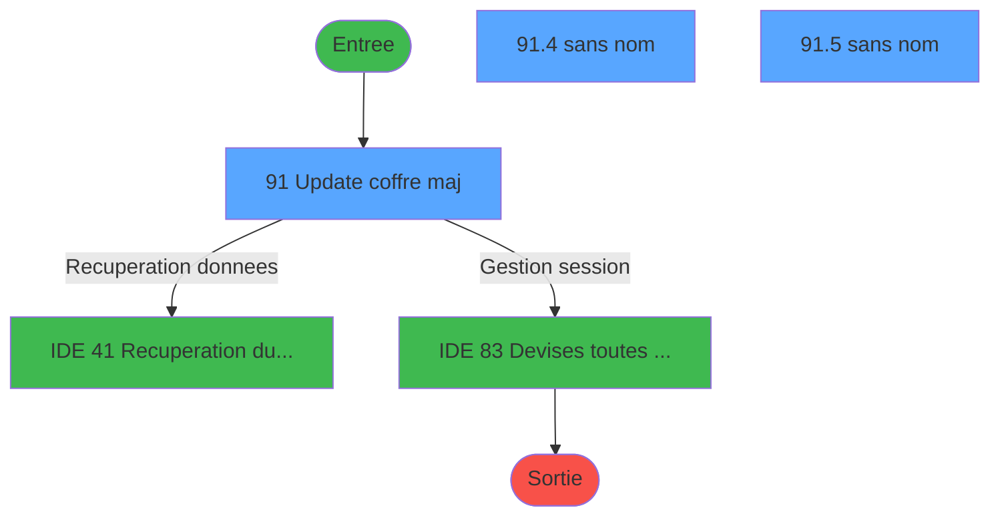
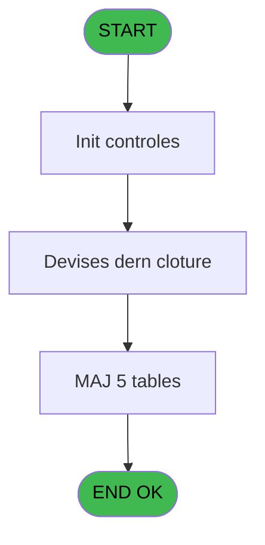
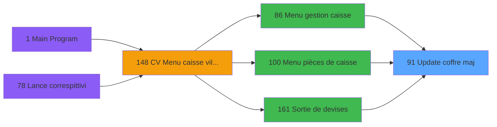
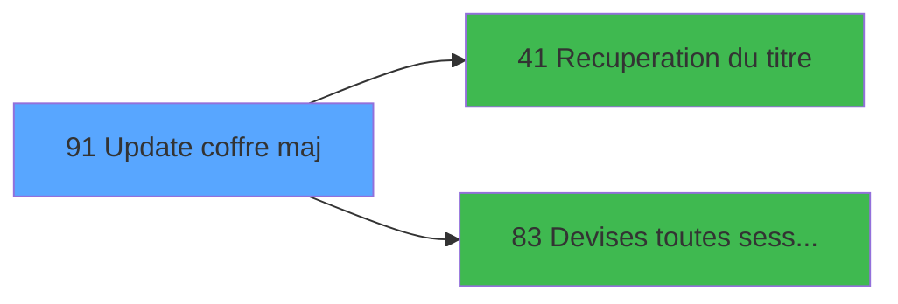

# VIL IDE 91 - Update coffre maj

> **Analyse**: Phases 1-4 2026-02-03 09:17 -> 09:17 (19s) | Assemblage 09:17
> **Pipeline**: V7.2 Enrichi
> **Structure**: 4 onglets (Resume | Ecrans | Donnees | Connexions)

<!-- TAB:Resume -->

## 1. FICHE D'IDENTITE

| Attribut | Valeur |
|----------|--------|
| Projet | VIL |
| IDE Position | 91 |
| Nom Programme | Update coffre maj |
| Fichier source | `Prg_91.xml` |
| Domaine metier | Caisse |
| Taches | 31 (3 ecrans visibles) |
| Tables modifiees | 5 |
| Programmes appeles | 2 |

## 2. DESCRIPTION FONCTIONNELLE

**Update coffre maj** assure la gestion complete de ce processus, accessible depuis [Menu gestion caisse (IDE 86)](VIL-IDE-86.md), [Sortie de devises (IDE 161)](VIL-IDE-161.md), [Menu pièces de caisse (IDE 100)](VIL-IDE-100.md).

Le flux de traitement s'organise en **5 blocs fonctionnels** :

- **Traitement** (21 taches) : traitements metier divers
- **Calcul** (6 taches) : calculs de montants, stocks ou compteurs
- **Initialisation** (2 taches) : reinitialisation d'etats et de variables de travail
- **Creation** (1 tache) : insertion d'enregistrements en base (mouvements, prestations)
- **Validation** (1 tache) : controles et verifications de coherence

**Donnees modifiees** : 5 tables en ecriture (detail_coffre, detail_coffre_devise, histo_detail_coffre, histo_montants_coffre, pv_customer).

Detail : phases du traitement

#### Phase 1 : Traitement (21 taches)

- **91** - Update coffre maj **[[ECRAN]](#ecran-t1)**
- **91.1** - Param caisse
- **91.3** - Solde dern cloture
- **91.3.1** - Nbre devise
- **91.4** - (sans nom) **[[ECRAN]](#ecran-t7)**
- **91.5** - (sans nom) **[[ECRAN]](#ecran-t9)**
- **91.6** - Ecart devise
- **91.6.1** - Lect Dern Cloture
- **91.7.1** - Histo
- **91.7.1.1** - Histo devise
- **91.7.2.2** - Update 304
- **91.9** - Change du jour
- **91.9.1** - Sessions non cloturees
- **91.9.1.1** - mvt devises v1
- **91.9.1.1.1** - MAJ total de la journee
- **91.9.2.1** - mvt devises v1
- **91.9.2.1.1** - MAJ total de la journee
- **91.9.1.2** - mvt devises v1
- **91.9.1.2.1** - MAJ total de la journee
- **91.9.2.2** - mvt devises v1
- **91.9.2.2.1** - MAJ total de la journee

Delegue a : [Recuperation du titre (IDE 41)](VIL-IDE-41.md), [Devises toutes sessions (IDE 83)](VIL-IDE-83.md)

#### Phase 2 : Calcul (6 taches)

- **91.2** - date comptable derniere clotur
- **91.6.2** - Lect comptees
- **91.7.2** - Lecture devises comptees
- **91.7.3** - compte en clot_auto
- **91.8** - Calcul solde et sortie
- **91.9.2** - comptabilise

#### Phase 3 : Initialisation (2 taches)

- **91.3.2** - solde caisse init
- **91.7.2.1** - RAZ 304

#### Phase 4 : Validation (1 tache)

- **91.7** - Validation Update coffre

#### Phase 5 : Creation (1 tache)

- **91.8.1** - Creation

#### Tables impactees

| Table | Operations | Role metier |
|-------|-----------|-------------|
| pv_customer | R/**W**/L (7 usages) |  |
| detail_coffre_devise | R/**W**/L (5 usages) | Etat du coffre |
| detail_coffre | R/**W** (2 usages) | Etat du coffre |
| histo_montants_coffre | **W** (1 usages) | Etat du coffre |
| histo_detail_coffre | **W** (1 usages) | Etat du coffre |

## 3. BLOCS FONCTIONNELS

### 3.1 Traitement (21 taches)

Traitements internes.

---

#### 91 - Update coffre maj [[ECRAN]](#ecran-t1)

**Role** : Tache d'orchestration : point d'entree du programme (21 sous-taches). Coordonne l'enchainement des traitements.
**Ecran** : 1040 x 271 DLU (MDI) | [Voir mockup](#ecran-t1)

20 sous-taches directes

| Tache | Nom | Bloc |
|-------|-----|------|
| [91.1](#t2) | Param caisse | Traitement |
| [91.3](#t4) | Solde dern cloture | Traitement |
| [91.3.1](#t5) | Nbre devise | Traitement |
| [91.4](#t7) | (sans nom) **[[ECRAN]](#ecran-t7)** | Traitement |
| [91.5](#t9) | (sans nom) **[[ECRAN]](#ecran-t9)** | Traitement |
| [91.6](#t10) | Ecart devise | Traitement |
| [91.6.1](#t11) | Lect Dern Cloture | Traitement |
| [91.7.1](#t14) | Histo | Traitement |
| [91.7.1.1](#t15) | Histo devise | Traitement |
| [91.7.2.2](#t18) | Update 304 | Traitement |
| [91.9](#t23) | Change du jour | Traitement |
| [91.9.1](#t24) | Sessions non cloturees | Traitement |
| [91.9.1.1](#t25) | mvt devises v1 | Traitement |
| [91.9.1.1.1](#t26) | MAJ total de la journee | Traitement |
| [91.9.2.1](#t28) | mvt devises v1 | Traitement |
| [91.9.2.1.1](#t29) | MAJ total de la journee | Traitement |
| [91.9.1.2](#t32) | mvt devises v1 | Traitement |
| [91.9.1.2.1](#t33) | MAJ total de la journee | Traitement |
| [91.9.2.2](#t36) | mvt devises v1 | Traitement |
| [91.9.2.2.1](#t37) | MAJ total de la journee | Traitement |

**Variables liees** : L (Param Abandon update), Q (Param N° Term Coffre 2), R (Param Hostname Coffre 2), BG (COFFRE 2 actif)

---

#### 91.1 - Param caisse

**Role** : Traitement : Param caisse.
**Variables liees** : A (Param societe), B (Param devise locale), C (Param masque montant), D (Param date comptable), E (Param Solde comptee Total)

---

#### 91.3 - Solde dern cloture

**Role** : Consultation/chargement : Solde dern cloture.
**Variables liees** : E (Param Solde comptee Total), F (Param Solde comptee Monnaie), G (Param Solde comptee Prosuits), H (Param Solde comptee Cartes), I (Param Solde comptee Cheques)

---

#### 91.3.1 - Nbre devise

**Role** : Traitement : Nbre devise.
**Variables liees** : B (Param devise locale), K (Param Solde comptee Nb devises), O (Param Nbre Decimales), BC (Existe ecart devise)

---

#### 91.4 - (sans nom) [[ECRAN]](#ecran-t7)

**Role** : Traitement interne.
**Ecran** : 640 x 56 DLU (MDI) | [Voir mockup](#ecran-t7)

---

#### 91.5 - (sans nom) [[ECRAN]](#ecran-t9)

**Role** : Traitement interne.
**Ecran** : 256 x 56 DLU (MDI) | [Voir mockup](#ecran-t9)

---

#### 91.6 - Ecart devise

**Role** : Traitement : Ecart devise.
**Variables liees** : B (Param devise locale), K (Param Solde comptee Nb devises), BC (Existe ecart devise)

---

#### 91.6.1 - Lect Dern Cloture

**Role** : Traitement : Lect Dern Cloture.
**Variables liees** : T (Solde derniere cloture Total), U (Solde derniere cloture Monnaie), V (Solde derniere cloture Prosuits), W (Solde derniere cloture Cartes), X (Solde derniere cloture Cheques)

---

#### 91.7.1 - Histo

**Role** : Traitement : Histo.

---

#### 91.7.1.1 - Histo devise

**Role** : Traitement : Histo devise.
**Variables liees** : B (Param devise locale), K (Param Solde comptee Nb devises), BC (Existe ecart devise)

---

#### 91.7.2.2 - Update 304

**Role** : Traitement : Update 304.
**Variables liees** : L (Param Abandon update)

---

#### 91.9 - Change du jour

**Role** : Traitement : Change du jour.
**Variables liees** : BD (Total change Achat), BE (Total change Vente)

---

#### 91.9.1 - Sessions non cloturees

**Role** : Traitement : Sessions non cloturees.

---

#### 91.9.1.1 - mvt devises v1

**Role** : Traitement : mvt devises v1.
**Variables liees** : K (Param Solde comptee Nb devises)

---

#### 91.9.1.1.1 - MAJ total de la journee

**Role** : Traitement : MAJ total de la journee.
**Variables liees** : E (Param Solde comptee Total), T (Solde derniere cloture Total), BD (Total change Achat), BE (Total change Vente)

---

#### 91.9.2.1 - mvt devises v1

**Role** : Traitement : mvt devises v1.
**Variables liees** : K (Param Solde comptee Nb devises)

---

#### 91.9.2.1.1 - MAJ total de la journee

**Role** : Traitement : MAJ total de la journee.
**Variables liees** : E (Param Solde comptee Total), T (Solde derniere cloture Total), BD (Total change Achat), BE (Total change Vente)

---

#### 91.9.1.2 - mvt devises v1

**Role** : Traitement : mvt devises v1.
**Variables liees** : K (Param Solde comptee Nb devises)

---

#### 91.9.1.2.1 - MAJ total de la journee

**Role** : Traitement : MAJ total de la journee.
**Variables liees** : E (Param Solde comptee Total), T (Solde derniere cloture Total), BD (Total change Achat), BE (Total change Vente)

---

#### 91.9.2.2 - mvt devises v1

**Role** : Traitement : mvt devises v1.
**Variables liees** : K (Param Solde comptee Nb devises)

---

#### 91.9.2.2.1 - MAJ total de la journee

**Role** : Traitement : MAJ total de la journee.
**Variables liees** : E (Param Solde comptee Total), T (Solde derniere cloture Total), BD (Total change Achat), BE (Total change Vente)

### 3.2 Calcul (6 taches)

Calculs metier : montants, stocks, compteurs.

---

#### 91.2 - date comptable derniere clotur

**Role** : Traitement : date comptable derniere clotur.
**Variables liees** : D (Param date comptable), L (Param Abandon update), T (Solde derniere cloture Total), U (Solde derniere cloture Monnaie), V (Solde derniere cloture Prosuits)

---

#### 91.6.2 - Lect comptees

**Role** : Traitement : Lect comptees.

---

#### 91.7.2 - Lecture devises comptees

**Role** : Traitement : Lecture devises comptees.
**Variables liees** : K (Param Solde comptee Nb devises)

---

#### 91.7.3 - compte en clot_auto

**Role** : Traitement : compte en clot_auto.
**Variables liees** : E (Param Solde comptee Total), F (Param Solde comptee Monnaie), G (Param Solde comptee Prosuits), H (Param Solde comptee Cartes), I (Param Solde comptee Cheques)

---

#### 91.8 - Calcul solde et sortie

**Role** : Calcul : Calcul solde et sortie.
**Variables liees** : BK (v. Sortie Ecr Authorise?), E (Param Solde comptee Total), F (Param Solde comptee Monnaie), G (Param Solde comptee Prosuits), H (Param Solde comptee Cartes)

---

#### 91.9.2 - comptabilise

**Role** : Traitement : comptabilise.

### 3.3 Initialisation (2 taches)

Reinitialisation d'etats et variables de travail.

---

#### 91.3.2 - solde caisse init

**Role** : Reinitialisation : solde caisse init.
**Variables liees** : E (Param Solde comptee Total), F (Param Solde comptee Monnaie), G (Param Solde comptee Prosuits), H (Param Solde comptee Cartes), I (Param Solde comptee Cheques)

---

#### 91.7.2.1 - RAZ 304

**Role** : Reinitialisation : RAZ 304.

### 3.4 Validation (1 tache)

Controles de coherence : 1 tache verifie les donnees et conditions.

---

#### 91.7 - Validation Update coffre

**Role** : Verification : Validation Update coffre.
**Variables liees** : L (Param Abandon update), Q (Param N° Term Coffre 2), R (Param Hostname Coffre 2), BG (COFFRE 2 actif)

### 3.5 Creation (1 tache)

Insertion de nouveaux enregistrements en base.

---

#### 91.8.1 - Creation

**Role** : Creation d'enregistrement : Creation.

## 5. REGLES METIER

*(Aucune regle metier identifiee)*

## 6. CONTEXTE

- **Appele par**: [Menu gestion caisse (IDE 86)](VIL-IDE-86.md), [Sortie de devises (IDE 161)](VIL-IDE-161.md), [Menu pièces de caisse (IDE 100)](VIL-IDE-100.md)
- **Appelle**: 2 programmes | **Tables**: 13 (W:5 R:9 L:5) | **Taches**: 31 | **Expressions**: 15

<!-- TAB:Ecrans -->

## 8. ECRANS

### 8.1 Forms visibles (3 / 31)

| # | Position | Tache | Nom | Type | Largeur | Hauteur | Bloc |
|---|----------|-------|-----|------|---------|---------|------|
| 1 | 91 | 91 | Update coffre maj | MDI | 1040 | 271 | Traitement |
| 2 | 91.4 | 91.4 | (sans nom) | MDI | 640 | 56 | Traitement |
| 3 | 91.5 | 91.5 | (sans nom) | MDI | 256 | 56 | Traitement |

### 8.2 Mockups Ecrans

---

#### 91 - Update coffre maj
**Tache** : [91](#t1) | **Type** : MDI | **Dimensions** : 1040 x 271 DLU
**Bloc** : Traitement | **Titre IDE** : Update coffre maj

<!-- FORM-DATA:
{
    "width":  1040,
    "vFactor":  8,
    "type":  "MDI",
    "hFactor":  8,
    "controls":  [
                     {
                         "x":  1,
                         "type":  "label",
                         "var":  "",
                         "y":  1,
                         "w":  1039,
                         "fmt":  "",
                         "name":  "",
                         "h":  19,
                         "color":  "",
                         "text":  "",
                         "parent":  null
                     },
                     {
                         "x":  25,
                         "type":  "label",
                         "var":  "",
                         "y":  23,
                         "w":  990,
                         "fmt":  "",
                         "name":  "",
                         "h":  136,
                         "color":  "",
                         "text":  "",
                         "parent":  null
                     },
                     {
                         "x":  30,
                         "type":  "label",
                         "var":  "",
                         "y":  23,
                         "w":  375,
                         "fmt":  "",
                         "name":  "",
                         "h":  12,
                         "color":  "142",
                         "text":  "Mise à jour du coffre",
                         "parent":  null
                     },
                     {
                         "x":  488,
                         "type":  "label",
                         "var":  "",
                         "y":  24,
                         "w":  201,
                         "fmt":  "",
                         "name":  "",
                         "h":  10,
                         "color":  "7",
                         "text":  "Dernière clôture",
                         "parent":  null
                     },
                     {
                         "x":  770,
                         "type":  "label",
                         "var":  "",
                         "y":  24,
                         "w":  201,
                         "fmt":  "",
                         "name":  "",
                         "h":  10,
                         "color":  "7",
                         "text":  "Caisse comptée",
                         "parent":  null
                     },
                     {
                         "x":  225,
                         "type":  "label",
                         "var":  "",
                         "y":  48,
                         "w":  202,
                         "fmt":  "",
                         "name":  "",
                         "h":  10,
                         "color":  "7",
                         "text":  "Total",
                         "parent":  null
                     },
                     {
                         "x":  472,
                         "type":  "label",
                         "var":  "",
                         "y":  64,
                         "w":  237,
                         "fmt":  "",
                         "name":  "",
                         "h":  74,
                         "color":  "",
                         "text":  "",
                         "parent":  null
                     },
                     {
                         "x":  757,
                         "type":  "label",
                         "var":  "",
                         "y":  64,
                         "w":  237,
                         "fmt":  "",
                         "name":  "",
                         "h":  74,
                         "color":  "",
                         "text":  "",
                         "parent":  null
                     },
                     {
                         "x":  225,
                         "type":  "label",
                         "var":  "",
                         "y":  74,
                         "w":  202,
                         "fmt":  "",
                         "name":  "",
                         "h":  10,
                         "color":  "7",
                         "text":  "Cash",
                         "parent":  null
                     },
                     {
                         "x":  225,
                         "type":  "label",
                         "var":  "",
                         "y":  86,
                         "w":  202,
                         "fmt":  "",
                         "name":  "",
                         "h":  10,
                         "color":  "7",
                         "text":  "Stock produits",
                         "parent":  null
                     },
                     {
                         "x":  225,
                         "type":  "label",
                         "var":  "",
                         "y":  98,
                         "w":  202,
                         "fmt":  "",
                         "name":  "",
                         "h":  10,
                         "color":  "7",
                         "text":  "Cartes",
                         "parent":  null
                     },
                     {
                         "x":  225,
                         "type":  "label",
                         "var":  "",
                         "y":  110,
                         "w":  202,
                         "fmt":  "",
                         "name":  "",
                         "h":  10,
                         "color":  "7",
                         "text":  "Chèques",
                         "parent":  null
                     },
                     {
                         "x":  225,
                         "type":  "label",
                         "var":  "",
                         "y":  122,
                         "w":  202,
                         "fmt":  "",
                         "name":  "",
                         "h":  10,
                         "color":  "7",
                         "text":  "OD",
                         "parent":  null
                     },
                     {
                         "x":  473,
                         "type":  "label",
                         "var":  "",
                         "y":  138,
                         "w":  237,
                         "fmt":  "",
                         "name":  "",
                         "h":  19,
                         "color":  "",
                         "text":  "",
                         "parent":  null
                     },
                     {
                         "x":  757,
                         "type":  "label",
                         "var":  "",
                         "y":  138,
                         "w":  237,
                         "fmt":  "",
                         "name":  "",
                         "h":  19,
                         "color":  "",
                         "text":  "",
                         "parent":  null
                     },
                     {
                         "x":  225,
                         "type":  "label",
                         "var":  "",
                         "y":  144,
                         "w":  202,
                         "fmt":  "",
                         "name":  "",
                         "h":  10,
                         "color":  "7",
                         "text":  "Nombre de devises",
                         "parent":  null
                     },
                     {
                         "x":  25,
                         "type":  "label",
                         "var":  "",
                         "y":  164,
                         "w":  990,
                         "fmt":  "",
                         "name":  "",
                         "h":  80,
                         "color":  "",
                         "text":  "",
                         "parent":  null
                     },
                     {
                         "x":  30,
                         "type":  "label",
                         "var":  "",
                         "y":  169,
                         "w":  193,
                         "fmt":  "",
                         "name":  "",
                         "h":  16,
                         "color":  "142",
                         "text":  "Vérification Devises",
                         "parent":  null
                     },
                     {
                         "x":  225,
                         "type":  "label",
                         "var":  "",
                         "y":  169,
                         "w":  202,
                         "fmt":  "",
                         "name":  "",
                         "h":  16,
                         "color":  "7",
                         "text":  "Détail des devises",
                         "parent":  null
                     },
                     {
                         "x":  0,
                         "type":  "label",
                         "var":  "",
                         "y":  247,
                         "w":  1039,
                         "fmt":  "",
                         "name":  "",
                         "h":  24,
                         "color":  "",
                         "text":  "",
                         "parent":  null
                     },
                     {
                         "x":  770,
                         "type":  "edit",
                         "var":  "",
                         "y":  48,
                         "w":  201,
                         "fmt":  "N## ### ### ###.###Z",
                         "name":  "",
                         "h":  10,
                         "color":  "6",
                         "text":  "",
                         "parent":  null
                     },
                     {
                         "x":  770,
                         "type":  "edit",
                         "var":  "",
                         "y":  73,
                         "w":  201,
                         "fmt":  "N## ### ### ###.###Z",
                         "name":  "",
                         "h":  10,
                         "color":  "6",
                         "text":  "",
                         "parent":  13
                     },
                     {
                         "x":  770,
                         "type":  "edit",
                         "var":  "",
                         "y":  86,
                         "w":  201,
                         "fmt":  "N## ### ### ###.###Z",
                         "name":  "",
                         "h":  10,
                         "color":  "6",
                         "text":  "",
                         "parent":  13
                     },
                     {
                         "x":  770,
                         "type":  "edit",
                         "var":  "",
                         "y":  97,
                         "w":  201,
                         "fmt":  "N## ### ### ###.###Z",
                         "name":  "",
                         "h":  10,
                         "color":  "6",
                         "text":  "",
                         "parent":  13
                     },
                     {
                         "x":  770,
                         "type":  "edit",
                         "var":  "",
                         "y":  109,
                         "w":  201,
                         "fmt":  "N## ### ### ###.###Z",
                         "name":  "",
                         "h":  10,
                         "color":  "6",
                         "text":  "",
                         "parent":  13
                     },
                     {
                         "x":  770,
                         "type":  "edit",
                         "var":  "",
                         "y":  121,
                         "w":  201,
                         "fmt":  "N## ### ### ###.###Z",
                         "name":  "",
                         "h":  10,
                         "color":  "6",
                         "text":  "",
                         "parent":  13
                     },
                     {
                         "x":  770,
                         "type":  "edit",
                         "var":  "",
                         "y":  144,
                         "w":  201,
                         "fmt":  "6Z",
                         "name":  "",
                         "h":  10,
                         "color":  "6",
                         "text":  "",
                         "parent":  31
                     },
                     {
                         "x":  488,
                         "type":  "edit",
                         "var":  "",
                         "y":  48,
                         "w":  201,
                         "fmt":  "N## ### ### ###.###Z",
                         "name":  "",
                         "h":  10,
                         "color":  "6",
                         "text":  "",
                         "parent":  null
                     },
                     {
                         "x":  488,
                         "type":  "edit",
                         "var":  "",
                         "y":  73,
                         "w":  201,
                         "fmt":  "N## ### ### ###.###Z",
                         "name":  "",
                         "h":  10,
                         "color":  "6",
                         "text":  "",
                         "parent":  12
                     },
                     {
                         "x":  488,
                         "type":  "edit",
                         "var":  "",
                         "y":  86,
                         "w":  201,
                         "fmt":  "N## ### ### ###.###Z",
                         "name":  "",
                         "h":  10,
                         "color":  "6",
                         "text":  "",
                         "parent":  12
                     },
                     {
                         "x":  488,
                         "type":  "edit",
                         "var":  "",
                         "y":  97,
                         "w":  201,
                         "fmt":  "N## ### ### ###.###Z",
                         "name":  "",
                         "h":  10,
                         "color":  "6",
                         "text":  "",
                         "parent":  12
                     },
                     {
                         "x":  488,
                         "type":  "edit",
                         "var":  "",
                         "y":  109,
                         "w":  201,
                         "fmt":  "N## ### ### ###.###Z",
                         "name":  "",
                         "h":  10,
                         "color":  "6",
                         "text":  "",
                         "parent":  12
                     },
                     {
                         "x":  488,
                         "type":  "edit",
                         "var":  "",
                         "y":  121,
                         "w":  201,
                         "fmt":  "N## ### ### ###.###Z",
                         "name":  "",
                         "h":  10,
                         "color":  "6",
                         "text":  "",
                         "parent":  12
                     },
                     {
                         "x":  488,
                         "type":  "edit",
                         "var":  "",
                         "y":  144,
                         "w":  201,
                         "fmt":  "6Z",
                         "name":  "",
                         "h":  10,
                         "color":  "6",
                         "text":  "",
                         "parent":  30
                     },
                     {
                         "x":  779,
                         "type":  "edit",
                         "var":  "",
                         "y":  7,
                         "w":  256,
                         "fmt":  "WWW DD MMM YYYYT",
                         "name":  "",
                         "h":  8,
                         "color":  "",
                         "text":  "",
                         "parent":  null
                     },
                     {
                         "x":  488,
                         "type":  "edit",
                         "var":  "",
                         "y":  36,
                         "w":  201,
                         "fmt":  "DD/MM/YYYY",
                         "name":  "",
                         "h":  10,
                         "color":  "7",
                         "text":  "",
                         "parent":  null
                     },
                     {
                         "x":  69,
                         "type":  "image",
                         "var":  "",
                         "y":  109,
                         "w":  120,
                         "fmt":  "",
                         "name":  "",
                         "h":  45,
                         "color":  "",
                         "text":  "",
                         "parent":  null
                     },
                     {
                         "x":  473,
                         "type":  "button",
                         "var":  "",
                         "y":  169,
                         "w":  237,
                         "fmt":  "Depuis dernière clôture",
                         "name":  "",
                         "h":  16,
                         "color":  "",
                         "text":  "",
                         "parent":  null
                     },
                     {
                         "x":  757,
                         "type":  "button",
                         "var":  "",
                         "y":  169,
                         "w":  237,
                         "fmt":  "Comptées dans le coffre",
                         "name":  "",
                         "h":  16,
                         "color":  "",
                         "text":  "",
                         "parent":  null
                     },
                     {
                         "x":  7,
                         "type":  "button",
                         "var":  "",
                         "y":  251,
                         "w":  154,
                         "fmt":  "\u0026Abandon",
                         "name":  "",
                         "h":  18,
                         "color":  "",
                         "text":  "",
                         "parent":  null
                     },
                     {
                         "x":  877,
                         "type":  "button",
                         "var":  "",
                         "y":  251,
                         "w":  154,
                         "fmt":  "\u0026Validation",
                         "name":  "",
                         "h":  18,
                         "color":  "",
                         "text":  "",
                         "parent":  null
                     },
                     {
                         "x":  8,
                         "type":  "edit",
                         "var":  "",
                         "y":  6,
                         "w":  267,
                         "fmt":  "30",
                         "name":  "",
                         "h":  8,
                         "color":  "",
                         "text":  "",
                         "parent":  null
                     },
                     {
                         "x":  70,
                         "type":  "subform",
                         "var":  "",
                         "y":  186,
                         "w":  640,
                         "fmt":  "",
                         "name":  "Devises dern cloture",
                         "h":  56,
                         "color":  "",
                         "text":  "",
                         "parent":  null
                     },
                     {
                         "x":  757,
                         "type":  "subform",
                         "var":  "",
                         "y":  186,
                         "w":  251,
                         "fmt":  "",
                         "name":  "Devises comptees",
                         "h":  56,
                         "color":  "",
                         "text":  "",
                         "parent":  null
                     }
                 ],
    "taskId":  "91",
    "height":  271
}
-->

<strong>Champs : 17 champs</strong>

| Pos (x,y) | Nom | Variable | Type |
|-----------|-----|----------|------|
| 770,48 | N## ### ### ###.###Z | - | edit |
| 770,73 | N## ### ### ###.###Z | - | edit |
| 770,86 | N## ### ### ###.###Z | - | edit |
| 770,97 | N## ### ### ###.###Z | - | edit |
| 770,109 | N## ### ### ###.###Z | - | edit |
| 770,121 | N## ### ### ###.###Z | - | edit |
| 770,144 | 6Z | - | edit |
| 488,48 | N## ### ### ###.###Z | - | edit |
| 488,73 | N## ### ### ###.###Z | - | edit |
| 488,86 | N## ### ### ###.###Z | - | edit |
| 488,97 | N## ### ### ###.###Z | - | edit |
| 488,109 | N## ### ### ###.###Z | - | edit |
| 488,121 | N## ### ### ###.###Z | - | edit |
| 488,144 | 6Z | - | edit |
| 779,7 | WWW DD MMM YYYYT | - | edit |
| 488,36 | DD/MM/YYYY | - | edit |
| 8,6 | 30 | - | edit |

<strong>Boutons : 4 boutons</strong>

| Bouton | Pos (x,y) | Action |
|--------|-----------|--------|
| Depuis dernière clôture | 473,169 | Bouton fonctionnel |
| Comptées dans le coffre | 757,169 | Bouton fonctionnel |
| Abandon | 7,251 | Annule et retour au menu |
| Validation | 877,251 | Valide la saisie et enregistre |

---

#### 91.4 - (sans nom)
**Tache** : [91.4](#t7) | **Type** : MDI | **Dimensions** : 640 x 56 DLU
**Bloc** : Traitement | **Titre IDE** : (sans nom)

<!-- FORM-DATA:
{
    "width":  640,
    "vFactor":  8,
    "type":  "MDI",
    "hFactor":  8,
    "controls":  [
                     {
                         "x":  57,
                         "type":  "table",
                         "var":  "",
                         "name":  "",
                         "titleH":  12,
                         "color":  "110",
                         "w":  539,
                         "y":  3,
                         "fmt":  "",
                         "parent":  null,
                         "text":  "",
                         "rowH":  8,
                         "h":  52,
                         "cols":  [
                                      {
                                          "title":  "Code",
                                          "layer":  1,
                                          "w":  50
                                      },
                                      {
                                          "title":  "MOP",
                                          "layer":  2,
                                          "w":  52
                                      },
                                      {
                                          "title":  "Dernière clôture",
                                          "layer":  3,
                                          "w":  134
                                      },
                                      {
                                          "title":  "Sorties",
                                          "layer":  4,
                                          "w":  135
                                      },
                                      {
                                          "title":  "Change",
                                          "layer":  5,
                                          "w":  133
                                      }
                                  ],
                         "rows":  5
                     },
                     {
                         "x":  64,
                         "type":  "edit",
                         "var":  "",
                         "y":  17,
                         "w":  40,
                         "fmt":  "",
                         "name":  "",
                         "h":  6,
                         "color":  "110",
                         "text":  "",
                         "parent":  1
                     },
                     {
                         "x":  115,
                         "type":  "edit",
                         "var":  "",
                         "y":  17,
                         "w":  40,
                         "fmt":  "",
                         "name":  "",
                         "h":  6,
                         "color":  "110",
                         "text":  "",
                         "parent":  1
                     },
                     {
                         "x":  434,
                         "type":  "edit",
                         "var":  "",
                         "y":  17,
                         "w":  120,
                         "fmt":  "N###########Z",
                         "name":  "",
                         "h":  6,
                         "color":  "110",
                         "text":  "",
                         "parent":  1
                     },
                     {
                         "x":  168,
                         "type":  "edit",
                         "var":  "",
                         "y":  17,
                         "w":  120,
                         "fmt":  "N###########Z",
                         "name":  "",
                         "h":  6,
                         "color":  "110",
                         "text":  "",
                         "parent":  1
                     },
                     {
                         "x":  302,
                         "type":  "edit",
                         "var":  "",
                         "y":  17,
                         "w":  120,
                         "fmt":  "N###########Z",
                         "name":  "",
                         "h":  6,
                         "color":  "110",
                         "text":  "",
                         "parent":  1
                     }
                 ],
    "taskId":  "91.4",
    "height":  56
}
-->

<strong>Champs : 5 champs</strong>

| Pos (x,y) | Nom | Variable | Type |
|-----------|-----|----------|------|
| 64,17 | (sans nom) | - | edit |
| 115,17 | (sans nom) | - | edit |
| 434,17 | N###########Z | - | edit |
| 168,17 | N###########Z | - | edit |
| 302,17 | N###########Z | - | edit |

---

#### 91.5 - (sans nom)
**Tache** : [91.5](#t9) | **Type** : MDI | **Dimensions** : 256 x 56 DLU
**Bloc** : Traitement | **Titre IDE** : (sans nom)

<!-- FORM-DATA:
{
    "width":  256,
    "vFactor":  8,
    "type":  "MDI",
    "hFactor":  8,
    "controls":  [
                     {
                         "x":  9,
                         "type":  "table",
                         "var":  "",
                         "name":  "",
                         "titleH":  12,
                         "color":  "110",
                         "w":  247,
                         "y":  2,
                         "fmt":  "",
                         "parent":  null,
                         "text":  "",
                         "rowH":  8,
                         "h":  52,
                         "cols":  [
                                      {
                                          "title":  "Code",
                                          "layer":  1,
                                          "w":  48
                                      },
                                      {
                                          "title":  "MOP",
                                          "layer":  2,
                                          "w":  49
                                      },
                                      {
                                          "title":  "Solde",
                                          "layer":  3,
                                          "w":  117
                                      }
                                  ],
                         "rows":  3
                     },
                     {
                         "x":  15,
                         "type":  "edit",
                         "var":  "",
                         "y":  16,
                         "w":  40,
                         "fmt":  "",
                         "name":  "",
                         "h":  6,
                         "color":  "110",
                         "text":  "",
                         "parent":  1
                     },
                     {
                         "x":  64,
                         "type":  "edit",
                         "var":  "",
                         "y":  16,
                         "w":  40,
                         "fmt":  "",
                         "name":  "",
                         "h":  6,
                         "color":  "110",
                         "text":  "",
                         "parent":  1
                     },
                     {
                         "x":  113,
                         "type":  "edit",
                         "var":  "",
                         "y":  16,
                         "w":  104,
                         "fmt":  "",
                         "name":  "",
                         "h":  6,
                         "color":  "110",
                         "text":  "",
                         "parent":  1
                     }
                 ],
    "taskId":  "91.5",
    "height":  56
}
-->

<strong>Champs : 3 champs</strong>

| Pos (x,y) | Nom | Variable | Type |
|-----------|-----|----------|------|
| 15,16 | (sans nom) | - | edit |
| 64,16 | (sans nom) | - | edit |
| 113,16 | (sans nom) | - | edit |

## 9. NAVIGATION

### 9.1 Enchainement des ecrans

**Detail par enchainement :**

| Depuis | Action | Vers | Retour |
|--------|--------|------|--------|
| Update coffre maj | Recuperation donnees | [Recuperation du titre (IDE 41)](VIL-IDE-41.md) | Retour ecran |
| Update coffre maj | Gestion session | [Devises toutes sessions (IDE 83)](VIL-IDE-83.md) | Retour ecran |

### 9.3 Structure hierarchique (31 taches)

| Position | Tache | Type | Dimensions | Bloc |
|----------|-------|------|------------|------|
| **91.1** | [**Update coffre maj** (91)](#t1) [mockup](#ecran-t1) | MDI | 1040x271 | Traitement |
| 91.1.1 | [Param caisse (91.1)](#t2) | MDI | - | |
| 91.1.2 | [Solde dern cloture (91.3)](#t4) | MDI | - | |
| 91.1.3 | [Nbre devise (91.3.1)](#t5) | MDI | - | |
| 91.1.4 | [(sans nom) (91.4)](#t7) [mockup](#ecran-t7) | MDI | 640x56 | |
| 91.1.5 | [(sans nom) (91.5)](#t9) [mockup](#ecran-t9) | MDI | 256x56 | |
| 91.1.6 | [Ecart devise (91.6)](#t10) | MDI | - | |
| 91.1.7 | [Lect Dern Cloture (91.6.1)](#t11) | MDI | - | |
| 91.1.8 | [Histo (91.7.1)](#t14) | MDI | - | |
| 91.1.9 | [Histo devise (91.7.1.1)](#t15) | MDI | - | |
| 91.1.10 | [Update 304 (91.7.2.2)](#t18) | MDI | - | |
| 91.1.11 | [Change du jour (91.9)](#t23) | MDI | - | |
| 91.1.12 | [Sessions non cloturees (91.9.1)](#t24) | MDI | - | |
| 91.1.13 | [mvt devises v1 (91.9.1.1)](#t25) | MDI | - | |
| 91.1.14 | [MAJ total de la journee (91.9.1.1.1)](#t26) | MDI | - | |
| 91.1.15 | [mvt devises v1 (91.9.2.1)](#t28) | MDI | - | |
| 91.1.16 | [MAJ total de la journee (91.9.2.1.1)](#t29) | MDI | - | |
| 91.1.17 | [mvt devises v1 (91.9.1.2)](#t32) | MDI | - | |
| 91.1.18 | [MAJ total de la journee (91.9.1.2.1)](#t33) | MDI | - | |
| 91.1.19 | [mvt devises v1 (91.9.2.2)](#t36) | MDI | - | |
| 91.1.20 | [MAJ total de la journee (91.9.2.2.1)](#t37) | MDI | - | |
| **91.2** | [**date comptable derniere clotur** (91.2)](#t3) | MDI | - | Calcul |
| 91.2.1 | [Lect comptees (91.6.2)](#t12) | MDI | - | |
| 91.2.2 | [Lecture devises comptees (91.7.2)](#t16) | MDI | - | |
| 91.2.3 | [compte en clot_auto (91.7.3)](#t19) | MDI | - | |
| 91.2.4 | [Calcul solde et sortie (91.8)](#t21) | MDI | - | |
| 91.2.5 | [comptabilise (91.9.2)](#t27) | MDI | - | |
| **91.3** | [**solde caisse init** (91.3.2)](#t6) | MDI | - | Initialisation |
| 91.3.1 | [RAZ 304 (91.7.2.1)](#t17) | MDI | - | |
| **91.4** | [**Validation Update coffre** (91.7)](#t13) | MDI | - | Validation |
| **91.5** | [**Creation** (91.8.1)](#t22) | MDI | - | Creation |

### 9.4 Algorigramme

> **Legende**: Vert = START/END OK | Rouge = END KO | Bleu = Decisions
> *Algorigramme auto-genere. Utiliser `/algorigramme` pour une synthese metier detaillee.*

<!-- TAB:Donnees -->

## 10. TABLES

### Tables utilisees (13)

| ID | Nom | Description | Type | R | W | L | Usages |
|----|-----|-------------|------|---|---|---|--------|
| 55 | solde_caisse_____sks | Sessions de caisse | DB | R |   |   | 2 |
| 57 | devises_caisse___ddk | Sessions de caisse | DB | R |   |   | 4 |
| 228 | detail_coffre | Etat du coffre | DB | R | **W** |   | 2 |
| 229 | detail_coffre_devise | Etat du coffre | DB | R | **W** | L | 5 |
| 230 | histo_detail_coffre | Etat du coffre | DB |   | **W** |   | 1 |
| 231 | histo_detail_coffre_devise | Etat du coffre | DB |   |   | L | 1 |
| 236 | histo_montants_coffre | Etat du coffre | DB |   | **W** |   | 1 |
| 246 | histo_sessions_caisse | Sessions de caisse | DB | R |   |   | 2 |
| 249 | histo_sessions_caisse_detail | Sessions de caisse | DB | R |   |   | 4 |
| 250 | histo_sessions_caisse_devise | Sessions de caisse | DB |   |   | L | 5 |
| 489 | saisie_transaction |  | TMP | R |   | L | 4 |
| 508 | pv_customer |  | TMP | R | **W** | L | 7 |
| 697 | droits_applications | Droits operateur | DB | R |   |   | 1 |

### Colonnes par table (8 / 11 tables avec colonnes identifiees)

Table 55 - solde_caisse_____sks (R) - 2 usages

| Lettre | Variable | Acces | Type |
|--------|----------|-------|------|
| E | Param Solde comptee Total | R | Numeric |
| F | Param Solde comptee Monnaie | R | Numeric |
| G | Param Solde comptee Prosuits | R | Numeric |
| H | Param Solde comptee Cartes | R | Numeric |
| I | Param Solde comptee Cheques | R | Numeric |
| J | Param Solde comptee Od | R | Numeric |
| K | Param Solde comptee Nb devises | R | Numeric |
| T | Solde derniere cloture Total | R | Numeric |
| U | Solde derniere cloture Monnaie | R | Numeric |
| V | Solde derniere cloture Prosuits | R | Numeric |
| W | Solde derniere cloture Cartes | R | Numeric |
| X | Solde derniere cloture Cheques | R | Numeric |
| Y | Solde derniere cloture Od | R | Numeric |
| Z | Solde derniere cloture Nb dev | R | Numeric |

Table 57 - devises_caisse___ddk (R) - 4 usages

| Lettre | Variable | Acces | Type |
|--------|----------|-------|------|
| K | Param Solde comptee Nb devises | R | Numeric |

Table 228 - detail_coffre (R/**W**) - 2 usages

| Lettre | Variable | Acces | Type |
|--------|----------|-------|------|
| BG | COFFRE 2 actif | W | Alpha |
| Q | Param N° Term Coffre 2 | W | Numeric |
| R | Param Hostname Coffre 2 | W | Unicode |

Table 229 - detail_coffre_devise (R/**W**/L) - 5 usages

| Lettre | Variable | Acces | Type |
|--------|----------|-------|------|
| B | Param devise locale | W | Alpha |
| BC | Existe ecart devise | W | Logical |
| BG | COFFRE 2 actif | W | Alpha |
| K | Param Solde comptee Nb devises | W | Numeric |
| Q | Param N° Term Coffre 2 | W | Numeric |
| R | Param Hostname Coffre 2 | W | Unicode |

Table 230 - histo_detail_coffre (**W**) - 1 usages

| Lettre | Variable | Acces | Type |
|--------|----------|-------|------|
| BG | COFFRE 2 actif | W | Alpha |
| Q | Param N° Term Coffre 2 | W | Numeric |
| R | Param Hostname Coffre 2 | W | Unicode |

Table 236 - histo_montants_coffre (**W**) - 1 usages

| Lettre | Variable | Acces | Type |
|--------|----------|-------|------|
| BG | COFFRE 2 actif | W | Alpha |
| Q | Param N° Term Coffre 2 | W | Numeric |
| R | Param Hostname Coffre 2 | W | Unicode |

Table 246 - histo_sessions_caisse (R) - 2 usages

*Table utilisee uniquement en Link ou aucune colonne Real identifiee dans le DataView.*

Table 249 - histo_sessions_caisse_detail (R) - 4 usages

*Table utilisee uniquement en Link ou aucune colonne Real identifiee dans le DataView.*

Table 489 - saisie_transaction (R/L) - 4 usages

*Table utilisee uniquement en Link ou aucune colonne Real identifiee dans le DataView.*

Table 508 - pv_customer (R/**W**/L) - 7 usages

*Table utilisee uniquement en Link ou aucune colonne Real identifiee dans le DataView.*

Table 697 - droits_applications (R) - 1 usages

*Table utilisee uniquement en Link ou aucune colonne Real identifiee dans le DataView.*

## 11. VARIABLES

### 11.1 Parametres entrants (1)

Variables recues du programme appelant ([Menu gestion caisse (IDE 86)](VIL-IDE-86.md)).

| Lettre | Nom | Type | Usage dans |
|--------|-----|------|-----------|
| S | P. Abandon impossible? | Logical | - |

### 11.2 Variables de session (1)

Variables persistantes pendant toute la session.

| Lettre | Nom | Type | Usage dans |
|--------|-----|------|-----------|
| BK | v. Sortie Ecr Authorise? | Logical | - |

### 11.3 Autres (35)

Variables diverses.

| Lettre | Nom | Type | Usage dans |
|--------|-----|------|-----------|
| A | Param societe | Alpha | - |
| B | Param devise locale | Alpha | - |
| C | Param masque montant | Alpha | [91.1](#t2) |
| D | Param date comptable | Date | [91](#t1), [91.1](#t2), [91.2](#t3) |
| E | Param Solde comptee Total | Numeric | - |
| F | Param Solde comptee Monnaie | Numeric | - |
| G | Param Solde comptee Prosuits | Numeric | - |
| H | Param Solde comptee Cartes | Numeric | - |
| I | Param Solde comptee Cheques | Numeric | - |
| J | Param Solde comptee Od | Numeric | - |
| K | Param Solde comptee Nb devises | Numeric | - |
| L | Param Abandon update | Logical | - |
| M | Param initialisation | Logical | - |
| N | Param FROM | Alpha | - |
| O | Param Nbre Decimales | Numeric | - |
| P | Param UNI/BI | Alpha | - |
| Q | Param N° Term Coffre 2 | Numeric | - |
| R | Param Hostname Coffre 2 | Unicode | - |
| T | Solde derniere cloture Total | Numeric | - |
| U | Solde derniere cloture Monnaie | Numeric | - |
| V | Solde derniere cloture Prosuits | Numeric | - |
| W | Solde derniere cloture Cartes | Numeric | - |
| X | Solde derniere cloture Cheques | Numeric | - |
| Y | Solde derniere cloture Od | Numeric | - |
| Z | Solde derniere cloture Nb dev | Numeric | - |
| BA | Date comptable derniere cloture | Date | - |
| BB | titre | Alpha | - |
| BC | Existe ecart devise | Logical | - |
| BD | Total change Achat | Numeric | - |
| BE | Total change Vente | Numeric | - |
| BF | est valide | Logical | - |
| BG | COFFRE 2 actif | Alpha | - |
| BH | cloture_auto | Logical | - |
| BI | DateComptaLastSessCof2 | Date | - |
| BJ | DateHeureFermLastSessCof2 | Numeric | - |

Toutes les 37 variables (liste complete)

| Cat | Lettre | Nom Variable | Type |
|-----|--------|--------------|------|
| P0 | **S** | P. Abandon impossible? | Logical |
| V. | **BK** | v. Sortie Ecr Authorise? | Logical |
| Autre | **A** | Param societe | Alpha |
| Autre | **B** | Param devise locale | Alpha |
| Autre | **C** | Param masque montant | Alpha |
| Autre | **D** | Param date comptable | Date |
| Autre | **E** | Param Solde comptee Total | Numeric |
| Autre | **F** | Param Solde comptee Monnaie | Numeric |
| Autre | **G** | Param Solde comptee Prosuits | Numeric |
| Autre | **H** | Param Solde comptee Cartes | Numeric |
| Autre | **I** | Param Solde comptee Cheques | Numeric |
| Autre | **J** | Param Solde comptee Od | Numeric |
| Autre | **K** | Param Solde comptee Nb devises | Numeric |
| Autre | **L** | Param Abandon update | Logical |
| Autre | **M** | Param initialisation | Logical |
| Autre | **N** | Param FROM | Alpha |
| Autre | **O** | Param Nbre Decimales | Numeric |
| Autre | **P** | Param UNI/BI | Alpha |
| Autre | **Q** | Param N° Term Coffre 2 | Numeric |
| Autre | **R** | Param Hostname Coffre 2 | Unicode |
| Autre | **T** | Solde derniere cloture Total | Numeric |
| Autre | **U** | Solde derniere cloture Monnaie | Numeric |
| Autre | **V** | Solde derniere cloture Prosuits | Numeric |
| Autre | **W** | Solde derniere cloture Cartes | Numeric |
| Autre | **X** | Solde derniere cloture Cheques | Numeric |
| Autre | **Y** | Solde derniere cloture Od | Numeric |
| Autre | **Z** | Solde derniere cloture Nb dev | Numeric |
| Autre | **BA** | Date comptable derniere cloture | Date |
| Autre | **BB** | titre | Alpha |
| Autre | **BC** | Existe ecart devise | Logical |
| Autre | **BD** | Total change Achat | Numeric |
| Autre | **BE** | Total change Vente | Numeric |
| Autre | **BF** | est valide | Logical |
| Autre | **BG** | COFFRE 2 actif | Alpha |
| Autre | **BH** | cloture_auto | Logical |
| Autre | **BI** | DateComptaLastSessCof2 | Date |
| Autre | **BJ** | DateHeureFermLastSessCof2 | Numeric |

## 12. EXPRESSIONS

**15 / 15 expressions decodees (100%)**

### 12.1 Repartition par type

| Type | Expressions | Regles |
|------|-------------|--------|
| CALCULATION | 1 | 0 |
| CONSTANTE | 1 | 0 |
| DATE | 1 | 0 |
| REFERENCE_VG | 1 | 0 |
| OTHER | 7 | 0 |
| NEGATION | 1 | 0 |
| CAST_LOGIQUE | 2 | 0 |
| STRING | 1 | 0 |

### 12.2 Expressions cles par type

#### CALCULATION (1 expressions)

| Type | IDE | Expression | Regle |
|------|-----|------------|-------|
| CALCULATION | 4 | `Param date comptable [D]-1` | - |

#### CONSTANTE (1 expressions)

| Type | IDE | Expression | Regle |
|------|-----|------------|-------|
| CONSTANTE | 5 | `244` | - |

#### DATE (1 expressions)

| Type | IDE | Expression | Regle |
|------|-----|------------|-------|
| DATE | 2 | `Date ()` | - |

#### REFERENCE_VG (1 expressions)

| Type | IDE | Expression | Regle |
|------|-----|------------|-------|
| REFERENCE_VG | 1 | `VG1` | - |

#### OTHER (7 expressions)

| Type | IDE | Expression | Regle |
|------|-----|------------|-------|
| OTHER | 12 | `CtrlGoto('Devises dern cloture',0,0)` | - |
| OTHER | 13 | `NOT([BT])` | - |
| OTHER | 14 | `[BT] AND NOT([AD])` | - |
| OTHER | 11 | `CtrlGoto('Devises comptees',0,0)` | - |
| OTHER | 3 | `Param masque montant [C]` | - |
| ... | | *+2 autres* | |

#### NEGATION (1 expressions)

| Type | IDE | Expression | Regle |
|------|-----|------------|-------|
| NEGATION | 9 | `NOT ([AD])` | - |

#### CAST_LOGIQUE (2 expressions)

| Type | IDE | Expression | Regle |
|------|-----|------------|-------|
| CAST_LOGIQUE | 15 | `'FALSE'LOG` | - |
| CAST_LOGIQUE | 10 | `'TRUE'LOG` | - |

#### STRING (1 expressions)

| Type | IDE | Expression | Regle |
|------|-----|------------|-------|
| STRING | 6 | `Trim (Solde derniere cloture... [Z])` | - |

<!-- TAB:Connexions -->

## 13. GRAPHE D'APPELS

### 13.1 Chaine depuis Main (Callers)

Main -> ... -> [Menu gestion caisse (IDE 86)](VIL-IDE-86.md) -> **Update coffre maj (IDE 91)**

Main -> ... -> [Sortie de devises (IDE 161)](VIL-IDE-161.md) -> **Update coffre maj (IDE 91)**

Main -> ... -> [Menu pièces de caisse (IDE 100)](VIL-IDE-100.md) -> **Update coffre maj (IDE 91)**

### 13.2 Callers

| IDE | Nom Programme | Nb Appels |
|-----|---------------|-----------|
| [86](VIL-IDE-86.md) | Menu gestion caisse | 6 |
| [161](VIL-IDE-161.md) | Sortie de devises | 2 |
| [100](VIL-IDE-100.md) | Menu pièces de caisse | 1 |

### 13.3 Callees (programmes appeles)

### 13.4 Detail Callees avec contexte

| IDE | Nom Programme | Appels | Contexte |
|-----|---------------|--------|----------|
| [41](VIL-IDE-41.md) | Recuperation du titre | 1 | Recuperation donnees |
| [83](VIL-IDE-83.md) | Devises toutes sessions | 1 | Gestion session |

## 14. RECOMMANDATIONS MIGRATION

### 14.1 Profil du programme

| Metrique | Valeur | Impact migration |
|----------|--------|-----------------|
| Lignes de logique | 467 | Taille moyenne |
| Expressions | 15 | Peu de logique |
| Tables WRITE | 5 | Impact modere |
| Sous-programmes | 2 | Peu de dependances |
| Ecrans visibles | 3 | Quelques ecrans |
| Code desactive | 0.2% (1 / 467) | Code sain |
| Regles metier | 0 | Pas de regle identifiee |

### 14.2 Plan de migration par bloc

#### Traitement (21 taches: 3 ecrans, 18 traitements)

- **Strategie** : Orchestrateur avec 3 ecrans (Razor/React) et 18 traitements backend (services).
- Les ecrans deviennent des composants UI, les traitements invisibles deviennent des services injectables.
- 2 sous-programme(s) a migrer ou a reutiliser depuis les services existants.
- Decomposer les taches en services unitaires testables.

#### Calcul (6 taches: 0 ecran, 6 traitements)

- **Strategie** : Services de calcul purs (Domain Services).
- Migrer la logique de calcul (stock, compteurs, montants)

#### Initialisation (2 taches: 0 ecran, 2 traitements)

- **Strategie** : Constructeur/methode `InitAsync()` dans l'orchestrateur.

#### Validation (1 tache: 0 ecran, 1 traitement)

- **Strategie** : FluentValidation avec validators specifiques.
- Chaque tache de validation -> un validator injectable

#### Creation (1 tache: 0 ecran, 1 traitement)

- **Strategie** : Repository pattern avec Entity Framework Core.
- Insertion via `IRepository<T>.CreateAsync()`

### 14.3 Dependances critiques

| Dependance | Type | Appels | Impact |
|------------|------|--------|--------|
| detail_coffre | Table WRITE (Database) | 1x | Schema + repository |
| detail_coffre_devise | Table WRITE (Database) | 2x | Schema + repository |
| histo_detail_coffre | Table WRITE (Database) | 1x | Schema + repository |
| histo_montants_coffre | Table WRITE (Database) | 1x | Schema + repository |
| pv_customer | Table WRITE (Temp) | 5x | Schema + repository |
| [Devises toutes sessions (IDE 83)](VIL-IDE-83.md) | Sous-programme | 1x | Normale - Gestion session |
| [Recuperation du titre (IDE 41)](VIL-IDE-41.md) | Sous-programme | 1x | Normale - Recuperation donnees |

---
*Spec DETAILED generee par Pipeline V7.2 - 2026-02-03 09:17*
