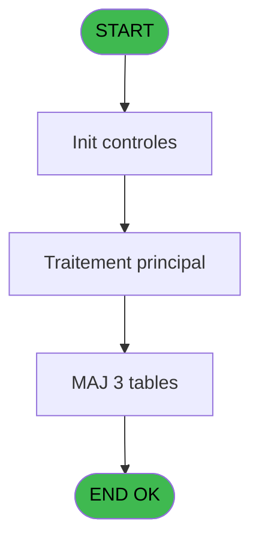
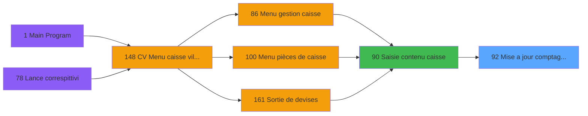

# VIL IDE 92 - Mise a jour comptage caisse

> **Analyse**: Phases 1-4 2026-02-03 09:17 -> 09:18 (20s) | Assemblage 09:18
> **Pipeline**: V7.2 Enrichi
> **Structure**: 4 onglets (Resume | Ecrans | Donnees | Connexions)

<!-- TAB:Resume -->

## 1. FICHE D'IDENTITE

| Attribut | Valeur |
|----------|--------|
| Projet | VIL |
| IDE Position | 92 |
| Nom Programme | Mise a jour comptage caisse |
| Fichier source | `Prg_92.xml` |
| Domaine metier | Caisse |
| Taches | 6 (0 ecrans visibles) |
| Tables modifiees | 3 |
| Programmes appeles | 0 |

## 2. DESCRIPTION FONCTIONNELLE

**Mise a jour comptage caisse** assure la gestion complete de ce processus, accessible depuis [Saisie contenu caisse (IDE 90)](VIL-IDE-90.md).

Le flux de traitement s'organise en **3 blocs fonctionnels** :

- **Traitement** (4 taches) : traitements metier divers
- **Creation** (1 tache) : insertion d'enregistrements en base (mouvements, prestations)
- **Calcul** (1 tache) : calculs de montants, stocks ou compteurs

**Donnees modifiees** : 3 tables en ecriture (comptage_coffre_devise_histo, comptage_coffre_histo, saisie_ele_detail_cloture).

Detail : phases du traitement

#### Phase 1 : Calcul (1 tache)

- **92** - Mise a jour comptage caisse WS

#### Phase 2 : Traitement (4 taches)

- **92.1** - Ecrit Histo
- **92.1.1** - Histo Montant
- **92.1.2** - Histo devise
- **92.2** - Total de la caisse

#### Phase 3 : Creation (1 tache)

- **92.1.2.1** - Creation

#### Tables impactees

| Table | Operations | Role metier |
|-------|-----------|-------------|
| comptage_coffre_devise_histo | **W**/L (2 usages) | Etat du coffre |
| comptage_coffre_histo | **W**/L (2 usages) | Etat du coffre |
| saisie_ele_detail_cloture | **W** (1 usages) | Donnees reseau/cloture |

## 3. BLOCS FONCTIONNELS

### 3.1 Calcul (1 tache)

Calculs metier : montants, stocks, compteurs.

---

#### 92 - Mise a jour comptage caisse WS

**Role** : Traitement : Mise a jour comptage caisse WS.
**Variables liees** : F (Param Total caisse)

### 3.2 Traitement (4 taches)

Traitements internes.

---

#### 92.1 - Ecrit Histo

**Role** : Traitement : Ecrit Histo.
**Variables liees** : B (Param Chrono histo)

---

#### 92.1.1 - Histo Montant

**Role** : Traitement : Histo Montant.
**Variables liees** : B (Param Chrono histo)

---

#### 92.1.2 - Histo devise

**Role** : Traitement : Histo devise.
**Variables liees** : B (Param Chrono histo)

---

#### 92.2 - Total de la caisse

**Role** : Traitement : Total de la caisse.
**Variables liees** : F (Param Total caisse)

### 3.3 Creation (1 tache)

Insertion de nouveaux enregistrements en base.

---

#### 92.1.2.1 - Creation

**Role** : Creation d'enregistrement : Creation.

## 5. REGLES METIER

*(Aucune regle metier identifiee)*

## 6. CONTEXTE

- **Appele par**: [Saisie contenu caisse (IDE 90)](VIL-IDE-90.md)
- **Appelle**: 0 programmes | **Tables**: 6 (W:3 R:2 L:3) | **Taches**: 6 | **Expressions**: 14

<!-- TAB:Ecrans -->

## 8. ECRANS

*(Programme sans ecran visible)*

## 9. NAVIGATION

### 9.3 Structure hierarchique (6 taches)

| Position | Tache | Type | Dimensions | Bloc |
|----------|-------|------|------------|------|
| **92.1** | [**Mise a jour comptage caisse WS** (92)](#t1) | MDI | - | Calcul |
| **92.2** | [**Ecrit Histo** (92.1)](#t2) | MDI | - | Traitement |
| 92.2.1 | [Histo Montant (92.1.1)](#t3) | MDI | - | |
| 92.2.2 | [Histo devise (92.1.2)](#t4) | MDI | - | |
| 92.2.3 | [Total de la caisse (92.2)](#t6) | MDI | - | |
| **92.3** | [**Creation** (92.1.2.1)](#t5) | MDI | - | Creation |

### 9.4 Algorigramme

> **Legende**: Vert = START/END OK | Rouge = END KO | Bleu = Decisions
> *Algorigramme auto-genere. Utiliser `/algorigramme` pour une synthese metier detaillee.*

<!-- TAB:Donnees -->

## 10. TABLES

### Tables utilisees (6)

| ID | Nom | Description | Type | R | W | L | Usages |
|----|-----|-------------|------|---|---|---|--------|
| 215 | comptage_coffre_devise_histo | Etat du coffre | DB |   | **W** | L | 2 |
| 217 | comptage_coffre_histo | Etat du coffre | DB |   | **W** | L | 2 |
| 218 | comptage_coffre_montant_histo | Etat du coffre | DB |   |   | L | 1 |
| 488 | saisie_ele_detail_cloture | Donnees reseau/cloture | TMP |   | **W** |   | 1 |
| 489 | saisie_transaction |  | TMP | R |   |   | 1 |
| 490 | situation_devise | Devises / taux de change | TMP | R |   |   | 1 |

### Colonnes par table (3 / 5 tables avec colonnes identifiees)

Table 215 - comptage_coffre_devise_histo (**W**/L) - 2 usages

| Lettre | Variable | Acces | Type |
|--------|----------|-------|------|
| B | Param Chrono histo | W | Numeric |

Table 217 - comptage_coffre_histo (**W**/L) - 2 usages

| Lettre | Variable | Acces | Type |
|--------|----------|-------|------|
| B | Param Chrono histo | W | Numeric |

Table 488 - saisie_ele_detail_cloture (**W**) - 1 usages

*Table utilisee uniquement en Link ou aucune colonne Real identifiee dans le DataView.*

Table 489 - saisie_transaction (R) - 1 usages

*Table utilisee uniquement en Link ou aucune colonne Real identifiee dans le DataView.*

Table 490 - situation_devise (R) - 1 usages

*Table utilisee uniquement en Link ou aucune colonne Real identifiee dans le DataView.*

## 11. VARIABLES

### 11.1 Autres (6)

Variables diverses.

| Lettre | Nom | Type | Usage dans |
|--------|-----|------|-----------|
| A | Param Quand | Alpha | 1x refs |
| B | Param Chrono histo | Numeric | [92.1](#t2), [92.1.1](#t3), [92.1.2](#t4) |
| C | Param Date Validation | Date | 1x refs |
| D | Param Time Validation | Time | 1x refs |
| E | Param chrono session | Numeric | 1x refs |
| F | Param Total caisse | Numeric | [92](#t1), [92.2](#t6) |

## 12. EXPRESSIONS

**14 / 14 expressions decodees (100%)**

### 12.1 Repartition par type

| Type | Expressions | Regles |
|------|-------------|--------|
| REFERENCE_VG | 1 | 0 |
| OTHER | 13 | 0 |

### 12.2 Expressions cles par type

#### REFERENCE_VG (1 expressions)

| Type | IDE | Expression | Regle |
|------|-----|------------|-------|
| REFERENCE_VG | 1 | `VG1` | - |

#### OTHER (13 expressions)

| Type | IDE | Expression | Regle |
|------|-----|------------|-------|
| OTHER | 11 | `{1,4}` | - |
| OTHER | 10 | `{1,3}` | - |
| OTHER | 9 | `Param Total caisse [F]` | - |
| OTHER | 14 | `[H]` | - |
| OTHER | 13 | `[G]` | - |
| ... | | *+8 autres* | |

<!-- TAB:Connexions -->

## 13. GRAPHE D'APPELS

### 13.1 Chaine depuis Main (Callers)

Main -> ... -> [Saisie contenu caisse (IDE 90)](VIL-IDE-90.md) -> **Mise a jour comptage caisse (IDE 92)**

### 13.2 Callers

| IDE | Nom Programme | Nb Appels |
|-----|---------------|-----------|
| [90](VIL-IDE-90.md) | Saisie contenu caisse | 1 |

### 13.3 Callees (programmes appeles)

### 13.4 Detail Callees avec contexte

| IDE | Nom Programme | Appels | Contexte |
|-----|---------------|--------|----------|
| - | (aucun) | - | - |

## 14. RECOMMANDATIONS MIGRATION

### 14.1 Profil du programme

| Metrique | Valeur | Impact migration |
|----------|--------|-----------------|
| Lignes de logique | 105 | Programme compact |
| Expressions | 14 | Peu de logique |
| Tables WRITE | 3 | Impact modere |
| Sous-programmes | 0 | Peu de dependances |
| Ecrans visibles | 0 | Ecran unique ou traitement batch |
| Code desactive | 0% (0 / 105) | Code sain |
| Regles metier | 0 | Pas de regle identifiee |

### 14.2 Plan de migration par bloc

#### Calcul (1 tache: 0 ecran, 1 traitement)

- **Strategie** : Services de calcul purs (Domain Services).
- Migrer la logique de calcul (stock, compteurs, montants)

#### Traitement (4 taches: 0 ecran, 4 traitements)

- **Strategie** : 4 service(s) backend injectable(s) (Domain Services).
- Decomposer les taches en services unitaires testables.

#### Creation (1 tache: 0 ecran, 1 traitement)

- **Strategie** : Repository pattern avec Entity Framework Core.
- Insertion via `IRepository<T>.CreateAsync()`

### 14.3 Dependances critiques

| Dependance | Type | Appels | Impact |
|------------|------|--------|--------|
| comptage_coffre_devise_histo | Table WRITE (Database) | 1x | Schema + repository |
| comptage_coffre_histo | Table WRITE (Database) | 1x | Schema + repository |
| saisie_ele_detail_cloture | Table WRITE (Temp) | 1x | Schema + repository |

---
*Spec DETAILED generee par Pipeline V7.2 - 2026-02-03 09:18*
