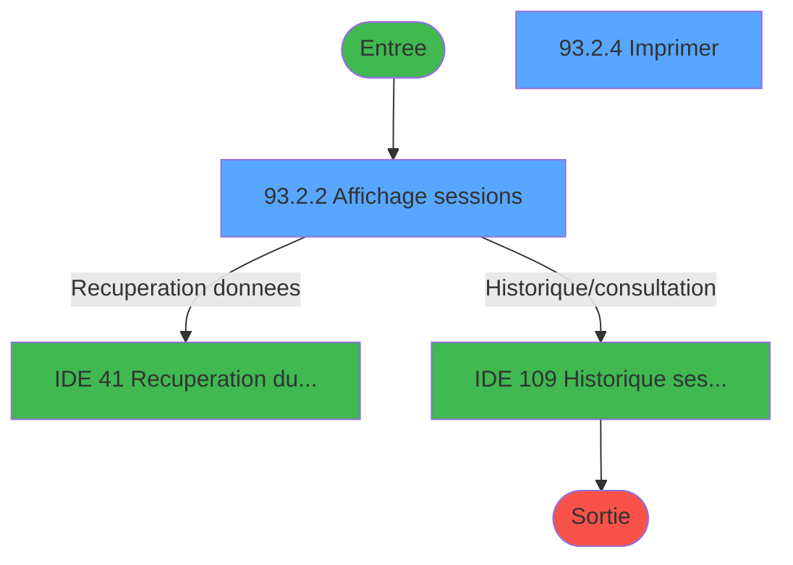
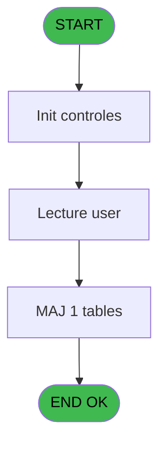
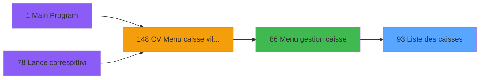
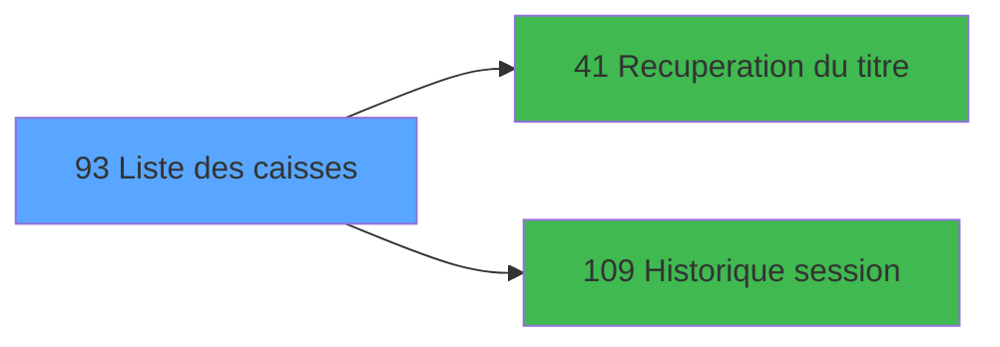

# VIL IDE 93 - Liste des caisses

> **Analyse**: Phases 1-4 2026-02-03 09:18 -> 09:18 (19s) | Assemblage 09:18
> **Pipeline**: V7.2 Enrichi
> **Structure**: 4 onglets (Resume | Ecrans | Donnees | Connexions)

<!-- TAB:Resume -->

## 1. FICHE D'IDENTITE

| Attribut | Valeur |
|----------|--------|
| Projet | VIL |
| IDE Position | 93 |
| Nom Programme | Liste des caisses |
| Fichier source | `Prg_93.xml` |
| Domaine metier | Caisse |
| Taches | 10 (2 ecrans visibles) |
| Tables modifiees | 1 |
| Programmes appeles | 2 |

## 2. DESCRIPTION FONCTIONNELLE

**Liste des caisses** assure la gestion complete de ce processus, accessible depuis [Menu gestion caisse (IDE 86)](VIL-IDE-86.md).

Le flux de traitement s'organise en **5 blocs fonctionnels** :

- **Traitement** (4 taches) : traitements metier divers
- **Consultation** (3 taches) : ecrans de recherche, selection et consultation
- **Impression** (1 tache) : generation de tickets et documents
- **Calcul** (1 tache) : calculs de montants, stocks ou compteurs
- **Creation** (1 tache) : insertion d'enregistrements en base (mouvements, prestations)

**Donnees modifiees** : 1 tables en ecriture (import_voyage____imv).

Detail : phases du traitement

#### Phase 1 : Traitement (4 taches)

- **93** - Liste des caisses
- **93.1** - Lecture user
- **93.2.1** - Totaux
- **93.2.3** - teste si existe ouverte

Delegue a : [Recuperation du titre (IDE 41)](VIL-IDE-41.md), [Historique session (IDE 109)](VIL-IDE-109.md)

#### Phase 2 : Consultation (3 taches)

- **93.1.1** - Recherche dernière session
- **93.2** - Prepare affichage **[[ECRAN]](#ecran-t6)**
- **93.2.2** - Affichage sessions **[[ECRAN]](#ecran-t8)**

Delegue a : [Recuperation du titre (IDE 41)](VIL-IDE-41.md)

#### Phase 3 : Creation (1 tache)

- **93.1.1.1** - Creation tempo

#### Phase 4 : Calcul (1 tache)

- **93.1.2** - Calcul ecarts

#### Phase 5 : Impression (1 tache)

- **93.2.4** - Imprimer **[[ECRAN]](#ecran-t13)**

#### Tables impactees

| Table | Operations | Role metier |
|-------|-----------|-------------|
| import_voyage____imv | R/**W**/L (6 usages) |  |

## 3. BLOCS FONCTIONNELS

### 3.1 Traitement (4 taches)

Traitements internes.

---

#### 93 - Liste des caisses

**Role** : Traitement : Liste des caisses.

3 sous-taches directes

| Tache | Nom | Bloc |
|-------|-----|------|
| [93.1](#t2) | Lecture user | Traitement |
| [93.2.1](#t7) | Totaux | Traitement |
| [93.2.3](#t12) | teste si existe ouverte | Traitement |

**Delegue a** : [Recuperation du titre (IDE 41)](VIL-IDE-41.md), [Historique session (IDE 109)](VIL-IDE-109.md)

---

#### 93.1 - Lecture user

**Role** : Traitement : Lecture user.
**Delegue a** : [Recuperation du titre (IDE 41)](VIL-IDE-41.md), [Historique session (IDE 109)](VIL-IDE-109.md)

---

#### 93.2.1 - Totaux

**Role** : Calcul : Totaux.
**Delegue a** : [Recuperation du titre (IDE 41)](VIL-IDE-41.md), [Historique session (IDE 109)](VIL-IDE-109.md)

---

#### 93.2.3 - teste si existe ouverte

**Role** : Verification : teste si existe ouverte.
**Delegue a** : [Recuperation du titre (IDE 41)](VIL-IDE-41.md), [Historique session (IDE 109)](VIL-IDE-109.md)

### 3.2 Consultation (3 taches)

Ecrans de recherche et consultation.

---

#### 93.1.1 - Recherche dernière session

**Role** : Traitement : Recherche dernière session.

---

#### 93.2 - Prepare affichage [[ECRAN]](#ecran-t6)

**Role** : Reinitialisation : Prepare affichage.
**Ecran** : 1200 x 0 DLU (MDI) | [Voir mockup](#ecran-t6)

---

#### 93.2.2 - Affichage sessions [[ECRAN]](#ecran-t8)

**Role** : Reinitialisation : Affichage sessions.
**Ecran** : 1211 x 240 DLU (MDI) | [Voir mockup](#ecran-t8)

### 3.3 Creation (1 tache)

Insertion de nouveaux enregistrements en base.

---

#### 93.1.1.1 - Creation tempo

**Role** : Creation d'enregistrement : Creation tempo.

### 3.4 Calcul (1 tache)

Calculs metier : montants, stocks, compteurs.

---

#### 93.1.2 - Calcul ecarts

**Role** : Calcul : Calcul ecarts.
**Variables liees** : E (V CUM ecarts)

### 3.5 Impression (1 tache)

Generation des documents et tickets.

---

#### 93.2.4 - Imprimer [[ECRAN]](#ecran-t13)

**Role** : Configuration/parametrage : Imprimer.
**Ecran** : 1200 x 240 DLU (MDI) | [Voir mockup](#ecran-t13)

## 5. REGLES METIER

*(Aucune regle metier identifiee)*

## 6. CONTEXTE

- **Appele par**: [Menu gestion caisse (IDE 86)](VIL-IDE-86.md)
- **Appelle**: 2 programmes | **Tables**: 5 (W:1 R:4 L:2) | **Taches**: 10 | **Expressions**: 5

<!-- TAB:Ecrans -->

## 8. ECRANS

### 8.1 Forms visibles (2 / 10)

| # | Position | Tache | Nom | Type | Largeur | Hauteur | Bloc |
|---|----------|-------|-----|------|---------|---------|------|
| 1 | 93.2.2 | 93.2.2 | Affichage sessions | MDI | 1211 | 240 | Consultation |
| 2 | 93.2.4 | 93.2.4 | Imprimer | MDI | 1200 | 240 | Impression |

### 8.2 Mockups Ecrans

---

#### 93.2.2 - Affichage sessions
**Tache** : [93.2.2](#t8) | **Type** : MDI | **Dimensions** : 1211 x 240 DLU
**Bloc** : Consultation | **Titre IDE** : Affichage sessions

<!-- FORM-DATA:
{
    "width":  1211,
    "vFactor":  8,
    "type":  "MDI",
    "hFactor":  8,
    "controls":  [
                     {
                         "x":  0,
                         "type":  "label",
                         "var":  "",
                         "y":  0,
                         "w":  1200,
                         "fmt":  "",
                         "name":  "",
                         "h":  24,
                         "color":  "",
                         "text":  "",
                         "parent":  null
                     },
                     {
                         "x":  1,
                         "type":  "table",
                         "var":  "",
                         "name":  "",
                         "titleH":  12,
                         "color":  "110",
                         "w":  1203,
                         "y":  27,
                         "fmt":  "",
                         "parent":  null,
                         "text":  "",
                         "rowH":  10,
                         "h":  171,
                         "cols":  [
                                      {
                                          "title":  "Utilisateur",
                                          "layer":  1,
                                          "w":  116
                                      },
                                      {
                                          "title":  "Session",
                                          "layer":  2,
                                          "w":  91
                                      },
                                      {
                                          "title":  "Date début",
                                          "layer":  3,
                                          "w":  122
                                      },
                                      {
                                          "title":  "Heure début",
                                          "layer":  4,
                                          "w":  106
                                      },
                                      {
                                          "title":  "Date fin",
                                          "layer":  5,
                                          "w":  119
                                      },
                                      {
                                          "title":  "Heure fin",
                                          "layer":  6,
                                          "w":  106
                                      },
                                      {
                                          "title":  "Etat",
                                          "layer":  7,
                                          "w":  82
                                      },
                                      {
                                          "title":  "Total",
                                          "layer":  8,
                                          "w":  107
                                      },
                                      {
                                          "title":  "Cash",
                                          "layer":  9,
                                          "w":  107
                                      },
                                      {
                                          "title":  "Produits",
                                          "layer":  10,
                                          "w":  109
                                      },
                                      {
                                          "title":  "Cumul écarts",
                                          "layer":  11,
                                          "w":  106
                                      }
                                  ],
                         "rows":  11
                     },
                     {
                         "x":  667,
                         "type":  "label",
                         "var":  "",
                         "y":  202,
                         "w":  72,
                         "fmt":  "",
                         "name":  "",
                         "h":  10,
                         "color":  "6",
                         "text":  "Totaux",
                         "parent":  null
                     },
                     {
                         "x":  0,
                         "type":  "label",
                         "var":  "",
                         "y":  216,
                         "w":  1200,
                         "fmt":  "",
                         "name":  "",
                         "h":  24,
                         "color":  "",
                         "text":  "",
                         "parent":  null
                     },
                     {
                         "x":  4,
                         "type":  "edit",
                         "var":  "",
                         "y":  41,
                         "w":  109,
                         "fmt":  "",
                         "name":  "",
                         "h":  8,
                         "color":  "110",
                         "text":  "",
                         "parent":  6
                     },
                     {
                         "x":  123,
                         "type":  "edit",
                         "var":  "",
                         "y":  41,
                         "w":  80,
                         "fmt":  "12Z",
                         "name":  "",
                         "h":  8,
                         "color":  "110",
                         "text":  "",
                         "parent":  6
                     },
                     {
                         "x":  214,
                         "type":  "edit",
                         "var":  "",
                         "y":  41,
                         "w":  112,
                         "fmt":  "##/##/####Z",
                         "name":  "",
                         "h":  8,
                         "color":  "110",
                         "text":  "",
                         "parent":  6
                     },
                     {
                         "x":  337,
                         "type":  "edit",
                         "var":  "",
                         "y":  41,
                         "w":  96,
                         "fmt":  "HH:MM:SSZ",
                         "name":  "",
                         "h":  8,
                         "color":  "110",
                         "text":  "",
                         "parent":  6
                     },
                     {
                         "x":  441,
                         "type":  "edit",
                         "var":  "",
                         "y":  41,
                         "w":  112,
                         "fmt":  "##/##/####Z",
                         "name":  "",
                         "h":  8,
                         "color":  "110",
                         "text":  "",
                         "parent":  6
                     },
                     {
                         "x":  563,
                         "type":  "edit",
                         "var":  "",
                         "y":  41,
                         "w":  96,
                         "fmt":  "HH:MM:SSZ",
                         "name":  "",
                         "h":  8,
                         "color":  "110",
                         "text":  "",
                         "parent":  6
                     },
                     {
                         "x":  1073,
                         "type":  "edit",
                         "var":  "",
                         "y":  41,
                         "w":  96,
                         "fmt":  "N## ### ### ###.###Z",
                         "name":  "",
                         "h":  8,
                         "color":  "110",
                         "text":  "",
                         "parent":  6
                     },
                     {
                         "x":  752,
                         "type":  "edit",
                         "var":  "",
                         "y":  41,
                         "w":  96,
                         "fmt":  "N## ### ### ###.###Z",
                         "name":  "",
                         "h":  8,
                         "color":  "110",
                         "text":  "",
                         "parent":  6
                     },
                     {
                         "x":  858,
                         "type":  "edit",
                         "var":  "",
                         "y":  41,
                         "w":  96,
                         "fmt":  "N## ### ### ###.###Z",
                         "name":  "",
                         "h":  8,
                         "color":  "110",
                         "text":  "",
                         "parent":  6
                     },
                     {
                         "x":  964,
                         "type":  "edit",
                         "var":  "",
                         "y":  41,
                         "w":  96,
                         "fmt":  "N## ### ### ###.###Z",
                         "name":  "",
                         "h":  8,
                         "color":  "110",
                         "text":  "",
                         "parent":  6
                     },
                     {
                         "x":  500,
                         "type":  "edit",
                         "var":  "",
                         "y":  3,
                         "w":  200,
                         "fmt":  "30",
                         "name":  "",
                         "h":  18,
                         "color":  "142",
                         "text":  "",
                         "parent":  null
                     },
                     {
                         "x":  500,
                         "type":  "edit",
                         "var":  "",
                         "y":  3,
                         "w":  200,
                         "fmt":  "30",
                         "name":  "",
                         "h":  18,
                         "color":  "144",
                         "text":  "",
                         "parent":  null
                     },
                     {
                         "x":  8,
                         "type":  "edit",
                         "var":  "",
                         "y":  8,
                         "w":  262,
                         "fmt":  "30",
                         "name":  "",
                         "h":  8,
                         "color":  "",
                         "text":  "",
                         "parent":  null
                     },
                     {
                         "x":  914,
                         "type":  "edit",
                         "var":  "",
                         "y":  8,
                         "w":  280,
                         "fmt":  "WWW DD MMM YYYYT",
                         "name":  "",
                         "h":  8,
                         "color":  "",
                         "text":  "",
                         "parent":  null
                     },
                     {
                         "x":  667,
                         "type":  "edit",
                         "var":  "",
                         "y":  41,
                         "w":  72,
                         "fmt":  "30",
                         "name":  "",
                         "h":  8,
                         "color":  "110",
                         "text":  "",
                         "parent":  6
                     },
                     {
                         "x":  752,
                         "type":  "edit",
                         "var":  "",
                         "y":  202,
                         "w":  96,
                         "fmt":  "N## ### ### ###.###Z",
                         "name":  "",
                         "h":  10,
                         "color":  "6",
                         "text":  "",
                         "parent":  null
                     },
                     {
                         "x":  858,
                         "type":  "edit",
                         "var":  "",
                         "y":  202,
                         "w":  96,
                         "fmt":  "N## ### ### ###.###Z",
                         "name":  "",
                         "h":  10,
                         "color":  "6",
                         "text":  "",
                         "parent":  null
                     },
                     {
                         "x":  964,
                         "type":  "edit",
                         "var":  "",
                         "y":  202,
                         "w":  96,
                         "fmt":  "N## ### ### ###.###Z",
                         "name":  "",
                         "h":  10,
                         "color":  "6",
                         "text":  "",
                         "parent":  null
                     },
                     {
                         "x":  1073,
                         "type":  "edit",
                         "var":  "",
                         "y":  202,
                         "w":  96,
                         "fmt":  "N## ### ### ###.###Z",
                         "name":  "",
                         "h":  10,
                         "color":  "6",
                         "text":  "",
                         "parent":  null
                     },
                     {
                         "x":  11,
                         "type":  "button",
                         "var":  "",
                         "y":  219,
                         "w":  154,
                         "fmt":  "A\u0026bandon",
                         "name":  "",
                         "h":  18,
                         "color":  "",
                         "text":  "",
                         "parent":  null
                     },
                     {
                         "x":  187,
                         "type":  "button",
                         "var":  "",
                         "y":  219,
                         "w":  192,
                         "fmt":  "Toutes les caisses",
                         "name":  "TOUTES",
                         "h":  18,
                         "color":  "",
                         "text":  "",
                         "parent":  null
                     },
                     {
                         "x":  401,
                         "type":  "button",
                         "var":  "",
                         "y":  219,
                         "w":  192,
                         "fmt":  "Caisses ouvertes",
                         "name":  "OUVERTES",
                         "h":  18,
                         "color":  "",
                         "text":  "",
                         "parent":  null
                     },
                     {
                         "x":  615,
                         "type":  "button",
                         "var":  "",
                         "y":  219,
                         "w":  154,
                         "fmt":  "\u0026Imprimer",
                         "name":  "",
                         "h":  18,
                         "color":  "",
                         "text":  "",
                         "parent":  null
                     },
                     {
                         "x":  792,
                         "type":  "button",
                         "var":  "",
                         "y":  219,
                         "w":  154,
                         "fmt":  "\u0026Historique",
                         "name":  "",
                         "h":  18,
                         "color":  "",
                         "text":  "",
                         "parent":  null
                     },
                     {
                         "x":  1040,
                         "type":  "button",
                         "var":  "",
                         "y":  219,
                         "w":  154,
                         "fmt":  "\u0026Validation",
                         "name":  "",
                         "h":  18,
                         "color":  "",
                         "text":  "",
                         "parent":  null
                     },
                     {
                         "x":  1040,
                         "type":  "button",
                         "var":  "",
                         "y":  219,
                         "w":  154,
                         "fmt":  "\u0026Quitter",
                         "name":  "",
                         "h":  18,
                         "color":  "",
                         "text":  "",
                         "parent":  null
                     }
                 ],
    "taskId":  "93.2.2",
    "height":  240
}
-->

<strong>Champs : 19 champs</strong>

| Pos (x,y) | Nom | Variable | Type |
|-----------|-----|----------|------|
| 4,41 | (sans nom) | - | edit |
| 123,41 | 12Z | - | edit |
| 214,41 | ##/##/####Z | - | edit |
| 337,41 | HH:MM:SSZ | - | edit |
| 441,41 | ##/##/####Z | - | edit |
| 563,41 | HH:MM:SSZ | - | edit |
| 1073,41 | N## ### ### ###.###Z | - | edit |
| 752,41 | N## ### ### ###.###Z | - | edit |
| 858,41 | N## ### ### ###.###Z | - | edit |
| 964,41 | N## ### ### ###.###Z | - | edit |
| 500,3 | 30 | - | edit |
| 500,3 | 30 | - | edit |
| 8,8 | 30 | - | edit |
| 914,8 | WWW DD MMM YYYYT | - | edit |
| 667,41 | 30 | - | edit |
| 752,202 | N## ### ### ###.###Z | - | edit |
| 858,202 | N## ### ### ###.###Z | - | edit |
| 964,202 | N## ### ### ###.###Z | - | edit |
| 1073,202 | N## ### ### ###.###Z | - | edit |

<strong>Boutons : 7 boutons</strong>

| Bouton | Pos (x,y) | Action |
|--------|-----------|--------|
| Abandon | 11,219 | Annule et retour au menu |
| Toutes les caisses | 187,219 | Bouton fonctionnel |
| Caisses ouvertes | 401,219 | Bouton fonctionnel |
| Imprimer | 615,219 | Lance l'impression |
| Historique | 792,219 | Appel [Historique session (IDE 109)](VIL-IDE-109.md) |
| Validation | 1040,219 | Valide la saisie et enregistre |
| Quitter | 1040,219 | Quitte le programme |

---

#### 93.2.4 - Imprimer
**Tache** : [93.2.4](#t13) | **Type** : MDI | **Dimensions** : 1200 x 240 DLU
**Bloc** : Impression | **Titre IDE** : Imprimer

<!-- FORM-DATA:
{
    "width":  1200,
    "vFactor":  8,
    "type":  "MDI",
    "hFactor":  8,
    "controls":  [
                     {
                         "x":  0,
                         "type":  "label",
                         "var":  "",
                         "y":  0,
                         "w":  1200,
                         "fmt":  "",
                         "name":  "",
                         "h":  24,
                         "color":  "",
                         "text":  "",
                         "parent":  null
                     },
                     {
                         "x":  1,
                         "type":  "table",
                         "var":  "",
                         "name":  "",
                         "titleH":  12,
                         "color":  "",
                         "w":  1198,
                         "y":  27,
                         "fmt":  "",
                         "parent":  null,
                         "text":  "",
                         "rowH":  10,
                         "h":  171,
                         "cols":  [
                                      {
                                          "title":  "",
                                          "layer":  1,
                                          "w":  116
                                      },
                                      {
                                          "title":  "",
                                          "layer":  2,
                                          "w":  91
                                      },
                                      {
                                          "title":  "",
                                          "layer":  3,
                                          "w":  122
                                      },
                                      {
                                          "title":  "",
                                          "layer":  4,
                                          "w":  106
                                      },
                                      {
                                          "title":  "",
                                          "layer":  5,
                                          "w":  119
                                      },
                                      {
                                          "title":  "",
                                          "layer":  6,
                                          "w":  106
                                      },
                                      {
                                          "title":  "",
                                          "layer":  7,
                                          "w":  82
                                      },
                                      {
                                          "title":  "",
                                          "layer":  8,
                                          "w":  107
                                      },
                                      {
                                          "title":  "",
                                          "layer":  9,
                                          "w":  107
                                      },
                                      {
                                          "title":  "",
                                          "layer":  10,
                                          "w":  109
                                      },
                                      {
                                          "title":  "",
                                          "layer":  11,
                                          "w":  106
                                      }
                                  ],
                         "rows":  11
                     },
                     {
                         "x":  4,
                         "type":  "label",
                         "var":  "",
                         "y":  29,
                         "w":  109,
                         "fmt":  "",
                         "name":  "",
                         "h":  10,
                         "color":  "7",
                         "text":  "User",
                         "parent":  6
                     },
                     {
                         "x":  123,
                         "type":  "label",
                         "var":  "",
                         "y":  29,
                         "w":  80,
                         "fmt":  "",
                         "name":  "",
                         "h":  10,
                         "color":  "7",
                         "text":  "N° session",
                         "parent":  6
                     },
                     {
                         "x":  214,
                         "type":  "label",
                         "var":  "",
                         "y":  29,
                         "w":  112,
                         "fmt":  "",
                         "name":  "",
                         "h":  10,
                         "color":  "7",
                         "text":  "Date debut",
                         "parent":  6
                     },
                     {
                         "x":  337,
                         "type":  "label",
                         "var":  "",
                         "y":  29,
                         "w":  96,
                         "fmt":  "",
                         "name":  "",
                         "h":  10,
                         "color":  "7",
                         "text":  "Heure debut",
                         "parent":  6
                     },
                     {
                         "x":  441,
                         "type":  "label",
                         "var":  "",
                         "y":  29,
                         "w":  112,
                         "fmt":  "",
                         "name":  "",
                         "h":  10,
                         "color":  "7",
                         "text":  "Date fin",
                         "parent":  6
                     },
                     {
                         "x":  560,
                         "type":  "label",
                         "var":  "",
                         "y":  29,
                         "w":  96,
                         "fmt":  "",
                         "name":  "",
                         "h":  10,
                         "color":  "7",
                         "text":  "Heure fin",
                         "parent":  6
                     },
                     {
                         "x":  667,
                         "type":  "label",
                         "var":  "",
                         "y":  29,
                         "w":  72,
                         "fmt":  "",
                         "name":  "",
                         "h":  10,
                         "color":  "7",
                         "text":  "Etat",
                         "parent":  6
                     },
                     {
                         "x":  752,
                         "type":  "label",
                         "var":  "",
                         "y":  29,
                         "w":  96,
                         "fmt":  "",
                         "name":  "",
                         "h":  10,
                         "color":  "7",
                         "text":  "Total",
                         "parent":  6
                     },
                     {
                         "x":  858,
                         "type":  "label",
                         "var":  "",
                         "y":  29,
                         "w":  96,
                         "fmt":  "",
                         "name":  "",
                         "h":  10,
                         "color":  "7",
                         "text":  "Monnaie",
                         "parent":  6
                     },
                     {
                         "x":  964,
                         "type":  "label",
                         "var":  "",
                         "y":  29,
                         "w":  96,
                         "fmt":  "",
                         "name":  "",
                         "h":  10,
                         "color":  "7",
                         "text":  "Produits",
                         "parent":  6
                     },
                     {
                         "x":  1073,
                         "type":  "label",
                         "var":  "",
                         "y":  29,
                         "w":  120,
                         "fmt":  "",
                         "name":  "",
                         "h":  10,
                         "color":  "7",
                         "text":  "Cumul ecarts",
                         "parent":  6
                     },
                     {
                         "x":  667,
                         "type":  "label",
                         "var":  "",
                         "y":  202,
                         "w":  72,
                         "fmt":  "",
                         "name":  "",
                         "h":  10,
                         "color":  "6",
                         "text":  "Totaux",
                         "parent":  null
                     },
                     {
                         "x":  0,
                         "type":  "label",
                         "var":  "",
                         "y":  216,
                         "w":  1200,
                         "fmt":  "",
                         "name":  "",
                         "h":  24,
                         "color":  "",
                         "text":  "",
                         "parent":  null
                     },
                     {
                         "x":  500,
                         "type":  "edit",
                         "var":  "",
                         "y":  3,
                         "w":  200,
                         "fmt":  "30",
                         "name":  "",
                         "h":  18,
                         "color":  "142",
                         "text":  "",
                         "parent":  null
                     },
                     {
                         "x":  500,
                         "type":  "edit",
                         "var":  "",
                         "y":  3,
                         "w":  200,
                         "fmt":  "30",
                         "name":  "",
                         "h":  18,
                         "color":  "144",
                         "text":  "",
                         "parent":  null
                     },
                     {
                         "x":  8,
                         "type":  "edit",
                         "var":  "",
                         "y":  8,
                         "w":  262,
                         "fmt":  "30",
                         "name":  "",
                         "h":  8,
                         "color":  "",
                         "text":  "",
                         "parent":  null
                     },
                     {
                         "x":  914,
                         "type":  "edit",
                         "var":  "",
                         "y":  8,
                         "w":  280,
                         "fmt":  "WWW DD MMM YYYYT",
                         "name":  "",
                         "h":  8,
                         "color":  "",
                         "text":  "",
                         "parent":  null
                     },
                     {
                         "x":  4,
                         "type":  "edit",
                         "var":  "",
                         "y":  41,
                         "w":  109,
                         "fmt":  "",
                         "name":  "",
                         "h":  8,
                         "color":  "",
                         "text":  "",
                         "parent":  6
                     },
                     {
                         "x":  123,
                         "type":  "edit",
                         "var":  "",
                         "y":  41,
                         "w":  80,
                         "fmt":  "12Z",
                         "name":  "",
                         "h":  8,
                         "color":  "",
                         "text":  "",
                         "parent":  6
                     },
                     {
                         "x":  214,
                         "type":  "edit",
                         "var":  "",
                         "y":  41,
                         "w":  112,
                         "fmt":  "##/##/####Z",
                         "name":  "",
                         "h":  8,
                         "color":  "",
                         "text":  "",
                         "parent":  6
                     },
                     {
                         "x":  337,
                         "type":  "edit",
                         "var":  "",
                         "y":  41,
                         "w":  96,
                         "fmt":  "HH:MM:SSZ",
                         "name":  "",
                         "h":  8,
                         "color":  "",
                         "text":  "",
                         "parent":  6
                     },
                     {
                         "x":  441,
                         "type":  "edit",
                         "var":  "",
                         "y":  41,
                         "w":  112,
                         "fmt":  "##/##/####Z",
                         "name":  "",
                         "h":  8,
                         "color":  "",
                         "text":  "",
                         "parent":  6
                     },
                     {
                         "x":  563,
                         "type":  "edit",
                         "var":  "",
                         "y":  41,
                         "w":  96,
                         "fmt":  "HH:MM:SSZ",
                         "name":  "",
                         "h":  8,
                         "color":  "",
                         "text":  "",
                         "parent":  6
                     },
                     {
                         "x":  667,
                         "type":  "edit",
                         "var":  "",
                         "y":  41,
                         "w":  72,
                         "fmt":  "30",
                         "name":  "",
                         "h":  8,
                         "color":  "2",
                         "text":  "",
                         "parent":  6
                     },
                     {
                         "x":  752,
                         "type":  "edit",
                         "var":  "",
                         "y":  41,
                         "w":  96,
                         "fmt":  "N## ### ### ###.###Z",
                         "name":  "",
                         "h":  8,
                         "color":  "",
                         "text":  "",
                         "parent":  6
                     },
                     {
                         "x":  858,
                         "type":  "edit",
                         "var":  "",
                         "y":  41,
                         "w":  96,
                         "fmt":  "N## ### ### ###.###Z",
                         "name":  "",
                         "h":  8,
                         "color":  "",
                         "text":  "",
                         "parent":  6
                     },
                     {
                         "x":  964,
                         "type":  "edit",
                         "var":  "",
                         "y":  41,
                         "w":  96,
                         "fmt":  "N## ### ### ###.###Z",
                         "name":  "",
                         "h":  8,
                         "color":  "",
                         "text":  "",
                         "parent":  6
                     },
                     {
                         "x":  1073,
                         "type":  "edit",
                         "var":  "",
                         "y":  41,
                         "w":  96,
                         "fmt":  "N## ### ### ###.###Z",
                         "name":  "",
                         "h":  8,
                         "color":  "",
                         "text":  "",
                         "parent":  6
                     },
                     {
                         "x":  752,
                         "type":  "edit",
                         "var":  "",
                         "y":  202,
                         "w":  96,
                         "fmt":  "N## ### ### ###.###Z",
                         "name":  "",
                         "h":  10,
                         "color":  "6",
                         "text":  "",
                         "parent":  null
                     },
                     {
                         "x":  858,
                         "type":  "edit",
                         "var":  "",
                         "y":  202,
                         "w":  96,
                         "fmt":  "N## ### ### ###.###Z",
                         "name":  "",
                         "h":  10,
                         "color":  "6",
                         "text":  "",
                         "parent":  null
                     },
                     {
                         "x":  964,
                         "type":  "edit",
                         "var":  "",
                         "y":  202,
                         "w":  96,
                         "fmt":  "N## ### ### ###.###Z",
                         "name":  "",
                         "h":  10,
                         "color":  "6",
                         "text":  "",
                         "parent":  null
                     },
                     {
                         "x":  1073,
                         "type":  "edit",
                         "var":  "",
                         "y":  202,
                         "w":  96,
                         "fmt":  "N## ### ### ###.###Z",
                         "name":  "",
                         "h":  10,
                         "color":  "6",
                         "text":  "",
                         "parent":  null
                     },
                     {
                         "x":  11,
                         "type":  "button",
                         "var":  "",
                         "y":  219,
                         "w":  154,
                         "fmt":  "\u0026Abandon",
                         "name":  "",
                         "h":  18,
                         "color":  "",
                         "text":  "",
                         "parent":  null
                     },
                     {
                         "x":  185,
                         "type":  "button",
                         "var":  "",
                         "y":  219,
                         "w":  192,
                         "fmt":  "\u0026Toutes les caisses",
                         "name":  "TOUTES",
                         "h":  18,
                         "color":  "",
                         "text":  "",
                         "parent":  null
                     },
                     {
                         "x":  397,
                         "type":  "button",
                         "var":  "",
                         "y":  219,
                         "w":  192,
                         "fmt":  "\u0026Caisses ouvertes",
                         "name":  "OUVERTES",
                         "h":  18,
                         "color":  "",
                         "text":  "",
                         "parent":  null
                     },
                     {
                         "x":  611,
                         "type":  "button",
                         "var":  "",
                         "y":  219,
                         "w":  192,
                         "fmt":  "\u0026Imprimer",
                         "name":  "",
                         "h":  18,
                         "color":  "",
                         "text":  "",
                         "parent":  null
                     },
                     {
                         "x":  1040,
                         "type":  "button",
                         "var":  "",
                         "y":  219,
                         "w":  154,
                         "fmt":  "\u0026Validation",
                         "name":  "",
                         "h":  18,
                         "color":  "",
                         "text":  "",
                         "parent":  null
                     },
                     {
                         "x":  1040,
                         "type":  "button",
                         "var":  "",
                         "y":  219,
                         "w":  154,
                         "fmt":  "\u0026Quitter",
                         "name":  "",
                         "h":  18,
                         "color":  "",
                         "text":  "",
                         "parent":  null
                     }
                 ],
    "taskId":  "93.2.4",
    "height":  240
}
-->

<strong>Champs : 19 champs</strong>

| Pos (x,y) | Nom | Variable | Type |
|-----------|-----|----------|------|
| 500,3 | 30 | - | edit |
| 500,3 | 30 | - | edit |
| 8,8 | 30 | - | edit |
| 914,8 | WWW DD MMM YYYYT | - | edit |
| 4,41 | (sans nom) | - | edit |
| 123,41 | 12Z | - | edit |
| 214,41 | ##/##/####Z | - | edit |
| 337,41 | HH:MM:SSZ | - | edit |
| 441,41 | ##/##/####Z | - | edit |
| 563,41 | HH:MM:SSZ | - | edit |
| 667,41 | 30 | - | edit |
| 752,41 | N## ### ### ###.###Z | - | edit |
| 858,41 | N## ### ### ###.###Z | - | edit |
| 964,41 | N## ### ### ###.###Z | - | edit |
| 1073,41 | N## ### ### ###.###Z | - | edit |
| 752,202 | N## ### ### ###.###Z | - | edit |
| 858,202 | N## ### ### ###.###Z | - | edit |
| 964,202 | N## ### ### ###.###Z | - | edit |
| 1073,202 | N## ### ### ###.###Z | - | edit |

<strong>Boutons : 6 boutons</strong>

| Bouton | Pos (x,y) | Action |
|--------|-----------|--------|
| Abandon | 11,219 | Annule et retour au menu |
| Toutes les caisses | 185,219 | Bouton fonctionnel |
| Caisses ouvertes | 397,219 | Bouton fonctionnel |
| Imprimer | 611,219 | Lance l'impression |
| Validation | 1040,219 | Valide la saisie et enregistre |
| Quitter | 1040,219 | Quitte le programme |

## 9. NAVIGATION

### 9.1 Enchainement des ecrans

**Detail par enchainement :**

| Depuis | Action | Vers | Retour |
|--------|--------|------|--------|
| Affichage sessions | Recuperation donnees | [Recuperation du titre (IDE 41)](VIL-IDE-41.md) | Retour ecran |
| Affichage sessions | Historique/consultation | [Historique session (IDE 109)](VIL-IDE-109.md) | Retour ecran |

### 9.3 Structure hierarchique (10 taches)

| Position | Tache | Type | Dimensions | Bloc |
|----------|-------|------|------------|------|
| **93.1** | [**Liste des caisses** (93)](#t1) | MDI | - | Traitement |
| 93.1.1 | [Lecture user (93.1)](#t2) | MDI | - | |
| 93.1.2 | [Totaux (93.2.1)](#t7) | MDI | - | |
| 93.1.3 | [teste si existe ouverte (93.2.3)](#t12) | MDI | - | |
| **93.2** | [**Recherche dernière session** (93.1.1)](#t3) | MDI | - | Consultation |
| 93.2.1 | [Prepare affichage (93.2)](#t6) [mockup](#ecran-t6) | MDI | 1200x0 | |
| 93.2.2 | [Affichage sessions (93.2.2)](#t8) [mockup](#ecran-t8) | MDI | 1211x240 | |
| **93.3** | [**Creation tempo** (93.1.1.1)](#t4) | MDI | - | Creation |
| **93.4** | [**Calcul ecarts** (93.1.2)](#t5) | MDI | - | Calcul |
| **93.5** | [**Imprimer** (93.2.4)](#t13) [mockup](#ecran-t13) | MDI | 1200x240 | Impression |

### 9.4 Algorigramme

> **Legende**: Vert = START/END OK | Rouge = END KO | Bleu = Decisions
> *Algorigramme auto-genere. Utiliser `/algorigramme` pour une synthese metier detaillee.*

<!-- TAB:Donnees -->

## 10. TABLES

### Tables utilisees (5)

| ID | Nom | Description | Type | R | W | L | Usages |
|----|-----|-------------|------|---|---|---|--------|
| 234 | ecarts |  | DB | R |   |   | 1 |
| 246 | histo_sessions_caisse | Sessions de caisse | DB | R |   |   | 2 |
| 249 | histo_sessions_caisse_detail | Sessions de caisse | DB |   |   | L | 1 |
| 552 | import_voyage____imv |  | TMP | R | **W** | L | 6 |
| 740 | pv_stock_movements | Articles et stock | DB | R |   |   | 2 |

### Colonnes par table (3 / 4 tables avec colonnes identifiees)

Table 234 - ecarts (R) - 1 usages

| Lettre | Variable | Acces | Type |
|--------|----------|-------|------|
| E | V CUM ecarts | R | Numeric |

Table 246 - histo_sessions_caisse (R) - 2 usages

| Lettre | Variable | Acces | Type |
|--------|----------|-------|------|
| A | Existe session | R | Logical |
| B | --------------ouverte | R | Alpha |
| C | --------------fermee | R | Alpha |

Table 552 - import_voyage____imv (R/**W**/L) - 6 usages

*Table utilisee uniquement en Link ou aucune colonne Real identifiee dans le DataView.*

Table 740 - pv_stock_movements (R) - 2 usages

| Lettre | Variable | Acces | Type |
|--------|----------|-------|------|
| A | titre | R | Alpha |
| B | User existe | R | Logical |
| C | User existe | R | Logical |

## 11. VARIABLES

### 11.1 Variables de session (4)

Variables persistantes pendant toute la session.

| Lettre | Nom | Type | Usage dans |
|--------|-----|------|-----------|
| E | V CUM ecarts | Numeric | - |
| F | V CUM total | Numeric | - |
| G | V CUM monnaie | Numeric | - |
| H | V CUM produit | Numeric | - |

### 11.2 Autres (4)

Variables diverses.

| Lettre | Nom | Type | Usage dans |
|--------|-----|------|-----------|
| A | Param societe | Alpha | 1x refs |
| B | Param devise locale | Alpha | - |
| C | Param masque | Alpha | 1x refs |
| D | Param nom village | Alpha | - |

## 12. EXPRESSIONS

**5 / 5 expressions decodees (100%)**

### 12.1 Repartition par type

| Type | Expressions | Regles |
|------|-------------|--------|
| CONSTANTE | 2 | 0 |
| CONDITION | 2 | 0 |
| OTHER | 1 | 0 |

### 12.2 Expressions cles par type

#### CONSTANTE (2 expressions)

| Type | IDE | Expression | Regle |
|------|-----|------------|-------|
| CONSTANTE | 4 | `'N8.2CZ'` | - |
| CONSTANTE | 1 | `'C'` | - |

#### CONDITION (2 expressions)

| Type | IDE | Expression | Regle |
|------|-----|------------|-------|
| CONDITION | 5 | `Param masque [C]=''` | - |
| CONDITION | 2 | `Param societe [A]=''` | - |

#### OTHER (1 expressions)

| Type | IDE | Expression | Regle |
|------|-----|------------|-------|
| OTHER | 3 | `DbDel ('{552,2}'DSOURCE,'')` | - |

<!-- TAB:Connexions -->

## 13. GRAPHE D'APPELS

### 13.1 Chaine depuis Main (Callers)

Main -> ... -> [Menu gestion caisse (IDE 86)](VIL-IDE-86.md) -> **Liste des caisses (IDE 93)**

### 13.2 Callers

| IDE | Nom Programme | Nb Appels |
|-----|---------------|-----------|
| [86](VIL-IDE-86.md) | Menu gestion caisse | 1 |

### 13.3 Callees (programmes appeles)

### 13.4 Detail Callees avec contexte

| IDE | Nom Programme | Appels | Contexte |
|-----|---------------|--------|----------|
| [41](VIL-IDE-41.md) | Recuperation du titre | 2 | Recuperation donnees |
| [109](VIL-IDE-109.md) | Historique session | 1 | Historique/consultation |

## 14. RECOMMANDATIONS MIGRATION

### 14.1 Profil du programme

| Metrique | Valeur | Impact migration |
|----------|--------|-----------------|
| Lignes de logique | 226 | Taille moyenne |
| Expressions | 5 | Peu de logique |
| Tables WRITE | 1 | Impact faible |
| Sous-programmes | 2 | Peu de dependances |
| Ecrans visibles | 2 | Quelques ecrans |
| Code desactive | 0% (0 / 226) | Code sain |
| Regles metier | 0 | Pas de regle identifiee |

### 14.2 Plan de migration par bloc

#### Traitement (4 taches: 0 ecran, 4 traitements)

- **Strategie** : 4 service(s) backend injectable(s) (Domain Services).
- 2 sous-programme(s) a migrer ou a reutiliser depuis les services existants.
- Decomposer les taches en services unitaires testables.

#### Consultation (3 taches: 2 ecrans, 1 traitement)

- **Strategie** : Composants de recherche/selection en modales.
- 2 ecrans : Prepare affichage, Affichage sessions

#### Creation (1 tache: 0 ecran, 1 traitement)

- **Strategie** : Repository pattern avec Entity Framework Core.
- Insertion via `IRepository<T>.CreateAsync()`

#### Calcul (1 tache: 0 ecran, 1 traitement)

- **Strategie** : Services de calcul purs (Domain Services).
- Migrer la logique de calcul (stock, compteurs, montants)

#### Impression (1 tache: 1 ecran, 0 traitement)

- **Strategie** : Templates HTML -> PDF via wkhtmltopdf ou Puppeteer.
- `PrintService` injectable avec choix imprimante

### 14.3 Dependances critiques

| Dependance | Type | Appels | Impact |
|------------|------|--------|--------|
| import_voyage____imv | Table WRITE (Temp) | 1x | Schema + repository |
| [Recuperation du titre (IDE 41)](VIL-IDE-41.md) | Sous-programme | 2x | Haute - Recuperation donnees |
| [Historique session (IDE 109)](VIL-IDE-109.md) | Sous-programme | 1x | Normale - Historique/consultation |

---
*Spec DETAILED generee par Pipeline V7.2 - 2026-02-03 09:18*
