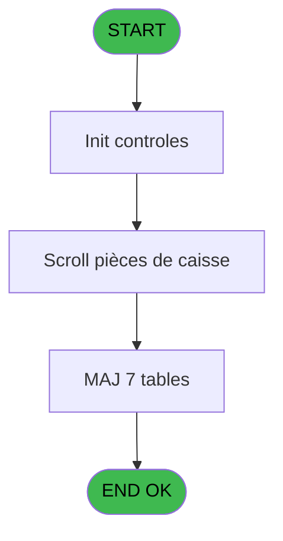
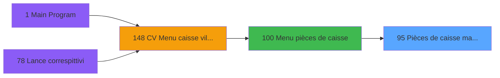
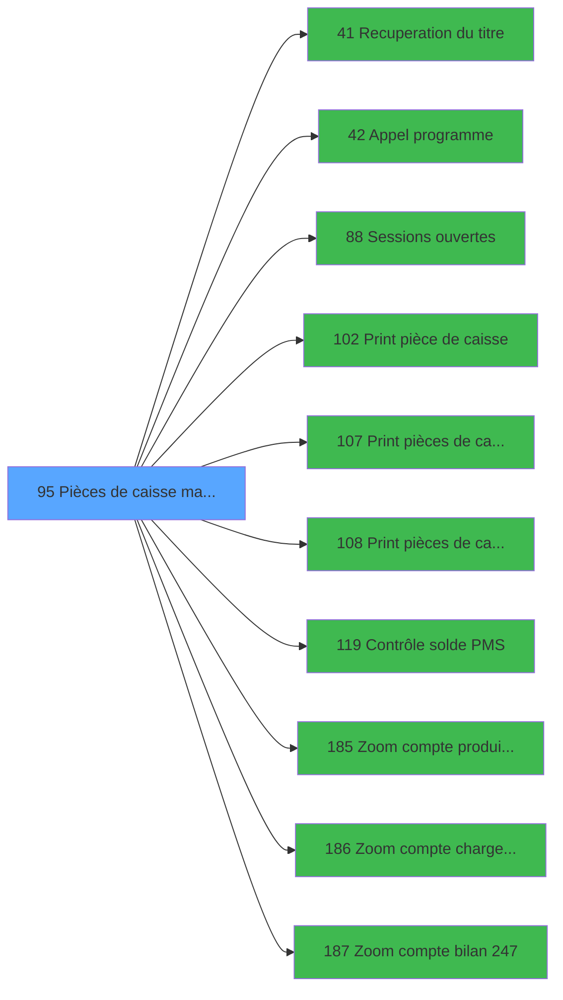

# VIL IDE 95 - Pièces de caisse manuelles

> **Analyse**: Phases 1-4 2026-02-03 09:19 -> 09:19 (19s) | Assemblage 09:19
> **Pipeline**: V7.2 Enrichi
> **Structure**: 4 onglets (Resume | Ecrans | Donnees | Connexions)

<!-- TAB:Resume -->

## 1. FICHE D'IDENTITE

| Attribut | Valeur |
|----------|--------|
| Projet | VIL |
| IDE Position | 95 |
| Nom Programme | Pièces de caisse manuelles |
| Fichier source | `Prg_95.xml` |
| Domaine metier | Caisse |
| Taches | 24 (4 ecrans visibles) |
| Tables modifiees | 7 |
| Programmes appeles | 10 |

## 2. DESCRIPTION FONCTIONNELLE

**Pièces de caisse manuelles** assure la gestion complete de ce processus, accessible depuis [Menu pièces de caisse (IDE 100)](VIL-IDE-100.md).

Le flux de traitement s'organise en **5 blocs fonctionnels** :

- **Traitement** (17 taches) : traitements metier divers
- **Consultation** (3 taches) : ecrans de recherche, selection et consultation
- **Calcul** (2 taches) : calculs de montants, stocks ou compteurs
- **Saisie** (1 tache) : ecrans de saisie utilisateur (formulaires, champs, donnees)
- **Creation** (1 tache) : insertion d'enregistrements en base (mouvements, prestations)

**Donnees modifiees** : 7 tables en ecriture (reseau_cloture___rec, pieces_caisse____pks, compteurs________cpt, complement_pieces_de_caisse, detail_coffre, histo_ajustement_solde, suivi_pdc).

Detail : phases du traitement

#### Phase 1 : Traitement (17 taches)

- **95** - Pièces de caisse **[[ECRAN]](#ecran-t1)**
- **95.1** - Test si cloture en cours
- **95.1.1** - Blocage cloture v1
- **95.2** - Scroll articles **[[ECRAN]](#ecran-t4)**
- **95.2.3** - Change
- **95.2.4** - groupe du user
- **95.3.1.2** - Complement PDC
- **95.3.1.2.1** - histo ajustement
- **95.3.1.2.1.1** - solde coffre
- **95.3.1.2.1.2** - solde pms
- **95.3.1.2.2** - update solde coffre
- **95.3.1.3** - Update suivi PDC
- **95.3.3** - MàJ pièce annulee
- **95.5** - Deblocage cloture v1
- **95.6** - param caisse
- **95.1.2** - Blocage cloture v1
- **95.7** - Deblocage cloture v1

Delegue a : [Recuperation du titre (IDE 41)](VIL-IDE-41.md), [Appel programme (IDE 42)](VIL-IDE-42.md), [Sessions ouvertes (IDE 88)](VIL-IDE-88.md), [Contrôle solde PMS (IDE 119)](VIL-IDE-119.md)

#### Phase 2 : Consultation (3 taches)

- **95.2.1** - Date recherchee **[[ECRAN]](#ecran-t5)**
- **95.2.2** - Selection par imputation **[[ECRAN]](#ecran-t6)**
- **95.3.2** - Affichage annulation **[[ECRAN]](#ecran-t18)**

Delegue a : [Recuperation du titre (IDE 41)](VIL-IDE-41.md), [Zoom compte produit 245 (IDE 185)](VIL-IDE-185.md), [Zoom compte charge 246 (IDE 186)](VIL-IDE-186.md), [Zoom compte bilan 247 (IDE 187)](VIL-IDE-187.md)

#### Phase 3 : Saisie (1 tache)

- **95.3** - Saisie PDC **[[ECRAN]](#ecran-t9)**

#### Phase 4 : Creation (1 tache)

- **95.3.1** - Creation change

#### Phase 5 : Calcul (2 taches)

- **95.3.1.1** - Recup compteur
- **95.4** - Lecture date comptable

Delegue a : [Contrôle solde PMS (IDE 119)](VIL-IDE-119.md), [Zoom compte produit 245 (IDE 185)](VIL-IDE-185.md), [Zoom compte charge 246 (IDE 186)](VIL-IDE-186.md), [Zoom compte bilan 247 (IDE 187)](VIL-IDE-187.md)

#### Tables impactees

| Table | Operations | Role metier |
|-------|-----------|-------------|
| reseau_cloture___rec | R/**W** (5 usages) | Donnees reseau/cloture |
| pieces_caisse____pks | R/**W** (5 usages) | Sessions de caisse |
| complement_pieces_de_caisse | **W**/L (3 usages) | Sessions de caisse |
| detail_coffre | R/**W** (2 usages) | Etat du coffre |
| suivi_pdc | **W** (1 usages) |  |
| histo_ajustement_solde | **W** (1 usages) | Historique / journal |
| compteurs________cpt | **W** (1 usages) | Comptes GM (generaux) |

## 3. BLOCS FONCTIONNELS

### 3.1 Traitement (17 taches)

Traitements internes.

---

#### 95 - Pièces de caisse [[ECRAN]](#ecran-t1)

**Role** : Tache d'orchestration : point d'entree du programme (17 sous-taches). Coordonne l'enchainement des traitements.
**Ecran** : 197 x 34 DLU (MDI) | [Voir mockup](#ecran-t1)

16 sous-taches directes

| Tache | Nom | Bloc |
|-------|-----|------|
| [95.1](#t2) | Test si cloture en cours | Traitement |
| [95.1.1](#t3) | Blocage cloture v1 | Traitement |
| [95.2](#t4) | Scroll articles **[[ECRAN]](#ecran-t4)** | Traitement |
| [95.2.3](#t7) | Change | Traitement |
| [95.2.4](#t8) | groupe du user | Traitement |
| [95.3.1.2](#t12) | Complement PDC | Traitement |
| [95.3.1.2.1](#t13) | histo ajustement | Traitement |
| [95.3.1.2.1.1](#t14) | solde coffre | Traitement |
| [95.3.1.2.1.2](#t15) | solde pms | Traitement |
| [95.3.1.2.2](#t16) | update solde coffre | Traitement |
| [95.3.1.3](#t17) | Update suivi PDC | Traitement |
| [95.3.3](#t20) | MàJ pièce annulee | Traitement |
| [95.5](#t23) | Deblocage cloture v1 | Traitement |
| [95.6](#t24) | param caisse | Traitement |
| [95.1.2](#t27) | Blocage cloture v1 | Traitement |
| [95.7](#t30) | Deblocage cloture v1 | Traitement |

---

#### 95.1 - Test si cloture en cours

**Role** : Verification : Test si cloture en cours.
**Variables liees** : Q (W0 mode cloture auto)

---

#### 95.1.1 - Blocage cloture v1

**Role** : Traitement : Blocage cloture v1.
**Variables liees** : Q (W0 mode cloture auto)

---

#### 95.2 - Scroll articles [[ECRAN]](#ecran-t4)

**Role** : Traitement : Scroll articles.
**Ecran** : 1285 x 258 DLU (MDI) | [Voir mockup](#ecran-t4)
**Variables liees** : J (V0 cle-scroll)

---

#### 95.2.3 - Change

**Role** : Traitement : Change.

---

#### 95.2.4 - groupe du user

**Role** : Traitement : groupe du user.

---

#### 95.3.1.2 - Complement PDC

**Role** : Traitement : Complement PDC.

---

#### 95.3.1.2.1 - histo ajustement

**Role** : Traitement : histo ajustement.

---

#### 95.3.1.2.1.1 - solde coffre

**Role** : Consultation/chargement : solde coffre.
**Variables liees** : M (W0 ecart solde), N (W0 ecart coffre)

---

#### 95.3.1.2.1.2 - solde pms

**Role** : Consultation/chargement : solde pms.
**Variables liees** : M (W0 ecart solde)

---

#### 95.3.1.2.2 - update solde coffre

**Role** : Consultation/chargement : update solde coffre.
**Variables liees** : M (W0 ecart solde), N (W0 ecart coffre)

---

#### 95.3.1.3 - Update suivi PDC

**Role** : Traitement : Update suivi PDC.

---

#### 95.3.3 - MàJ pièce annulee

**Role** : Traitement : MàJ pièce annulee.
**Variables liees** : F (W0 numero pièce)

---

#### 95.5 - Deblocage cloture v1

**Role** : Traitement : Deblocage cloture v1.
**Variables liees** : Q (W0 mode cloture auto)

---

#### 95.6 - param caisse

**Role** : Traitement : param caisse.

---

#### 95.1.2 - Blocage cloture v1

**Role** : Traitement : Blocage cloture v1.
**Variables liees** : Q (W0 mode cloture auto)

---

#### 95.7 - Deblocage cloture v1

**Role** : Traitement : Deblocage cloture v1.
**Variables liees** : Q (W0 mode cloture auto)

### 3.2 Consultation (3 taches)

Ecrans de recherche et consultation.

---

#### 95.2.1 - Date recherchee [[ECRAN]](#ecran-t5)

**Role** : Traitement : Date recherchee.
**Ecran** : 413 x 66 DLU (MDI) | [Voir mockup](#ecran-t5)
**Variables liees** : D (P0 date compt. jour), G (W0 date comptable)

---

#### 95.2.2 - Selection par imputation [[ECRAN]](#ecran-t6)

**Role** : Selection par l'operateur : Selection par imputation.
**Ecran** : 403 x 63 DLU (MDI) | [Voir mockup](#ecran-t6)
**Variables liees** : H (W0 imputation)

---

#### 95.3.2 - Affichage annulation [[ECRAN]](#ecran-t18)

**Role** : Reinitialisation : Affichage annulation.
**Ecran** : 312 x 64 DLU (Modal) | [Voir mockup](#ecran-t18)

### 3.3 Saisie (1 tache)

L'operateur saisit les donnees de la transaction via 1 ecran (Saisie PDC).

---

#### 95.3 - Saisie PDC [[ECRAN]](#ecran-t9)

**Role** : Saisie des donnees : Saisie PDC.
**Ecran** : 875 x 183 DLU (MDI) | [Voir mockup](#ecran-t9)

### 3.4 Creation (1 tache)

Insertion de nouveaux enregistrements en base.

---

#### 95.3.1 - Creation change

**Role** : Creation d'enregistrement : Creation change.

### 3.5 Calcul (2 taches)

Calculs metier : montants, stocks, compteurs.

---

#### 95.3.1.1 - Recup compteur

**Role** : Calcul : Recup compteur.
**Delegue a** : [Zoom compte produit 245 (IDE 185)](VIL-IDE-185.md), [Zoom compte charge 246 (IDE 186)](VIL-IDE-186.md), [Zoom compte bilan 247 (IDE 187)](VIL-IDE-187.md)

---

#### 95.4 - Lecture date comptable

**Role** : Traitement : Lecture date comptable.
**Variables liees** : D (P0 date compt. jour), G (W0 date comptable)
**Delegue a** : [Zoom compte produit 245 (IDE 185)](VIL-IDE-185.md), [Zoom compte charge 246 (IDE 186)](VIL-IDE-186.md), [Zoom compte bilan 247 (IDE 187)](VIL-IDE-187.md)

## 5. REGLES METIER

*(Aucune regle metier identifiee)*

## 6. CONTEXTE

- **Appele par**: [Menu pièces de caisse (IDE 100)](VIL-IDE-100.md)
- **Appelle**: 10 programmes | **Tables**: 13 (W:7 R:8 L:3) | **Taches**: 24 | **Expressions**: 16

<!-- TAB:Ecrans -->

## 8. ECRANS

### 8.1 Forms visibles (4 / 24)

| # | Position | Tache | Nom | Type | Largeur | Hauteur | Bloc |
|---|----------|-------|-----|------|---------|---------|------|
| 1 | 95.2 | 95.2 | Scroll articles | MDI | 1285 | 258 | Traitement |
| 2 | 95.2.1 | 95.2.1 | Date recherchee | MDI | 413 | 66 | Consultation |
| 3 | 95.2.2 | 95.2.2 | Selection par imputation | MDI | 403 | 63 | Consultation |
| 4 | 95.3 | 95.3 | Saisie PDC | MDI | 875 | 183 | Saisie |

### 8.2 Mockups Ecrans

---

#### 95.2 - Scroll articles
**Tache** : [95.2](#t4) | **Type** : MDI | **Dimensions** : 1285 x 258 DLU
**Bloc** : Traitement | **Titre IDE** : Scroll articles

<!-- FORM-DATA:
{
    "width":  1285,
    "vFactor":  8,
    "type":  "MDI",
    "hFactor":  8,
    "controls":  [
                     {
                         "x":  0,
                         "type":  "label",
                         "var":  "",
                         "y":  1,
                         "w":  1283,
                         "fmt":  "",
                         "name":  "",
                         "h":  17,
                         "color":  "",
                         "text":  "",
                         "parent":  null
                     },
                     {
                         "x":  6,
                         "type":  "table",
                         "var":  "",
                         "name":  "",
                         "titleH":  12,
                         "color":  "110",
                         "w":  1272,
                         "y":  22,
                         "fmt":  "",
                         "parent":  null,
                         "text":  "",
                         "rowH":  13,
                         "h":  123,
                         "cols":  [
                                      {
                                          "title":  "Date comptable",
                                          "layer":  1,
                                          "w":  136
                                      },
                                      {
                                          "title":  "N° pièce",
                                          "layer":  2,
                                          "w":  92
                                      },
                                      {
                                          "title":  "Libellé",
                                          "layer":  3,
                                          "w":  246
                                      },
                                      {
                                          "title":  "Montant",
                                          "layer":  4,
                                          "w":  201
                                      },
                                      {
                                          "title":  "Imputation",
                                          "layer":  5,
                                          "w":  129
                                      },
                                      {
                                          "title":  "Recette/Dépense",
                                          "layer":  6,
                                          "w":  156
                                      },
                                      {
                                          "title":  "Auto",
                                          "layer":  7,
                                          "w":  50
                                      },
                                      {
                                          "title":  "Service",
                                          "layer":  8,
                                          "w":  85
                                      },
                                      {
                                          "title":  "Terminal",
                                          "layer":  9,
                                          "w":  81
                                      },
                                      {
                                          "title":  "Accord",
                                          "layer":  10,
                                          "w":  63
                                      }
                                  ],
                         "rows":  10
                     },
                     {
                         "x":  90,
                         "type":  "label",
                         "var":  "",
                         "y":  149,
                         "w":  143,
                         "fmt":  "",
                         "name":  "",
                         "h":  8,
                         "color":  "7",
                         "text":  "Libellé long",
                         "parent":  null
                     },
                     {
                         "x":  393,
                         "type":  "label",
                         "var":  "",
                         "y":  160,
                         "w":  633,
                         "fmt":  "",
                         "name":  "",
                         "h":  72,
                         "color":  "",
                         "text":  "",
                         "parent":  null
                     },
                     {
                         "x":  393,
                         "type":  "label",
                         "var":  "",
                         "y":  160,
                         "w":  631,
                         "fmt":  "",
                         "name":  "",
                         "h":  72,
                         "color":  "",
                         "text":  "",
                         "parent":  null
                     },
                     {
                         "x":  403,
                         "type":  "label",
                         "var":  "",
                         "y":  164,
                         "w":  301,
                         "fmt":  "",
                         "name":  "",
                         "h":  52,
                         "color":  "",
                         "text":  "",
                         "parent":  null
                     },
                     {
                         "x":  703,
                         "type":  "label",
                         "var":  "",
                         "y":  164,
                         "w":  311,
                         "fmt":  "",
                         "name":  "",
                         "h":  52,
                         "color":  "",
                         "text":  "",
                         "parent":  null
                     },
                     {
                         "x":  407,
                         "type":  "label",
                         "var":  "",
                         "y":  165,
                         "w":  47,
                         "fmt":  "",
                         "name":  "",
                         "h":  51,
                         "color":  "",
                         "text":  "",
                         "parent":  null
                     },
                     {
                         "x":  705,
                         "type":  "label",
                         "var":  "",
                         "y":  165,
                         "w":  47,
                         "fmt":  "",
                         "name":  "",
                         "h":  51,
                         "color":  "",
                         "text":  "",
                         "parent":  null
                     },
                     {
                         "x":  459,
                         "type":  "label",
                         "var":  "",
                         "y":  168,
                         "w":  240,
                         "fmt":  "",
                         "name":  "",
                         "h":  8,
                         "color":  "7",
                         "text":  "Création",
                         "parent":  null
                     },
                     {
                         "x":  758,
                         "type":  "label",
                         "var":  "",
                         "y":  168,
                         "w":  240,
                         "fmt":  "",
                         "name":  "",
                         "h":  8,
                         "color":  "7",
                         "text":  "Impression par imputation",
                         "parent":  null
                     },
                     {
                         "x":  459,
                         "type":  "label",
                         "var":  "",
                         "y":  180,
                         "w":  240,
                         "fmt":  "",
                         "name":  "",
                         "h":  8,
                         "color":  "7",
                         "text":  "Modification",
                         "parent":  null
                     },
                     {
                         "x":  758,
                         "type":  "label",
                         "var":  "",
                         "y":  180,
                         "w":  240,
                         "fmt":  "",
                         "name":  "",
                         "h":  8,
                         "color":  "7",
                         "text":  "Sélection imputation",
                         "parent":  null
                     },
                     {
                         "x":  459,
                         "type":  "label",
                         "var":  "",
                         "y":  192,
                         "w":  240,
                         "fmt":  "",
                         "name":  "",
                         "h":  8,
                         "color":  "7",
                         "text":  "Annulation",
                         "parent":  null
                     },
                     {
                         "x":  758,
                         "type":  "label",
                         "var":  "",
                         "y":  192,
                         "w":  240,
                         "fmt":  "",
                         "name":  "",
                         "h":  8,
                         "color":  "7",
                         "text":  "Impression par date",
                         "parent":  null
                     },
                     {
                         "x":  459,
                         "type":  "label",
                         "var":  "",
                         "y":  204,
                         "w":  240,
                         "fmt":  "",
                         "name":  "",
                         "h":  8,
                         "color":  "7",
                         "text":  "Recherche date",
                         "parent":  null
                     },
                     {
                         "x":  758,
                         "type":  "label",
                         "var":  "",
                         "y":  204,
                         "w":  240,
                         "fmt":  "",
                         "name":  "",
                         "h":  8,
                         "color":  "7",
                         "text":  "Impression",
                         "parent":  null
                     },
                     {
                         "x":  576,
                         "type":  "label",
                         "var":  "",
                         "y":  218,
                         "w":  195,
                         "fmt":  "",
                         "name":  "",
                         "h":  10,
                         "color":  "",
                         "text":  "Choix de l\u0027action",
                         "parent":  24
                     },
                     {
                         "x":  0,
                         "type":  "label",
                         "var":  "",
                         "y":  235,
                         "w":  1283,
                         "fmt":  "",
                         "name":  "",
                         "h":  23,
                         "color":  "",
                         "text":  "",
                         "parent":  null
                     },
                     {
                         "x":  160,
                         "type":  "edit",
                         "var":  "",
                         "y":  36,
                         "w":  64,
                         "fmt":  "",
                         "name":  "",
                         "h":  8,
                         "color":  "110",
                         "text":  "",
                         "parent":  4
                     },
                     {
                         "x":  14,
                         "type":  "edit",
                         "var":  "",
                         "y":  36,
                         "w":  123,
                         "fmt":  "DD/MM/YYYYZ",
                         "name":  "",
                         "h":  8,
                         "color":  "110",
                         "text":  "",
                         "parent":  4
                     },
                     {
                         "x":  883,
                         "type":  "edit",
                         "var":  "",
                         "y":  36,
                         "w":  19,
                         "fmt":  "",
                         "name":  "",
                         "h":  8,
                         "color":  "110",
                         "text":  "",
                         "parent":  4
                     },
                     {
                         "x":  243,
                         "type":  "edit",
                         "var":  "",
                         "y":  36,
                         "w":  232,
                         "fmt":  "",
                         "name":  "",
                         "h":  8,
                         "color":  "110",
                         "text":  "",
                         "parent":  4
                     },
                     {
                         "x":  490,
                         "type":  "edit",
                         "var":  "",
                         "y":  36,
                         "w":  192,
                         "fmt":  "N## ### ### ###.###Z",
                         "name":  "",
                         "h":  8,
                         "color":  "110",
                         "text":  "",
                         "parent":  4
                     },
                     {
                         "x":  690,
                         "type":  "edit",
                         "var":  "",
                         "y":  36,
                         "w":  120,
                         "fmt":  "",
                         "name":  "",
                         "h":  8,
                         "color":  "110",
                         "text":  "",
                         "parent":  4
                     },
                     {
                         "x":  260,
                         "type":  "edit",
                         "var":  "",
                         "y":  149,
                         "w":  722,
                         "fmt":  "",
                         "name":  "",
                         "h":  8,
                         "color":  "",
                         "text":  "",
                         "parent":  null
                     },
                     {
                         "x":  1022,
                         "type":  "edit",
                         "var":  "",
                         "y":  36,
                         "w":  78,
                         "fmt":  "",
                         "name":  "",
                         "h":  8,
                         "color":  "110",
                         "text":  "",
                         "parent":  4
                     },
                     {
                         "x":  778,
                         "type":  "edit",
                         "var":  "",
                         "y":  218,
                         "w":  26,
                         "fmt":  "UA",
                         "name":  "W1 choix action",
                         "h":  10,
                         "color":  "6",
                         "text":  "",
                         "parent":  24
                     },
                     {
                         "x":  236,
                         "type":  "button",
                         "var":  "",
                         "y":  238,
                         "w":  240,
                         "fmt":  "",
                         "name":  "Bouton controle solde PMS",
                         "h":  18,
                         "color":  "",
                         "text":  "",
                         "parent":  null
                     },
                     {
                         "x":  11,
                         "type":  "edit",
                         "var":  "",
                         "y":  4,
                         "w":  395,
                         "fmt":  "30",
                         "name":  "",
                         "h":  8,
                         "color":  "",
                         "text":  "",
                         "parent":  1
                     },
                     {
                         "x":  1080,
                         "type":  "edit",
                         "var":  "",
                         "y":  4,
                         "w":  203,
                         "fmt":  "WWW DD MMM YYYYZ",
                         "name":  "",
                         "h":  8,
                         "color":  "",
                         "text":  "",
                         "parent":  1
                     },
                     {
                         "x":  979,
                         "type":  "checkbox",
                         "var":  "",
                         "y":  36,
                         "w":  30,
                         "fmt":  "",
                         "name":  "",
                         "h":  8,
                         "color":  "110",
                         "text":  "",
                         "parent":  4
                     },
                     {
                         "x":  1107,
                         "type":  "edit",
                         "var":  "",
                         "y":  36,
                         "w":  48,
                         "fmt":  "3Z",
                         "name":  "",
                         "h":  8,
                         "color":  "110",
                         "text":  "",
                         "parent":  4
                     },
                     {
                         "x":  90,
                         "type":  "image",
                         "var":  "",
                         "y":  164,
                         "w":  143,
                         "fmt":  "",
                         "name":  "",
                         "h":  63,
                         "color":  "",
                         "text":  "",
                         "parent":  null
                     },
                     {
                         "x":  418,
                         "type":  "button",
                         "var":  "",
                         "y":  168,
                         "w":  26,
                         "fmt":  "C",
                         "name":  "C",
                         "h":  9,
                         "color":  "",
                         "text":  "",
                         "parent":  null
                     },
                     {
                         "x":  715,
                         "type":  "button",
                         "var":  "",
                         "y":  168,
                         "w":  26,
                         "fmt":  "I",
                         "name":  "I",
                         "h":  9,
                         "color":  "",
                         "text":  "",
                         "parent":  null
                     },
                     {
                         "x":  418,
                         "type":  "button",
                         "var":  "",
                         "y":  180,
                         "w":  26,
                         "fmt":  "M",
                         "name":  "M",
                         "h":  9,
                         "color":  "",
                         "text":  "",
                         "parent":  null
                     },
                     {
                         "x":  715,
                         "type":  "button",
                         "var":  "",
                         "y":  180,
                         "w":  26,
                         "fmt":  "S",
                         "name":  "S",
                         "h":  9,
                         "color":  "",
                         "text":  "",
                         "parent":  null
                     },
                     {
                         "x":  418,
                         "type":  "button",
                         "var":  "",
                         "y":  192,
                         "w":  26,
                         "fmt":  "A",
                         "name":  "A",
                         "h":  9,
                         "color":  "",
                         "text":  "",
                         "parent":  null
                     },
                     {
                         "x":  715,
                         "type":  "button",
                         "var":  "",
                         "y":  192,
                         "w":  26,
                         "fmt":  "D",
                         "name":  "D",
                         "h":  9,
                         "color":  "",
                         "text":  "",
                         "parent":  null
                     },
                     {
                         "x":  418,
                         "type":  "button",
                         "var":  "",
                         "y":  204,
                         "w":  26,
                         "fmt":  "R",
                         "name":  "R",
                         "h":  9,
                         "color":  "",
                         "text":  "",
                         "parent":  null
                     },
                     {
                         "x":  715,
                         "type":  "button",
                         "var":  "",
                         "y":  204,
                         "w":  26,
                         "fmt":  "P",
                         "name":  "P",
                         "h":  9,
                         "color":  "",
                         "text":  "",
                         "parent":  null
                     },
                     {
                         "x":  5,
                         "type":  "button",
                         "var":  "",
                         "y":  238,
                         "w":  160,
                         "fmt":  "\u0026Quitter",
                         "name":  "",
                         "h":  18,
                         "color":  "",
                         "text":  "",
                         "parent":  null
                     },
                     {
                         "x":  1201,
                         "type":  "checkbox",
                         "var":  "",
                         "y":  37,
                         "w":  32,
                         "fmt":  "",
                         "name":  "pks_autorisation",
                         "h":  9,
                         "color":  "110",
                         "text":  "",
                         "parent":  4
                     }
                 ],
    "taskId":  "95.2",
    "height":  258
}
-->

<strong>Champs : 14 champs</strong>

| Pos (x,y) | Nom | Variable | Type |
|-----------|-----|----------|------|
| 160,36 | (sans nom) | - | edit |
| 14,36 | DD/MM/YYYYZ | - | edit |
| 883,36 | (sans nom) | - | edit |
| 243,36 | (sans nom) | - | edit |
| 490,36 | N## ### ### ###.###Z | - | edit |
| 690,36 | (sans nom) | - | edit |
| 260,149 | (sans nom) | - | edit |
| 1022,36 | (sans nom) | - | edit |
| 778,218 | W1 choix action | - | edit |
| 11,4 | 30 | - | edit |
| 1080,4 | WWW DD MMM YYYYZ | - | edit |
| 979,36 | (sans nom) | - | checkbox |
| 1107,36 | 3Z | - | edit |
| 1201,37 | pks_autorisation | - | checkbox |

<strong>Boutons : 10 boutons</strong>

| Bouton | Pos (x,y) | Action |
|--------|-----------|--------|
| controle solde PMS | 236,238 | Appel [Contrôle solde PMS (IDE 119)](VIL-IDE-119.md) |
| C | 418,168 | Bouton fonctionnel |
| I | 715,168 | Bouton fonctionnel |
| M | 418,180 | Bouton fonctionnel |
| S | 715,180 | Bouton fonctionnel |
| A | 418,192 | Bouton fonctionnel |
| D | 715,192 | Bouton fonctionnel |
| R | 418,204 | Bouton fonctionnel |
| P | 715,204 | Bouton fonctionnel |
| Quitter | 5,238 | Quitte le programme |

---

#### 95.2.1 - Date recherchee
**Tache** : [95.2.1](#t5) | **Type** : MDI | **Dimensions** : 413 x 66 DLU
**Bloc** : Consultation | **Titre IDE** : Date recherchee

<!-- FORM-DATA:
{
    "width":  413,
    "vFactor":  8,
    "type":  "MDI",
    "hFactor":  8,
    "controls":  [
                     {
                         "x":  0,
                         "type":  "label",
                         "var":  "",
                         "y":  2,
                         "w":  412,
                         "fmt":  "",
                         "name":  "",
                         "h":  38,
                         "color":  "",
                         "text":  "",
                         "parent":  null
                     },
                     {
                         "x":  0,
                         "type":  "label",
                         "var":  "",
                         "y":  41,
                         "w":  412,
                         "fmt":  "",
                         "name":  "",
                         "h":  24,
                         "color":  "",
                         "text":  "",
                         "parent":  null
                     },
                     {
                         "x":  184,
                         "type":  "edit",
                         "var":  "",
                         "y":  15,
                         "w":  126,
                         "fmt":  "DD/MM/YYYYA",
                         "name":  "",
                         "h":  10,
                         "color":  "6",
                         "text":  "",
                         "parent":  null
                     },
                     {
                         "x":  27,
                         "type":  "button",
                         "var":  "",
                         "y":  44,
                         "w":  160,
                         "fmt":  "\u0026Ok",
                         "name":  "",
                         "h":  18,
                         "color":  "",
                         "text":  "",
                         "parent":  null
                     },
                     {
                         "x":  218,
                         "type":  "button",
                         "var":  "",
                         "y":  44,
                         "w":  160,
                         "fmt":  "\u0026Abandonner",
                         "name":  "",
                         "h":  18,
                         "color":  "",
                         "text":  "",
                         "parent":  null
                     },
                     {
                         "x":  51,
                         "type":  "image",
                         "var":  "",
                         "y":  5,
                         "w":  86,
                         "fmt":  "",
                         "name":  "",
                         "h":  32,
                         "color":  "",
                         "text":  "",
                         "parent":  1
                     }
                 ],
    "taskId":  "95.2.1",
    "height":  66
}
-->

<strong>Champs : 1 champs</strong>

| Pos (x,y) | Nom | Variable | Type |
|-----------|-----|----------|------|
| 184,15 | DD/MM/YYYYA | - | edit |

<strong>Boutons : 2 boutons</strong>

| Bouton | Pos (x,y) | Action |
|--------|-----------|--------|
| Ok | 27,44 | Valide la saisie et enregistre |
| Abandonner | 218,44 | Annule et retour au menu |

---

#### 95.2.2 - Selection par imputation
**Tache** : [95.2.2](#t6) | **Type** : MDI | **Dimensions** : 403 x 63 DLU
**Bloc** : Consultation | **Titre IDE** : Selection par imputation

<!-- FORM-DATA:
{
    "width":  403,
    "vFactor":  8,
    "type":  "MDI",
    "hFactor":  8,
    "controls":  [
                     {
                         "x":  1,
                         "type":  "label",
                         "var":  "",
                         "y":  0,
                         "w":  402,
                         "fmt":  "",
                         "name":  "",
                         "h":  38,
                         "color":  "",
                         "text":  "",
                         "parent":  null
                     },
                     {
                         "x":  1,
                         "type":  "label",
                         "var":  "",
                         "y":  39,
                         "w":  402,
                         "fmt":  "",
                         "name":  "",
                         "h":  24,
                         "color":  "",
                         "text":  "",
                         "parent":  null
                     },
                     {
                         "x":  190,
                         "type":  "edit",
                         "var":  "",
                         "y":  13,
                         "w":  126,
                         "fmt":  "",
                         "name":  "",
                         "h":  10,
                         "color":  "6",
                         "text":  "",
                         "parent":  null
                     },
                     {
                         "x":  31,
                         "type":  "button",
                         "var":  "",
                         "y":  42,
                         "w":  160,
                         "fmt":  "\u0026Ok",
                         "name":  "",
                         "h":  18,
                         "color":  "",
                         "text":  "",
                         "parent":  null
                     },
                     {
                         "x":  222,
                         "type":  "button",
                         "var":  "",
                         "y":  42,
                         "w":  160,
                         "fmt":  "A\u0026bandonner",
                         "name":  "",
                         "h":  18,
                         "color":  "",
                         "text":  "",
                         "parent":  null
                     },
                     {
                         "x":  53,
                         "type":  "image",
                         "var":  "",
                         "y":  3,
                         "w":  86,
                         "fmt":  "",
                         "name":  "",
                         "h":  32,
                         "color":  "",
                         "text":  "",
                         "parent":  null
                     }
                 ],
    "taskId":  "95.2.2",
    "height":  63
}
-->

<strong>Champs : 1 champs</strong>

| Pos (x,y) | Nom | Variable | Type |
|-----------|-----|----------|------|
| 190,13 | (sans nom) | - | edit |

<strong>Boutons : 2 boutons</strong>

| Bouton | Pos (x,y) | Action |
|--------|-----------|--------|
| Ok | 31,42 | Valide la saisie et enregistre |
| Abandonner | 222,42 | Annule et retour au menu |

---

#### 95.3 - Saisie PDC
**Tache** : [95.3](#t9) | **Type** : MDI | **Dimensions** : 875 x 183 DLU
**Bloc** : Saisie | **Titre IDE** : Saisie PDC

<!-- FORM-DATA:
{
    "width":  875,
    "vFactor":  8,
    "type":  "MDI",
    "hFactor":  8,
    "controls":  [
                     {
                         "x":  0,
                         "type":  "label",
                         "var":  "",
                         "y":  0,
                         "w":  874,
                         "fmt":  "",
                         "name":  "",
                         "h":  17,
                         "color":  "",
                         "text":  "",
                         "parent":  null
                     },
                     {
                         "x":  28,
                         "type":  "label",
                         "var":  "",
                         "y":  21,
                         "w":  818,
                         "fmt":  "",
                         "name":  "",
                         "h":  104,
                         "color":  "",
                         "text":  "",
                         "parent":  null
                     },
                     {
                         "x":  589,
                         "type":  "label",
                         "var":  "",
                         "y":  27,
                         "w":  234,
                         "fmt":  "",
                         "name":  "",
                         "h":  8,
                         "color":  "143",
                         "text":  "Pièce de caisse automatique",
                         "parent":  4
                     },
                     {
                         "x":  46,
                         "type":  "label",
                         "var":  "",
                         "y":  43,
                         "w":  88,
                         "fmt":  "",
                         "name":  "",
                         "h":  8,
                         "color":  "",
                         "text":  "Libellé",
                         "parent":  null
                     },
                     {
                         "x":  48,
                         "type":  "label",
                         "var":  "",
                         "y":  75,
                         "w":  129,
                         "fmt":  "",
                         "name":  "",
                         "h":  8,
                         "color":  "",
                         "text":  "Reçu",
                         "parent":  null
                     },
                     {
                         "x":  190,
                         "type":  "label",
                         "var":  "",
                         "y":  94,
                         "w":  129,
                         "fmt":  "",
                         "name":  "",
                         "h":  8,
                         "color":  "",
                         "text":  "Imputation",
                         "parent":  null
                     },
                     {
                         "x":  190,
                         "type":  "label",
                         "var":  "",
                         "y":  110,
                         "w":  129,
                         "fmt":  "",
                         "name":  "",
                         "h":  8,
                         "color":  "",
                         "text":  "Montant",
                         "parent":  null
                     },
                     {
                         "x":  360,
                         "type":  "label",
                         "var":  "",
                         "y":  145,
                         "w":  154,
                         "fmt":  "",
                         "name":  "",
                         "h":  8,
                         "color":  "143",
                         "text":  "Annulation",
                         "parent":  null
                     },
                     {
                         "x":  0,
                         "type":  "label",
                         "var":  "",
                         "y":  158,
                         "w":  874,
                         "fmt":  "",
                         "name":  "",
                         "h":  24,
                         "color":  "",
                         "text":  "",
                         "parent":  null
                     },
                     {
                         "x":  46,
                         "type":  "combobox",
                         "var":  "",
                         "y":  25,
                         "w":  129,
                         "fmt":  "",
                         "name":  "W1 recette/depense",
                         "h":  12,
                         "color":  "110",
                         "text":  "Recette,Dépense",
                         "parent":  null
                     },
                     {
                         "x":  190,
                         "type":  "combobox",
                         "var":  "",
                         "y":  25,
                         "w":  129,
                         "fmt":  "",
                         "name":  "W1 compte BCP",
                         "h":  12,
                         "color":  "110",
                         "text":  "",
                         "parent":  null
                     },
                     {
                         "x":  341,
                         "type":  "combobox",
                         "var":  "",
                         "y":  25,
                         "w":  240,
                         "fmt":  "",
                         "name":  "W1 Qualif correction solde",
                         "h":  12,
                         "color":  "110",
                         "text":  "1 Ajustement coffre,2 Ajustement solde PMS",
                         "parent":  null
                     },
                     {
                         "x":  46,
                         "type":  "edit",
                         "var":  "",
                         "y":  56,
                         "w":  779,
                         "fmt":  "U64",
                         "name":  "W1 libelle",
                         "h":  10,
                         "color":  "6",
                         "text":  "",
                         "parent":  null
                     },
                     {
                         "x":  186,
                         "type":  "edit",
                         "var":  "",
                         "y":  75,
                         "w":  384,
                         "fmt":  "",
                         "name":  "W1 Recu",
                         "h":  10,
                         "color":  "6",
                         "text":  "",
                         "parent":  null
                     },
                     {
                         "x":  328,
                         "type":  "edit",
                         "var":  "",
                         "y":  92,
                         "w":  182,
                         "fmt":  "",
                         "name":  "W1 imputation",
                         "h":  10,
                         "color":  "6",
                         "text":  "",
                         "parent":  null
                     },
                     {
                         "x":  328,
                         "type":  "edit",
                         "var":  "",
                         "y":  108,
                         "w":  182,
                         "fmt":  "15",
                         "name":  "W1 montant",
                         "h":  10,
                         "color":  "6",
                         "text":  "",
                         "parent":  null
                     },
                     {
                         "x":  705,
                         "type":  "button",
                         "var":  "",
                         "y":  161,
                         "w":  160,
                         "fmt":  "\u0026Ok",
                         "name":  "Bouton ok",
                         "h":  18,
                         "color":  "",
                         "text":  "",
                         "parent":  null
                     },
                     {
                         "x":  11,
                         "type":  "edit",
                         "var":  "",
                         "y":  3,
                         "w":  395,
                         "fmt":  "30",
                         "name":  "",
                         "h":  8,
                         "color":  "",
                         "text":  "",
                         "parent":  1
                     },
                     {
                         "x":  662,
                         "type":  "edit",
                         "var":  "",
                         "y":  4,
                         "w":  203,
                         "fmt":  "WWW DD MMM YYYYZ",
                         "name":  "",
                         "h":  8,
                         "color":  "",
                         "text":  "",
                         "parent":  1
                     },
                     {
                         "x":  28,
                         "type":  "edit",
                         "var":  "",
                         "y":  129,
                         "w":  818,
                         "fmt":  "128",
                         "name":  "",
                         "h":  10,
                         "color":  "6",
                         "text":  "",
                         "parent":  null
                     },
                     {
                         "x":  12,
                         "type":  "button",
                         "var":  "",
                         "y":  161,
                         "w":  160,
                         "fmt":  "\u0026Abandonner",
                         "name":  "",
                         "h":  18,
                         "color":  "",
                         "text":  "",
                         "parent":  null
                     },
                     {
                         "x":  219,
                         "type":  "checkbox",
                         "var":  "",
                         "y":  162,
                         "w":  466,
                         "fmt":  "",
                         "name":  "W1 accord",
                         "h":  16,
                         "color":  "",
                         "text":  "Montant supérieur à 100€, je suis autorisé par mon RFS à sortir cette somme de mon coffre",
                         "parent":  null
                     }
                 ],
    "taskId":  "95.3",
    "height":  183
}
-->

<strong>Champs : 11 champs</strong>

| Pos (x,y) | Nom | Variable | Type |
|-----------|-----|----------|------|
| 46,25 | W1 recette/depense | - | combobox |
| 190,25 | W1 compte BCP | - | combobox |
| 341,25 | W1 Qualif correction solde | - | combobox |
| 46,56 | W1 libelle | - | edit |
| 186,75 | W1 Recu | - | edit |
| 328,92 | W1 imputation | - | edit |
| 328,108 | W1 montant | - | edit |
| 11,3 | 30 | - | edit |
| 662,4 | WWW DD MMM YYYYZ | - | edit |
| 28,129 | 128 | - | edit |
| 219,162 | W1 accord | - | checkbox |

<strong>Boutons : 2 boutons</strong>

| Bouton | Pos (x,y) | Action |
|--------|-----------|--------|
| Ok | 705,161 | Valide la saisie et enregistre |
| Abandonner | 12,161 | Annule et retour au menu |

## 9. NAVIGATION

### 9.1 Enchainement des ecrans

```mermaid
flowchart TD
    START([Entree])
    style START fill:#3fb950
    VF4[95.2 Scroll articles]
    style VF4 fill:#58a6ff
    VF5[95.2.1 Date recherchee]
    style VF5 fill:#58a6ff
    VF6[95.2.2 Selection par imput...]
    style VF6 fill:#58a6ff
    VF9[95.3 Saisie PDC]
    style VF9 fill:#58a6ff
    EXT41[IDE 41 Recuperation du...]
    style EXT41 fill:#3fb950
    EXT42[IDE 42 Appel programme]
    style EXT42 fill:#3fb950
    EXT88[IDE 88 Sessions ouvertes]
    style EXT88 fill:#3fb950
    EXT102[IDE 102 Print pièce de...]
    style EXT102 fill:#3fb950
    EXT107[IDE 107 Print pièces d...]
    style EXT107 fill:#3fb950
    EXT108[IDE 108 Print pièces d...]
    style EXT108 fill:#3fb950
    EXT119[IDE 119 Contrôle solde...]
    style EXT119 fill:#3fb950
    EXT185[IDE 185 Zoom compte pr...]
    style EXT185 fill:#3fb950
    EXT186[IDE 186 Zoom compte ch...]
    style EXT186 fill:#3fb950
    EXT187[IDE 187 Zoom compte bi...]
    style EXT187 fill:#3fb950
    FIN([Sortie])
    style FIN fill:#f85149
    START --> VF4
    VF4 -->|Recuperation donnees| EXT41
    VF4 -->|Sous-programme| EXT42
    VF4 -->|Gestion session| EXT88
    VF4 -->|Impression ticket/document| EXT102
    VF4 -->|Impression ticket/document| EXT107
    VF4 -->|Impression ticket/document| EXT108
    VF4 -->|Verification solde| EXT119
    VF4 -->|Selection/consultation| EXT185
    EXT187 --> FIN
```

**Detail par enchainement :**

| Depuis | Action | Vers | Retour |
|--------|--------|------|--------|
| Scroll articles | Recuperation donnees | [Recuperation du titre (IDE 41)](VIL-IDE-41.md) | Retour ecran |
| Scroll articles | Sous-programme | [Appel programme (IDE 42)](VIL-IDE-42.md) | Retour ecran |
| Scroll articles | Gestion session | [Sessions ouvertes (IDE 88)](VIL-IDE-88.md) | Retour ecran |
| Scroll articles | Impression ticket/document | [Print pièce de caisse (IDE 102)](VIL-IDE-102.md) | Retour ecran |
| Scroll articles | Impression ticket/document | [Print pièces de caisse / date (IDE 107)](VIL-IDE-107.md) | Retour ecran |
| Scroll articles | Impression ticket/document | [Print pièces de caisse / imput (IDE 108)](VIL-IDE-108.md) | Retour ecran |
| Scroll articles | Verification solde | [Contrôle solde PMS (IDE 119)](VIL-IDE-119.md) | Retour ecran |
| Scroll articles | Selection/consultation | [Zoom compte produit 245 (IDE 185)](VIL-IDE-185.md) | Retour ecran |
| Scroll articles | Selection/consultation | [Zoom compte charge 246 (IDE 186)](VIL-IDE-186.md) | Retour ecran |
| Scroll articles | Selection/consultation | [Zoom compte bilan 247 (IDE 187)](VIL-IDE-187.md) | Retour ecran |

### 9.3 Structure hierarchique (24 taches)

| Position | Tache | Type | Dimensions | Bloc |
|----------|-------|------|------------|------|
| **95.1** | [**Pièces de caisse** (95)](#t1) [mockup](#ecran-t1) | MDI | 197x34 | Traitement |
| 95.1.1 | [Test si cloture en cours (95.1)](#t2) | MDI | - | |
| 95.1.2 | [Blocage cloture v1 (95.1.1)](#t3) | MDI | - | |
| 95.1.3 | [Scroll articles (95.2)](#t4) [mockup](#ecran-t4) | MDI | 1285x258 | |
| 95.1.4 | [Change (95.2.3)](#t7) | MDI | - | |
| 95.1.5 | [groupe du user (95.2.4)](#t8) | MDI | - | |
| 95.1.6 | [Complement PDC (95.3.1.2)](#t12) | MDI | - | |
| 95.1.7 | [histo ajustement (95.3.1.2.1)](#t13) | MDI | - | |
| 95.1.8 | [solde coffre (95.3.1.2.1.1)](#t14) | MDI | - | |
| 95.1.9 | [solde pms (95.3.1.2.1.2)](#t15) | MDI | - | |
| 95.1.10 | [update solde coffre (95.3.1.2.2)](#t16) | MDI | - | |
| 95.1.11 | [Update suivi PDC (95.3.1.3)](#t17) | MDI | - | |
| 95.1.12 | [MàJ pièce annulee (95.3.3)](#t20) | MDI | - | |
| 95.1.13 | [Deblocage cloture v1 (95.5)](#t23) | MDI | - | |
| 95.1.14 | [param caisse (95.6)](#t24) | MDI | - | |
| 95.1.15 | [Blocage cloture v1 (95.1.2)](#t27) | MDI | - | |
| 95.1.16 | [Deblocage cloture v1 (95.7)](#t30) | MDI | - | |
| **95.2** | [**Date recherchee** (95.2.1)](#t5) [mockup](#ecran-t5) | MDI | 413x66 | Consultation |
| 95.2.1 | [Selection par imputation (95.2.2)](#t6) [mockup](#ecran-t6) | MDI | 403x63 | |
| 95.2.2 | [Affichage annulation (95.3.2)](#t18) [mockup](#ecran-t18) | Modal | 312x64 | |
| **95.3** | [**Saisie PDC** (95.3)](#t9) [mockup](#ecran-t9) | MDI | 875x183 | Saisie |
| **95.4** | [**Creation change** (95.3.1)](#t10) | MDI | - | Creation |
| **95.5** | [**Recup compteur** (95.3.1.1)](#t11) | MDI | - | Calcul |
| 95.5.1 | [Lecture date comptable (95.4)](#t22) | MDI | - | |

### 9.4 Algorigramme

> **Legende**: Vert = START/END OK | Rouge = END KO | Bleu = Decisions
> *Algorigramme auto-genere. Utiliser `/algorigramme` pour une synthese metier detaillee.*

<!-- TAB:Donnees -->

## 10. TABLES

### Tables utilisees (13)

| ID | Nom | Description | Type | R | W | L | Usages |
|----|-----|-------------|------|---|---|---|--------|
| 23 | reseau_cloture___rec | Donnees reseau/cloture | DB | R | **W** |   | 5 |
| 54 | pieces_caisse____pks | Sessions de caisse | DB | R | **W** |   | 5 |
| 55 | solde_caisse_____sks | Sessions de caisse | DB | R |   |   | 1 |
| 66 | imputations______imp |  | DB | R |   | L | 2 |
| 68 | compteurs________cpt | Comptes GM (generaux) | DB |   | **W** |   | 1 |
| 70 | date_comptable___dat |  | DB | R |   |   | 1 |
| 209 | plan_comptable_central |  | DB |   |   | L | 1 |
| 224 | complement_pieces_de_caisse | Sessions de caisse | DB |   | **W** | L | 3 |
| 228 | detail_coffre | Etat du coffre | DB | R | **W** |   | 2 |
| 235 | histo_ajustement_solde | Historique / journal | DB |   | **W** |   | 1 |
| 255 | suivi_pdc |  | DB |   | **W** |   | 1 |
| 697 | droits_applications | Droits operateur | DB | R |   |   | 1 |
| 740 | pv_stock_movements | Articles et stock | DB | R |   |   | 1 |

### Colonnes par table (8 / 12 tables avec colonnes identifiees)

Table 23 - reseau_cloture___rec (R/**W**) - 5 usages

| Lettre | Variable | Acces | Type |
|--------|----------|-------|------|
| A | W1 cloture en cours | W | Numeric |
| Q | W0 mode cloture auto | W | Logical |

Table 54 - pieces_caisse____pks (R/**W**) - 5 usages

| Lettre | Variable | Acces | Type |
|--------|----------|-------|------|
| A | W1 action ecran | W | Alpha |
| B | W1 choix action | W | Alpha |
| C | W1 fin tâche | W | Alpha |
| D | W1 libelle | W | Alpha |
| E | W1 acces OK | W | Logical |
| F | W1 Existe session | W | Logical |
| G | W1 Existe session ouverte | W | Logical |
| H | W1 imputation change | W | Numeric |
| I | v. ret petty cash D 425400000 | W | Logical |
| J | W1 validation | W | Alpha |
| K | W1 user | W | Alpha |
| L | W1 accord | W | Logical |
| M | Bouton ok | W | Alpha |
| N | v.choix confirmation | W | Numeric |

Table 55 - solde_caisse_____sks (R) - 1 usages

| Lettre | Variable | Acces | Type |
|--------|----------|-------|------|
| C | W1 Qualif correction solde | R | Alpha |
| D | Bouton controle solde PMS | R | Alpha |
| M | W0 ecart solde | R | Logical |

Table 66 - imputations______imp (R/L) - 2 usages

*Table utilisee uniquement en Link ou aucune colonne Real identifiee dans le DataView.*

Table 68 - compteurs________cpt (**W**) - 1 usages

*Table utilisee uniquement en Link ou aucune colonne Real identifiee dans le DataView.*

Table 70 - date_comptable___dat (R) - 1 usages

| Lettre | Variable | Acces | Type |
|--------|----------|-------|------|
| A | W2 date recherchee | R | Date |
| D | P0 date compt. jour | R | Date |
| G | W0 date comptable | R | Date |

Table 224 - complement_pieces_de_caisse (**W**/L) - 3 usages

| Lettre | Variable | Acces | Type |
|--------|----------|-------|------|
| A | Existe complement | W | Logical |

Table 228 - detail_coffre (R/**W**) - 2 usages

| Lettre | Variable | Acces | Type |
|--------|----------|-------|------|
| N | W0 ecart coffre | W | Numeric |

Table 235 - histo_ajustement_solde (**W**) - 1 usages

| Lettre | Variable | Acces | Type |
|--------|----------|-------|------|
| C | W1 Qualif correction solde | W | Alpha |
| D | Bouton controle solde PMS | W | Alpha |
| M | W0 ecart solde | W | Logical |

Table 255 - suivi_pdc (**W**) - 1 usages

*Table utilisee uniquement en Link ou aucune colonne Real identifiee dans le DataView.*

Table 697 - droits_applications (R) - 1 usages

*Table utilisee uniquement en Link ou aucune colonne Real identifiee dans le DataView.*

Table 740 - pv_stock_movements (R) - 1 usages

*Table utilisee uniquement en Link ou aucune colonne Real identifiee dans le DataView.*

## 11. VARIABLES

### 11.1 Parametres entrants (5)

Variables recues du programme appelant ([Menu pièces de caisse (IDE 100)](VIL-IDE-100.md)).

| Lettre | Nom | Type | Usage dans |
|--------|-----|------|-----------|
| A | P0 societe | Alpha | - |
| B | P0 masque mtt | Alpha | - |
| C | P0 devise locale | Alpha | - |
| D | P0 date compt. jour | Date | [95.2.1](#t5), [95.3.1.2.2](#t16), [95.3.1.3](#t17) |
| E | P0 nom village | Alpha | - |

### 11.2 Variables de travail (11)

Variables internes au programme.

| Lettre | Nom | Type | Usage dans |
|--------|-----|------|-----------|
| F | W0 numero pièce | Numeric | - |
| G | W0 date comptable | Date | - |
| H | W0 imputation | Numeric | [95.2.2](#t6) |
| M | W0 ecart solde | Logical | - |
| N | W0 ecart coffre | Numeric | - |
| O | W0 service PDC | Alpha | 2x calcul interne |
| P | W0 PDC auto | Logical | 2x calcul interne |
| Q | W0 mode cloture auto | Logical | - |
| R | W0 RFI | Logical | - |
| S | W0 compte ecart recette | Numeric | - |
| T | W0 compte ecart depense | Numeric | - |

### 11.3 Autres (4)

Variables diverses.

| Lettre | Nom | Type | Usage dans |
|--------|-----|------|-----------|
| I | V0 pas enreg | Alpha | 1x refs |
| J | V0 cle-scroll | Numeric | 2x refs |
| K | V0 choix action | Alpha | 5x refs |
| L | > titre | Alpha | 1x refs |

Toutes les 20 variables (liste complete)

| Cat | Lettre | Nom Variable | Type |
|-----|--------|--------------|------|
| P0 | **A** | P0 societe | Alpha |
| P0 | **B** | P0 masque mtt | Alpha |
| P0 | **C** | P0 devise locale | Alpha |
| P0 | **D** | P0 date compt. jour | Date |
| P0 | **E** | P0 nom village | Alpha |
| W0 | **F** | W0 numero pièce | Numeric |
| W0 | **G** | W0 date comptable | Date |
| W0 | **H** | W0 imputation | Numeric |
| W0 | **M** | W0 ecart solde | Logical |
| W0 | **N** | W0 ecart coffre | Numeric |
| W0 | **O** | W0 service PDC | Alpha |
| W0 | **P** | W0 PDC auto | Logical |
| W0 | **Q** | W0 mode cloture auto | Logical |
| W0 | **R** | W0 RFI | Logical |
| W0 | **S** | W0 compte ecart recette | Numeric |
| W0 | **T** | W0 compte ecart depense | Numeric |
| Autre | **I** | V0 pas enreg | Alpha |
| Autre | **J** | V0 cle-scroll | Numeric |
| Autre | **K** | V0 choix action | Alpha |
| Autre | **L** | > titre | Alpha |

## 12. EXPRESSIONS

**16 / 16 expressions decodees (100%)**

### 12.1 Repartition par type

| Type | Expressions | Regles |
|------|-------------|--------|
| CONSTANTE | 3 | 0 |
| OTHER | 1 | 0 |
| CONDITION | 8 | 0 |
| NEGATION | 2 | 0 |
| REFERENCE_VG | 1 | 0 |
| CONCATENATION | 1 | 0 |

### 12.2 Expressions cles par type

#### CONSTANTE (3 expressions)

| Type | IDE | Expression | Regle |
|------|-----|------------|-------|
| CONSTANTE | 4 | `'C'` | - |
| CONSTANTE | 3 | `1` | - |
| CONSTANTE | 2 | `115` | - |

#### OTHER (1 expressions)

| Type | IDE | Expression | Regle |
|------|-----|------------|-------|
| OTHER | 5 | `P0 date compt. jour [D]` | - |

#### CONDITION (8 expressions)

| Type | IDE | Expression | Regle |
|------|-----|------------|-------|
| CONDITION | 1 | `Trim (> titre [L])` | - |
| CONDITION | 11 | `V0 cle-scroll [J]=2` | - |
| CONDITION | 13 | `W0 service PDC [O]='BOUT' AND InStr ('AM',V0 choix action [K])>0 AND NOT (W0 PDC auto [P])` | - |
| CONDITION | 7 | `InStr ('ACM',V0 choix action [K])>0` | - |
| CONDITION | 8 | `V0 choix action [K]='F'` | - |
| ... | | *+3 autres* | |

#### NEGATION (2 expressions)

| Type | IDE | Expression | Regle |
|------|-----|------------|-------|
| NEGATION | 14 | `NOT (W0 service PDC [O]='BOUT' AND InStr ('AM',V0 choix action [K])>0 AND NOT (W0 PDC auto [P]))` | - |
| NEGATION | 15 | `NOT VG39` | - |

#### REFERENCE_VG (1 expressions)

| Type | IDE | Expression | Regle |
|------|-----|------------|-------|
| REFERENCE_VG | 16 | `VG39` | - |

#### CONCATENATION (1 expressions)

| Type | IDE | Expression | Regle |
|------|-----|------------|-------|
| CONCATENATION | 12 | `MlsTrans ('Pas de pièce sur l''imputation')&' '&Str (W0 imputation [H],'P0######')` | - |

<!-- TAB:Connexions -->

## 13. GRAPHE D'APPELS

### 13.1 Chaine depuis Main (Callers)

Main -> ... -> [Menu pièces de caisse (IDE 100)](VIL-IDE-100.md) -> **Pièces de caisse manuelles (IDE 95)**

### 13.2 Callers

| IDE | Nom Programme | Nb Appels |
|-----|---------------|-----------|
| [100](VIL-IDE-100.md) | Menu pièces de caisse | 1 |

### 13.3 Callees (programmes appeles)

### 13.4 Detail Callees avec contexte

| IDE | Nom Programme | Appels | Contexte |
|-----|---------------|--------|----------|
| [41](VIL-IDE-41.md) | Recuperation du titre | 1 | Recuperation donnees |
| [42](VIL-IDE-42.md) | Appel programme | 1 | Sous-programme |
| [88](VIL-IDE-88.md) | Sessions ouvertes | 1 | Gestion session |
| [102](VIL-IDE-102.md) | Print pièce de caisse | 1 | Impression ticket/document |
| [107](VIL-IDE-107.md) | Print pièces de caisse / date | 1 | Impression ticket/document |
| [108](VIL-IDE-108.md) | Print pièces de caisse / imput | 1 | Impression ticket/document |
| [119](VIL-IDE-119.md) | Contrôle solde PMS | 1 | Verification solde |
| [185](VIL-IDE-185.md) | Zoom compte produit 245 | 1 | Selection/consultation |
| [186](VIL-IDE-186.md) | Zoom compte charge 246 | 1 | Selection/consultation |
| [187](VIL-IDE-187.md) | Zoom compte bilan 247 | 1 | Selection/consultation |

## 14. RECOMMANDATIONS MIGRATION

### 14.1 Profil du programme

| Metrique | Valeur | Impact migration |
|----------|--------|-----------------|
| Lignes de logique | 546 | Programme volumineux |
| Expressions | 16 | Peu de logique |
| Tables WRITE | 7 | Fort impact donnees |
| Sous-programmes | 10 | Dependances moderees |
| Ecrans visibles | 4 | Quelques ecrans |
| Code desactive | 0% (0 / 546) | Code sain |
| Regles metier | 0 | Pas de regle identifiee |

### 14.2 Plan de migration par bloc

#### Traitement (17 taches: 2 ecrans, 15 traitements)

- **Strategie** : Orchestrateur avec 2 ecrans (Razor/React) et 15 traitements backend (services).
- Les ecrans deviennent des composants UI, les traitements invisibles deviennent des services injectables.
- 10 sous-programme(s) a migrer ou a reutiliser depuis les services existants.
- Decomposer les taches en services unitaires testables.

#### Consultation (3 taches: 3 ecrans, 0 traitement)

- **Strategie** : Composants de recherche/selection en modales.
- 3 ecrans : Date recherchee, Selection par imputation, Affichage annulation

#### Saisie (1 tache: 1 ecran, 0 traitement)

- **Strategie** : Formulaire React/Blazor avec validation Zod/FluentValidation.
- Reproduire 1 ecran : Saisie PDC
- Validation temps reel cote client + serveur

#### Creation (1 tache: 0 ecran, 1 traitement)

- **Strategie** : Repository pattern avec Entity Framework Core.
- Insertion via `IRepository<T>.CreateAsync()`

#### Calcul (2 taches: 0 ecran, 2 traitements)

- **Strategie** : Services de calcul purs (Domain Services).
- Migrer la logique de calcul (stock, compteurs, montants)

### 14.3 Dependances critiques

| Dependance | Type | Appels | Impact |
|------------|------|--------|--------|
| reseau_cloture___rec | Table WRITE (Database) | 4x | Schema + repository |
| pieces_caisse____pks | Table WRITE (Database) | 2x | Schema + repository |
| compteurs________cpt | Table WRITE (Database) | 1x | Schema + repository |
| complement_pieces_de_caisse | Table WRITE (Database) | 1x | Schema + repository |
| detail_coffre | Table WRITE (Database) | 1x | Schema + repository |
| histo_ajustement_solde | Table WRITE (Database) | 1x | Schema + repository |
| suivi_pdc | Table WRITE (Database) | 1x | Schema + repository |
| [Contrôle solde PMS (IDE 119)](VIL-IDE-119.md) | Sous-programme | 1x | Normale - Verification solde |
| [Print pièces de caisse / imput (IDE 108)](VIL-IDE-108.md) | Sous-programme | 1x | Normale - Impression ticket/document |
| [Zoom compte produit 245 (IDE 185)](VIL-IDE-185.md) | Sous-programme | 1x | Normale - Selection/consultation |
| [Zoom compte bilan 247 (IDE 187)](VIL-IDE-187.md) | Sous-programme | 1x | Normale - Selection/consultation |
| [Zoom compte charge 246 (IDE 186)](VIL-IDE-186.md) | Sous-programme | 1x | Normale - Selection/consultation |
| [Appel programme (IDE 42)](VIL-IDE-42.md) | Sous-programme | 1x | Normale - Sous-programme |
| [Recuperation du titre (IDE 41)](VIL-IDE-41.md) | Sous-programme | 1x | Normale - Recuperation donnees |
| [Sessions ouvertes (IDE 88)](VIL-IDE-88.md) | Sous-programme | 1x | Normale - Gestion session |
| [Print pièces de caisse / date (IDE 107)](VIL-IDE-107.md) | Sous-programme | 1x | Normale - Impression ticket/document |
| [Print pièce de caisse (IDE 102)](VIL-IDE-102.md) | Sous-programme | 1x | Normale - Impression ticket/document |

---
*Spec DETAILED generee par Pipeline V7.2 - 2026-02-03 09:19*
