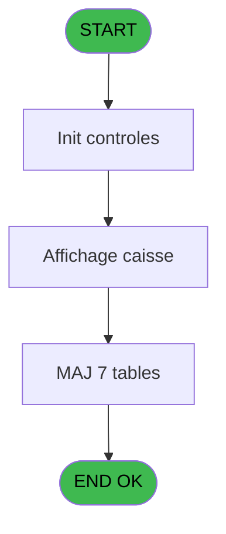
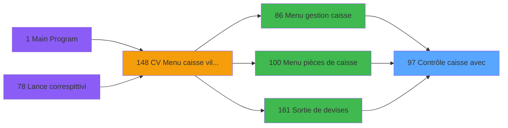
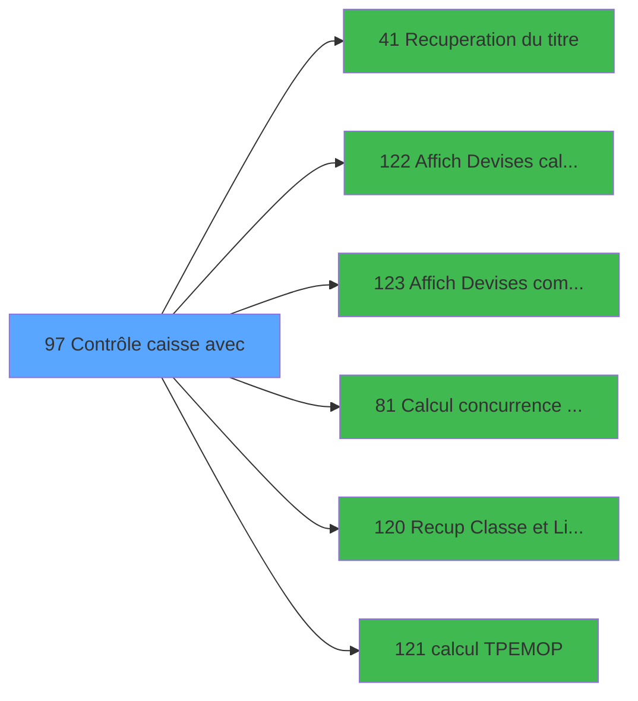

# VIL IDE 97 - Contrôle caisse avec

> **Analyse**: Phases 1-4 2026-02-03 09:20 -> 09:20 (21s) | Assemblage 09:20
> **Pipeline**: V7.2 Enrichi
> **Structure**: 4 onglets (Resume | Ecrans | Donnees | Connexions)

<!-- TAB:Resume -->

## 1. FICHE D'IDENTITE

| Attribut | Valeur |
|----------|--------|
| Projet | VIL |
| IDE Position | 97 |
| Nom Programme | Contrôle caisse avec |
| Fichier source | `Prg_97.xml` |
| Domaine metier | Caisse |
| Taches | 71 (11 ecrans visibles) |
| Tables modifiees | 7 |
| Programmes appeles | 6 |

## 2. DESCRIPTION FONCTIONNELLE

**Contrôle caisse avec** assure la gestion complete de ce processus, accessible depuis [Menu gestion caisse (IDE 86)](VIL-IDE-86.md), [Menu pièces de caisse (IDE 100)](VIL-IDE-100.md), [Sortie de devises (IDE 161)](VIL-IDE-161.md).

Le flux de traitement s'organise en **8 blocs fonctionnels** :

- **Traitement** (49 taches) : traitements metier divers
- **Calcul** (8 taches) : calculs de montants, stocks ou compteurs
- **Creation** (5 taches) : insertion d'enregistrements en base (mouvements, prestations)
- **Consultation** (2 taches) : ecrans de recherche, selection et consultation
- **Impression** (2 taches) : generation de tickets et documents
- **Validation** (2 taches) : controles et verifications de coherence
- **Initialisation** (2 taches) : reinitialisation d'etats et de variables de travail
- **Saisie** (1 tache) : ecrans de saisie utilisateur (formulaires, champs, donnees)

**Donnees modifiees** : 7 tables en ecriture (pieces_caisse____pks, complement_pieces_de_caisse, ecarts, histo_montants_coffre, histo_fdr, edition_ticket_devise, choix_ecritures_solde).

**Logique metier** : 5 regles identifiees couvrant conditions metier.

Detail : phases du traitement

#### Phase 1 : Traitement (49 taches)

- **97** - Contrôle caisse avec P375 **[[ECRAN]](#ecran-t1)**
- **97.1** - Imputations
- **97.2** - Total TPE
- **97.3** - Total TPE IMS sans session
- **97.3.1** - Load services
- **97.4** - Solde PMS
- **97.5.1** - Nbre devise
- **97.6.3** - Sessions
- **97.6.3.2.1** - Lecture des sessions
- **97.6.3.3.1** - Lecture des sessions
- **97.6.3.3.1.1** - TRACE P
- **97.6.4** - Nbre devises
- **97.6.5.1** - lect mvt
- **97.6.5.2** - lect mvt
- **97.7** - Ecart coffre
- **97.7.1** - Ecart devise
- **97.7.1.1** - Lect Dern Cloture
- **97.8.1.1.1** - Imputation PDC
- **97.8.1.1.4** - suppression
- **97.8.1.1.4.1** - supp complement
- **97.8.1.1.5** - suppression ecart
- **97.8.1.2** - Commentaires **[[ECRAN]](#ecran-t40)**
- **97.9.1** - (sans nom) **[[ECRAN]](#ecran-t54)**
- **97.9.2** - (sans nom) **[[ECRAN]](#ecran-t55)**
- **97.10.1** - (sans nom) **[[ECRAN]](#ecran-t57)**
- **97.10.2** - (sans nom) **[[ECRAN]](#ecran-t58)**
- **97.11** - Lecture user
- **97.11.1** - Sessions caisses
- **97.12** - PDC
- **97.13** - (sans nom) **[[ECRAN]](#ecran-t65)**
- **97.14** - change
- **97.15** - change
- **97.16** - solde APPRO REMISE
- **97.17** - (sans nom) **[[ECRAN]](#ecran-t69)**
- **97.17.1** - caisses ouvertes
- **97.17.1.1** - detail
- **97.17.2** - Ligne devise **[[ECRAN]](#ecran-t72)**
- **97.17.3** - Total devises **[[ECRAN]](#ecran-t73)**
- **97.18** - SOLDE FDR
- **97.19** - Versements/Retraits
- **97.20.1** - (sans nom) **[[ECRAN]](#ecran-t79)**
- **97.21.1** - (sans nom) **[[ECRAN]](#ecran-t81)**
- **97.22** - Detail des FDR **[[ECRAN]](#ecran-t82)**
- **97.22.1** - Totaux R/D
- **97.23** - Existe FDR **[[ECRAN]](#ecran-t84)**
- **97.24** - histo montants
- **97.6.3.2.2** - Lecture des sessions
- **97.6.3.3.2** - Lecture des sessions
- **97.6.3.3.2.1** - TRACE P

Delegue a : [Recuperation du titre (IDE 41)](VIL-IDE-41.md)

#### Phase 2 : Calcul (8 taches)

- **97.5** - Solde compte
- **97.6** - Solde calcule
- **97.6.1** - Date comptable
- **97.6.3.1** - Dernier solde compte ?
- **97.6.3.2** - non comptabilisees
- **97.6.3.3** - comptabilisees
- **97.6.5** - Mouvement stock
- **97.7.1.2** - Lect comptees

Delegue a : [Affich Devises calculee (IDE 122)](VIL-IDE-122.md), [Affich Devises comptees (IDE 123)](VIL-IDE-123.md), [Calcul concurrence sessions v1 (IDE 81)](VIL-IDE-81.md), [calcul TPE/MOP (IDE 121)](VIL-IDE-121.md)

#### Phase 3 : Initialisation (2 taches)

- **97.6.2** - Init devises
- **97.18.1** - init

#### Phase 4 : Creation (5 taches)

- **97.6.2.1** - Creation 307
- **97.8.1.1.2** - Creation PDC
- **97.8.1.1.3** - Creation ecart
- **97.11.1.1** - creation temp
- **97.18.2** - ajout

#### Phase 5 : Saisie (1 tache)

- **97.8** - Saisie libelle ecart **[[ECRAN]](#ecran-t29)**

#### Phase 6 : Validation (2 taches)

- **97.8.1** - Validation ecart coffre **[[ECRAN]](#ecran-t30)**
- **97.8.1.1** - Validation

#### Phase 7 : Consultation (2 taches)

- **97.9** - Affich Dev caisses **[[ECRAN]](#ecran-t53)**
- **97.10** - Affich Dev tot **[[ECRAN]](#ecran-t56)**

Delegue a : [Recuperation du titre (IDE 41)](VIL-IDE-41.md), [Recup Classe et Lib du MOP (IDE 120)](VIL-IDE-120.md)

#### Phase 8 : Impression (2 taches)

- **97.20** - Imprimer
- **97.21** - Imprimer sans grise

#### Tables impactees

| Table | Operations | Role metier |
|-------|-----------|-------------|
| choix_ecritures_solde | R/**W**/L (6 usages) |  |
| pieces_caisse____pks | R/**W** (6 usages) | Sessions de caisse |
| complement_pieces_de_caisse | **W**/L (3 usages) | Sessions de caisse |
| histo_fdr | R/**W** (3 usages) | Historique / journal |
| ecarts | **W** (2 usages) |  |
| edition_ticket_devise | **W** (1 usages) | Devises / taux de change |
| histo_montants_coffre | **W** (1 usages) | Etat du coffre |

## 3. BLOCS FONCTIONNELS

### 3.1 Traitement (49 taches)

Traitements internes.

---

#### 97 - Contrôle caisse avec P375 [[ECRAN]](#ecran-t1)

**Role** : Tache d'orchestration : point d'entree du programme (49 sous-taches). Coordonne l'enchainement des traitements.
**Ecran** : 1254 x 274 DLU (MDI) | [Voir mockup](#ecran-t1)

48 sous-taches directes

| Tache | Nom | Bloc |
|-------|-----|------|
| [97.1](#t2) | Imputations | Traitement |
| [97.2](#t3) | Total TPE | Traitement |
| [97.3](#t4) | Total TPE IMS sans session | Traitement |
| [97.3.1](#t5) | Load services | Traitement |
| [97.4](#t6) | Solde PMS | Traitement |
| [97.5.1](#t8) | Nbre devise | Traitement |
| [97.6.3](#t13) | Sessions | Traitement |
| [97.6.3.2.1](#t16) | Lecture des sessions | Traitement |
| [97.6.3.3.1](#t19) | Lecture des sessions | Traitement |
| [97.6.3.3.1.1](#t20) | TRACE P | Traitement |
| [97.6.4](#t21) | Nbre devises | Traitement |
| [97.6.5.1](#t23) | lect mvt | Traitement |
| [97.6.5.2](#t24) | lect mvt | Traitement |
| [97.7](#t25) | Ecart coffre | Traitement |
| [97.7.1](#t26) | Ecart devise | Traitement |
| [97.7.1.1](#t27) | Lect Dern Cloture | Traitement |
| [97.8.1.1.1](#t34) | Imputation PDC | Traitement |
| [97.8.1.1.4](#t37) | suppression | Traitement |
| [97.8.1.1.4.1](#t38) | supp complement | Traitement |
| [97.8.1.1.5](#t39) | suppression ecart | Traitement |
| [97.8.1.2](#t40) | Commentaires **[[ECRAN]](#ecran-t40)** | Traitement |
| [97.9.1](#t54) | (sans nom) **[[ECRAN]](#ecran-t54)** | Traitement |
| [97.9.2](#t55) | (sans nom) **[[ECRAN]](#ecran-t55)** | Traitement |
| [97.10.1](#t57) | (sans nom) **[[ECRAN]](#ecran-t57)** | Traitement |
| [97.10.2](#t58) | (sans nom) **[[ECRAN]](#ecran-t58)** | Traitement |
| [97.11](#t59) | Lecture user | Traitement |
| [97.11.1](#t60) | Sessions caisses | Traitement |
| [97.12](#t62) | PDC | Traitement |
| [97.13](#t65) | (sans nom) **[[ECRAN]](#ecran-t65)** | Traitement |
| [97.14](#t66) | change | Traitement |
| [97.15](#t67) | change | Traitement |
| [97.16](#t68) | solde APPRO REMISE | Traitement |
| [97.17](#t69) | (sans nom) **[[ECRAN]](#ecran-t69)** | Traitement |
| [97.17.1](#t70) | caisses ouvertes | Traitement |
| [97.17.1.1](#t71) | detail | Traitement |
| [97.17.2](#t72) | Ligne devise **[[ECRAN]](#ecran-t72)** | Traitement |
| [97.17.3](#t73) | Total devises **[[ECRAN]](#ecran-t73)** | Traitement |
| [97.18](#t74) | SOLDE FDR | Traitement |
| [97.19](#t77) | Versements/Retraits | Traitement |
| [97.20.1](#t79) | (sans nom) **[[ECRAN]](#ecran-t79)** | Traitement |
| [97.21.1](#t81) | (sans nom) **[[ECRAN]](#ecran-t81)** | Traitement |
| [97.22](#t82) | Detail des FDR **[[ECRAN]](#ecran-t82)** | Traitement |
| [97.22.1](#t83) | Totaux R/D | Traitement |
| [97.23](#t84) | Existe FDR **[[ECRAN]](#ecran-t84)** | Traitement |
| [97.24](#t86) | histo montants | Traitement |
| [97.6.3.2.2](#t89) | Lecture des sessions | Traitement |
| [97.6.3.3.2](#t92) | Lecture des sessions | Traitement |
| [97.6.3.3.2.1](#t93) | TRACE P | Traitement |

**Variables liees** : BN (devises caisses), BP (Ecart caisse gain), BQ (Ecart caisse perte), BW (Total caisses rec Total), BX (Total caisses rec Monnaie)

---

#### 97.1 - Imputations

**Role** : Traitement : Imputations.

---

#### 97.2 - Total TPE

**Role** : Traitement : Total TPE.
**Variables liees** : K (Solde compte Total), R (Solde calcule Total), Y (Solde total PMS Total), Z (Solde total PMS Monnaie), BA (Solde total PMS Produits)

---

#### 97.3 - Total TPE IMS sans session

**Role** : Traitement : Total TPE IMS sans session.
**Variables liees** : K (Solde compte Total), R (Solde calcule Total), Y (Solde total PMS Total), Z (Solde total PMS Monnaie), BA (Solde total PMS Produits)

---

#### 97.3.1 - Load services

**Role** : Traitement : Load services.

---

#### 97.4 - Solde PMS

**Role** : Consultation/chargement : Solde PMS.
**Variables liees** : K (Solde compte Total), L (Solde compte Monnaie), M (Solde compte Produits), N (Solde compte Cartes), O (Solde compte Cheques)

---

#### 97.5.1 - Nbre devise

**Role** : Traitement : Nbre devise.
**Variables liees** : B (Param devise locale), F (Param nbre decimales), Q (Solde compte Nbre devises), X (Solde calcule Nbre devises), BE (Solde total PMS Nbre devises)

---

#### 97.6.3 - Sessions

**Role** : Traitement : Sessions.

---

#### 97.6.3.2.1 - Lecture des sessions

**Role** : Traitement : Lecture des sessions.

---

#### 97.6.3.3.1 - Lecture des sessions

**Role** : Traitement : Lecture des sessions.

---

#### 97.6.3.3.1.1 - TRACE P

**Role** : Traitement : TRACE P.

---

#### 97.6.4 - Nbre devises

**Role** : Traitement : Nbre devises.
**Variables liees** : F (Param nbre decimales), Q (Solde compte Nbre devises), X (Solde calcule Nbre devises), BE (Solde total PMS Nbre devises), BL (devises comptees)

---

#### 97.6.5.1 - lect mvt

**Role** : Traitement : lect mvt.

---

#### 97.6.5.2 - lect mvt

**Role** : Traitement : lect mvt.

---

#### 97.7 - Ecart coffre

**Role** : Traitement : Ecart coffre.
**Variables liees** : G (Param abandon ecart), I (Param N° Term Coffre2), J (Param Hostname Coffre2), BP (Ecart caisse gain), BQ (Ecart caisse perte)

---

#### 97.7.1 - Ecart devise

**Role** : Traitement : Ecart devise.
**Variables liees** : B (Param devise locale), G (Param abandon ecart), Q (Solde compte Nbre devises), X (Solde calcule Nbre devises), BE (Solde total PMS Nbre devises)

---

#### 97.7.1.1 - Lect Dern Cloture

**Role** : Traitement : Lect Dern Cloture.
**Variables liees** : BG (Date compta dernier solde PMS), DD (cloture_auto)

---

#### 97.8.1.1.1 - Imputation PDC

**Role** : Traitement : Imputation PDC.
**Variables liees** : BR (imputation ecart gain), BS (imputation ecart perte)

---

#### 97.8.1.1.4 - suppression

**Role** : Traitement : suppression.

---

#### 97.8.1.1.4.1 - supp complement

**Role** : Traitement : supp complement.

---

#### 97.8.1.1.5 - suppression ecart

**Role** : Traitement : suppression ecart.
**Variables liees** : G (Param abandon ecart), BP (Ecart caisse gain), BQ (Ecart caisse perte), BR (imputation ecart gain), BS (imputation ecart perte)

---

#### 97.8.1.2 - Commentaires [[ECRAN]](#ecran-t40)

**Role** : Traitement : Commentaires.
**Ecran** : 485 x 206 DLU (MDI) | [Voir mockup](#ecran-t40)

---

#### 97.9.1 - (sans nom) [[ECRAN]](#ecran-t54)

**Role** : Traitement interne.
**Ecran** : 232 x 72 DLU (MDI) | [Voir mockup](#ecran-t54)

---

#### 97.9.2 - (sans nom) [[ECRAN]](#ecran-t55)

**Role** : Traitement interne.
**Ecran** : 232 x 72 DLU (MDI) | [Voir mockup](#ecran-t55)

---

#### 97.10.1 - (sans nom) [[ECRAN]](#ecran-t57)

**Role** : Traitement interne.
**Ecran** : 232 x 72 DLU (MDI) | [Voir mockup](#ecran-t57)

---

#### 97.10.2 - (sans nom) [[ECRAN]](#ecran-t58)

**Role** : Traitement interne.
**Ecran** : 232 x 72 DLU (MDI) | [Voir mockup](#ecran-t58)

---

#### 97.11 - Lecture user

**Role** : Traitement : Lecture user.

---

#### 97.11.1 - Sessions caisses

**Role** : Traitement : Sessions caisses.
**Variables liees** : BN (devises caisses), BW (Total caisses rec Total), BX (Total caisses rec Monnaie), BY (Total caisses rec Produits), BZ (Total caisses rec Cartes)

---

#### 97.12 - PDC

**Role** : Traitement interne.

---

#### 97.13 - (sans nom) [[ECRAN]](#ecran-t65)

**Role** : Traitement interne.
**Ecran** : 1240 x 116 DLU (MDI) | [Voir mockup](#ecran-t65)

---

#### 97.14 - change

**Role** : Traitement : change.
**Variables liees** : BH (PDC depenses avant change), BI (PDC recettes avant change), BU (Total change achat), BV (Total change vente)

---

#### 97.15 - change

**Role** : Traitement : change.
**Variables liees** : BH (PDC depenses avant change), BI (PDC recettes avant change), BU (Total change achat), BV (Total change vente)

---

#### 97.16 - solde APPRO REMISE

**Role** : Consultation/chargement : solde APPRO REMISE.
**Variables liees** : K (Solde compte Total), L (Solde compte Monnaie), M (Solde compte Produits), N (Solde compte Cartes), O (Solde compte Cheques)

---

#### 97.17 - (sans nom) [[ECRAN]](#ecran-t69)

**Role** : Traitement interne.
**Ecran** : 1248 x 271 DLU (MDI) | [Voir mockup](#ecran-t69)

---

#### 97.17.1 - caisses ouvertes

**Role** : Traitement : caisses ouvertes.
**Variables liees** : BN (devises caisses), BW (Total caisses rec Total), BX (Total caisses rec Monnaie), BY (Total caisses rec Produits), BZ (Total caisses rec Cartes)

---

#### 97.17.1.1 - detail

**Role** : Traitement : detail.

---

#### 97.17.2 - Ligne devise [[ECRAN]](#ecran-t72)

**Role** : Traitement : Ligne devise.
**Ecran** : 224 x 72 DLU (MDI) | [Voir mockup](#ecran-t72)
**Variables liees** : B (Param devise locale), Q (Solde compte Nbre devises), X (Solde calcule Nbre devises), BE (Solde total PMS Nbre devises), BL (devises comptees)

---

#### 97.17.3 - Total devises [[ECRAN]](#ecran-t73)

**Role** : Traitement : Total devises.
**Ecran** : 224 x 72 DLU (MDI) | [Voir mockup](#ecran-t73)
**Variables liees** : K (Solde compte Total), Q (Solde compte Nbre devises), R (Solde calcule Total), X (Solde calcule Nbre devises), Y (Solde total PMS Total)

---

#### 97.18 - SOLDE FDR

**Role** : Consultation/chargement : SOLDE FDR.
**Variables liees** : K (Solde compte Total), L (Solde compte Monnaie), M (Solde compte Produits), N (Solde compte Cartes), O (Solde compte Cheques)

---

#### 97.19 - Versements/Retraits

**Role** : Traitement : Versements/Retraits.

---

#### 97.20.1 - (sans nom) [[ECRAN]](#ecran-t79)

**Role** : Traitement interne.
**Ecran** : 1248 x 271 DLU (MDI) | [Voir mockup](#ecran-t79)

---

#### 97.21.1 - (sans nom) [[ECRAN]](#ecran-t81)

**Role** : Traitement interne.
**Ecran** : 1248 x 271 DLU (MDI) | [Voir mockup](#ecran-t81)

---

#### 97.22 - Detail des FDR [[ECRAN]](#ecran-t82)

**Role** : Traitement : Detail des FDR.
**Ecran** : 1248 x 271 DLU (MDI) | [Voir mockup](#ecran-t82)

---

#### 97.22.1 - Totaux R/D

**Role** : Calcul : Totaux R/D.

---

#### 97.23 - Existe FDR [[ECRAN]](#ecran-t84)

**Role** : Traitement : Existe FDR.
**Ecran** : 1248 x 271 DLU (MDI) | [Voir mockup](#ecran-t84)
**Variables liees** : CW (Existe FDR)

---

#### 97.24 - histo montants

**Role** : Traitement : histo montants.

---

#### 97.6.3.2.2 - Lecture des sessions

**Role** : Traitement : Lecture des sessions.

---

#### 97.6.3.3.2 - Lecture des sessions

**Role** : Traitement : Lecture des sessions.

---

#### 97.6.3.3.2.1 - TRACE P

**Role** : Traitement : TRACE P.

### 3.2 Calcul (8 taches)

Calculs metier : montants, stocks, compteurs.

---

#### 97.5 - Solde compte

**Role** : Consultation/chargement : Solde compte.
**Variables liees** : K (Solde compte Total), L (Solde compte Monnaie), M (Solde compte Produits), N (Solde compte Cartes), O (Solde compte Cheques)
**Delegue a** : [Affich Devises calculee (IDE 122)](VIL-IDE-122.md), [Affich Devises comptees (IDE 123)](VIL-IDE-123.md), [Calcul concurrence sessions v1 (IDE 81)](VIL-IDE-81.md)

---

#### 97.6 - Solde calcule

**Role** : Calcul : Solde calcule.
**Variables liees** : K (Solde compte Total), L (Solde compte Monnaie), M (Solde compte Produits), N (Solde compte Cartes), O (Solde compte Cheques)
**Delegue a** : [Affich Devises calculee (IDE 122)](VIL-IDE-122.md), [Affich Devises comptees (IDE 123)](VIL-IDE-123.md), [Calcul concurrence sessions v1 (IDE 81)](VIL-IDE-81.md)

---

#### 97.6.1 - Date comptable

**Role** : Traitement : Date comptable.
**Variables liees** : E (Param date comptable), BG (Date compta dernier solde PMS)
**Delegue a** : [Affich Devises calculee (IDE 122)](VIL-IDE-122.md), [Affich Devises comptees (IDE 123)](VIL-IDE-123.md), [Calcul concurrence sessions v1 (IDE 81)](VIL-IDE-81.md)

---

#### 97.6.3.1 - Dernier solde compte ?

**Role** : Consultation/chargement : Dernier solde compte ?.
**Variables liees** : K (Solde compte Total), L (Solde compte Monnaie), M (Solde compte Produits), N (Solde compte Cartes), O (Solde compte Cheques)
**Delegue a** : [Affich Devises calculee (IDE 122)](VIL-IDE-122.md), [Affich Devises comptees (IDE 123)](VIL-IDE-123.md), [Calcul concurrence sessions v1 (IDE 81)](VIL-IDE-81.md)

---

#### 97.6.3.2 - non comptabilisees

**Role** : Traitement : non comptabilisees.
**Delegue a** : [Affich Devises calculee (IDE 122)](VIL-IDE-122.md), [Affich Devises comptees (IDE 123)](VIL-IDE-123.md), [Calcul concurrence sessions v1 (IDE 81)](VIL-IDE-81.md)

---

#### 97.6.3.3 - comptabilisees

**Role** : Traitement : comptabilisees.
**Delegue a** : [Affich Devises calculee (IDE 122)](VIL-IDE-122.md), [Affich Devises comptees (IDE 123)](VIL-IDE-123.md), [Calcul concurrence sessions v1 (IDE 81)](VIL-IDE-81.md)

---

#### 97.6.5 - Mouvement stock

**Role** : Calcul : Mouvement stock.
**Delegue a** : [Affich Devises calculee (IDE 122)](VIL-IDE-122.md), [Affich Devises comptees (IDE 123)](VIL-IDE-123.md), [Calcul concurrence sessions v1 (IDE 81)](VIL-IDE-81.md)

---

#### 97.7.1.2 - Lect comptees

**Role** : Traitement : Lect comptees.
**Variables liees** : BL (devises comptees)
**Delegue a** : [Affich Devises calculee (IDE 122)](VIL-IDE-122.md), [Affich Devises comptees (IDE 123)](VIL-IDE-123.md), [Calcul concurrence sessions v1 (IDE 81)](VIL-IDE-81.md)

### 3.3 Initialisation (2 taches)

Reinitialisation d'etats et variables de travail.

---

#### 97.6.2 - Init devises

**Role** : Reinitialisation : Init devises.
**Variables liees** : Q (Solde compte Nbre devises), X (Solde calcule Nbre devises), BE (Solde total PMS Nbre devises), BL (devises comptees), BM (devises calculees)

---

#### 97.18.1 - init

**Role** : Reinitialisation : init.

### 3.4 Creation (5 taches)

Insertion de nouveaux enregistrements en base.

---

#### 97.6.2.1 - Creation 307

**Role** : Creation d'enregistrement : Creation 307.

---

#### 97.8.1.1.2 - Creation PDC

**Role** : Creation d'enregistrement : Creation PDC.

---

#### 97.8.1.1.3 - Creation ecart

**Role** : Creation d'enregistrement : Creation ecart.
**Variables liees** : G (Param abandon ecart), BP (Ecart caisse gain), BQ (Ecart caisse perte), BR (imputation ecart gain), BS (imputation ecart perte)

---

#### 97.11.1.1 - creation temp

**Role** : Creation d'enregistrement : creation temp.

---

#### 97.18.2 - ajout

**Role** : Creation d'enregistrement : ajout.

### 3.5 Saisie (1 tache)

L'operateur saisit les donnees de la transaction via 1 ecran (Saisie libelle ecart).

---

#### 97.8 - Saisie libelle ecart [[ECRAN]](#ecran-t29)

**Role** : Saisie des donnees : Saisie libelle ecart.
**Ecran** : 624 x 122 DLU (MDI) | [Voir mockup](#ecran-t29)
**Variables liees** : G (Param abandon ecart), BP (Ecart caisse gain), BQ (Ecart caisse perte), BR (imputation ecart gain), BS (imputation ecart perte)

### 3.6 Validation (2 taches)

Controles de coherence : 2 taches verifient les donnees et conditions.

---

#### 97.8.1 - Validation ecart coffre [[ECRAN]](#ecran-t30)

**Role** : Verification : Validation ecart coffre.
**Ecran** : 1248 x 122 DLU (MDI) | [Voir mockup](#ecran-t30)
**Variables liees** : G (Param abandon ecart), I (Param N° Term Coffre2), J (Param Hostname Coffre2), BP (Ecart caisse gain), BQ (Ecart caisse perte)

---

#### 97.8.1.1 - Validation

**Role** : Verification : Validation.

### 3.7 Consultation (2 taches)

Ecrans de recherche et consultation.

---

#### 97.9 - Affich Dev caisses [[ECRAN]](#ecran-t53)

**Role** : Reinitialisation : Affich Dev caisses.
**Ecran** : 232 x 72 DLU (MDI) | [Voir mockup](#ecran-t53)
**Variables liees** : BN (devises caisses), BW (Total caisses rec Total), BX (Total caisses rec Monnaie), BY (Total caisses rec Produits), BZ (Total caisses rec Cartes)
**Delegue a** : [Affich Devises calculee (IDE 122)](VIL-IDE-122.md), [Affich Devises comptees (IDE 123)](VIL-IDE-123.md)

---

#### 97.10 - Affich Dev tot [[ECRAN]](#ecran-t56)

**Role** : Reinitialisation : Affich Dev tot.
**Ecran** : 232 x 72 DLU (MDI) | [Voir mockup](#ecran-t56)
**Delegue a** : [Affich Devises calculee (IDE 122)](VIL-IDE-122.md), [Affich Devises comptees (IDE 123)](VIL-IDE-123.md)

### 3.8 Impression (2 taches)

Generation des documents et tickets.

---

#### 97.20 - Imprimer

**Role** : Configuration/parametrage : Imprimer.

---

#### 97.21 - Imprimer sans grise

**Role** : Configuration/parametrage : Imprimer sans grise.
**Variables liees** : CQ (Total CARD TPE IMS sans session), CX (ServiceImsSansSession1), CY (ServiceImsSansSession2), CZ (ServiceImsSansSession3), DA (ServiceImsSansSession4)

## 5. REGLES METIER

5 regles identifiees:

### Autres (5 regles)

#### [RM-001] Si [AK] alors 41 sinon 7)

| Element | Detail |
|---------|--------|
| **Condition** | `[AK]` |
| **Si vrai** | 41 |
| **Si faux** | 7) |
| **Expression source** | Expression 8 : `IF ([AK],41,7)` |
| **Exemple** | Si [AK] → 41. Sinon → 7) |

#### [RM-002] Si [AL] alors 41 sinon 7)

| Element | Detail |
|---------|--------|
| **Condition** | `[AL]` |
| **Si vrai** | 41 |
| **Si faux** | 7) |
| **Expression source** | Expression 9 : `IF ([AL],41,7)` |
| **Exemple** | Si [AL] → 41. Sinon → 7) |

#### [RM-003] Si [AM] alors 41 sinon 7)

| Element | Detail |
|---------|--------|
| **Condition** | `[AM]` |
| **Si vrai** | 41 |
| **Si faux** | 7) |
| **Expression source** | Expression 10 : `IF ([AM],41,7)` |
| **Exemple** | Si [AM] → 41. Sinon → 7) |

#### [RM-004] Si [AN] alors 41 sinon 7)

| Element | Detail |
|---------|--------|
| **Condition** | `[AN]` |
| **Si vrai** | 41 |
| **Si faux** | 7) |
| **Expression source** | Expression 11 : `IF ([AN],41,7)` |
| **Exemple** | Si [AN] → 41. Sinon → 7) |

#### [RM-005] Traitement si [AW]+imputation ecart gain [BR] est non nul

| Element | Detail |
|---------|--------|
| **Condition** | `[AW]+imputation ecart gain [BR]<>0` |
| **Si vrai** | 12 |
| **Si faux** | 7) |
| **Variables** | BR (imputation ecart gain) |
| **Expression source** | Expression 25 : `IF ([AW]+imputation ecart gain [BR]<>0,12,7)` |
| **Exemple** | Si [AW]+imputation ecart gain [BR]<>0 → 12. Sinon → 7) |
| **Impact** | [97.7 - Ecart coffre](#t25) |

## 6. CONTEXTE

- **Appele par**: [Menu gestion caisse (IDE 86)](VIL-IDE-86.md), [Menu pièces de caisse (IDE 100)](VIL-IDE-100.md), [Sortie de devises (IDE 161)](VIL-IDE-161.md)
- **Appelle**: 6 programmes | **Tables**: 29 (W:7 R:23 L:7) | **Taches**: 71 | **Expressions**: 30

<!-- TAB:Ecrans -->

## 8. ECRANS

### 8.1 Forms visibles (11 / 71)

| # | Position | Tache | Nom | Type | Largeur | Hauteur | Bloc |
|---|----------|-------|-----|------|---------|---------|------|
| 1 | 97 | 97 | Contrôle caisse avec P375 | MDI | 1254 | 274 | Traitement |
| 2 | 97.8.1 | 97.8.1 | Validation ecart coffre | MDI | 1248 | 122 | Validation |
| 3 | 97.8.1.2 | 97.8.1.2 | Commentaires | MDI | 485 | 206 | Traitement |
| 4 | 97.9.1 | 97.9.1 | (sans nom) | MDI | 232 | 72 | Traitement |
| 5 | 97.9.2 | 97.9.2 | (sans nom) | MDI | 232 | 72 | Traitement |
| 6 | 97.10.1 | 97.10.1 | (sans nom) | MDI | 232 | 72 | Traitement |
| 7 | 97.10.2 | 97.10.2 | (sans nom) | MDI | 232 | 72 | Traitement |
| 8 | 97.17 | 97.17 | (sans nom) | MDI | 1248 | 271 | Traitement |
| 9 | 97.17.2 | 97.17.2 | Ligne devise | MDI | 224 | 72 | Traitement |
| 10 | 97.17.3 | 97.17.3 | Total devises | MDI | 224 | 72 | Traitement |
| 11 | 97.22 | 97.22 | Detail des FDR | MDI | 1248 | 271 | Traitement |

### 8.2 Mockups Ecrans

---

#### 97 - Contrôle caisse avec P375
**Tache** : [97](#t1) | **Type** : MDI | **Dimensions** : 1254 x 274 DLU
**Bloc** : Traitement | **Titre IDE** : Contrôle caisse avec P375

<!-- FORM-DATA:
{
    "width":  1254,
    "vFactor":  8,
    "type":  "MDI",
    "hFactor":  8,
    "controls":  [
                     {
                         "x":  0,
                         "type":  "label",
                         "var":  "",
                         "y":  0,
                         "w":  1248,
                         "fmt":  "",
                         "name":  "",
                         "h":  18,
                         "color":  "",
                         "text":  "",
                         "parent":  null
                     },
                     {
                         "x":  447,
                         "type":  "label",
                         "var":  "",
                         "y":  4,
                         "w":  190,
                         "fmt":  "",
                         "name":  "",
                         "h":  10,
                         "color":  "7",
                         "text":  "Date comptable",
                         "parent":  null
                     },
                     {
                         "x":  424,
                         "type":  "label",
                         "var":  "",
                         "y":  20,
                         "w":  400,
                         "fmt":  "",
                         "name":  "",
                         "h":  16,
                         "color":  "142",
                         "text":  "Contrôle coffre",
                         "parent":  null
                     },
                     {
                         "x":  249,
                         "type":  "label",
                         "var":  "",
                         "y":  41,
                         "w":  112,
                         "fmt":  "",
                         "name":  "",
                         "h":  12,
                         "color":  "7",
                         "text":  "Cash",
                         "parent":  null
                     },
                     {
                         "x":  368,
                         "type":  "label",
                         "var":  "",
                         "y":  41,
                         "w":  112,
                         "fmt":  "",
                         "name":  "",
                         "h":  12,
                         "color":  "7",
                         "text":  "Cartes",
                         "parent":  null
                     },
                     {
                         "x":  485,
                         "type":  "label",
                         "var":  "",
                         "y":  41,
                         "w":  112,
                         "fmt":  "",
                         "name":  "",
                         "h":  12,
                         "color":  "7",
                         "text":  "Chèques",
                         "parent":  null
                     },
                     {
                         "x":  603,
                         "type":  "label",
                         "var":  "",
                         "y":  41,
                         "w":  112,
                         "fmt":  "",
                         "name":  "",
                         "h":  12,
                         "color":  "7",
                         "text":  "Produits",
                         "parent":  null
                     },
                     {
                         "x":  724,
                         "type":  "label",
                         "var":  "",
                         "y":  41,
                         "w":  144,
                         "fmt":  "",
                         "name":  "",
                         "h":  12,
                         "color":  "7",
                         "text":  "TOTAL",
                         "parent":  null
                     },
                     {
                         "x":  872,
                         "type":  "label",
                         "var":  "",
                         "y":  41,
                         "w":  112,
                         "fmt":  "",
                         "name":  "",
                         "h":  12,
                         "color":  "7",
                         "text":  "OD",
                         "parent":  null
                     },
                     {
                         "x":  988,
                         "type":  "label",
                         "var":  "",
                         "y":  41,
                         "w":  99,
                         "fmt":  "",
                         "name":  "",
                         "h":  12,
                         "color":  "7",
                         "text":  "Devises",
                         "parent":  null
                     },
                     {
                         "x":  0,
                         "type":  "label",
                         "var":  "",
                         "y":  55,
                         "w":  1247,
                         "fmt":  "",
                         "name":  "",
                         "h":  20,
                         "color":  "",
                         "text":  "",
                         "parent":  null
                     },
                     {
                         "x":  2,
                         "type":  "line",
                         "var":  "",
                         "y":  55,
                         "w":  1243,
                         "fmt":  "",
                         "name":  "",
                         "h":  0,
                         "color":  "",
                         "text":  "",
                         "parent":  null
                     },
                     {
                         "x":  0,
                         "type":  "line",
                         "var":  "",
                         "y":  56,
                         "w":  0,
                         "fmt":  "",
                         "name":  "",
                         "h":  19,
                         "color":  "",
                         "text":  "",
                         "parent":  null
                     },
                     {
                         "x":  5,
                         "type":  "label",
                         "var":  "",
                         "y":  60,
                         "w":  224,
                         "fmt":  "",
                         "name":  "",
                         "h":  12,
                         "color":  "7",
                         "text":  "Ancien solde clôture",
                         "parent":  null
                     },
                     {
                         "x":  5,
                         "type":  "label",
                         "var":  "",
                         "y":  77,
                         "w":  224,
                         "fmt":  "",
                         "name":  "",
                         "h":  12,
                         "color":  "7",
                         "text":  "Comptage coffre",
                         "parent":  null
                     },
                     {
                         "x":  5,
                         "type":  "label",
                         "var":  "",
                         "y":  90,
                         "w":  224,
                         "fmt":  "",
                         "name":  "",
                         "h":  12,
                         "color":  "7",
                         "text":  "Coffre théorique",
                         "parent":  null
                     },
                     {
                         "x":  5,
                         "type":  "label",
                         "var":  "",
                         "y":  103,
                         "w":  224,
                         "fmt":  "",
                         "name":  "",
                         "h":  12,
                         "color":  "7",
                         "text":  "Ecart coffre",
                         "parent":  null
                     },
                     {
                         "x":  5,
                         "type":  "label",
                         "var":  "",
                         "y":  116,
                         "w":  224,
                         "fmt":  "",
                         "name":  "",
                         "h":  12,
                         "color":  "7",
                         "text":  "Total des caisses",
                         "parent":  null
                     },
                     {
                         "x":  2,
                         "type":  "line",
                         "var":  "",
                         "y":  130,
                         "w":  1243,
                         "fmt":  "",
                         "name":  "",
                         "h":  0,
                         "color":  "",
                         "text":  "",
                         "parent":  null
                     },
                     {
                         "x":  0,
                         "type":  "label",
                         "var":  "",
                         "y":  131,
                         "w":  1247,
                         "fmt":  "",
                         "name":  "",
                         "h":  18,
                         "color":  "",
                         "text":  "",
                         "parent":  null
                     },
                     {
                         "x":  0,
                         "type":  "line",
                         "var":  "",
                         "y":  131,
                         "w":  0,
                         "fmt":  "",
                         "name":  "",
                         "h":  18,
                         "color":  "",
                         "text":  "",
                         "parent":  null
                     },
                     {
                         "x":  5,
                         "type":  "label",
                         "var":  "",
                         "y":  134,
                         "w":  224,
                         "fmt":  "",
                         "name":  "",
                         "h":  12,
                         "color":  "7",
                         "text":  "Nouveau solde PMS",
                         "parent":  null
                     },
                     {
                         "x":  5,
                         "type":  "label",
                         "var":  "",
                         "y":  151,
                         "w":  224,
                         "fmt":  "",
                         "name":  "",
                         "h":  12,
                         "color":  "7",
                         "text":  "Solde FDR",
                         "parent":  null
                     },
                     {
                         "x":  2,
                         "type":  "line",
                         "var":  "",
                         "y":  167,
                         "w":  1243,
                         "fmt":  "",
                         "name":  "",
                         "h":  0,
                         "color":  "",
                         "text":  "",
                         "parent":  null
                     },
                     {
                         "x":  0,
                         "type":  "label",
                         "var":  "",
                         "y":  168,
                         "w":  1247,
                         "fmt":  "",
                         "name":  "",
                         "h":  18,
                         "color":  "",
                         "text":  "",
                         "parent":  null
                     },
                     {
                         "x":  0,
                         "type":  "line",
                         "var":  "",
                         "y":  168,
                         "w":  0,
                         "fmt":  "",
                         "name":  "",
                         "h":  18,
                         "color":  "",
                         "text":  "",
                         "parent":  null
                     },
                     {
                         "x":  5,
                         "type":  "label",
                         "var":  "",
                         "y":  171,
                         "w":  224,
                         "fmt":  "",
                         "name":  "",
                         "h":  12,
                         "color":  "166",
                         "text":  "Nouveau solde clôture",
                         "parent":  null
                     },
                     {
                         "x":  5,
                         "type":  "label",
                         "var":  "",
                         "y":  191,
                         "w":  224,
                         "fmt":  "",
                         "name":  "",
                         "h":  12,
                         "color":  "7",
                         "text":  "PDC dépenses",
                         "parent":  null
                     },
                     {
                         "x":  5,
                         "type":  "label",
                         "var":  "",
                         "y":  204,
                         "w":  224,
                         "fmt":  "",
                         "name":  "",
                         "h":  12,
                         "color":  "7",
                         "text":  "PDC recettes",
                         "parent":  null
                     },
                     {
                         "x":  5,
                         "type":  "label",
                         "var":  "",
                         "y":  218,
                         "w":  224,
                         "fmt":  "",
                         "name":  "",
                         "h":  12,
                         "color":  "7",
                         "text":  "Solde versement/retrait",
                         "parent":  null
                     },
                     {
                         "x":  0,
                         "type":  "label",
                         "var":  "",
                         "y":  247,
                         "w":  1248,
                         "fmt":  "",
                         "name":  "",
                         "h":  24,
                         "color":  "",
                         "text":  "",
                         "parent":  null
                     },
                     {
                         "x":  368,
                         "type":  "label",
                         "var":  "",
                         "y":  191,
                         "w":  224,
                         "fmt":  "",
                         "name":  "",
                         "h":  12,
                         "color":  "7",
                         "text":  "Dépenses hors change",
                         "parent":  null
                     },
                     {
                         "x":  368,
                         "type":  "label",
                         "var":  "",
                         "y":  204,
                         "w":  224,
                         "fmt":  "",
                         "name":  "",
                         "h":  12,
                         "color":  "7",
                         "text":  "Recettes hors change",
                         "parent":  null
                     },
                     {
                         "x":  740,
                         "type":  "label",
                         "var":  "",
                         "y":  191,
                         "w":  224,
                         "fmt":  "",
                         "name":  "",
                         "h":  12,
                         "color":  "7",
                         "text":  "Total change achat",
                         "parent":  null
                     },
                     {
                         "x":  740,
                         "type":  "label",
                         "var":  "",
                         "y":  204,
                         "w":  224,
                         "fmt":  "",
                         "name":  "",
                         "h":  12,
                         "color":  "7",
                         "text":  "Total change vente",
                         "parent":  null
                     },
                     {
                         "x":  724,
                         "type":  "edit",
                         "var":  "",
                         "y":  77,
                         "w":  144,
                         "fmt":  "N## ### ### ###.###Z",
                         "name":  "",
                         "h":  12,
                         "color":  "7",
                         "text":  "",
                         "parent":  null
                     },
                     {
                         "x":  233,
                         "type":  "edit",
                         "var":  "",
                         "y":  77,
                         "w":  128,
                         "fmt":  "N## ### ### ###.###Z",
                         "name":  "",
                         "h":  12,
                         "color":  "7",
                         "text":  "",
                         "parent":  null
                     },
                     {
                         "x":  603,
                         "type":  "edit",
                         "var":  "",
                         "y":  77,
                         "w":  112,
                         "fmt":  "N## ### ### ###.###Z",
                         "name":  "",
                         "h":  12,
                         "color":  "7",
                         "text":  "",
                         "parent":  null
                     },
                     {
                         "x":  368,
                         "type":  "edit",
                         "var":  "",
                         "y":  77,
                         "w":  112,
                         "fmt":  "N## ### ### ###.###Z",
                         "name":  "",
                         "h":  12,
                         "color":  "7",
                         "text":  "",
                         "parent":  null
                     },
                     {
                         "x":  485,
                         "type":  "edit",
                         "var":  "",
                         "y":  77,
                         "w":  112,
                         "fmt":  "N## ### ### ###.###Z",
                         "name":  "",
                         "h":  12,
                         "color":  "7",
                         "text":  "",
                         "parent":  null
                     },
                     {
                         "x":  872,
                         "type":  "edit",
                         "var":  "",
                         "y":  77,
                         "w":  112,
                         "fmt":  "N## ### ### ###.###Z",
                         "name":  "",
                         "h":  12,
                         "color":  "7",
                         "text":  "",
                         "parent":  null
                     },
                     {
                         "x":  988,
                         "type":  "edit",
                         "var":  "",
                         "y":  77,
                         "w":  99,
                         "fmt":  "6Z",
                         "name":  "DEVCOM",
                         "h":  12,
                         "color":  "7",
                         "text":  "",
                         "parent":  null
                     },
                     {
                         "x":  724,
                         "type":  "edit",
                         "var":  "",
                         "y":  90,
                         "w":  144,
                         "fmt":  "N## ### ### ###.###Z",
                         "name":  "",
                         "h":  12,
                         "color":  "7",
                         "text":  "",
                         "parent":  null
                     },
                     {
                         "x":  233,
                         "type":  "edit",
                         "var":  "",
                         "y":  90,
                         "w":  128,
                         "fmt":  "N## ### ### ###.###Z",
                         "name":  "",
                         "h":  12,
                         "color":  "7",
                         "text":  "",
                         "parent":  null
                     },
                     {
                         "x":  603,
                         "type":  "edit",
                         "var":  "",
                         "y":  90,
                         "w":  112,
                         "fmt":  "N## ### ### ###.###Z",
                         "name":  "",
                         "h":  12,
                         "color":  "7",
                         "text":  "",
                         "parent":  null
                     },
                     {
                         "x":  368,
                         "type":  "edit",
                         "var":  "",
                         "y":  90,
                         "w":  112,
                         "fmt":  "N## ### ### ###.###Z",
                         "name":  "",
                         "h":  12,
                         "color":  "7",
                         "text":  "",
                         "parent":  null
                     },
                     {
                         "x":  485,
                         "type":  "edit",
                         "var":  "",
                         "y":  90,
                         "w":  112,
                         "fmt":  "N## ### ### ###.###Z",
                         "name":  "",
                         "h":  12,
                         "color":  "7",
                         "text":  "",
                         "parent":  null
                     },
                     {
                         "x":  872,
                         "type":  "edit",
                         "var":  "",
                         "y":  90,
                         "w":  112,
                         "fmt":  "N## ### ### ###.###Z",
                         "name":  "",
                         "h":  12,
                         "color":  "7",
                         "text":  "",
                         "parent":  null
                     },
                     {
                         "x":  988,
                         "type":  "edit",
                         "var":  "",
                         "y":  90,
                         "w":  99,
                         "fmt":  "6Z",
                         "name":  "DEVCAL",
                         "h":  12,
                         "color":  "7",
                         "text":  "",
                         "parent":  null
                     },
                     {
                         "x":  603,
                         "type":  "edit",
                         "var":  "",
                         "y":  134,
                         "w":  112,
                         "fmt":  "N## ### ### ###.###Z",
                         "name":  "",
                         "h":  12,
                         "color":  "7",
                         "text":  "",
                         "parent":  null
                     },
                     {
                         "x":  368,
                         "type":  "edit",
                         "var":  "",
                         "y":  134,
                         "w":  112,
                         "fmt":  "N## ### ### ###.###Z",
                         "name":  "",
                         "h":  12,
                         "color":  "7",
                         "text":  "",
                         "parent":  null
                     },
                     {
                         "x":  485,
                         "type":  "edit",
                         "var":  "",
                         "y":  134,
                         "w":  112,
                         "fmt":  "N## ### ### ###.###Z",
                         "name":  "",
                         "h":  12,
                         "color":  "7",
                         "text":  "",
                         "parent":  null
                     },
                     {
                         "x":  872,
                         "type":  "edit",
                         "var":  "",
                         "y":  134,
                         "w":  112,
                         "fmt":  "N## ### ### ###.###Z",
                         "name":  "",
                         "h":  12,
                         "color":  "7",
                         "text":  "",
                         "parent":  null
                     },
                     {
                         "x":  988,
                         "type":  "edit",
                         "var":  "",
                         "y":  134,
                         "w":  99,
                         "fmt":  "6Z",
                         "name":  "DEVTOT",
                         "h":  12,
                         "color":  "7",
                         "text":  "",
                         "parent":  null
                     },
                     {
                         "x":  233,
                         "type":  "edit",
                         "var":  "",
                         "y":  60,
                         "w":  128,
                         "fmt":  "N## ### ### ###.###Z",
                         "name":  "",
                         "h":  12,
                         "color":  "7",
                         "text":  "",
                         "parent":  null
                     },
                     {
                         "x":  603,
                         "type":  "edit",
                         "var":  "",
                         "y":  191,
                         "w":  112,
                         "fmt":  "N## ### ### ###.###Z",
                         "name":  "",
                         "h":  12,
                         "color":  "7",
                         "text":  "",
                         "parent":  null
                     },
                     {
                         "x":  603,
                         "type":  "edit",
                         "var":  "",
                         "y":  206,
                         "w":  112,
                         "fmt":  "N## ### ### ###.###Z",
                         "name":  "",
                         "h":  12,
                         "color":  "7",
                         "text":  "",
                         "parent":  null
                     },
                     {
                         "x":  975,
                         "type":  "edit",
                         "var":  "",
                         "y":  191,
                         "w":  112,
                         "fmt":  "N## ### ### ###.###Z",
                         "name":  "",
                         "h":  12,
                         "color":  "7",
                         "text":  "",
                         "parent":  null
                     },
                     {
                         "x":  975,
                         "type":  "edit",
                         "var":  "",
                         "y":  204,
                         "w":  112,
                         "fmt":  "N## ### ### ###.###Z",
                         "name":  "",
                         "h":  12,
                         "color":  "7",
                         "text":  "",
                         "parent":  null
                     },
                     {
                         "x":  724,
                         "type":  "edit",
                         "var":  "",
                         "y":  116,
                         "w":  144,
                         "fmt":  "N## ### ### ###.###Z",
                         "name":  "",
                         "h":  12,
                         "color":  "7",
                         "text":  "",
                         "parent":  null
                     },
                     {
                         "x":  233,
                         "type":  "edit",
                         "var":  "",
                         "y":  116,
                         "w":  128,
                         "fmt":  "N## ### ### ###.###Z",
                         "name":  "",
                         "h":  12,
                         "color":  "7",
                         "text":  "",
                         "parent":  null
                     },
                     {
                         "x":  603,
                         "type":  "edit",
                         "var":  "",
                         "y":  116,
                         "w":  112,
                         "fmt":  "N## ### ### ###.###Z",
                         "name":  "",
                         "h":  12,
                         "color":  "7",
                         "text":  "",
                         "parent":  null
                     },
                     {
                         "x":  368,
                         "type":  "edit",
                         "var":  "",
                         "y":  116,
                         "w":  112,
                         "fmt":  "N## ### ### ###.###Z",
                         "name":  "",
                         "h":  12,
                         "color":  "7",
                         "text":  "",
                         "parent":  null
                     },
                     {
                         "x":  485,
                         "type":  "edit",
                         "var":  "",
                         "y":  116,
                         "w":  112,
                         "fmt":  "N## ### ### ###.###Z",
                         "name":  "",
                         "h":  12,
                         "color":  "7",
                         "text":  "",
                         "parent":  null
                     },
                     {
                         "x":  872,
                         "type":  "edit",
                         "var":  "",
                         "y":  116,
                         "w":  112,
                         "fmt":  "N## ### ### ###.###Z",
                         "name":  "",
                         "h":  12,
                         "color":  "7",
                         "text":  "",
                         "parent":  null
                     },
                     {
                         "x":  988,
                         "type":  "edit",
                         "var":  "",
                         "y":  116,
                         "w":  99,
                         "fmt":  "6Z",
                         "name":  "DEVCAI",
                         "h":  12,
                         "color":  "7",
                         "text":  "",
                         "parent":  null
                     },
                     {
                         "x":  724,
                         "type":  "edit",
                         "var":  "",
                         "y":  103,
                         "w":  144,
                         "fmt":  "N## ### ### ###.###Z",
                         "name":  "",
                         "h":  12,
                         "color":  "7",
                         "text":  "",
                         "parent":  null
                     },
                     {
                         "x":  233,
                         "type":  "edit",
                         "var":  "",
                         "y":  103,
                         "w":  128,
                         "fmt":  "N## ### ### ###.###Z",
                         "name":  "",
                         "h":  12,
                         "color":  "7",
                         "text":  "",
                         "parent":  null
                     },
                     {
                         "x":  603,
                         "type":  "edit",
                         "var":  "",
                         "y":  103,
                         "w":  112,
                         "fmt":  "N## ### ### ###.###Z",
                         "name":  "",
                         "h":  12,
                         "color":  "7",
                         "text":  "",
                         "parent":  null
                     },
                     {
                         "x":  368,
                         "type":  "edit",
                         "var":  "",
                         "y":  103,
                         "w":  112,
                         "fmt":  "N## ### ### ###.###Z",
                         "name":  "",
                         "h":  12,
                         "color":  "7",
                         "text":  "",
                         "parent":  null
                     },
                     {
                         "x":  485,
                         "type":  "edit",
                         "var":  "",
                         "y":  103,
                         "w":  112,
                         "fmt":  "N## ### ### ###.###Z",
                         "name":  "",
                         "h":  12,
                         "color":  "7",
                         "text":  "",
                         "parent":  null
                     },
                     {
                         "x":  872,
                         "type":  "edit",
                         "var":  "",
                         "y":  103,
                         "w":  112,
                         "fmt":  "N## ### ### ###.###Z",
                         "name":  "",
                         "h":  12,
                         "color":  "7",
                         "text":  "",
                         "parent":  null
                     },
                     {
                         "x":  988,
                         "type":  "edit",
                         "var":  "",
                         "y":  103,
                         "w":  99,
                         "fmt":  "6Z",
                         "name":  "DEVECA",
                         "h":  12,
                         "color":  "7",
                         "text":  "",
                         "parent":  null
                     },
                     {
                         "x":  233,
                         "type":  "edit",
                         "var":  "",
                         "y":  151,
                         "w":  128,
                         "fmt":  "N## ### ### ###.###Z",
                         "name":  "",
                         "h":  12,
                         "color":  "7",
                         "text":  "",
                         "parent":  null
                     },
                     {
                         "x":  645,
                         "type":  "edit",
                         "var":  "",
                         "y":  4,
                         "w":  158,
                         "fmt":  "##/##/####",
                         "name":  "",
                         "h":  10,
                         "color":  "7",
                         "text":  "",
                         "parent":  null
                     },
                     {
                         "x":  12,
                         "type":  "edit",
                         "var":  "",
                         "y":  4,
                         "w":  267,
                         "fmt":  "30",
                         "name":  "",
                         "h":  8,
                         "color":  "",
                         "text":  "",
                         "parent":  null
                     },
                     {
                         "x":  1024,
                         "type":  "edit",
                         "var":  "",
                         "y":  4,
                         "w":  216,
                         "fmt":  "WWW  DD MMM YYYYT",
                         "name":  "",
                         "h":  8,
                         "color":  "",
                         "text":  "",
                         "parent":  null
                     },
                     {
                         "x":  50,
                         "type":  "image",
                         "var":  "",
                         "y":  20,
                         "w":  85,
                         "fmt":  "",
                         "name":  "",
                         "h":  33,
                         "color":  "",
                         "text":  "",
                         "parent":  null
                     },
                     {
                         "x":  1093,
                         "type":  "edit",
                         "var":  "",
                         "y":  60,
                         "w":  144,
                         "fmt":  "##/##/####",
                         "name":  "",
                         "h":  12,
                         "color":  "7",
                         "text":  "",
                         "parent":  null
                     },
                     {
                         "x":  1093,
                         "type":  "edit",
                         "var":  "",
                         "y":  77,
                         "w":  144,
                         "fmt":  "30",
                         "name":  "",
                         "h":  12,
                         "color":  "143",
                         "text":  "",
                         "parent":  null
                     },
                     {
                         "x":  233,
                         "type":  "edit",
                         "var":  "",
                         "y":  134,
                         "w":  128,
                         "fmt":  "N## ### ### ###.###Z",
                         "name":  "",
                         "h":  12,
                         "color":  "7",
                         "text":  "",
                         "parent":  null
                     },
                     {
                         "x":  724,
                         "type":  "edit",
                         "var":  "",
                         "y":  134,
                         "w":  144,
                         "fmt":  "N## ### ### ###.###Z",
                         "name":  "",
                         "h":  12,
                         "color":  "7",
                         "text":  "",
                         "parent":  null
                     },
                     {
                         "x":  1093,
                         "type":  "edit",
                         "var":  "",
                         "y":  134,
                         "w":  144,
                         "fmt":  "##/##/####",
                         "name":  "",
                         "h":  12,
                         "color":  "7",
                         "text":  "",
                         "parent":  null
                     },
                     {
                         "x":  233,
                         "type":  "edit",
                         "var":  "",
                         "y":  171,
                         "w":  128,
                         "fmt":  "N## ### ### ###.###Z",
                         "name":  "",
                         "h":  12,
                         "color":  "166",
                         "text":  "",
                         "parent":  null
                     },
                     {
                         "x":  1097,
                         "type":  "edit",
                         "var":  "",
                         "y":  171,
                         "w":  144,
                         "fmt":  "##/##/####",
                         "name":  "",
                         "h":  12,
                         "color":  "7",
                         "text":  "",
                         "parent":  null
                     },
                     {
                         "x":  233,
                         "type":  "edit",
                         "var":  "",
                         "y":  191,
                         "w":  128,
                         "fmt":  "N## ### ### ###.###Z",
                         "name":  "",
                         "h":  12,
                         "color":  "7",
                         "text":  "",
                         "parent":  null
                     },
                     {
                         "x":  233,
                         "type":  "edit",
                         "var":  "",
                         "y":  204,
                         "w":  128,
                         "fmt":  "N## ### ### ###.###Z",
                         "name":  "",
                         "h":  12,
                         "color":  "7",
                         "text":  "",
                         "parent":  null
                     },
                     {
                         "x":  233,
                         "type":  "edit",
                         "var":  "",
                         "y":  218,
                         "w":  128,
                         "fmt":  "N## ### ### ###.###Z",
                         "name":  "",
                         "h":  12,
                         "color":  "7",
                         "text":  "",
                         "parent":  null
                     },
                     {
                         "x":  338,
                         "type":  "edit",
                         "var":  "",
                         "y":  254,
                         "w":  741,
                         "fmt":  "128",
                         "name":  "",
                         "h":  10,
                         "color":  "144",
                         "text":  "",
                         "parent":  null
                     },
                     {
                         "x":  7,
                         "type":  "button",
                         "var":  "",
                         "y":  250,
                         "w":  154,
                         "fmt":  "\u0026Quitter",
                         "name":  "",
                         "h":  18,
                         "color":  "",
                         "text":  "",
                         "parent":  null
                     },
                     {
                         "x":  173,
                         "type":  "button",
                         "var":  "",
                         "y":  250,
                         "w":  154,
                         "fmt":  "\u0026Détail",
                         "name":  "",
                         "h":  18,
                         "color":  "",
                         "text":  "",
                         "parent":  null
                     },
                     {
                         "x":  1090,
                         "type":  "button",
                         "var":  "",
                         "y":  250,
                         "w":  154,
                         "fmt":  "\u0026Imprimer",
                         "name":  "",
                         "h":  18,
                         "color":  "",
                         "text":  "",
                         "parent":  null
                     },
                     {
                         "x":  395,
                         "type":  "button",
                         "var":  "",
                         "y":  151,
                         "w":  200,
                         "fmt":  "Détail des FDR",
                         "name":  "",
                         "h":  12,
                         "color":  "",
                         "text":  "",
                         "parent":  null
                     }
                 ],
    "taskId":  "97",
    "height":  274
}
-->

<strong>Champs : 53 champs</strong>

| Pos (x,y) | Nom | Variable | Type |
|-----------|-----|----------|------|
| 724,77 | N## ### ### ###.###Z | - | edit |
| 233,77 | N## ### ### ###.###Z | - | edit |
| 603,77 | N## ### ### ###.###Z | - | edit |
| 368,77 | N## ### ### ###.###Z | - | edit |
| 485,77 | N## ### ### ###.###Z | - | edit |
| 872,77 | N## ### ### ###.###Z | - | edit |
| 988,77 | DEVCOM | - | edit |
| 724,90 | N## ### ### ###.###Z | - | edit |
| 233,90 | N## ### ### ###.###Z | - | edit |
| 603,90 | N## ### ### ###.###Z | - | edit |
| 368,90 | N## ### ### ###.###Z | - | edit |
| 485,90 | N## ### ### ###.###Z | - | edit |
| 872,90 | N## ### ### ###.###Z | - | edit |
| 988,90 | DEVCAL | - | edit |
| 603,134 | N## ### ### ###.###Z | - | edit |
| 368,134 | N## ### ### ###.###Z | - | edit |
| 485,134 | N## ### ### ###.###Z | - | edit |
| 872,134 | N## ### ### ###.###Z | - | edit |
| 988,134 | DEVTOT | - | edit |
| 233,60 | N## ### ### ###.###Z | - | edit |
| 603,191 | N## ### ### ###.###Z | - | edit |
| 603,206 | N## ### ### ###.###Z | - | edit |
| 975,191 | N## ### ### ###.###Z | - | edit |
| 975,204 | N## ### ### ###.###Z | - | edit |
| 724,116 | N## ### ### ###.###Z | - | edit |
| 233,116 | N## ### ### ###.###Z | - | edit |
| 603,116 | N## ### ### ###.###Z | - | edit |
| 368,116 | N## ### ### ###.###Z | - | edit |
| 485,116 | N## ### ### ###.###Z | - | edit |
| 872,116 | N## ### ### ###.###Z | - | edit |
| 988,116 | DEVCAI | - | edit |
| 724,103 | N## ### ### ###.###Z | - | edit |
| 233,103 | N## ### ### ###.###Z | - | edit |
| 603,103 | N## ### ### ###.###Z | - | edit |
| 368,103 | N## ### ### ###.###Z | - | edit |
| 485,103 | N## ### ### ###.###Z | - | edit |
| 872,103 | N## ### ### ###.###Z | - | edit |
| 988,103 | DEVECA | - | edit |
| 233,151 | N## ### ### ###.###Z | - | edit |
| 645,4 | ##/##/#### | - | edit |
| 12,4 | 30 | - | edit |
| 1024,4 | WWW  DD MMM YYYYT | - | edit |
| 1093,60 | ##/##/#### | - | edit |
| 1093,77 | 30 | - | edit |
| 233,134 | N## ### ### ###.###Z | - | edit |
| 724,134 | N## ### ### ###.###Z | - | edit |
| 1093,134 | ##/##/#### | - | edit |
| 233,171 | N## ### ### ###.###Z | - | edit |
| 1097,171 | ##/##/#### | - | edit |
| 233,191 | N## ### ### ###.###Z | - | edit |
| 233,204 | N## ### ### ###.###Z | - | edit |
| 233,218 | N## ### ### ###.###Z | - | edit |
| 338,254 | 128 | - | edit |

<strong>Boutons : 4 boutons</strong>

| Bouton | Pos (x,y) | Action |
|--------|-----------|--------|
| Quitter | 7,250 | Quitte le programme |
| Détail | 173,250 | Bouton fonctionnel |
| Imprimer | 1090,250 | Lance l'impression |
| Détail des FDR | 395,151 | Bouton fonctionnel |

---

#### 97.8.1 - Validation ecart coffre
**Tache** : [97.8.1](#t30) | **Type** : MDI | **Dimensions** : 1248 x 122 DLU
**Bloc** : Validation | **Titre IDE** : Validation ecart coffre

<!-- FORM-DATA:
{
    "width":  1248,
    "vFactor":  8,
    "type":  "MDI",
    "hFactor":  8,
    "controls":  [
                     {
                         "x":  184,
                         "type":  "label",
                         "var":  "",
                         "y":  17,
                         "w":  880,
                         "fmt":  "",
                         "name":  "",
                         "h":  16,
                         "color":  "142",
                         "text":  "Ecart entre le coffre compté et le coffre calculé",
                         "parent":  null
                     },
                     {
                         "x":  206,
                         "type":  "label",
                         "var":  "",
                         "y":  55,
                         "w":  112,
                         "fmt":  "",
                         "name":  "",
                         "h":  10,
                         "color":  "",
                         "text":  "Commentaire",
                         "parent":  null
                     },
                     {
                         "x":  327,
                         "type":  "label",
                         "var":  "",
                         "y":  81,
                         "w":  715,
                         "fmt":  "",
                         "name":  "",
                         "h":  10,
                         "color":  "143",
                         "text":  "Il existe un écart sur les quantités devises",
                         "parent":  null
                     },
                     {
                         "x":  0,
                         "type":  "label",
                         "var":  "",
                         "y":  98,
                         "w":  1248,
                         "fmt":  "",
                         "name":  "",
                         "h":  24,
                         "color":  "",
                         "text":  "",
                         "parent":  null
                     },
                     {
                         "x":  327,
                         "type":  "edit",
                         "var":  "",
                         "y":  55,
                         "w":  715,
                         "fmt":  "",
                         "name":  "Commentaire",
                         "h":  10,
                         "color":  "6",
                         "text":  "",
                         "parent":  null
                     },
                     {
                         "x":  7,
                         "type":  "button",
                         "var":  "",
                         "y":  101,
                         "w":  154,
                         "fmt":  "\u0026Abandon",
                         "name":  "",
                         "h":  18,
                         "color":  "",
                         "text":  "",
                         "parent":  null
                     },
                     {
                         "x":  7,
                         "type":  "button",
                         "var":  "",
                         "y":  101,
                         "w":  154,
                         "fmt":  "\u0026Correction",
                         "name":  "",
                         "h":  18,
                         "color":  "",
                         "text":  "",
                         "parent":  null
                     },
                     {
                         "x":  411,
                         "type":  "button",
                         "var":  "",
                         "y":  101,
                         "w":  208,
                         "fmt":  "Devises comptées",
                         "name":  "",
                         "h":  18,
                         "color":  "",
                         "text":  "",
                         "parent":  null
                     },
                     {
                         "x":  630,
                         "type":  "button",
                         "var":  "",
                         "y":  101,
                         "w":  208,
                         "fmt":  "Devises calculées",
                         "name":  "",
                         "h":  18,
                         "color":  "",
                         "text":  "",
                         "parent":  null
                     },
                     {
                         "x":  1082,
                         "type":  "button",
                         "var":  "",
                         "y":  101,
                         "w":  154,
                         "fmt":  "\u0026Validation",
                         "name":  "",
                         "h":  18,
                         "color":  "",
                         "text":  "",
                         "parent":  null
                     }
                 ],
    "taskId":  "97.8.1",
    "height":  122
}
-->

<strong>Champs : 1 champs</strong>

| Pos (x,y) | Nom | Variable | Type |
|-----------|-----|----------|------|
| 327,55 | Commentaire | - | edit |

<strong>Boutons : 5 boutons</strong>

| Bouton | Pos (x,y) | Action |
|--------|-----------|--------|
| Abandon | 7,101 | Annule et retour au menu |
| Correction | 7,101 | Bouton fonctionnel |
| Devises comptées | 411,101 | Appel [Affich Devises calculee (IDE 122)](VIL-IDE-122.md) |
| Devises calculées | 630,101 | Appel [Affich Devises calculee (IDE 122)](VIL-IDE-122.md) |
| Validation | 1082,101 | Valide la saisie et enregistre |

---

#### 97.8.1.2 - Commentaires
**Tache** : [97.8.1.2](#t40) | **Type** : MDI | **Dimensions** : 485 x 206 DLU
**Bloc** : Traitement | **Titre IDE** : Commentaires

<!-- FORM-DATA:
{
    "width":  485,
    "vFactor":  8,
    "type":  "MDI",
    "hFactor":  8,
    "controls":  [
                     {
                         "x":  99,
                         "type":  "table",
                         "var":  "",
                         "name":  "",
                         "titleH":  12,
                         "color":  "196",
                         "w":  283,
                         "y":  10,
                         "fmt":  "",
                         "parent":  null,
                         "text":  "",
                         "rowH":  14,
                         "h":  142,
                         "cols":  [
                                      {
                                          "title":  "Libellé",
                                          "layer":  1,
                                          "w":  250
                                      }
                                  ],
                         "rows":  1
                     },
                     {
                         "x":  3,
                         "type":  "label",
                         "var":  "",
                         "y":  181,
                         "w":  474,
                         "fmt":  "",
                         "name":  "",
                         "h":  19,
                         "color":  "",
                         "text":  "",
                         "parent":  null
                     },
                     {
                         "x":  106,
                         "type":  "edit",
                         "var":  "",
                         "y":  24,
                         "w":  240,
                         "fmt":  "",
                         "name":  "",
                         "h":  10,
                         "color":  "196",
                         "text":  "",
                         "parent":  1
                     },
                     {
                         "x":  106,
                         "type":  "edit",
                         "var":  "",
                         "y":  24,
                         "w":  240,
                         "fmt":  "",
                         "name":  "",
                         "h":  10,
                         "color":  "196",
                         "text":  "",
                         "parent":  1
                     },
                     {
                         "x":  13,
                         "type":  "button",
                         "var":  "",
                         "y":  184,
                         "w":  144,
                         "fmt":  "\u0026Sélectionner",
                         "name":  "",
                         "h":  14,
                         "color":  "",
                         "text":  "",
                         "parent":  null
                     },
                     {
                         "x":  325,
                         "type":  "button",
                         "var":  "",
                         "y":  184,
                         "w":  144,
                         "fmt":  "\u0026Quitter",
                         "name":  "",
                         "h":  14,
                         "color":  "",
                         "text":  "",
                         "parent":  null
                     },
                     {
                         "x":  202,
                         "type":  "image",
                         "var":  "",
                         "y":  160,
                         "w":  58,
                         "fmt":  "",
                         "name":  "",
                         "h":  18,
                         "color":  "",
                         "text":  "",
                         "parent":  null
                     }
                 ],
    "taskId":  "97.8.1.2",
    "height":  206
}
-->

<strong>Champs : 2 champs</strong>

| Pos (x,y) | Nom | Variable | Type |
|-----------|-----|----------|------|
| 106,24 | (sans nom) | - | edit |
| 106,24 | (sans nom) | - | edit |

<strong>Boutons : 2 boutons</strong>

| Bouton | Pos (x,y) | Action |
|--------|-----------|--------|
| Sélectionner | 13,184 | Bouton fonctionnel |
| Quitter | 325,184 | Quitte le programme |

---

#### 97.9.1 - (sans nom)
**Tache** : [97.9.1](#t54) | **Type** : MDI | **Dimensions** : 232 x 72 DLU
**Bloc** : Traitement | **Titre IDE** : (sans nom)

<!-- FORM-DATA:
{
    "width":  232,
    "vFactor":  8,
    "type":  "MDI",
    "hFactor":  8,
    "controls":  [
                     {
                         "x":  9,
                         "type":  "label",
                         "var":  "",
                         "y":  3,
                         "w":  217,
                         "fmt":  "",
                         "name":  "",
                         "h":  8,
                         "color":  "143",
                         "text":  "Devises caisses",
                         "parent":  null
                     },
                     {
                         "x":  9,
                         "type":  "table",
                         "var":  "",
                         "name":  "",
                         "titleH":  10,
                         "color":  "110",
                         "w":  224,
                         "y":  15,
                         "fmt":  "",
                         "parent":  null,
                         "text":  "",
                         "rowH":  9,
                         "h":  56,
                         "cols":  [
                                      {
                                          "title":  "Code",
                                          "layer":  1,
                                          "w":  48
                                      },
                                      {
                                          "title":  "MOP",
                                          "layer":  2,
                                          "w":  51
                                      },
                                      {
                                          "title":  "Solde",
                                          "layer":  3,
                                          "w":  91
                                      }
                                  ],
                         "rows":  3
                     },
                     {
                         "x":  15,
                         "type":  "edit",
                         "var":  "",
                         "y":  26,
                         "w":  40,
                         "fmt":  "",
                         "name":  "",
                         "h":  6,
                         "color":  "110",
                         "text":  "",
                         "parent":  2
                     },
                     {
                         "x":  64,
                         "type":  "edit",
                         "var":  "",
                         "y":  26,
                         "w":  40,
                         "fmt":  "",
                         "name":  "",
                         "h":  6,
                         "color":  "110",
                         "text":  "",
                         "parent":  2
                     },
                     {
                         "x":  113,
                         "type":  "edit",
                         "var":  "",
                         "y":  26,
                         "w":  80,
                         "fmt":  "N###########Z",
                         "name":  "",
                         "h":  6,
                         "color":  "110",
                         "text":  "",
                         "parent":  2
                     }
                 ],
    "taskId":  "97.9.1",
    "height":  72
}
-->

<strong>Champs : 3 champs</strong>

| Pos (x,y) | Nom | Variable | Type |
|-----------|-----|----------|------|
| 15,26 | (sans nom) | - | edit |
| 64,26 | (sans nom) | - | edit |
| 113,26 | N###########Z | - | edit |

---

#### 97.9.2 - (sans nom)
**Tache** : [97.9.2](#t55) | **Type** : MDI | **Dimensions** : 232 x 72 DLU
**Bloc** : Traitement | **Titre IDE** : (sans nom)

<!-- FORM-DATA:
{
    "width":  232,
    "vFactor":  8,
    "type":  "MDI",
    "hFactor":  8,
    "controls":  [
                     {
                         "x":  9,
                         "type":  "label",
                         "var":  "",
                         "y":  3,
                         "w":  217,
                         "fmt":  "",
                         "name":  "",
                         "h":  8,
                         "color":  "143",
                         "text":  "Devises caisses",
                         "parent":  null
                     },
                     {
                         "x":  9,
                         "type":  "table",
                         "var":  "",
                         "name":  "",
                         "titleH":  10,
                         "color":  "110",
                         "w":  229,
                         "y":  15,
                         "fmt":  "",
                         "parent":  null,
                         "text":  "",
                         "rowH":  9,
                         "h":  56,
                         "cols":  [
                                      {
                                          "title":  "Code",
                                          "layer":  1,
                                          "w":  48
                                      },
                                      {
                                          "title":  "MOP",
                                          "layer":  2,
                                          "w":  51
                                      },
                                      {
                                          "title":  "Solde",
                                          "layer":  3,
                                          "w":  91
                                      }
                                  ],
                         "rows":  3
                     },
                     {
                         "x":  15,
                         "type":  "edit",
                         "var":  "",
                         "y":  26,
                         "w":  40,
                         "fmt":  "",
                         "name":  "",
                         "h":  6,
                         "color":  "110",
                         "text":  "",
                         "parent":  2
                     },
                     {
                         "x":  64,
                         "type":  "edit",
                         "var":  "",
                         "y":  26,
                         "w":  40,
                         "fmt":  "",
                         "name":  "",
                         "h":  6,
                         "color":  "110",
                         "text":  "",
                         "parent":  2
                     },
                     {
                         "x":  113,
                         "type":  "edit",
                         "var":  "",
                         "y":  26,
                         "w":  80,
                         "fmt":  "N###########Z",
                         "name":  "",
                         "h":  6,
                         "color":  "110",
                         "text":  "",
                         "parent":  2
                     }
                 ],
    "taskId":  "97.9.2",
    "height":  72
}
-->

<strong>Champs : 3 champs</strong>

| Pos (x,y) | Nom | Variable | Type |
|-----------|-----|----------|------|
| 15,26 | (sans nom) | - | edit |
| 64,26 | (sans nom) | - | edit |
| 113,26 | N###########Z | - | edit |

---

#### 97.10.1 - (sans nom)
**Tache** : [97.10.1](#t57) | **Type** : MDI | **Dimensions** : 232 x 72 DLU
**Bloc** : Traitement | **Titre IDE** : (sans nom)

<!-- FORM-DATA:
{
    "width":  232,
    "vFactor":  8,
    "type":  "MDI",
    "hFactor":  8,
    "controls":  [
                     {
                         "x":  9,
                         "type":  "label",
                         "var":  "",
                         "y":  3,
                         "w":  217,
                         "fmt":  "",
                         "name":  "",
                         "h":  8,
                         "color":  "143",
                         "text":  "Devises totales",
                         "parent":  null
                     },
                     {
                         "x":  9,
                         "type":  "table",
                         "var":  "",
                         "name":  "",
                         "titleH":  10,
                         "color":  "110",
                         "w":  224,
                         "y":  15,
                         "fmt":  "",
                         "parent":  null,
                         "text":  "",
                         "rowH":  9,
                         "h":  56,
                         "cols":  [
                                      {
                                          "title":  "Code",
                                          "layer":  1,
                                          "w":  48
                                      },
                                      {
                                          "title":  "MOP",
                                          "layer":  2,
                                          "w":  51
                                      },
                                      {
                                          "title":  "Solde",
                                          "layer":  3,
                                          "w":  91
                                      }
                                  ],
                         "rows":  3
                     },
                     {
                         "x":  15,
                         "type":  "edit",
                         "var":  "",
                         "y":  26,
                         "w":  40,
                         "fmt":  "",
                         "name":  "",
                         "h":  6,
                         "color":  "110",
                         "text":  "",
                         "parent":  2
                     },
                     {
                         "x":  64,
                         "type":  "edit",
                         "var":  "",
                         "y":  26,
                         "w":  40,
                         "fmt":  "",
                         "name":  "",
                         "h":  6,
                         "color":  "110",
                         "text":  "",
                         "parent":  2
                     },
                     {
                         "x":  113,
                         "type":  "edit",
                         "var":  "",
                         "y":  26,
                         "w":  80,
                         "fmt":  "N###########Z",
                         "name":  "",
                         "h":  6,
                         "color":  "110",
                         "text":  "",
                         "parent":  2
                     }
                 ],
    "taskId":  "97.10.1",
    "height":  72
}
-->

<strong>Champs : 3 champs</strong>

| Pos (x,y) | Nom | Variable | Type |
|-----------|-----|----------|------|
| 15,26 | (sans nom) | - | edit |
| 64,26 | (sans nom) | - | edit |
| 113,26 | N###########Z | - | edit |

---

#### 97.10.2 - (sans nom)
**Tache** : [97.10.2](#t58) | **Type** : MDI | **Dimensions** : 232 x 72 DLU
**Bloc** : Traitement | **Titre IDE** : (sans nom)

<!-- FORM-DATA:
{
    "width":  232,
    "vFactor":  8,
    "type":  "MDI",
    "hFactor":  8,
    "controls":  [
                     {
                         "x":  9,
                         "type":  "label",
                         "var":  "",
                         "y":  3,
                         "w":  217,
                         "fmt":  "",
                         "name":  "",
                         "h":  8,
                         "color":  "143",
                         "text":  "Devises totales",
                         "parent":  null
                     },
                     {
                         "x":  9,
                         "type":  "table",
                         "var":  "",
                         "name":  "",
                         "titleH":  10,
                         "color":  "110",
                         "w":  229,
                         "y":  15,
                         "fmt":  "",
                         "parent":  null,
                         "text":  "",
                         "rowH":  9,
                         "h":  56,
                         "cols":  [
                                      {
                                          "title":  "Code",
                                          "layer":  1,
                                          "w":  48
                                      },
                                      {
                                          "title":  "MOP",
                                          "layer":  2,
                                          "w":  51
                                      },
                                      {
                                          "title":  "Solde",
                                          "layer":  3,
                                          "w":  91
                                      }
                                  ],
                         "rows":  3
                     },
                     {
                         "x":  15,
                         "type":  "edit",
                         "var":  "",
                         "y":  26,
                         "w":  40,
                         "fmt":  "",
                         "name":  "",
                         "h":  6,
                         "color":  "110",
                         "text":  "",
                         "parent":  2
                     },
                     {
                         "x":  64,
                         "type":  "edit",
                         "var":  "",
                         "y":  26,
                         "w":  40,
                         "fmt":  "",
                         "name":  "",
                         "h":  6,
                         "color":  "110",
                         "text":  "",
                         "parent":  2
                     },
                     {
                         "x":  113,
                         "type":  "edit",
                         "var":  "",
                         "y":  26,
                         "w":  80,
                         "fmt":  "N###########Z",
                         "name":  "",
                         "h":  6,
                         "color":  "110",
                         "text":  "",
                         "parent":  2
                     }
                 ],
    "taskId":  "97.10.2",
    "height":  72
}
-->

<strong>Champs : 3 champs</strong>

| Pos (x,y) | Nom | Variable | Type |
|-----------|-----|----------|------|
| 15,26 | (sans nom) | - | edit |
| 64,26 | (sans nom) | - | edit |
| 113,26 | N###########Z | - | edit |

---

#### 97.17 - (sans nom)
**Tache** : [97.17](#t69) | **Type** : MDI | **Dimensions** : 1248 x 271 DLU
**Bloc** : Traitement | **Titre IDE** : (sans nom)

<!-- FORM-DATA:
{
    "width":  1248,
    "vFactor":  8,
    "type":  "MDI",
    "hFactor":  8,
    "controls":  [
                     {
                         "x":  0,
                         "type":  "label",
                         "var":  "",
                         "y":  0,
                         "w":  1248,
                         "fmt":  "",
                         "name":  "",
                         "h":  18,
                         "color":  "",
                         "text":  "",
                         "parent":  null
                     },
                     {
                         "x":  447,
                         "type":  "label",
                         "var":  "",
                         "y":  4,
                         "w":  190,
                         "fmt":  "",
                         "name":  "",
                         "h":  10,
                         "color":  "7",
                         "text":  "Date comptable",
                         "parent":  null
                     },
                     {
                         "x":  249,
                         "type":  "label",
                         "var":  "",
                         "y":  22,
                         "w":  603,
                         "fmt":  "",
                         "name":  "",
                         "h":  16,
                         "color":  "142",
                         "text":  "Détail des caisses de la réception",
                         "parent":  null
                     },
                     {
                         "x":  249,
                         "type":  "label",
                         "var":  "",
                         "y":  44,
                         "w":  112,
                         "fmt":  "",
                         "name":  "",
                         "h":  12,
                         "color":  "7",
                         "text":  "Cash",
                         "parent":  null
                     },
                     {
                         "x":  368,
                         "type":  "label",
                         "var":  "",
                         "y":  44,
                         "w":  112,
                         "fmt":  "",
                         "name":  "",
                         "h":  12,
                         "color":  "7",
                         "text":  "Cartes",
                         "parent":  null
                     },
                     {
                         "x":  485,
                         "type":  "label",
                         "var":  "",
                         "y":  44,
                         "w":  112,
                         "fmt":  "",
                         "name":  "",
                         "h":  12,
                         "color":  "7",
                         "text":  "Chèques",
                         "parent":  null
                     },
                     {
                         "x":  603,
                         "type":  "label",
                         "var":  "",
                         "y":  44,
                         "w":  112,
                         "fmt":  "",
                         "name":  "",
                         "h":  12,
                         "color":  "7",
                         "text":  "Produits",
                         "parent":  null
                     },
                     {
                         "x":  724,
                         "type":  "label",
                         "var":  "",
                         "y":  44,
                         "w":  144,
                         "fmt":  "",
                         "name":  "",
                         "h":  12,
                         "color":  "7",
                         "text":  "TOTAL",
                         "parent":  null
                     },
                     {
                         "x":  874,
                         "type":  "label",
                         "var":  "",
                         "y":  44,
                         "w":  112,
                         "fmt":  "",
                         "name":  "",
                         "h":  12,
                         "color":  "7",
                         "text":  "OD",
                         "parent":  null
                     },
                     {
                         "x":  988,
                         "type":  "label",
                         "var":  "",
                         "y":  44,
                         "w":  98,
                         "fmt":  "",
                         "name":  "",
                         "h":  12,
                         "color":  "7",
                         "text":  "Devises",
                         "parent":  null
                     },
                     {
                         "x":  2,
                         "type":  "table",
                         "var":  "",
                         "name":  "",
                         "titleH":  12,
                         "color":  "3",
                         "w":  1243,
                         "y":  58,
                         "fmt":  "",
                         "parent":  null,
                         "text":  "",
                         "rowH":  17,
                         "h":  153,
                         "cols":  [
                                      {
                                          "title":  "",
                                          "layer":  1,
                                          "w":  1243
                                      }
                                  ],
                         "rows":  1
                     },
                     {
                         "x":  50,
                         "type":  "label",
                         "var":  "",
                         "y":  215,
                         "w":  192,
                         "fmt":  "",
                         "name":  "",
                         "h":  12,
                         "color":  "7",
                         "text":  "Total",
                         "parent":  null
                     },
                     {
                         "x":  50,
                         "type":  "label",
                         "var":  "",
                         "y":  231,
                         "w":  192,
                         "fmt":  "",
                         "name":  "",
                         "h":  12,
                         "color":  "175",
                         "text":  "Ecart caisses",
                         "parent":  null
                     },
                     {
                         "x":  0,
                         "type":  "label",
                         "var":  "",
                         "y":  247,
                         "w":  1248,
                         "fmt":  "",
                         "name":  "",
                         "h":  24,
                         "color":  "",
                         "text":  "",
                         "parent":  null
                     },
                     {
                         "x":  249,
                         "type":  "edit",
                         "var":  "",
                         "y":  61,
                         "w":  112,
                         "fmt":  "N## ### ### ###.###Z",
                         "name":  "",
                         "h":  12,
                         "color":  "7",
                         "text":  "",
                         "parent":  15
                     },
                     {
                         "x":  368,
                         "type":  "edit",
                         "var":  "",
                         "y":  61,
                         "w":  112,
                         "fmt":  "N## ### ### ###.###Z",
                         "name":  "",
                         "h":  12,
                         "color":  "7",
                         "text":  "",
                         "parent":  15
                     },
                     {
                         "x":  485,
                         "type":  "edit",
                         "var":  "",
                         "y":  61,
                         "w":  112,
                         "fmt":  "N## ### ### ###.###Z",
                         "name":  "",
                         "h":  12,
                         "color":  "7",
                         "text":  "",
                         "parent":  15
                     },
                     {
                         "x":  603,
                         "type":  "edit",
                         "var":  "",
                         "y":  61,
                         "w":  112,
                         "fmt":  "N## ### ### ###.###Z",
                         "name":  "",
                         "h":  12,
                         "color":  "7",
                         "text":  "",
                         "parent":  15
                     },
                     {
                         "x":  724,
                         "type":  "edit",
                         "var":  "",
                         "y":  61,
                         "w":  144,
                         "fmt":  "N## ### ### ###.###Z",
                         "name":  "",
                         "h":  12,
                         "color":  "7",
                         "text":  "",
                         "parent":  15
                     },
                     {
                         "x":  874,
                         "type":  "edit",
                         "var":  "",
                         "y":  61,
                         "w":  112,
                         "fmt":  "N## ### ### ###.###Z",
                         "name":  "",
                         "h":  12,
                         "color":  "7",
                         "text":  "",
                         "parent":  15
                     },
                     {
                         "x":  988,
                         "type":  "edit",
                         "var":  "",
                         "y":  61,
                         "w":  98,
                         "fmt":  "6Z",
                         "name":  "NBRDEV",
                         "h":  12,
                         "color":  "7",
                         "text":  "",
                         "parent":  15
                     },
                     {
                         "x":  645,
                         "type":  "edit",
                         "var":  "",
                         "y":  4,
                         "w":  158,
                         "fmt":  "",
                         "name":  "",
                         "h":  10,
                         "color":  "7",
                         "text":  "",
                         "parent":  null
                     },
                     {
                         "x":  2,
                         "type":  "edit",
                         "var":  "",
                         "y":  5,
                         "w":  267,
                         "fmt":  "30",
                         "name":  "",
                         "h":  8,
                         "color":  "",
                         "text":  "",
                         "parent":  null
                     },
                     {
                         "x":  1024,
                         "type":  "edit",
                         "var":  "",
                         "y":  5,
                         "w":  216,
                         "fmt":  "WWW  DD MMM YYYYT",
                         "name":  "",
                         "h":  8,
                         "color":  "",
                         "text":  "",
                         "parent":  null
                     },
                     {
                         "x":  52,
                         "type":  "edit",
                         "var":  "",
                         "y":  61,
                         "w":  192,
                         "fmt":  "30",
                         "name":  "",
                         "h":  12,
                         "color":  "7",
                         "text":  "",
                         "parent":  15
                     },
                     {
                         "x":  1092,
                         "type":  "edit",
                         "var":  "",
                         "y":  61,
                         "w":  144,
                         "fmt":  "30",
                         "name":  "",
                         "h":  12,
                         "color":  "143",
                         "text":  "",
                         "parent":  15
                     },
                     {
                         "x":  249,
                         "type":  "edit",
                         "var":  "",
                         "y":  215,
                         "w":  112,
                         "fmt":  "N## ### ### ###.###Z",
                         "name":  "",
                         "h":  12,
                         "color":  "7",
                         "text":  "",
                         "parent":  null
                     },
                     {
                         "x":  368,
                         "type":  "edit",
                         "var":  "",
                         "y":  215,
                         "w":  112,
                         "fmt":  "N## ### ### ###.###Z",
                         "name":  "",
                         "h":  12,
                         "color":  "7",
                         "text":  "",
                         "parent":  null
                     },
                     {
                         "x":  485,
                         "type":  "edit",
                         "var":  "",
                         "y":  215,
                         "w":  112,
                         "fmt":  "N## ### ### ###.###Z",
                         "name":  "",
                         "h":  12,
                         "color":  "7",
                         "text":  "",
                         "parent":  null
                     },
                     {
                         "x":  603,
                         "type":  "edit",
                         "var":  "",
                         "y":  215,
                         "w":  112,
                         "fmt":  "N## ### ### ###.###Z",
                         "name":  "",
                         "h":  12,
                         "color":  "7",
                         "text":  "",
                         "parent":  null
                     },
                     {
                         "x":  724,
                         "type":  "edit",
                         "var":  "",
                         "y":  215,
                         "w":  144,
                         "fmt":  "N## ### ### ###.###Z",
                         "name":  "",
                         "h":  12,
                         "color":  "7",
                         "text":  "",
                         "parent":  null
                     },
                     {
                         "x":  874,
                         "type":  "edit",
                         "var":  "",
                         "y":  215,
                         "w":  112,
                         "fmt":  "N## ### ### ###.###Z",
                         "name":  "",
                         "h":  12,
                         "color":  "7",
                         "text":  "",
                         "parent":  null
                     },
                     {
                         "x":  988,
                         "type":  "edit",
                         "var":  "",
                         "y":  215,
                         "w":  98,
                         "fmt":  "6Z",
                         "name":  "NBRDEVTOT",
                         "h":  12,
                         "color":  "7",
                         "text":  "",
                         "parent":  null
                     },
                     {
                         "x":  249,
                         "type":  "edit",
                         "var":  "",
                         "y":  231,
                         "w":  112,
                         "fmt":  "N## ### ### ###.###Z",
                         "name":  "",
                         "h":  12,
                         "color":  "175",
                         "text":  "",
                         "parent":  null
                     },
                     {
                         "x":  724,
                         "type":  "edit",
                         "var":  "",
                         "y":  231,
                         "w":  365,
                         "fmt":  "64",
                         "name":  "",
                         "h":  12,
                         "color":  "143",
                         "text":  "",
                         "parent":  null
                     },
                     {
                         "x":  7,
                         "type":  "button",
                         "var":  "",
                         "y":  250,
                         "w":  154,
                         "fmt":  "\u0026Quitter",
                         "name":  "",
                         "h":  18,
                         "color":  "",
                         "text":  "",
                         "parent":  null
                     },
                     {
                         "x":  1090,
                         "type":  "button",
                         "var":  "",
                         "y":  250,
                         "w":  154,
                         "fmt":  "\u0026Imprimer",
                         "name":  "",
                         "h":  18,
                         "color":  "",
                         "text":  "",
                         "parent":  null
                     }
                 ],
    "taskId":  "97.17",
    "height":  271
}
-->

<strong>Champs : 21 champs</strong>

| Pos (x,y) | Nom | Variable | Type |
|-----------|-----|----------|------|
| 249,61 | N## ### ### ###.###Z | - | edit |
| 368,61 | N## ### ### ###.###Z | - | edit |
| 485,61 | N## ### ### ###.###Z | - | edit |
| 603,61 | N## ### ### ###.###Z | - | edit |
| 724,61 | N## ### ### ###.###Z | - | edit |
| 874,61 | N## ### ### ###.###Z | - | edit |
| 988,61 | NBRDEV | - | edit |
| 645,4 | (sans nom) | - | edit |
| 2,5 | 30 | - | edit |
| 1024,5 | WWW  DD MMM YYYYT | - | edit |
| 52,61 | 30 | - | edit |
| 1092,61 | 30 | - | edit |
| 249,215 | N## ### ### ###.###Z | - | edit |
| 368,215 | N## ### ### ###.###Z | - | edit |
| 485,215 | N## ### ### ###.###Z | - | edit |
| 603,215 | N## ### ### ###.###Z | - | edit |
| 724,215 | N## ### ### ###.###Z | - | edit |
| 874,215 | N## ### ### ###.###Z | - | edit |
| 988,215 | NBRDEVTOT | - | edit |
| 249,231 | N## ### ### ###.###Z | - | edit |
| 724,231 | 64 | - | edit |

<strong>Boutons : 2 boutons</strong>

| Bouton | Pos (x,y) | Action |
|--------|-----------|--------|
| Quitter | 7,250 | Quitte le programme |
| Imprimer | 1090,250 | Lance l'impression |

---

#### 97.17.2 - Ligne devise
**Tache** : [97.17.2](#t72) | **Type** : MDI | **Dimensions** : 224 x 72 DLU
**Bloc** : Traitement | **Titre IDE** : Ligne devise

<!-- FORM-DATA:
{
    "width":  224,
    "vFactor":  8,
    "type":  "MDI",
    "hFactor":  8,
    "controls":  [
                     {
                         "x":  3,
                         "type":  "table",
                         "var":  "",
                         "name":  "",
                         "titleH":  10,
                         "color":  "110",
                         "w":  224,
                         "y":  14,
                         "fmt":  "",
                         "parent":  null,
                         "text":  "",
                         "rowH":  9,
                         "h":  56,
                         "cols":  [
                                      {
                                          "title":  "Code",
                                          "layer":  1,
                                          "w":  48
                                      },
                                      {
                                          "title":  "MOP",
                                          "layer":  2,
                                          "w":  51
                                      },
                                      {
                                          "title":  "Quantité",
                                          "layer":  3,
                                          "w":  91
                                      }
                                  ],
                         "rows":  3
                     },
                     {
                         "x":  9,
                         "type":  "edit",
                         "var":  "",
                         "y":  25,
                         "w":  40,
                         "fmt":  "",
                         "name":  "",
                         "h":  6,
                         "color":  "110",
                         "text":  "",
                         "parent":  2
                     },
                     {
                         "x":  58,
                         "type":  "edit",
                         "var":  "",
                         "y":  25,
                         "w":  40,
                         "fmt":  "",
                         "name":  "",
                         "h":  6,
                         "color":  "110",
                         "text":  "",
                         "parent":  2
                     },
                     {
                         "x":  107,
                         "type":  "edit",
                         "var":  "",
                         "y":  25,
                         "w":  80,
                         "fmt":  "",
                         "name":  "",
                         "h":  6,
                         "color":  "110",
                         "text":  "",
                         "parent":  2
                     },
                     {
                         "x":  3,
                         "type":  "edit",
                         "var":  "",
                         "y":  2,
                         "w":  217,
                         "fmt":  "30",
                         "name":  "",
                         "h":  10,
                         "color":  "143",
                         "text":  "",
                         "parent":  null
                     }
                 ],
    "taskId":  "97.17.2",
    "height":  72
}
-->

<strong>Champs : 4 champs</strong>

| Pos (x,y) | Nom | Variable | Type |
|-----------|-----|----------|------|
| 9,25 | (sans nom) | - | edit |
| 58,25 | (sans nom) | - | edit |
| 107,25 | (sans nom) | - | edit |
| 3,2 | 30 | - | edit |

---

#### 97.17.3 - Total devises
**Tache** : [97.17.3](#t73) | **Type** : MDI | **Dimensions** : 224 x 72 DLU
**Bloc** : Traitement | **Titre IDE** : Total devises

<!-- FORM-DATA:
{
    "width":  224,
    "vFactor":  8,
    "type":  "MDI",
    "hFactor":  8,
    "controls":  [
                     {
                         "x":  3,
                         "type":  "label",
                         "var":  "",
                         "y":  2,
                         "w":  217,
                         "fmt":  "",
                         "name":  "",
                         "h":  10,
                         "color":  "143",
                         "text":  "Total caisses",
                         "parent":  null
                     },
                     {
                         "x":  3,
                         "type":  "table",
                         "var":  "",
                         "name":  "",
                         "titleH":  10,
                         "color":  "110",
                         "w":  222,
                         "y":  14,
                         "fmt":  "",
                         "parent":  null,
                         "text":  "",
                         "rowH":  9,
                         "h":  56,
                         "cols":  [
                                      {
                                          "title":  "Code",
                                          "layer":  1,
                                          "w":  48
                                      },
                                      {
                                          "title":  "MOP",
                                          "layer":  2,
                                          "w":  51
                                      },
                                      {
                                          "title":  "Quantité",
                                          "layer":  3,
                                          "w":  91
                                      }
                                  ],
                         "rows":  3
                     },
                     {
                         "x":  9,
                         "type":  "edit",
                         "var":  "",
                         "y":  25,
                         "w":  40,
                         "fmt":  "",
                         "name":  "",
                         "h":  6,
                         "color":  "110",
                         "text":  "",
                         "parent":  2
                     },
                     {
                         "x":  58,
                         "type":  "edit",
                         "var":  "",
                         "y":  25,
                         "w":  40,
                         "fmt":  "",
                         "name":  "",
                         "h":  6,
                         "color":  "110",
                         "text":  "",
                         "parent":  2
                     },
                     {
                         "x":  107,
                         "type":  "edit",
                         "var":  "",
                         "y":  25,
                         "w":  80,
                         "fmt":  "N###########Z",
                         "name":  "",
                         "h":  6,
                         "color":  "110",
                         "text":  "",
                         "parent":  2
                     }
                 ],
    "taskId":  "97.17.3",
    "height":  72
}
-->

<strong>Champs : 3 champs</strong>

| Pos (x,y) | Nom | Variable | Type |
|-----------|-----|----------|------|
| 9,25 | (sans nom) | - | edit |
| 58,25 | (sans nom) | - | edit |
| 107,25 | N###########Z | - | edit |

---

#### 97.22 - Detail des FDR
**Tache** : [97.22](#t82) | **Type** : MDI | **Dimensions** : 1248 x 271 DLU
**Bloc** : Traitement | **Titre IDE** : Detail des FDR

<!-- FORM-DATA:
{
    "width":  1248,
    "vFactor":  8,
    "type":  "MDI",
    "hFactor":  8,
    "controls":  [
                     {
                         "x":  0,
                         "type":  "label",
                         "var":  "",
                         "y":  0,
                         "w":  1248,
                         "fmt":  "",
                         "name":  "",
                         "h":  18,
                         "color":  "",
                         "text":  "",
                         "parent":  null
                     },
                     {
                         "x":  19,
                         "type":  "table",
                         "var":  "",
                         "name":  "",
                         "titleH":  12,
                         "color":  "110",
                         "w":  1224,
                         "y":  25,
                         "fmt":  "",
                         "parent":  null,
                         "text":  "",
                         "rowH":  10,
                         "h":  170,
                         "cols":  [
                                      {
                                          "title":  "Numéro",
                                          "layer":  1,
                                          "w":  83
                                      },
                                      {
                                          "title":  "Annul",
                                          "layer":  2,
                                          "w":  69
                                      },
                                      {
                                          "title":  "Date comptable",
                                          "layer":  3,
                                          "w":  137
                                      },
                                      {
                                          "title":  "Date opération",
                                          "layer":  4,
                                          "w":  138
                                      },
                                      {
                                          "title":  "Heure opération",
                                          "layer":  5,
                                          "w":  136
                                      },
                                      {
                                          "title":  "R/D",
                                          "layer":  6,
                                          "w":  53
                                      },
                                      {
                                          "title":  "Libellé",
                                          "layer":  7,
                                          "w":  256
                                      },
                                      {
                                          "title":  "Montant",
                                          "layer":  8,
                                          "w":  196
                                      },
                                      {
                                          "title":  "Utilisateur",
                                          "layer":  9,
                                          "w":  116
                                      }
                                  ],
                         "rows":  9
                     },
                     {
                         "x":  214,
                         "type":  "label",
                         "var":  "",
                         "y":  226,
                         "w":  128,
                         "fmt":  "",
                         "name":  "",
                         "h":  8,
                         "color":  "",
                         "text":  "Total caisses",
                         "parent":  null
                     },
                     {
                         "x":  744,
                         "type":  "label",
                         "var":  "",
                         "y":  226,
                         "w":  128,
                         "fmt":  "",
                         "name":  "",
                         "h":  8,
                         "color":  "",
                         "text":  "Total Recettes",
                         "parent":  null
                     },
                     {
                         "x":  214,
                         "type":  "label",
                         "var":  "",
                         "y":  238,
                         "w":  128,
                         "fmt":  "",
                         "name":  "",
                         "h":  8,
                         "color":  "",
                         "text":  "Solde FDR",
                         "parent":  null
                     },
                     {
                         "x":  744,
                         "type":  "label",
                         "var":  "",
                         "y":  238,
                         "w":  128,
                         "fmt":  "",
                         "name":  "",
                         "h":  8,
                         "color":  "",
                         "text":  "Total Dépenses",
                         "parent":  null
                     },
                     {
                         "x":  0,
                         "type":  "label",
                         "var":  "",
                         "y":  247,
                         "w":  1248,
                         "fmt":  "",
                         "name":  "",
                         "h":  24,
                         "color":  "",
                         "text":  "",
                         "parent":  null
                     },
                     {
                         "x":  214,
                         "type":  "label",
                         "var":  "",
                         "y":  255,
                         "w":  128,
                         "fmt":  "",
                         "name":  "",
                         "h":  8,
                         "color":  "",
                         "text":  "Ecart",
                         "parent":  null
                     },
                     {
                         "x":  744,
                         "type":  "label",
                         "var":  "",
                         "y":  255,
                         "w":  128,
                         "fmt":  "",
                         "name":  "",
                         "h":  8,
                         "color":  "",
                         "text":  "Solde FDR",
                         "parent":  null
                     },
                     {
                         "x":  25,
                         "type":  "edit",
                         "var":  "",
                         "y":  39,
                         "w":  70,
                         "fmt":  "",
                         "name":  "",
                         "h":  8,
                         "color":  "110",
                         "text":  "",
                         "parent":  4
                     },
                     {
                         "x":  110,
                         "type":  "edit",
                         "var":  "",
                         "y":  39,
                         "w":  56,
                         "fmt":  "",
                         "name":  "",
                         "h":  8,
                         "color":  "110",
                         "text":  "",
                         "parent":  4
                     },
                     {
                         "x":  177,
                         "type":  "edit",
                         "var":  "",
                         "y":  39,
                         "w":  126,
                         "fmt":  "",
                         "name":  "",
                         "h":  8,
                         "color":  "110",
                         "text":  "",
                         "parent":  4
                     },
                     {
                         "x":  315,
                         "type":  "edit",
                         "var":  "",
                         "y":  39,
                         "w":  126,
                         "fmt":  "",
                         "name":  "",
                         "h":  8,
                         "color":  "110",
                         "text":  "",
                         "parent":  4
                     },
                     {
                         "x":  453,
                         "type":  "edit",
                         "var":  "",
                         "y":  39,
                         "w":  126,
                         "fmt":  "",
                         "name":  "",
                         "h":  8,
                         "color":  "110",
                         "text":  "",
                         "parent":  4
                     },
                     {
                         "x":  591,
                         "type":  "edit",
                         "var":  "",
                         "y":  39,
                         "w":  40,
                         "fmt":  "",
                         "name":  "",
                         "h":  8,
                         "color":  "110",
                         "text":  "",
                         "parent":  4
                     },
                     {
                         "x":  641,
                         "type":  "edit",
                         "var":  "",
                         "y":  39,
                         "w":  238,
                         "fmt":  "",
                         "name":  "",
                         "h":  8,
                         "color":  "110",
                         "text":  "",
                         "parent":  4
                     },
                     {
                         "x":  897,
                         "type":  "edit",
                         "var":  "",
                         "y":  39,
                         "w":  184,
                         "fmt":  "N## ### ### ###.###Z",
                         "name":  "",
                         "h":  8,
                         "color":  "110",
                         "text":  "",
                         "parent":  4
                     },
                     {
                         "x":  1094,
                         "type":  "edit",
                         "var":  "",
                         "y":  39,
                         "w":  104,
                         "fmt":  "",
                         "name":  "",
                         "h":  8,
                         "color":  "110",
                         "text":  "",
                         "parent":  4
                     },
                     {
                         "x":  19,
                         "type":  "edit",
                         "var":  "",
                         "y":  202,
                         "w":  872,
                         "fmt":  "",
                         "name":  "",
                         "h":  10,
                         "color":  "6",
                         "text":  "",
                         "parent":  null
                     },
                     {
                         "x":  897,
                         "type":  "edit",
                         "var":  "",
                         "y":  226,
                         "w":  184,
                         "fmt":  "N## ### ### ###.###Z",
                         "name":  "",
                         "h":  8,
                         "color":  "",
                         "text":  "",
                         "parent":  null
                     },
                     {
                         "x":  897,
                         "type":  "edit",
                         "var":  "",
                         "y":  238,
                         "w":  184,
                         "fmt":  "N## ### ### ###.###Z",
                         "name":  "",
                         "h":  8,
                         "color":  "",
                         "text":  "",
                         "parent":  null
                     },
                     {
                         "x":  1024,
                         "type":  "edit",
                         "var":  "",
                         "y":  5,
                         "w":  216,
                         "fmt":  "WWW  DD MMM YYYYT",
                         "name":  "",
                         "h":  8,
                         "color":  "",
                         "text":  "",
                         "parent":  null
                     },
                     {
                         "x":  367,
                         "type":  "edit",
                         "var":  "",
                         "y":  226,
                         "w":  184,
                         "fmt":  "N## ### ### ###.###Z",
                         "name":  "",
                         "h":  8,
                         "color":  "",
                         "text":  "",
                         "parent":  null
                     },
                     {
                         "x":  367,
                         "type":  "edit",
                         "var":  "",
                         "y":  238,
                         "w":  184,
                         "fmt":  "N## ### ### ###.###Z",
                         "name":  "",
                         "h":  8,
                         "color":  "",
                         "text":  "",
                         "parent":  null
                     },
                     {
                         "x":  367,
                         "type":  "edit",
                         "var":  "",
                         "y":  255,
                         "w":  184,
                         "fmt":  "N## ### ### ###.###Z",
                         "name":  "",
                         "h":  8,
                         "color":  "",
                         "text":  "",
                         "parent":  null
                     },
                     {
                         "x":  897,
                         "type":  "edit",
                         "var":  "",
                         "y":  255,
                         "w":  184,
                         "fmt":  "N## ### ### ###.###Z",
                         "name":  "",
                         "h":  8,
                         "color":  "",
                         "text":  "",
                         "parent":  null
                     },
                     {
                         "x":  7,
                         "type":  "button",
                         "var":  "",
                         "y":  250,
                         "w":  154,
                         "fmt":  "\u0026Quitter",
                         "name":  "",
                         "h":  18,
                         "color":  "",
                         "text":  "",
                         "parent":  null
                     },
                     {
                         "x":  2,
                         "type":  "edit",
                         "var":  "",
                         "y":  5,
                         "w":  267,
                         "fmt":  "30",
                         "name":  "",
                         "h":  8,
                         "color":  "",
                         "text":  "",
                         "parent":  null
                     }
                 ],
    "taskId":  "97.22",
    "height":  271
}
-->

<strong>Champs : 18 champs</strong>

| Pos (x,y) | Nom | Variable | Type |
|-----------|-----|----------|------|
| 25,39 | (sans nom) | - | edit |
| 110,39 | (sans nom) | - | edit |
| 177,39 | (sans nom) | - | edit |
| 315,39 | (sans nom) | - | edit |
| 453,39 | (sans nom) | - | edit |
| 591,39 | (sans nom) | - | edit |
| 641,39 | (sans nom) | - | edit |
| 897,39 | N## ### ### ###.###Z | - | edit |
| 1094,39 | (sans nom) | - | edit |
| 19,202 | (sans nom) | - | edit |
| 897,226 | N## ### ### ###.###Z | - | edit |
| 897,238 | N## ### ### ###.###Z | - | edit |
| 1024,5 | WWW  DD MMM YYYYT | - | edit |
| 367,226 | N## ### ### ###.###Z | - | edit |
| 367,238 | N## ### ### ###.###Z | - | edit |
| 367,255 | N## ### ### ###.###Z | - | edit |
| 897,255 | N## ### ### ###.###Z | - | edit |
| 2,5 | 30 | - | edit |

<strong>Boutons : 1 boutons</strong>

| Bouton | Pos (x,y) | Action |
|--------|-----------|--------|
| Quitter | 7,250 | Quitte le programme |

## 9. NAVIGATION

### 9.1 Enchainement des ecrans

```mermaid
flowchart TD
    START([Entree])
    style START fill:#3fb950
    VF1[97 Contrôle caisse ave...]
    style VF1 fill:#58a6ff
    VF30[97.8.1 Validation ecart c...]
    style VF30 fill:#58a6ff
    VF40[97.8.1.2 Commentaires]
    style VF40 fill:#58a6ff
    VF54[97.9.1 sans nom]
    style VF54 fill:#58a6ff
    VF55[97.9.2 sans nom]
    style VF55 fill:#58a6ff
    VF57[97.10.1 sans nom]
    style VF57 fill:#58a6ff
    VF58[97.10.2 sans nom]
    style VF58 fill:#58a6ff
    VF69[97.17 sans nom]
    style VF69 fill:#58a6ff
    VF72[97.17.2 Ligne devise]
    style VF72 fill:#58a6ff
    VF73[97.17.3 Total devises]
    style VF73 fill:#58a6ff
    VF82[97.22 Detail des FDR]
    style VF82 fill:#58a6ff
    EXT41[IDE 41 Recuperation du...]
    style EXT41 fill:#3fb950
    EXT122[IDE 122 Affich Devises...]
    style EXT122 fill:#3fb950
    EXT123[IDE 123 Affich Devises...]
    style EXT123 fill:#3fb950
    EXT81[IDE 81 Calcul concurre...]
    style EXT81 fill:#3fb950
    EXT120[IDE 120 Recup Classe e...]
    style EXT120 fill:#3fb950
    EXT121[IDE 121 calcul TPEMOP]
    style EXT121 fill:#3fb950
    FIN([Sortie])
    style FIN fill:#f85149
    START --> VF1
    VF1 -->|Recuperation donnees| EXT41
    VF1 -->|Calcul de donnees| EXT122
    VF1 -->|Affichage donnees| EXT123
    VF1 -->|Calcul de donnees| EXT81
    VF1 -->|Recuperation donnees| EXT120
    VF1 -->|Calcul de donnees| EXT121
    EXT121 --> FIN
```

**Detail par enchainement :**

| Depuis | Action | Vers | Retour |
|--------|--------|------|--------|
| Contrôle caisse avec P375 | Recuperation donnees | [Recuperation du titre (IDE 41)](VIL-IDE-41.md) | Retour ecran |
| Contrôle caisse avec P375 | Calcul de donnees | [Affich Devises calculee (IDE 122)](VIL-IDE-122.md) | Retour ecran |
| Contrôle caisse avec P375 | Affichage donnees | [Affich Devises comptees (IDE 123)](VIL-IDE-123.md) | Retour ecran |
| Contrôle caisse avec P375 | Calcul de donnees | [Calcul concurrence sessions v1 (IDE 81)](VIL-IDE-81.md) | Retour ecran |
| Contrôle caisse avec P375 | Recuperation donnees | [Recup Classe et Lib du MOP (IDE 120)](VIL-IDE-120.md) | Retour ecran |
| Contrôle caisse avec P375 | Calcul de donnees | [calcul TPE/MOP (IDE 121)](VIL-IDE-121.md) | Retour ecran |

### 9.3 Structure hierarchique (71 taches)

| Position | Tache | Type | Dimensions | Bloc |
|----------|-------|------|------------|------|
| **97.1** | [**Contrôle caisse avec P375** (97)](#t1) [mockup](#ecran-t1) | MDI | 1254x274 | Traitement |
| 97.1.1 | [Imputations (97.1)](#t2) | MDI | - | |
| 97.1.2 | [Total TPE (97.2)](#t3) | MDI | - | |
| 97.1.3 | [Total TPE IMS sans session (97.3)](#t4) | MDI | - | |
| 97.1.4 | [Load services (97.3.1)](#t5) | MDI | - | |
| 97.1.5 | [Solde PMS (97.4)](#t6) | MDI | - | |
| 97.1.6 | [Nbre devise (97.5.1)](#t8) | MDI | - | |
| 97.1.7 | [Sessions (97.6.3)](#t13) | MDI | - | |
| 97.1.8 | [Lecture des sessions (97.6.3.2.1)](#t16) | MDI | - | |
| 97.1.9 | [Lecture des sessions (97.6.3.3.1)](#t19) | MDI | - | |
| 97.1.10 | [TRACE P (97.6.3.3.1.1)](#t20) | MDI | - | |
| 97.1.11 | [Nbre devises (97.6.4)](#t21) | MDI | - | |
| 97.1.12 | [lect mvt (97.6.5.1)](#t23) | MDI | - | |
| 97.1.13 | [lect mvt (97.6.5.2)](#t24) | MDI | - | |
| 97.1.14 | [Ecart coffre (97.7)](#t25) | MDI | - | |
| 97.1.15 | [Ecart devise (97.7.1)](#t26) | MDI | - | |
| 97.1.16 | [Lect Dern Cloture (97.7.1.1)](#t27) | MDI | - | |
| 97.1.17 | [Imputation PDC (97.8.1.1.1)](#t34) | MDI | - | |
| 97.1.18 | [suppression (97.8.1.1.4)](#t37) | MDI | - | |
| 97.1.19 | [supp complement (97.8.1.1.4.1)](#t38) | MDI | - | |
| 97.1.20 | [suppression ecart (97.8.1.1.5)](#t39) | MDI | - | |
| 97.1.21 | [Commentaires (97.8.1.2)](#t40) [mockup](#ecran-t40) | MDI | 485x206 | |
| 97.1.22 | [(sans nom) (97.9.1)](#t54) [mockup](#ecran-t54) | MDI | 232x72 | |
| 97.1.23 | [(sans nom) (97.9.2)](#t55) [mockup](#ecran-t55) | MDI | 232x72 | |
| 97.1.24 | [(sans nom) (97.10.1)](#t57) [mockup](#ecran-t57) | MDI | 232x72 | |
| 97.1.25 | [(sans nom) (97.10.2)](#t58) [mockup](#ecran-t58) | MDI | 232x72 | |
| 97.1.26 | [Lecture user (97.11)](#t59) | MDI | - | |
| 97.1.27 | [Sessions caisses (97.11.1)](#t60) | MDI | - | |
| 97.1.28 | [PDC (97.12)](#t62) | MDI | - | |
| 97.1.29 | [(sans nom) (97.13)](#t65) [mockup](#ecran-t65) | MDI | 1240x116 | |
| 97.1.30 | [change (97.14)](#t66) | MDI | - | |
| 97.1.31 | [change (97.15)](#t67) | MDI | - | |
| 97.1.32 | [solde APPRO REMISE (97.16)](#t68) | MDI | - | |
| 97.1.33 | [(sans nom) (97.17)](#t69) [mockup](#ecran-t69) | MDI | 1248x271 | |
| 97.1.34 | [caisses ouvertes (97.17.1)](#t70) | MDI | - | |
| 97.1.35 | [detail (97.17.1.1)](#t71) | MDI | - | |
| 97.1.36 | [Ligne devise (97.17.2)](#t72) [mockup](#ecran-t72) | MDI | 224x72 | |
| 97.1.37 | [Total devises (97.17.3)](#t73) [mockup](#ecran-t73) | MDI | 224x72 | |
| 97.1.38 | [SOLDE FDR (97.18)](#t74) | MDI | - | |
| 97.1.39 | [Versements/Retraits (97.19)](#t77) | MDI | - | |
| 97.1.40 | [(sans nom) (97.20.1)](#t79) [mockup](#ecran-t79) | MDI | 1248x271 | |
| 97.1.41 | [(sans nom) (97.21.1)](#t81) [mockup](#ecran-t81) | MDI | 1248x271 | |
| 97.1.42 | [Detail des FDR (97.22)](#t82) [mockup](#ecran-t82) | MDI | 1248x271 | |
| 97.1.43 | [Totaux R/D (97.22.1)](#t83) | MDI | - | |
| 97.1.44 | [Existe FDR (97.23)](#t84) [mockup](#ecran-t84) | MDI | 1248x271 | |
| 97.1.45 | [histo montants (97.24)](#t86) | MDI | - | |
| 97.1.46 | [Lecture des sessions (97.6.3.2.2)](#t89) | MDI | - | |
| 97.1.47 | [Lecture des sessions (97.6.3.3.2)](#t92) | MDI | - | |
| 97.1.48 | [TRACE P (97.6.3.3.2.1)](#t93) | MDI | - | |
| **97.2** | [**Solde compte** (97.5)](#t7) | MDI | - | Calcul |
| 97.2.1 | [Solde calcule (97.6)](#t9) | MDI | - | |
| 97.2.2 | [Date comptable (97.6.1)](#t10) | MDI | - | |
| 97.2.3 | [Dernier solde compte ? (97.6.3.1)](#t14) | MDI | - | |
| 97.2.4 | [non comptabilisees (97.6.3.2)](#t15) | MDI | - | |
| 97.2.5 | [comptabilisees (97.6.3.3)](#t18) | MDI | - | |
| 97.2.6 | [Mouvement stock (97.6.5)](#t22) | MDI | - | |
| 97.2.7 | [Lect comptees (97.7.1.2)](#t28) | MDI | - | |
| **97.3** | [**Init devises** (97.6.2)](#t11) | MDI | - | Initialisation |
| 97.3.1 | [init (97.18.1)](#t75) | MDI | - | |
| **97.4** | [**Creation 307** (97.6.2.1)](#t12) | MDI | - | Creation |
| 97.4.1 | [Creation PDC (97.8.1.1.2)](#t35) | MDI | - | |
| 97.4.2 | [Creation ecart (97.8.1.1.3)](#t36) | MDI | - | |
| 97.4.3 | [creation temp (97.11.1.1)](#t61) | MDI | - | |
| 97.4.4 | [ajout (97.18.2)](#t76) | MDI | - | |
| **97.5** | [**Saisie libelle ecart** (97.8)](#t29) [mockup](#ecran-t29) | MDI | 624x122 | Saisie |
| **97.6** | [**Validation ecart coffre** (97.8.1)](#t30) [mockup](#ecran-t30) | MDI | 1248x122 | Validation |
| 97.6.1 | [Validation (97.8.1.1)](#t33) | MDI | - | |
| **97.7** | [**Affich Dev caisses** (97.9)](#t53) [mockup](#ecran-t53) | MDI | 232x72 | Consultation |
| 97.7.1 | [Affich Dev tot (97.10)](#t56) [mockup](#ecran-t56) | MDI | 232x72 | |
| **97.8** | [**Imprimer** (97.20)](#t78) | MDI | - | Impression |
| 97.8.1 | [Imprimer sans grise (97.21)](#t80) | MDI | - | |

### 9.4 Algorigramme

> **Legende**: Vert = START/END OK | Rouge = END KO | Bleu = Decisions
> *Algorigramme auto-genere. Utiliser `/algorigramme` pour une synthese metier detaillee.*

<!-- TAB:Donnees -->

## 10. TABLES

### Tables utilisees (29)

| ID | Nom | Description | Type | R | W | L | Usages |
|----|-----|-------------|------|---|---|---|--------|
| 40 | comptable________cte |  | DB | R |   |   | 1 |
| 44 | change___________chg |  | DB | R |   |   | 1 |
| 54 | pieces_caisse____pks | Sessions de caisse | DB | R | **W** |   | 6 |
| 55 | solde_caisse_____sks | Sessions de caisse | DB | R |   |   | 1 |
| 68 | compteurs________cpt | Comptes GM (generaux) | DB |   |   | L | 1 |
| 90 | devises__________dev | Devises / taux de change | DB | R |   |   | 2 |
| 141 | devises__________dev | Devises / taux de change | DB | R |   |   | 2 |
| 147 | change_vente_____chg | Donnees de ventes | DB | R |   |   | 1 |
| 224 | complement_pieces_de_caisse | Sessions de caisse | DB |   | **W** | L | 3 |
| 228 | detail_coffre | Etat du coffre | DB | R |   |   | 2 |
| 229 | detail_coffre_devise | Etat du coffre | DB | R |   |   | 1 |
| 234 | ecarts |  | DB |   | **W** |   | 2 |
| 236 | histo_montants_coffre | Etat du coffre | DB |   | **W** |   | 1 |
| 237 | mouvement_stock_histo | Mouvements de prestation | DB |   |   | L | 1 |
| 238 | mouvement_stock_valeur | Mouvements de prestation | DB | R |   |   | 2 |
| 246 | histo_sessions_caisse | Sessions de caisse | DB | R |   |   | 5 |
| 249 | histo_sessions_caisse_detail | Sessions de caisse | DB | R |   | L | 13 |
| 250 | histo_sessions_caisse_devise | Sessions de caisse | DB | R |   | L | 3 |
| 252 | histo_appro_remise | Historique / journal | DB | R |   |   | 1 |
| 254 | histo_fdr | Historique / journal | DB | R | **W** |   | 3 |
| 255 | suivi_pdc |  | DB | R |   |   | 1 |
| 260 | tickets_tpe |  | DB | R |   |   | 1 |
| 265 | total_ventes_par_mop | Donnees de ventes | DB | R |   |   | 1 |
| 489 | saisie_transaction |  | TMP | R |   |   | 2 |
| 495 | edition_ticket_devise | Devises / taux de change | TMP |   | **W** |   | 1 |
| 499 | choix_ecritures_solde |  | TMP | R | **W** | L | 6 |
| 508 | pv_customer |  | TMP | R |   | L | 9 |
| 697 | droits_applications | Droits operateur | DB | R |   |   | 3 |
| 706 | parametre_port_serie |  | DB | R |   |   | 1 |

### Colonnes par table (20 / 27 tables avec colonnes identifiees)

Table 40 - comptable________cte (R) - 1 usages

| Lettre | Variable | Acces | Type |
|--------|----------|-------|------|
| A | existe a date comptable | R | Logical |
| E | Param date comptable | R | Date |

Table 44 - change___________chg (R) - 1 usages

| Lettre | Variable | Acces | Type |
|--------|----------|-------|------|
| BH | PDC depenses avant change | R | Numeric |
| BI | PDC recettes avant change | R | Numeric |
| BU | Total change achat | R | Numeric |
| BV | Total change vente | R | Numeric |

Table 54 - pieces_caisse____pks (R/**W**) - 6 usages

| Lettre | Variable | Acces | Type |
|--------|----------|-------|------|
| A | montant piece | W | Numeric |
| B | imputation piece | W | Numeric |
| C | recetteOUdepense | W | Alpha |

Table 55 - solde_caisse_____sks (R) - 1 usages

| Lettre | Variable | Acces | Type |
|--------|----------|-------|------|
| A | _solde_preced_a_ete_compte | R | Logical |
| BA | Solde total PMS Produits | R | Numeric |
| BB | Solde total PMS Cartes | R | Numeric |
| BC | Solde total PMS Cheques | R | Numeric |
| BD | Solde total PMS Od | R | Numeric |
| BE | Solde total PMS Nbre devises | R | Numeric |
| BF | Solde PMS | R | Numeric |
| BG | Date compta dernier solde PMS | R | Date |
| BN | devises caisses | R | Logical |
| BP | Ecart caisse gain | R | Numeric |
| BQ | Ecart caisse perte | R | Numeric |
| BW | Total caisses rec Total | R | Numeric |
| BX | Total caisses rec Monnaie | R | Numeric |
| BY | Total caisses rec Produits | R | Numeric |
| BZ | Total caisses rec Cartes | R | Numeric |
| CA | Total caisses rec Cheques | R | Numeric |
| CB | Total caisses rec Od | R | Numeric |
| CC | Total caisses rec Nbre devises | R | Numeric |
| CL | Solde appro remise reception | R | Numeric |
| CN | FIN controle caisse | R | Logical |
| CO | Total CARD caisses PMS | R | Numeric |
| CS | Solde FDR | R | Numeric |
| F | Nbre caisses ouvertes | R | Numeric |
| K | Solde compte Total | R | Numeric |
| L | Solde compte Monnaie | R | Numeric |
| M | Solde compte Produits | R | Numeric |
| N | Solde compte Cartes | R | Numeric |
| O | Solde compte Cheques | R | Numeric |
| P | Solde compte Od | R | Numeric |
| Q | Solde compte Nbre devises | R | Numeric |
| R | Solde calcule Total | R | Numeric |
| S | Solde calcule Monnaie | R | Numeric |
| T | Solde calcule Produits | R | Numeric |
| U | Solde calcule Cartes | R | Numeric |
| V | Solde calcule Cheques | R | Numeric |
| W | Solde calcule Od | R | Numeric |
| X | Solde calcule Nbre devises | R | Numeric |
| Y | Solde total PMS Total | R | Numeric |
| Z | Solde total PMS Monnaie | R | Numeric |

Table 90 - devises__________dev (R) - 2 usages

| Lettre | Variable | Acces | Type |
|--------|----------|-------|------|
| BE | Solde total PMS Nbre devises | R | Numeric |
| BL | devises comptees | R | Logical |
| BM | devises calculees | R | Logical |
| BN | devises caisses | R | Logical |
| BO | devises totales | R | Logical |
| CC | Total caisses rec Nbre devises | R | Numeric |
| CJ | Ecart coffre Nbre devises | R | Numeric |
| Q | Solde compte Nbre devises | R | Numeric |
| X | Solde calcule Nbre devises | R | Numeric |

Table 141 - devises__________dev (R) - 2 usages

| Lettre | Variable | Acces | Type |
|--------|----------|-------|------|
| BE | Solde total PMS Nbre devises | R | Numeric |
| BL | devises comptees | R | Logical |
| BM | devises calculees | R | Logical |
| BN | devises caisses | R | Logical |
| BO | devises totales | R | Logical |
| CC | Total caisses rec Nbre devises | R | Numeric |
| CJ | Ecart coffre Nbre devises | R | Numeric |
| Q | Solde compte Nbre devises | R | Numeric |
| X | Solde calcule Nbre devises | R | Numeric |

Table 147 - change_vente_____chg (R) - 1 usages

| Lettre | Variable | Acces | Type |
|--------|----------|-------|------|
| BH | PDC depenses avant change | R | Numeric |
| BI | PDC recettes avant change | R | Numeric |
| BU | Total change achat | R | Numeric |
| BV | Total change vente | R | Numeric |

Table 224 - complement_pieces_de_caisse (**W**/L) - 3 usages

| Lettre | Variable | Acces | Type |
|--------|----------|-------|------|
| BN | devises caisses | W | Logical |
| BP | Ecart caisse gain | W | Numeric |
| BQ | Ecart caisse perte | W | Numeric |
| BW | Total caisses rec Total | W | Numeric |
| BX | Total caisses rec Monnaie | W | Numeric |
| BY | Total caisses rec Produits | W | Numeric |
| BZ | Total caisses rec Cartes | W | Numeric |
| CA | Total caisses rec Cheques | W | Numeric |
| CB | Total caisses rec Od | W | Numeric |
| CC | Total caisses rec Nbre devises | W | Numeric |
| CN | FIN controle caisse | W | Logical |
| CO | Total CARD caisses PMS | W | Numeric |
| F | Nbre caisses ouvertes | W | Numeric |

Table 228 - detail_coffre (R) - 2 usages

| Lettre | Variable | Acces | Type |
|--------|----------|-------|------|
| A | FIN_ecart_coffre | R | Logical |
| CD | Ecart coffre Total | R | Numeric |
| CE | Ecart coffre Monnaie | R | Numeric |
| CF | Ecart coffre Produits | R | Numeric |
| CG | Ecart coffre Cartes | R | Numeric |
| CH | Ecart coffre Cheques | R | Numeric |
| CI | Ecart coffre Od | R | Numeric |
| CJ | Ecart coffre Nbre devises | R | Numeric |
| CK | Ecart coffre Montant devise | R | Logical |
| DC | COFFRE 2 actif | R | Alpha |
| I | Param N° Term Coffre2 | R | Numeric |
| J | Param Hostname Coffre2 | R | Unicode |

Table 229 - detail_coffre_devise (R) - 1 usages

| Lettre | Variable | Acces | Type |
|--------|----------|-------|------|
| A | FIN_ecart_coffre | R | Logical |
| B | Param devise locale | R | Alpha |
| BE | Solde total PMS Nbre devises | R | Numeric |
| BL | devises comptees | R | Logical |
| BM | devises calculees | R | Logical |
| BN | devises caisses | R | Logical |
| BO | devises totales | R | Logical |
| CC | Total caisses rec Nbre devises | R | Numeric |
| CD | Ecart coffre Total | R | Numeric |
| CE | Ecart coffre Monnaie | R | Numeric |
| CF | Ecart coffre Produits | R | Numeric |
| CG | Ecart coffre Cartes | R | Numeric |
| CH | Ecart coffre Cheques | R | Numeric |
| CI | Ecart coffre Od | R | Numeric |
| CJ | Ecart coffre Nbre devises | R | Numeric |
| CK | Ecart coffre Montant devise | R | Logical |
| D | ligne devise | R | Logical |
| DC | COFFRE 2 actif | R | Alpha |
| E | total devise | R | Logical |
| I | Param N° Term Coffre2 | R | Numeric |
| J | Param Hostname Coffre2 | R | Unicode |
| Q | Solde compte Nbre devises | R | Numeric |
| X | Solde calcule Nbre devises | R | Numeric |

Table 234 - ecarts (**W**) - 2 usages

*Table utilisee uniquement en Link ou aucune colonne Real identifiee dans le DataView.*

Table 236 - histo_montants_coffre (**W**) - 1 usages

| Lettre | Variable | Acces | Type |
|--------|----------|-------|------|
| A | FIN_ecart_coffre | W | Logical |
| CD | Ecart coffre Total | W | Numeric |
| CE | Ecart coffre Monnaie | W | Numeric |
| CF | Ecart coffre Produits | W | Numeric |
| CG | Ecart coffre Cartes | W | Numeric |
| CH | Ecart coffre Cheques | W | Numeric |
| CI | Ecart coffre Od | W | Numeric |
| CJ | Ecart coffre Nbre devises | W | Numeric |
| CK | Ecart coffre Montant devise | W | Logical |
| DC | COFFRE 2 actif | W | Alpha |
| I | Param N° Term Coffre2 | W | Numeric |
| J | Param Hostname Coffre2 | W | Unicode |

Table 238 - mouvement_stock_valeur (R) - 2 usages

*Table utilisee uniquement en Link ou aucune colonne Real identifiee dans le DataView.*

Table 246 - histo_sessions_caisse (R) - 5 usages

| Lettre | Variable | Acces | Type |
|--------|----------|-------|------|
| BN | devises caisses | R | Logical |
| BP | Ecart caisse gain | R | Numeric |
| BQ | Ecart caisse perte | R | Numeric |
| BW | Total caisses rec Total | R | Numeric |
| BX | Total caisses rec Monnaie | R | Numeric |
| BY | Total caisses rec Produits | R | Numeric |
| BZ | Total caisses rec Cartes | R | Numeric |
| CA | Total caisses rec Cheques | R | Numeric |
| CB | Total caisses rec Od | R | Numeric |
| CC | Total caisses rec Nbre devises | R | Numeric |
| CN | FIN controle caisse | R | Logical |
| CO | Total CARD caisses PMS | R | Numeric |
| F | Nbre caisses ouvertes | R | Numeric |

Table 249 - histo_sessions_caisse_detail (R/L) - 13 usages

| Lettre | Variable | Acces | Type |
|--------|----------|-------|------|
| A | _solde_preced_a_ete_compte | R | Logical |
| B | _DateHeure dernier comptage | R | Numeric |

Table 250 - histo_sessions_caisse_devise (R/L) - 3 usages

| Lettre | Variable | Acces | Type |
|--------|----------|-------|------|
| B | Param devise locale | R | Alpha |
| BE | Solde total PMS Nbre devises | R | Numeric |
| BL | devises comptees | R | Logical |
| BM | devises calculees | R | Logical |
| BN | devises caisses | R | Logical |
| BO | devises totales | R | Logical |
| BP | Ecart caisse gain | R | Numeric |
| BQ | Ecart caisse perte | R | Numeric |
| BW | Total caisses rec Total | R | Numeric |
| BX | Total caisses rec Monnaie | R | Numeric |
| BY | Total caisses rec Produits | R | Numeric |
| BZ | Total caisses rec Cartes | R | Numeric |
| CA | Total caisses rec Cheques | R | Numeric |
| CB | Total caisses rec Od | R | Numeric |
| CC | Total caisses rec Nbre devises | R | Numeric |
| CJ | Ecart coffre Nbre devises | R | Numeric |
| CK | Ecart coffre Montant devise | R | Logical |
| CN | FIN controle caisse | R | Logical |
| CO | Total CARD caisses PMS | R | Numeric |
| D | ligne devise | R | Logical |
| E | total devise | R | Logical |
| F | Nbre caisses ouvertes | R | Numeric |
| Q | Solde compte Nbre devises | R | Numeric |
| X | Solde calcule Nbre devises | R | Numeric |

Table 252 - histo_appro_remise (R) - 1 usages

| Lettre | Variable | Acces | Type |
|--------|----------|-------|------|
| CL | Solde appro remise reception | R | Numeric |

Table 254 - histo_fdr (R/**W**) - 3 usages

| Lettre | Variable | Acces | Type |
|--------|----------|-------|------|
| A | fdr precedent | W | Numeric |

Table 255 - suivi_pdc (R) - 1 usages

| Lettre | Variable | Acces | Type |
|--------|----------|-------|------|
| BH | PDC depenses avant change | R | Numeric |
| BI | PDC recettes avant change | R | Numeric |
| BJ | PDC depenses | R | Numeric |
| BK | PDC recettes | R | Numeric |

Table 260 - tickets_tpe (R) - 1 usages

*Table utilisee uniquement en Link ou aucune colonne Real identifiee dans le DataView.*

Table 265 - total_ventes_par_mop (R) - 1 usages

| Lettre | Variable | Acces | Type |
|--------|----------|-------|------|
| B | Total Recettes | R | Numeric |
| BA | Solde total PMS Produits | R | Numeric |
| BB | Solde total PMS Cartes | R | Numeric |
| BC | Solde total PMS Cheques | R | Numeric |
| BD | Solde total PMS Od | R | Numeric |
| BE | Solde total PMS Nbre devises | R | Numeric |
| BO | devises totales | R | Logical |
| BU | Total change achat | R | Numeric |
| BV | Total change vente | R | Numeric |
| BW | Total caisses rec Total | R | Numeric |
| BX | Total caisses rec Monnaie | R | Numeric |
| BY | Total caisses rec Produits | R | Numeric |
| BZ | Total caisses rec Cartes | R | Numeric |
| C | Total Depenses | R | Numeric |
| CA | Total caisses rec Cheques | R | Numeric |
| CB | Total caisses rec Od | R | Numeric |
| CC | Total caisses rec Nbre devises | R | Numeric |
| CD | Ecart coffre Total | R | Numeric |
| CO | Total CARD caisses PMS | R | Numeric |
| CP | Total CARD TPE | R | Numeric |
| CQ | Total CARD TPE IMS sans session | R | Numeric |
| E | total devise | R | Logical |
| K | Solde compte Total | R | Numeric |
| R | Solde calcule Total | R | Numeric |
| Y | Solde total PMS Total | R | Numeric |
| Z | Solde total PMS Monnaie | R | Numeric |

Table 489 - saisie_transaction (R) - 2 usages

*Table utilisee uniquement en Link ou aucune colonne Real identifiee dans le DataView.*

Table 495 - edition_ticket_devise (**W**) - 1 usages

| Lettre | Variable | Acces | Type |
|--------|----------|-------|------|
| B | Param devise locale | W | Alpha |
| BE | Solde total PMS Nbre devises | W | Numeric |
| BL | devises comptees | W | Logical |
| BM | devises calculees | W | Logical |
| BN | devises caisses | W | Logical |
| BO | devises totales | W | Logical |
| CC | Total caisses rec Nbre devises | W | Numeric |
| CJ | Ecart coffre Nbre devises | W | Numeric |
| CK | Ecart coffre Montant devise | W | Logical |
| D | ligne devise | W | Logical |
| E | total devise | W | Logical |
| Q | Solde compte Nbre devises | W | Numeric |
| X | Solde calcule Nbre devises | W | Numeric |

Table 499 - choix_ecritures_solde (R/**W**/L) - 6 usages

| Lettre | Variable | Acces | Type |
|--------|----------|-------|------|
| A | Existe FF | W | Logical |
| B | EstPositionneSurLaLigne | W | Logical |
| C | titre | W | Alpha |
| D | ligne devise | W | Logical |
| E | total devise | W | Logical |
| F | Nbre caisses ouvertes | W | Numeric |

Table 508 - pv_customer (R/L) - 9 usages

*Table utilisee uniquement en Link ou aucune colonne Real identifiee dans le DataView.*

Table 697 - droits_applications (R) - 3 usages

*Table utilisee uniquement en Link ou aucune colonne Real identifiee dans le DataView.*

Table 706 - parametre_port_serie (R) - 1 usages

*Table utilisee uniquement en Link ou aucune colonne Real identifiee dans le DataView.*

## 11. VARIABLES

### 11.1 Autres (82)

Variables diverses.

| Lettre | Nom | Type | Usage dans |
|--------|-----|------|-----------|
| A | Param societe | Alpha | - |
| B | Param devise locale | Alpha | - |
| C | Param UNI/BI | Alpha | 1x refs |
| D | Param masque montant | Alpha | [97.24](#t86) |
| E | Param date comptable | Date | [97.6.1](#t10) |
| F | Param nbre decimales | Numeric | - |
| G | Param abandon ecart | Logical | - |
| H | Param nom village | Alpha | - |
| I | Param N° Term Coffre2 | Numeric | - |
| J | Param Hostname Coffre2 | Unicode | 1x refs |
| K | Solde compte Total | Numeric | [97.2](#t3), [97.3](#t4), [97.4](#t6) |
| L | Solde compte Monnaie | Numeric | [97.4](#t6), [97.5](#t7), [97.6](#t9) |
| M | Solde compte Produits | Numeric | [97.4](#t6), [97.5](#t7), [97.6](#t9) |
| N | Solde compte Cartes | Numeric | [97.4](#t6), [97.5](#t7), [97.6](#t9) |
| O | Solde compte Cheques | Numeric | [97.4](#t6), [97.5](#t7), [97.6](#t9) |
| P | Solde compte Od | Numeric | [97.4](#t6), [97.5](#t7), [97.6](#t9) |
| Q | Solde compte Nbre devises | Numeric | [97.4](#t6), [97.5](#t7), [97.5.1](#t8) |
| R | Solde calcule Total | Numeric | [97.2](#t3), [97.3](#t4), [97.4](#t6) |
| S | Solde calcule Monnaie | Numeric | [97.4](#t6), [97.5](#t7), [97.6](#t9) |
| T | Solde calcule Produits | Numeric | [97.4](#t6), [97.5](#t7), [97.6](#t9) |
| U | Solde calcule Cartes | Numeric | [97.4](#t6), [97.5](#t7), [97.6](#t9) |
| V | Solde calcule Cheques | Numeric | [97.4](#t6), [97.5](#t7), [97.6](#t9) |
| W | Solde calcule Od | Numeric | [97.4](#t6), [97.5](#t7), [97.6](#t9) |
| X | Solde calcule Nbre devises | Numeric | - |
| Y | Solde total PMS Total | Numeric | [97.2](#t3), [97.3](#t4), [97.4](#t6) |
| Z | Solde total PMS Monnaie | Numeric | - |
| BA | Solde total PMS Produits | Numeric | - |
| BB | Solde total PMS Cartes | Numeric | - |
| BC | Solde total PMS Cheques | Numeric | - |
| BD | Solde total PMS Od | Numeric | [97.2](#t3), [97.3](#t4), [97.4](#t6) |
| BE | Solde total PMS Nbre devises | Numeric | - |
| BF | Solde PMS | Numeric | - |
| BG | Date compta dernier solde PMS | Date | - |
| BH | PDC depenses avant change | Numeric | - |
| BI | PDC recettes avant change | Numeric | - |
| BJ | PDC depenses | Numeric | 1x refs |
| BK | PDC recettes | Numeric | - |
| BL | devises comptees | Logical | [97.6.2](#t11), [97.6.4](#t21), [97.7.1.2](#t28) |
| BM | devises calculees | Logical | [97.6.2](#t11), [97.6.4](#t21), [97.17.3](#t73) |
| BN | devises caisses | Logical | - |
| BO | devises totales | Logical | - |
| BP | Ecart caisse gain | Numeric | - |
| BQ | Ecart caisse perte | Numeric | - |
| BR | imputation ecart gain | Numeric | [97.1](#t2), [97.7](#t25), [97.7.1](#t26) |
| BS | imputation ecart perte | Numeric | [97.1](#t2), [97.7](#t25), [97.7.1](#t26) |
| BT | Compte FDR | Numeric | [97.5](#t7), [97.6.3.1](#t14), [97.7.1.2](#t28) |
| BU | Total change achat | Numeric | [97.2](#t3), [97.3](#t4), [97.14](#t66) |
| BV | Total change vente | Numeric | [97.2](#t3), [97.3](#t4), [97.14](#t66) |
| BW | Total caisses rec Total | Numeric | - |
| BX | Total caisses rec Monnaie | Numeric | - |
| BY | Total caisses rec Produits | Numeric | - |
| BZ | Total caisses rec Cartes | Numeric | - |
| CA | Total caisses rec Cheques | Numeric | - |
| CB | Total caisses rec Od | Numeric | - |
| CC | Total caisses rec Nbre devises | Numeric | - |
| CD | Ecart coffre Total | Numeric | - |
| CE | Ecart coffre Monnaie | Numeric | - |
| CF | Ecart coffre Produits | Numeric | - |
| CG | Ecart coffre Cartes | Numeric | - |
| CH | Ecart coffre Cheques | Numeric | - |
| CI | Ecart coffre Od | Numeric | - |
| CJ | Ecart coffre Nbre devises | Numeric | - |
| CK | Ecart coffre Montant devise | Logical | - |
| CL | Solde appro remise reception | Numeric | - |
| CM | titre | Alpha | - |
| CN | FIN controle caisse | Logical | - |
| CO | Total CARD caisses PMS | Numeric | - |
| CP | Total CARD TPE | Numeric | - |
| CQ | Total CARD TPE IMS sans session | Numeric | - |
| CR | Montant FDR session | Numeric | - |
| CS | Solde FDR | Numeric | - |
| CT | Montant versement | Numeric | - |
| CU | Montant retrait | Numeric | - |
| CV | disableButton | Logical | - |
| CW | Existe FDR | Logical | - |
| CX | ServiceImsSansSession1 | Alpha | - |
| CY | ServiceImsSansSession2 | Alpha | - |
| CZ | ServiceImsSansSession3 | Alpha | - |
| DA | ServiceImsSansSession4 | Alpha | - |
| DB | ServiceImsSansSession5 | Alpha | - |
| DC | COFFRE 2 actif | Alpha | - |
| DD | cloture_auto | Logical | - |

Toutes les 82 variables (liste complete)

| Cat | Lettre | Nom Variable | Type |
|-----|--------|--------------|------|
| Autre | **A** | Param societe | Alpha |
| Autre | **B** | Param devise locale | Alpha |
| Autre | **C** | Param UNI/BI | Alpha |
| Autre | **D** | Param masque montant | Alpha |
| Autre | **E** | Param date comptable | Date |
| Autre | **F** | Param nbre decimales | Numeric |
| Autre | **G** | Param abandon ecart | Logical |
| Autre | **H** | Param nom village | Alpha |
| Autre | **I** | Param N° Term Coffre2 | Numeric |
| Autre | **J** | Param Hostname Coffre2 | Unicode |
| Autre | **K** | Solde compte Total | Numeric |
| Autre | **L** | Solde compte Monnaie | Numeric |
| Autre | **M** | Solde compte Produits | Numeric |
| Autre | **N** | Solde compte Cartes | Numeric |
| Autre | **O** | Solde compte Cheques | Numeric |
| Autre | **P** | Solde compte Od | Numeric |
| Autre | **Q** | Solde compte Nbre devises | Numeric |
| Autre | **R** | Solde calcule Total | Numeric |
| Autre | **S** | Solde calcule Monnaie | Numeric |
| Autre | **T** | Solde calcule Produits | Numeric |
| Autre | **U** | Solde calcule Cartes | Numeric |
| Autre | **V** | Solde calcule Cheques | Numeric |
| Autre | **W** | Solde calcule Od | Numeric |
| Autre | **X** | Solde calcule Nbre devises | Numeric |
| Autre | **Y** | Solde total PMS Total | Numeric |
| Autre | **Z** | Solde total PMS Monnaie | Numeric |
| Autre | **BA** | Solde total PMS Produits | Numeric |
| Autre | **BB** | Solde total PMS Cartes | Numeric |
| Autre | **BC** | Solde total PMS Cheques | Numeric |
| Autre | **BD** | Solde total PMS Od | Numeric |
| Autre | **BE** | Solde total PMS Nbre devises | Numeric |
| Autre | **BF** | Solde PMS | Numeric |
| Autre | **BG** | Date compta dernier solde PMS | Date |
| Autre | **BH** | PDC depenses avant change | Numeric |
| Autre | **BI** | PDC recettes avant change | Numeric |
| Autre | **BJ** | PDC depenses | Numeric |
| Autre | **BK** | PDC recettes | Numeric |
| Autre | **BL** | devises comptees | Logical |
| Autre | **BM** | devises calculees | Logical |
| Autre | **BN** | devises caisses | Logical |
| Autre | **BO** | devises totales | Logical |
| Autre | **BP** | Ecart caisse gain | Numeric |
| Autre | **BQ** | Ecart caisse perte | Numeric |
| Autre | **BR** | imputation ecart gain | Numeric |
| Autre | **BS** | imputation ecart perte | Numeric |
| Autre | **BT** | Compte FDR | Numeric |
| Autre | **BU** | Total change achat | Numeric |
| Autre | **BV** | Total change vente | Numeric |
| Autre | **BW** | Total caisses rec Total | Numeric |
| Autre | **BX** | Total caisses rec Monnaie | Numeric |
| Autre | **BY** | Total caisses rec Produits | Numeric |
| Autre | **BZ** | Total caisses rec Cartes | Numeric |
| Autre | **CA** | Total caisses rec Cheques | Numeric |
| Autre | **CB** | Total caisses rec Od | Numeric |
| Autre | **CC** | Total caisses rec Nbre devises | Numeric |
| Autre | **CD** | Ecart coffre Total | Numeric |
| Autre | **CE** | Ecart coffre Monnaie | Numeric |
| Autre | **CF** | Ecart coffre Produits | Numeric |
| Autre | **CG** | Ecart coffre Cartes | Numeric |
| Autre | **CH** | Ecart coffre Cheques | Numeric |
| Autre | **CI** | Ecart coffre Od | Numeric |
| Autre | **CJ** | Ecart coffre Nbre devises | Numeric |
| Autre | **CK** | Ecart coffre Montant devise | Logical |
| Autre | **CL** | Solde appro remise reception | Numeric |
| Autre | **CM** | titre | Alpha |
| Autre | **CN** | FIN controle caisse | Logical |
| Autre | **CO** | Total CARD caisses PMS | Numeric |
| Autre | **CP** | Total CARD TPE | Numeric |
| Autre | **CQ** | Total CARD TPE IMS sans session | Numeric |
| Autre | **CR** | Montant FDR session | Numeric |
| Autre | **CS** | Solde FDR | Numeric |
| Autre | **CT** | Montant versement | Numeric |
| Autre | **CU** | Montant retrait | Numeric |
| Autre | **CV** | disableButton | Logical |
| Autre | **CW** | Existe FDR | Logical |
| Autre | **CX** | ServiceImsSansSession1 | Alpha |
| Autre | **CY** | ServiceImsSansSession2 | Alpha |
| Autre | **CZ** | ServiceImsSansSession3 | Alpha |
| Autre | **DA** | ServiceImsSansSession4 | Alpha |
| Autre | **DB** | ServiceImsSansSession5 | Alpha |
| Autre | **DC** | COFFRE 2 actif | Alpha |
| Autre | **DD** | cloture_auto | Logical |

## 12. EXPRESSIONS

**30 / 30 expressions decodees (100%)**

### 12.1 Repartition par type

| Type | Expressions | Regles |
|------|-------------|--------|
| CALCULATION | 7 | 0 |
| CONDITION | 8 | 5 |
| CONSTANTE | 2 | 0 |
| DATE | 1 | 0 |
| REFERENCE_VG | 1 | 0 |
| CAST_LOGIQUE | 2 | 0 |
| OTHER | 5 | 0 |
| NEGATION | 2 | 0 |
| STRING | 2 | 0 |

### 12.2 Expressions cles par type

#### CALCULATION (7 expressions)

| Type | IDE | Expression | Regle |
|------|-----|------------|-------|
| CALCULATION | 21 | `[AI]+[AP]` | - |
| CALCULATION | 22 | `[AJ]+[AO]` | - |
| CALCULATION | 23 | `imputation ecart perte [BS]+Compte FDR [BT]` | - |
| CALCULATION | 20 | `Solde total PMS Total [Y]+Solde total PMS Od [BD]+imputation ecart gain [BR]` | - |
| CALCULATION | 5 | `Param date comptable [E]-1` | - |
| ... | | *+2 autres* | |

#### CONDITION (8 expressions)

| Type | IDE | Expression | Regle |
|------|-----|------------|-------|
| CONDITION | 11 | `IF ([AN],41,7)` | [RM-004](#rm-RM-004) |
| CONDITION | 25 | `IF ([AW]+imputation ecart gain [BR]<>0,12,7)` | [RM-005](#rm-RM-005) |
| CONDITION | 9 | `IF ([AL],41,7)` | [RM-002](#rm-RM-002) |
| CONDITION | 10 | `IF ([AM],41,7)` | [RM-003](#rm-RM-003) |
| CONDITION | 8 | `IF ([AK],41,7)` | [RM-001](#rm-RM-001) |
| ... | | *+3 autres* | |

#### CONSTANTE (2 expressions)

| Type | IDE | Expression | Regle |
|------|-----|------------|-------|
| CONSTANTE | 30 | `'D'` | - |
| CONSTANTE | 12 | `248` | - |

#### DATE (1 expressions)

| Type | IDE | Expression | Regle |
|------|-----|------------|-------|
| DATE | 2 | `Date ()` | - |

#### REFERENCE_VG (1 expressions)

| Type | IDE | Expression | Regle |
|------|-----|------------|-------|
| REFERENCE_VG | 1 | `VG1` | - |

#### CAST_LOGIQUE (2 expressions)

| Type | IDE | Expression | Regle |
|------|-----|------------|-------|
| CAST_LOGIQUE | 15 | `'FALSE'LOG` | - |
| CAST_LOGIQUE | 4 | `'FALSE'LOG` | - |

#### OTHER (5 expressions)

| Type | IDE | Expression | Regle |
|------|-----|------------|-------|
| OTHER | 16 | `devises calculees [BM]` | - |
| OTHER | 24 | `MlsTrans ('Le total des caisses n''est pas egal au solde des fonds de roulement')` | - |
| OTHER | 14 | `MlsTrans ('Ecart')` | - |
| OTHER | 6 | `Param date comptable [E]` | - |
| OTHER | 7 | `DbDel ('{499,2}'DSOURCE,'')` | - |

#### NEGATION (2 expressions)

| Type | IDE | Expression | Regle |
|------|-----|------------|-------|
| NEGATION | 28 | `NOT (Total change achat [BU]) AND Total change vente [BV]` | - |
| NEGATION | 27 | `NOT (Total change achat [BU])` | - |

#### STRING (2 expressions)

| Type | IDE | Expression | Regle |
|------|-----|------------|-------|
| STRING | 13 | `Trim (devises comptees [BL])` | - |
| STRING | 3 | `Trim(Param masque montant [D])` | - |

### 12.3 Toutes les expressions (30)

Voir les 30 expressions

#### CALCULATION (7)

| IDE | Expression Decodee |
|-----|-------------------|
| 5 | `Param date comptable [E]-1` |
| 18 | `Solde calcule Nbre dev... [X]-Solde compte Produits [M]-Solde compte Cartes [N]` |
| 19 | `Solde total PMS Total [Y]+Solde total PMS Od [BD]` |
| 20 | `Solde total PMS Total [Y]+Solde total PMS Od [BD]+imputation ecart gain [BR]` |
| 21 | `[AI]+[AP]` |
| 22 | `[AJ]+[AO]` |
| 23 | `imputation ecart perte [BS]+Compte FDR [BT]` |

#### CONDITION (8)

| IDE | Expression Decodee |
|-----|-------------------|
| 26 | `[AW]+imputation ecart gain [BR]<>0` |
| 8 | `IF ([AK],41,7)` |
| 9 | `IF ([AL],41,7)` |
| 10 | `IF ([AM],41,7)` |
| 11 | `IF ([AN],41,7)` |
| 25 | `IF ([AW]+imputation ecart gain [BR]<>0,12,7)` |
| 17 | `Param Hostname Coffre2 [J]<>Solde compte Nbre devises [Q] OR Solde compte Total [K]<>Solde calcule Total [R] OR Solde compte Monnaie [L]<>Solde calcule Monnaie [S] OR Solde compte Produits [M]<>Solde calcule Produits [T] OR Solde compte Cartes [N]<>Solde calcule Cartes [U] OR Solde compte Cheques [O]<>Solde calcule Cheques [V] OR Solde compte Od [P]<>Solde calcule Od [W] OR PDC depenses [BJ]` |
| 29 | `Param UNI/BI [C]='B'` |

#### CONSTANTE (2)

| IDE | Expression Decodee |
|-----|-------------------|
| 12 | `248` |
| 30 | `'D'` |

#### DATE (1)

| IDE | Expression Decodee |
|-----|-------------------|
| 2 | `Date ()` |

#### REFERENCE_VG (1)

| IDE | Expression Decodee |
|-----|-------------------|
| 1 | `VG1` |

#### CAST_LOGIQUE (2)

| IDE | Expression Decodee |
|-----|-------------------|
| 4 | `'FALSE'LOG` |
| 15 | `'FALSE'LOG` |

#### OTHER (5)

| IDE | Expression Decodee |
|-----|-------------------|
| 6 | `Param date comptable [E]` |
| 7 | `DbDel ('{499,2}'DSOURCE,'')` |
| 14 | `MlsTrans ('Ecart')` |
| 16 | `devises calculees [BM]` |
| 24 | `MlsTrans ('Le total des caisses n''est pas egal au solde des fonds de roulement')` |

#### NEGATION (2)

| IDE | Expression Decodee |
|-----|-------------------|
| 27 | `NOT (Total change achat [BU])` |
| 28 | `NOT (Total change achat [BU]) AND Total change vente [BV]` |

#### STRING (2)

| IDE | Expression Decodee |
|-----|-------------------|
| 3 | `Trim(Param masque montant [D])` |
| 13 | `Trim (devises comptees [BL])` |

<!-- TAB:Connexions -->

## 13. GRAPHE D'APPELS

### 13.1 Chaine depuis Main (Callers)

Main -> ... -> [Menu gestion caisse (IDE 86)](VIL-IDE-86.md) -> **Contrôle caisse avec (IDE 97)**

Main -> ... -> [Menu pièces de caisse (IDE 100)](VIL-IDE-100.md) -> **Contrôle caisse avec (IDE 97)**

Main -> ... -> [Sortie de devises (IDE 161)](VIL-IDE-161.md) -> **Contrôle caisse avec (IDE 97)**

### 13.2 Callers

| IDE | Nom Programme | Nb Appels |
|-----|---------------|-----------|
| [86](VIL-IDE-86.md) | Menu gestion caisse | 3 |
| [100](VIL-IDE-100.md) | Menu pièces de caisse | 1 |
| [161](VIL-IDE-161.md) | Sortie de devises | 1 |

### 13.3 Callees (programmes appeles)

### 13.4 Detail Callees avec contexte

| IDE | Nom Programme | Appels | Contexte |
|-----|---------------|--------|----------|
| [41](VIL-IDE-41.md) | Recuperation du titre | 3 | Recuperation donnees |
| [122](VIL-IDE-122.md) | Affich Devises calculee | 2 | Calcul de donnees |
| [123](VIL-IDE-123.md) | Affich Devises comptees | 2 | Affichage donnees |
| [81](VIL-IDE-81.md) | Calcul concurrence sessions v1 | 1 | Calcul de donnees |
| [120](VIL-IDE-120.md) | Recup Classe et Lib du MOP | 1 | Recuperation donnees |
| [121](VIL-IDE-121.md) | calcul TPE/MOP | 1 | Calcul de donnees |

## 14. RECOMMANDATIONS MIGRATION

### 14.1 Profil du programme

| Metrique | Valeur | Impact migration |
|----------|--------|-----------------|
| Lignes de logique | 1371 | Programme volumineux |
| Expressions | 30 | Peu de logique |
| Tables WRITE | 7 | Fort impact donnees |
| Sous-programmes | 6 | Dependances moderees |
| Ecrans visibles | 11 | Interface complexe multi-ecrans |
| Code desactive | 0% (0 / 1371) | Code sain |
| Regles metier | 5 | Quelques regles a preserver |

### 14.2 Plan de migration par bloc

#### Traitement (49 taches: 14 ecrans, 35 traitements)

- **Strategie** : Orchestrateur avec 14 ecrans (Razor/React) et 35 traitements backend (services).
- Les ecrans deviennent des composants UI, les traitements invisibles deviennent des services injectables.
- 6 sous-programme(s) a migrer ou a reutiliser depuis les services existants.
- Decomposer les taches en services unitaires testables.

#### Calcul (8 taches: 0 ecran, 8 traitements)

- **Strategie** : Services de calcul purs (Domain Services).
- Migrer la logique de calcul (stock, compteurs, montants)

#### Initialisation (2 taches: 0 ecran, 2 traitements)

- **Strategie** : Constructeur/methode `InitAsync()` dans l'orchestrateur.

#### Creation (5 taches: 0 ecran, 5 traitements)

- **Strategie** : Repository pattern avec Entity Framework Core.
- Insertion via `IRepository<T>.CreateAsync()`

#### Saisie (1 tache: 1 ecran, 0 traitement)

- **Strategie** : Formulaire React/Blazor avec validation Zod/FluentValidation.
- Reproduire 1 ecran : Saisie libelle ecart
- Validation temps reel cote client + serveur

#### Validation (2 taches: 1 ecran, 1 traitement)

- **Strategie** : FluentValidation avec validators specifiques.
- Chaque tache de validation -> un validator injectable

#### Consultation (2 taches: 2 ecrans, 0 traitement)

- **Strategie** : Composants de recherche/selection en modales.
- 2 ecrans : Affich Dev caisses, Affich Dev tot

#### Impression (2 taches: 0 ecran, 2 traitements)

- **Strategie** : Templates HTML -> PDF via wkhtmltopdf ou Puppeteer.
- `PrintService` injectable avec choix imprimante

### 14.3 Dependances critiques

| Dependance | Type | Appels | Impact |
|------------|------|--------|--------|
| pieces_caisse____pks | Table WRITE (Database) | 2x | Schema + repository |
| complement_pieces_de_caisse | Table WRITE (Database) | 1x | Schema + repository |
| ecarts | Table WRITE (Database) | 2x | Schema + repository |
| histo_montants_coffre | Table WRITE (Database) | 1x | Schema + repository |
| histo_fdr | Table WRITE (Database) | 2x | Schema + repository |
| edition_ticket_devise | Table WRITE (Temp) | 1x | Schema + repository |
| choix_ecritures_solde | Table WRITE (Temp) | 2x | Schema + repository |
| [Recuperation du titre (IDE 41)](VIL-IDE-41.md) | Sous-programme | 3x | **CRITIQUE** - Recuperation donnees |
| [Affich Devises comptees (IDE 123)](VIL-IDE-123.md) | Sous-programme | 2x | Haute - Affichage donnees |
| [Affich Devises calculee (IDE 122)](VIL-IDE-122.md) | Sous-programme | 2x | Haute - Calcul de donnees |
| [calcul TPE/MOP (IDE 121)](VIL-IDE-121.md) | Sous-programme | 1x | Normale - Calcul de donnees |
| [Recup Classe et Lib du MOP (IDE 120)](VIL-IDE-120.md) | Sous-programme | 1x | Normale - Recuperation donnees |
| [Calcul concurrence sessions v1 (IDE 81)](VIL-IDE-81.md) | Sous-programme | 1x | Normale - Calcul de donnees |

---
*Spec DETAILED generee par Pipeline V7.2 - 2026-02-03 09:20*
