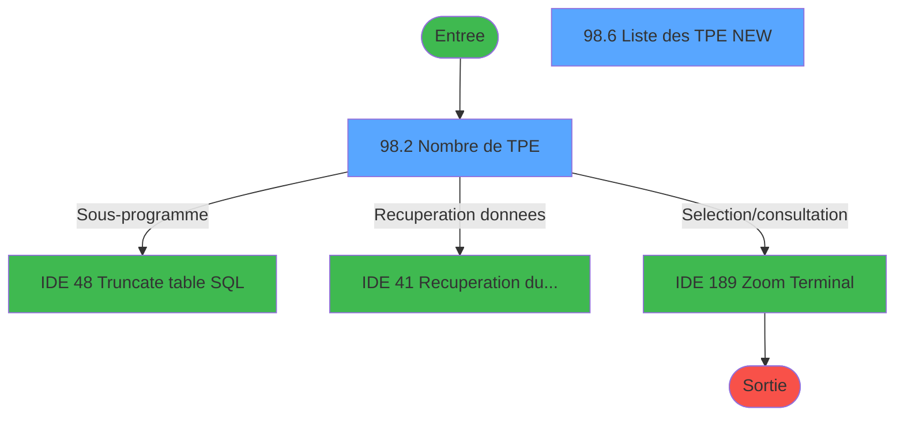
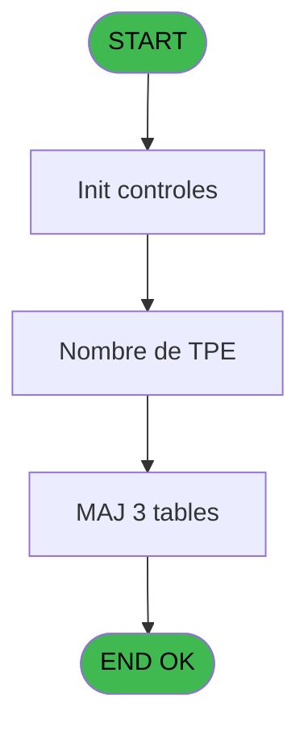
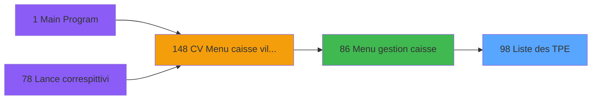
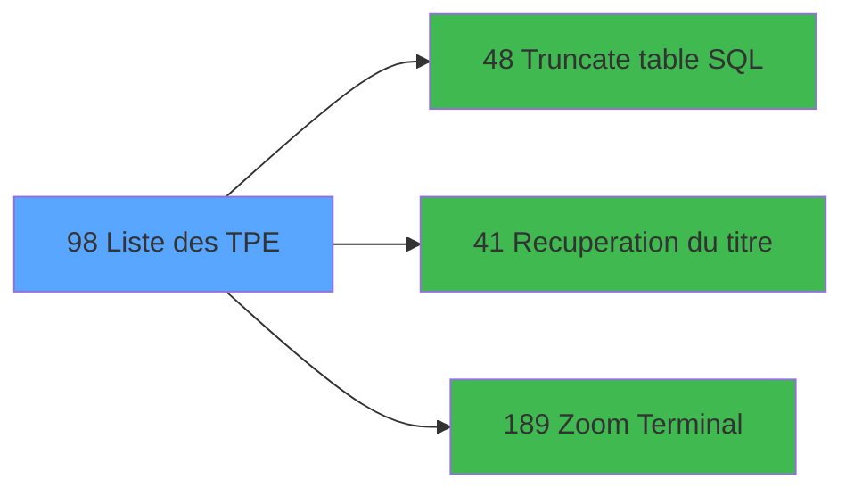

# VIL IDE 98 - Liste des TPE

> **Analyse**: Phases 1-4 2026-02-03 09:20 -> 09:21 (20s) | Assemblage 09:21
> **Pipeline**: V7.2 Enrichi
> **Structure**: 4 onglets (Resume | Ecrans | Donnees | Connexions)

<!-- TAB:Resume -->

## 1. FICHE D'IDENTITE

| Attribut | Valeur |
|----------|--------|
| Projet | VIL |
| IDE Position | 98 |
| Nom Programme | Liste des TPE |
| Fichier source | `Prg_98.xml` |
| Domaine metier | General |
| Taches | 17 (2 ecrans visibles) |
| Tables modifiees | 3 |
| Programmes appeles | 3 |

## 2. DESCRIPTION FONCTIONNELLE

**Liste des TPE** assure la gestion complete de ce processus, accessible depuis [Menu gestion caisse (IDE 86)](VIL-IDE-86.md).

Le flux de traitement s'organise en **5 blocs fonctionnels** :

- **Traitement** (10 taches) : traitements metier divers
- **Initialisation** (4 taches) : reinitialisation d'etats et de variables de travail
- **Reglement** (1 tache) : gestion des moyens de paiement et reglements
- **Calcul** (1 tache) : calculs de montants, stocks ou compteurs
- **Impression** (1 tache) : generation de tickets et documents

**Donnees modifiees** : 3 tables en ecriture (liste_des_tpe, tpe_par_service, tickets_tpe).

Detail : phases du traitement

#### Phase 1 : Traitement (10 taches)

- **98** - Liste des TPE **[[ECRAN]](#ecran-t1)**
- **98.1** - Nombre actuel
- **98.2** - Nombre de TPE **[[ECRAN]](#ecran-t3)**
- **98.5.1.1** - UNI
- **98.5.1.1.1** - Fin CLASSE
- **98.5.1.2** - BI
- **98.5.1.2.1** - Fin CLASSE
- **98.5.2** - Genere lien term
- **98.6** - Liste des TPE NEW **[[ECRAN]](#ecran-t20)**
- **98.7** - Ligne grise

Delegue a : [Truncate table SQL (IDE 48)](VIL-IDE-48.md), [Recuperation du titre (IDE 41)](VIL-IDE-41.md)

#### Phase 2 : Initialisation (4 taches)

- **98.3** - RAZ en trop
- **98.3.1** - RAZ TPE
- **98.3.3** - RAZ TPE Term
- **98.5** - Initialisation NEW

#### Phase 3 : Impression (1 tache)

- **98.3.2** - RAZ TPE ticket

#### Phase 4 : Calcul (1 tache)

- **98.4** - RAZ date comptable

#### Phase 5 : Reglement (1 tache)

- **98.5.1** - Lecture MOP

#### Tables impactees

| Table | Operations | Role metier |
|-------|-----------|-------------|
| liste_des_tpe | R/**W**/L (9 usages) |  |
| tpe_par_service | **W**/L (4 usages) | Services / filieres |
| tickets_tpe | **W** (2 usages) |  |

## 3. BLOCS FONCTIONNELS

### 3.1 Traitement (10 taches)

Traitements internes.

---

#### 98 - Liste des TPE [[ECRAN]](#ecran-t1)

**Role** : Tache d'orchestration : point d'entree du programme (10 sous-taches). Coordonne l'enchainement des traitements.
**Ecran** : 640 x 205 DLU (MDI) | [Voir mockup](#ecran-t1)

9 sous-taches directes

| Tache | Nom | Bloc |
|-------|-----|------|
| [98.1](#t2) | Nombre actuel | Traitement |
| [98.2](#t3) | Nombre de TPE **[[ECRAN]](#ecran-t3)** | Traitement |
| [98.5.1.1](#t14) | UNI | Traitement |
| [98.5.1.1.1](#t15) | Fin CLASSE | Traitement |
| [98.5.1.2](#t16) | BI | Traitement |
| [98.5.1.2.1](#t17) | Fin CLASSE | Traitement |
| [98.5.2](#t19) | Genere lien term | Traitement |
| [98.6](#t20) | Liste des TPE NEW **[[ECRAN]](#ecran-t20)** | Traitement |
| [98.7](#t22) | Ligne grise | Traitement |

**Delegue a** : [Truncate table SQL (IDE 48)](VIL-IDE-48.md), [Recuperation du titre (IDE 41)](VIL-IDE-41.md)

---

#### 98.1 - Nombre actuel

**Role** : Calcul : Nombre actuel.
**Variables liees** : D (Nombre tpe)
**Delegue a** : [Truncate table SQL (IDE 48)](VIL-IDE-48.md), [Recuperation du titre (IDE 41)](VIL-IDE-41.md)

---

#### 98.2 - Nombre de TPE [[ECRAN]](#ecran-t3)

**Role** : Calcul : Nombre de TPE.
**Ecran** : 642 x 202 DLU (MDI) | [Voir mockup](#ecran-t3)
**Variables liees** : D (Nombre tpe)
**Delegue a** : [Truncate table SQL (IDE 48)](VIL-IDE-48.md), [Recuperation du titre (IDE 41)](VIL-IDE-41.md)

---

#### 98.5.1.1 - UNI

**Role** : Traitement interne.

---

#### 98.5.1.1.1 - Fin CLASSE

**Role** : Traitement : Fin CLASSE.
**Delegue a** : [Truncate table SQL (IDE 48)](VIL-IDE-48.md), [Recuperation du titre (IDE 41)](VIL-IDE-41.md)

---

#### 98.5.1.2 - BI

**Role** : Traitement interne.

---

#### 98.5.1.2.1 - Fin CLASSE

**Role** : Traitement : Fin CLASSE.
**Delegue a** : [Truncate table SQL (IDE 48)](VIL-IDE-48.md), [Recuperation du titre (IDE 41)](VIL-IDE-41.md)

---

#### 98.5.2 - Genere lien term

**Role** : Traitement : Genere lien term.
**Delegue a** : [Truncate table SQL (IDE 48)](VIL-IDE-48.md), [Recuperation du titre (IDE 41)](VIL-IDE-41.md)

---

#### 98.6 - Liste des TPE NEW [[ECRAN]](#ecran-t20)

**Role** : Traitement : Liste des TPE NEW.
**Ecran** : 1070 x 0 DLU (MDI) | [Voir mockup](#ecran-t20)
**Delegue a** : [Truncate table SQL (IDE 48)](VIL-IDE-48.md), [Recuperation du titre (IDE 41)](VIL-IDE-41.md)

---

#### 98.7 - Ligne grise

**Role** : Traitement : Ligne grise.
**Delegue a** : [Truncate table SQL (IDE 48)](VIL-IDE-48.md), [Recuperation du titre (IDE 41)](VIL-IDE-41.md)

### 3.2 Initialisation (4 taches)

Reinitialisation d'etats et variables de travail.

---

#### 98.3 - RAZ en trop

**Role** : Reinitialisation : RAZ en trop.

---

#### 98.3.1 - RAZ TPE

**Role** : Reinitialisation : RAZ TPE.

---

#### 98.3.3 - RAZ TPE Term

**Role** : Reinitialisation : RAZ TPE Term.

---

#### 98.5 - Initialisation NEW

**Role** : Reinitialisation : Initialisation NEW.

### 3.3 Impression (1 tache)

Generation des documents et tickets.

---

#### 98.3.2 - RAZ TPE ticket

**Role** : Generation du document : RAZ TPE ticket.

### 3.4 Calcul (1 tache)

Calculs metier : montants, stocks, compteurs.

---

#### 98.4 - RAZ date comptable

**Role** : Reinitialisation : RAZ date comptable.
**Variables liees** : B (Param date comptable)

### 3.5 Reglement (1 tache)

Gestion des moyens de paiement : 1 tache de reglement.

---

#### 98.5.1 - Lecture MOP

**Role** : Traitement : Lecture MOP.

## 5. REGLES METIER

*(Aucune regle metier identifiee)*

## 6. CONTEXTE

- **Appele par**: [Menu gestion caisse (IDE 86)](VIL-IDE-86.md)
- **Appelle**: 3 programmes | **Tables**: 6 (W:3 R:4 L:2) | **Taches**: 17 | **Expressions**: 3

<!-- TAB:Ecrans -->

## 8. ECRANS

### 8.1 Forms visibles (2 / 17)

| # | Position | Tache | Nom | Type | Largeur | Hauteur | Bloc |
|---|----------|-------|-----|------|---------|---------|------|
| 1 | 98.2 | 98.2 | Nombre de TPE | MDI | 642 | 202 | Traitement |
| 2 | 98.6 | 98.6 | Liste des TPE NEW | MDI | 1070 | 0 | Traitement |

### 8.2 Mockups Ecrans

---

#### 98.2 - Nombre de TPE
**Tache** : [98.2](#t3) | **Type** : MDI | **Dimensions** : 642 x 202 DLU
**Bloc** : Traitement | **Titre IDE** : Nombre de TPE

<!-- FORM-DATA:
{
    "width":  642,
    "vFactor":  8,
    "type":  "MDI",
    "hFactor":  8,
    "controls":  [
                     {
                         "x":  1,
                         "type":  "label",
                         "var":  "",
                         "y":  2,
                         "w":  637,
                         "fmt":  "",
                         "name":  "",
                         "h":  18,
                         "color":  "",
                         "text":  "",
                         "parent":  null
                     },
                     {
                         "x":  179,
                         "type":  "label",
                         "var":  "",
                         "y":  81,
                         "w":  282,
                         "fmt":  "",
                         "name":  "",
                         "h":  39,
                         "color":  "",
                         "text":  "",
                         "parent":  null
                     },
                     {
                         "x":  195,
                         "type":  "label",
                         "var":  "",
                         "y":  96,
                         "w":  163,
                         "fmt":  "",
                         "name":  "",
                         "h":  8,
                         "color":  "",
                         "text":  "Nombre TPE",
                         "parent":  null
                     },
                     {
                         "x":  1,
                         "type":  "label",
                         "var":  "",
                         "y":  176,
                         "w":  637,
                         "fmt":  "",
                         "name":  "",
                         "h":  24,
                         "color":  "",
                         "text":  "",
                         "parent":  null
                     },
                     {
                         "x":  386,
                         "type":  "edit",
                         "var":  "",
                         "y":  95,
                         "w":  37,
                         "fmt":  "",
                         "name":  "",
                         "h":  10,
                         "color":  "6",
                         "text":  "",
                         "parent":  null
                     },
                     {
                         "x":  417,
                         "type":  "edit",
                         "var":  "",
                         "y":  7,
                         "w":  216,
                         "fmt":  "WWW  DD MMM YYYYT",
                         "name":  "",
                         "h":  8,
                         "color":  "",
                         "text":  "",
                         "parent":  null
                     },
                     {
                         "x":  5,
                         "type":  "button",
                         "var":  "",
                         "y":  179,
                         "w":  154,
                         "fmt":  "\u0026Abandon",
                         "name":  "",
                         "h":  18,
                         "color":  "",
                         "text":  "",
                         "parent":  null
                     },
                     {
                         "x":  479,
                         "type":  "button",
                         "var":  "",
                         "y":  179,
                         "w":  154,
                         "fmt":  "\u0026Validation",
                         "name":  "",
                         "h":  18,
                         "color":  "",
                         "text":  "",
                         "parent":  null
                     },
                     {
                         "x":  5,
                         "type":  "edit",
                         "var":  "",
                         "y":  7,
                         "w":  267,
                         "fmt":  "30",
                         "name":  "",
                         "h":  8,
                         "color":  "",
                         "text":  "",
                         "parent":  null
                     }
                 ],
    "taskId":  "98.2",
    "height":  202
}
-->

<strong>Champs : 3 champs</strong>

| Pos (x,y) | Nom | Variable | Type |
|-----------|-----|----------|------|
| 386,95 | (sans nom) | - | edit |
| 417,7 | WWW  DD MMM YYYYT | - | edit |
| 5,7 | 30 | - | edit |

<strong>Boutons : 2 boutons</strong>

| Bouton | Pos (x,y) | Action |
|--------|-----------|--------|
| Abandon | 5,179 | Annule et retour au menu |
| Validation | 479,179 | Valide la saisie et enregistre |

---

#### 98.6 - Liste des TPE NEW
**Tache** : [98.6](#t20) | **Type** : MDI | **Dimensions** : 1070 x 0 DLU
**Bloc** : Traitement | **Titre IDE** : Liste des TPE NEW

<!-- FORM-DATA:
{
    "width":  1070,
    "vFactor":  8,
    "type":  "MDI",
    "hFactor":  8,
    "controls":  [
                     {
                         "x":  1,
                         "type":  "label",
                         "var":  "",
                         "y":  2,
                         "w":  1069,
                         "fmt":  "",
                         "name":  "",
                         "h":  18,
                         "color":  "",
                         "text":  "",
                         "parent":  null
                     },
                     {
                         "x":  75,
                         "type":  "table",
                         "var":  "",
                         "name":  "",
                         "titleH":  12,
                         "color":  "110",
                         "w":  920,
                         "y":  32,
                         "fmt":  "",
                         "parent":  null,
                         "text":  "",
                         "rowH":  10,
                         "h":  132,
                         "cols":  [
                                      {
                                          "title":  "Numéro",
                                          "layer":  1,
                                          "w":  79
                                      },
                                      {
                                          "title":  "MOP",
                                          "layer":  2,
                                          "w":  91
                                      },
                                      {
                                          "title":  "Emplacement TPE",
                                          "layer":  3,
                                          "w":  371
                                      },
                                      {
                                          "title":  "Term IMS",
                                          "layer":  4,
                                          "w":  90
                                      },
                                      {
                                          "title":  "Nom terminal IMS",
                                          "layer":  5,
                                          "w":  254
                                      }
                                  ],
                         "rows":  5
                     },
                     {
                         "x":  1,
                         "type":  "label",
                         "var":  "",
                         "y":  176,
                         "w":  1069,
                         "fmt":  "",
                         "name":  "",
                         "h":  24,
                         "color":  "",
                         "text":  "",
                         "parent":  null
                     },
                     {
                         "x":  82,
                         "type":  "edit",
                         "var":  "",
                         "y":  46,
                         "w":  69,
                         "fmt":  "",
                         "name":  "",
                         "h":  8,
                         "color":  "110",
                         "text":  "",
                         "parent":  4
                     },
                     {
                         "x":  160,
                         "type":  "edit",
                         "var":  "",
                         "y":  46,
                         "w":  82,
                         "fmt":  "",
                         "name":  "",
                         "h":  8,
                         "color":  "110",
                         "text":  "",
                         "parent":  4
                     },
                     {
                         "x":  250,
                         "type":  "edit",
                         "var":  "",
                         "y":  46,
                         "w":  360,
                         "fmt":  "U64",
                         "name":  "Libelle du TPE",
                         "h":  8,
                         "color":  "110",
                         "text":  "",
                         "parent":  4
                     },
                     {
                         "x":  624,
                         "type":  "edit",
                         "var":  "",
                         "y":  46,
                         "w":  74,
                         "fmt":  "",
                         "name":  "Terminal IMS",
                         "h":  8,
                         "color":  "110",
                         "text":  "",
                         "parent":  4
                     },
                     {
                         "x":  712,
                         "type":  "edit",
                         "var":  "",
                         "y":  46,
                         "w":  240,
                         "fmt":  "UX19",
                         "name":  "",
                         "h":  8,
                         "color":  "110",
                         "text":  "",
                         "parent":  4
                     },
                     {
                         "x":  5,
                         "type":  "edit",
                         "var":  "",
                         "y":  7,
                         "w":  267,
                         "fmt":  "30",
                         "name":  "",
                         "h":  8,
                         "color":  "",
                         "text":  "",
                         "parent":  null
                     },
                     {
                         "x":  848,
                         "type":  "edit",
                         "var":  "",
                         "y":  7,
                         "w":  216,
                         "fmt":  "WWW  DD MMM YYYYT",
                         "name":  "",
                         "h":  8,
                         "color":  "",
                         "text":  "",
                         "parent":  null
                     },
                     {
                         "x":  5,
                         "type":  "button",
                         "var":  "",
                         "y":  179,
                         "w":  154,
                         "fmt":  "\u0026Abandon",
                         "name":  "",
                         "h":  18,
                         "color":  "",
                         "text":  "",
                         "parent":  null
                     },
                     {
                         "x":  910,
                         "type":  "button",
                         "var":  "",
                         "y":  179,
                         "w":  154,
                         "fmt":  "\u0026Validation",
                         "name":  "",
                         "h":  18,
                         "color":  "",
                         "text":  "",
                         "parent":  null
                     }
                 ],
    "taskId":  "98.6",
    "height":  0
}
-->

<strong>Champs : 7 champs</strong>

| Pos (x,y) | Nom | Variable | Type |
|-----------|-----|----------|------|
| 82,46 | (sans nom) | - | edit |
| 160,46 | (sans nom) | - | edit |
| 250,46 | Libelle du TPE | - | edit |
| 624,46 | Terminal IMS | - | edit |
| 712,46 | UX19 | - | edit |
| 5,7 | 30 | - | edit |
| 848,7 | WWW  DD MMM YYYYT | - | edit |

<strong>Boutons : 2 boutons</strong>

| Bouton | Pos (x,y) | Action |
|--------|-----------|--------|
| Abandon | 5,179 | Annule et retour au menu |
| Validation | 910,179 | Valide la saisie et enregistre |

## 9. NAVIGATION

### 9.1 Enchainement des ecrans

**Detail par enchainement :**

| Depuis | Action | Vers | Retour |
|--------|--------|------|--------|
| Nombre de TPE | Sous-programme | [Truncate table SQL (IDE 48)](VIL-IDE-48.md) | Retour ecran |
| Nombre de TPE | Recuperation donnees | [Recuperation du titre (IDE 41)](VIL-IDE-41.md) | Retour ecran |
| Nombre de TPE | Selection/consultation | [Zoom Terminal (IDE 189)](VIL-IDE-189.md) | Retour ecran |

### 9.3 Structure hierarchique (17 taches)

| Position | Tache | Type | Dimensions | Bloc |
|----------|-------|------|------------|------|
| **98.1** | [**Liste des TPE** (98)](#t1) [mockup](#ecran-t1) | MDI | 640x205 | Traitement |
| 98.1.1 | [Nombre actuel (98.1)](#t2) | MDI | - | |
| 98.1.2 | [Nombre de TPE (98.2)](#t3) [mockup](#ecran-t3) | MDI | 642x202 | |
| 98.1.3 | [UNI (98.5.1.1)](#t14) | MDI | - | |
| 98.1.4 | [Fin CLASSE (98.5.1.1.1)](#t15) | MDI | - | |
| 98.1.5 | [BI (98.5.1.2)](#t16) | MDI | - | |
| 98.1.6 | [Fin CLASSE (98.5.1.2.1)](#t17) | MDI | - | |
| 98.1.7 | [Genere lien term (98.5.2)](#t19) | MDI | - | |
| 98.1.8 | [Liste des TPE NEW (98.6)](#t20) [mockup](#ecran-t20) | MDI | 1070x0 | |
| 98.1.9 | [Ligne grise (98.7)](#t22) | MDI | - | |
| **98.2** | [**RAZ en trop** (98.3)](#t7) | MDI | - | Initialisation |
| 98.2.1 | [RAZ TPE (98.3.1)](#t8) | MDI | - | |
| 98.2.2 | [RAZ TPE Term (98.3.3)](#t10) | MDI | - | |
| 98.2.3 | [Initialisation NEW (98.5)](#t12) | MDI | - | |
| **98.3** | [**RAZ TPE ticket** (98.3.2)](#t9) | MDI | - | Impression |
| **98.4** | [**RAZ date comptable** (98.4)](#t11) | MDI | - | Calcul |
| **98.5** | [**Lecture MOP** (98.5.1)](#t13) | MDI | - | Reglement |

### 9.4 Algorigramme

> **Legende**: Vert = START/END OK | Rouge = END KO | Bleu = Decisions
> *Algorigramme auto-genere. Utiliser `/algorigramme` pour une synthese metier detaillee.*

<!-- TAB:Donnees -->

## 10. TABLES

### Tables utilisees (6)

| ID | Nom | Description | Type | R | W | L | Usages |
|----|-----|-------------|------|---|---|---|--------|
| 24 | imprimante_______prn |  | DB | R |   |   | 1 |
| 89 | moyen_paiement___mop |  | DB | R |   |   | 2 |
| 140 | moyen_paiement___mop |  | DB | R |   |   | 1 |
| 258 | liste_des_tpe |  | DB | R | **W** | L | 9 |
| 259 | tpe_par_service | Services / filieres | DB |   | **W** | L | 4 |
| 260 | tickets_tpe |  | DB |   | **W** |   | 2 |

### Colonnes par table (0 / 6 tables avec colonnes identifiees)

Table 24 - imprimante_______prn (R) - 1 usages

*Table utilisee uniquement en Link ou aucune colonne Real identifiee dans le DataView.*

Table 89 - moyen_paiement___mop (R) - 2 usages

*Table utilisee uniquement en Link ou aucune colonne Real identifiee dans le DataView.*

Table 140 - moyen_paiement___mop (R) - 1 usages

*Table utilisee uniquement en Link ou aucune colonne Real identifiee dans le DataView.*

Table 258 - liste_des_tpe (R/**W**/L) - 9 usages

*Table utilisee uniquement en Link ou aucune colonne Real identifiee dans le DataView.*

Table 259 - tpe_par_service (**W**/L) - 4 usages

*Table utilisee uniquement en Link ou aucune colonne Real identifiee dans le DataView.*

Table 260 - tickets_tpe (**W**) - 2 usages

*Table utilisee uniquement en Link ou aucune colonne Real identifiee dans le DataView.*

## 11. VARIABLES

### 11.1 Autres (5)

Variables diverses.

| Lettre | Nom | Type | Usage dans |
|--------|-----|------|-----------|
| A | Param societe | Alpha | - |
| B | Param date comptable | Date | - |
| C | Param UNI/BI | Alpha | - |
| D | Nombre tpe | Numeric | [98.1](#t2), [98.2](#t3) |
| E | Flag Abandon | Logical | 1x refs |

## 12. EXPRESSIONS

**3 / 3 expressions decodees (100%)**

### 12.1 Repartition par type

| Type | Expressions | Regles |
|------|-------------|--------|
| CONSTANTE | 1 | 0 |
| NEGATION | 1 | 0 |
| CONDITION | 1 | 0 |

### 12.2 Expressions cles par type

#### CONSTANTE (1 expressions)

| Type | IDE | Expression | Regle |
|------|-----|------------|-------|
| CONSTANTE | 3 | `0` | - |

#### NEGATION (1 expressions)

| Type | IDE | Expression | Regle |
|------|-----|------------|-------|
| NEGATION | 1 | `NOT (Flag Abandon [E])` | - |

#### CONDITION (1 expressions)

| Type | IDE | Expression | Regle |
|------|-----|------------|-------|
| CONDITION | 2 | `Nombre tpe [D]>0` | - |

<!-- TAB:Connexions -->

## 13. GRAPHE D'APPELS

### 13.1 Chaine depuis Main (Callers)

Main -> ... -> [Menu gestion caisse (IDE 86)](VIL-IDE-86.md) -> **Liste des TPE (IDE 98)**

### 13.2 Callers

| IDE | Nom Programme | Nb Appels |
|-----|---------------|-----------|
| [86](VIL-IDE-86.md) | Menu gestion caisse | 1 |

### 13.3 Callees (programmes appeles)

### 13.4 Detail Callees avec contexte

| IDE | Nom Programme | Appels | Contexte |
|-----|---------------|--------|----------|
| [48](VIL-IDE-48.md) | Truncate table SQL | 3 | Sous-programme |
| [41](VIL-IDE-41.md) | Recuperation du titre | 2 | Recuperation donnees |
| [189](VIL-IDE-189.md) | Zoom Terminal | 1 | Selection/consultation |

## 14. RECOMMANDATIONS MIGRATION

### 14.1 Profil du programme

| Metrique | Valeur | Impact migration |
|----------|--------|-----------------|
| Lignes de logique | 146 | Programme compact |
| Expressions | 3 | Peu de logique |
| Tables WRITE | 3 | Impact modere |
| Sous-programmes | 3 | Peu de dependances |
| Ecrans visibles | 2 | Quelques ecrans |
| Code desactive | 0% (0 / 146) | Code sain |
| Regles metier | 0 | Pas de regle identifiee |

### 14.2 Plan de migration par bloc

#### Traitement (10 taches: 3 ecrans, 7 traitements)

- **Strategie** : Orchestrateur avec 3 ecrans (Razor/React) et 7 traitements backend (services).
- Les ecrans deviennent des composants UI, les traitements invisibles deviennent des services injectables.
- 3 sous-programme(s) a migrer ou a reutiliser depuis les services existants.
- Decomposer les taches en services unitaires testables.

#### Initialisation (4 taches: 0 ecran, 4 traitements)

- **Strategie** : Constructeur/methode `InitAsync()` dans l'orchestrateur.

#### Impression (1 tache: 0 ecran, 1 traitement)

- **Strategie** : Templates HTML -> PDF via wkhtmltopdf ou Puppeteer.
- `PrintService` injectable avec choix imprimante

#### Calcul (1 tache: 0 ecran, 1 traitement)

- **Strategie** : Services de calcul purs (Domain Services).
- Migrer la logique de calcul (stock, compteurs, montants)

#### Reglement (1 tache: 0 ecran, 1 traitement)

- **Strategie** : Service `IReglementService` avec pattern Strategy par mode de paiement.
- Integration TPE si applicable

### 14.3 Dependances critiques

| Dependance | Type | Appels | Impact |
|------------|------|--------|--------|
| liste_des_tpe | Table WRITE (Database) | 3x | Schema + repository |
| tpe_par_service | Table WRITE (Database) | 2x | Schema + repository |
| tickets_tpe | Table WRITE (Database) | 2x | Schema + repository |
| [Truncate table SQL (IDE 48)](VIL-IDE-48.md) | Sous-programme | 3x | **CRITIQUE** - Sous-programme |
| [Recuperation du titre (IDE 41)](VIL-IDE-41.md) | Sous-programme | 2x | Haute - Recuperation donnees |
| [Zoom Terminal (IDE 189)](VIL-IDE-189.md) | Sous-programme | 1x | Normale - Selection/consultation |

---
*Spec DETAILED generee par Pipeline V7.2 - 2026-02-03 09:21*
