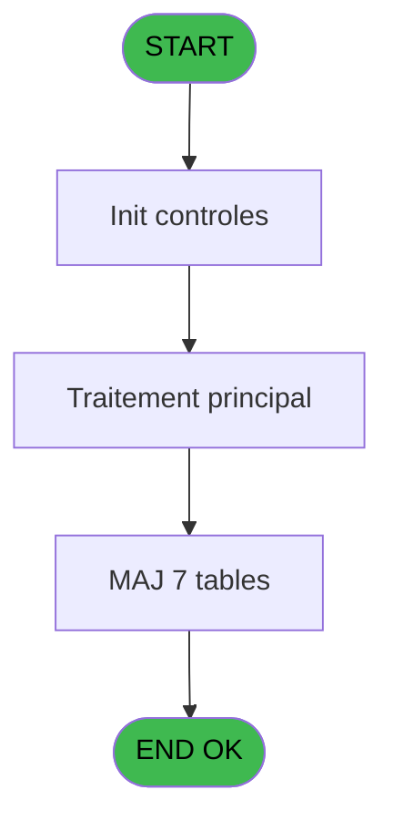
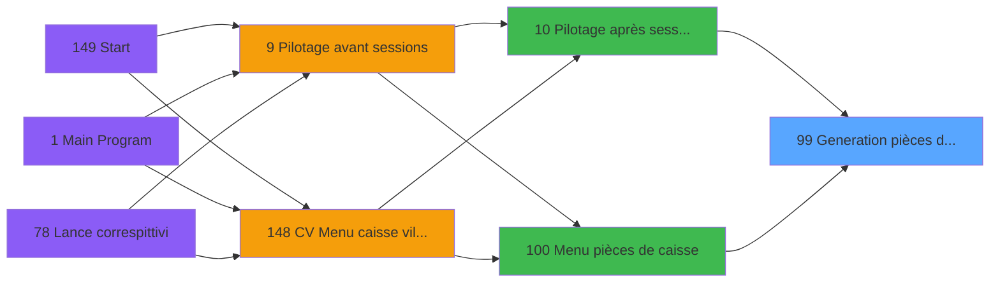

# VIL IDE 99 - Generation pièces de caisse

> **Analyse**: Phases 1-4 2026-02-03 09:21 -> 09:21 (20s) | Assemblage 09:21
> **Pipeline**: V7.2 Enrichi
> **Structure**: 4 onglets (Resume | Ecrans | Donnees | Connexions)

<!-- TAB:Resume -->

## 1. FICHE D'IDENTITE

| Attribut | Valeur |
|----------|--------|
| Projet | VIL |
| IDE Position | 99 |
| Nom Programme | Generation pièces de caisse |
| Fichier source | `Prg_99.xml` |
| Domaine metier | Caisse |
| Taches | 58 (0 ecrans visibles) |
| Tables modifiees | 7 |
| Programmes appeles | 1 |

## 2. DESCRIPTION FONCTIONNELLE

**Generation pièces de caisse** assure la gestion complete de ce processus, accessible depuis [Pilotage après sessions (IDE 10)](VIL-IDE-10.md), [Menu pièces de caisse (IDE 100)](VIL-IDE-100.md).

Le flux de traitement s'organise en **6 blocs fonctionnels** :

- **Traitement** (30 taches) : traitements metier divers
- **Creation** (17 taches) : insertion d'enregistrements en base (mouvements, prestations)
- **Initialisation** (4 taches) : reinitialisation d'etats et de variables de travail
- **Consultation** (4 taches) : ecrans de recherche, selection et consultation
- **Saisie** (2 taches) : ecrans de saisie utilisateur (formulaires, champs, donnees)
- **Calcul** (1 tache) : calculs de montants, stocks ou compteurs

**Donnees modifiees** : 7 tables en ecriture (pieces_caisse____pks, complement_pieces_de_caisse, ecarts, histo_appro_remise, pv_deposit, pv_modelstemp, pv_cust_packages).

Detail : phases du traitement

#### Phase 1 : Traitement (30 taches)

- **99** - Generation pièces de caisse WS
- **99.1** - param caisse
- **99.2.2** - suppression
- **99.2.2.1** - supp complement
- **99.3** - TPE v1
- **99.4** - CHECKOUT
- **99.4.2** - lecture tempo
- **99.5** - VERSEMENT RETRAIT
- **99.5.2** - lecture tempo
- **99.6.2** - lecture tempo
- **99.6.2.1.1** - Compl PDC
- **99.7** - REMISEPAPER
- **99.7.1** - UNI
- **99.7.2** - BI
- **99.8** - ECARTS
- **99.8.2** - Lecture sessions
- **99.8.2.1** - Detail session
- **99.8.3** - Lecture ecarts
- **99.8.3.1** - Imputation
- **99.9** - APPRO REMISE
- **99.9.1** - Detail session
- **99.9.1.1** - Imputation
- **99.10** - SOLDE APPRO/REMISE
- **99.10.3** - Update APP/REM
- **99.11** - PDC boutique
- **99.11.1** - Lecture service
- **99.11.2.1** - Compl PDC
- **99.12** - TPE
- **99.13** - TPE
- **99.14** - TPE v1

#### Phase 2 : Initialisation (4 taches)

- **99.2** - Initialisation
- **99.8.1** - Initialisation
- **99.10.1** - INIT1
- **99.10.2** - INIT2

#### Phase 3 : Calcul (1 tache)

- **99.2.1** - Compte change

#### Phase 4 : Creation (17 taches)

- **99.3.1** - Creation PDC
- **99.4.1.1** - creation tempo
- **99.4.2.1** - Creation PDC CHECKOUT
- **99.5.1.1** - creation tempo
- **99.5.2.1** - Creation PDC CHECKOUT
- **99.6.1.1** - creation tempo
- **99.7.1.1** - Creation PDC
- **99.7.2.1** - Creation PDC
- **99.8.2.1.1** - creation
- **99.8.3.2** - Creation PDC
- **99.11.2** - Creation PDC
- **99.12.1** - Creation PDC
- **99.6.1.2** - creation tempo GP
- **99.6.3.1** - creation tempo
- **99.6.3.2** - creation tempo GP
- **99.13.1** - Creation PDC
- **99.14.1** - Creation PDC

#### Phase 5 : Consultation (4 taches)

- **99.4.1** - Selection
- **99.5.1** - Selection
- **99.6.1** - Selection v1
- **99.6.3** - Selection v1

Delegue a : [Recup Classe et Lib du MOP (IDE 120)](VIL-IDE-120.md)

#### Phase 6 : Saisie (2 taches)

- **99.6** - VENTES
- **99.6.2.1** - Creation PDC VENTES

#### Tables impactees

| Table | Operations | Role metier |
|-------|-----------|-------------|
| pieces_caisse____pks | R/**W** (18 usages) | Sessions de caisse |
| complement_pieces_de_caisse | **W**/L (9 usages) | Sessions de caisse |
| pv_modelstemp | **W**/L (5 usages) |  |
| pv_deposit | **W**/L (4 usages) |  |
| ecarts | R/**W**/L (4 usages) |  |
| histo_appro_remise | R/**W** (3 usages) | Historique / journal |
| pv_cust_packages | **W**/L (2 usages) |  |

## 3. BLOCS FONCTIONNELS

### 3.1 Traitement (30 taches)

Traitements internes.

---

#### 99 - Generation pièces de caisse WS

**Role** : Tache d'orchestration : point d'entree du programme (30 sous-taches). Coordonne l'enchainement des traitements.

29 sous-taches directes

| Tache | Nom | Bloc |
|-------|-----|------|
| [99.1](#t2) | param caisse | Traitement |
| [99.2.2](#t5) | suppression | Traitement |
| [99.2.2.1](#t6) | supp complement | Traitement |
| [99.3](#t11) | TPE v1 | Traitement |
| [99.4](#t13) | CHECKOUT | Traitement |
| [99.4.2](#t16) | lecture tempo | Traitement |
| [99.5](#t18) | VERSEMENT RETRAIT | Traitement |
| [99.5.2](#t21) | lecture tempo | Traitement |
| [99.6.2](#t26) | lecture tempo | Traitement |
| [99.6.2.1.1](#t28) | Compl PDC | Traitement |
| [99.7](#t29) | REMISEPAPER | Traitement |
| [99.7.1](#t30) | UNI | Traitement |
| [99.7.2](#t32) | BI | Traitement |
| [99.8](#t34) | ECARTS | Traitement |
| [99.8.2](#t36) | Lecture sessions | Traitement |
| [99.8.2.1](#t37) | Detail session | Traitement |
| [99.8.3](#t39) | Lecture ecarts | Traitement |
| [99.8.3.1](#t40) | Imputation | Traitement |
| [99.9](#t42) | APPRO REMISE | Traitement |
| [99.9.1](#t43) | Detail session | Traitement |
| [99.9.1.1](#t44) | Imputation | Traitement |
| [99.10](#t46) | SOLDE APPRO/REMISE | Traitement |
| [99.10.3](#t49) | Update APP/REM | Traitement |
| [99.11](#t51) | PDC boutique | Traitement |
| [99.11.1](#t52) | Lecture service | Traitement |
| [99.11.2.1](#t54) | Compl PDC | Traitement |
| [99.12](#t57) | TPE | Traitement |
| [99.13](#t69) | TPE | Traitement |
| [99.14](#t73) | TPE v1 | Traitement |

---

#### 99.1 - param caisse

**Role** : Traitement : param caisse.
**Variables liees** : A (Param societe), B (Param date comptable), C (Param libelle generees), D (Param UNI/BI)

---

#### 99.2.2 - suppression

**Role** : Traitement : suppression.

---

#### 99.2.2.1 - supp complement

**Role** : Traitement : supp complement.

---

#### 99.3 - TPE v1

**Role** : Traitement : TPE v1.

---

#### 99.4 - CHECKOUT

**Role** : Traitement : CHECKOUT.

---

#### 99.4.2 - lecture tempo

**Role** : Traitement : lecture tempo.

---

#### 99.5 - VERSEMENT RETRAIT

**Role** : Traitement : VERSEMENT RETRAIT.

---

#### 99.5.2 - lecture tempo

**Role** : Traitement : lecture tempo.

---

#### 99.6.2 - lecture tempo

**Role** : Traitement : lecture tempo.

---

#### 99.6.2.1.1 - Compl PDC

**Role** : Traitement : Compl PDC.

---

#### 99.7 - REMISEPAPER

**Role** : Calcul fidelite/avantage : REMISEPAPER.

---

#### 99.7.1 - UNI

**Role** : Traitement interne.

---

#### 99.7.2 - BI

**Role** : Traitement interne.

---

#### 99.8 - ECARTS

**Role** : Traitement : ECARTS.

---

#### 99.8.2 - Lecture sessions

**Role** : Traitement : Lecture sessions.
**Variables liees** : H (v solde appro remise sessions)

---

#### 99.8.2.1 - Detail session

**Role** : Traitement : Detail session.
**Variables liees** : H (v solde appro remise sessions)

---

#### 99.8.3 - Lecture ecarts

**Role** : Traitement : Lecture ecarts.

---

#### 99.8.3.1 - Imputation

**Role** : Traitement : Imputation.
**Variables liees** : E (v imputation appro), F (v imputation remise), G (v imputation fdr)

---

#### 99.9 - APPRO REMISE

**Role** : Calcul fidelite/avantage : APPRO REMISE.
**Variables liees** : E (v imputation appro), F (v imputation remise), H (v solde appro remise sessions)

---

#### 99.9.1 - Detail session

**Role** : Traitement : Detail session.
**Variables liees** : H (v solde appro remise sessions)

---

#### 99.9.1.1 - Imputation

**Role** : Traitement : Imputation.
**Variables liees** : E (v imputation appro), F (v imputation remise), G (v imputation fdr)

---

#### 99.10 - SOLDE APPRO/REMISE

**Role** : Consultation/chargement : SOLDE APPRO/REMISE.
**Variables liees** : H (v solde appro remise sessions)

---

#### 99.10.3 - Update APP/REM

**Role** : Traitement : Update APP/REM.

---

#### 99.11 - PDC boutique

**Role** : Traitement : PDC boutique.

---

#### 99.11.1 - Lecture service

**Role** : Traitement : Lecture service.

---

#### 99.11.2.1 - Compl PDC

**Role** : Traitement : Compl PDC.

---

#### 99.12 - TPE

**Role** : Traitement interne.

---

#### 99.13 - TPE

**Role** : Traitement interne.

---

#### 99.14 - TPE v1

**Role** : Traitement : TPE v1.

### 3.2 Initialisation (4 taches)

Reinitialisation d'etats et variables de travail.

---

#### 99.2 - Initialisation

**Role** : Reinitialisation : Initialisation.

---

#### 99.8.1 - Initialisation

**Role** : Reinitialisation : Initialisation.

---

#### 99.10.1 - INIT1

**Role** : Reinitialisation : INIT1.

---

#### 99.10.2 - INIT2

**Role** : Reinitialisation : INIT2.

### 3.3 Calcul (1 tache)

Calculs metier : montants, stocks, compteurs.

---

#### 99.2.1 - Compte change

**Role** : Traitement : Compte change.

### 3.4 Creation (17 taches)

Insertion de nouveaux enregistrements en base.

---

#### 99.3.1 - Creation PDC

**Role** : Creation d'enregistrement : Creation PDC.

---

#### 99.4.1.1 - creation tempo

**Role** : Creation d'enregistrement : creation tempo.

---

#### 99.4.2.1 - Creation PDC CHECKOUT

**Role** : Creation d'enregistrement : Creation PDC CHECKOUT.

---

#### 99.5.1.1 - creation tempo

**Role** : Creation d'enregistrement : creation tempo.

---

#### 99.5.2.1 - Creation PDC CHECKOUT

**Role** : Creation d'enregistrement : Creation PDC CHECKOUT.

---

#### 99.6.1.1 - creation tempo

**Role** : Creation d'enregistrement : creation tempo.

---

#### 99.7.1.1 - Creation PDC

**Role** : Creation d'enregistrement : Creation PDC.

---

#### 99.7.2.1 - Creation PDC

**Role** : Creation d'enregistrement : Creation PDC.

---

#### 99.8.2.1.1 - creation

**Role** : Creation d'enregistrement : creation.

---

#### 99.8.3.2 - Creation PDC

**Role** : Creation d'enregistrement : Creation PDC.

---

#### 99.11.2 - Creation PDC

**Role** : Creation d'enregistrement : Creation PDC.

---

#### 99.12.1 - Creation PDC

**Role** : Creation d'enregistrement : Creation PDC.

---

#### 99.6.1.2 - creation tempo GP

**Role** : Creation d'enregistrement : creation tempo GP.

---

#### 99.6.3.1 - creation tempo

**Role** : Creation d'enregistrement : creation tempo.

---

#### 99.6.3.2 - creation tempo GP

**Role** : Creation d'enregistrement : creation tempo GP.

---

#### 99.13.1 - Creation PDC

**Role** : Creation d'enregistrement : Creation PDC.

---

#### 99.14.1 - Creation PDC

**Role** : Creation d'enregistrement : Creation PDC.

### 3.5 Consultation (4 taches)

Ecrans de recherche et consultation.

---

#### 99.4.1 - Selection

**Role** : Selection par l'operateur : Selection.

---

#### 99.5.1 - Selection

**Role** : Selection par l'operateur : Selection.

---

#### 99.6.1 - Selection v1

**Role** : Selection par l'operateur : Selection v1.

---

#### 99.6.3 - Selection v1

**Role** : Selection par l'operateur : Selection v1.

### 3.6 Saisie (2 taches)

Ce bloc traite la saisie des donnees de la transaction.

---

#### 99.6 - VENTES

**Role** : Saisie des donnees : VENTES.

---

#### 99.6.2.1 - Creation PDC VENTES

**Role** : Saisie des donnees : Creation PDC VENTES.

## 5. REGLES METIER

*(Aucune regle metier identifiee)*

## 6. CONTEXTE

- **Appele par**: [Pilotage après sessions (IDE 10)](VIL-IDE-10.md), [Menu pièces de caisse (IDE 100)](VIL-IDE-100.md)
- **Appelle**: 1 programmes | **Tables**: 31 (W:7 R:13 L:22) | **Taches**: 58 | **Expressions**: 8

<!-- TAB:Ecrans -->

## 8. ECRANS

*(Programme sans ecran visible)*

## 9. NAVIGATION

### 9.3 Structure hierarchique (58 taches)

| Position | Tache | Type | Dimensions | Bloc |
|----------|-------|------|------------|------|
| **99.1** | [**Generation pièces de caisse WS** (99)](#t1) | MDI | - | Traitement |
| 99.1.1 | [param caisse (99.1)](#t2) | MDI | - | |
| 99.1.2 | [suppression (99.2.2)](#t5) | MDI | - | |
| 99.1.3 | [supp complement (99.2.2.1)](#t6) | MDI | - | |
| 99.1.4 | [TPE v1 (99.3)](#t11) | MDI | - | |
| 99.1.5 | [CHECKOUT (99.4)](#t13) | MDI | - | |
| 99.1.6 | [lecture tempo (99.4.2)](#t16) | MDI | - | |
| 99.1.7 | [VERSEMENT RETRAIT (99.5)](#t18) | MDI | - | |
| 99.1.8 | [lecture tempo (99.5.2)](#t21) | MDI | - | |
| 99.1.9 | [lecture tempo (99.6.2)](#t26) | MDI | - | |
| 99.1.10 | [Compl PDC (99.6.2.1.1)](#t28) | MDI | - | |
| 99.1.11 | [REMISEPAPER (99.7)](#t29) | MDI | - | |
| 99.1.12 | [UNI (99.7.1)](#t30) | MDI | - | |
| 99.1.13 | [BI (99.7.2)](#t32) | MDI | - | |
| 99.1.14 | [ECARTS (99.8)](#t34) | MDI | - | |
| 99.1.15 | [Lecture sessions (99.8.2)](#t36) | MDI | - | |
| 99.1.16 | [Detail session (99.8.2.1)](#t37) | MDI | - | |
| 99.1.17 | [Lecture ecarts (99.8.3)](#t39) | MDI | - | |
| 99.1.18 | [Imputation (99.8.3.1)](#t40) | MDI | - | |
| 99.1.19 | [APPRO REMISE (99.9)](#t42) | MDI | - | |
| 99.1.20 | [Detail session (99.9.1)](#t43) | MDI | - | |
| 99.1.21 | [Imputation (99.9.1.1)](#t44) | MDI | - | |
| 99.1.22 | [SOLDE APPRO/REMISE (99.10)](#t46) | MDI | - | |
| 99.1.23 | [Update APP/REM (99.10.3)](#t49) | MDI | - | |
| 99.1.24 | [PDC boutique (99.11)](#t51) | MDI | - | |
| 99.1.25 | [Lecture service (99.11.1)](#t52) | MDI | - | |
| 99.1.26 | [Compl PDC (99.11.2.1)](#t54) | MDI | - | |
| 99.1.27 | [TPE (99.12)](#t57) | MDI | - | |
| 99.1.28 | [TPE (99.13)](#t69) | MDI | - | |
| 99.1.29 | [TPE v1 (99.14)](#t73) | MDI | - | |
| **99.2** | [**Initialisation** (99.2)](#t3) | MDI | - | Initialisation |
| 99.2.1 | [Initialisation (99.8.1)](#t35) | MDI | - | |
| 99.2.2 | [INIT1 (99.10.1)](#t47) | MDI | - | |
| 99.2.3 | [INIT2 (99.10.2)](#t48) | MDI | - | |
| **99.3** | [**Compte change** (99.2.1)](#t4) | MDI | - | Calcul |
| **99.4** | [**Creation PDC** (99.3.1)](#t12) | MDI | - | Creation |
| 99.4.1 | [creation tempo (99.4.1.1)](#t15) | MDI | - | |
| 99.4.2 | [Creation PDC CHECKOUT (99.4.2.1)](#t17) | MDI | - | |
| 99.4.3 | [creation tempo (99.5.1.1)](#t20) | MDI | - | |
| 99.4.4 | [Creation PDC CHECKOUT (99.5.2.1)](#t22) | MDI | - | |
| 99.4.5 | [creation tempo (99.6.1.1)](#t25) | MDI | - | |
| 99.4.6 | [Creation PDC (99.7.1.1)](#t31) | MDI | - | |
| 99.4.7 | [Creation PDC (99.7.2.1)](#t33) | MDI | - | |
| 99.4.8 | [creation (99.8.2.1.1)](#t38) | MDI | - | |
| 99.4.9 | [Creation PDC (99.8.3.2)](#t41) | MDI | - | |
| 99.4.10 | [Creation PDC (99.11.2)](#t53) | MDI | - | |
| 99.4.11 | [Creation PDC (99.12.1)](#t58) | MDI | - | |
| 99.4.12 | [creation tempo GP (99.6.1.2)](#t61) | MDI | - | |
| 99.4.13 | [creation tempo (99.6.3.1)](#t65) | MDI | - | |
| 99.4.14 | [creation tempo GP (99.6.3.2)](#t66) | MDI | - | |
| 99.4.15 | [Creation PDC (99.13.1)](#t70) | MDI | - | |
| 99.4.16 | [Creation PDC (99.14.1)](#t74) | MDI | - | |
| **99.5** | [**Selection** (99.4.1)](#t14) | MDI | - | Consultation |
| 99.5.1 | [Selection (99.5.1)](#t19) | MDI | - | |
| 99.5.2 | [Selection v1 (99.6.1)](#t24) | MDI | - | |
| 99.5.3 | [Selection v1 (99.6.3)](#t64) | MDI | - | |
| **99.6** | [**VENTES** (99.6)](#t23) | MDI | - | Saisie |
| 99.6.1 | [Creation PDC VENTES (99.6.2.1)](#t27) | MDI | - | |

### 9.4 Algorigramme

> **Legende**: Vert = START/END OK | Rouge = END KO | Bleu = Decisions
> *Algorigramme auto-genere. Utiliser `/algorigramme` pour une synthese metier detaillee.*

<!-- TAB:Donnees -->

## 10. TABLES

### Tables utilisees (31)

| ID | Nom | Description | Type | R | W | L | Usages |
|----|-----|-------------|------|---|---|---|--------|
| 40 | comptable________cte |  | DB | R |   |   | 2 |
| 48 | lignes_de_solde__sld |  | DB |   |   | L | 1 |
| 54 | pieces_caisse____pks | Sessions de caisse | DB | R | **W** |   | 18 |
| 65 | comptes_recette__cre | Comptes GM (generaux) | DB | R |   |   | 1 |
| 66 | imputations______imp |  | DB | R |   | L | 9 |
| 68 | compteurs________cpt | Comptes GM (generaux) | DB |   |   | L | 16 |
| 77 | articles_________art | Articles et stock | DB |   |   | L | 1 |
| 89 | moyen_paiement___mop |  | DB |   |   | L | 1 |
| 140 | moyen_paiement___mop |  | DB |   |   | L | 1 |
| 209 | plan_comptable_central |  | DB |   |   | L | 1 |
| 224 | complement_pieces_de_caisse | Sessions de caisse | DB |   | **W** | L | 9 |
| 234 | ecarts |  | DB | R | **W** | L | 4 |
| 240 | saisie_pdc_boutique |  | DB |   |   | L | 1 |
| 246 | histo_sessions_caisse | Sessions de caisse | DB | R |   |   | 2 |
| 249 | histo_sessions_caisse_detail | Sessions de caisse | DB | R |   | L | 3 |
| 252 | histo_appro_remise | Historique / journal | DB | R | **W** |   | 3 |
| 256 | terminaux_boutique |  | DB | R |   |   | 1 |
| 258 | liste_des_tpe |  | DB |   |   | L | 4 |
| 259 | tpe_par_service | Services / filieres | DB |   |   | L | 4 |
| 260 | tickets_tpe |  | DB |   |   | L | 4 |
| 263 | vente | Donnees de ventes | DB | R |   |   | 2 |
| 372 | pv_budget |  | DB | R |   |   | 1 |
| 509 | pv_deposit |  | TMP |   | **W** | L | 4 |
| 514 | pv_modelstemp |  | TMP |   | **W** | L | 5 |
| 515 | pv_invoiceprintpackagestmp |  | TMP |   |   | L | 4 |
| 516 | pv_cust_packages |  | TMP |   | **W** | L | 2 |
| 697 | droits_applications | Droits operateur | DB | R |   | L | 3 |
| 734 | arc_pv_cust_packages |  | DB |   |   | L | 3 |
| 876 | log_express_co |  | DB |   |   | L | 3 |
| 924 | logement_equipement |  | DB |   |   | L | 1 |
| 925 | vente_complement_commun | Donnees de ventes | DB | R |   |   | 1 |

### Colonnes par table (16 / 17 tables avec colonnes identifiees)

Table 40 - comptable________cte (R) - 2 usages

| Lettre | Variable | Acces | Type |
|--------|----------|-------|------|
| B | Param date comptable | R | Date |

Table 54 - pieces_caisse____pks (R/**W**) - 18 usages

| Lettre | Variable | Acces | Type |
|--------|----------|-------|------|
| A | P.i.montant piece | W | Numeric |
| B | P.i.imputation piece | W | Numeric |
| C | P.i.recetteOUdepense | W | Alpha |

Table 65 - comptes_recette__cre (R) - 1 usages

| Lettre | Variable | Acces | Type |
|--------|----------|-------|------|
| C | P.i.recetteOUdepense | R | Alpha |

Table 66 - imputations______imp (R/L) - 9 usages

| Lettre | Variable | Acces | Type |
|--------|----------|-------|------|
| A | V1.Vad | R | Logical |
| B | V1.Numero commercant | R | Alpha |
| C | V1.Montant par moyen de paiemen | R | Numeric |

Table 224 - complement_pieces_de_caisse (**W**/L) - 9 usages

*Table utilisee uniquement en Link ou aucune colonne Real identifiee dans le DataView.*

Table 234 - ecarts (R/**W**/L) - 4 usages

| Lettre | Variable | Acces | Type |
|--------|----------|-------|------|
| A | Montant gain | W | Numeric |
| B | Montant perte | W | Numeric |
| C | Imputation gain | W | Numeric |
| D | Imputation perte | W | Numeric |

Table 246 - histo_sessions_caisse (R) - 2 usages

| Lettre | Variable | Acces | Type |
|--------|----------|-------|------|
| H | v solde appro remise sessions | R | Numeric |

Table 249 - histo_sessions_caisse_detail (R/L) - 3 usages

| Lettre | Variable | Acces | Type |
|--------|----------|-------|------|
| A | Montant compte | R | Numeric |
| B | Montant calcule | R | Numeric |

Table 252 - histo_appro_remise (R/**W**) - 3 usages

| Lettre | Variable | Acces | Type |
|--------|----------|-------|------|
| A | Compte appro | W | Numeric |
| B | Compte remise | W | Numeric |
| E | v imputation appro | W | Numeric |
| F | v imputation remise | W | Numeric |
| H | v solde appro remise sessions | W | Numeric |

Table 256 - terminaux_boutique (R) - 1 usages

| Lettre | Variable | Acces | Type |
|--------|----------|-------|------|
| A | v code service boutique | R | Alpha |

Table 263 - vente (R) - 2 usages

| Lettre | Variable | Acces | Type |
|--------|----------|-------|------|
| A | v.imputation | R | Numeric |
| B | v.montant | R | Numeric |
| C | v.montant | R | Numeric |

Table 372 - pv_budget (R) - 1 usages

*Table utilisee uniquement en Link ou aucune colonne Real identifiee dans le DataView.*

Table 509 - pv_deposit (**W**/L) - 4 usages

*Table utilisee uniquement en Link ou aucune colonne Real identifiee dans le DataView.*

Table 514 - pv_modelstemp (**W**/L) - 5 usages

*Table utilisee uniquement en Link ou aucune colonne Real identifiee dans le DataView.*

Table 516 - pv_cust_packages (**W**/L) - 2 usages

*Table utilisee uniquement en Link ou aucune colonne Real identifiee dans le DataView.*

Table 697 - droits_applications (R/L) - 3 usages

*Table utilisee uniquement en Link ou aucune colonne Real identifiee dans le DataView.*

Table 925 - vente_complement_commun (R) - 1 usages

*Table utilisee uniquement en Link ou aucune colonne Real identifiee dans le DataView.*

## 11. VARIABLES

### 11.1 Variables de session (4)

Variables persistantes pendant toute la session.

| Lettre | Nom | Type | Usage dans |
|--------|-----|------|-----------|
| E | v imputation appro | Numeric | - |
| F | v imputation remise | Numeric | - |
| G | v imputation fdr | Numeric | - |
| H | v solde appro remise sessions | Numeric | - |

### 11.2 Autres (8)

Variables diverses.

| Lettre | Nom | Type | Usage dans |
|--------|-----|------|-----------|
| A | Param societe | Alpha | - |
| B | Param date comptable | Date | - |
| C | Param libelle generees | Alpha | - |
| D | Param UNI/BI | Alpha | - |
| I | cloture_auto | Logical | - |
| J | N° Commercant EMV | Alpha | - |
| K | N° Commercant AMEX | Alpha | - |
| L | N° Commercant VAD | Alpha | - |

## 12. EXPRESSIONS

**8 / 8 expressions decodees (100%)**

### 12.1 Repartition par type

| Type | Expressions | Regles |
|------|-------------|--------|
| OTHER | 4 | 0 |
| NEGATION | 2 | 0 |
| REFERENCE_VG | 2 | 0 |

### 12.2 Expressions cles par type

#### OTHER (4 expressions)

| Type | IDE | Expression | Regle |
|------|-----|------------|-------|
| OTHER | 3 | `SetCrsr (1)` | - |
| OTHER | 6 | `NOT(VG38)` | - |
| OTHER | 1 | `MlsTrans ('Les pièces de caisse sont generees')` | - |
| OTHER | 2 | `SetCrsr (2)` | - |

#### NEGATION (2 expressions)

| Type | IDE | Expression | Regle |
|------|-----|------------|-------|
| NEGATION | 7 | `NOT VG39` | - |
| NEGATION | 4 | `NOT VG25` | - |

#### REFERENCE_VG (2 expressions)

| Type | IDE | Expression | Regle |
|------|-----|------------|-------|
| REFERENCE_VG | 8 | `VG39` | - |
| REFERENCE_VG | 5 | `VG25` | - |

<!-- TAB:Connexions -->

## 13. GRAPHE D'APPELS

### 13.1 Chaine depuis Main (Callers)

Main -> ... -> [Pilotage après sessions (IDE 10)](VIL-IDE-10.md) -> **Generation pièces de caisse (IDE 99)**

Main -> ... -> [Menu pièces de caisse (IDE 100)](VIL-IDE-100.md) -> **Generation pièces de caisse (IDE 99)**

### 13.2 Callers

| IDE | Nom Programme | Nb Appels |
|-----|---------------|-----------|
| [10](VIL-IDE-10.md) | Pilotage après sessions | 1 |
| [100](VIL-IDE-100.md) | Menu pièces de caisse | 1 |

### 13.3 Callees (programmes appeles)

### 13.4 Detail Callees avec contexte

| IDE | Nom Programme | Appels | Contexte |
|-----|---------------|--------|----------|
| [120](VIL-IDE-120.md) | Recup Classe et Lib du MOP | 1 | Recuperation donnees |

## 14. RECOMMANDATIONS MIGRATION

### 14.1 Profil du programme

| Metrique | Valeur | Impact migration |
|----------|--------|-----------------|
| Lignes de logique | 1289 | Programme volumineux |
| Expressions | 8 | Peu de logique |
| Tables WRITE | 7 | Fort impact donnees |
| Sous-programmes | 1 | Peu de dependances |
| Ecrans visibles | 0 | Ecran unique ou traitement batch |
| Code desactive | 0% (0 / 1289) | Code sain |
| Regles metier | 0 | Pas de regle identifiee |

### 14.2 Plan de migration par bloc

#### Traitement (30 taches: 0 ecran, 30 traitements)

- **Strategie** : 30 service(s) backend injectable(s) (Domain Services).
- 1 sous-programme(s) a migrer ou a reutiliser depuis les services existants.
- Decomposer les taches en services unitaires testables.

#### Initialisation (4 taches: 0 ecran, 4 traitements)

- **Strategie** : Constructeur/methode `InitAsync()` dans l'orchestrateur.

#### Calcul (1 tache: 0 ecran, 1 traitement)

- **Strategie** : Services de calcul purs (Domain Services).
- Migrer la logique de calcul (stock, compteurs, montants)

#### Creation (17 taches: 0 ecran, 17 traitements)

- **Strategie** : Repository pattern avec Entity Framework Core.
- Insertion via `IRepository<T>.CreateAsync()`

#### Consultation (4 taches: 0 ecran, 4 traitements)

- **Strategie** : Composants de recherche/selection en modales.

#### Saisie (2 taches: 0 ecran, 2 traitements)

- **Strategie** : Formulaire React/Blazor avec validation Zod/FluentValidation.
- Validation temps reel cote client + serveur

### 14.3 Dependances critiques

| Dependance | Type | Appels | Impact |
|------------|------|--------|--------|
| pieces_caisse____pks | Table WRITE (Database) | 17x | Schema + repository |
| complement_pieces_de_caisse | Table WRITE (Database) | 3x | Schema + repository |
| ecarts | Table WRITE (Database) | 2x | Schema + repository |
| histo_appro_remise | Table WRITE (Database) | 2x | Schema + repository |
| pv_deposit | Table WRITE (Temp) | 1x | Schema + repository |
| pv_modelstemp | Table WRITE (Temp) | 4x | Schema + repository |
| pv_cust_packages | Table WRITE (Temp) | 1x | Schema + repository |
| [Recup Classe et Lib du MOP (IDE 120)](VIL-IDE-120.md) | Sous-programme | 1x | Normale - Recuperation donnees |

---
*Spec DETAILED generee par Pipeline V7.2 - 2026-02-03 09:21*
