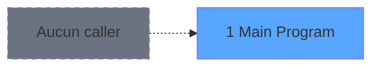

# WEL IDE 1 - Main Program

> **Analyse**: Phases 1-4 2026-02-03 21:09 -> 21:10 (18s) | Assemblage 21:10
> **Pipeline**: V7.2 Enrichi
> **Structure**: 4 onglets (Resume | Ecrans | Donnees | Connexions)

<!-- TAB:Resume -->

## 1. FICHE D'IDENTITE

| Attribut | Valeur |
|----------|--------|
| Projet | WEL |
| IDE Position | 1 |
| Nom Programme | Main Program |
| Fichier source | `Prg_1.xml` |
| Dossier IDE | General |
| Taches | 1 (1 ecrans visibles) |
| Tables modifiees | 0 |
| Programmes appeles | 4 |
| :warning: Statut | **ORPHELIN_POTENTIEL** |

## 2. DESCRIPTION FONCTIONNELLE

**Main Program** assure la gestion complete de ce processus.

Le flux de traitement s'organise en **1 blocs fonctionnels** :

- **Traitement** (1 tache) : traitements metier divers

## 3. BLOCS FONCTIONNELS

### 3.1 Traitement (1 tache)

Traitements internes.

---

#### 1 - MOBILE WELCOME [[ECRAN]](#ecran-t1)

**Role** : Traitement : MOBILE WELCOME.
**Ecran** : 320 x 200 DLU (Type11) | [Voir mockup](#ecran-t1)
**Delegue a** : [Lancement (IDE 34)](WEL-IDE-34.md), [Logon (IDE 54)](WEL-IDE-54.md), [Search ComputerName (IDE 84)](WEL-IDE-84.md)

## 5. REGLES METIER

*(Aucune regle metier identifiee)*

## 6. CONTEXTE

- **Appele par**: (aucun)
- **Appelle**: 4 programmes | **Tables**: 0 (W:0 R:0 L:0) | **Taches**: 1 | **Expressions**: 18

<!-- TAB:Ecrans -->

## 8. ECRANS

### 8.1 Forms visibles (1 / 1)

| # | Position | Tache | Nom | Type | Largeur | Hauteur | Bloc |
|---|----------|-------|-----|------|---------|---------|------|
| 1 | 1 | 1 | MOBILE WELCOME | Type11 | 320 | 200 | Traitement |

### 8.2 Mockups Ecrans

## 9. NAVIGATION

Ecran unique: **MOBILE WELCOME**

### 9.3 Structure hierarchique (1 tache)

| Position | Tache | Type | Dimensions | Bloc |
|----------|-------|------|------------|------|
| **1.1** | [**MOBILE WELCOME** (1)](#t1) [mockup](#ecran-t1) | Type11 | 320x200 | Traitement |

### 9.4 Algorigramme

> **Legende**: Vert = START/END OK | Rouge = END KO | Bleu = Decisions
> *Algorigramme auto-genere. Utiliser `/algorigramme` pour une synthese metier detaillee.*

<!-- TAB:Donnees -->

## 10. TABLES

### Tables utilisees (0)

| ID | Nom | Description | Type | R | W | L | Usages |
|----|-----|-------------|------|---|---|---|--------|

### Colonnes par table (0 / 0 tables avec colonnes identifiees)

## 11. VARIABLES

### 11.1 Variables globales (70)

Variables globales partagees entre programmes.

| Lettre | Nom | Type | Usage dans |
|--------|-----|------|-----------|
| A | VG.Title ecran | Alpha | - |
| B | VG.Nom bouton | Alpha | - |
| C | VG.Current Client Nom rech | Alpha | - |
| D | VG.Current Client Prenom rech | Alpha | - |
| E | VG.Societe | Alpha | - |
| F | VG.Code langue | Alpha | - |
| G | VG.Code lieu de sejour | Alpha | - |
| H | VG.Clause where | Alpha | - |
| I | VG.Current Compte client | Numeric | - |
| J | VG.Current Filiation client | Numeric | - |
| K | VG.Current Room | Alpha | - |
| L | VG.Langue utilisateur | Alpha | - |
| M | VG.N° club med pass | Alpha | - |
| N | VG.Color | Numeric | - |
| O | VG.LOGIN | Alpha | - |
| P | VG.Current date debut | Date | - |
| Q | VG.SRH date debut | Date | - |
| R | VG.SRH date Fin | Date | - |
| S | VG.SRH Room Cat | Unicode | - |
| T | VG.SRH Occupation | Numeric | - |
| U | VG.SRH Type Bed | Unicode | - |
| V | VG.SRH Etage | Unicode | - |
| W | VG.SRH Batiment | Unicode | - |
| X | VG.SRH Vue | Unicode | - |
| Y | VG.SRH Orientation | Unicode | - |
| Z | VG.Current date debut bloc/res | Date | - |
| BA | VG.Current date fin bloc/res | Date | - |
| BB | VG.Commentaire bloc/res | Alpha | - |
| BC | VG.Date Comptable Début | Date | - |
| BD | VG.Date Comptable Fin | Date | - |
| BE | VG.NB Lieu de sejour | Numeric | - |
| BF | VG.User | Alpha | - |
| BG | VG.Commentaire workflow | Alpha | - |
| BH | VG.Workflow validé | Logical | - |
| BI | VG.Workflow modifié | Logical | - |
| BJ | VG.Gift pass actif ? | Logical | - |
| BK | VG.Autom credit conso act  ? | Logical | - |
| BL | VG.MOPCMP | Alpha | - |
| BM | VG.CLACMP | Alpha | - |
| BN | VG.VRL actif ? | Logical | - |
| BO | VG.Transfert actif ? | Logical | 1x variable globale |
| BP | VG.Combo lieu de sejour | Alpha | 1x variable globale |
| BQ | VG.Lieu sejour defaut | Alpha | - |
| BR | VG.Proj interface TPE actif ? | Logical | - |
| BS | VG.Interface sur terminal | Logical | - |
| BT | VG.Num TPE | Alpha | - |
| BU | VG.Masque montant | Alpha | - |
| BV | VG.Tel village | Alpha | - |
| BW | VG.Fax village | Alpha | - |
| BY | VG SUPPORT (Tablette,WorkSt) | Alpha | - |
| BZ | VG COMPUTERNAME | Alpha | - |
| CA | VG.Nbre_Decimale | Numeric | - |
| CB | VG.Devise Locale | Unicode | - |
| CC | VG.Code_Village | Unicode | - |
| CD | VG.Nom_Village | Alpha | - |
| CE | VG.GM_GO | Unicode | - |
| CF | VG.Email | Alpha | - |
| CG | VG.Phone | Unicode | - |
| CH | VG.DROIT ACCES A TOUT ? | Logical | - |
| CI | VG.DROIT SUPERVISOR | Logical | - |
| CJ | VG.Groupe | Alpha | - |
| CK | VG.Affec chambre actif ? | Logical | - |
| CL | VG.Is admin | Logical | - |
| CM | VG.Droit access ADH | Logical | - |
| CN | VG.Gift pass V2.0 ACTIF ? | Logical | - |
| CO | VG.Cryptage MDP | Logical | - |
| CP | VG.RepertoireLocalTickets | Alpha | - |
| CQ | VG.RepertoireLocalImages | Alpha | - |
| CR | VG.Hostname au lieu de Term | Logical | - |
| CS | VG.Numéro pseudo terminal | Numeric | - |

### 11.2 Autres (1)

Variables diverses.

| Lettre | Nom | Type | Usage dans |
|--------|-----|------|-----------|
| BX | L.Login ok | Logical | - |

Toutes les 71 variables (liste complete)

| Cat | Lettre | Nom Variable | Type |
|-----|--------|--------------|------|
| VG | **A** | VG.Title ecran | Alpha |
| VG | **B** | VG.Nom bouton | Alpha |
| VG | **C** | VG.Current Client Nom rech | Alpha |
| VG | **D** | VG.Current Client Prenom rech | Alpha |
| VG | **E** | VG.Societe | Alpha |
| VG | **F** | VG.Code langue | Alpha |
| VG | **G** | VG.Code lieu de sejour | Alpha |
| VG | **H** | VG.Clause where | Alpha |
| VG | **I** | VG.Current Compte client | Numeric |
| VG | **J** | VG.Current Filiation client | Numeric |
| VG | **K** | VG.Current Room | Alpha |
| VG | **L** | VG.Langue utilisateur | Alpha |
| VG | **M** | VG.N° club med pass | Alpha |
| VG | **N** | VG.Color | Numeric |
| VG | **O** | VG.LOGIN | Alpha |
| VG | **P** | VG.Current date debut | Date |
| VG | **Q** | VG.SRH date debut | Date |
| VG | **R** | VG.SRH date Fin | Date |
| VG | **S** | VG.SRH Room Cat | Unicode |
| VG | **T** | VG.SRH Occupation | Numeric |
| VG | **U** | VG.SRH Type Bed | Unicode |
| VG | **V** | VG.SRH Etage | Unicode |
| VG | **W** | VG.SRH Batiment | Unicode |
| VG | **X** | VG.SRH Vue | Unicode |
| VG | **Y** | VG.SRH Orientation | Unicode |
| VG | **Z** | VG.Current date debut bloc/res | Date |
| VG | **BA** | VG.Current date fin bloc/res | Date |
| VG | **BB** | VG.Commentaire bloc/res | Alpha |
| VG | **BC** | VG.Date Comptable Début | Date |
| VG | **BD** | VG.Date Comptable Fin | Date |
| VG | **BE** | VG.NB Lieu de sejour | Numeric |
| VG | **BF** | VG.User | Alpha |
| VG | **BG** | VG.Commentaire workflow | Alpha |
| VG | **BH** | VG.Workflow validé | Logical |
| VG | **BI** | VG.Workflow modifié | Logical |
| VG | **BJ** | VG.Gift pass actif ? | Logical |
| VG | **BK** | VG.Autom credit conso act  ? | Logical |
| VG | **BL** | VG.MOPCMP | Alpha |
| VG | **BM** | VG.CLACMP | Alpha |
| VG | **BN** | VG.VRL actif ? | Logical |
| VG | **BO** | VG.Transfert actif ? | Logical |
| VG | **BP** | VG.Combo lieu de sejour | Alpha |
| VG | **BQ** | VG.Lieu sejour defaut | Alpha |
| VG | **BR** | VG.Proj interface TPE actif ? | Logical |
| VG | **BS** | VG.Interface sur terminal | Logical |
| VG | **BT** | VG.Num TPE | Alpha |
| VG | **BU** | VG.Masque montant | Alpha |
| VG | **BV** | VG.Tel village | Alpha |
| VG | **BW** | VG.Fax village | Alpha |
| VG | **BY** | VG SUPPORT (Tablette,WorkSt) | Alpha |
| VG | **BZ** | VG COMPUTERNAME | Alpha |
| VG | **CA** | VG.Nbre_Decimale | Numeric |
| VG | **CB** | VG.Devise Locale | Unicode |
| VG | **CC** | VG.Code_Village | Unicode |
| VG | **CD** | VG.Nom_Village | Alpha |
| VG | **CE** | VG.GM_GO | Unicode |
| VG | **CF** | VG.Email | Alpha |
| VG | **CG** | VG.Phone | Unicode |
| VG | **CH** | VG.DROIT ACCES A TOUT ? | Logical |
| VG | **CI** | VG.DROIT SUPERVISOR | Logical |
| VG | **CJ** | VG.Groupe | Alpha |
| VG | **CK** | VG.Affec chambre actif ? | Logical |
| VG | **CL** | VG.Is admin | Logical |
| VG | **CM** | VG.Droit access ADH | Logical |
| VG | **CN** | VG.Gift pass V2.0 ACTIF ? | Logical |
| VG | **CO** | VG.Cryptage MDP | Logical |
| VG | **CP** | VG.RepertoireLocalTickets | Alpha |
| VG | **CQ** | VG.RepertoireLocalImages | Alpha |
| VG | **CR** | VG.Hostname au lieu de Term | Logical |
| VG | **CS** | VG.Numéro pseudo terminal | Numeric |
| Autre | **BX** | L.Login ok | Logical |

## 12. EXPRESSIONS

**18 / 18 expressions decodees (100%)**

### 12.1 Repartition par type

| Type | Expressions | Regles |
|------|-------------|--------|
| CONCATENATION | 2 | 0 |
| CONSTANTE | 6 | 0 |
| CONDITION | 2 | 0 |
| OTHER | 6 | 0 |
| NEGATION | 2 | 0 |

### 12.2 Expressions cles par type

#### CONCATENATION (2 expressions)

| Type | IDE | Expression | Regle |
|------|-----|------------|-------|
| CONCATENATION | 11 | `'cmd /c  if not exist "' & Trim(VG.Combo lieu de sejour [BP]) & '" mkdir ' & Trim(VG.Combo lieu de sejour [BP])` | - |
| CONCATENATION | 10 | `'cmd /c  if not exist "' & Trim(VG.Transfert actif ? [BO]) & '" mkdir ' & Trim(VG.Transfert actif ? [BO])` | - |

#### CONSTANTE (6 expressions)

| Type | IDE | Expression | Regle |
|------|-----|------------|-------|
| CONSTANTE | 12 | `'CRY'` | - |
| CONSTANTE | 13 | `'1.00'` | - |
| CONSTANTE | 14 | `'T2H'` | - |
| CONSTANTE | 3 | `'TB'` | - |
| CONSTANTE | 8 | `'c:\data\Wel\tickets\'` | - |
| ... | | *+1 autres* | |

#### CONDITION (2 expressions)

| Type | IDE | Expression | Regle |
|------|-----|------------|-------|
| CONDITION | 4 | `Translate('%club_mobility%')='Y'` | - |
| CONDITION | 1 | `RunMode()<=2` | - |

#### OTHER (6 expressions)

| Type | IDE | Expression | Regle |
|------|-----|------------|-------|
| OTHER | 15 | `Term ()` | - |
| OTHER | 16 | `GetPseudoTerminal ()` | - |
| OTHER | 18 | `VG.Proj interface TPE ... [BR]` | - |
| OTHER | 2 | `MID([AZ],5,2)` | - |
| OTHER | 6 | `[AX]` | - |
| ... | | *+1 autres* | |

#### NEGATION (2 expressions)

| Type | IDE | Expression | Regle |
|------|-----|------------|-------|
| NEGATION | 17 | `NOT VG.Proj interface TPE ... [BR]` | - |
| NEGATION | 5 | `NOT [AX]` | - |

<!-- TAB:Connexions -->

## 13. GRAPHE D'APPELS

### 13.1 Chaine depuis Main (Callers)

**Chemin**: (pas de callers directs)

### 13.2 Callers

| IDE | Nom Programme | Nb Appels |
|-----|---------------|-----------|
| - | (aucun) | - |

### 13.3 Callees (programmes appeles)

### 13.4 Detail Callees avec contexte

| IDE | Nom Programme | Appels | Contexte |
|-----|---------------|--------|----------|
| [34](WEL-IDE-34.md) | Lancement | 1 | Sous-programme |
| [54](WEL-IDE-54.md) | Logon | 1 | Sous-programme |
| [84](WEL-IDE-84.md) | Search ComputerName | 1 | Sous-programme |
| [94](WEL-IDE-94.md) | SynchronisationRecuPDF | 1 | Recuperation donnees |

## 14. RECOMMANDATIONS MIGRATION

### 14.1 Profil du programme

| Metrique | Valeur | Impact migration |
|----------|--------|-----------------|
| Lignes de logique | 98 | Programme compact |
| Expressions | 18 | Peu de logique |
| Tables WRITE | 0 | Impact faible |
| Sous-programmes | 4 | Peu de dependances |
| Ecrans visibles | 1 | Ecran unique ou traitement batch |
| Code desactive | 0% (0 / 98) | Code sain |
| Regles metier | 0 | Pas de regle identifiee |

### 14.2 Plan de migration par bloc

#### Traitement (1 tache: 1 ecran, 0 traitement)

- **Strategie** : 1 composant(s) UI (Razor/React) avec formulaires et validation.
- 4 sous-programme(s) a migrer ou a reutiliser depuis les services existants.
- Decomposer les taches en services unitaires testables.

### 14.3 Dependances critiques

| Dependance | Type | Appels | Impact |
|------------|------|--------|--------|
| [Search ComputerName (IDE 84)](WEL-IDE-84.md) | Sous-programme | 1x | Normale - Sous-programme |
| [SynchronisationRecuPDF (IDE 94)](WEL-IDE-94.md) | Sous-programme | 1x | Normale - Recuperation donnees |
| [Lancement (IDE 34)](WEL-IDE-34.md) | Sous-programme | 1x | Normale - Sous-programme |
| [Logon (IDE 54)](WEL-IDE-54.md) | Sous-programme | 1x | Normale - Sous-programme |

---
*Spec DETAILED generee par Pipeline V7.2 - 2026-02-03 21:10*
