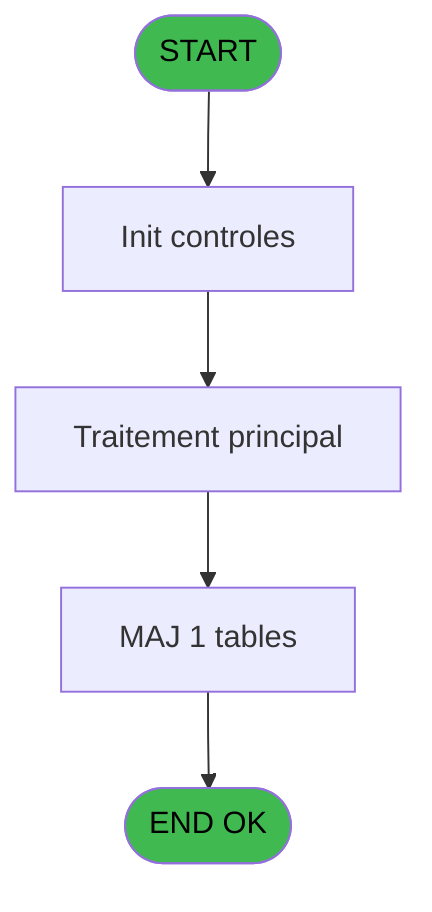
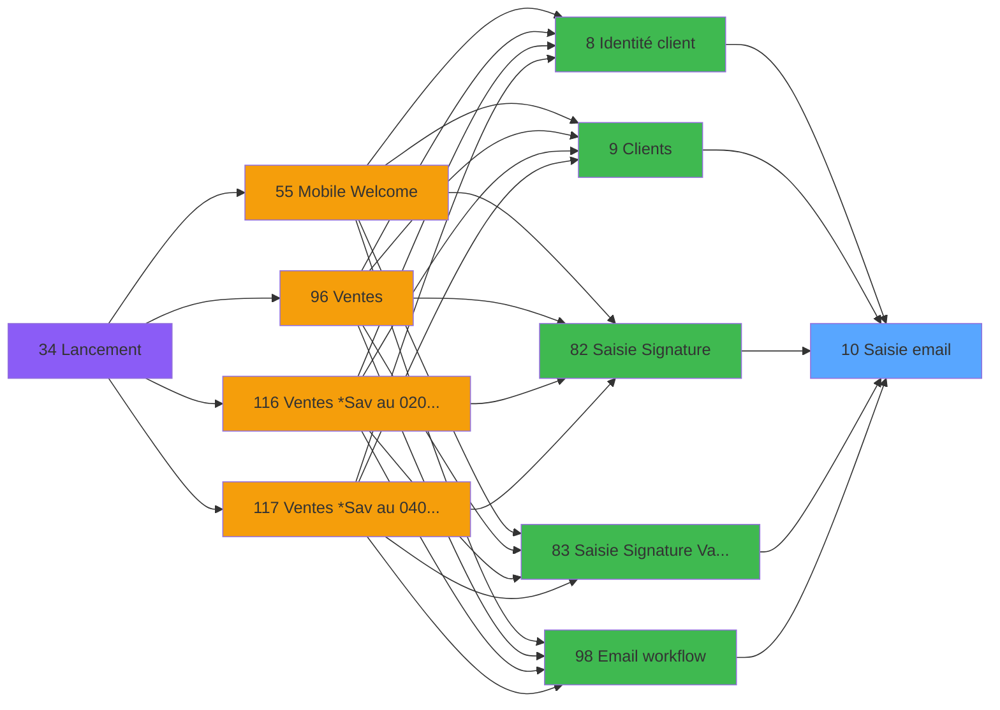
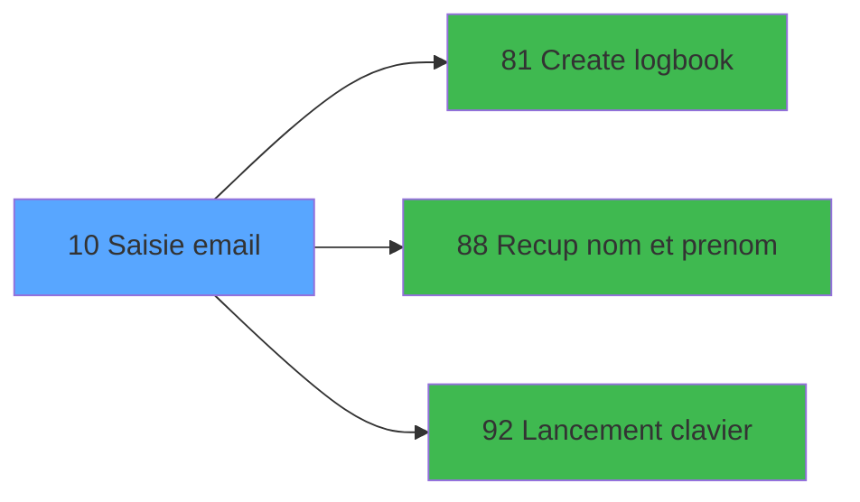

# WEL IDE 10 - Saisie email

> **Analyse**: Phases 1-4 2026-02-03 21:13 -> 21:14 (18s) | Assemblage 21:14
> **Pipeline**: V7.2 Enrichi
> **Structure**: 4 onglets (Resume | Ecrans | Donnees | Connexions)

<!-- TAB:Resume -->

## 1. FICHE D'IDENTITE

| Attribut | Valeur |
|----------|--------|
| Projet | WEL |
| IDE Position | 10 |
| Nom Programme | Saisie email |
| Fichier source | `Prg_10.xml` |
| Dossier IDE | Clients |
| Taches | 4 (0 ecrans visibles) |
| Tables modifiees | 1 |
| Programmes appeles | 3 |

## 2. DESCRIPTION FONCTIONNELLE

**Saisie email** assure la gestion complete de ce processus, accessible depuis [Identité client (IDE 8)](WEL-IDE-8.md), [Clients (IDE 9)](WEL-IDE-9.md), [Saisie Signature (IDE 82)](WEL-IDE-82.md), [Saisie Signature Validation (IDE 83)](WEL-IDE-83.md), [Email workflow (IDE 98)](WEL-IDE-98.md).

Le flux de traitement s'organise en **3 blocs fonctionnels** :

- **Traitement** (2 taches) : traitements metier divers
- **Creation** (1 tache) : insertion d'enregistrements en base (mouvements, prestations)
- **Saisie** (1 tache) : ecrans de saisie utilisateur (formulaires, champs, donnees)

**Donnees modifiees** : 1 tables en ecriture (email).

**Logique metier** : 2 regles identifiees couvrant conditions metier, valeurs par defaut.

Detail : phases du traitement

#### Phase 1 : Saisie (1 tache)

- **10** - Saisie email

#### Phase 2 : Traitement (2 taches)

- **10.1** - Update
- **10.2** - Lecture email

Delegue a : [Recup nom et prenom (IDE 88)](WEL-IDE-88.md), [Lancement clavier (IDE 92)](WEL-IDE-92.md)

#### Phase 3 : Creation (1 tache)

- **10.3** - Creation email

Delegue a : [Create logbook (IDE 81)](WEL-IDE-81.md)

#### Tables impactees

| Table | Operations | Role metier |
|-------|-----------|-------------|
| email | R/**W** (3 usages) |  |

## 3. BLOCS FONCTIONNELS

### 3.1 Saisie (1 tache)

Ce bloc traite la saisie des donnees de la transaction.

---

#### 10 - Saisie email

**Role** : Saisie des donnees : Saisie email.
**Variables liees** : H (V email texte), I (V email cnil), J (V email report filiation), K (V email etat libelle), M (V email etat code)

### 3.2 Traitement (2 taches)

Traitements internes.

---

#### 10.1 - Update

**Role** : Traitement : Update.
**Delegue a** : [Recup nom et prenom (IDE 88)](WEL-IDE-88.md), [Lancement clavier (IDE 92)](WEL-IDE-92.md)

---

#### 10.2 - Lecture email

**Role** : Traitement : Lecture email.
**Variables liees** : H (V email texte), I (V email cnil), J (V email report filiation), K (V email etat libelle), M (V email etat code)
**Delegue a** : [Recup nom et prenom (IDE 88)](WEL-IDE-88.md), [Lancement clavier (IDE 92)](WEL-IDE-92.md)

### 3.3 Creation (1 tache)

Insertion de nouveaux enregistrements en base.

---

#### 10.3 - Creation email

**Role** : Creation d'enregistrement : Creation email.
**Variables liees** : H (V email texte), I (V email cnil), J (V email report filiation), K (V email etat libelle), M (V email etat code)
**Delegue a** : [Create logbook (IDE 81)](WEL-IDE-81.md)

## 5. REGLES METIER

2 regles identifiees:

### Autres (2 regles)

#### [RM-001] Si VG6='FRA' alors 'Accepté sinon Refusé','Accepted,Refused')

| Element | Detail |
|---------|--------|
| **Condition** | `VG6='FRA'` |
| **Si vrai** | 'Accepté |
| **Si faux** | Refusé','Accepted,Refused') |
| **Expression source** | Expression 14 : `IF (VG6='FRA','Accepté,Refusé','Accepted,Refused')` |
| **Exemple** | Si VG6='FRA' → 'Accepté. Sinon → Refusé','Accepted,Refused') |

#### [RM-002] Valeur par defaut si V email cnil [I] est vide

| Element | Detail |
|---------|--------|
| **Condition** | `V email cnil [I]=''` |
| **Si vrai** | 'A' |
| **Si faux** | V email cnil [I]) |
| **Variables** | I (V email cnil) |
| **Expression source** | Expression 15 : `IF (V email cnil [I]='','A',V email cnil [I])` |
| **Exemple** | Si V email cnil [I]='' → 'A'. Sinon → V email cnil [I]) |

## 6. CONTEXTE

- **Appele par**: [Identité client (IDE 8)](WEL-IDE-8.md), [Clients (IDE 9)](WEL-IDE-9.md), [Saisie Signature (IDE 82)](WEL-IDE-82.md), [Saisie Signature Validation (IDE 83)](WEL-IDE-83.md), [Email workflow (IDE 98)](WEL-IDE-98.md)
- **Appelle**: 3 programmes | **Tables**: 2 (W:1 R:1 L:1) | **Taches**: 4 | **Expressions**: 22

<!-- TAB:Ecrans -->

## 8. ECRANS

*(Programme sans ecran visible)*

## 9. NAVIGATION

### 9.3 Structure hierarchique (4 taches)

| Position | Tache | Type | Dimensions | Bloc |
|----------|-------|------|------------|------|
| **10.1** | [**Saisie email** (10)](#t1) | MDI | - | Saisie |
| **10.2** | [**Update** (10.1)](#t2) | MDI | - | Traitement |
| 10.2.1 | [Lecture email (10.2)](#t3) | MDI | - | |
| **10.3** | [**Creation email** (10.3)](#t4) | MDI | - | Creation |

### 9.4 Algorigramme

> **Legende**: Vert = START/END OK | Rouge = END KO | Bleu = Decisions
> *Algorigramme auto-genere. Utiliser `/algorigramme` pour une synthese metier detaillee.*

<!-- TAB:Donnees -->

## 10. TABLES

### Tables utilisees (2)

| ID | Nom | Description | Type | R | W | L | Usages |
|----|-----|-------------|------|---|---|---|--------|
| 285 | email |  | DB | R | **W** |   | 3 |
| 700 | email_parametres |  | DB |   |   | L | 2 |

### Colonnes par table (2 / 1 tables avec colonnes identifiees)

Table 285 - email (R/**W**) - 3 usages

| Lettre | Variable | Acces | Type |
|--------|----------|-------|------|
| A | V ADHERENT | W | Numeric |
| B | V FILIATION adh | W | Numeric |
| C | V DOSSIER | W | Numeric |

## 11. VARIABLES

### 11.1 Variables de session (10)

Variables persistantes pendant toute la session.

| Lettre | Nom | Type | Usage dans |
|--------|-----|------|-----------|
| H | V email texte | Alpha | [10](#t1), [10.2](#t3), [10.3](#t4) |
| I | V email cnil | Alpha | [10](#t1), [10.2](#t3), [10.3](#t4) |
| J | V email report filiation | Logical | [10](#t1), [10.2](#t3), [10.3](#t4) |
| K | V email etat libelle | Alpha | [10](#t1), [10.2](#t3), [10.3](#t4) |
| L | V.Telephone mobile | Alpha | 3x session |
| M | V email etat code | Alpha | - |
| N | V Couleur | Numeric | - |
| S | V.Sortie loop | Logical | 1x session |
| T | V.Nom | Alpha | 1x session |
| U | V.Prenom | Alpha | 1x session |

### 11.2 Autres (11)

Variables diverses.

| Lettre | Nom | Type | Usage dans |
|--------|-----|------|-----------|
| A | param societe | Alpha | - |
| B | param compte | Numeric | - |
| C | param filiation | Numeric | - |
| D | param email texte | Alpha | - |
| E | param email cnil | Alpha | - |
| F | param email report filiation | Logical | - |
| G | Existe Email | Logical | - |
| O | LAST email | Alpha | [10](#t1), [10.2](#t3), [10.3](#t4) |
| P | LAST cnil | Alpha | 1x refs |
| Q | LAST report filiation | Logical | 1x refs |
| R | LAST Telephone portable | Alpha | 1x refs |

Toutes les 21 variables (liste complete)

| Cat | Lettre | Nom Variable | Type |
|-----|--------|--------------|------|
| V. | **H** | V email texte | Alpha |
| V. | **I** | V email cnil | Alpha |
| V. | **J** | V email report filiation | Logical |
| V. | **K** | V email etat libelle | Alpha |
| V. | **L** | V.Telephone mobile | Alpha |
| V. | **M** | V email etat code | Alpha |
| V. | **N** | V Couleur | Numeric |
| V. | **S** | V.Sortie loop | Logical |
| V. | **T** | V.Nom | Alpha |
| V. | **U** | V.Prenom | Alpha |
| Autre | **A** | param societe | Alpha |
| Autre | **B** | param compte | Numeric |
| Autre | **C** | param filiation | Numeric |
| Autre | **D** | param email texte | Alpha |
| Autre | **E** | param email cnil | Alpha |
| Autre | **F** | param email report filiation | Logical |
| Autre | **G** | Existe Email | Logical |
| Autre | **O** | LAST email | Alpha |
| Autre | **P** | LAST cnil | Alpha |
| Autre | **Q** | LAST report filiation | Logical |
| Autre | **R** | LAST Telephone portable | Alpha |

## 12. EXPRESSIONS

**22 / 22 expressions decodees (100%)**

### 12.1 Repartition par type

| Type | Expressions | Regles |
|------|-------------|--------|
| CONDITION | 16 | 2 |
| CALCULATION | 1 | 0 |
| CONCATENATION | 2 | 0 |
| CONSTANTE | 1 | 0 |
| CAST_LOGIQUE | 1 | 0 |
| OTHER | 1 | 0 |

### 12.2 Expressions cles par type

#### CONDITION (16 expressions)

| Type | IDE | Expression | Regle |
|------|-----|------------|-------|
| CONDITION | 15 | `IF (V email cnil [I]='','A',V email cnil [I])` | [RM-002](#rm-RM-002) |
| CONDITION | 14 | `IF (VG6='FRA','Accepté,Refusé','Accepted,Refused')` | [RM-001](#rm-RM-001) |
| CONDITION | 11 | `V email cnil [I]='A' AND V email texte [H]=''` | - |
| CONDITION | 4 | `InStr (V email texte [H],ASCIIChr (64))=0` | - |
| CONDITION | 10 | `V email cnil [I]='' AND V email texte [H]<>''` | - |
| ... | | *+11 autres* | |

#### CALCULATION (1 expressions)

| Type | IDE | Expression | Regle |
|------|-----|------------|-------|
| CALCULATION | 13 | `MlsTrans ('NO, I don''t accept any promotional offers by e-mail from Club Med')` | - |

#### CONCATENATION (2 expressions)

| Type | IDE | Expression | Regle |
|------|-----|------------|-------|
| CONCATENATION | 21 | `MlsTrans('Update adresse mail, new mail :')&' '&Trim(V email texte [H])` | - |
| CONCATENATION | 22 | `MlsTrans('EMAIL -')&' '&Trim(V.Nom [T])&' '&Trim(V.Prenom [U])` | - |

#### CONSTANTE (1 expressions)

| Type | IDE | Expression | Regle |
|------|-----|------------|-------|
| CONSTANTE | 20 | `'UPDMAIL'` | - |

#### CAST_LOGIQUE (1 expressions)

| Type | IDE | Expression | Regle |
|------|-----|------------|-------|
| CAST_LOGIQUE | 18 | `'TRUE'LOG` | - |

#### OTHER (1 expressions)

| Type | IDE | Expression | Regle |
|------|-----|------------|-------|
| OTHER | 19 | `V email etat libelle [K]` | - |

### 12.3 Toutes les expressions (22)

Voir les 22 expressions

#### CONDITION (16)

| IDE | Expression Decodee |
|-----|-------------------|
| 5 | `InStr (MID (V email texte [H],InStr (V email texte [H],ASCIIChr (64))+1,129),ASCIIChr (64))>0` |
| 7 | `Len (Trim (Left (V email texte [H],InStr (V email texte [H],ASCIIChr (64))-1)))<2` |
| 12 | `MlsTrans ('Accepted = YES, I accept any promotional offers by e-mail from Club Med')` |
| 17 | `(ASCIIVal(MID(V.Telephone mobile [L],LoopCounter(),1))<48 OR ASCIIVal(MID(V.Telephone mobile [L],LoopCounter(),1))>57) AND MID(V.Telephone mobile [L],LoopCounter(),1)<>'+' AND MID(V.Telephone mobile [L],LoopCounter(),1)<>'(' AND MID(V.Telephone mobile [L],LoopCounter(),1)<>')'` |
| 14 | `IF (VG6='FRA','Accepté,Refusé','Accepted,Refused')` |
| 15 | `IF (V email cnil [I]='','A',V email cnil [I])` |
| 1 | `VG51='TB'` |
| 2 | `V email texte [H]<>LAST email [O] OR V email cnil [I]<>LAST cnil [P] OR V email report filiation [J]<>LAST report filiation [Q] OR V.Telephone mobile [L]<>LAST Telephone portable [R]` |
| 3 | `V email texte [H]<>''` |
| 10 | `V email cnil [I]='' AND V email texte [H]<>''` |
| 11 | `V email cnil [I]='A' AND V email texte [H]=''` |
| 4 | `InStr (V email texte [H],ASCIIChr (64))=0` |
| 6 | `InStr (V email texte [H],',')>0 OR InStr (V email texte [H],';')>0 OR InStr (Trim (V email texte [H]),' ')>0` |
| 8 | `InStr (Right (Trim (V email texte [H]),4),'.')=0` |
| 9 | `InStr (Right (Trim (V email texte [H]),2),'.')>0` |
| 16 | `LoopCounter()<=Len(Trim(V.Telephone mobile [L])) AND NOT V.Sortie loop [S]` |

#### CALCULATION (1)

| IDE | Expression Decodee |
|-----|-------------------|
| 13 | `MlsTrans ('NO, I don''t accept any promotional offers by e-mail from Club Med')` |

#### CONCATENATION (2)

| IDE | Expression Decodee |
|-----|-------------------|
| 22 | `MlsTrans('EMAIL -')&' '&Trim(V.Nom [T])&' '&Trim(V.Prenom [U])` |
| 21 | `MlsTrans('Update adresse mail, new mail :')&' '&Trim(V email texte [H])` |

#### CONSTANTE (1)

| IDE | Expression Decodee |
|-----|-------------------|
| 20 | `'UPDMAIL'` |

#### CAST_LOGIQUE (1)

| IDE | Expression Decodee |
|-----|-------------------|
| 18 | `'TRUE'LOG` |

#### OTHER (1)

| IDE | Expression Decodee |
|-----|-------------------|
| 19 | `V email etat libelle [K]` |

<!-- TAB:Connexions -->

## 13. GRAPHE D'APPELS

### 13.1 Chaine depuis Main (Callers)

Main -> ... -> [Identité client (IDE 8)](WEL-IDE-8.md) -> **Saisie email (IDE 10)**

Main -> ... -> [Clients (IDE 9)](WEL-IDE-9.md) -> **Saisie email (IDE 10)**

Main -> ... -> [Saisie Signature (IDE 82)](WEL-IDE-82.md) -> **Saisie email (IDE 10)**

Main -> ... -> [Saisie Signature Validation (IDE 83)](WEL-IDE-83.md) -> **Saisie email (IDE 10)**

Main -> ... -> [Email workflow (IDE 98)](WEL-IDE-98.md) -> **Saisie email (IDE 10)**

### 13.2 Callers

| IDE | Nom Programme | Nb Appels |
|-----|---------------|-----------|
| [8](WEL-IDE-8.md) | Identité client | 1 |
| [9](WEL-IDE-9.md) | Clients | 1 |
| [82](WEL-IDE-82.md) | Saisie Signature | 1 |
| [83](WEL-IDE-83.md) | Saisie Signature Validation | 1 |
| [98](WEL-IDE-98.md) | Email workflow | 1 |

### 13.3 Callees (programmes appeles)

### 13.4 Detail Callees avec contexte

| IDE | Nom Programme | Appels | Contexte |
|-----|---------------|--------|----------|
| [81](WEL-IDE-81.md) | Create logbook | 1 | Sous-programme |
| [88](WEL-IDE-88.md) | Recup nom et prenom | 1 | Recuperation donnees |
| [92](WEL-IDE-92.md) | Lancement clavier | 1 | Sous-programme |

## 14. RECOMMANDATIONS MIGRATION

### 14.1 Profil du programme

| Metrique | Valeur | Impact migration |
|----------|--------|-----------------|
| Lignes de logique | 183 | Programme compact |
| Expressions | 22 | Peu de logique |
| Tables WRITE | 1 | Impact faible |
| Sous-programmes | 3 | Peu de dependances |
| Ecrans visibles | 0 | Ecran unique ou traitement batch |
| Code desactive | 0% (0 / 183) | Code sain |
| Regles metier | 2 | Quelques regles a preserver |

### 14.2 Plan de migration par bloc

#### Saisie (1 tache: 0 ecran, 1 traitement)

- **Strategie** : Formulaire React/Blazor avec validation Zod/FluentValidation.
- Validation temps reel cote client + serveur

#### Traitement (2 taches: 0 ecran, 2 traitements)

- **Strategie** : 2 service(s) backend injectable(s) (Domain Services).
- 3 sous-programme(s) a migrer ou a reutiliser depuis les services existants.
- Decomposer les taches en services unitaires testables.

#### Creation (1 tache: 0 ecran, 1 traitement)

- **Strategie** : Repository pattern avec Entity Framework Core.
- Insertion via `IRepository<T>.CreateAsync()`

### 14.3 Dependances critiques

| Dependance | Type | Appels | Impact |
|------------|------|--------|--------|
| email | Table WRITE (Database) | 2x | Schema + repository |
| [Lancement clavier (IDE 92)](WEL-IDE-92.md) | Sous-programme | 1x | Normale - Sous-programme |
| [Recup nom et prenom (IDE 88)](WEL-IDE-88.md) | Sous-programme | 1x | Normale - Recuperation donnees |
| [Create logbook (IDE 81)](WEL-IDE-81.md) | Sous-programme | 1x | Normale - Sous-programme |

---
*Spec DETAILED generee par Pipeline V7.2 - 2026-02-03 21:14*
