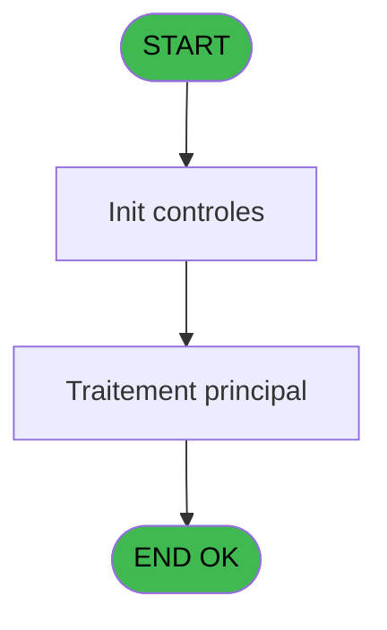
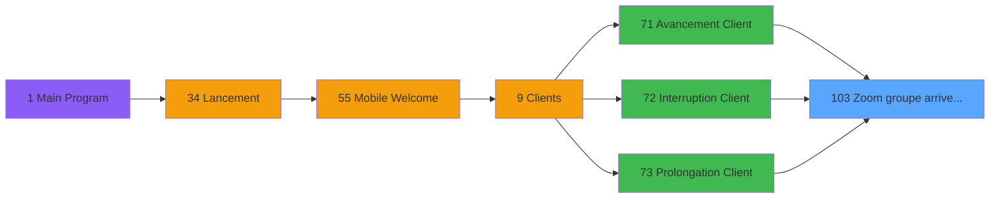

# WEL IDE 103 - Zoom groupe arrivee depart

> **Analyse**: Phases 1-4 2026-02-03 21:46 -> 21:46 (17s) | Assemblage 21:47
> **Pipeline**: V7.2 Enrichi
> **Structure**: 4 onglets (Resume | Ecrans | Donnees | Connexions)

<!-- TAB:Resume -->

## 1. FICHE D'IDENTITE

| Attribut | Valeur |
|----------|--------|
| Projet | WEL |
| IDE Position | 103 |
| Nom Programme | Zoom groupe arrivee depart |
| Fichier source | `Prg_103.xml` |
| Dossier IDE | Zoom |
| Taches | 1 (1 ecrans visibles) |
| Tables modifiees | 0 |
| Programmes appeles | 1 |

## 2. DESCRIPTION FONCTIONNELLE

**Zoom groupe arrivee depart** assure la gestion complete de ce processus, accessible depuis [   Avancement Client (IDE 71)](WEL-IDE-71.md), [   Prolongation Client (IDE 73)](WEL-IDE-73.md), [   Interruption Client (IDE 72)](WEL-IDE-72.md).

Le flux de traitement s'organise en **1 blocs fonctionnels** :

- **Consultation** (1 tache) : ecrans de recherche, selection et consultation

**Logique metier** : 2 regles identifiees couvrant conditions metier, valeurs par defaut.

## 3. BLOCS FONCTIONNELS

### 3.1 Consultation (1 tache)

Ecrans de recherche et consultation.

---

#### 103 - Zoom groupe arrivee depart [[ECRAN]](#ecran-t1)

**Role** : Selection par l'operateur : Zoom groupe arrivee depart.
**Ecran** : 1313 x 744 DLU | [Voir mockup](#ecran-t1)

## 5. REGLES METIER

2 regles identifiees:

### Consultation (1 regles)

#### [RM-002] Si P.Selection A/R [I]='A' alors MlsTrans('ARRIVAL GROUP') sinon MlsTrans('DEPARTURE GROUP'))

| Element | Detail |
|---------|--------|
| **Condition** | `P.Selection A/R [I]='A'` |
| **Si vrai** | MlsTrans('ARRIVAL GROUP') |
| **Si faux** | MlsTrans('DEPARTURE GROUP')) |
| **Variables** | I (P.Selection A/R) |
| **Expression source** | Expression 10 : `IF(P.Selection A/R [I]='A',MlsTrans('ARRIVAL GROUP'),MlsTran` |
| **Exemple** | Si P.Selection A/R [I]='A' → MlsTrans('ARRIVAL GROUP'). Sinon → MlsTrans('DEPARTURE GROUP')) |
| **Impact** | Bloc Consultation |

### Autres (1 regles)

#### [RM-001] Valeur par defaut si [N] est vide

| Element | Detail |
|---------|--------|
| **Condition** | `[N]=''` |
| **Si vrai** | '' |
| **Si faux** | ':00') |
| **Expression source** | Expression 8 : `IF ([N]='','',':00')` |
| **Exemple** | Si [N]='' → ''. Sinon → ':00') |

## 6. CONTEXTE

- **Appele par**: [   Avancement Client (IDE 71)](WEL-IDE-71.md), [   Prolongation Client (IDE 73)](WEL-IDE-73.md), [   Interruption Client (IDE 72)](WEL-IDE-72.md)
- **Appelle**: 1 programmes | **Tables**: 2 (W:0 R:1 L:1) | **Taches**: 1 | **Expressions**: 21

<!-- TAB:Ecrans -->

## 8. ECRANS

### 8.1 Forms visibles (1 / 1)

| # | Position | Tache | Nom | Type | Largeur | Hauteur | Bloc |
|---|----------|-------|-----|------|---------|---------|------|
| 1 | 103 | 103 | Zoom groupe arrivee depart | Type0 | 1313 | 744 | Consultation |

### 8.2 Mockups Ecrans

---

#### 103 - Zoom groupe arrivee depart
**Tache** : [103](#t1) | **Type** : Type0 | **Dimensions** : 1313 x 744 DLU
**Bloc** : Consultation | **Titre IDE** : Zoom groupe arrivee depart

<!-- FORM-DATA:
{
    "width":  1313,
    "vFactor":  100,
    "type":  "Type0",
    "hFactor":  100,
    "controls":  [
                     {
                         "x":  182,
                         "type":  "label",
                         "var":  "",
                         "y":  0,
                         "w":  1130,
                         "fmt":  "",
                         "name":  "",
                         "h":  66,
                         "color":  "212",
                         "text":  "ARRIVAL/DEPARTURE GROUP",
                         "parent":  null
                     },
                     {
                         "x":  271,
                         "type":  "label",
                         "var":  "",
                         "y":  98,
                         "w":  120,
                         "fmt":  "",
                         "name":  "",
                         "h":  44,
                         "color":  "",
                         "text":  "FLIGHT CODE",
                         "parent":  null
                     },
                     {
                         "x":  390,
                         "type":  "label",
                         "var":  "",
                         "y":  98,
                         "w":  127,
                         "fmt":  "",
                         "name":  "",
                         "h":  44,
                         "color":  "",
                         "text":  "CITY",
                         "parent":  null
                     },
                     {
                         "x":  516,
                         "type":  "label",
                         "var":  "",
                         "y":  98,
                         "w":  139,
                         "fmt":  "",
                         "name":  "",
                         "h":  44,
                         "color":  "",
                         "text":  "TIME",
                         "parent":  null
                     },
                     {
                         "x":  654,
                         "type":  "label",
                         "var":  "",
                         "y":  98,
                         "w":  333,
                         "fmt":  "",
                         "name":  "",
                         "h":  44,
                         "color":  "",
                         "text":  "LABEL",
                         "parent":  null
                     },
                     {
                         "x":  577,
                         "type":  "label",
                         "var":  "",
                         "y":  633,
                         "w":  173,
                         "fmt":  "",
                         "name":  "SELECT",
                         "h":  88,
                         "color":  "",
                         "text":  "SELECT",
                         "parent":  null
                     },
                     {
                         "x":  272,
                         "type":  "table",
                         "var":  "",
                         "name":  "",
                         "titleH":  12,
                         "color":  "",
                         "w":  716,
                         "y":  139,
                         "fmt":  "",
                         "parent":  null,
                         "text":  "",
                         "rowH":  44,
                         "h":  443,
                         "cols":  [
                                      {
                                          "title":  "vol_code_vol",
                                          "layer":  1,
                                          "w":  116
                                      },
                                      {
                                          "title":  "vol_ville",
                                          "layer":  2,
                                          "w":  126
                                      },
                                      {
                                          "title":  "vol_heure",
                                          "layer":  3,
                                          "w":  138
                                      },
                                      {
                                          "title":  "libelle_trente",
                                          "layer":  4,
                                          "w":  328
                                      }
                                  ],
                         "rows":  4
                     },
                     {
                         "x":  0,
                         "type":  "image",
                         "var":  "",
                         "y":  0,
                         "w":  173,
                         "fmt":  "",
                         "name":  "RETOUR",
                         "h":  66,
                         "color":  "226",
                         "text":  "",
                         "parent":  null
                     },
                     {
                         "x":  986,
                         "type":  "button",
                         "var":  "",
                         "y":  97,
                         "w":  56,
                         "fmt":  "",
                         "name":  "",
                         "h":  243,
                         "color":  "",
                         "text":  "",
                         "parent":  null
                     },
                     {
                         "x":  275,
                         "type":  "edit",
                         "var":  "",
                         "y":  144,
                         "w":  112,
                         "fmt":  "U6",
                         "name":  "vol_code_vol",
                         "h":  36,
                         "color":  "",
                         "text":  "",
                         "parent":  9
                     },
                     {
                         "x":  394,
                         "type":  "edit",
                         "var":  "",
                         "y":  144,
                         "w":  118,
                         "fmt":  "",
                         "name":  "vol_ville",
                         "h":  36,
                         "color":  "",
                         "text":  "",
                         "parent":  9
                     },
                     {
                         "x":  520,
                         "type":  "edit",
                         "var":  "",
                         "y":  144,
                         "w":  59,
                         "fmt":  "2P0",
                         "name":  "vol_heure",
                         "h":  36,
                         "color":  "",
                         "text":  "",
                         "parent":  9
                     },
                     {
                         "x":  592,
                         "type":  "edit",
                         "var":  "",
                         "y":  144,
                         "w":  59,
                         "fmt":  "3",
                         "name":  "",
                         "h":  36,
                         "color":  "",
                         "text":  "",
                         "parent":  9
                     },
                     {
                         "x":  657,
                         "type":  "edit",
                         "var":  "",
                         "y":  144,
                         "w":  327,
                         "fmt":  "UX29",
                         "name":  "libelle_trente",
                         "h":  36,
                         "color":  "",
                         "text":  "",
                         "parent":  9
                     },
                     {
                         "x":  986,
                         "type":  "button",
                         "var":  "",
                         "y":  337,
                         "w":  56,
                         "fmt":  "",
                         "name":  "",
                         "h":  243,
                         "color":  "",
                         "text":  "",
                         "parent":  null
                     }
                 ],
    "taskId":  "103",
    "height":  744
}
-->

<strong>Champs : 5 champs</strong>

| Pos (x,y) | Nom | Variable | Type |
|-----------|-----|----------|------|
| 275,144 | vol_code_vol | - | edit |
| 394,144 | vol_ville | - | edit |
| 520,144 | vol_heure | - | edit |
| 592,144 | 3 | - | edit |
| 657,144 | libelle_trente | - | edit |

<strong>Boutons : 2 boutons</strong>

| Bouton | Pos (x,y) | Action |
|--------|-----------|--------|
| (sans nom) | 986,97 | Action declenchee |
| (sans nom) | 986,337 | Action declenchee |

## 9. NAVIGATION

Ecran unique: **Zoom groupe arrivee depart**

### 9.3 Structure hierarchique (1 tache)

| Position | Tache | Type | Dimensions | Bloc |
|----------|-------|------|------------|------|
| **103.1** | [**Zoom groupe arrivee depart** (103)](#t1) [mockup](#ecran-t1) | - | 1313x744 | Consultation |

### 9.4 Algorigramme

> **Legende**: Vert = START/END OK | Rouge = END KO | Bleu = Decisions
> *Algorigramme auto-genere. Utiliser `/algorigramme` pour une synthese metier detaillee.*

<!-- TAB:Donnees -->

## 10. TABLES

### Tables utilisees (2)

| ID | Nom | Description | Type | R | W | L | Usages |
|----|-----|-------------|------|---|---|---|--------|
| 112 | tables_paris |  | DB | R |   |   | 1 |
| 134 | groupe_arr_dep___vol |  | DB |   |   | L | 1 |

### Colonnes par table (1 / 1 tables avec colonnes identifiees)

Table 112 - tables_paris (R) - 1 usages

| Lettre | Variable | Acces | Type |
|--------|----------|-------|------|
| A | P.Code langue | R | Alpha |
| B | P.Date debut | R | Date |
| C | P.Heure debut | R | Alpha |
| D | P.Code vol | R | Alpha |
| E | P.Accord suite | R | Alpha |
| F | P.Transport | R | Alpha |
| G | P.Ville | R | Alpha |
| H | P.Libelle transport | R | Alpha |
| I | P.Selection A/R | R | Alpha |

## 11. VARIABLES

### 11.1 Parametres entrants (9)

Variables recues du programme appelant ([   Avancement Client (IDE 71)](WEL-IDE-71.md)).

| Lettre | Nom | Type | Usage dans |
|--------|-----|------|-----------|
| A | P.Code langue | Alpha | - |
| B | P.Date debut | Date | 1x parametre entrant |
| C | P.Heure debut | Alpha | 1x parametre entrant |
| D | P.Code vol | Alpha | 1x parametre entrant |
| E | P.Accord suite | Alpha | - |
| F | P.Transport | Alpha | - |
| G | P.Ville | Alpha | - |
| H | P.Libelle transport | Alpha | 1x parametre entrant |
| I | P.Selection A/R | Alpha | 2x parametre entrant |

## 12. EXPRESSIONS

**21 / 21 expressions decodees (100%)**

### 12.1 Repartition par type

| Type | Expressions | Regles |
|------|-------------|--------|
| CALCULATION | 1 | 0 |
| CONDITION | 2 | 2 |
| CONSTANTE | 6 | 0 |
| REFERENCE_VG | 2 | 0 |
| OTHER | 7 | 0 |
| NEGATION | 1 | 0 |
| CONCATENATION | 1 | 0 |
| STRING | 1 | 0 |

### 12.2 Expressions cles par type

#### CALCULATION (1 expressions)

| Type | IDE | Expression | Regle |
|------|-----|------------|-------|
| CALCULATION | 6 | `MlsTrans('Call - Group departure/arrival list')` | - |

#### CONDITION (2 expressions)

| Type | IDE | Expression | Regle |
|------|-----|------------|-------|
| CONDITION | 10 | `IF(P.Selection A/R [I]='A',MlsTrans('ARRIVAL GROUP'),MlsTrans('DEPARTURE GROUP'))` | [RM-002](#rm-RM-002) |
| CONDITION | 8 | `IF ([N]='','',':00')` | [RM-001](#rm-RM-001) |

#### CONSTANTE (6 expressions)

| Type | IDE | Expression | Regle |
|------|-----|------------|-------|
| CONSTANTE | 11 | `'N'` | - |
| CONSTANTE | 12 | `'O'` | - |
| CONSTANTE | 19 | `'TTRAN'` | - |
| CONSTANTE | 4 | `'ZOOM_GROUP'` | - |
| CONSTANTE | 5 | `'SEL_GROUP'` | - |
| ... | | *+1 autres* | |

#### REFERENCE_VG (2 expressions)

| Type | IDE | Expression | Regle |
|------|-----|------------|-------|
| REFERENCE_VG | 20 | `VG12` | - |
| REFERENCE_VG | 1 | `VG5` | - |

#### OTHER (7 expressions)

| Type | IDE | Expression | Regle |
|------|-----|------------|-------|
| OTHER | 16 | `[O]` | - |
| OTHER | 17 | `[U]` | - |
| OTHER | 21 | `[P]` | - |
| OTHER | 15 | `[P]` | - |
| OTHER | 2 | `P.Selection A/R [I]` | - |
| ... | | *+2 autres* | |

#### NEGATION (1 expressions)

| Type | IDE | Expression | Regle |
|------|-----|------------|-------|
| NEGATION | 18 | `NOT EmptyDataview(0)` | - |

#### CONCATENATION (1 expressions)

| Type | IDE | Expression | Regle |
|------|-----|------------|-------|
| CONCATENATION | 7 | `MlsTrans('Select group : Flight code')&' '&Trim(P.Code vol [D])&' '&MlsTrans('Flight time')&' '&Trim(P.Heure debut [C])&' '&MlsTrans('Group')&' '&Trim(P.Libelle transport [H])` | - |

#### STRING (1 expressions)

| Type | IDE | Expression | Regle |
|------|-----|------------|-------|
| STRING | 13 | `Str ([Q],'2P0')&':00'` | - |

### 12.3 Toutes les expressions (21)

Voir les 21 expressions

#### CALCULATION (1)

| IDE | Expression Decodee |
|-----|-------------------|
| 6 | `MlsTrans('Call - Group departure/arrival list')` |

#### CONDITION (2)

| IDE | Expression Decodee |
|-----|-------------------|
| 8 | `IF ([N]='','',':00')` |
| 10 | `IF(P.Selection A/R [I]='A',MlsTrans('ARRIVAL GROUP'),MlsTrans('DEPARTURE GROUP'))` |

#### CONSTANTE (6)

| IDE | Expression Decodee |
|-----|-------------------|
| 4 | `'ZOOM_GROUP'` |
| 5 | `'SEL_GROUP'` |
| 9 | `'A'` |
| 11 | `'N'` |
| 12 | `'O'` |
| 19 | `'TTRAN'` |

#### REFERENCE_VG (2)

| IDE | Expression Decodee |
|-----|-------------------|
| 1 | `VG5` |
| 20 | `VG12` |

#### OTHER (7)

| IDE | Expression Decodee |
|-----|-------------------|
| 2 | `P.Selection A/R [I]` |
| 3 | `P.Date debut [B]` |
| 14 | `[N]` |
| 15 | `[P]` |
| 16 | `[O]` |
| 17 | `[U]` |
| 21 | `[P]` |

#### NEGATION (1)

| IDE | Expression Decodee |
|-----|-------------------|
| 18 | `NOT EmptyDataview(0)` |

#### CONCATENATION (1)

| IDE | Expression Decodee |
|-----|-------------------|
| 7 | `MlsTrans('Select group : Flight code')&' '&Trim(P.Code vol [D])&' '&MlsTrans('Flight time')&' '&Trim(P.Heure debut [C])&' '&MlsTrans('Group')&' '&Trim(P.Libelle transport [H])` |

#### STRING (1)

| IDE | Expression Decodee |
|-----|-------------------|
| 13 | `Str ([Q],'2P0')&':00'` |

<!-- TAB:Connexions -->

## 13. GRAPHE D'APPELS

### 13.1 Chaine depuis Main (Callers)

Main -> ... -> [   Avancement Client (IDE 71)](WEL-IDE-71.md) -> **Zoom groupe arrivee depart (IDE 103)**

Main -> ... -> [   Prolongation Client (IDE 73)](WEL-IDE-73.md) -> **Zoom groupe arrivee depart (IDE 103)**

Main -> ... -> [   Interruption Client (IDE 72)](WEL-IDE-72.md) -> **Zoom groupe arrivee depart (IDE 103)**

### 13.2 Callers

| IDE | Nom Programme | Nb Appels |
|-----|---------------|-----------|
| [71](WEL-IDE-71.md) |    Avancement Client | 2 |
| [73](WEL-IDE-73.md) |    Prolongation Client | 2 |
| [72](WEL-IDE-72.md) |    Interruption Client | 1 |

### 13.3 Callees (programmes appeles)

### 13.4 Detail Callees avec contexte

| IDE | Nom Programme | Appels | Contexte |
|-----|---------------|--------|----------|
| [81](WEL-IDE-81.md) | Create logbook | 2 | Sous-programme |

## 14. RECOMMANDATIONS MIGRATION

### 14.1 Profil du programme

| Metrique | Valeur | Impact migration |
|----------|--------|-----------------|
| Lignes de logique | 35 | Programme compact |
| Expressions | 21 | Peu de logique |
| Tables WRITE | 0 | Impact faible |
| Sous-programmes | 1 | Peu de dependances |
| Ecrans visibles | 1 | Ecran unique ou traitement batch |
| Code desactive | 0% (0 / 35) | Code sain |
| Regles metier | 2 | Quelques regles a preserver |

### 14.2 Plan de migration par bloc

#### Consultation (1 tache: 1 ecran, 0 traitement)

- **Strategie** : Composants de recherche/selection en modales.
- 1 ecran : Zoom groupe arrivee depart

### 14.3 Dependances critiques

| Dependance | Type | Appels | Impact |
|------------|------|--------|--------|
| [Create logbook (IDE 81)](WEL-IDE-81.md) | Sous-programme | 2x | Haute - Sous-programme |

---
*Spec DETAILED generee par Pipeline V7.2 - 2026-02-03 21:47*
